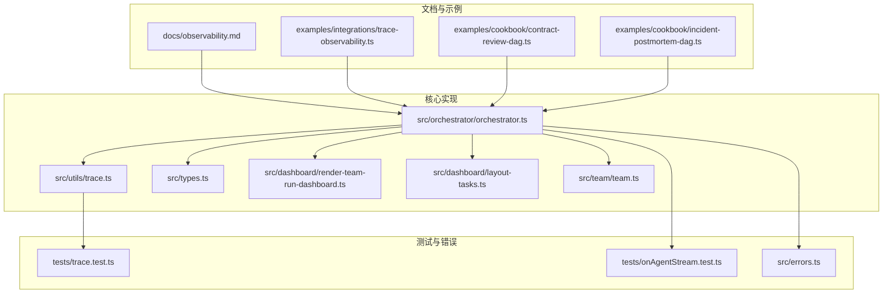
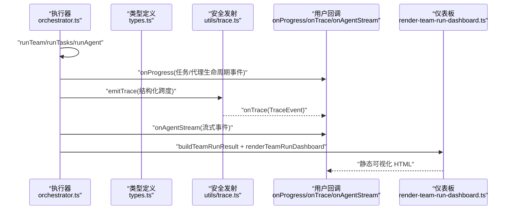
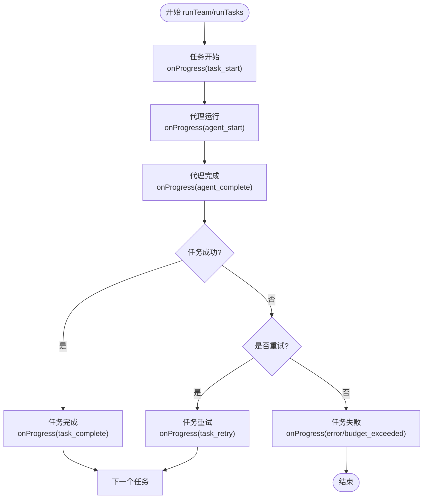
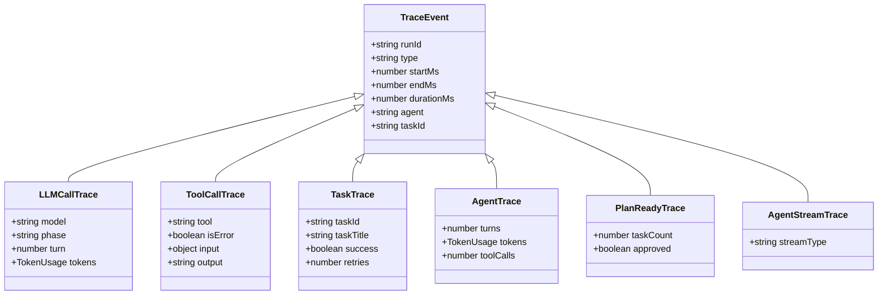
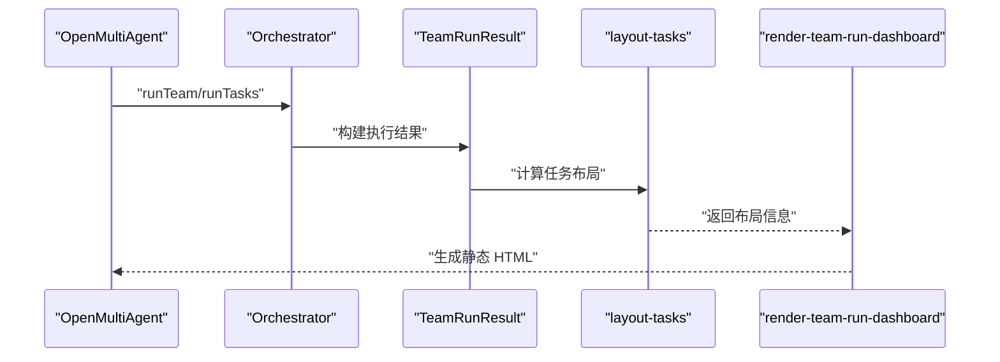
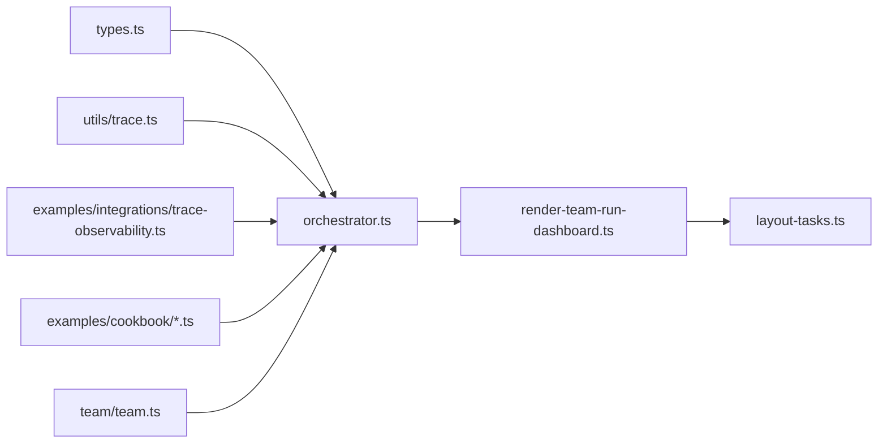

# 监控与可观测性

<cite>
**本文引用的文件**
- [docs/observability.md](file://docs/observability.md)
- [examples/integrations/trace-observability.ts](file://examples/integrations/trace-observability.ts)
- [src/utils/trace.ts](file://src/utils/trace.ts)
- [src/dashboard/render-team-run-dashboard.ts](file://src/dashboard/render-team-run-dashboard.ts)
- [src/dashboard/layout-tasks.ts](file://src/dashboard/layout-tasks.ts)
- [src/types.ts](file://src/types.ts)
- [src/orchestrator/orchestrator.ts](file://src/orchestrator/orchestrator.ts)
- [src/team/team.ts](file://src/team/team.ts)
- [tests/trace.test.ts](file://tests/trace.test.ts)
- [tests/onAgentStream.test.ts](file://tests/onAgentStream.test.ts)
- [examples/cookbook/contract-review-dag.ts](file://examples/cookbook/contract-review-dag.ts)
- [examples/cookbook/incident-postmortem-dag.ts](file://examples/cookbook/incident-postmortem-dag.ts)
- [src/errors.ts](file://src/errors.ts)
</cite>

## 目录
1. [简介](#简介)
2. [项目结构](#项目结构)
3. [核心组件](#核心组件)
4. [架构总览](#架构总览)
5. [详细组件分析](#详细组件分析)
6. [依赖关系分析](#依赖关系分析)
7. [性能考量](#性能考量)
8. [故障排查指南](#故障排查指南)
9. [结论](#结论)
10. [附录](#附录)

## 简介
本文件面向运维与平台工程团队，系统化阐述 Open Multi-Agent 框架在生产环境中的监控与可观测性方案。内容覆盖三类遥测层：轻量级进度事件、结构化追踪跨度（Trace Spans）以及运行后静态仪表板。文档重点说明链路追踪、进度回调与事件记录的配置与使用方式，并给出与 OpenTelemetry、Prometheus/Grafana 等生态的集成建议；同时提供自定义指标采集、告警规则与分布式追踪、日志聚合最佳实践，帮助快速定位性能瓶颈并进行故障诊断。

## 项目结构
围绕可观测性的关键目录与文件如下：
- 文档与示例
  - docs/observability.md：框架可观测性概览与使用指引
  - examples/integrations/trace-observability.ts：onTrace 回调示例
  - examples/cookbook/*.ts：进度事件与时间度量示例
- 核心实现
  - src/utils/trace.ts：安全发射 Trace 事件与生成 runId 工具
  - src/types.ts：TraceEvent 类型定义与进度事件类型
  - src/orchestrator/orchestrator.ts：在执行路径中注入 onTrace/onProgress/onAgentStream
  - src/dashboard/*：运行后仪表板渲染与布局
  - src/team/team.ts：团队事件总线（on/emit）
- 测试与错误类型
  - tests/trace.test.ts：emitTrace 行为测试
  - tests/onAgentStream.test.ts：流式回调异常隔离测试
  - src/errors.ts：预算超限等错误类型

**图表来源**
- [docs/observability.md:1-57](file://docs/observability.md#L1-L57)
- [examples/integrations/trace-observability.ts:1-144](file://examples/integrations/trace-observability.ts#L1-L144)
- [src/utils/trace.ts:1-35](file://src/utils/trace.ts#L1-L35)
- [src/types.ts:877-970](file://src/types.ts#L877-L970)
- [src/orchestrator/orchestrator.ts:676-722](file://src/orchestrator/orchestrator.ts#L676-L722)
- [src/dashboard/render-team-run-dashboard.ts:1-461](file://src/dashboard/render-team-run-dashboard.ts#L1-L461)
- [src/dashboard/layout-tasks.ts:1-99](file://src/dashboard/layout-tasks.ts#L1-L99)
- [src/team/team.ts:320-345](file://src/team/team.ts#L320-L345)
- [tests/trace.test.ts:90-176](file://tests/trace.test.ts#L90-L176)
- [tests/onAgentStream.test.ts:112-132](file://tests/onAgentStream.test.ts#L112-L132)
- [src/errors.ts:1-19](file://src/errors.ts#L1-L19)

**章节来源**
- [docs/observability.md:1-57](file://docs/observability.md#L1-L57)
- [examples/integrations/trace-observability.ts:1-144](file://examples/integrations/trace-observability.ts#L1-L144)

## 核心组件
- 进度事件（onProgress）
  - 用途：轻量生命周期事件，适用于日志、终端输出或实时 UI。
  - 常见事件类型：任务开始/完成/重试/跳过、代理开始/完成、预算超限、错误等。
  - 触发点：任务执行、代理运行、预算检查等阶段。
- 结构化追踪跨度（onTrace）
  - 用途：结构化跨度，记录 LLM 调用、工具执行、任务与代理运行的父 ID、时长、token 使用与工具 I/O。
  - 数据载体：TraceEvent 联合类型，包含 llm_call、tool_call、task、agent、plan_ready、agent_stream 等。
  - 关联能力：通过 runId 实现跨事件关联，便于重建完整执行时间线。
- 运行后仪表板（renderTeamRunDashboard）
  - 用途：生成静态 HTML 可视化，展示任务 DAG 的执行时间、token 使用、状态与详情。
  - 输出：HTML 文件，可作为复盘资产分享。
- 安全发射与运行 ID（emitTrace、generateRunId）
  - 用途：保证 onTrace 回调异常不中断执行；生成唯一 runId 用于跨事件关联。

**章节来源**
- [docs/observability.md:5-57](file://docs/observability.md#L5-L57)
- [src/types.ts:877-970](file://src/types.ts#L877-L970)
- [src/utils/trace.ts:12-35](file://src/utils/trace.ts#L12-L35)
- [src/dashboard/render-team-run-dashboard.ts:16-461](file://src/dashboard/render-team-run-dashboard.ts#L16-L461)

## 架构总览
下图展示了从执行到可观测数据产出的关键路径：执行器在任务与代理生命周期中触发进度事件与追踪跨度；用户通过 onProgress/onTrace/onAgentStream 订阅；最终可持久化 Trace 与结果以支持仪表板与后续分析。

**图表来源**
- [src/orchestrator/orchestrator.ts:676-722](file://src/orchestrator/orchestrator.ts#L676-L722)
- [src/types.ts:877-970](file://src/types.ts#L877-L970)
- [src/utils/trace.ts:12-35](file://src/utils/trace.ts#L12-L35)
- [src/dashboard/render-team-run-dashboard.ts:16-461](file://src/dashboard/render-team-run-dashboard.ts#L16-L461)

## 详细组件分析

### 组件一：进度事件与事件记录
- 配置入口
  - 在 OrchestratorConfig 中提供 onProgress 回调，用于接收生命周期事件。
- 事件类型
  - 包括 agent_start/complete、task_start/complete/retry/skipped、budget_exceeded、message、error 等。
- 使用建议
  - 将事件写入结构化日志系统（如 JSON 日志），并结合服务网格或日志聚合平台进行统一检索。
  - 对于实时 UI，可在 onProgress 中转发到 WebSocket 或前端事件通道。
- 示例参考
  - 合同审查 DAG 与事故复盘 DAG 示例展示了如何基于事件统计任务耗时与并行性验证。

**图表来源**
- [src/types.ts:741-755](file://src/types.ts#L741-L755)
- [examples/cookbook/contract-review-dag.ts:154-193](file://examples/cookbook/contract-review-dag.ts#L154-L193)
- [examples/cookbook/incident-postmortem-dag.ts:183-241](file://examples/cookbook/incident-postmortem-dag.ts#L183-L241)

**章节来源**
- [src/types.ts:741-755](file://src/types.ts#L741-L755)
- [examples/cookbook/contract-review-dag.ts:154-193](file://examples/cookbook/contract-review-dag.ts#L154-L193)
- [examples/cookbook/incident-postmortem-dag.ts:183-241](file://examples/cookbook/incident-postmortem-dag.ts#L183-L241)

### 组件二：结构化追踪跨度（onTrace）
- 数据模型
  - TraceEvent 联合类型：llm_call、tool_call、task、agent、plan_ready、agent_stream。
  - 共享字段：runId、type、startMs、endMs、durationMs、agent、taskId。
- 发射机制
  - emitTrace 安全包装回调，吞掉同步/异步错误，避免观测子系统影响主执行。
  - generateRunId 提供全局唯一 runId，用于跨事件关联。
- 使用场景
  - 将 TraceEvent 写入 OpenTelemetry、Datadog、Honeycomb、Langfuse 或自建运行数据库。
  - 结合 runId 与 taskId 构建端到端调用链，定位慢调用与失败根因。
- 示例参考
  - trace-observability 示例演示了如何在控制台打印每类跨度的耗时与 token 使用。

**图表来源**
- [src/types.ts:881-969](file://src/types.ts#L881-L969)

**章节来源**
- [src/utils/trace.ts:12-35](file://src/utils/trace.ts#L12-L35)
- [examples/integrations/trace-observability.ts:50-84](file://examples/integrations/trace-observability.ts#L50-L84)
- [tests/trace.test.ts:90-176](file://tests/trace.test.ts#L90-L176)

### 组件三：运行后仪表板（Post-Run Dashboard）
- 功能
  - 渲染静态 HTML，展示任务 DAG 的布局、节点状态、执行时间、token 使用与工具调用次数。
  - 支持缩放、拖拽与细节面板交互。
- 生成流程
  - 由 TeamRunResult 构造数据负载，经 layout-tasks 计算布局，再由 render-team-run-dashboard 生成 HTML。
- 生产建议
  - 将 HTML 与 Trace 事件、任务结果一起归档，作为可分享的复盘资产。
  - 如需离线查看，可内联样式与字体资源，避免网络依赖。

**图表来源**
- [src/dashboard/layout-tasks.ts:22-99](file://src/dashboard/layout-tasks.ts#L22-L99)
- [src/dashboard/render-team-run-dashboard.ts:16-461](file://src/dashboard/render-team-run-dashboard.ts#L16-L461)

**章节来源**
- [src/dashboard/render-team-run-dashboard.ts:16-461](file://src/dashboard/render-team-run-dashboard.ts#L16-L461)
- [src/dashboard/layout-tasks.ts:22-99](file://src/dashboard/layout-tasks.ts#L22-L99)

### 组件四：团队事件总线（on/emit）
- 用途
  - 团队级事件订阅与广播，便于业务域里程碑信号（如阶段完成）的解耦传递。
- 使用建议
  - 在 onProgress 之外，通过 team.on/emit 扩展领域事件，配合 onTrace 做端到端关联。

**章节来源**
- [src/team/team.ts:320-345](file://src/team/team.ts#L320-L345)

## 依赖关系分析
- 组件耦合
  - orchestrator.ts 依赖 types.ts 的事件与 TraceEvent 定义，并通过 utils/trace.ts 安全发射 onTrace。
  - dashboard 依赖 layout-tasks 的布局算法与 TeamRunResult 数据。
  - 用户示例（trace-observability、cookbook）演示 onProgress/onTrace 的组合使用。
- 外部依赖
  - 项目声明了 @opentelemetry/api，可用于对接 OpenTelemetry 生态。

**图表来源**
- [src/types.ts:877-970](file://src/types.ts#L877-L970)
- [src/orchestrator/orchestrator.ts:676-722](file://src/orchestrator/orchestrator.ts#L676-L722)
- [src/utils/trace.ts:12-35](file://src/utils/trace.ts#L12-L35)
- [src/dashboard/render-team-run-dashboard.ts:16-461](file://src/dashboard/render-team-run-dashboard.ts#L16-L461)
- [src/dashboard/layout-tasks.ts:22-99](file://src/dashboard/layout-tasks.ts#L22-L99)
- [examples/integrations/trace-observability.ts:90-93](file://examples/integrations/trace-observability.ts#L90-L93)
- [src/team/team.ts:320-345](file://src/team/team.ts#L320-L345)

**章节来源**
- [src/orchestrator/orchestrator.ts:676-722](file://src/orchestrator/orchestrator.ts#L676-L722)
- [src/utils/trace.ts:12-35](file://src/utils/trace.ts#L12-L35)
- [src/types.ts:877-970](file://src/types.ts#L877-L970)

## 性能考量
- 低开销进度事件
  - onProgress 适合轻量级观测，避免在高频流式事件中做昂贵操作。
- 追踪跨度粒度
  - llm_call/tool_call/task/agent 级别跨度可定位慢调用与高 token 使用。
- 并行与吞吐
  - 通过 onProgress 的任务开始/完成统计与示例中的并行性校验，评估并发策略效果。
- 资源与预算
  - budget_exceeded 事件可用于识别预算阈值设置与成本控制策略的有效性。

**章节来源**
- [examples/cookbook/contract-review-dag.ts:247-262](file://examples/cookbook/contract-review-dag.ts#L247-L262)
- [src/errors.ts:8-19](file://src/errors.ts#L8-L19)

## 故障排查指南
- 观测子系统异常隔离
  - emitTrace 会吞掉回调抛出的异常与未处理的 Promise 拒绝，避免影响主执行。
- 流式回调错误隔离
  - onAgentStream 的异常不会传播至主执行，保障运行稳定性。
- 常见问题定位
  - 使用 onTrace 的 runId 关联一次 run 的所有跨度，快速定位失败的 llm_call/tool_call。
  - 通过 onProgress 的 task_retry 与 error 事件定位重试与失败原因。
  - 利用仪表板核对任务状态与时间线，辅助回溯。

**章节来源**
- [tests/trace.test.ts:123-157](file://tests/trace.test.ts#L123-L157)
- [tests/onAgentStream.test.ts:112-132](file://tests/onAgentStream.test.ts#L112-L132)
- [src/utils/trace.ts:12-27](file://src/utils/trace.ts#L12-L27)

## 结论
Open Multi-Agent 框架提供了三层可观测性能力：轻量进度事件、结构化追踪跨度与运行后仪表板。通过 onProgress/onTrace/onAgentStream 的组合使用，结合 runId 关联与 TraceEvent 数据模型，运维团队可以实现端到端的链路追踪、成本与性能分析，并借助仪表板进行快速复盘。建议在生产环境中持久化 Trace 与结果，配合日志与指标系统，形成闭环的监控与告警体系。

## 附录

### 链路追踪与外部系统集成
- OpenTelemetry
  - 将 TraceEvent 写入 OpenTelemetry SDK，自动继承 runId、父跨度与时间戳，实现跨服务关联。
- Datadog/Honeycomb/Langfuse
  - 将 TraceEvent 映射为对应 SDK 的 Span，利用其 UI 进行调用链分析。
- 自建运行数据库
  - 将 TraceEvent 与任务元数据持久化，支持查询与报表。

**章节来源**
- [examples/integrations/trace-observability.ts:10-32](file://examples/integrations/trace-observability.ts#L10-L32)

### Prometheus 与 Grafana 集成
- 指标采集
  - 将 TraceEvent 中的 durationMs、token 使用、toolCalls 等映射为直方图/计数器指标。
  - 使用 onProgress 的任务完成/失败事件构造成功率与延迟指标。
- 告警规则示例
  - 任务失败率阈值告警
  - 平均任务时延超过阈值告警
  - 单次 LLM 调用 token 使用异常升高告警
- Grafana 可视化
  - 使用直方图面板展示延迟分布
  - 使用状态面板展示任务状态与重试趋势

[本节为通用实践建议，无需特定文件引用]

### 分布式追踪与日志聚合最佳实践
- 统一 traceId/runId
  - 在服务边界透传 runId，确保跨进程/服务一致关联。
- 结构化日志
  - 将 onProgress 与 TraceEvent 以 JSON 形式输出，便于日志平台检索与过滤。
- 日志聚合
  - 使用 ELK/Cloud Logging/Grafana Loki 等平台集中存储与查询。

[本节为通用实践建议，无需特定文件引用]

### 生产持久化清单
- TeamRunResult.tasks：已执行的任务 DAG 与状态
- TeamRunResult.totalTokenUsage：成本归属
- onTrace spans：LLM 调用与工具执行
- 仪表板 HTML：可分享的复盘资产

**章节来源**
- [docs/observability.md:49-57](file://docs/observability.md#L49-L57)