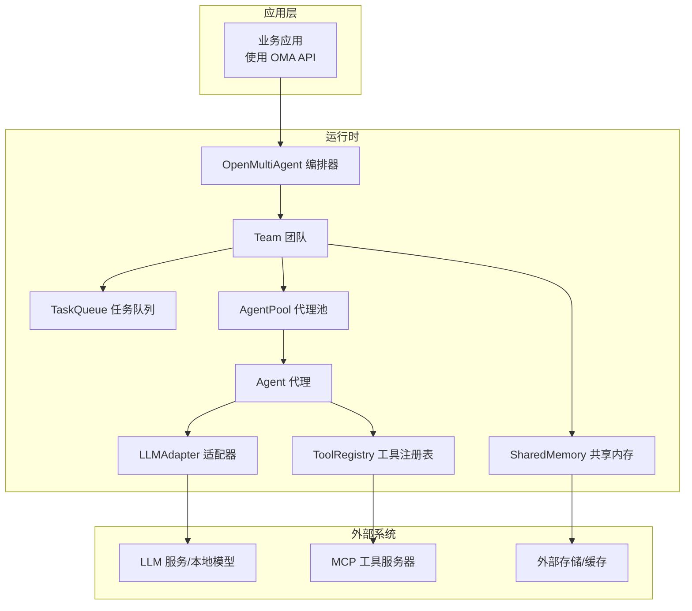
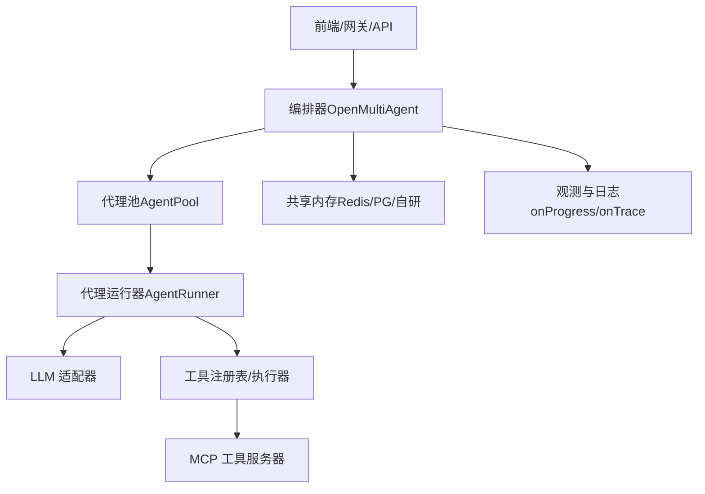
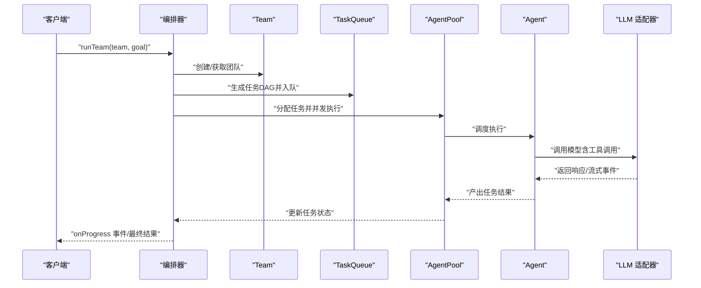
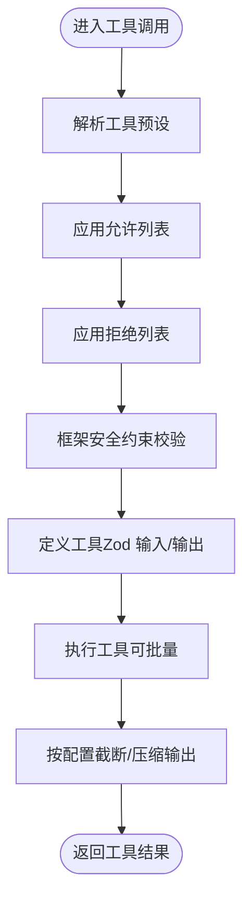
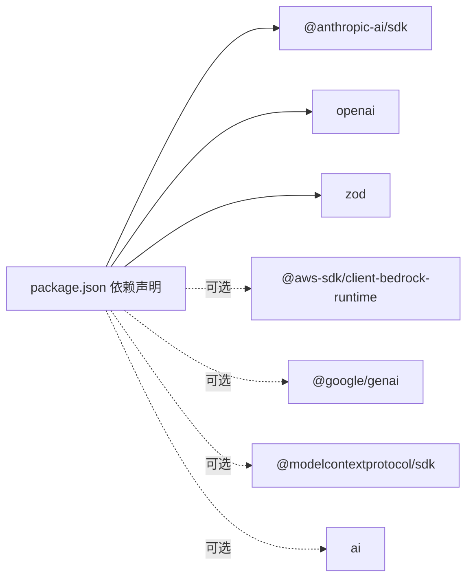

# 部署与生产

<cite>
**本文引用的文件**
- [package.json](file://package.json)
- [README.md](file://README.md)
- [examples/production/README.md](file://examples/production/README.md)
- [docs/observability.md](file://docs/observability.md)
- [docs/providers.md](file://docs/providers.md)
- [docs/shared-memory.md](file://docs/shared-memory.md)
- [docs/tool-configuration.md](file://docs/tool-configuration.md)
- [src/index.ts](file://src/index.ts)
- [src/types.ts](file://src/types.ts)
- [src/utils/trace.ts](file://src/utils/trace.ts)
- [src/cli/oma.ts](file://src/cli/oma.ts)
- [src/orchestrator/orchestrator.ts](file://src/orchestrator/orchestrator.ts)
- [tsconfig.json](file://tsconfig.json)
- [vitest.config.ts](file://vitest.config.ts)
</cite>

## 目录
1. [简介](#简介)
2. [项目结构](#项目结构)
3. [核心组件](#核心组件)
4. [架构总览](#架构总览)
5. [详细组件分析](#详细组件分析)
6. [依赖关系分析](#依赖关系分析)
7. [性能考量](#性能考量)
8. [故障排查指南](#故障排查指南)
9. [结论](#结论)
10. [附录](#附录)

## 简介
本文件面向在生产环境中部署与运营 Open Multi-Agent（简称“OMA”）的工程团队，目标是帮助您完成从开发到生产的全链路落地：包括部署策略、配置要求、性能优化、资源管理、容器化与云平台集成、监控与可观测性、安全与访问控制、故障恢复与灾备、容量规划与扩展、运维与日志管理等。OMA 是一个以“目标驱动”的多智能体编排框架，支持自动任务分解、并行执行、工具调用与 MCP 扩展，并提供丰富的可观测性与共享内存能力。

## 项目结构
OMA 的核心由“编排器（Orchestrator）—团队（Team）—任务队列（TaskQueue）—代理池（AgentPool）—代理（Agent）—LLM 适配器（Adapter）—工具系统（Tool）—共享内存（Memory）”构成。公共 API 通过入口模块导出，CLI 提供命令行工具，类型定义集中于 types 模块，可观测性通过 onProgress/onTrace 与渲染仪表盘实现。

图表来源
- [src/index.ts:57-124](file://src/index.ts#L57-L124)
- [src/orchestrator/orchestrator.ts:1-70](file://src/orchestrator/orchestrator.ts#L1-L70)
- [src/types.ts:1-200](file://src/types.ts#L1-L200)

章节来源
- [src/index.ts:57-124](file://src/index.ts#L57-L124)
- [src/orchestrator/orchestrator.ts:1-70](file://src/orchestrator/orchestrator.ts#L1-L70)
- [src/types.ts:1-200](file://src/types.ts#L1-L200)

## 核心组件
- 编排器（OpenMultiAgent）：负责创建团队、运行团队、生成计划与执行、事件回调与追踪。
- 团队（Team）：承载代理清单、消息总线、任务队列与共享内存。
- 任务队列（TaskQueue）：基于依赖图的任务调度与自动解阻。
- 代理池（AgentPool）：并发控制与并行执行。
- 代理（Agent）：对话与工具调用循环，支持流式输出与结构化结果。
- LLM 适配器（LLMAdapter）：统一接入多家模型供应商与本地推理。
- 工具系统（ToolRegistry/ToolExecutor）：内置工具与自定义工具，支持 MCP。
- 共享内存（SharedMemory/InMemoryStore/MemoryStore）：跨代理的命名空间键值存储。

章节来源
- [src/index.ts:57-124](file://src/index.ts#L57-L124)
- [src/orchestrator/orchestrator.ts:1-70](file://src/orchestrator/orchestrator.ts#L1-L70)
- [src/types.ts:1-200](file://src/types.ts#L1-L200)

## 架构总览
下图展示 OMA 在生产环境中的典型部署形态：前端或 API 层调用编排器，编排器根据目标生成任务 DAG 并分配给代理池；代理通过适配器调用 LLM 与工具，工具可连接 MCP 服务；共享内存用于跨代理状态同步；可观测性通过进度事件与追踪事件落地到日志/追踪系统。

图表来源
- [src/orchestrator/orchestrator.ts:1-70](file://src/orchestrator/orchestrator.ts#L1-L70)
- [src/index.ts:57-124](file://src/index.ts#L57-L124)
- [docs/observability.md:1-57](file://docs/observability.md#L1-L57)

## 详细组件分析

### 编排器与运行流程
- 运行模式：单代理（runAgent）、自动编排团队（runTeam）、显式流水线（runTasks）。
- 关键控制点：令牌预算、失败重试与退避、环路检测、上下文策略、工具输出截断与压缩。
- 观测性：onProgress 事件、onTrace 调用链、渲染后置仪表盘。

图表来源
- [src/orchestrator/orchestrator.ts:1-70](file://src/orchestrator/orchestrator.ts#L1-L70)
- [docs/observability.md:1-57](file://docs/observability.md#L1-L57)

章节来源
- [src/orchestrator/orchestrator.ts:1-70](file://src/orchestrator/orchestrator.ts#L1-L70)
- [README.md:317-329](file://README.md#L317-L329)
- [docs/observability.md:1-57](file://docs/observability.md#L1-L57)

### 代理与工具系统
- 工具预设与过滤：只读/读写/全量预设，允许白名单与拒绝黑名单组合。
- 自定义工具：通过 defineTool + Zod 定义输入输出，支持批量工具调用与输出截断。
- MCP：通过 connectMCPTools 连接标准输入输出的工具服务器。

图表来源
- [docs/tool-configuration.md:1-47](file://docs/tool-configuration.md#L1-L47)
- [src/index.ts:93-108](file://src/index.ts#L93-L108)

章节来源
- [docs/tool-configuration.md:1-47](file://docs/tool-configuration.md#L1-L47)
- [src/index.ts:93-108](file://src/index.ts#L93-L108)

### 共享内存与持久化
- 默认：进程内键值存储，适合小规模或测试。
- 生产：实现 MemoryStore 接口对接 Redis/Postgres/Engram 等，键名按 <agentName>/<key> 命名空间化。
- CLI 无法传递运行时对象，仅 SDK 支持注入自定义存储。

章节来源
- [docs/shared-memory.md:1-28](file://docs/shared-memory.md#L1-L28)
- [src/index.ts:122-124](file://src/index.ts#L122-L124)

### LLM 适配与提供商
- 内置快捷方式：Anthropic、Gemini、OpenAI、Azure OpenAI、Copilot、Grok、DeepSeek、MiniMax、Qiniu、Bedrock。
- OpenAI 兼容：Ollama、vLLM、LM Studio、llama.cpp server、OpenRouter、Groq、Mistral、Zhipu、Doubao 等。
- 本地模型工具调用：通过 OpenAI 兼容接口；可设置超时与采样参数；高量化模型需注意重复与幻觉问题。

章节来源
- [docs/providers.md:1-81](file://docs/providers.md#L1-L81)
- [README.md:273-292](file://README.md#L273-L292)

### 观测性与追踪
- 进度事件：轻量级生命周期事件，便于日志与实时 UI。
- 调用追踪：结构化跨度，包含父 ID、耗时、令牌用量、工具 I/O。
- 后置仪表盘：渲染执行过的任务 DAG，便于复盘与审计。

章节来源
- [docs/observability.md:1-57](file://docs/observability.md#L1-L57)
- [src/utils/trace.ts:1-35](file://src/utils/trace.ts#L1-L35)

## 依赖关系分析
- 运行时依赖：@anthropic-ai/sdk、openai、zod（极小依赖，利于部署与升级）。
- 可选依赖：AWS Bedrock、Google GenAI、MCP SDK、AI SDK 等，按需安装。
- Node.js 版本：>= 18。

图表来源
- [package.json:69-93](file://package.json#L69-L93)

章节来源
- [package.json:69-93](file://package.json#L69-L93)

## 性能考量
- 并发与吞吐
  - 使用 AgentPool 控制最大并发，避免 LLM 与工具调用成为瓶颈。
  - 对独立任务进行并行化，减少端到端延迟。
- 上下文与成本
  - 合理设置上下文策略（滑动窗口/摘要/压缩/自定义），防止上下文膨胀导致成本上升。
  - 使用 maxTokenBudget 限制总消耗，结合 onProgress 实时观察。
- 工具输出与网络
  - 对工具输出进行截断与压缩，降低传输与处理开销。
  - 本地模型建议增加超时时间，合理设置采样参数以提升稳定性。
- 缓存与共享内存
  - 将热点中间结果放入共享内存，减少重复计算与 LLM 调用。
- 流式与结构化输出
  - 利用流式事件进行渐进式反馈，同时保证最终结构化输出的校验与重试。

章节来源
- [README.md:317-329](file://README.md#L317-L329)
- [docs/providers.md:52-75](file://docs/providers.md#L52-L75)
- [docs/shared-memory.md:1-28](file://docs/shared-memory.md#L1-L28)

## 故障排查指南
- 常见问题定位
  - LLM 失败：检查 onProgress 中的 error 事件与 onTrace 的 LLM 调用跨度，确认模型可用性与配额。
  - 工具失败：查看工具执行记录与输出截断情况，必要时放宽 maxToolOutputChars 或启用压缩。
  - 部分团队失败：利用 TaskQueue 的阻塞/解阻机制定位上游任务状态。
- 环路检测与终止
  - 开启 loopDetection 并配置 onLoopDetected 为 terminate，避免无界循环。
- 令牌预算超限
  - 使用 TokenBudgetExceededError 与 budget_exceeded 事件，调整预算或上下文策略。
- 日志与追踪
  - onProgress 用于实时日志；onTrace 用于结构化追踪；渲染仪表盘用于事后复盘。

章节来源
- [docs/observability.md:1-57](file://docs/observability.md#L1-L57)
- [src/utils/trace.ts:1-35](file://src/utils/trace.ts#L1-L35)
- [README.md:317-329](file://README.md#L317-L329)

## 结论
OMA 通过“目标驱动”的编排与“任务 DAG”的自动分解，为复杂工作负载提供了高可靠、可扩展的执行路径。生产部署的关键在于：严格的令牌预算与上下文管理、合理的并发与重试策略、完善的可观测性与日志体系、安全的工具访问控制与凭据治理、以及可扩展的共享内存与外部存储。配合容器化与云平台集成，可实现弹性伸缩与高可用。

## 附录

### 部署与生产配置清单
- 运行时要求
  - Node.js >= 18
  - 选择性安装提供商 SDK（如 @aws-sdk/client-bedrock-runtime、@google/genai）
- 环境变量
  - 根据所选提供商设置对应 API Key 与端点（参考提供商文档）
- 配置要点
  - 设置 maxTokenBudget、maxTurns、contextStrategy、maxToolOutputChars、compressToolResults
  - 启用 onProgress 与 onTrace，并接入日志/追踪系统
  - 使用 SharedMemory 或自定义 MemoryStore 实现跨进程状态共享
- CLI 使用
  - 使用 oma 命令行进行 JSON 首选的运行与模板生成（参考 CLI 文档）

章节来源
- [package.json:66-68](file://package.json#L66-L68)
- [docs/providers.md:1-81](file://docs/providers.md#L1-L81)
- [docs/observability.md:1-57](file://docs/observability.md#L1-L57)
- [docs/shared-memory.md:1-28](file://docs/shared-memory.md#L1-L28)
- [src/cli/oma.ts:131-345](file://src/cli/oma.ts#L131-L345)

### 容器化与云平台集成
- 容器镜像
  - 基于 Node.js 18+ 的最小镜像，构建产物 dist 作为运行时
  - 仅打包必要的运行时依赖，避免 dev 依赖进入镜像
- 编排与扩缩容
  - 使用副本数与 HPA 根据 CPU/内存与任务队列长度进行弹性
  - 为共享内存（如 Redis）单独部署并配置连接参数
- 云平台
  - AWS：使用 IAM 角色访问 Bedrock；配置 EKS/EC2 集成
  - GCP：使用 Workload Identity 访问 GenAI；集成 GKE
  - Azure：通过托管身份访问 Azure OpenAI；集成 AKS
- 安全
  - 机密管理：使用平台机密服务（如 AWS Secrets Manager、GCP Secret Manager、Azure Key Vault）
  - 网络：限制出站流量，必要时使用代理与出站网关
  - 访问控制：RBAC 与最小权限原则；对 MCP 与外部存储进行网络隔离

章节来源
- [package.json:69-93](file://package.json#L69-L93)
- [docs/providers.md:1-81](file://docs/providers.md#L1-L81)
- [tsconfig.json:1-26](file://tsconfig.json#L1-L26)

### 监控与日志
- 指标
  - 任务成功率、平均/95 分位执行时延、并发度、令牌用量、错误率
- 日志
  - onProgress 事件写入结构化日志；onTrace 写入分布式追踪系统
  - 仪表盘 HTML 用于归档与分享
- 告警
  - 令牌预算阈值告警、任务失败率突增、工具调用超时、共享内存不可用

章节来源
- [docs/observability.md:1-57](file://docs/observability.md#L1-L57)
- [src/utils/trace.ts:1-35](file://src/utils/trace.ts#L1-L35)

### 安全与访问控制
- 工具访问
  - 使用 toolPreset 与 allowlist/denylist 组合，遵循最小权限
  - 自定义工具输入使用 Zod 校验，输出进行截断与压缩
- 凭据与网络
  - 通过环境变量或平台机密服务注入 API Key
  - 限制对外部 LLM 与 MCP 的网络访问，必要时走私有网络或专线
- 审计与合规
  - 保留 onTrace 与仪表盘，满足审计与合规要求

章节来源
- [docs/tool-configuration.md:1-47](file://docs/tool-configuration.md#L1-L47)
- [docs/observability.md:49-57](file://docs/observability.md#L49-L57)

### 故障恢复与灾备
- 失败恢复
  - 为任务配置最大重试次数与指数退避；对上游失败保持阻塞，下游继续
  - 使用环路检测避免死循环；对预算超限进行快速短路
- 灾难备份
  - 共享内存采用高可用后端（Redis 集群/哨兵、PG 主从）
  - 定期备份仪表盘与追踪数据，支持离线复盘
- 运维演练
  - 定期进行混沌演练（模拟 LLM 服务抖动、工具调用失败、网络分区）

章节来源
- [README.md:317-329](file://README.md#L317-L329)
- [docs/shared-memory.md:1-28](file://docs/shared-memory.md#L1-L28)

### 容量规划与扩展
- 规模估算
  - 以并发度、令牌用量、任务复杂度与工具调用频率为依据
  - 评估 LLM 成本与带宽占用，预留 20%-30% 缓冲
- 扩展策略
  - 垂直扩展：提升实例规格与并发上限
  - 水平扩展：增加副本数与任务队列长度；拆分团队与任务域
  - 异步化：将长尾任务放入队列，前端轮询或 WebSocket 推送结果
- 测试与验证
  - 使用 e2e 测试与烟雾测试验证更新后的稳定性
  - 通过生产示例目录的验收标准指导上线质量门禁

章节来源
- [examples/production/README.md:1-39](file://examples/production/README.md#L1-L39)
- [vitest.config.ts:1-19](file://vitest.config.ts#L1-L19)