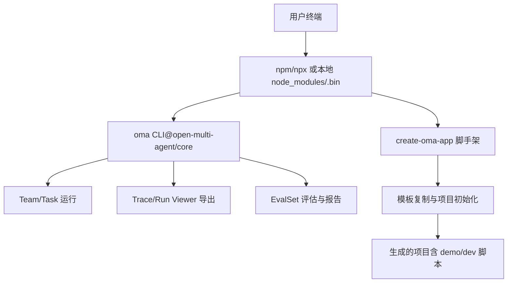
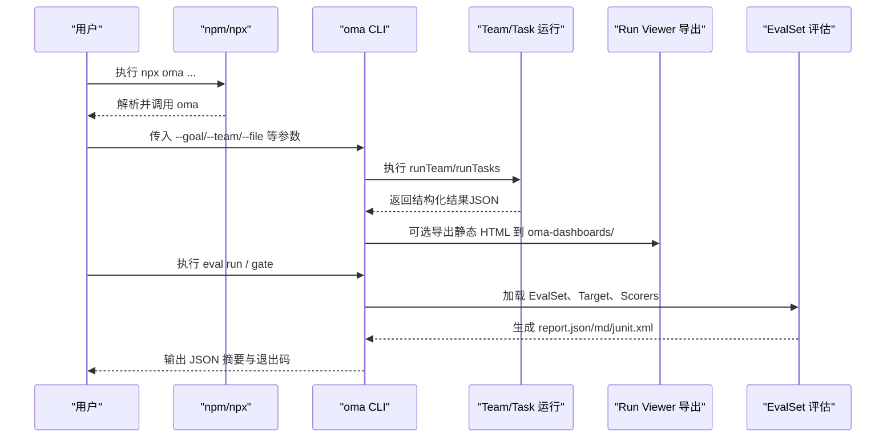
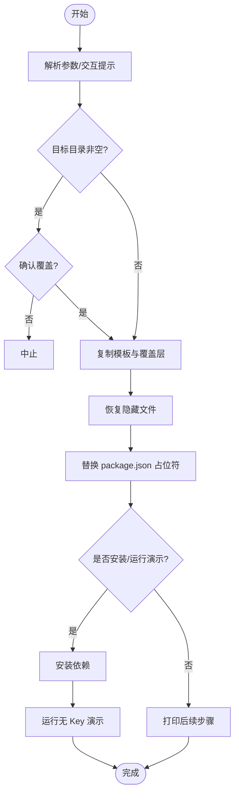
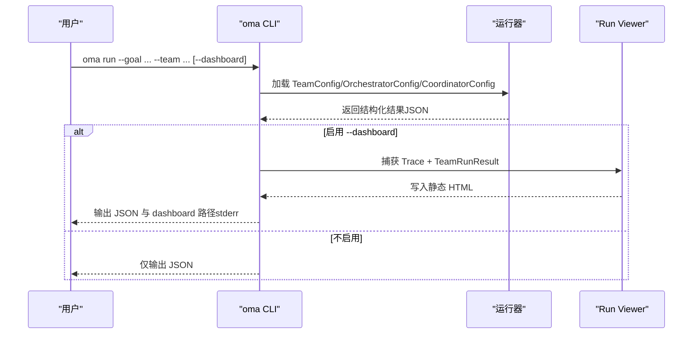
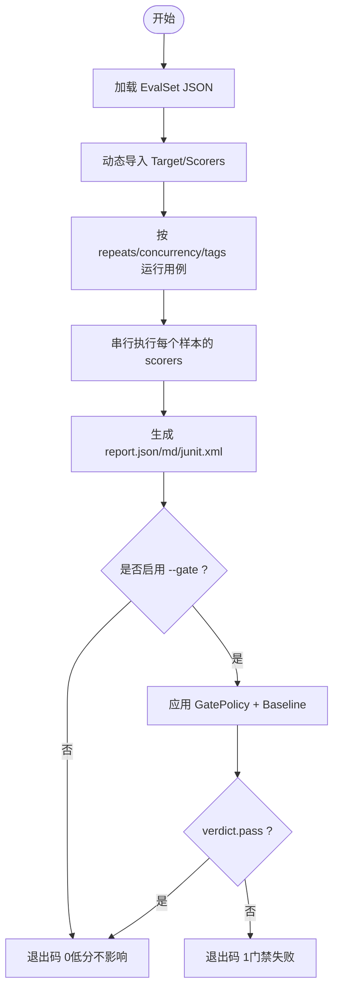
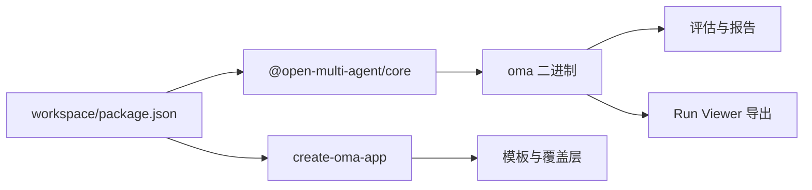

# CLI 工具使用

<cite>
**本文引用的文件**
- [README.md](file://README.md)
- [cli.md](file://docs/cli.md)
- [evaluation.md](file://docs/evaluation.md)
- [package.json](file://package.json)
- [create-oma-app README](file://packages/create-oma-app/README.md)
- [create-oma-app 入口](file://packages/create-oma-app/src/index.ts)
- [create-oma-app 脚手架核心](file://packages/create-oma-app/src/scaffold.ts)
</cite>

## 目录
1. [简介](#简介)
2. [项目结构](#项目结构)
3. [核心组件](#核心组件)
4. [架构总览](#架构总览)
5. [详细组件分析](#详细组件分析)
6. [依赖关系分析](#依赖关系分析)
7. [性能与可观测性](#性能与可观测性)
8. [故障排查指南](#故障排查指南)
9. [结论](#结论)
10. [附录：常用工作流示例](#附录常用工作流示例)

## 简介
本文件面向使用 Open Multi-Agent 的开发者，系统化说明其命令行工具（CLI）的使用方式，覆盖以下目标：
- 使用 create-oma-app 脚手架快速创建新项目，包括模板选择、依赖安装、基础配置与本地演示运行。
- 使用 oma CLI 执行团队运行、任务流水线、离线评估、质量门禁与报告生成。
- 通过内置仪表盘导出与 Trace 回放进行调试、日志查看、性能分析与错误诊断。
- 提供批量测试与评估工具使用方法，包括用例运行、结果分析与报告输出。
- 给出常见工作流示例与故障排查建议，帮助在 CI/CD 与日常开发中高效使用 CLI。

## 项目结构
Open Multi-Agent 仓库包含多个包，CLI 能力主要分布在两个位置：
- @open-multi-agent/core 提供的 oma 二进制命令，用于 run、task、dashboard、eval 等。
- create-oma-app 脚手架，用于快速生成具备生产就绪结构的 starter 项目。

**图表来源**
- [cli.md:1-26](file://docs/cli.md#L1-L26)
- [create-oma-app 入口:1-12](file://packages/create-oma-app/src/index.ts#L1-L12)
- [create-oma-app 脚手架核心:1-14](file://packages/create-oma-app/src/scaffold.ts#L1-L14)

**章节来源**
- [README.md:46-65](file://README.md#L46-L65)
- [cli.md:1-26](file://docs/cli.md#L1-L26)
- [create-oma-app README:1-15](file://packages/create-oma-app/README.md#L1-L15)

## 核心组件
- oma CLI：提供 run、task、dashboard、eval run/gate、provider 等子命令，面向脚本与 CI，输出稳定 JSON 与退出码。
- create-oma-app：交互式或非交互式脚手架，支持 pr-review、security、demo 三种模板，以及 cloud/ollama 两种运行时。
- 评估与报告：基于 EvalSet 的离线评估，支持 JSON/Markdown/JUnit 报告与质量门禁（Gate）。
- 仪表盘与 Trace：run 时可选导出静态 Run Viewer；dashboard 可从已有 Trace 文件导出历史运行的可视化页面。

**章节来源**
- [cli.md:29-189](file://docs/cli.md#L29-L189)
- [evaluation.md:420-490](file://docs/evaluation.md#L420-L490)
- [create-oma-app README:16-53](file://packages/create-oma-app/README.md#L16-L53)

## 架构总览
下图展示了 CLI 的主要调用路径与数据流向：

**图表来源**
- [cli.md:31-105](file://docs/cli.md#L31-L105)
- [cli.md:159-189](file://docs/cli.md#L159-L189)
- [evaluation.md:462-490](file://docs/evaluation.md#L462-L490)

## 详细组件分析

### 脚手架 create-oma-app
- 作用：一键生成生产就绪的多智能体 starter，支持交互式选择模板与运行时，也可非交互式指定参数。
- 模板：
  - PR Review Agent：并行 correctness/security/quality 评审。
  - Security Analysis Agent：只读仓库分析，支持敏感信息脱敏与可选 npm audit。
  - Multi-agent DAG Demo：纯推理的入门示例。
- 运行时：
  - Cloud/OpenAI 兼容端点：需要设置环境变量与模型配置。
  - Local/Ollama：无需云 API Key，需本地启动 Ollama 与模型。
- 关键流程：
  - 解析参数与交互提示。
  - 校验目标目录是否非空。
  - 复制基础模板与模板覆盖层，恢复隐藏文件（如 .gitignore）。
  - 替换 package.json 中的占位符（项目名称、运行时）。
  - 可选安装依赖并运行无 Key 的本地演示。

**图表来源**
- [create-oma-app 入口:44-189](file://packages/create-oma-app/src/index.ts#L44-L189)
- [create-oma-app 脚手架核心:42-75](file://packages/create-oma-app/src/scaffold.ts#L42-L75)

**章节来源**
- [create-oma-app README:1-53](file://packages/create-oma-app/README.md#L1-L53)
- [create-oma-app 入口:1-189](file://packages/create-oma-app/src/index.ts#L1-L189)
- [create-oma-app 脚手架核心:1-76](file://packages/create-oma-app/src/scaffold.ts#L1-L76)

### oma CLI：run 与 task
- oma run：
  - 执行 runTeam(team, goal)，协调器分解目标、调度任务队列、可选综合输出。
  - 可选 --dashboard 导出静态 Run Viewer 到 oma-dashboards/，包含任务 DAG、层级感知的 Span Waterfall、过滤与安全脱敏。
  - 标准输出为 JSON，错误与仪表盘路径输出到 stderr。
- oma task：
  - 执行 runTasks(team, tasks)，固定任务列表（无协调器分解）。
  - 支持通过 --team 覆盖 tasks 文件内的 team 定义。

**图表来源**
- [cli.md:31-57](file://docs/cli.md#L31-L57)
- [cli.md:193-301](file://docs/cli.md#L193-L301)

**章节来源**
- [cli.md:31-91](file://docs/cli.md#L31-L91)
- [cli.md:193-301](file://docs/cli.md#L193-L301)

### oma CLI：dashboard 与 provider
- oma dashboard：
  - 从已有 FileTraceStore 导出单个历史运行的 Run Viewer，无需调用模型或代理。
  - 必须提供 --trace-store 与 --run-id；--output 指定输出路径，默认时间戳命名。
  - 若输出文件已存在，返回特定退出码以避免覆盖。
- oma provider：
  - 列出内置 provider id、API Key 环境变量、baseURL 支持与简要说明。
  - 提供模板 JSON，便于快速配置 orchestrator/agent 字段与环境变量。

**章节来源**
- [cli.md:59-81](file://docs/cli.md#L59-L81)
- [cli.md:176-189](file://docs/cli.md#L176-L189)

### 评估与报告：oma eval run/gate
- oma eval run：
  - 运行版本化 EvalSet，对目标（target）执行多次重复与并发控制，支持标签过滤。
  - 动态导入 ES Module 作为 target 与 scorers；支持引用工厂 scorer。
  - 输出报告：JSON（权威）、Markdown（人类可读）、JUnit（CI 集成）。
  - 可选 --gate 应用质量门禁策略，结合 baseline 检测回归。
- oma eval gate：
  - 对已有 report.json 应用 GatePolicy，输出精确 verdict JSON，按 pass/fail 决定退出码。

**图表来源**
- [cli.md:93-157](file://docs/cli.md#L93-L157)
- [evaluation.md:462-490](file://docs/evaluation.md#L462-L490)

**章节来源**
- [cli.md:93-189](file://docs/cli.md#L93-L189)
- [evaluation.md:420-590](file://docs/evaluation.md#L420-L590)

### 配置文件与输出规范
- Team/Tasks/Orchestrator/Coordinator JSON：
  - 形状匹配库类型，CLI 会做基本校验（如 team.name、agents 非空、name/model 必填）。
  - 函数型选项不支持 JSON；可通过 TypeScript 代码注入。
  - 文件系统沙箱根可通过 defaultCwd/cwd 配置，限制 file_* 工具访问范围。
- 输出：
  - 每次调用输出一个 JSON 文档到 stdout，附带换行。
  - 成功/失败/错误均有明确结构与退出码约定，便于脚本处理。
  - 仪表盘路径与诊断信息输出到 stderr。

**章节来源**
- [cli.md:193-301](file://docs/cli.md#L193-L301)
- [cli.md:304-413](file://docs/cli.md#L304-L413)

## 依赖关系分析
- 顶层 workspace 管理多包构建与测试脚本，确保 core 与脚手架独立构建与测试。
- create-oma-app 自身零运行时依赖，仅使用 Node.js 内置模块，保证脚手架快速且干净。
- oma CLI 依赖 core 的运行能力（runTeam/runTasks）、Trace 存储与评估子系统。

**图表来源**
- [package.json:1-34](file://package.json#L1-L34)
- [create-oma-app 入口:1-12](file://packages/create-oma-app/src/index.ts#L1-L12)

**章节来源**
- [package.json:1-34](file://package.json#L1-L34)
- [create-oma-app 入口:1-12](file://packages/create-oma-app/src/index.ts#L1-L12)

## 性能与可观测性
- 运行期可观测：
  - run 时启用 --dashboard 可捕获 Trace 并生成静态 HTML，包含任务 DAG、Span Waterfall、过滤器与安全脱敏。
  - dashboard 命令可从已有 Trace 文件导出历史运行，无需网络与模型调用。
- 评估性能：
  - 评估以离线批处理为主，repeats/concurrency 控制负载；scorer 串行执行，不同样本并行。
  - 报告聚合使用最近秩方法计算百分位数，passRate 仅统计显式 pass 的记录。
- 资源与隐私：
  - 仪表盘页面自包含，不加载远程资源；敏感值在渲染前脱敏。
  - 评估记录支持 payload 存储策略（none/redacted/full），避免不必要的数据持久化。

**章节来源**
- [cli.md:31-81](file://docs/cli.md#L31-L81)
- [evaluation.md:134-139](file://docs/evaluation.md#L134-L139)
- [evaluation.md:744-750](file://docs/evaluation.md#L744-L750)

## 故障排查指南
- 常见问题与定位：
  - 缺少必需参数：如 --goal 与 --team 未提供，CLI 将返回 usage 错误与退出码 2。
  - 文件不存在或不可读：如 --trace-store 或 --set/--target 路径无效，返回 io/validation 错误与退出码 2。
  - 模块加载失败：动态导入 target/scorers 出错，返回 module-load 错误与退出码 2。
  - 运行时异常：LLM/API 失败通常抛出异常，返回退出码 3。
- 仪表盘导出问题：
  - 无法捕获 Trace：stderr 输出 DASHBOARD_TRACE_CAPTURE_FAILED，回退为仅结果视图。
  - 渲染或写入失败：输出 DASHBOARD_RENDER_FAILED 或 DASHBOARD_WRITE_FAILED，不影响已完成运行结果。
  - 输出文件已存在：返回 dashboard_output_exists 与退出码 2，避免覆盖。
- 评估门禁失败：
  - 未配置 --gate：低分不会改变退出码。
  - 配置 --gate：verdict.fail 或所有目标失败时退出码 1；用法/文件/模块错误退出码 2。
- 建议：
  - 检查环境变量与 API Key 是否正确设置。
  - 使用 --pretty 与 --include-messages 辅助调试（注意消息体积较大）。
  - 在 CI 中保存 JUnit 报告以便回溯失败用例。

**章节来源**
- [cli.md:375-413](file://docs/cli.md#L375-L413)
- [cli.md:35-47](file://docs/cli.md#L35-L47)
- [cli.md:159-174](file://docs/cli.md#L159-L174)

## 结论
Open Multi-Agent 的 CLI 提供了从项目初始化到运行、评估、可视化的完整工具链：
- create-oma-app 让新手与团队快速搭建可运行的多智能体 starter，支持多种模板与运行时。
- oma CLI 将核心能力暴露为稳定的 JSON 接口与退出码，适合脚本与 CI 自动化。
- 评估与门禁机制保障质量，配合报告与基线对比实现持续改进。
- 仪表盘与 Trace 回放提升可观测性与排障效率。

## 附录：常用工作流示例
以下为典型工作流（命令形式，具体参数请参考对应章节）：
- 快速创建项目并运行本地演示：
  - 使用脚手架创建项目，选择模板与运行时，自动安装依赖并运行无 Key 演示。
- 执行团队运行并导出仪表盘：
  - 准备 team.json 与 goal，执行 run 并启用 --dashboard，查看静态 HTML。
- 执行固定任务流水线：
  - 准备 tasks.json，执行 task 命令，必要时用 --team 覆盖团队配置。
- 批量评估与质量门禁：
  - 编写 EvalSet 与 Target/Scorers，执行 eval run 生成报告，启用 --gate 与 --baseline 进行门禁。
- 复用历史 Trace 导出仪表盘：
  - 使用 dashboard 命令从已有 Trace 文件导出指定 runId 的可视化页面。

**章节来源**
- [create-oma-app README:10-53](file://packages/create-oma-app/README.md#L10-L53)
- [cli.md:31-105](file://docs/cli.md#L31-L105)
- [cli.md:159-189](file://docs/cli.md#L159-L189)
- [evaluation.md:462-490](file://docs/evaluation.md#L462-L490)