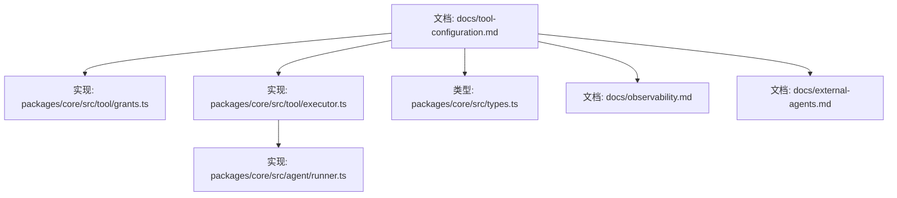
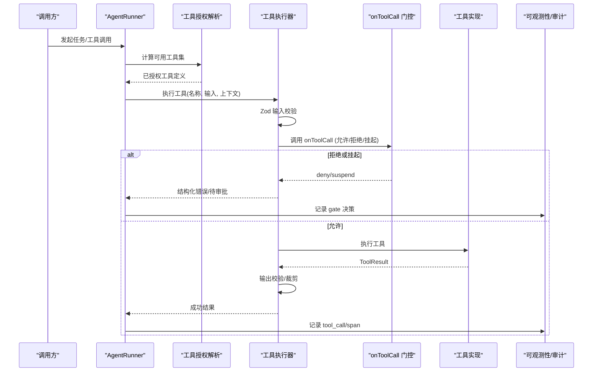
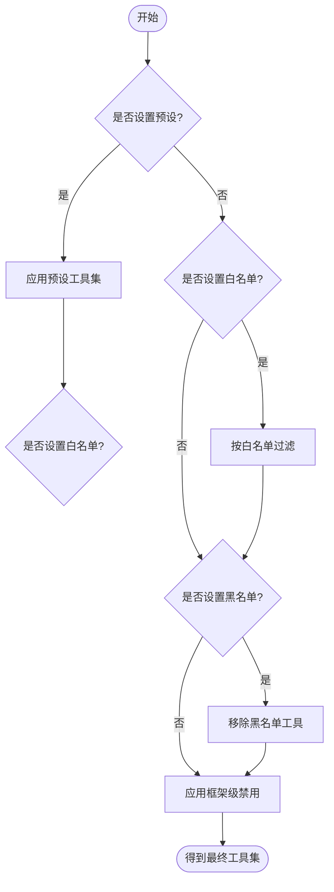
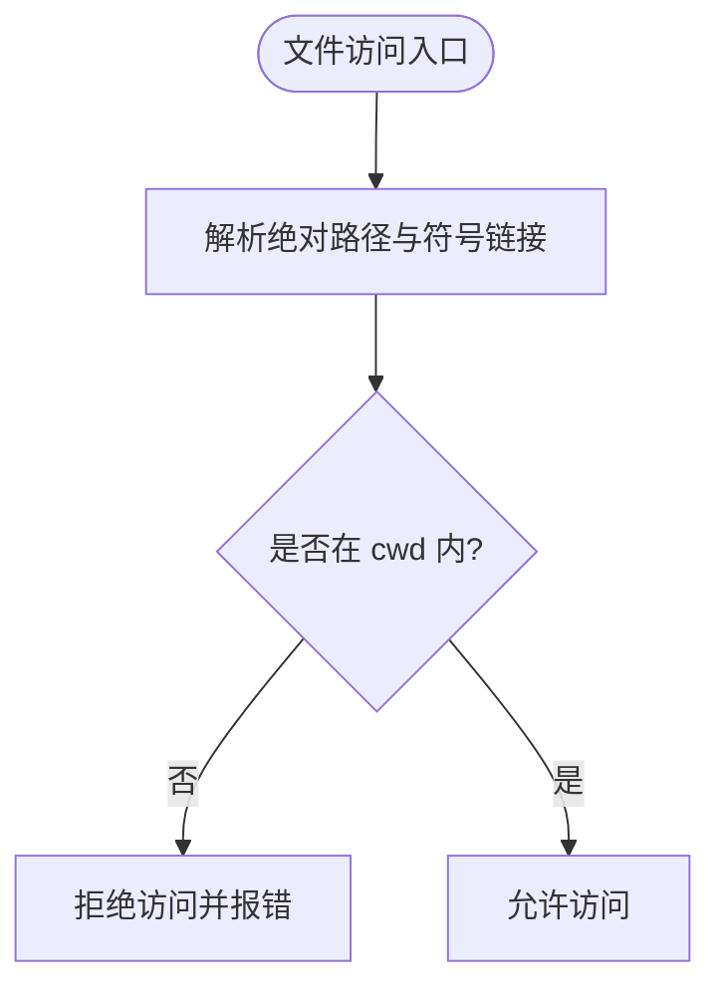
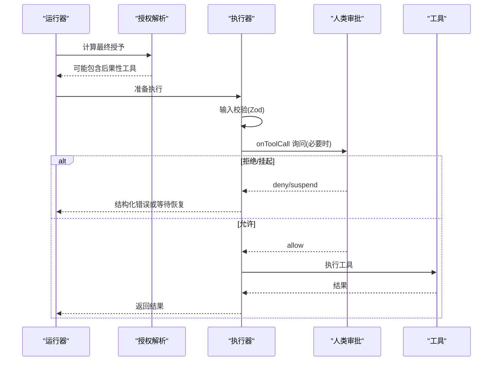
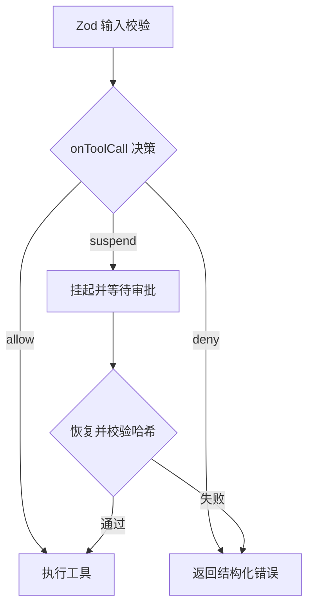
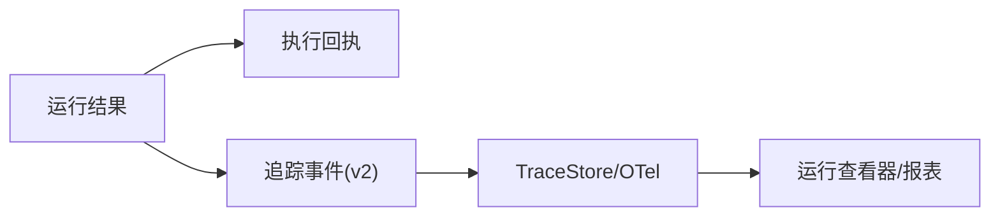
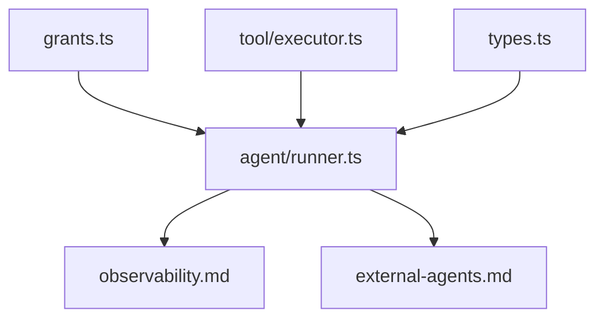

# 工具安全配置

<cite>
**本文引用的文件**
- [docs/tool-configuration.md](file://docs/tool-configuration.md)
- [docs/observability.md](file://docs/observability.md)
- [docs/external-agents.md](file://docs/external-agents.md)
- [packages/core/src/tool/grants.ts](file://packages/core/src/tool/grants.ts)
- [packages/core/src/tool/executor.ts](file://packages/core/src/tool/executor.ts)
- [packages/core/src/types.ts](file://packages/core/src/types.ts)
- [packages/core/src/agent/runner.ts](file://packages/core/src/agent/runner.ts)
</cite>

## 目录
1. [简介](#简介)
2. [项目结构](#项目结构)
3. [核心组件](#核心组件)
4. [架构总览](#架构总览)
5. [详细组件分析](#详细组件分析)
6. [依赖关系分析](#依赖关系分析)
7. [性能与安全权衡](#性能与安全权衡)
8. [故障排查指南](#故障排查指南)
9. [结论](#结论)
10. [附录](#附录)

## 简介
本文件面向生产环境，系统性说明 Open Multi-Agent（OMA）中“工具”的安全配置与治理策略。内容覆盖：
- 沙箱隔离机制（文件系统工作目录、路径限制、符号链接处理）
- 权限控制策略（默认拒绝、预设、白名单/黑名单、能力声明、后果性工具标记）
- 审计日志与可观测性（执行回执、追踪事件、运行身份、数据脱敏）
- 敏感工具（文件操作、网络请求、进程执行）的细粒度控制
- 监控与审计（调用历史、执行结果、审批流、恢复重放）
- 安全最佳实践（最小权限、输入验证、输出过滤、凭据隔离）
- 常见威胁防护与漏洞检测思路

## 项目结构
与工具安全相关的关键位置：
- 文档层：工具配置、可观测性、外部代理
- 核心实现：工具授权解析、工具执行器、类型定义、代理运行循环
- 扩展点：MCP 工具、外部进程/ACP 后端

**图示来源**
- [docs/tool-configuration.md:1-709](file://docs/tool-configuration.md#L1-L709)
- [packages/core/src/tool/grants.ts:1-90](file://packages/core/src/tool/grants.ts#L1-L90)
- [packages/core/src/tool/executor.ts:1-519](file://packages/core/src/tool/executor.ts#L1-L519)
- [packages/core/src/types.ts:544-557](file://packages/core/src/types.ts#L544-L557)
- [docs/observability.md:1-768](file://docs/observability.md#L1-L768)
- [docs/external-agents.md:1-239](file://docs/external-agents.md#L1-L239)

**章节来源**
- [docs/tool-configuration.md:1-709](file://docs/tool-configuration.md#L1-L709)
- [docs/observability.md:1-768](file://docs/observability.md#L1-L768)
- [docs/external-agents.md:1-239](file://docs/external-agents.md#L1-L239)
- [packages/core/src/tool/grants.ts:1-90](file://packages/core/src/tool/grants.ts#L1-L90)
- [packages/core/src/tool/executor.ts:1-519](file://packages/core/src/tool/executor.ts#L1-L519)
- [packages/core/src/types.ts:544-557](file://packages/core/src/types.ts#L544-L557)
- [packages/core/src/agent/runner.ts:455-1234](file://packages/core/src/agent/runner.ts#L455-L1234)

## 核心组件
- 工具授权解析器：基于预设、白名单、黑名单与框架级禁用列表，计算每个 Agent 实际可用的工具集合。
- 工具执行器：负责参数校验（Zod）、并发控制、可选的 per-call 门控（onToolCall）、持久化审批、输出裁剪与错误封装。
- 类型与上下文：提供 cwd 沙箱、runId/taskId/toolCallId、凭据注入、中止信号等安全上下文字段。
- 代理运行循环：将工具调用纳入整体任务图、预算、循环检测与可观测性管线。
- 可观测性：运行身份、执行回执、追踪事件、存储与导出、隐私边界。
- 外部代理：进程与 ACP 后端的权限模型与隔离边界。

**章节来源**
- [packages/core/src/tool/grants.ts:1-90](file://packages/core/src/tool/grants.ts#L1-L90)
- [packages/core/src/tool/executor.ts:1-519](file://packages/core/src/tool/executor.ts#L1-L519)
- [packages/core/src/types.ts:544-557](file://packages/core/src/types.ts#L544-L557)
- [packages/core/src/agent/runner.ts:455-1234](file://packages/core/src/agent/runner.ts#L455-L1234)
- [docs/observability.md:1-768](file://docs/observability.md#L1-L768)
- [docs/external-agents.md:1-239](file://docs/external-agents.md#L1-L239)

## 架构总览
下图展示一次工具调用的安全路径：从授权到执行、门控、审计与结果返回。

**图示来源**
- [packages/core/src/tool/grants.ts:1-90](file://packages/core/src/tool/grants.ts#L1-L90)
- [packages/core/src/tool/executor.ts:1-519](file://packages/core/src/tool/executor.ts#L1-L519)
- [packages/core/src/agent/runner.ts:455-1234](file://packages/core/src/agent/runner.ts#L455-L1234)
- [docs/observability.md:1-768](file://docs/observability.md#L1-L768)

## 详细组件分析

### 工具授权与预设（默认拒绝 + 最小权限）
- 默认拒绝：未显式授予的工具不可用；内置工具（bash、文件读写等）需通过 tools 或 toolPreset 授予。
- 预设：readonly/readwrite/full 三档，便于快速收敛权限面。
- 白名单/黑名单：在预设基础上进一步精确裁剪。
- 框架级禁用：保留 AGENT_FRAMEWORK_DISALLOWED 作为未来安全护栏。
- 能力声明：AgentConfig 可携带 capabilities/costTier/latencyClass，任务可要求 requiredTools 等硬约束，选择器据此筛选。

**图示来源**
- [packages/core/src/tool/grants.ts:1-90](file://packages/core/src/tool/grants.ts#L1-L90)
- [docs/tool-configuration.md:251-289](file://docs/tool-configuration.md#L251-L289)

**章节来源**
- [docs/tool-configuration.md:214-289](file://docs/tool-configuration.md#L214-L289)
- [packages/core/src/tool/grants.ts:1-90](file://packages/core/src/tool/grants.ts#L1-L90)

### 沙箱隔离（文件系统工作目录）
- 内置文件系统工具（file_read/file_write/file_edit/grep/glob）受 cwd 限制：仅允许绝对路径且必须解析到该目录下（含符号链接）。
- bash 不沙箱化：一旦授予 shell，即可逃逸路径限制；应尽量避免在生产授予 bash，或使用进程级隔离（容器/seccomp/firejail）。
- 默认工作目录为 <cwd>/.agent-workspace，可全局或按 Agent 覆盖；设为 null 则关闭沙箱。

**图示来源**
- [docs/tool-configuration.md:391-437](file://docs/tool-configuration.md#L391-L437)
- [packages/core/src/types.ts:544-557](file://packages/core/src/types.ts#L544-L557)

**章节来源**
- [docs/tool-configuration.md:391-437](file://docs/tool-configuration.md#L391-L437)
- [packages/core/src/types.ts:544-557](file://packages/core/src/types.ts#L544-L557)

### 后果性工具与确认流程
- 工具可标记 consequential=true（如 bash、file_write、file_edit），表示具有真实副作用。
- 在未声明治理拓扑的自动路由场景下，若最终授予包含后果性工具，会打上标志位提示风险。
- 可通过 requireConsequentialConfirmation 开启确认；onToolCall 支持 allow/deny/suspend，suspend 可与持久化审批结合。

**图示来源**
- [docs/tool-configuration.md:140-213](file://docs/tool-configuration.md#L140-L213)
- [packages/core/src/tool/executor.ts:180-338](file://packages/core/src/tool/executor.ts#L180-L338)

**章节来源**
- [docs/tool-configuration.md:140-213](file://docs/tool-configuration.md#L140-L213)
- [packages/core/src/tool/executor.ts:180-338](file://packages/core/src/tool/executor.ts#L180-L338)

### 每调用门控 with onToolCall
- 门控在 Zod 校验之后、工具执行之前运行，可对具体参数做细粒度判断（例如对 bash 命令进行风险分类）。
- 支持 allow/deny/suspend；deny 返回结构化错误，不会抛出异常；suspend 可在检查点任务中持久化等待人工审批。
- 可组合 durable approvals，恢复时校验请求哈希一致才放行。

**图示来源**
- [docs/tool-configuration.md:326-390](file://docs/tool-configuration.md#L326-L390)
- [packages/core/src/tool/executor.ts:206-295](file://packages/core/src/tool/executor.ts#L206-L295)

**章节来源**
- [docs/tool-configuration.md:326-390](file://docs/tool-configuration.md#L326-L390)
- [packages/core/src/tool/executor.ts:206-295](file://packages/core/src/tool/executor.ts#L206-L295)

### 输出控制与隐私
- 工具输出可设置 outputSchema 校验；非字符串 data 需要 modelOutput 明确指定可见内容。
- 支持文本/图片/文件的富结果；媒体内容在工具边界复制并在进入对话前再次拷贝，避免后续修改影响转录。
- maxOutputChars 可裁剪过长输出；压缩旧结果以减少后续 token 成本。
- 默认不采集 prompt/completion/工具入参与结果；凭证字段自动脱敏。

**章节来源**
- [docs/tool-configuration.md:507-673](file://docs/tool-configuration.md#L507-L673)
- [docs/observability.md:743-768](file://docs/observability.md#L743-L768)

### 可观测性与审计
- 每次运行具备 identity（runId/attempt/traceId/rootSpanId）与 status。
- 执行回执 buildExecutionReceipt 汇总实际执行拓扑、角色、依赖边、独立审查事实等，用于事后治理判定。
- 追踪事件 v2 提供 span 层级、links、状态码、token/成本统计；支持本地 FileTraceStore 与 OTel 导出。
- 运行查看器可离线回放 DAG 与瀑布图，便于复盘。

**图示来源**
- [docs/observability.md:12-143](file://docs/observability.md#L12-L143)
- [docs/observability.md:151-178](file://docs/observability.md#L151-L178)
- [docs/observability.md:224-287](file://docs/observability.md#L224-L287)
- [docs/observability.md:670-731](file://docs/observability.md#L670-L731)

**章节来源**
- [docs/observability.md:12-143](file://docs/observability.md#L12-L143)
- [docs/observability.md:151-178](file://docs/observability.md#L151-L178)
- [docs/observability.md:224-287](file://docs/observability.md#L224-L287)
- [docs/observability.md:670-731](file://docs/observability.md#L670-L731)

### 外部代理（进程/ACP）安全
- 进程后端以子进程方式运行，无 OMA 的文件系统沙箱保护；需严格限定 command/args/env/cwd。
- ACP 后端通过 permission 回调控制协议级权限请求（auto-approve/reject/函数）。
- 外部代理的 stdout/stderr/退出码映射为 Agent 结果；注意 token 计量差异与预算边界。

**章节来源**
- [docs/external-agents.md:1-239](file://docs/external-agents.md#L1-L239)

## 依赖关系分析
- 授权解析依赖注册表与预设/白名单/黑名单；与框架级禁用列表组合得到最终工具集。
- 执行器依赖注册表、Zod、信号中止、批准持久化、结果复制与裁剪。
- 代理运行循环集成循环检测、预算、工具执行与可观测性。
- 可观测性子系统提供存储、导出、查询与可视化。

**图示来源**
- [packages/core/src/tool/grants.ts:1-90](file://packages/core/src/tool/grants.ts#L1-L90)
- [packages/core/src/tool/executor.ts:1-519](file://packages/core/src/tool/executor.ts#L1-L519)
- [packages/core/src/types.ts:544-557](file://packages/core/src/types.ts#L544-L557)
- [packages/core/src/agent/runner.ts:455-1234](file://packages/core/src/agent/runner.ts#L455-L1234)
- [docs/observability.md:1-768](file://docs/observability.md#L1-L768)
- [docs/external-agents.md:1-239](file://docs/external-agents.md#L1-L239)

**章节来源**
- [packages/core/src/tool/grants.ts:1-90](file://packages/core/src/tool/grants.ts#L1-L90)
- [packages/core/src/tool/executor.ts:1-519](file://packages/core/src/tool/executor.ts#L1-L519)
- [packages/core/src/agent/runner.ts:455-1234](file://packages/core/src/agent/runner.ts#L455-L1234)

## 性能与安全权衡
- 并发与限流：执行器使用信号量控制最大并发，避免资源耗尽。
- 输出裁剪与压缩：减少 token 消耗与传输体积，同时保留关键信息。
- 追踪与存储：批量导出、退避重试、丢弃策略保障热路径性能；但不应影响业务结果。
- 沙箱 vs 灵活性：关闭 cwd 沙箱提升便利但放大攻击面；生产建议保持启用并最小化授予。

[本节为通用指导，无需特定文件引用]

## 故障排查指南
- 工具未授予：检查 tools/toolPreset/disallowedTools 与默认拒绝策略；确保注册工具名与实际调用一致。
- 门控拒绝：查看 onToolCall 返回值与 reason；必要时引入风险分类器或人机审批。
- 沙箱拒绝：确认路径为绝对路径且在 cwd 内；检查符号链接解析。
- 输出过大：调整 maxOutputChars 或工具级 maxOutputChars；启用压缩。
- 审计缺失：确认 observability.sinks 或 onTrace 已配置；必要时 flush/shutdown。
- 外部代理越权：收紧 command/args/env/cwd；ACP 使用更严格的 permission 策略。

**章节来源**
- [docs/tool-configuration.md:214-390](file://docs/tool-configuration.md#L214-L390)
- [docs/observability.md:527-600](file://docs/observability.md#L527-L600)
- [docs/external-agents.md:118-145](file://docs/external-agents.md#L118-L145)

## 结论
生产环境的工具安全应以“默认拒绝 + 最小权限”为核心，配合：
- 明确的工具授权与预设/白名单/黑名单
- 严格的 cwd 沙箱与谨慎授予 bash
- 后果性工具的确认与持久化审批
- 完善的可观测性与审计（运行身份、执行回执、追踪事件）
- 对外部代理的进程/协议级权限控制
- 输入/输出校验与凭据隔离

这些措施共同构成纵深防御，降低误用与滥用风险，同时保持可运维与可回溯。

[本节为总结性内容，无需特定文件引用]

## 附录

### 生产部署清单（建议）
- 显式声明工具授予：优先使用 toolPreset 与 tools 白名单，避免全量授予。
- 启用 cwd 沙箱：不要在生产设置为 null；如需宽泛访问，限定到可信项目根目录。
- 谨慎授予 bash：仅在必要且受控的环境中使用，并结合 onToolCall 风险分类。
- 配置 onToolCall：至少实现 deny 高风险命令与 suspend 审批路径。
- 配置可观测性：接入 TraceStore 或 OTel，定期导出与归档；设置保留策略。
- 凭据隔离：通过 AgentConfig.credentials 注入最小必要密钥，避免共享闭包。
- 输出控制：设置 maxOutputChars，启用压缩；对富结果进行 MIME/大小限制。
- 外部代理：严格限定 command/args/env/cwd；ACP 使用 reject/auto-approve 策略。

[本节为通用建议，无需特定文件引用]