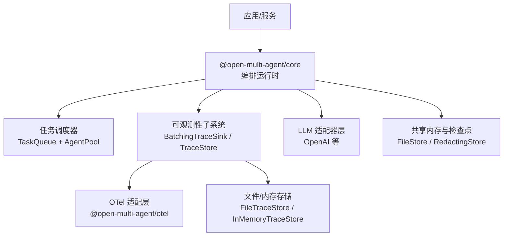
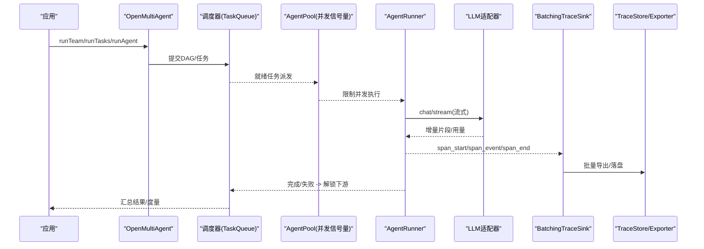
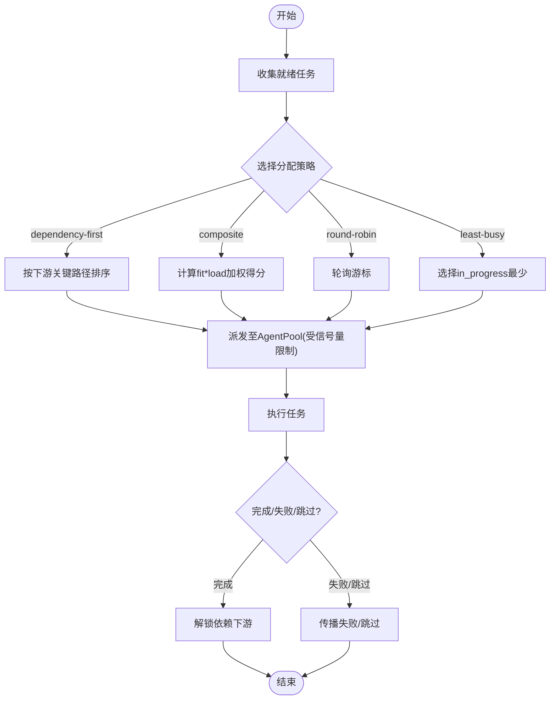
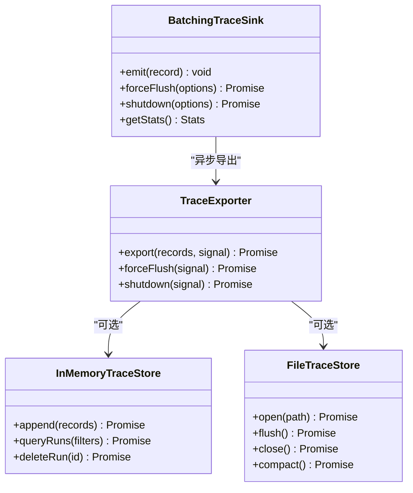
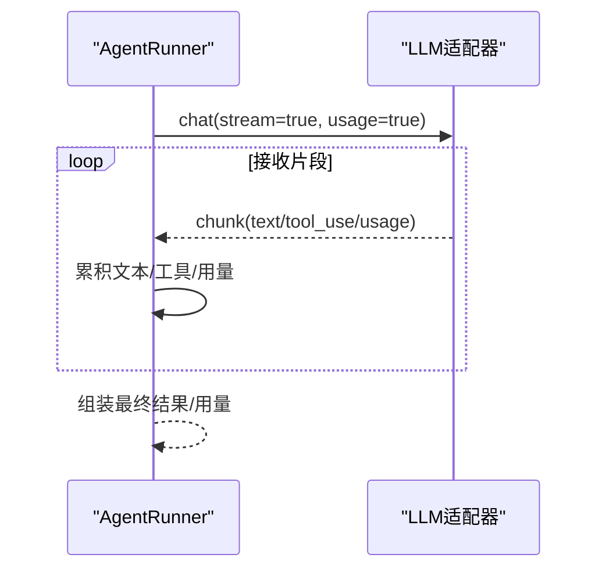
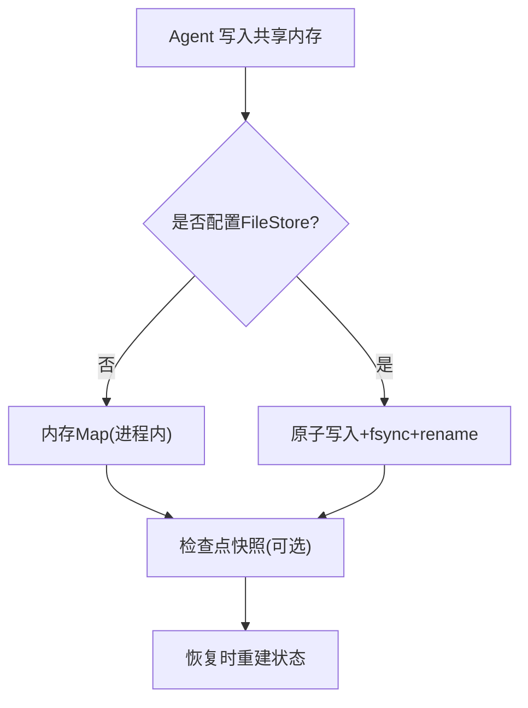
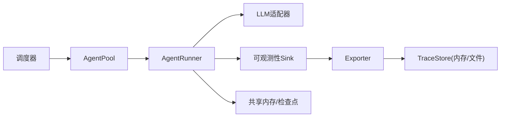

# 性能优化与监控

<cite>
**本文引用的文件**
- [README.md](file://README.md)
- [package.json](file://package.json)
- [observability-performance.md](file://docs/observability-performance.md)
- [observability.md](file://docs/observability.md)
- [task-scheduling.md](file://docs/task-scheduling.md)
- [shared-memory.md](file://docs/shared-memory.md)
- [observability-benchmark-ci.mjs](file://scripts/observability-benchmark-ci.mjs)
- [observability-sinks.mjs](file://packages/core/benchmarks/observability-sinks.mjs)
- [runner.ts](file://packages/core/src/agent/runner.ts)
- [types.ts](file://packages/core/src/types.ts)
- [openai.ts](file://packages/core/src/llm/openai.ts)
- [file-store.ts](file://packages/core/src/memory/file-store.ts)
</cite>

## 目录
1. [简介](#简介)
2. [项目结构](#项目结构)
3. [核心组件](#核心组件)
4. [架构总览](#架构总览)
5. [详细组件分析](#详细组件分析)
6. [依赖关系分析](#依赖关系分析)
7. [性能考量](#性能考量)
8. [故障排查指南](#故障排查指南)
9. [结论](#结论)
10. [附录](#附录)

## 简介
本指南面向生产环境下的 Open Multi-Agent（OMA）性能调优与可观测性实践，聚焦以下目标：
- 并发控制与调度：任务队列、Agent 池容量、事件驱动执行。
- 连接与 I/O 优化：LLM 适配器流式调用、批处理导出、持久化存储策略。
- 缓存与内存：共享内存、检查点、压缩与保留策略。
- 监控与基准：关键指标定义、基准测试方法、CI 门禁与回归告警。
- 智能体池资源管理：线程/进程级并发、内存使用与垃圾回收配合。
- 负载与压力测试：场景设计、指标采集、结果分析与回归判定。
- 常见问题诊断：内存泄漏、CPU 占用过高、响应时间过长等定位与修复建议。
- 生产最佳实践：监控面板、告警规则、优雅停机与数据保留策略。

## 项目结构
仓库采用多包工作区组织，核心编排运行时在 @open-multi-agent/core，可选的 OpenTelemetry 集成在 @open-multi-agent/otel，根脚本提供基准与示例验证。文档集中在 docs 目录，涵盖可观测性、任务调度、共享内存等主题。

图表来源
- [observability.md:185-222](file://docs/observability.md#L185-L222)
- [task-scheduling.md:1-25](file://docs/task-scheduling.md#L1-L25)
- [openai.ts:223-244](file://packages/core/src/llm/openai.ts#L223-L244)
- [file-store.ts:1-45](file://packages/core/src/memory/file-store.ts#L1-L45)

章节来源
- [README.md:140-144](file://README.md#L140-L144)
- [package.json:1-34](file://package.json#L1-L34)

## 核心组件
- 任务调度与执行：事件驱动的 DAG 执行，基于就绪集合与 in-flight 映射，通过 AgentPool 的并发信号量进行统一限流。
- 可观测性管线：同步热路径 Sink 与异步批量 Exporter，支持内存与文件两种 TraceStore，以及 OTel 适配。
- LLM 适配器：以流式方式聚合 token 用量与内容，支持并行工具调用与推理参数透传。
- 共享内存与检查点：进程内 Map 或磁盘原子写入；检查点用于恢复与审计，支持脱敏包装。

章节来源
- [task-scheduling.md:1-25](file://docs/task-scheduling.md#L1-L25)
- [observability.md:185-222](file://docs/observability.md#L185-L222)
- [openai.ts:223-244](file://packages/core/src/llm/openai.ts#L223-L244)
- [shared-memory.md:1-47](file://docs/shared-memory.md#L1-L47)

## 架构总览
下图展示从运行入口到调度、执行、可观测性与存储的关键交互。

图表来源
- [task-scheduling.md:1-25](file://docs/task-scheduling.md#L1-L25)
- [observability.md:185-222](file://docs/observability.md#L185-L222)
- [openai.ts:223-244](file://packages/core/src/llm/openai.ts#L223-L244)

## 详细组件分析

### 任务调度与并发控制
- 事件驱动执行：下游任务在依赖满足时立即启动，不等待同批次无关任务。
- 并发权威：AgentPool 的信号量是并发上限，包括临时委托代理的执行。
- 分配策略：支持 dependency-first、composite、round-robin、least-busy；composite 结合 fit 与 load 权重。
- 中断与预算：中止、预算耗尽、审批拒绝走“排空后跳过”路径，避免悬挂任务。

图表来源
- [task-scheduling.md:1-25](file://docs/task-scheduling.md#L1-L25)
- [task-scheduling.md:98-133](file://docs/task-scheduling.md#L98-L133)
- [task-scheduling.md:166-184](file://docs/task-scheduling.md#L166-L184)

章节来源
- [task-scheduling.md:1-25](file://docs/task-scheduling.md#L1-L25)
- [task-scheduling.md:98-133](file://docs/task-scheduling.md#L98-L133)
- [task-scheduling.md:166-184](file://docs/task-scheduling.md#L166-L184)

### 可观测性管线与批处理
- 热路径契约：TraceSink.emit 同步且不被 await；网络/存储 I/O 在 TraceExporter 中异步完成。
- 批处理默认值：队列记录数、字节上限、单条记录上限、批大小、调度延迟、导出超时、重试与退避均有明确默认。
- 丢弃优先级：stream_chunk > 其他事件 > span_start > span_end；超大记录直接拒绝。
- 存储与查询：InMemoryTraceStore 用于测试与本地；FileTraceStore 提供原子追加、fsync、重建索引、压缩与删除/保留策略。
- OTel 适配：将 TraceRecord 转为 Span/Link/Event，保持低敏感字段白名单，不输出提示/结果等敏感内容。

图表来源
- [observability.md:185-222](file://docs/observability.md#L185-L222)
- [observability.md:224-295](file://docs/observability.md#L224-L295)
- [observability.md:527-599](file://docs/observability.md#L527-L599)

章节来源
- [observability.md:185-222](file://docs/observability.md#L185-L222)
- [observability.md:224-295](file://docs/observability.md#L224-L295)
- [observability.md:527-599](file://docs/observability.md#L527-L599)

### LLM 适配器与流式聚合
- 流式请求：开启 stream 与 usage 统计，增量累积文本与工具调用。
- 并行工具调用：parallel_tool_calls 可启用，减少往返次数。
- 推理参数：temperature/top_p/top_k/min_p/frequency_penalty/presence_penalty 等透传到适配器。
- 超时与取消：支持 per-call AbortSignal，便于整体或单次调用超时控制。

图表来源
- [openai.ts:223-244](file://packages/core/src/llm/openai.ts#L223-L244)
- [runner.ts:960-965](file://packages/core/src/agent/runner.ts#L960-L965)

章节来源
- [openai.ts:223-244](file://packages/core/src/llm/openai.ts#L223-L244)
- [runner.ts:960-965](file://packages/core/src/agent/runner.ts#L960-L965)

### 共享内存与检查点
- 共享内存：进程内键值空间，跨 agent 可见；可替换为 Redis/Postgres 等实现。
- 检查点：在安全边界持久化，支持崩溃恢复与重放；FileStore 提供原子写入与 fsync。
- 脱敏：RedactingStore 可在写时对凭证/PII 进行脱敏，保护持久化数据。

图表来源
- [shared-memory.md:1-47](file://docs/shared-memory.md#L1-L47)
- [file-store.ts:1-45](file://packages/core/src/memory/file-store.ts#L1-L45)
- [file-store.ts:308-345](file://packages/core/src/memory/file-store.ts#L308-L345)

章节来源
- [shared-memory.md:1-47](file://docs/shared-memory.md#L1-L47)
- [file-store.ts:1-45](file://packages/core/src/memory/file-store.ts#L1-L45)
- [file-store.ts:308-345](file://packages/core/src/memory/file-store.ts#L308-L345)

### 循环检测与预算控制
- 循环检测：跟踪最近 turn 的工具调用与文本重复，触发注入警告或终止。
- 预算控制：token 预算与调用超时双重保护，超限即停止后续调用并上报。

章节来源
- [runner.ts:1215-1234](file://packages/core/src/agent/runner.ts#L1215-L1234)
- [types.ts:1215-1248](file://packages/core/src/types.ts#L1215-L1248)

## 依赖关系分析
- 调度与执行耦合度低：调度器仅负责就绪与派发，AgentPool 作为并发闸门，解耦业务逻辑。
- 可观测性独立：Sink/Exporter 与业务执行完全隔离，失败不影响业务结果。
- 存储抽象：TraceStore 与 MemoryStore 接口化，便于替换实现。
- 外部依赖：OTel 适配为可选包，不引入核心运行时依赖。

图表来源
- [task-scheduling.md:1-25](file://docs/task-scheduling.md#L1-L25)
- [observability.md:185-222](file://docs/observability.md#L185-L222)
- [shared-memory.md:1-47](file://docs/shared-memory.md#L1-L47)

章节来源
- [task-scheduling.md:1-25](file://docs/task-scheduling.md#L1-L25)
- [observability.md:185-222](file://docs/observability.md#L185-L222)
- [shared-memory.md:1-47](file://docs/shared-memory.md#L1-L47)

## 性能考量
- 并发与吞吐
  - 合理设置 TeamConfig.maxConcurrency，使 AgentPool 信号量匹配 CPU/IO 能力与 LLM 后端 QPS。
  - 使用 dependency-first/composite 策略降低长尾依赖造成的阻塞。
- 可观测性开销
  - 使用 BatchingTraceSink 默认配置即可在大多数场景下获得稳定 p95；必要时调整 maxQueueRecords/maxQueueBytes/maxBatchRecords/scheduledDelayMs。
  - 对高吞吐场景，优先使用 TraceStoreExporter 落盘或 OTel 适配，避免同步回调带来的抖动。
- 存储与 I/O
  - 文件 TraceStore 的 append 为 write-complete，flush/close 才 fsync；压测需分别评估 append、fsync、reopen、query、compaction。
  - 共享内存若直连磁盘（FileStore），每次写入都会全量重写，建议仅在检查点使用 FileStore，运行时用 InMemoryStore。
- 模型调用
  - 启用 parallel_tool_calls 减少往返；合理设置 top_p/top_k/min_p 控制生成质量与耗时。
  - 为长链路设置 callTimeoutMs 与 timeoutMs，防止个别调用拖垮整体。
- 内存与 GC
  - 基准脚本使用 --expose-gc 与 process.memoryUsage 估算堆增长；生产环境建议定期 GC 与监控 RSS/HeapUsed。
  - 大消息/大工具结果应做摘要或裁剪，避免进入 trace/store。

章节来源
- [observability-performance.md:8-20](file://docs/observability-performance.md#L8-L20)
- [observability-performance.md:22-62](file://docs/observability-performance.md#L22-L62)
- [observability.md:572-599](file://docs/observability.md#L572-L599)
- [openai.ts:223-244](file://packages/core/src/llm/openai.ts#L223-L244)
- [file-store.ts:1-45](file://packages/core/src/memory/file-store.ts#L1-L45)

## 故障排查指南
- 内存泄漏
  - 现象：RSS/HeapUsed 持续增长，GC 后无明显回落。
  - 排查：使用 observability-sinks.mjs 的 inMemoryStore 行模式对比基线；关注大对象（prompt/工具结果）是否进入 trace/store。
  - 缓解：启用 SensitiveDataProcessor 与 RedactingStore；对大结果做摘要；限制 batch/queue 大小。
- CPU 占用过高
  - 现象：p95 升高、调度延迟增大。
  - 排查：观察 legacy dispatch 与 batch emit 的 p95；检查 sink 是否被同步回调阻塞；确认未开启不必要的内容捕获。
  - 缓解：切换到 BatchingTraceSink；增大 scheduledDelayMs；减少每批记录数；关闭非关键 onTrace。
- 响应时间过长
  - 现象：端到端时延上升，部分任务卡住。
  - 排查：查看 RunMetrics 的 min/max/avg 任务时长；检查 AgentPool 并发是否饱和；确认 LLM 适配器超时与重试策略。
  - 缓解：提高并发上限（受限于后端 QPS）；启用 parallel_tool_calls；为慢调用设置 callTimeoutMs；使用 least-busy 策略。
- 数据丢失与不一致
  - 现象：trace 缺失、store 打开报错。
  - 排查：FileTraceStore 打开会校验格式与 schema；异常会抛出结构化错误且不包含 payload。
  - 缓解：确保优雅停机（forceFlush 再 shutdown）；避免多进程写同一文件；定期 compact。

章节来源
- [observability-performance.md:64-118](file://docs/observability-performance.md#L64-L118)
- [observability.md:527-599](file://docs/observability.md#L527-L599)
- [file-store.ts:308-345](file://packages/core/src/memory/file-store.ts#L308-L345)

## 结论
- 通过事件驱动调度与 AgentPool 信号量，可实现可控的高并发与稳定的吞吐。
- 可观测性子系统以同步热路径 + 异步批处理为核心，默认配置已兼顾低开销与可靠性。
- 存储层提供内存与文件两种实现，适合不同场景的持久化与回放需求。
- 生产环境应结合基准测试与 CI 门禁持续回归，配合合理的告警阈值与优雅停机流程。

## 附录

### 基准测试与 CI 门禁
- 基准脚本
  - 无 sink 基线：比较无 sink 与有 sink 的中位时延，衡量额外开销。
  - 批处理与 OTel：测量 enqueue p95、转换与处理 p95、扩展规模。
  - 文件存储：评估 append/fsync/reopen/query/compaction 及堆占用。
- CI 门禁
  - 宽松阈值：legacy dispatch p95 < 100 µs，batch emit p95 < 200 µs，OTel 转换 p95 < 500 µs，同机 overhead < 1000%。
  - 命令：npm run bench:observability:ci 或手动执行 benchmarks 脚本。

章节来源
- [observability-performance.md:22-62](file://docs/observability-performance.md#L22-L62)
- [observability-performance.md:84-118](file://docs/observability-performance.md#L84-L118)
- [observability-sinks.mjs:1-355](file://packages/core/benchmarks/observability-sinks.mjs#L1-L355)
- [observability-benchmark-ci.mjs:1-41](file://scripts/observability-benchmark-ci.mjs#L1-L41)

### 生产监控与告警建议
- 关键指标
  - 任务维度：min/max/avg 任务时长、重试次数、错误/失败计数、总时长。
  - 可观测性：accepted/exported/dropped/failed 计数、queued bytes、last error code。
  - 资源：heapUsed/RSS、GC 频率、文件 IO 延迟（fsync）。
- 告警规则
  - 批处理队列积压：queuedBytes 超过阈值的持续时间。
  - 导出失败率：failed 占比突增或 last error code 频繁出现。
  - 任务超时/预算：budget_exceeded 与 timeout 事件比例上升。
  - 存储健康：FileTraceStore 打开报错、compaction 失败。
- 优雅停机
  - 先 forceFlush 再 shutdown；文件 store 先 flush 再 close；OTel provider 按需 shutdown。

章节来源
- [observability.md:527-599](file://docs/observability.md#L527-L599)
- [observability.md:224-295](file://docs/observability.md#L224-L295)

### 智能体池资源管理要点
- 线程/进程并发
  - Node.js 单线程事件循环，AgentPool 通过信号量控制并发；外部子进程（ACP）需单独管控。
- 内存优化
  - 限制 sharedMemoryStore 写入体积；检查点使用 FileStore，运行时使用 InMemoryStore。
  - 对大上下文启用 contextStrategy 压缩；避免将 prompt/结果原样进入 trace。
- 垃圾回收
  - 基准脚本使用 --expose-gc 与 memoryUsage 估算；生产环境结合 PM2/Kubernetes 探针与 GC 日志。

章节来源
- [shared-memory.md:1-47](file://docs/shared-memory.md#L1-L47)
- [file-store.ts:1-45](file://packages/core/src/memory/file-store.ts#L1-L45)
- [observability-sinks.mjs:159-179](file://packages/core/benchmarks/observability-sinks.mjs#L159-L179)

### 负载与压力测试方法
- 场景设计
  - 无 sink 基线 vs 批处理 vs OTel；1/10/100 等价代理工作负载；纯元数据流式事件。
- 指标采集
  - 中位时延、p95 微秒、队列积压、导出成功率、堆增长估计。
- 结果分析
  - 对比基线回归；关注 queue pressure 行为是否符合预期（丢弃而非静默丢失）；评估 compaction 对查询与大小的影响。

章节来源
- [observability-performance.md:22-62](file://docs/observability-performance.md#L22-L62)
- [observability-performance.md:84-118](file://docs/observability-performance.md#L84-L118)
- [observability-sinks.mjs:181-260](file://packages/core/benchmarks/observability-sinks.mjs#L181-L260)