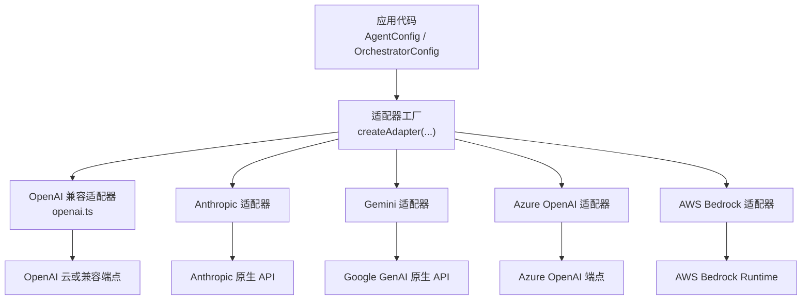
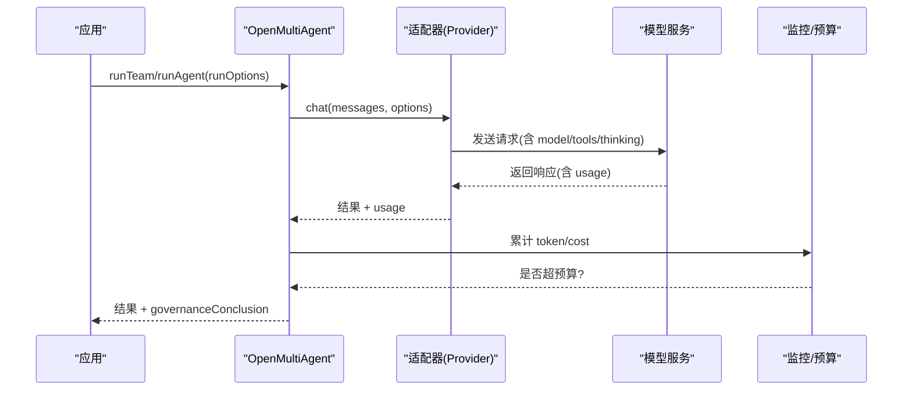
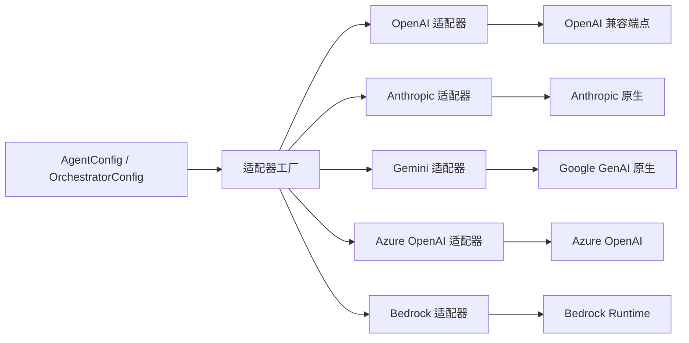
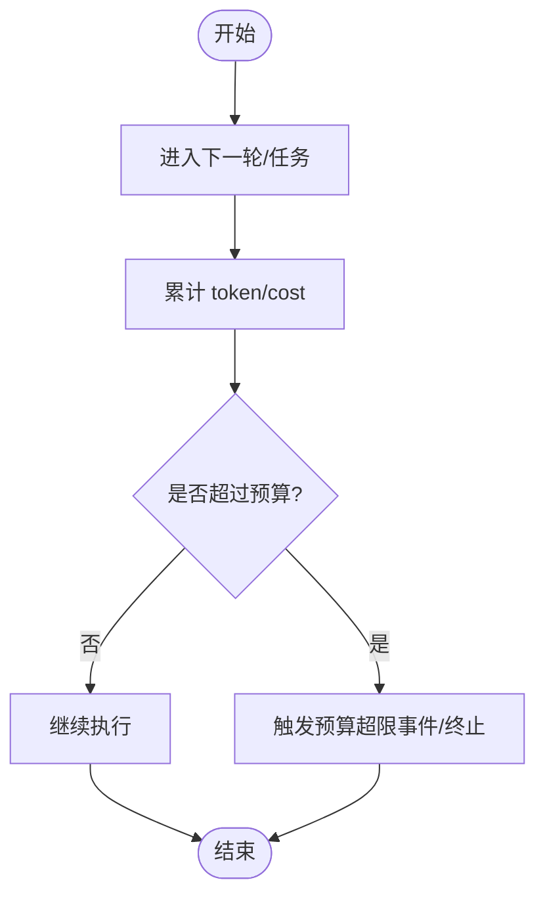

# 模型提供商配置

<cite>
**本文引用的文件**
- [providers.md](file://docs/providers.md)
- [types.ts](file://packages/core/src/types.ts)
- [runner.ts](file://packages/core/src/agent/runner.ts)
- [openai.ts](file://packages/core/src/llm/openai.ts)
- [README.md](file://README.md)
</cite>

## 目录
1. [简介](#简介)
2. [项目结构](#项目结构)
3. [核心组件](#核心组件)
4. [架构总览](#架构总览)
5. [详细组件分析](#详细组件分析)
6. [依赖关系分析](#依赖关系分析)
7. [性能与预算控制](#性能与预算控制)
8. [故障排查指南](#故障排查指南)
9. [结论](#结论)
10. [附录](#附录)

## 简介
本文件面向需要在 Open Multi-Agent（OMA）中接入各类模型提供商的开发者，系统说明内置提供商、OpenAI 兼容提供商、本地模型服务、预算与治理控制、以及 Vercel AI SDK 集成的配置方法。内容基于仓库中的文档与类型定义，聚焦于：
- 支持的提供商清单与环境变量
- API 密钥管理与连接参数
- 本地模型服务的接入方式
- 预算上限与治理策略
- Vercel AI SDK 桥接配置
- 常见问题定位与解决

## 项目结构
与模型提供商配置直接相关的代码与文档主要位于以下位置：
- 文档：docs/providers.md 提供完整的提供商清单、环境变量、示例模型与注意事项
- 类型定义：packages/core/src/types.ts 定义了 AgentConfig、OrchestratorConfig、RunTasksOptions 等关键配置项，涵盖 provider、baseURL、apiKey、region、maxTokenBudget、maxCostBudget 等
- 运行器：packages/core/src/agent/runner.ts 在运行时执行 token 预算检查并产出预算事件
- 适配器：packages/core/src/llm/openai.ts 实现 OpenAI 兼容适配器的密钥解析顺序与调用流程
- 根文档：README.md 提供快速开始与 providers 文档入口

图表来源
- [openai.ts:1-79](file://packages/core/src/llm/openai.ts#L1-L79)
- [providers.md:20-63](file://docs/providers.md#L20-L63)

章节来源
- [providers.md:1-186](file://docs/providers.md#L1-L186)
- [types.ts:933-1069](file://packages/core/src/types.ts#L933-L1069)
- [runner.ts:1204-1215](file://packages/core/src/agent/runner.ts#L1204-L1215)

## 核心组件
- AgentConfig：单个智能体的模型与提供商配置，包含 provider、model、baseURL、apiKey、region、采样参数、工具与思考模式等
- OrchestratorConfig：编排器级配置，可设置默认 provider/model、全局成本估算函数 estimateCost、以及 maxCostBudget
- RunTasksOptions：单次任务运行的预算与治理选项，包括 maxTokenBudget、maxCostBudget、governanceIntent 等
- LLMAdapter：各提供商的统一抽象，OpenAI 兼容适配器负责将内部消息格式映射到 Chat Completions 协议

关键要点
- 通过 provider 选择内置适配器；或通过 baseURL + apiKey 使用任意 OpenAI 兼容服务
- 对于 AWS Bedrock，无需显式 API Key，使用 AWS SDK 凭据链
- 对本地服务（Ollama、vLLM、LM Studio 等），使用 provider: 'openai' 并指向其 /v1 端点

章节来源
- [types.ts:933-1069](file://packages/core/src/types.ts#L933-L1069)
- [types.ts:1514-1528](file://packages/core/src/types.ts#L1514-L1528)
- [providers.md:20-63](file://docs/providers.md#L20-L63)

## 架构总览
下图展示了 OMA 如何根据 AgentConfig 选择适配器，并通过适配器与不同后端通信。同时，编排层会在任务边界进行 token/cost 预算检查，必要时触发治理结论。

图表来源
- [openai.ts:17-20](file://packages/core/src/llm/openai.ts#L17-L20)
- [runner.ts:1204-1215](file://packages/core/src/agent/runner.ts#L1204-L1215)
- [providers.md:70-109](file://docs/providers.md#L70-L109)

## 详细组件分析

### 内置提供商与 OpenAI 兼容提供商
- 内置提供商（快捷方式）：Anthropic、Gemini、OpenAI、Azure OpenAI、GitHub Copilot、Grok、DeepSeek、Doubao、Hunyuan（两种）、MiniMax、MiMo、Qiniu、AWS Bedrock
- OpenAI 兼容提供商：任何实现 Chat Completions 的服务，如 Ollama、vLLM、LM Studio、llama.cpp server、OpenRouter、Groq、Mistral、Zhipu GLM、Qwen(DashScope)、Moonshot、LiteLLM 等

配置要点
- 设置 provider 与对应环境变量（例如 ANTHROPIC_API_KEY、OPENAI_API_KEY、GEMINI_API_KEY 等）
- Azure OpenAI 需要 AZURE_OPENAI_API_KEY、AZURE_OPENAI_ENDPOINT，可选 AZURE_OPENAI_API_VERSION、AZURE_OPENAI_DEPLOYMENT
- Bedrock 无需 API Key，使用 AWS SDK 凭据链与 region
- 其他 OpenAI 兼容服务：provider 设为 'openai'，并配置 baseURL 与必要的 apiKey

章节来源
- [providers.md:20-63](file://docs/providers.md#L20-L63)
- [types.ts:953-963](file://packages/core/src/types.ts#L953-L963)

### API 密钥与环境变量
- OpenAI 兼容适配器密钥解析顺序：优先使用构造时传入的 apiKey，其次回退到 OPENAI_API_KEY
- 各提供商的环境变量见 providers.md 表格（如 ANTHROPIC_API_KEY、GEMINI_API_KEY、XAI_API_KEY、ARK_API_KEY、HUNYUAN_API_KEY、MINIMAX_API_KEY、MIMO_API_KEY、QINIU_API_KEY 等）
- 对于不需要鉴权的本地服务，仍需设置非空的 apiKey 占位符（例如 'ollama'），以满足底层 SDK 校验

章节来源
- [openai.ts:17-20](file://packages/core/src/llm/openai.ts#L17-L20)
- [providers.md:20-63](file://docs/providers.md#L20-L63)
- [types.ts:955-963](file://packages/core/src/types.ts#L955-L963)

### 连接参数与区域
- baseURL：用于 OpenAI 兼容端点（本地或第三方），如 http://localhost:11434/v1
- region：仅对 bedrock 有效，回退顺序为 AgentConfig.region → AWS_REGION → 'us-east-1'
- 其他特定参数：如 Azure 的 API Version、Deployment；部分服务支持 BASE_URL 覆盖默认端点

章节来源
- [types.ts:953-963](file://packages/core/src/types.ts#L953-L963)
- [providers.md:20-63](file://docs/providers.md#L20-L63)

### 本地模型服务（Ollama、vLLM、LM Studio、llama.cpp）
- 使用 provider: 'openai' 并设置 baseURL 指向服务的 /v1 接口
- 若模型以文本形式返回 tool_calls，框架会自动从文本中提取，便于“思考型”或配置不理想的本地模型
- 可通过 timeoutMs、topK、minP、frequencyPenalty、presencePenalty、parallelToolCalls、extraBody 等调整采样与行为
- 某些本地服务器要求 serial tool calls（parallelToolCalls: false）以避免并发 tool_call 流式截断或畸形输出

章节来源
- [providers.md:157-179](file://docs/providers.md#L157-L179)
- [types.ts:1016-1067](file://packages/core/src/types.ts#L1016-L1067)

### 扩展思考/推理（Thinking/Reasoning）
- 统一通过 thinking 配置映射到各提供商原生能力：
  - budgetTokens：映射到 Anthropic thinking.budget_tokens 与 Gemini thinkingConfig.thinkingBudget
  - effort：映射到 OpenAI 兼容 reasoning_effort；超出联合集合的值可通过 extraBody 传递
  - DeepSeek 额外支持 enabled 与 effort: 'max'
- 跨提供商推理保留可通过 preserveReasoningAsText 开启

章节来源
- [providers.md:136-155](file://docs/providers.md#L136-L155)
- [types.ts:740-758](file://packages/core/src/types.ts#L740-L758)

### Vercel AI SDK 集成
- 可选集成：安装 ai 与 @ai-sdk/<provider>，通过 AISdkAdapter(model) 注入到 AgentConfig.adapter
- 当设置了 adapter，provider、apiKey、baseURL、region 将被忽略
- 协调器也支持通过 coordinator.adapter 指定 AISdkAdapter
- 适用于希望统一走 AI SDK 生态的场景

章节来源
- [providers.md:111-134](file://docs/providers.md#L111-L134)

## 依赖关系分析
- 适配器层解耦了上层 AgentConfig 与具体后端实现，使新增提供商只需实现 LLMAdapter
- OpenAI 兼容适配器复用 openai-common 工具函数，处理消息构建、工具转换、推理文本提取等
- 运行期在 runner 中执行 token 预算检查，并在达到阈值时发出预算超限事件
- 编排层在 orchestrator 级别支持 cost 估算与预算上限，结合 runTeam/runTasks 的 per-run 预算形成双重约束

图表来源
- [openai.ts:1-79](file://packages/core/src/llm/openai.ts#L1-L79)
- [providers.md:20-63](file://docs/providers.md#L20-L63)

章节来源
- [types.ts:933-1069](file://packages/core/src/types.ts#L933-L1069)
- [runner.ts:1204-1215](file://packages/core/src/agent/runner.ts#L1204-L1215)

## 性能与预算控制
- Token 预算：
  - 可在 AgentConfig 或 RunTasksOptions 设置 maxTokenBudget
  - 运行器在每个 turn/task 边界检查累计 token，超过阈值会发出预算超限事件并停止继续
- 成本预算：
  - 在 OrchestratorConfig 设置 estimateCost 与 maxCostBudget；runTeam/runTasks 也可设置 per-run 的 maxCostBudget
  - 当多处设置预算时，取最小值生效
  - 若必需治理目标未能在预算内完成，将返回 governanceConclusion: 'unsatisfied' 且 reason: 'budget'
- 治理偏好：
  - 对 preferred 治理意图，可设置 preferredUnderBudget: 'degrade'，在预算限制下降级为单代理执行
- 注意：预算检查发生在 turn/task 边界，可能因一次完整模型调用而略超预算

图表来源
- [runner.ts:1204-1215](file://packages/core/src/agent/runner.ts#L1204-L1215)
- [providers.md:70-109](file://docs/providers.md#L70-L109)
- [types.ts:1514-1528](file://packages/core/src/types.ts#L1514-L1528)

章节来源
- [providers.md:70-109](file://docs/providers.md#L70-L109)
- [runner.ts:1204-1215](file://packages/core/src/agent/runner.ts#L1204-L1215)
- [types.ts:1514-1528](file://packages/core/src/types.ts#L1514-L1528)

## 故障排查指南
- 模型未调用工具：确认所选模型具备工具能力（例如 Ollama Tools 分类）
- Ollama 问题：升级到最新版本，并使用 no_proxy=localhost 避免代理干扰
- 本地服务鉴权：即使无鉴权，也需要设置非空 apiKey（如 'ollama'）以满足 SDK 校验
- 并发工具调用异常：对 vLLM、llama-server 等，设置 parallelToolCalls: false 避免流式截断或畸形输出
- 预算相关：
  - 若出现预算超限事件，检查 maxTokenBudget/maxCostBudget 设置与 estimateCost 实现
  - 必需治理目标未满足时，关注 governanceConclusion 与 governanceReason
- 认证错误：
  - 核对环境变量名与值是否正确（如 ANTHROPIC_API_KEY、OPENAI_API_KEY、GEMINI_API_KEY、XAI_API_KEY、ARK_API_KEY、HUNYUAN_API_KEY、MINIMAX_API_KEY、MIMO_API_KEY、QINIU_API_KEY）
  - Azure OpenAI 需确保 AZURE_OPENAI_API_KEY、AZURE_OPENAI_ENDPOINT、API Version 与 Deployment 正确
  - Bedrock 需确保 AWS 凭据链可用且 region 正确

章节来源
- [providers.md:181-186](file://docs/providers.md#L181-L186)
- [providers.md:20-63](file://docs/providers.md#L20-L63)
- [openai.ts:17-20](file://packages/core/src/llm/openai.ts#L17-L20)
- [types.ts:953-963](file://packages/core/src/types.ts#L953-L963)

## 结论
Open Multi-Agent 通过统一的 AgentConfig 与适配器体系，屏蔽了多提供商差异，支持云端、本地与 OpenAI 兼容服务的一体化接入。借助 token/cost 预算与治理机制，可在保证质量的同时控制成本与风险。Vercel AI SDK 集成进一步扩展了生态兼容性。建议在生产环境中：
- 明确设置 provider、baseURL、apiKey、region 等必要参数
- 合理配置 maxTokenBudget 与 estimateCost/maxCostBudget
- 针对本地服务调优采样与并发参数
- 建立完善的日志与观测，以便快速定位连接与认证问题

## 附录
- 快速开始与 providers 入口参见 README.md
- 更多示例与最佳实践请参考 packages/core/examples 与 docs 下的专题文档

章节来源
- [README.md:48-97](file://README.md#L48-L97)