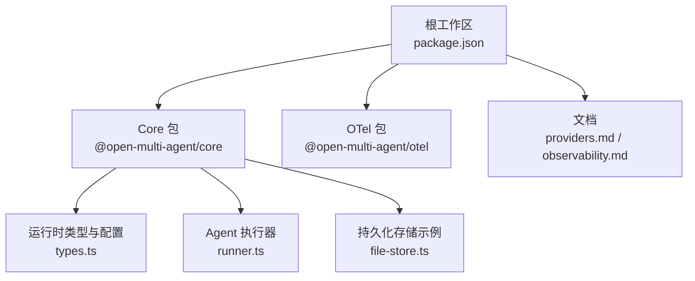
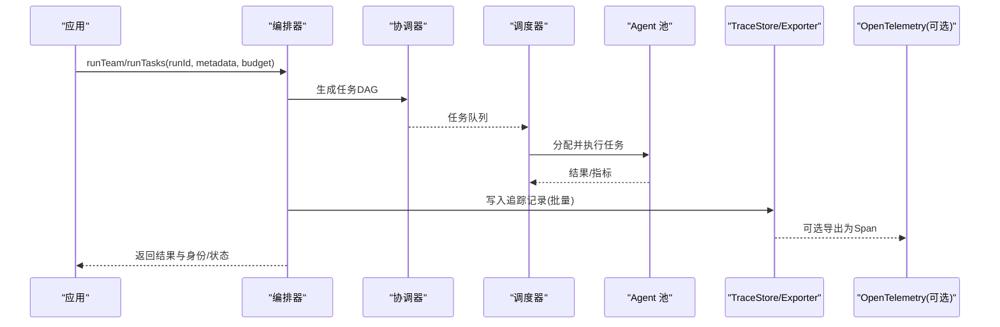
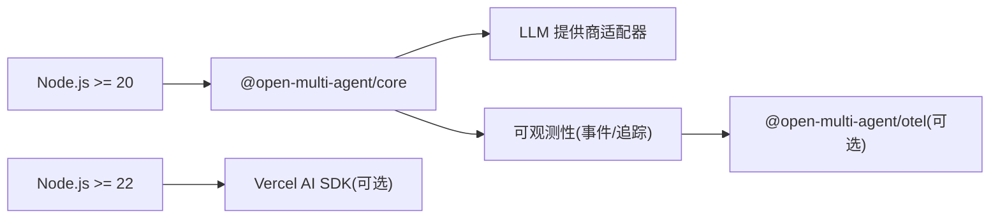

# 生产环境部署

<cite>
**本文引用的文件**
- [README.md](file://README.md)
- [package.json](file://package.json)
- [providers.md](file://docs/providers.md)
- [observability.md](file://docs/observability.md)
- [types.ts](file://packages/core/src/types.ts)
- [runner.ts](file://packages/core/src/agent/runner.ts)
- [file-store.ts](file://packages/core/src/memory/file-store.ts)
</cite>

## 目录
1. [简介](#简介)
2. [项目结构](#项目结构)
3. [核心组件](#核心组件)
4. [架构总览](#架构总览)
5. [详细组件分析](#详细组件分析)
6. [依赖关系分析](#依赖关系分析)
7. [性能与资源规划](#性能与资源规划)
8. [容器化与编排](#容器化与编排)
9. [配置管理与密钥安全](#配置管理与密钥安全)
10. [监控、可观测性与告警](#监控可观测性与告警)
11. [高可用与负载均衡](#高可用与负载均衡)
12. [备份恢复与灾难恢复](#备份恢复与灾难恢复)
13. [故障排查指南](#故障排查指南)
14. [结论](#结论)

## 简介
本指南面向在生产环境部署 Open Multi-Agent（OMA）的团队，覆盖运行时要求、系统依赖、资源规划、容器化与编排、配置与密钥管理、监控与告警、高可用与负载均衡、以及备份恢复与灾难恢复。内容基于仓库中的官方文档与源码接口定义，确保与框架能力一致。

## 项目结构
- 根工作区提供 Node.js 工程元数据与工作区脚本，约束运行环境与构建命令。
- Core 包提供编排运行时、工具、内存、检查点、追踪与离线查看器；可选 OTel 包用于企业级可观测性集成。
- 文档目录包含提供者、可观测性、任务调度等专题说明。

**图表来源**
- [package.json:1-34](file://package.json#L1-L34)
- [types.ts:2132-2210](file://packages/core/src/types.ts#L2132-L2210)
- [runner.ts:216-245](file://packages/core/src/agent/runner.ts#L216-L245)
- [file-store.ts:1-23](file://packages/core/src/memory/file-store.ts#L1-L23)

**章节来源**
- [package.json:1-34](file://package.json#L1-L34)
- [README.md:48-66](file://README.md#L48-L66)

## 核心组件
- 运行时与配置：通过 OrchestratorConfig 控制并发、调度策略、预算上限、默认模型与提供者、检查点与恢复策略等。
- Agent 执行器：RunnerOptions 暴露采样参数、超时、工具调用行为、回调钩子与追踪上下文。
- 存储与检查点：FileStore 提供进程内原子写入的 JSON 文件存储，适合检查点与轻量持久化。
- 可观测性：支持事件流、结构化追踪、离线 Run Viewer，以及可选 OTel 导出。

**章节来源**
- [types.ts:2132-2210](file://packages/core/src/types.ts#L2132-L2210)
- [runner.ts:216-245](file://packages/core/src/agent/runner.ts#L216-L245)
- [file-store.ts:1-23](file://packages/core/src/memory/file-store.ts#L1-L23)

## 架构总览
下图展示 OMA 在生产环境的关键路径：应用侧通过 Orchestrator 创建团队并执行任务，内部由协调器生成 DAG，调度器驱动 Agent 池执行，结果与追踪数据经 Sink/Exporter 输出到 TraceStore 或 OTel 后端。

**图表来源**
- [types.ts:2132-2210](file://packages/core/src/types.ts#L2132-L2210)
- [observability.md:185-222](file://docs/observability.md#L185-L222)
- [observability.md:459-525](file://docs/observability.md#L459-L525)

## 详细组件分析

### 运行时与配置（OrchestratorConfig）
- 并发与调度：maxConcurrency、schedulingStrategy、schedulingWeights、strictAssignees。
- 路由与治理：executionRouter、executionRouting、governanceIntent、requiredRoles、requiredOrder。
- 预算与成本：maxTokenBudget、maxCostBudget、estimateCost。
- 默认模型与提供者：defaultModel、defaultProvider、defaultBaseURL、defaultApiKey。
- 检查点与恢复：checkpoint、recovery（含 onTaskOutcome/replanner/onPlanPatch）。

这些字段决定了生产环境的稳定性、可观测性与成本控制边界。

**章节来源**
- [types.ts:2132-2210](file://packages/core/src/types.ts#L2132-L2210)

### Agent 执行器（RunnerOptions）
- 采样与质量：temperature、topP、topK、minP、parallelToolCalls、extraBody。
- 推理/思考：thinking（映射到各提供商的 reasoning/thinking 设置）。
- 超时与中止：timeoutMs、abortSignal。
- 追踪与诊断：onWarning、onTrace、runId/taskId/traceAgent/traceSpanId/traceParentId。

这些选项直接影响本地/云端模型的延迟、吞吐与稳定性。

**章节来源**
- [runner.ts:216-245](file://packages/core/src/agent/runner.ts#L216-L245)
- [types.ts:1041-1089](file://packages/core/src/types.ts#L1041-L1089)

### 存储与检查点（FileStore）
- 单文件 JSON 存储，内存镜像 + 原子写入（临时文件 + fsync + rename），保证崩溃后一致性。
- 推荐作为检查点存储；共享内存可使用 InMemoryStore 以获得更高吞吐。
- 适用于单进程场景，跨进程需外部锁或分布式存储。

**章节来源**
- [file-store.ts:1-23](file://packages/core/src/memory/file-store.ts#L1-L23)

### 可观测性（事件、追踪、OTel）
- 事件：onProgress 提供轻量生命周期事件。
- 追踪：onTrace 或 observability.sinks（BatchingTraceSink + TraceStoreExporter）。
- 存储：InMemoryTraceStore（测试/本地）、FileTraceStore（单进程持久化）。
- 导出：可选 @open-multi-agent/otel 将 TraceRecord 转为 OTel Span。

**章节来源**
- [observability.md:185-222](file://docs/observability.md#L185-L222)
- [observability.md:224-287](file://docs/observability.md#L224-L287)
- [observability.md:459-525](file://docs/observability.md#L459-L525)

## 依赖关系分析
- 运行时：Node.js >= 20（推荐 LTS，生产建议使用当前维护的 LTS）。
- 可选依赖：AI SDK（ai + @ai-sdk/*）需要 Node.js >= 22；OTel 包独立安装。
- 提供者：内置多种提供商与 OpenAI 兼容端点；部分提供商需额外安装 SDK。

**图表来源**
- [package.json:30-32](file://package.json#L30-L32)
- [providers.md:5-9](file://docs/providers.md#L5-L9)
- [providers.md:111-114](file://docs/providers.md#L111-L114)
- [observability.md:459-525](file://docs/observability.md#L459-L525)

**章节来源**
- [package.json:30-32](file://package.json#L30-L32)
- [providers.md:5-9](file://docs/providers.md#L5-L9)

## 性能与资源规划
- 并发与吞吐：通过 maxConcurrency 与调度策略（如 least-busy、composite）平衡负载；对长耗时任务使用 least-busy，对强依赖图使用 dependency-first。
- 预算控制：设置 maxTokenBudget 与 maxCostBudget，结合 estimateCost 实现成本封顶；注意预算检查在 turn/task 边界生效，可能超一个模型调用。
- 超时与重试：为 Agent 设置 timeoutMs；利用框架的重试与循环检测机制避免无限重试。
- I/O 与存储：检查点使用 FileStore 时注意 fsync 开销；共享内存建议用 InMemoryStore 提升性能。
- 网络与外部依赖：合理配置 provider baseURL、API Key 与区域；对慢速本地模型提高超时。

[本节为通用指导，不直接分析具体文件]

## 容器化与编排
- 基础镜像：选择 Node.js LTS 镜像（>= 20），固定 Node 版本以保障可重现构建。
- 构建步骤：在工作区根执行构建脚本，仅打包必要产物；使用 .dockerignore 排除 node_modules、测试与文档。
- 运行入口：以非 root 用户运行进程；暴露服务端口（若封装为 HTTP API）。
- 健康检查：实现 /health 与 /ready 探针，读取进程状态与外部依赖连通性。
- 资源限制：为 Pod/Container 设置 requests/limits（CPU/内存），并结合 maxConcurrency 与模型调用速率调优。
- 多实例：通过副本数与水平扩缩容（HPA）应对流量峰值；配合外部缓存与消息队列解耦。

[本节为通用指导，不直接分析具体文件]

## 配置管理与密钥安全
- 环境变量：按提供商要求注入密钥（例如 OPENAI_API_KEY、ANTHROPIC_API_KEY、GEMINI_API_KEY、AZURE_OPENAI_*、XAI_API_KEY、DEEPSEEK_API_KEY、ARK_API_KEY、HUNYUAN_BASE_URL/HUNYUAN_API_KEY、MINIMAX_BASE_URL/MINIMAX_API_KEY、MIMO_API_KEY/MIMO_BASE_URL、QINIU_API_KEY、ZHIPU_API_KEY、MOONSHOT_API_KEY、DASHSCOPE_API_KEY、LITELLM_API_KEY 等）。
- 配置分层：基础配置（模型、提供者、baseURL）与环境相关配置（密钥、日志级别、限流）分离；使用只读挂载与最小权限原则。
- 密钥管理：使用平台密钥管理服务（如 Kubernetes Secrets、云厂商 KMS/Secrets Manager）注入；禁止硬编码与提交至代码库。
- 隐私与脱敏：追踪默认不包含提示与结果；如需捕获敏感内容，显式启用 capture 策略；对检查点与共享内存中的敏感信息使用 RedactingStore 包装。

**章节来源**
- [providers.md:26-63](file://docs/providers.md#L26-L63)
- [observability.md:743-768](file://docs/observability.md#L743-L768)

## 监控、可观测性与告警
- 指标收集：
  - 使用 onProgress 获取轻量事件（task_start/complete、budget_exceeded、error 等）。
  - 使用 observability.sinks 接入 BatchingTraceSink，聚合追踪记录。
  - 通过 TraceStoreExporter 写入 InMemoryTraceStore/FileTraceStore，或接入 OTel 后端。
- 错误日志聚合：
  - 将错误与诊断信息统一上报到日志系统；避免在诊断中携带敏感数据。
  - 对 exporter 失败进行降级与告警，不影响业务结果。
- 健康检查：
  - 进程级：存活探针检查进程是否存活。
  - 就绪探针：检查外部依赖（数据库、缓存、LLM 提供商）连通性。
  - 业务级：检查最近一次运行的状态与延迟分位。
- 告警策略：
  - 基于错误率、预算耗尽、超时比例、追踪丢失率、导出失败率设置阈值。
  - 对关键链路（协调器、调度器、Agent 池）设置独立告警。

**章节来源**
- [observability.md:602-667](file://docs/observability.md#L602-L667)
- [observability.md:527-600](file://docs/observability.md#L527-L600)

## 高可用与负载均衡
- 多实例部署：通过副本数与滚动更新保证服务连续性；每个实例无状态或仅持有本地缓存。
- 负载均衡：使用反向代理或服务网格分发请求；对长耗时任务采用异步队列与回调。
- 故障转移：
  - 外部依赖故障：启用 fallback 路由（provider/baseURL/region）与重试退避。
  - 节点故障：自动拉起新实例；检查点与追踪数据集中存储以便恢复。
- 弹性伸缩：根据 CPU/内存与自定义指标（如队列长度、错误率）触发 HPA。

[本节为通用指导，不直接分析具体文件]

## 备份恢复与灾难恢复
- 检查点：使用 checkpoint 与 restore 在任务边界保存执行快照；FileStore 提供原子写入与崩溃恢复。
- 追踪与审计：持久化 TraceRecord v2 到 FileTraceStore 或远程存储；定期归档与保留策略。
- 共享内存：生产环境建议使用外部存储（Redis/Postgres）替代进程内存储，以实现跨实例共享与持久化。
- 灾难恢复：
  - 定期全量备份检查点与追踪数据。
  - 制定 RTO/RPO 目标，演练恢复流程。
  - 对关键运行使用“计划回放”与“共识验证”增强可靠性。

**章节来源**
- [file-store.ts:1-23](file://packages/core/src/memory/file-store.ts#L1-L23)
- [observability.md:255-375](file://docs/observability.md#L255-L375)

## 故障排查指南
- 常见问题定位：
  - 模型未调用工具：确认提供商与模型支持；检查 baseURL 与 apiKey。
  - 本地模型慢：增大 timeoutMs；调整 topK/minP/parallelToolCalls。
  - 追踪丢失：检查 BatchingTraceSink 队列与导出失败；必要时降低批大小或增加超时。
- 诊断手段：
  - 使用 onProgress 快速定位卡点。
  - 使用离线 Run Viewer 回放任务 DAG 与 Waterfall。
  - 检查 TraceStore 查询结果与运行摘要。
- 处理策略：
  - 对可重试错误实施指数退避；对终端错误快速失败。
  - 对预算超限及时降级或终止任务。

**章节来源**
- [providers.md:181-186](file://docs/providers.md#L181-L186)
- [observability.md:670-741](file://docs/observability.md#L670-L741)

## 结论
在生产环境部署 Open Multi-Agent 时，应严格遵循 Node.js 版本要求，合理配置并发、预算与超时，使用检查点与追踪保障可恢复性与可观测性，并通过容器化与编排实现高可用与弹性伸缩。结合密钥管理与监控告警，形成完整的运维闭环。