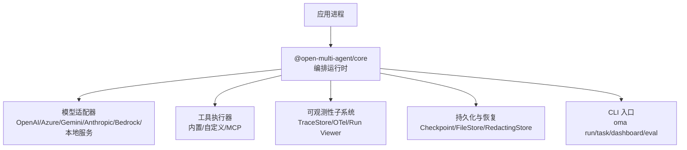
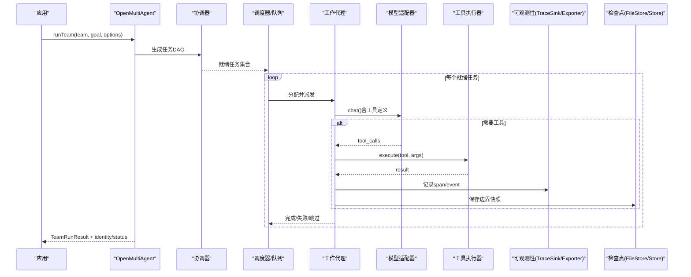
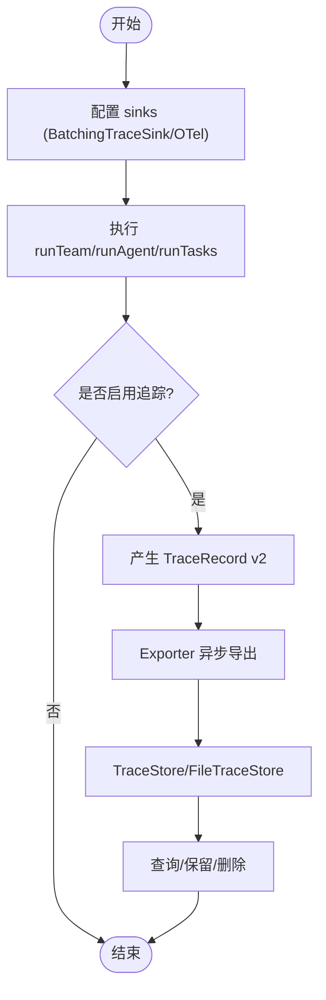
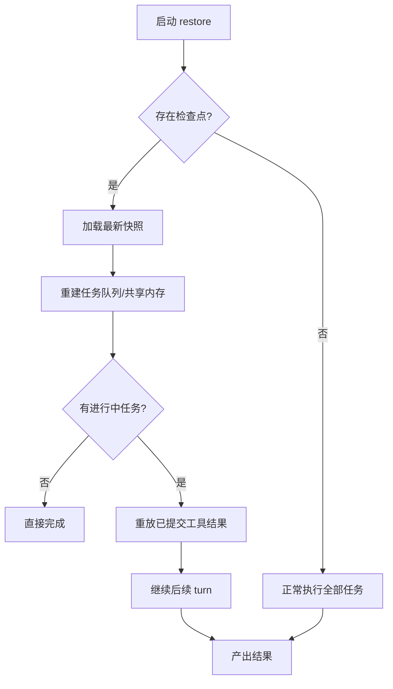
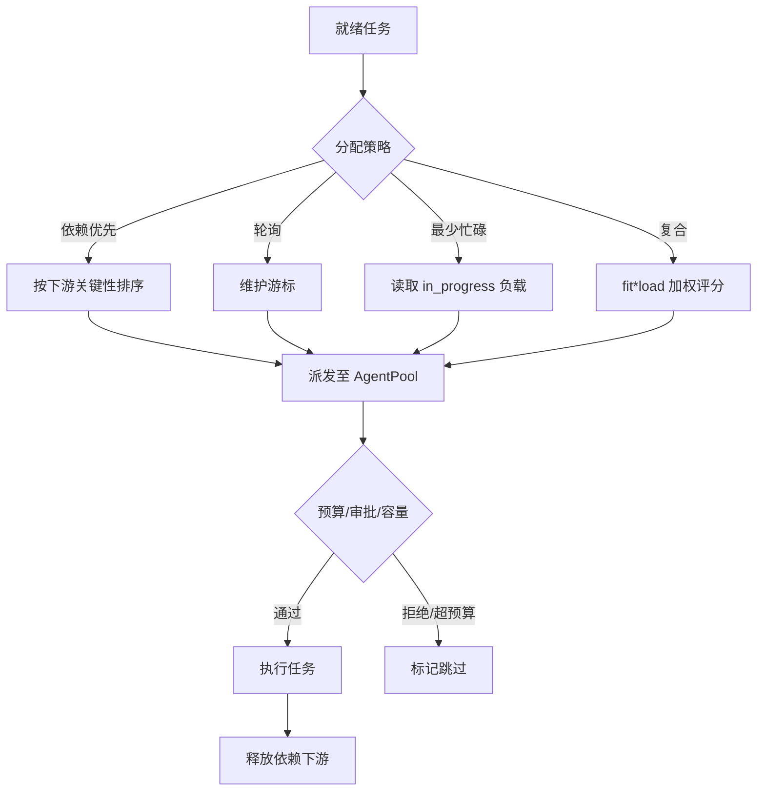
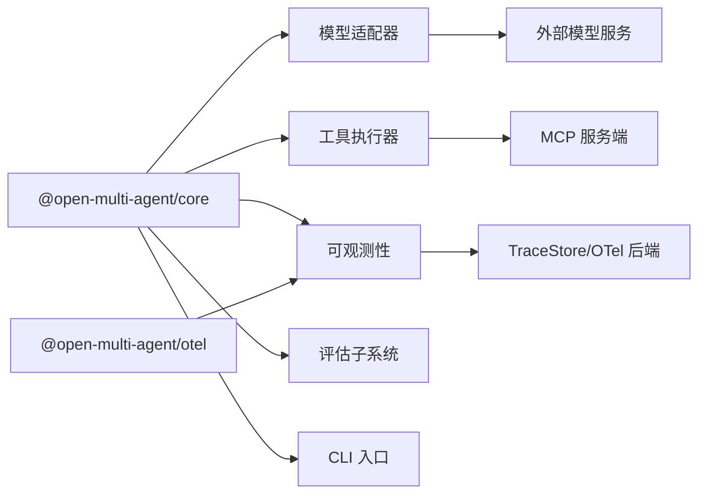

# 部署运维

<cite>
**本文引用的文件**
- [README.md](file://README.md)
- [providers.md](file://docs/providers.md)
- [tool-configuration.md](file://docs/tool-configuration.md)
- [cli.md](file://docs/cli.md)
- [observability.md](file://docs/observability.md)
- [checkpoint.md](file://docs/checkpoint.md)
- [evaluation.md](file://docs/evaluation.md)
- [task-scheduling.md](file://docs/task-scheduling.md)
- [packages/core/README.md](file://packages/core/README.md)
</cite>

## 目录
1. [简介](#简介)
2. [项目结构](#项目结构)
3. [核心组件](#核心组件)
4. [架构总览](#架构总览)
5. [详细组件分析](#详细组件分析)
6. [依赖关系分析](#依赖关系分析)
7. [性能考虑](#性能考虑)
8. [故障排查指南](#故障排查指南)
9. [结论](#结论)
10. [附录](#附录)

## 简介
本指南面向生产环境，聚焦 Open Multi-Agent（OMA）的部署与运维。内容涵盖：
- 多模型提供商配置、API 密钥管理、连接与超时控制、负载均衡策略
- 工具安全与沙箱隔离、权限控制、审计日志
- CLI 项目管理、调试与监控命令
- 容器化部署、配置管理、监控告警、与企业监控系统的集成
- 性能调优、故障排查、备份恢复等运维操作

## 项目结构
仓库采用文档驱动的多包组织方式：
- docs：提供生产运维相关文档（提供商、工具配置、可观测性、检查点、评估、任务调度、CLI 等）
- packages/core：编排运行时、工具、记忆、检查点、追踪、CLI、离线 Run Viewer
- packages/otel：可选的企业级 OpenTelemetry 集成
- scripts：示例与验证脚本

图表来源
- [packages/core/README.md:49-101](file://packages/core/README.md#L49-L101)
- [observability.md:185-224](file://docs/observability.md#L185-L224)
- [checkpoint.md:49-73](file://docs/checkpoint.md#L49-L73)

章节来源
- [README.md:140-157](file://README.md#L140-L157)
- [packages/core/README.md:49-101](file://packages/core/README.md#L49-L101)

## 核心组件
- 编排器与团队运行：runTeam/runAgent/runTasks/runFromPlan/runConsensus/restore
- 模型适配层：内置 provider 与 OpenAI 兼容端点；支持 Vercel AI SDK 桥接
- 工具系统：默认拒绝、预设/白名单/黑名单、per-call onToolCall 门控、MCP 工具
- 可观测性：v2 TraceRecord、BatchingTraceSink、FileTraceStore、OTel 适配器、离线 Run Viewer
- 检查点与恢复：FileStore/InMemoryStore、RedactingStore、mid-task 工具恢复
- 评估与质量门禁：EvalSet、Scorer、GatePolicy、CLI eval 子命令
- 任务调度：事件驱动 DAG、分配策略、审批模式、预算与中断

章节来源
- [packages/core/README.md:103-185](file://packages/core/README.md#L103-L185)
- [task-scheduling.md:1-26](file://docs/task-scheduling.md#L1-L26)
- [tool-configuration.md:214-238](file://docs/tool-configuration.md#L214-L238)
- [observability.md:151-224](file://docs/observability.md#L151-L224)
- [checkpoint.md:11-73](file://docs/checkpoint.md#L11-L73)
- [evaluation.md:1-18](file://docs/evaluation.md#L1-L18)

## 架构总览
下图展示一次 runTeam 从目标到结果的关键路径，包括协调器规划、任务调度、模型调用、工具执行、可观测性与检查点写入。

图表来源
- [packages/core/README.md:103-185](file://packages/core/README.md#L103-L185)
- [task-scheduling.md:1-26](file://docs/task-scheduling.md#L1-L26)
- [observability.md:185-224](file://docs/observability.md#L185-L224)
- [checkpoint.md:109-143](file://docs/checkpoint.md#L109-L143)

## 详细组件分析

### 模型提供商与密钥管理
- 内置 Provider 快捷方式：Anthropic、Gemini、OpenAI、Azure OpenAI、Copilot、Grok、DeepSeek、Doubao、Hunyuan、MiniMax、MiMo、Qiniu、Bedrock
- OpenAI 兼容端点：Ollama、vLLM、LM Studio、llama.cpp、OpenRouter、Groq、Mistral、Zhipu GLM、Qwen(DashScope)、Moonshot、LiteLLM 等
- 密钥与环境变量：各 provider 通过环境变量注入（如 OPENAI_API_KEY、ANTHROPIC_API_KEY、AZURE_OPENAI_*、XAI_API_KEY、DEEPSEEK_API_KEY、ARK_API_KEY、HUNYUAN_API_KEY、MINIMAX_API_KEY、MIMO_API_KEY、QINIU_API_KEY），部分 provider 支持 baseURL 覆盖
- 连接与超时：AgentConfig.callTimeoutMs 为单次 adapter.chat() 设置统一超时；timeoutMs 用于整轮上限；对慢速本地推理建议增大 callTimeoutMs
- 负载均衡与路由：
  - 执行路由：deterministic/hybrid，决定 Single vs Team
  - 模型路由：在拓扑内选择具体模型/后端
  - 预算上限：maxTokenBudget/maxCostBudget + estimateCost 实现成本封顶
- 本地模型工具调用：OpenAI 兼容服务器原生 tool_calls；若返回文本形式，框架自动提取；可通过 topK/minP/frequencyPenalty/presencePenalty/parallelToolCalls/extraBody 微调采样与行为

章节来源
- [providers.md:20-68](file://docs/providers.md#L20-L68)
- [providers.md:70-110](file://docs/providers.md#L70-L110)
- [providers.md:111-180](file://docs/providers.md#L111-L180)
- [packages/core/README.md:149-167](file://packages/core/README.md#L149-L167)

### 工具配置与安全
- 默认拒绝：内置工具需显式授予（tools 或 toolPreset），未声明则零工具
- 预设与过滤：readonly/readwrite/full 预设；结合 allowlist/denylist 精确控制
- 后果性工具：consequential=true 的工具触发“无独立治理”标记；可开启 requireConsequentialConfirmation 进行确认门控
- per-call 门控：onToolCall 在输入校验后、执行前拦截；支持 suspend 持久化审批；支持 bash 风险分类器
- 文件系统沙箱：file_* 工具限制在 per-agent 工作目录；bash 不沙箱化，应使用进程级隔离（容器/VM/seccomp）
- 凭据作用域：AgentConfig.credentials 按 agent 隔离传递，避免共享闭包泄露
- 输出控制：maxToolOutputChars、compressToolResults、rich modelOutput（text/image/file）
- MCP 工具：stdio 传输，仅传入必要环境变量，避免扩散 process.env

章节来源
- [tool-configuration.md:214-238](file://docs/tool-configuration.md#L214-L238)
- [tool-configuration.md:251-290](file://docs/tool-configuration.md#L251-L290)
- [tool-configuration.md:326-390](file://docs/tool-configuration.md#L326-L390)
- [tool-configuration.md:391-443](file://docs/tool-configuration.md#L391-L443)
- [tool-configuration.md:469-506](file://docs/tool-configuration.md#L469-L506)
- [tool-configuration.md:507-674](file://docs/tool-configuration.md#L507-L674)
- [tool-configuration.md:675-709](file://docs/tool-configuration.md#L675-L709)

### CLI 工具与项目管理
- 安装与调用：npx oma / node packages/core/dist/cli/oma.js
- 命令：
  - run：执行 runTeam，支持 --dashboard 导出静态 Run Viewer
  - dashboard：从 FileTraceStore 导出历史运行
  - task：执行固定任务列表 runTasks
  - eval run/gate：离线评估与质量门禁
  - provider：列出 provider 模板与环境变量
- 配置文件：team.json、tasks.json、orchestrator/coordinator JSON；defaultCwd/cwd 控制沙箱根
- 输出与退出码：stdout 单条 JSON；exit 0/1/2/3 表示成功/业务失败/参数错误/崩溃
- 限制：非交互、无会话、无 TTY、无 onApproval/onTaskDispatch 的 JSON 配置

章节来源
- [cli.md:1-26](file://docs/cli.md#L1-L26)
- [cli.md:29-57](file://docs/cli.md#L29-L57)
- [cli.md:59-91](file://docs/cli.md#L59-L91)
- [cli.md:93-185](file://docs/cli.md#L93-L185)
- [cli.md:193-301](file://docs/cli.md#L193-L301)
- [cli.md:304-444](file://docs/cli.md#L304-L444)

### 可观测性与企业监控集成
- 三层遥测：进度事件、结构化追踪 span、离线 Run Viewer
- 运行身份与状态：identity(runId/attempt/traceId/rootSpanId)、status(code/message)
- TraceRecord v2：span_start/span_event/span_end，层级与链接关系明确
- Sink/Exporter：BatchingTraceSink 异步批处理；TraceStore 持久化；OTel 适配器将 OMA 记录映射为 OTel Span/Event/Link
- FileTraceStore：追加 NDJSON，原子提交，fsync 边界，压缩与删除
- 隐私默认：不采集 prompt/completion/tool 输入输出；credentials 自动脱敏
- 生命周期：forceFlush/shutdown 由应用拥有；短生命周期 CLI/函数式场景需显式 flush/shutdown

图表来源
- [observability.md:12-83](file://docs/observability.md#L12-L83)
- [observability.md:151-224](file://docs/observability.md#L151-L224)
- [observability.md:224-446](file://docs/observability.md#L224-L446)
- [observability.md:459-525](file://docs/observability.md#L459-L525)
- [observability.md:527-600](file://docs/observability.md#L527-L600)

章节来源
- [observability.md:12-83](file://docs/observability.md#L12-L83)
- [observability.md:151-224](file://docs/observability.md#L151-L224)
- [observability.md:224-446](file://docs/observability.md#L224-L446)
- [observability.md:459-525](file://docs/observability.md#L459-L525)
- [observability.md:527-600](file://docs/observability.md#L527-L600)

### 检查点与恢复（备份恢复）
- 启用：OrchestratorConfig.checkpoint 或 per-call checkpoint；默认复用团队 shared-memory store
- 持久化：FileStore 原子写（临时文件→fsync→rename）；InMemoryStore 适合测试
- 恢复：restore() 重建任务队列与共享内存，跳过已完成任务，重放已提交的工具结果
- 保存内容：执行身份、任务队列、共享内存、已完成任务结果、进行中 runner 状态、审批延续状态、任务元数据
- 敏感信息：RedactingStore 可在存储边界脱敏；注意 resume 会看到 [redacted]
- mid-task 工具恢复：按 toolCallId 幂等重放；外部副作用需自行幂等

图表来源
- [checkpoint.md:11-73](file://docs/checkpoint.md#L11-L73)
- [checkpoint.md:74-107](file://docs/checkpoint.md#L74-L107)
- [checkpoint.md:109-143](file://docs/checkpoint.md#L109-L143)
- [checkpoint.md:172-204](file://docs/checkpoint.md#L172-L204)
- [checkpoint.md:206-249](file://docs/checkpoint.md#L206-L249)

章节来源
- [checkpoint.md:11-73](file://docs/checkpoint.md#L11-L73)
- [checkpoint.md:74-107](file://docs/checkpoint.md#L74-L107)
- [checkpoint.md:109-143](file://docs/checkpoint.md#L109-L143)
- [checkpoint.md:172-204](file://docs/checkpoint.md#L172-L204)
- [checkpoint.md:206-249](file://docs/checkpoint.md#L206-L249)

### 任务调度与负载均衡
- 事件驱动：ready 集立即派发下游任务，无需等待无关分支
- 分配策略：dependency-first、round-robin、least-busy、composite（权重组合 fit/load）
- 能力匹配：requires(requiredTools/requiredCapabilities/requiredBackend/requiredProvider) 硬过滤
- 审批模式：onTaskDispatch（单任务派发前）与 onApproval（批次/回合语义）二选一
- 中断与预算：drain-then-skip；预算超限停止新任务，已在飞任务结算
- 结构化依赖载荷：output/structured/both，限制 64 KiB

图表来源
- [task-scheduling.md:1-26](file://docs/task-scheduling.md#L1-L26)
- [task-scheduling.md:98-133](file://docs/task-scheduling.md#L98-L133)
- [task-scheduling.md:135-164](file://docs/task-scheduling.md#L135-L164)
- [task-scheduling.md:166-184](file://docs/task-scheduling.md#L166-L184)

章节来源
- [task-scheduling.md:1-26](file://docs/task-scheduling.md#L1-L26)
- [task-scheduling.md:98-133](file://docs/task-scheduling.md#L98-L133)
- [task-scheduling.md:135-164](file://docs/task-scheduling.md#L135-L164)
- [task-scheduling.md:166-184](file://docs/task-scheduling.md#L166-L184)

### 评估与质量门禁
- EvalSet/Scorer：离线批量或在线采样；scorer_error 不计入平均分
- 参考 Scorer：toolCallSuccess、costBudget、dependencyUtilization、duplicateWork、noProgress、answerRelevancy
- 在线评估：OpenMultiAgent.evaluation 配置 sample/budget/store；不影响业务结果
- CLI eval：oma eval run/gate 输出报告与门禁判定；支持 baseline 回归检测
- CI 门禁：阈值、健康度、基线比较；失败时 exit 1

章节来源
- [evaluation.md:1-18](file://docs/evaluation.md#L1-L18)
- [evaluation.md:20-74](file://docs/evaluation.md#L20-L74)
- [evaluation.md:90-139](file://docs/evaluation.md#L90-L139)
- [evaluation.md:140-240](file://docs/evaluation.md#L140-L240)
- [evaluation.md:287-387](file://docs/evaluation.md#L287-L387)
- [evaluation.md:389-578](file://docs/evaluation.md#L389-L578)

## 依赖关系分析
- 运行时依赖：Node.js 20+（推荐 22/24）；OpenAI SDK v6（OpenAI/兼容端点）
- 可选依赖：@google/genai（Gemini）、@aws-sdk/client-bedrock-runtime（Bedrock）、@modelcontextprotocol/sdk（MCP）、Vercel AI SDK（可选桥接）
- 模块耦合：core 暴露 orchestrator/agent/runner/observability/eval 等；otel 作为独立包适配 OTel
- 外部集成：模型 API、MCP 服务端、TraceStore/OTel 后端、CI 评估网关

图表来源
- [providers.md:20-68](file://docs/providers.md#L20-L68)
- [observability.md:459-525](file://docs/observability.md#L459-L525)
- [tool-configuration.md:675-709](file://docs/tool-configuration.md#L675-L709)

章节来源
- [providers.md:20-68](file://docs/providers.md#L20-L68)
- [observability.md:459-525](file://docs/observability.md#L459-L525)
- [tool-configuration.md:675-709](file://docs/tool-configuration.md#L675-L709)

## 性能考虑
- 模型调用超时：为每调用设置 callTimeoutMs，避免单个 provider 挂起拖垮整体
- 采样与并发：topK/minP/frequencyPenalty/presencePenalty/parallelToolCalls 调节本地模型稳定性与吞吐
- 工具输出控制：maxToolOutputChars、compressToolResults 减少上下文膨胀与成本
- 任务调度：composite 策略平衡能力匹配与负载；dependency-first 降低关键路径延迟
- 可观测性开销：BatchingTraceSink 默认队列/批大小/重试/退避；按需关闭诊断或静音
- 预算控制：maxTokenBudget/maxCostBudget + estimateCost 防止成本失控

章节来源
- [providers.md:157-180](file://docs/providers.md#L157-L180)
- [tool-configuration.md:507-674](file://docs/tool-configuration.md#L507-L674)
- [task-scheduling.md:98-133](file://docs/task-scheduling.md#L98-L133)
- [observability.md:572-600](file://docs/observability.md#L572-L600)
- [providers.md:70-110](file://docs/providers.md#L70-L110)

## 故障排查指南
- 模型未调用工具：确认模型具备 tool-calling 能力；更新本地服务版本；必要时调整采样参数
- 代理/代理冲突：检查 requires/能力标签/后端/provider 约束是否满足；严格 assignee 校验
- 工具被拒绝：确认工具已授予且未被 disallowedTools 排除；onToolCall 是否 deny/suspend
- 沙箱路径错误：确保 file_* 使用绝对路径且在 defaultCwd/cwd 范围内；bash 不受沙箱保护
- 检查点写入失败：onProgress 捕获 checkpoint_save_failed；恢复仍继续；必要时切换更可靠存储
- 可观测性丢失：确认 sink/exporter 生命周期；shutdown/flush 顺序；队列溢出导致丢弃
- 评估失败：scorer_error 不计分；检查 store 容量与保留策略；baseline 版本一致性

章节来源
- [providers.md:181-186](file://docs/providers.md#L181-L186)
- [task-scheduling.md:116-133](file://docs/task-scheduling.md#L116-L133)
- [tool-configuration.md:214-238](file://docs/tool-configuration.md#L214-L238)
- [tool-configuration.md:391-443](file://docs/tool-configuration.md#L391-L443)
- [checkpoint.md:154-170](file://docs/checkpoint.md#L154-L170)
- [observability.md:527-600](file://docs/observability.md#L527-L600)
- [evaluation.md:47-74](file://docs/evaluation.md#L47-L74)

## 结论
OMA 在生产环境中提供可控的动态编排、强一致的可观测性与恢复能力、细粒度的工具安全与权限控制，以及完善的评估与质量门禁。通过合理的提供商配置、沙箱与门控、检查点与恢复、可观测性与评估体系，可以构建稳定、可审计、可回滚的多智能体生产系统。

## 附录

### 生产部署最佳实践清单
- 容器化：以最小镜像运行 Node LTS；只暴露必要端口；使用只读文件系统与最小权限
- 配置管理：集中化管理环境变量与密钥；避免将密钥写入代码或日志
- 可观测性：启用 BatchTraceSink + TraceStore/OTel；定期 flush/shutdown；设置诊断级别
- 监控告警：基于 status.code（error/timeout/budget_exhausted/rejected）与 exporter 统计告警
- 备份恢复：使用 FileStore 做检查点持久化；定期 compact；跨进程不共享同一文件路径
- 评估门禁：CI 中运行 eval run/gate；维护 baseline；失败阻断发布

章节来源
- [observability.md:527-600](file://docs/observability.md#L527-L600)
- [checkpoint.md:49-73](file://docs/checkpoint.md#L49-L73)
- [evaluation.md:462-578](file://docs/evaluation.md#L462-L578)