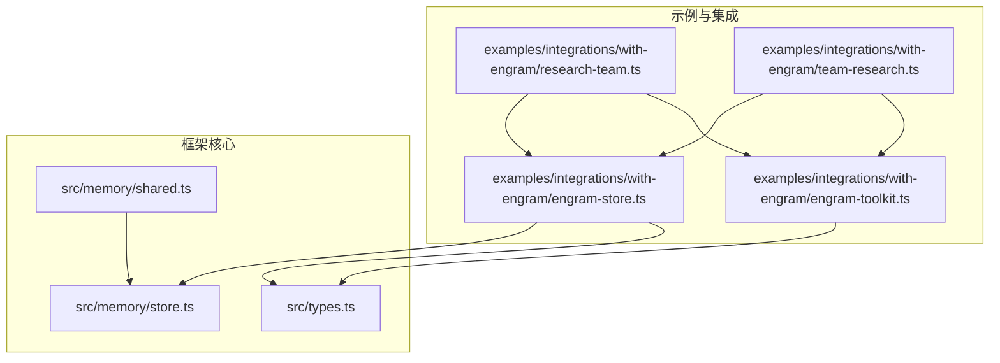
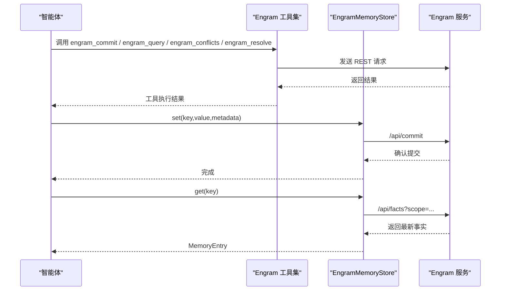
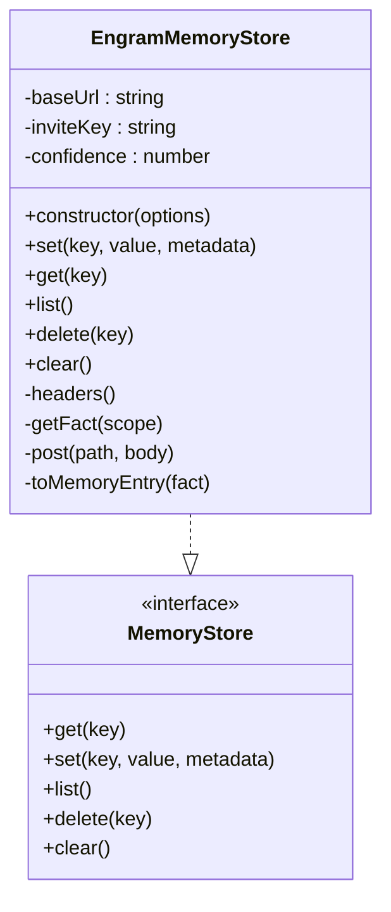
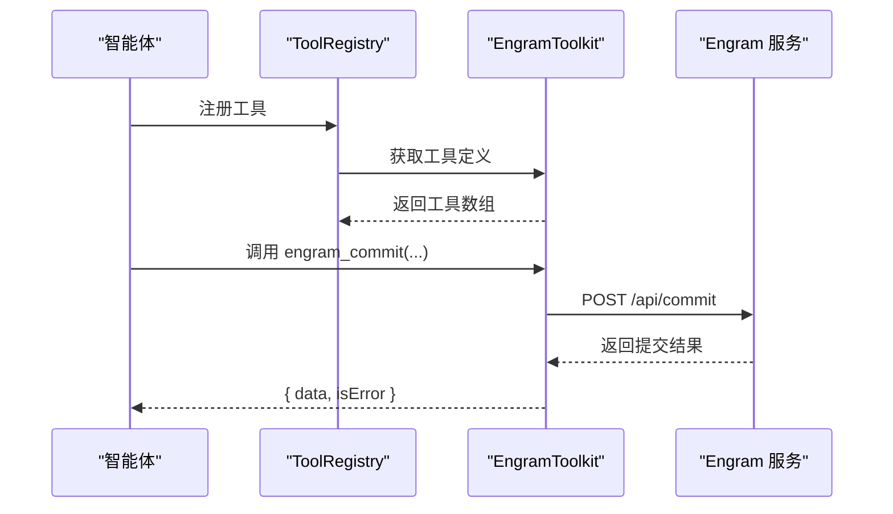
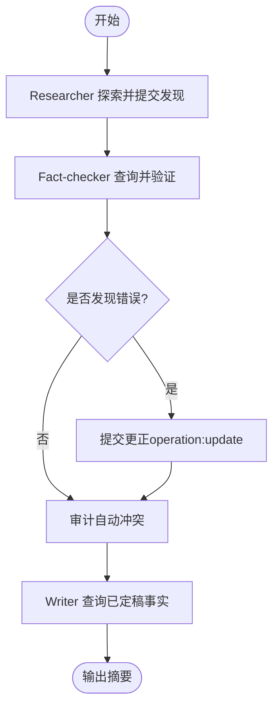
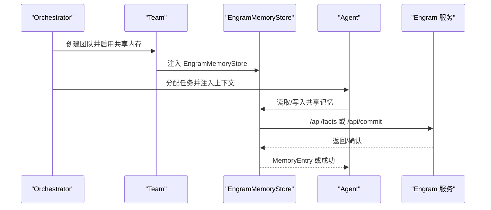
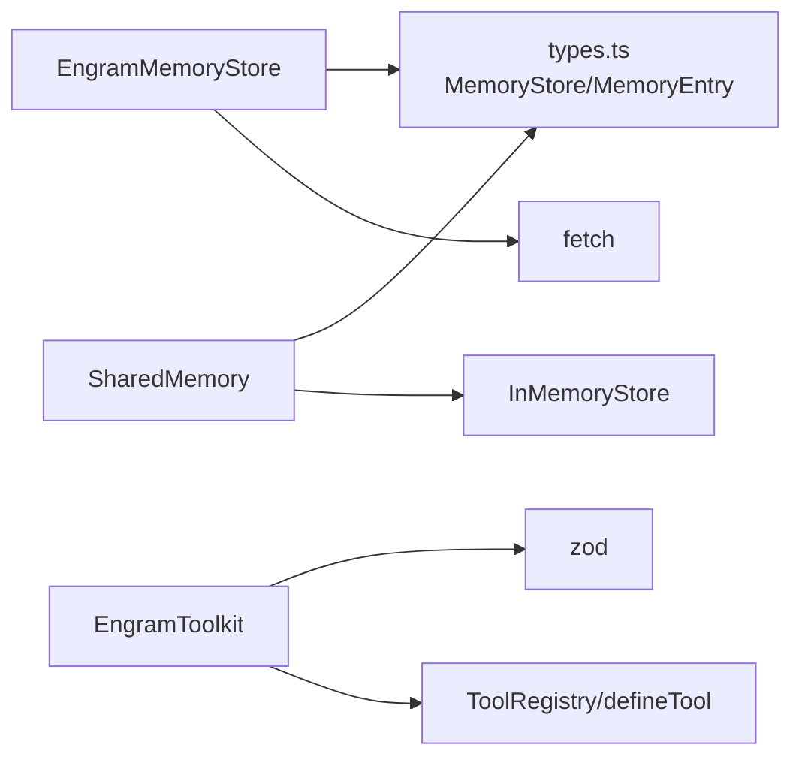

# Engram 记忆集成

<cite>
**本文档引用的文件**
- [engram-store.ts](file://examples/integrations/with-engram/engram-store.ts)
- [engram-toolkit.ts](file://examples/integrations/with-engram/engram-toolkit.ts)
- [research-team.ts](file://examples/integrations/with-engram/research-team.ts)
- [team-research.ts](file://examples/integrations/with-engram/team-research.ts)
- [store.ts](file://src/memory/store.ts)
- [shared.ts](file://src/memory/shared.ts)
- [types.ts](file://src/types.ts)
- [README.md](file://README.md)
- [package.json](file://package.json)
</cite>

## 目录
1. [简介](#简介)
2. [项目结构](#项目结构)
3. [核心组件](#核心组件)
4. [架构总览](#架构总览)
5. [详细组件分析](#详细组件分析)
6. [依赖关系分析](#依赖关系分析)
7. [性能考量](#性能考量)
8. [故障排查指南](#故障排查指南)
9. [结论](#结论)
10. [附录](#附录)

## 简介
本文件面向研究团队与工程实践者，系统性阐述如何在 Open Multi-Agent 框架中集成 Engram 记忆存储系统，实现跨智能体的共享知识库与冲突消解。通过 Engram 提供的“Git for AI memory”能力，团队可即时同步发现、决策与修正，并由自动或人工仲裁解决事实冲突，最终形成可审计、可追溯的团队共识。

本指南覆盖：
- Engram 存储器与工具包的设计与使用
- 数据模型与查询优化
- 多智能体协作模式（顺序流水线与编排驱动）
- 数据同步策略、缓存与性能优化
- 安全访问控制与隐私保护
- 故障恢复与数据备份建议

## 项目结构
与 Engram 集成相关的核心文件位于 examples/integrations/with-engram 目录，同时框架内建了通用的记忆接口与共享内存层，便于无缝替换后端。

图表来源
- [research-team.ts:1-226](file://examples/integrations/with-engram/research-team.ts#L1-L226)
- [team-research.ts:1-232](file://examples/integrations/with-engram/team-research.ts#L1-L232)
- [engram-store.ts:1-188](file://examples/integrations/with-engram/engram-store.ts#L1-L188)
- [engram-toolkit.ts:1-194](file://examples/integrations/with-engram/engram-toolkit.ts#L1-L194)
- [store.ts:1-149](file://src/memory/store.ts#L1-L149)
- [shared.ts:1-335](file://src/memory/shared.ts#L1-L335)
- [types.ts:974-1011](file://src/types.ts#L974-L1011)

章节来源
- [research-team.ts:1-226](file://examples/integrations/with-engram/research-team.ts#L1-L226)
- [team-research.ts:1-232](file://examples/integrations/with-engram/team-research.ts#L1-L232)
- [engram-store.ts:1-188](file://examples/integrations/with-engram/engram-store.ts#L1-L188)
- [engram-toolkit.ts:1-194](file://examples/integrations/with-engram/engram-toolkit.ts#L1-L194)
- [store.ts:1-149](file://src/memory/store.ts#L1-L149)
- [shared.ts:1-335](file://src/memory/shared.ts#L1-L335)
- [types.ts:974-1011](file://src/types.ts#L974-L1011)

## 核心组件
- EngramMemoryStore：实现 MemoryStore 接口，封装对 Engram REST API 的调用，提供 set/get/list/delete/clear 等操作。
- EngramToolkit：注册四个工具（engram_commit、engram_query、engram_conflicts、engram_resolve），使智能体可直接提交、查询、审计冲突并进行仲裁。
- 示例脚本：research-team.ts 展示顺序流水线；team-research.ts 展示编排驱动的团队协作，二者均通过 Engram 实现知识共享与冲突消解。

章节来源
- [engram-store.ts:48-187](file://examples/integrations/with-engram/engram-store.ts#L48-L187)
- [engram-toolkit.ts:34-193](file://examples/integrations/with-engram/engram-toolkit.ts#L34-L193)
- [research-team.ts:88-155](file://examples/integrations/with-engram/research-team.ts#L88-L155)
- [team-research.ts:89-140](file://examples/integrations/with-engram/team-research.ts#L89-L140)

## 架构总览
下图展示了 Engram 集成在 Open Multi-Agent 中的整体交互：智能体通过 Engram 工具与 Engram 服务交互，同时可选择性地将 EngramMemoryStore 注入到团队共享内存中，实现任务间上下文的自动注入与同步。

图表来源
- [engram-toolkit.ts:66-181](file://examples/integrations/with-engram/engram-toolkit.ts#L66-L181)
- [engram-store.ts:68-137](file://examples/integrations/with-engram/engram-store.ts#L68-L137)
- [research-team.ts:169-190](file://examples/integrations/with-engram/research-team.ts#L169-L190)
- [team-research.ts:193-198](file://examples/integrations/with-engram/team-research.ts#L193-L198)

## 详细组件分析

### EngramMemoryStore 组件分析
- 功能职责
  - 将 MemoryStore 接口映射到 Engram REST API，支持键值写入、读取、列举、删除与清空。
  - 写入时默认使用 operation:update，确保同作用域多次写入以新值覆盖旧值。
  - 删除采用“退休”策略：通过 lineage_id 对最新事实进行 delete 操作，保留审计历史。
  - 清空为无操作（Engram 历史不可批量擦除）。
- 关键方法
  - set(key, value, metadata)：提交事实，scope=key，operation 默认为 update。
  - get(key)：按作用域查询最新事实，返回 MemoryEntry。
  - list()：查询工作区前 200 条事实，映射为 MemoryEntry 列表。
  - delete(key)：先获取最新事实的 lineage_id，再以 delete 操作退休该事实。
  - clear()：无操作，保持审计完整性。
- 错误处理
  - 所有 POST/GET 失败会抛出错误，包含状态码与响应体摘要，便于定位问题。
- 性能与并发
  - 采用单请求调用，适合小规模团队；高并发场景建议在应用层做限流与重试。
  - 读取列表限制为 200 条，避免一次性拉取过多数据。

图表来源
- [engram-store.ts:48-187](file://examples/integrations/with-engram/engram-store.ts#L48-L187)
- [types.ts:993-1011](file://src/types.ts#L993-L1011)

章节来源
- [engram-store.ts:48-187](file://examples/integrations/with-engram/engram-store.ts#L48-L187)
- [types.ts:993-1011](file://src/types.ts#L993-L1011)

### EngramToolkit 组件分析
- 功能职责
  - 注册四个 Engram 工具，统一通过 Engram 服务完成知识提交、查询、冲突审计与仲裁。
  - 支持自定义 baseUrl 与 inviteKey，便于本地或私有化部署。
- 工具定义
  - engram_commit：提交事实，支持 scope、operation、fact_type、ttl_days 等参数。
  - engram_query：按主题/作用域/类型查询事实，支持 limit。
  - engram_conflicts：列出冲突，支持按状态过滤。
  - engram_resolve：对冲突进行仲裁（winner/merge/dismissed）。
- 输入校验
  - 使用 Zod Schema 对输入进行严格校验，保证工具调用的健壮性。
- 与智能体集成
  - 可通过 ToolRegistry 注册，或作为 AgentConfig.customTools 注入，让编排器按 agent 级别注册。

图表来源
- [engram-toolkit.ts:46-96](file://examples/integrations/with-engram/engram-toolkit.ts#L46-L96)
- [engram-toolkit.ts:99-123](file://examples/integrations/with-engram/engram-toolkit.ts#L99-L123)
- [engram-toolkit.ts:126-151](file://examples/integrations/with-engram/engram-toolkit.ts#L126-L151)
- [engram-toolkit.ts:154-181](file://examples/integrations/with-engram/engram-toolkit.ts#L154-L181)

章节来源
- [engram-toolkit.ts:34-193](file://examples/integrations/with-engram/engram-toolkit.ts#L34-L193)

### 研究团队示例（顺序流水线）
- 角色分工
  - Researcher：探索主题并提交发现，使用 engram_commit 记录事实，scope="research"。
  - Fact-checker：基于 engram_query 获取已提交事实，验证准确性，必要时以 operation:update 提交更正，并审计自动解决的冲突。
  - Writer：基于 engram_query 获取已“定稿”的事实，生成摘要报告。
- 流程要点
  - 每个阶段结束后，其他智能体可立即看到最新知识，减少重复劳动。
  - 通过 Engram 的冲突仲裁能力，确保团队共识的一致性与可审计性。

图表来源
- [research-team.ts:116-155](file://examples/integrations/with-engram/research-team.ts#L116-L155)

章节来源
- [research-team.ts:116-155](file://examples/integrations/with-engram/research-team.ts#L116-L155)

### 团队研究示例（编排驱动）
- 特点
  - 使用 Orchestrator 的 runTeam，将 EngramMemoryStore 注入团队共享内存，实现任务间上下文自动注入与同步。
  - 仍可按需使用 Engram 工具进行手动查询与冲突审计。
- 优势
  - 无需在每个任务中显式调用 engram_commit/engram_query，编排器自动处理跨任务上下文。
  - 保留 Engram 的冲突仲裁与审计能力，提升团队协作质量。

图表来源
- [team-research.ts:178-198](file://examples/integrations/with-engram/team-research.ts#L178-L198)
- [engram-store.ts:82-106](file://examples/integrations/with-engram/engram-store.ts#L82-L106)

章节来源
- [team-research.ts:178-198](file://examples/integrations/with-engram/team-research.ts#L178-L198)

### 数据模型与查询优化
- 数据模型
  - MemoryEntry：统一的键值记录，包含 key、value、metadata、createdAt、expiresAtTurn（可选）。
  - EngramFact：Engram 服务返回的事实结构，包含 fact_id、lineage_id、content、scope、agent_id、committed_at。
- 查询优化建议
  - 作用域查询：通过 scope 参数精确限定查询范围，减少无关数据传输。
  - 限制结果数量：使用 limit 控制返回条目数，避免超大响应。
  - 类型过滤：按 fact_type 过滤，提高检索相关性。
  - 冲突审计：定期使用 engram_conflicts 审计 open 状态的冲突，及时介入 resolve。

章节来源
- [types.ts:974-987](file://src/types.ts#L974-L987)
- [engram-store.ts:22-29](file://examples/integrations/with-engram/engram-store.ts#L22-L29)
- [engram-toolkit.ts:105-112](file://examples/integrations/with-engram/engram-toolkit.ts#L105-L112)

## 依赖关系分析
- EngramMemoryStore 依赖
  - MemoryStore 接口：统一键值存储抽象。
  - Node.js fetch：HTTP 客户端，用于调用 Engram REST API。
  - 环境变量 ENGRAM_INVITE_KEY：用于鉴权。
- EngramToolkit 依赖
  - Zod：输入参数校验。
  - ToolRegistry/defineTool：工具注册与定义。
- 框架共享内存
  - SharedMemory：提供命名空间隔离与过期策略，可与自定义 MemoryStore 结合使用。

图表来源
- [engram-store.ts:16-57](file://examples/integrations/with-engram/engram-store.ts#L16-L57)
- [engram-toolkit.ts:16-41](file://examples/integrations/with-engram/engram-toolkit.ts#L16-L41)
- [shared.ts:55-85](file://src/memory/shared.ts#L55-L85)
- [store.ts:31-86](file://src/memory/store.ts#L31-L86)
- [types.ts:993-1011](file://src/types.ts#L993-L1011)

章节来源
- [engram-store.ts:16-57](file://examples/integrations/with-engram/engram-store.ts#L16-L57)
- [engram-toolkit.ts:16-41](file://examples/integrations/with-engram/engram-toolkit.ts#L16-L41)
- [shared.ts:55-85](file://src/memory/shared.ts#L55-L85)
- [store.ts:31-86](file://src/memory/store.ts#L31-L86)
- [types.ts:993-1011](file://src/types.ts#L993-L1011)

## 性能考量
- 并发与限流
  - EngramMemoryStore 为同步网络调用，建议在应用层对并发请求进行限流与指数退避重试。
- 缓存策略
  - 在应用侧对高频查询结果进行短期缓存（如 LRU），减少重复请求。
  - 对于列表查询（/api/facts），可按 scope 分片缓存，避免全局扫描。
- 查询优化
  - 使用 scope、fact_type、limit 等参数缩小查询范围。
  - 对冲突审计采用分页与增量拉取，避免一次性加载过多冲突。
- 上下文注入
  - 编排驱动模式下，SharedMemory 会将任务结果注入到后续任务提示中，建议对长摘要进行截断与摘要化处理，避免超出上下文窗口。

[本节为通用性能建议，不直接分析具体文件]

## 故障排查指南
- 常见错误与处理
  - 未设置 ENGRAM_INVITE_KEY：启动前检查环境变量，确保邀请密钥有效。
  - Engram 服务不可达：检查 baseUrl 与网络连通性，必要时增加重试与超时配置。
  - 提交失败：查看错误信息中的状态码与响应体，确认请求体格式与权限。
- 日志与可观测性
  - 使用 Orchestrator 的 onProgress/onTrace 输出关键事件，定位问题节点。
  - 在应用层记录工具调用与 Engram API 调用的耗时与错误码，建立告警。
- 冲突仲裁
  - 当自动仲裁结果不符合预期时，使用 engram_resolve 进行人工仲裁，记录仲裁理由与依据。

章节来源
- [engram-store.ts:162-173](file://examples/integrations/with-engram/engram-store.ts#L162-L173)
- [research-team.ts:77-80](file://examples/integrations/with-engram/research-team.ts#L77-L80)
- [team-research.ts:58-67](file://examples/integrations/with-engram/team-research.ts#L58-L67)

## 结论
通过将 Engram 记忆存储与工具集集成到 Open Multi-Agent 框架，研究团队可以实现：
- 即时共享与传播知识，减少重复劳动
- 自动与人工相结合的冲突仲裁，保障团队共识
- 任务间上下文的自动注入与同步，提升协作效率
- 审计与可追溯性，满足合规与复盘需求

建议在生产环境中结合缓存、限流与可观测性策略，持续优化查询与写入性能，并建立完善的备份与恢复流程。

[本节为总结性内容，不直接分析具体文件]

## 附录

### 快速上手步骤
- 准备环境
  - 启动 Engram 服务（默认 http://localhost:7474）
  - 设置 ENGRAM_INVITE_KEY 环境变量
  - 配置 LLM 提供商与模型（如 ANTHROPIC_API_KEY、AGENT_PROVIDER、AGENT_MODEL）
- 运行示例
  - 顺序流水线：npx tsx examples/integrations/with-engram/research-team.ts
  - 编排驱动：npx tsx examples/integrations/with-engram/team-research.ts

章节来源
- [research-team.ts:19-42](file://examples/integrations/with-engram/research-team.ts#L19-L42)
- [team-research.ts:22-29](file://examples/integrations/with-engram/team-research.ts#L22-L29)

### 安全与隐私
- 访问控制
  - 使用 Engram 邀请密钥进行鉴权，避免泄露至公共仓库。
  - 在 CI/CD 中使用机密变量管理密钥，最小权限原则。
- 数据最小化
  - 仅提交必要的事实，避免敏感信息进入共享记忆。
  - 对历史事实采用“退休”而非物理删除，保留审计链路。
- 合规与审计
  - 定期导出冲突与仲裁记录，满足审计要求。
  - 对外部共享的摘要进行脱敏处理。

[本节为通用安全建议，不直接分析具体文件]

### 备份与恢复
- 备份策略
  - 定期从 Engram 导出工作区数据与冲突仲裁记录。
  - 对关键事实建立本地快照，支持快速回滚。
- 恢复流程
  - 服务中断后优先恢复 Engram 服务，再恢复应用层缓存与索引。
  - 使用“退休”机制回填历史事实，避免覆盖当前共识。

[本节为通用运维建议，不直接分析具体文件]