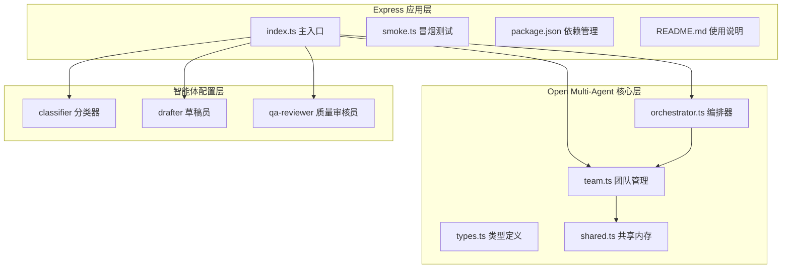
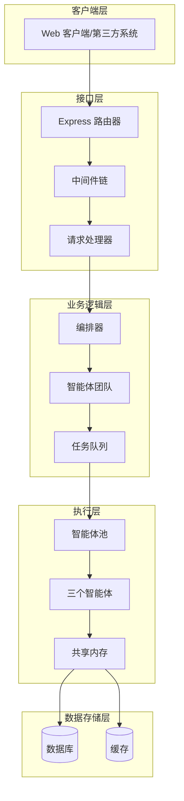
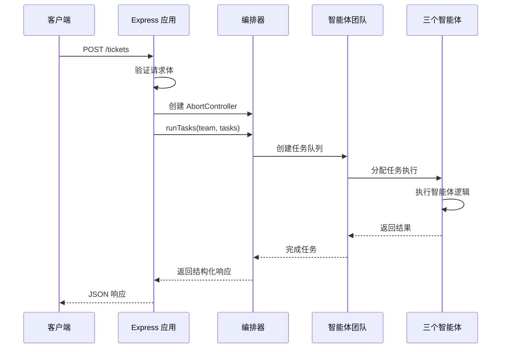
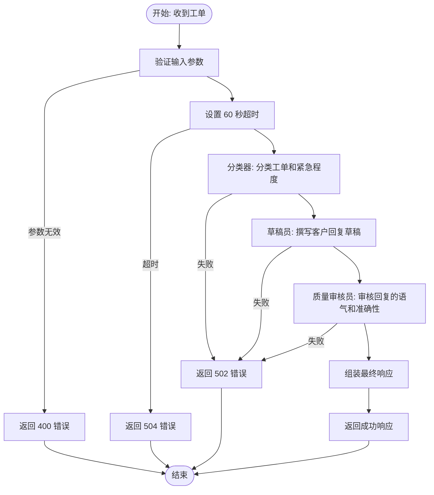
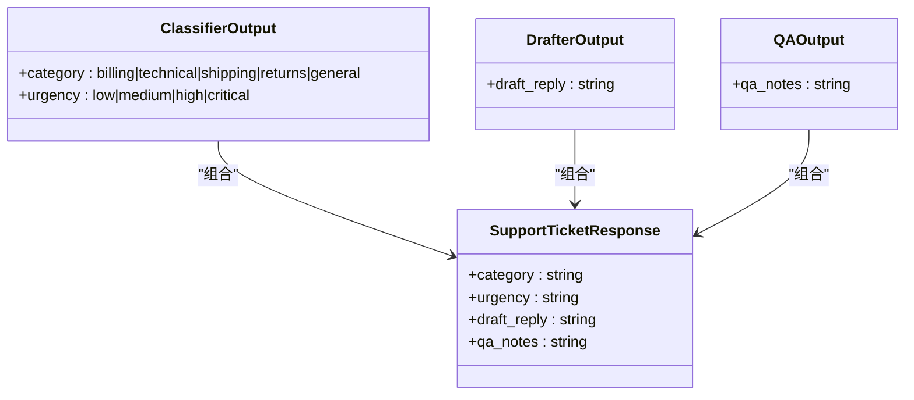
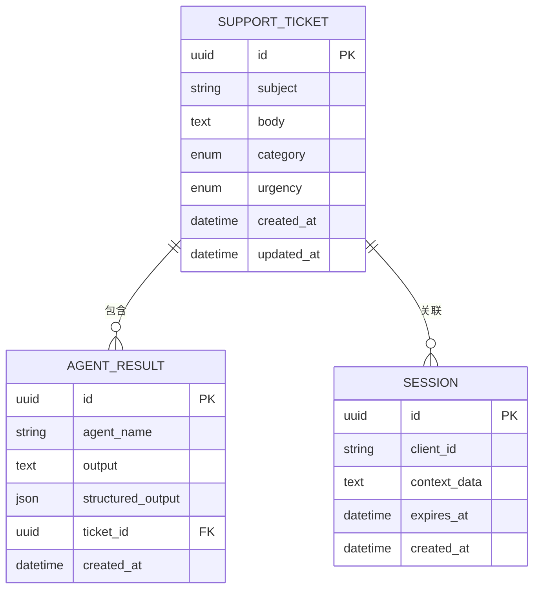
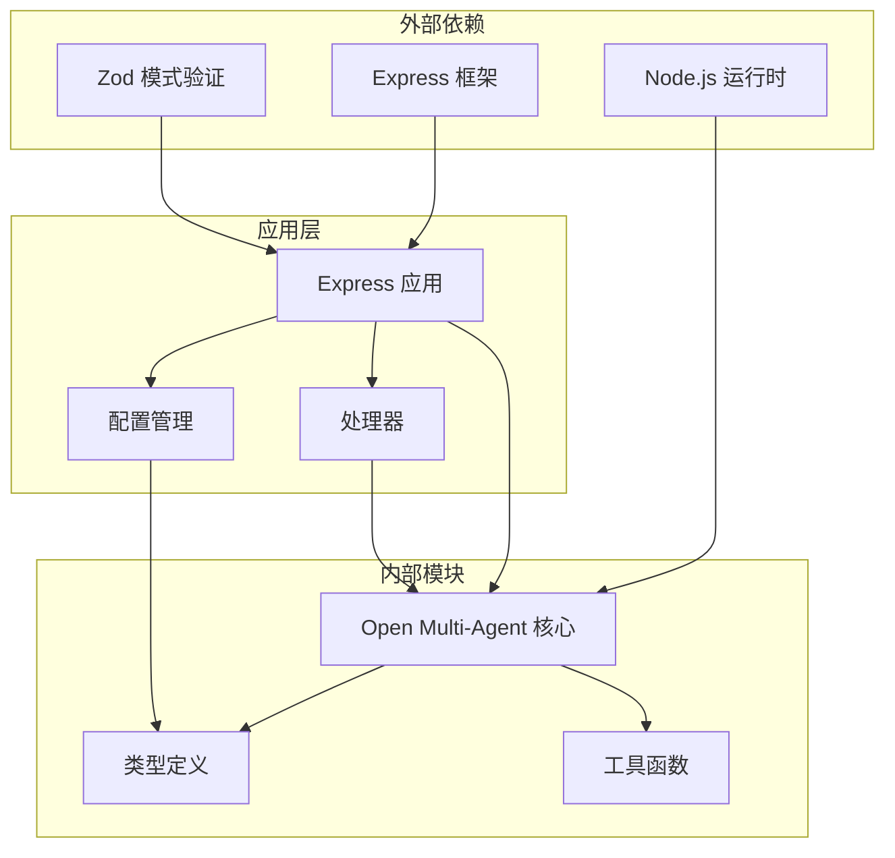

# Express 客户支持系统

<cite>
**本文档引用的文件**
- [README.md](file://examples/integrations/express-customer-support/README.md)
- [index.ts](file://examples/integrations/express-customer-support/index.ts)
- [package.json](file://examples/integrations/express-customer-support/package.json)
- [smoke.ts](file://examples/integrations/express-customer-support/smoke.ts)
- [team.ts](file://src/team/team.ts)
- [orchestrator.ts](file://src/orchestrator/orchestrator.ts)
- [types.ts](file://src/types.ts)
- [shared.ts](file://src/memory/shared.ts)
- [index.ts](file://src/index.ts)
- [README.md](file://README.md)
</cite>

## 目录
1. [简介](#简介)
2. [项目结构](#项目结构)
3. [核心组件](#核心组件)
4. [架构概览](#架构概览)
5. [详细组件分析](#详细组件分析)
6. [依赖关系分析](#依赖关系分析)
7. [性能考虑](#性能考虑)
8. [故障排除指南](#故障排除指南)
9. [结论](#结论)
10. [附录](#附录)

## 简介
本项目展示了如何使用 Open Multi-Agent 框架构建企业级 Express 客户支持应用。该系统通过三个智能体组成的流水线自动分类客户工单、撰写回复草稿并通过质量审核，最终生成结构化的支持响应。系统采用显式任务图（runTasks）执行模式，确保固定拓扑结构的多智能体协作，每个阶段的输出作为后续阶段的上下文注入。

该实现提供了完整的 Express 应用搭建指南，包括路由配置、中间件设置、请求处理流程，以及多智能体协作在客户服务场景中的最佳实践。系统支持多种大模型提供商的切换、结构化输出验证、超时控制和错误处理等企业级特性。

## 项目结构
Express 客户支持系统位于 examples/integrations/express-customer-support 目录中，采用模块化设计：



**图表来源**
- [index.ts:1-238](file://examples/integrations/express-customer-support/index.ts#L1-L238)
- [orchestrator.ts:1-800](file://src/orchestrator/orchestrator.ts#L1-L800)
- [team.ts:1-346](file://src/team/team.ts#L1-L346)

**章节来源**
- [README.md:1-113](file://examples/integrations/express-customer-support/README.md#L1-L113)
- [index.ts:1-238](file://examples/integrations/express-customer-support/index.ts#L1-L238)

## 核心组件
系统由四个核心组件构成，每个组件都有明确的职责分工：

### 1. Express HTTP 服务器
负责处理客户端请求、验证输入参数、执行业务逻辑并将结果以结构化 JSON 返回。支持自定义中间件、错误处理和超时控制。

### 2. Open Multi-Agent 编排器
提供多智能体协作的核心能力，包括任务队列管理、智能体池调度、共享内存支持和可观测性事件流。

### 3. 智能体团队管理
维护智能体清单、消息总线、任务队列和可选的共享内存实例，提供类型化的事件总线供编排器响应生命周期事件。

### 4. 结构化输出验证
使用 Zod 模式验证每个智能体的输出，确保返回数据的完整性和正确性，支持自动重试机制。

**章节来源**
- [index.ts:121-229](file://examples/integrations/express-customer-support/index.ts#L121-L229)
- [team.ts:88-346](file://src/team/team.ts#L88-L346)
- [orchestrator.ts:1390-1454](file://src/orchestrator/orchestrator.ts#L1390-L1454)

## 架构概览
系统采用分层架构设计，从底层的智能体执行到上层的 HTTP 接口，每一层都有清晰的职责边界：



**图表来源**
- [index.ts:145-226](file://examples/integrations/express-customer-support/index.ts#L145-L226)
- [orchestrator.ts:1390-1454](file://src/orchestrator/orchestrator.ts#L1390-L1454)
- [team.ts:88-151](file://src/team/team.ts#L88-L151)

## 详细组件分析

### Express 应用配置
Express 应用通过工厂函数创建，支持动态端口配置和环境变量注入：



**图表来源**
- [index.ts:145-226](file://examples/integrations/express-customer-support/index.ts#L145-L226)
- [orchestrator.ts:1390-1454](file://src/orchestrator/orchestrator.ts#L1390-L1454)

### 智能体协作流水线
系统实现了三阶段的智能体协作流水线，每阶段都有明确的职责和依赖关系：



**图表来源**
- [index.ts:166-219](file://examples/integrations/express-customer-support/index.ts#L166-L219)
- [index.ts:152-187](file://examples/integrations/express-customer-support/index.ts#L152-L187)

### 结构化输出验证
每个智能体都配置了 Zod 输出模式，确保返回数据的结构化和完整性：



**图表来源**
- [index.ts:27-46](file://examples/integrations/express-customer-support/index.ts#L27-L46)

**章节来源**
- [index.ts:1-238](file://examples/integrations/express-customer-support/index.ts#L1-L238)
- [README.md:1-113](file://examples/integrations/express-customer-support/README.md#L1-L113)

### 数据库集成与会话管理
系统提供了灵活的数据库集成方案，支持多种存储后端：



**图表来源**
- [shared.ts:55-335](file://src/memory/shared.ts#L55-L335)

**章节来源**
- [shared.ts:1-335](file://src/memory/shared.ts#L1-L335)

## 依赖关系分析
系统依赖关系清晰，遵循单一职责原则：



**图表来源**
- [package.json:10-20](file://examples/integrations/express-customer-support/package.json#L10-L20)
- [index.ts:17-21](file://examples/integrations/express-customer-support/index.ts#L17-L21)

**章节来源**
- [package.json:1-21](file://examples/integrations/express-customer-support/package.json#L1-L21)
- [index.ts:1-238](file://examples/integrations/express-customer-support/index.ts#L1-L238)

## 性能考虑
系统在多个层面进行了性能优化：

### 1. 并发执行优化
- 默认最大并发数：5
- 智能体池使用信号量控制并发
- 任务队列支持并行独立任务执行

### 2. 内存管理
- 共享内存支持 TTL 过期机制
- 任务完成后自动清理过期数据
- 支持自定义内存存储后端

### 3. 网络优化
- 智能体输出结构化验证减少重试
- 超时控制防止资源泄露
- 代理配置支持本地模型服务

### 4. 缓存策略
- 任务结果缓存
- 模型调用结果缓存
- 配置变更检测

## 故障排除指南

### 常见错误处理
系统针对不同类型的错误提供了明确的响应策略：

| 错误类型 | HTTP 状态码 | 描述 | 解决方案 |
|---------|------------|------|---------|
| 请求参数无效 | 400 | JSON 格式错误或缺少必需字段 | 验证请求体格式，检查必填字段 |
| LLM 调用失败 | 502 | 智能体执行过程中出现异常 | 检查 API 密钥配置，查看日志详情 |
| 超时错误 | 504 | 超过 60 秒限制 | 优化提示词，检查网络连接 |

### 调试技巧
1. **启用详细日志**：通过 `onProgress` 回调获取执行进度
2. **检查环境变量**：确认所有必需的 API 密钥已正确设置
3. **验证模型配置**：确保选择的模型提供商支持所选模型
4. **监控资源使用**：观察内存和 CPU 使用情况

### 性能监控
系统集成了全面的可观测性功能：
- 令牌使用统计
- 任务执行时间跟踪
- 智能体调用追踪
- 错误事件记录

**章节来源**
- [index.ts:124-130](file://examples/integrations/express-customer-support/index.ts#L124-L130)
- [orchestrator.ts:561-800](file://src/orchestrator/orchestrator.ts#L561-L800)

## 结论
Express 客户支持系统展示了如何利用 Open Multi-Agent 框架构建企业级智能客服应用。系统通过明确的三层架构设计、严格的错误处理机制和灵活的配置选项，为企业提供了可靠的客户支持解决方案。

关键优势包括：
- **可扩展性**：支持多智能体协作和任务并行执行
- **可靠性**：完善的错误处理和超时控制机制
- **可维护性**：清晰的代码结构和丰富的配置选项
- **可观测性**：全面的监控和调试功能

该系统为企业数字化转型提供了坚实的技术基础，可以根据具体需求进行定制和扩展。

## 附录

### 部署指南
1. **环境准备**
   - Node.js 18+
   - 必需的 API 密钥
   - 稳定的网络连接

2. **安装步骤**
   ```bash
   cd examples/integrations/express-customer-support
   npm install
   npm start
   ```

3. **配置选项**
   - 端口配置：`PORT` 环境变量
   - 模型提供商：`*_PROVIDER` 环境变量
   - 模型选择：`*_MODEL` 环境变量

### 安全配置建议
1. **API 密钥管理**
   - 使用环境变量存储敏感信息
   - 实施密钥轮换策略
   - 限制密钥访问权限

2. **输入验证**
   - 启用严格的数据验证
   - 实施速率限制
   - 防止恶意输入攻击

3. **传输安全**
   - 使用 HTTPS 协议
   - 实施 CORS 策略
   - 加强会话管理

### 性能优化建议
1. **资源管理**
   - 合理设置并发数
   - 优化模型参数
   - 实施缓存策略

2. **监控指标**
   - 关键性能指标监控
   - 错误率统计
   - 用户体验指标

3. **容量规划**
   - 预估峰值负载
   - 实施弹性伸缩
   - 备份和灾难恢复