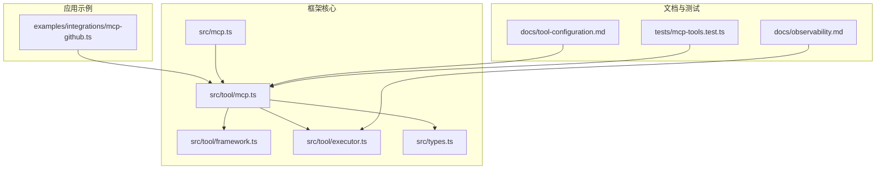
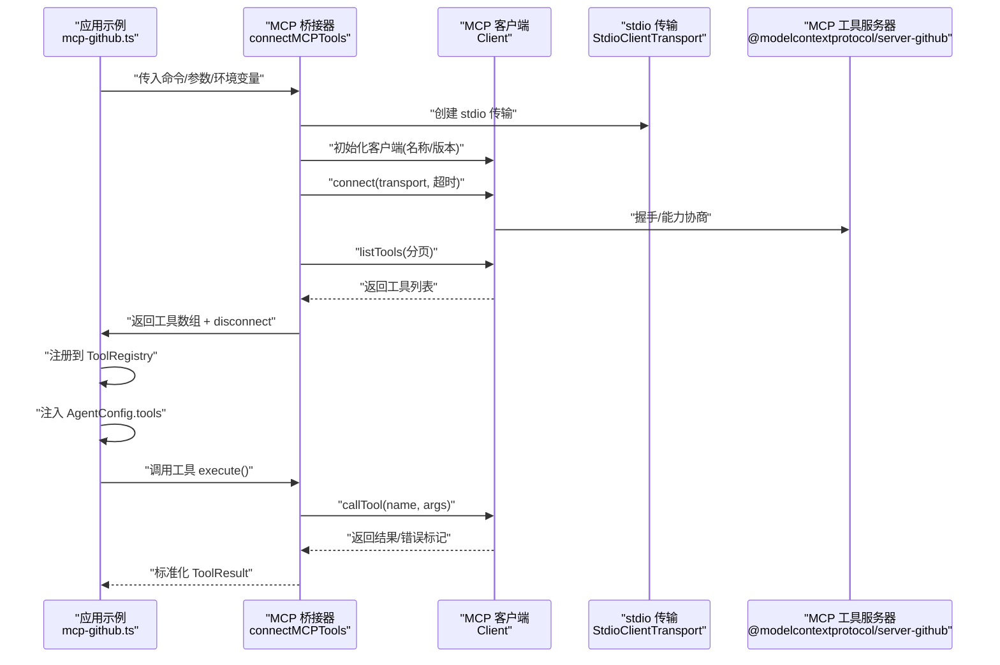
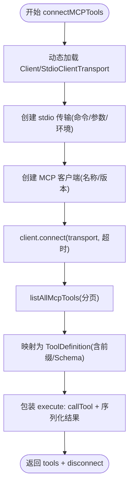
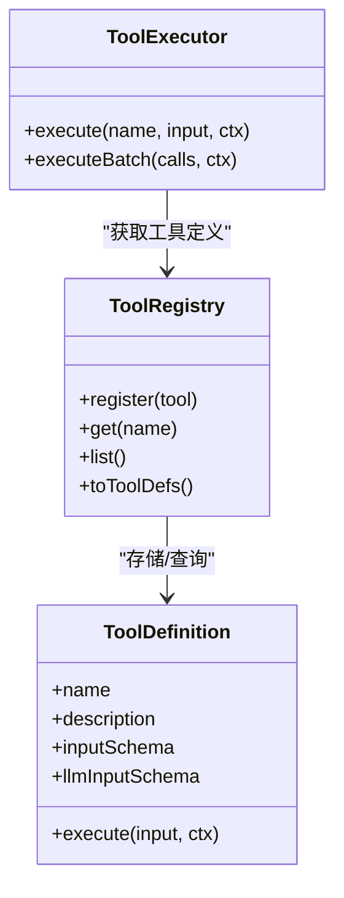
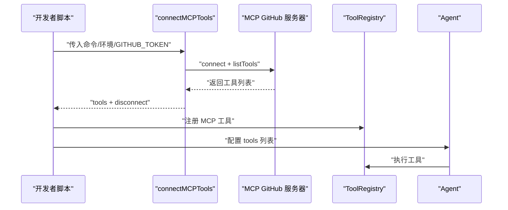
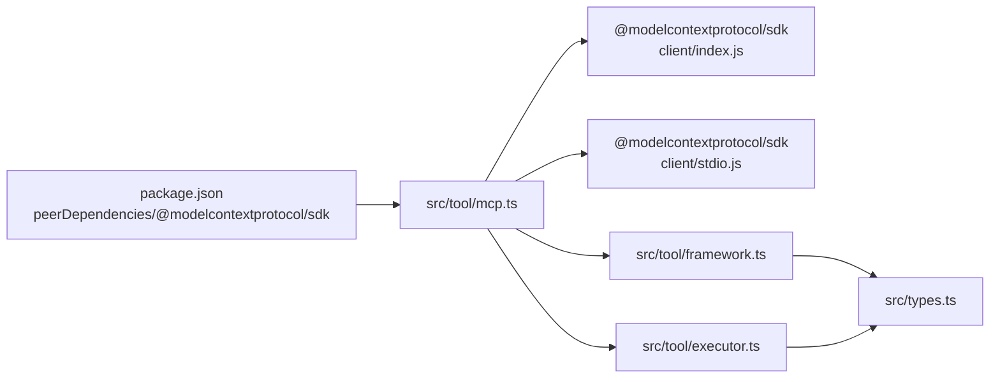

# MCP 工具集成

<cite>
**本文引用的文件**
- [src/tool/mcp.ts](file://src/tool/mcp.ts)
- [src/mcp.ts](file://src/mcp.ts)
- [examples/integrations/mcp-github.ts](file://examples/integrations/mcp-github.ts)
- [tests/mcp-tools.test.ts](file://tests/mcp-tools.test.ts)
- [src/tool/framework.ts](file://src/tool/framework.ts)
- [src/tool/executor.ts](file://src/tool/executor.ts)
- [src/types.ts](file://src/types.ts)
- [docs/tool-configuration.md](file://docs/tool-configuration.md)
- [docs/observability.md](file://docs/observability.md)
- [package.json](file://package.json)
</cite>

## 目录
1. [简介](#简介)
2. [项目结构](#项目结构)
3. [核心组件](#核心组件)
4. [架构总览](#架构总览)
5. [详细组件分析](#详细组件分析)
6. [依赖关系分析](#依赖关系分析)
7. [性能考量](#性能考量)
8. [故障排查指南](#故障排查指南)
9. [结论](#结论)
10. [附录](#附录)

## 简介
本文件面向在 Open Multi-Agent 框架中集成 MCP（Model Context Protocol）工具的开发者，系统性阐述如何通过框架提供的 MCP 工具桥接能力，连接到 MCP 工具服务器，并将其暴露为智能体可用的标准工具。文档覆盖协议工作原理、连接建立流程、工具发现与注册、调用机制、错误处理与超时管理、重连策略建议、安全配置与认证、性能监控与调试工具使用，以及常见问题排查。

## 项目结构
围绕 MCP 工具集成的关键文件与模块如下：
- 工具桥接与 MCP 客户端：src/tool/mcp.ts
- 导出入口：src/mcp.ts
- 示例：examples/integrations/mcp-github.ts
- 单元测试：tests/mcp-tools.test.ts
- 工具框架与注册表：src/tool/framework.ts
- 工具执行器：src/tool/executor.ts
- 类型定义：src/types.ts
- 文档：docs/tool-configuration.md、docs/observability.md
- 依赖声明：package.json

图表来源
- [src/tool/mcp.ts:1-297](file://src/tool/mcp.ts#L1-L297)
- [src/mcp.ts:1-6](file://src/mcp.ts#L1-L6)
- [examples/integrations/mcp-github.ts:1-60](file://examples/integrations/mcp-github.ts#L1-L60)
- [src/tool/framework.ts:1-610](file://src/tool/framework.ts#L1-L610)
- [src/tool/executor.ts:1-264](file://src/tool/executor.ts#L1-L264)
- [src/types.ts:1-1106](file://src/types.ts#L1-L1106)
- [docs/tool-configuration.md:128-153](file://docs/tool-configuration.md#L128-L153)
- [docs/observability.md:1-57](file://docs/observability.md#L1-L57)
- [tests/mcp-tools.test.ts:1-212](file://tests/mcp-tools.test.ts#L1-L212)

章节来源
- [src/tool/mcp.ts:1-297](file://src/tool/mcp.ts#L1-L297)
- [src/mcp.ts:1-6](file://src/mcp.ts#L1-L6)
- [examples/integrations/mcp-github.ts:1-60](file://examples/integrations/mcp-github.ts#L1-L60)
- [src/tool/framework.ts:1-610](file://src/tool/framework.ts#L1-L610)
- [src/tool/executor.ts:1-264](file://src/tool/executor.ts#L1-L264)
- [src/types.ts:1-1106](file://src/types.ts#L1-L1106)
- [docs/tool-configuration.md:128-153](file://docs/tool-configuration.md#L128-L153)
- [docs/observability.md:1-57](file://docs/observability.md#L1-L57)
- [tests/mcp-tools.test.ts:1-212](file://tests/mcp-tools.test.ts#L1-L212)

## 核心组件
- MCP 工具桥接器：负责加载 MCP 客户端与 stdio 传输、建立连接、列举工具、封装为框架 ToolDefinition 并提供统一执行接口。
- 工具注册表与执行器：将 MCP 工具注册到 ToolRegistry，并通过 ToolExecutor 执行，支持并发控制、输入输出校验、截断与错误归一化。
- 类型系统：ToolDefinition、ToolResult、ToolUseContext 等类型确保工具输入输出与上下文的一致性。
- 示例与测试：GitHub MCP 示例演示完整集成路径；单元测试覆盖连接、分页列举、内容序列化、错误标记等行为。

章节来源
- [src/tool/mcp.ts:230-297](file://src/tool/mcp.ts#L230-L297)
- [src/tool/framework.ts:114-255](file://src/tool/framework.ts#L114-L255)
- [src/tool/executor.ts:54-229](file://src/tool/executor.ts#L54-L229)
- [src/types.ts:293-328](file://src/types.ts#L293-L328)
- [examples/integrations/mcp-github.ts:24-59](file://examples/integrations/mcp-github.ts#L24-L59)
- [tests/mcp-tools.test.ts:79-211](file://tests/mcp-tools.test.ts#L79-L211)

## 架构总览
下图展示了从应用到 MCP 服务器的端到端调用链路，包括连接、工具发现、注册与执行。

图表来源
- [src/tool/mcp.ts:230-297](file://src/tool/mcp.ts#L230-L297)
- [examples/integrations/mcp-github.ts:24-59](file://examples/integrations/mcp-github.ts#L24-L59)

## 详细组件分析

### MCP 连接与工具桥接
- 加载 MCP 客户端与 stdio 传输模块，按需动态 import，避免无 MCP 场景下的依赖负担。
- 建立连接时可设置请求超时；默认超时常量用于 tools/list 分页查询。
- 使用 listTools 循环拉取所有工具，支持游标分页；将 MCP 工具描述转换为框架 ToolDefinition。
- 工具名规范化：支持 namePrefix 前缀与斜杠替换，避免 LLM 不兼容字符。
- 输入模式：MCP 工具的 llmInputSchema 直接透传给 LLM；框架侧 inputSchema 设为 z.any()，验证交由 MCP 服务器。
- 结果序列化：将 MCP 返回的 content/structuredContent 统一转为字符串，支持文本、图片、音频、资源链接等块类型。

图表来源
- [src/tool/mcp.ts:57-67](file://src/tool/mcp.ts#L57-L67)
- [src/tool/mcp.ts:206-224](file://src/tool/mcp.ts#L206-L224)
- [src/tool/mcp.ts:230-297](file://src/tool/mcp.ts#L230-L297)

章节来源
- [src/tool/mcp.ts:57-67](file://src/tool/mcp.ts#L57-L67)
- [src/tool/mcp.ts:206-224](file://src/tool/mcp.ts#L206-L224)
- [src/tool/mcp.ts:230-297](file://src/tool/mcp.ts#L230-L297)

### 工具注册与执行
- 注册：将 MCP 工具逐一注册到 ToolRegistry，支持运行时动态添加。
- 执行：ToolExecutor 对单次与批量调用进行并发控制、输入 Zod 校验、输出校验与截断、异常捕获并归一化为 ToolResult。
- 上下文：ToolUseContext 提供 agent/team/abort 信号等执行上下文，便于工具内部取消与审计。

图表来源
- [src/tool/framework.ts:114-255](file://src/tool/framework.ts#L114-L255)
- [src/tool/executor.ts:54-229](file://src/tool/executor.ts#L54-L229)
- [src/types.ts:293-328](file://src/types.ts#L293-L328)

章节来源
- [src/tool/framework.ts:114-255](file://src/tool/framework.ts#L114-L255)
- [src/tool/executor.ts:54-229](file://src/tool/executor.ts#L54-L229)
- [src/types.ts:293-328](file://src/types.ts#L293-L328)

### 示例：集成 GitHub MCP 工具
- 通过 npx 启动 MCP GitHub 服务器，传递 GITHUB_TOKEN 环境变量。
- 使用 connectMCPTools 获取工具列表，设置 namePrefix 为 github，便于区分与命名。
- 将工具注册到 ToolRegistry，并在 Agent 中启用这些工具。
- 运行后打印输出，最后调用 disconnect 关闭连接。

图表来源
- [examples/integrations/mcp-github.ts:24-59](file://examples/integrations/mcp-github.ts#L24-L59)
- [src/tool/mcp.ts:230-297](file://src/tool/mcp.ts#L230-L297)

章节来源
- [examples/integrations/mcp-github.ts:24-59](file://examples/integrations/mcp-github.ts#L24-L59)
- [src/tool/mcp.ts:230-297](file://src/tool/mcp.ts#L230-L297)

## 依赖关系分析
- MCP 客户端与传输：通过动态 import 引入 @modelcontextprotocol/sdk 的 Client 与 StdioClientTransport，仅在使用 MCP 时加载。
- 依赖声明：package.json 中将 @modelcontextprotocol/sdk 标记为可选 peer 依赖，避免强制安装。
- 工具框架：defineTool 与 ToolRegistry 提供统一工具定义与注册接口；ToolExecutor 提供执行与并发控制。
- 类型系统：ToolDefinition/ToolResult/ToolUseContext 等类型贯穿工具生命周期。

图表来源
- [package.json:74-93](file://package.json#L74-L93)
- [src/tool/mcp.ts:57-67](file://src/tool/mcp.ts#L57-L67)
- [src/tool/framework.ts:114-255](file://src/tool/framework.ts#L114-L255)
- [src/tool/executor.ts:54-229](file://src/tool/executor.ts#L54-L229)
- [src/types.ts:293-328](file://src/types.ts#L293-L328)

章节来源
- [package.json:74-93](file://package.json#L74-L93)
- [src/tool/mcp.ts:57-67](file://src/tool/mcp.ts#L57-L67)
- [src/tool/framework.ts:114-255](file://src/tool/framework.ts#L114-L255)
- [src/tool/executor.ts:54-229](file://src/tool/executor.ts#L54-L229)
- [src/types.ts:293-328](file://src/types.ts#L293-L328)

## 性能考量
- 并发控制：ToolExecutor 默认最大并发为 4，可通过构造选项调整，避免工具执行器成为瓶颈。
- 输出截断：当工具输出过长时，可按工具或代理级别设置最大字符数，自动进行头尾截断并保留摘要标记。
- 分页列举：listTools 支持游标分页，避免一次性拉取大量工具导致内存与网络压力。
- 超时管理：连接与每次 listTools 请求均可设置超时，防止阻塞影响主流程。
- 观测性：通过 onTrace/onProgress 可记录工具调用耗时、令牌用量与任务状态，辅助定位性能热点。

章节来源
- [src/tool/executor.ts:23-63](file://src/tool/executor.ts#L23-L63)
- [src/tool/executor.ts:210-229](file://src/tool/executor.ts#L210-L229)
- [src/tool/mcp.ts:206-224](file://src/tool/mcp.ts#L206-L224)
- [src/tool/mcp.ts:250-252](file://src/tool/mcp.ts#L250-L252)
- [docs/observability.md:19-47](file://docs/observability.md#L19-L47)

## 故障排查指南
- 连接失败
  - 检查命令与参数是否正确，stdio 服务器是否可执行。
  - 确认环境变量（如 GITHUB_TOKEN）已正确传递。
  - 查看超时设置是否合理，必要时增大 requestTimeoutMs。
- 工具不可见
  - 确认 MCP 服务器已正确实现 tools/list 并返回工具描述。
  - 若存在分页，确认游标逻辑被正确处理（测试用例覆盖了多页场景）。
- 工具执行报错
  - 桥接层会捕获异常并返回 isError=true 的 ToolResult；检查工具返回的 isError 字段与内容序列化。
  - 若 MCP 返回非文本内容（图片/音频/资源），序列化逻辑会生成可读描述。
- 错误处理与重试
  - 工具执行错误会被捕获并归一化；对于任务级重试，可参考任务重试机制与指数退避策略。
- 安全与认证
  - MCP 服务器通常通过环境变量或本地凭据进行认证；确保只在受信环境中传递敏感凭据。
  - 如需网络访问，请确保防火墙与代理配置允许 MCP 服务器通信。
- 调试与可观测性
  - 使用 onTrace 记录工具调用与 LLM 调用的结构化跨度，便于回溯与分析。
  - 使用 renderTeamRunDashboard 生成可视化报告，辅助复盘。

章节来源
- [tests/mcp-tools.test.ts:137-168](file://tests/mcp-tools.test.ts#L137-L168)
- [src/tool/mcp.ts:160-204](file://src/tool/mcp.ts#L160-L204)
- [src/tool/executor.ts:147-189](file://src/tool/executor.ts#L147-L189)
- [docs/observability.md:19-47](file://docs/observability.md#L19-L47)

## 结论
通过框架提供的 MCP 工具桥接能力，开发者可以以最小侵入的方式将外部 MCP 工具服务器无缝接入智能体工作流。结合工具注册表与执行器的并发控制、输入输出校验与截断、以及完善的观测性与测试覆盖，能够在保证稳定性的同时扩展智能体的能力边界。建议在生产环境中配合超时、重试与可观测性策略，确保系统的可靠性与可维护性。

## 附录

### 快速上手：集成 GitHub MCP 工具
- 准备环境变量：GITHUB_TOKEN。
- 使用 connectMCPTools 建立连接并获取工具列表。
- 将工具注册到 ToolRegistry，并在 Agent 的 tools 列表中启用。
- 运行完成后调用 disconnect 清理连接。

章节来源
- [examples/integrations/mcp-github.ts:19-59](file://examples/integrations/mcp-github.ts#L19-L59)
- [docs/tool-configuration.md:128-153](file://docs/tool-configuration.md#L128-L153)