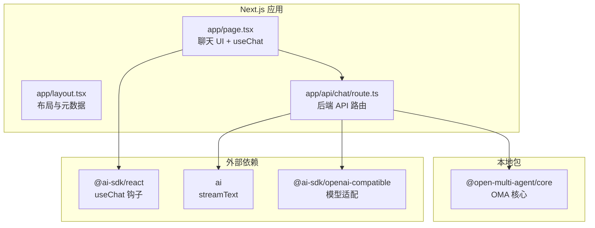
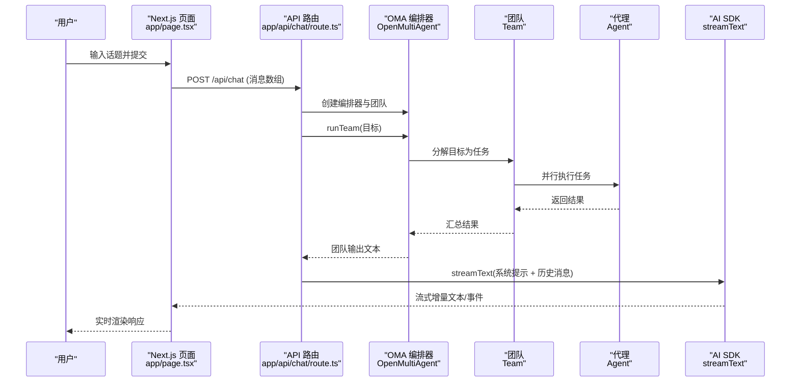
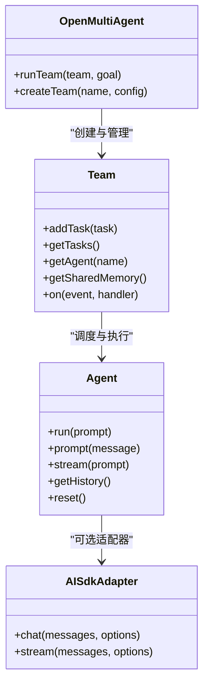
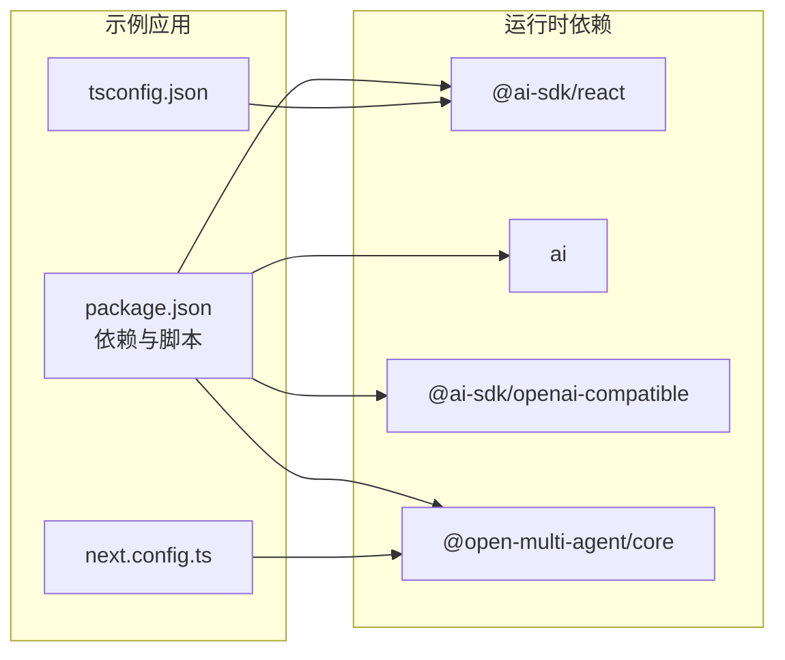

# Vercel AI SDK 集成

<cite>
**本文档引用的文件**
- [README.md](file://examples/integrations/with-vercel-ai-sdk/README.md)
- [package.json](file://examples/integrations/with-vercel-ai-sdk/package.json)
- [next.config.ts](file://examples/integrations/with-vercel-ai-sdk/next.config.ts)
- [tsconfig.json](file://examples/integrations/with-vercel-ai-sdk/tsconfig.json)
- [app/api/chat/route.ts](file://examples/integrations/with-vercel-ai-sdk/app/api/chat/route.ts)
- [app/page.tsx](file://examples/integrations/with-vercel-ai-sdk/app/page.tsx)
- [app/layout.tsx](file://examples/integrations/with-vercel-ai-sdk/app/layout.tsx)
- [src/index.ts](file://src/index.ts)
- [src/team/team.ts](file://src/team/team.ts)
- [src/orchestrator/orchestrator.ts](file://src/orchestrator/orchestrator.ts)
- [src/agent/agent.ts](file://src/agent/agent.ts)
- [src/llm/ai-sdk.ts](file://src/llm/ai-sdk.ts)
- [src/types.ts](file://src/types.ts)
</cite>

## 目录
1. [简介](#简介)
2. [项目结构](#项目结构)
3. [核心组件](#核心组件)
4. [架构总览](#架构总览)
5. [详细组件分析](#详细组件分析)
6. [依赖关系分析](#依赖关系分析)
7. [性能考虑](#性能考虑)
8. [故障排除指南](#故障排除指南)
9. [结论](#结论)
10. [附录](#附录)

## 简介
本文件面向希望在 Next.js 应用中集成 Open Multi-Agent（OMA）框架与 Vercel AI SDK 的开发者，提供从环境准备、Next.js 配置、API 路由到客户端组件与流式响应处理的完整实施指南。示例演示了如何通过 OMA 协调“研究员 + 写作员”团队完成研究任务，并借助 Vercel AI SDK 的 `streamText` 将结果以流式方式推送到前端聊天界面。

该示例采用分阶段架构：后端 API 路由负责 OMA 多智能体编排（Phase 1），随后通过 AI SDK 的 `streamText` 进行流式输出（Phase 2）。前端使用 `@ai-sdk/react` 的 `useChat` 钩子接收并渲染流式消息。

## 项目结构
示例项目位于 `examples/integrations/with-vercel-ai-sdk`，包含 Next.js 应用的核心文件与依赖配置：

- 后端 API 路由：`app/api/chat/route.ts`
- 前端页面：`app/page.tsx`
- 布局元数据：`app/layout.tsx`
- Next.js 配置：`next.config.ts`、`tsconfig.json`
- 依赖与脚本：`package.json`
- 示例说明：`README.md`

**图表来源**
- [app/layout.tsx:1-15](file://examples/integrations/with-vercel-ai-sdk/app/layout.tsx#L1-L15)
- [app/page.tsx:1-98](file://examples/integrations/with-vercel-ai-sdk/app/page.tsx#L1-L98)
- [app/api/chat/route.ts:1-92](file://examples/integrations/with-vercel-ai-sdk/app/api/chat/route.ts#L1-L92)
- [package.json:1-26](file://examples/integrations/with-vercel-ai-sdk/package.json#L1-L26)

**章节来源**
- [README.md:1-60](file://examples/integrations/with-vercel-ai-sdk/README.md#L1-L60)
- [package.json:1-26](file://examples/integrations/with-vercel-ai-sdk/package.json#L1-L26)

## 核心组件
- OMA 核心导出：通过 `@open-multi-agent/core` 导出的公开 API，包括编排器、团队、代理、工具系统等。
- 团队与消息总线：Team 负责代理编组、任务队列、共享内存与事件总线。
- 编排器：OpenMultiAgent 提供 `runTeam` 等方法，协调任务分解、分配与执行。
- AI SDK 适配器：AISdkAdapter 将 OMA 的内部消息格式转换为 AI SDK 的 ModelMessage，并支持流式生成。
- 类型系统：统一的内容块、消息、流事件与令牌用量等类型定义。

**章节来源**
- [src/index.ts:1-201](file://src/index.ts#L1-L201)
- [src/team/team.ts:88-346](file://src/team/team.ts#L88-L346)
- [src/orchestrator/orchestrator.ts:1-800](file://src/orchestrator/orchestrator.ts#L1-L800)
- [src/llm/ai-sdk.ts:1-368](file://src/llm/ai-sdk.ts#L1-L368)
- [src/types.ts:1-200](file://src/types.ts#L1-L200)

## 架构总览
下图展示了从用户输入到浏览器渲染的端到端流程，以及 OMA 与 AI SDK 的协作关系。

**图表来源**
- [app/page.tsx:1-98](file://examples/integrations/with-vercel-ai-sdk/app/page.tsx#L1-L98)
- [app/api/chat/route.ts:51-91](file://examples/integrations/with-vercel-ai-sdk/app/api/chat/route.ts#L51-L91)
- [src/orchestrator/orchestrator.ts:1-800](file://src/orchestrator/orchestrator.ts#L1-L800)
- [src/team/team.ts:88-346](file://src/team/team.ts#L88-L346)
- [src/agent/agent.ts:1-670](file://src/agent/agent.ts#L1-L670)
- [src/llm/ai-sdk.ts:250-353](file://src/llm/ai-sdk.ts#L250-L353)

## 详细组件分析

### API 路由（app/api/chat/route.ts）
职责与流程要点：
- 接收前端发送的消息数组，提取最后一条用户消息作为目标。
- 初始化 OMA 编排器与团队（研究员 + 写作员），启用共享内存。
- 调用 `runTeam` 执行多智能体协作，获取团队输出。
- 使用 AI SDK 的 `streamText` 对团队输出进行二次整理与流式输出，返回 UI 友好的消息流。

关键实现路径参考：
- [app/api/chat/route.ts:51-91](file://examples/integrations/with-vercel-ai-sdk/app/api/chat/route.ts#L51-L91)

**章节来源**
- [app/api/chat/route.ts:1-92](file://examples/integrations/with-vercel-ai-sdk/app/api/chat/route.ts#L1-L92)

### 客户端组件（app/page.tsx）
职责与流程要点：
- 使用 `@ai-sdk/react` 的 `useChat` 钩子管理消息状态、发送状态与错误信息。
- 表单提交时将纯文本消息传递给后端 API。
- 渲染历史消息与加载/错误状态，展示多智能体协作的实时效果。

关键实现路径参考：
- [app/page.tsx:6-97](file://examples/integrations/with-vercel-ai-sdk/app/page.tsx#L6-L97)

**章节来源**
- [app/page.tsx:1-98](file://examples/integrations/with-vercel-ai-sdk/app/page.tsx#L1-L98)

### 布局与元数据（app/layout.tsx）
- 设置页面标题与描述，提供基础样式容器。

关键实现路径参考：
- [app/layout.tsx:1-15](file://examples/integrations/with-vercel-ai-sdk/app/layout.tsx#L1-L15)

**章节来源**
- [app/layout.tsx:1-15](file://examples/integrations/with-vercel-ai-sdk/app/layout.tsx#L1-L15)

### Next.js 配置（next.config.ts、tsconfig.json）
- next.config.ts：声明服务器外部依赖包，避免打包时将 OMA 核心库内联。
- tsconfig.json：严格模式、ESNext 模块解析、React JSX 支持与路径别名配置。

关键实现路径参考：
- [next.config.ts:1-8](file://examples/integrations/with-vercel-ai-sdk/next.config.ts#L1-L8)
- [tsconfig.json:1-42](file://examples/integrations/with-vercel-ai-sdk/tsconfig.json#L1-L42)

**章节来源**
- [next.config.ts:1-8](file://examples/integrations/with-vercel-ai-sdk/next.config.ts#L1-L8)
- [tsconfig.json:1-42](file://examples/integrations/with-vercel-ai-sdk/tsconfig.json#L1-L42)

### OMA 核心与类型系统
- 公开 API：通过 `src/index.ts` 导出编排器、团队、代理、工具与类型，便于外部消费。
- 类型系统：统一的内容块、消息、流事件与令牌用量等类型，确保跨模块一致性。
- 适配器桥接：AISdkAdapter 将 OMA 的内部消息格式转换为 AI SDK 的 ModelMessage，并支持流式生成。

关键实现路径参考：
- [src/index.ts:1-201](file://src/index.ts#L1-L201)
- [src/types.ts:1-200](file://src/types.ts#L1-L200)
- [src/llm/ai-sdk.ts:1-368](file://src/llm/ai-sdk.ts#L1-L368)

**章节来源**
- [src/index.ts:1-201](file://src/index.ts#L1-L201)
- [src/types.ts:1-200](file://src/types.ts#L1-L200)
- [src/llm/ai-sdk.ts:1-368](file://src/llm/ai-sdk.ts#L1-L368)

### 组件关系类图

**图表来源**
- [src/orchestrator/orchestrator.ts:1-800](file://src/orchestrator/orchestrator.ts#L1-L800)
- [src/team/team.ts:88-346](file://src/team/team.ts#L88-L346)
- [src/agent/agent.ts:94-670](file://src/agent/agent.ts#L94-L670)
- [src/llm/ai-sdk.ts:191-353](file://src/llm/ai-sdk.ts#L191-L353)

## 依赖关系分析
- 前端依赖：`@ai-sdk/react` 提供 `useChat`；`ai` 提供 `streamText`；`next`、`react`、`react-dom` 构建 UI。
- 后端依赖：`@ai-sdk/openai-compatible` 用于兼容 OpenAI 风格的 API（如 DeepSeek）；`@open-multi-agent/core` 提供 OMA 编排能力。
- 本地链接：示例通过 `file:../../` 将 OMA 核心作为本地依赖引入，配合 `predev` 脚本先构建 OMA 再启动 Next.js。

**图表来源**
- [package.json:1-26](file://examples/integrations/with-vercel-ai-sdk/package.json#L1-L26)
- [next.config.ts:1-8](file://examples/integrations/with-vercel-ai-sdk/next.config.ts#L1-L8)
- [tsconfig.json:1-42](file://examples/integrations/with-vercel-ai-sdk/tsconfig.json#L1-L42)

**章节来源**
- [package.json:1-26](file://examples/integrations/with-vercel-ai-sdk/package.json#L1-L26)
- [next.config.ts:1-8](file://examples/integrations/with-vercel-ai-sdk/next.config.ts#L1-L8)
- [tsconfig.json:1-42](file://examples/integrations/with-vercel-ai-sdk/tsconfig.json#L1-L42)

## 性能考虑
- 并发与批处理：OMA 的任务队列默认并行执行无依赖任务，合理设置并发上限可提升吞吐。
- 令牌预算：编排器支持全局与任务级重试与预算控制，避免过度消耗。
- 流式传输：前端使用 `useChat` 与 `streamText` 实现增量渲染，降低首屏延迟。
- 适配器选择：当使用 AI SDK 适配器时，注意推理内容回显策略与工具调用映射，确保与底层模型能力匹配。
- 服务端外部依赖：通过 `next.config.ts` 将 OMA 核心标记为外部包，减少打包体积与构建时间。

[本节为通用指导，无需特定文件引用]

## 故障排除指南
- 环境变量缺失：确认已设置模型提供商的 API Key（示例中为 DeepSeek 或 Anthropic）。
- 构建顺序：开发模式下需先构建 OMA 再启动 Next.js，可通过 `predev` 脚本自动完成。
- 代理池耗尽：当并发委托导致代理池无可用槽位时会触发死锁保护，需增加并发或减少并行委托。
- 令牌预算超限：编排器会在累计令牌用量超过阈值时跳过剩余任务，检查任务与模型参数。
- 错误状态显示：前端通过 `useChat` 的 `error` 字段展示错误信息，便于定位问题。

**章节来源**
- [README.md:26-60](file://examples/integrations/with-vercel-ai-sdk/README.md#L26-L60)
- [app/api/chat/route.ts:51-91](file://examples/integrations/with-vercel-ai-sdk/app/api/chat/route.ts#L51-L91)
- [src/orchestrator/orchestrator.ts:561-800](file://src/orchestrator/orchestrator.ts#L561-L800)
- [app/page.tsx:57-61](file://examples/integrations/with-vercel-ai-sdk/app/page.tsx#L57-L61)

## 结论
通过本示例，可以在 Next.js 中无缝集成 OMA 多智能体编排与 Vercel AI SDK 的流式能力，实现从目标分解、智能体协作到实时渲染的完整链路。建议在生产环境中结合并发控制、预算限制与可观测性策略，持续优化性能与稳定性。

[本节为总结性内容，无需特定文件引用]

## 附录

### 部署指南
- 在本地安装依赖并构建 OMA 核心，然后进入示例目录安装依赖并启动开发服务器。
- 生产构建时，确保 OMA 核心与 Next.js 的打包配置正确，避免重复打包或缺少外部依赖。

**章节来源**
- [README.md:26-60](file://examples/integrations/with-vercel-ai-sdk/README.md#L26-L60)
- [package.json:4-9](file://examples/integrations/with-vercel-ai-sdk/package.json#L4-L9)

### 数据流与状态管理
- 前端状态：`useChat` 管理消息列表、发送状态与错误对象，支持表单提交与增量渲染。
- 后端状态：API 路由负责接收消息、调用 OMA 编排、聚合团队输出并通过 AI SDK 流式返回。
- 共享记忆：团队启用共享内存时，中间结果可被后续代理读取，提升协作连贯性。

**章节来源**
- [app/page.tsx:6-97](file://examples/integrations/with-vercel-ai-sdk/app/page.tsx#L6-L97)
- [app/api/chat/route.ts:51-91](file://examples/integrations/with-vercel-ai-sdk/app/api/chat/route.ts#L51-L91)
- [src/team/team.ts:286-310](file://src/team/team.ts#L286-L310)