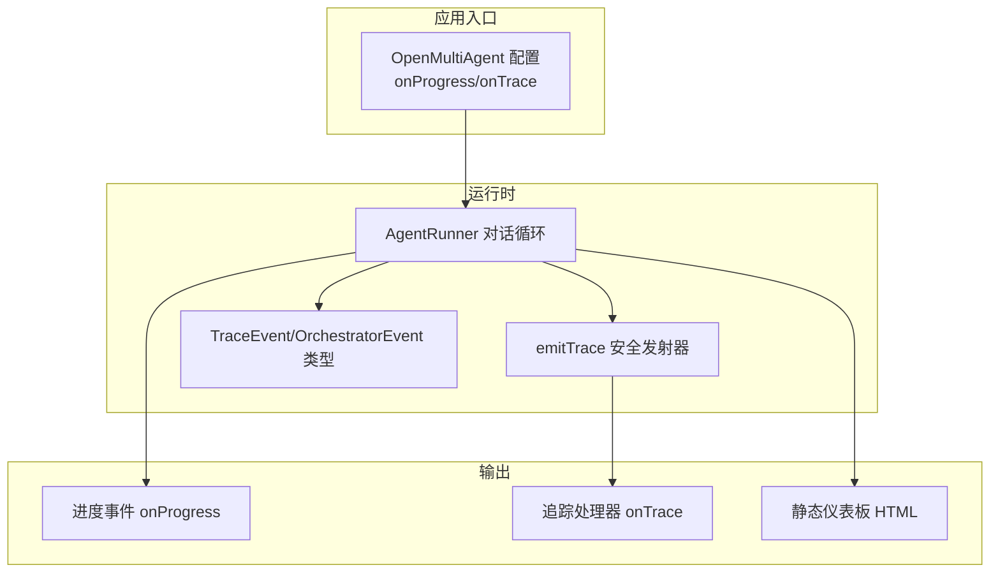
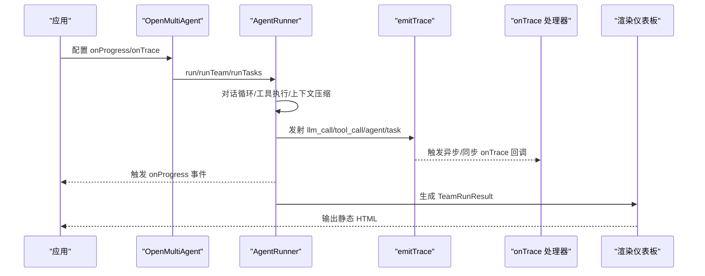
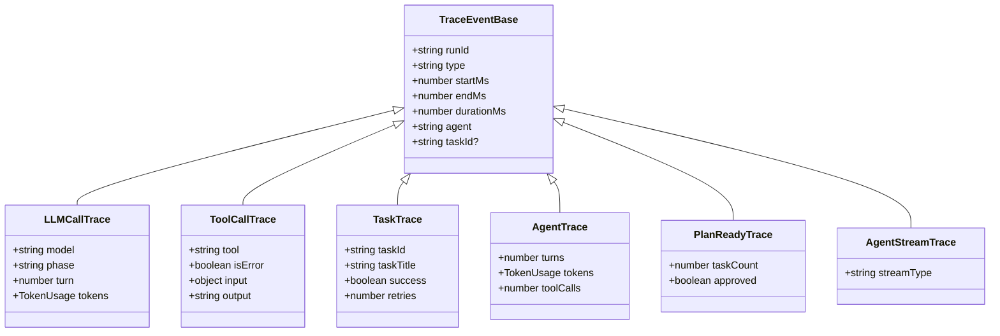
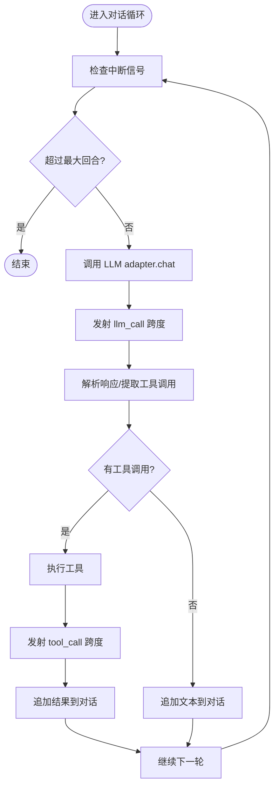
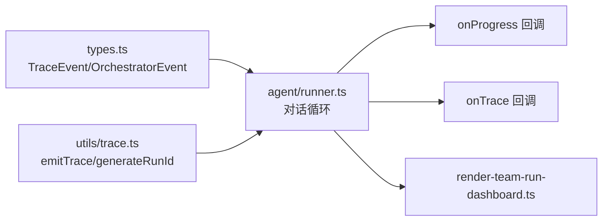

# 可观测性集成

<cite>
**本文引用的文件**
- [docs/observability.md](file://docs/observability.md)
- [src/utils/trace.ts](file://src/utils/trace.ts)
- [examples/integrations/trace-observability.ts](file://examples/integrations/trace-observability.ts)
- [src/types.ts](file://src/types.ts)
- [src/dashboard/render-team-run-dashboard.ts](file://src/dashboard/render-team-run-dashboard.ts)
- [tests/trace.test.ts](file://tests/trace.test.ts)
- [src/agent/runner.ts](file://src/agent/runner.ts)
- [examples/cookbook/incident-postmortem-dag.ts](file://examples/cookbook/incident-postmortem-dag.ts)
- [examples/cookbook/contract-review-dag.ts](file://examples/cookbook/contract-review-dag.ts)
- [src/errors.ts](file://src/errors.ts)
</cite>

## 目录
1. [简介](#简介)
2. [项目结构](#项目结构)
3. [核心组件](#核心组件)
4. [架构总览](#架构总览)
5. [详细组件分析](#详细组件分析)
6. [依赖关系分析](#依赖关系分析)
7. [性能考量](#性能考量)
8. [故障排查指南](#故障排查指南)
9. [结论](#结论)
10. [附录](#附录)

## 简介
本文件面向在 Open Multi-Agent 应用中实现“全面可观测性”的工程团队与平台工程师，系统阐述如何利用框架提供的三类遥测层进行监控与调试：轻量级进度事件（onProgress）、结构化追踪跨度（onTrace）与后置运行仪表板（静态 HTML）。文档覆盖链路追踪的实现原理、事件生成与传播、最佳实践、分布式追踪对接、错误追踪与性能分析、告警规则与仪表板定制建议，以及故障诊断与性能优化技巧。

## 项目结构
围绕可观测性的关键模块与文件如下：
- 文档与示例
  - docs/observability.md：官方可观测性概览与使用指引
  - examples/integrations/trace-observability.ts：onTrace 轻量可观测性示例
  - examples/cookbook/*.ts：进度事件与时间线采集示例
- 核心类型与事件模型
  - src/types.ts：定义 OrchestratorEvent、TraceEvent 及其子类型
- 追踪发射与运行时集成
  - src/utils/trace.ts：安全发射追踪事件与生成 runId
  - src/agent/runner.ts：在对话循环中注入 LLM/工具/任务/代理等跨度
- 后置可视化
  - src/dashboard/render-team-run-dashboard.ts：渲染任务 DAG 与指标的静态 HTML

图表来源
- [src/agent/runner.ts](file://src/agent/runner.ts)
- [src/utils/trace.ts](file://src/utils/trace.ts)
- [src/types.ts](file://src/types.ts)
- [src/dashboard/render-team-run-dashboard.ts](file://src/dashboard/render-team-run-dashboard.ts)

章节来源
- [docs/observability.md](file://docs/observability.md)
- [src/types.ts](file://src/types.ts)

## 核心组件
- 进度事件（onProgress）
  - 用于实时生命周期事件，如任务开始/完成、代理开始/完成、预算超限、消息与错误等
  - 适合终端输出、实时 UI 或轻量日志
- 结构化追踪（onTrace）
  - 提供 LLM 调用、工具执行、任务、代理、计划就绪、流式事件等结构化跨度
  - 每个跨度包含 runId、起止时间、耗时、令牌用量、工具输入/输出等
- 后置运行仪表板
  - 基于 TeamRunResult 渲染静态 HTML，展示任务 DAG、状态、耗时、令牌用量、工具调用数等
  - 支持本地查看与分享，便于复盘

章节来源
- [docs/observability.md](file://docs/observability.md)
- [src/types.ts](file://src/types.ts)

## 架构总览
下图展示了从运行到观测的关键路径：配置 onProgress/onTrace，运行时在 AgentRunner 中按阶段生成事件，通过 emitTrace 安全发射，最终由外部追踪系统或本地处理器消费；同时可生成静态 HTML 仪表板用于后置复盘。

图表来源
- [src/agent/runner.ts](file://src/agent/runner.ts)
- [src/utils/trace.ts](file://src/utils/trace.ts)
- [src/dashboard/render-team-run-dashboard.ts](file://src/dashboard/render-team-run-dashboard.ts)

## 详细组件分析

### 组件一：追踪事件模型与安全发射
- TraceEvent 类型族
  - llm_call：每次 LLM 调用（含回合号、令牌用量、起止时间）
  - tool_call：每次工具调用（含工具名、是否错误、输入/输出）
  - task：任务完成（含重试次数、成功与否）
  - agent：代理会话完成（含回合数、令牌用量、工具调用数）
  - plan_ready：计划审批边界
  - agent_stream：runTeam 流式事件转发
- 安全发射与 runId
  - emitTrace：吞掉回调异常，避免追踪订阅影响主流程
  - generateRunId：为一次 runTeam/runTasks/runAgent 生成唯一 runId，贯穿所有跨度
- 运行时注入点
  - AgentRunner 在每次 LLM 调用、工具执行、摘要调用、任务/代理结束时注入对应跨度

图表来源
- [src/types.ts](file://src/types.ts)

章节来源
- [src/types.ts](file://src/types.ts)
- [src/utils/trace.ts](file://src/utils/trace.ts)
- [tests/trace.test.ts](file://tests/trace.test.ts)

### 组件二：AgentRunner 中的跨度生成与传播
- LLM 调用跨度
  - 每次 adapter.chat 后，若存在 onTrace，则发射 llm_call，携带回合号、令牌用量、起止时间
- 工具调用跨度
  - 工具执行前后分别记录工具名、输入、输出与错误标记
- 上下文压缩与摘要跨度
  - 摘要调用同样以 llm_call 记录，phase 标记为 summary
- 代理/任务/计划/流式事件跨度
  - 在代理结束、任务结束、计划就绪、runTeam 流式事件处注入对应跨度
- 进度事件
  - onProgress 与 onTrace 并行触发，前者用于实时反馈，后者用于结构化追踪

图表来源
- [src/agent/runner.ts](file://src/agent/runner.ts)

章节来源
- [src/agent/runner.ts](file://src/agent/runner.ts)

### 组件三：onTrace 示例与集成
- 示例目标
  - 展示如何接收每类跨度（LLM/工具/任务/代理），打印耗时、令牌用量、工具输入/输出等
  - 使用 runId 关联整次运行的所有跨度
- 集成建议
  - 将 onTrace 输出写入日志系统、时序数据库或追踪后端（如 OpenTelemetry、Datadog、Honeycomb、Langfuse 等）
  - 保持 onTrace 异步处理，避免阻塞主流程

章节来源
- [examples/integrations/trace-observability.ts](file://examples/integrations/trace-observability.ts)

### 组件四：进度事件与时间线采集
- 进度事件类型
  - 包括 agent_start/complete、task_start/complete/retry/skipped、budget_exceeded、message、error 等
- 时间线采集
  - 可基于 onProgress 记录任务/代理开始/结束时间，计算耗时并做断言与验证
- 实战示例
  - incident-postmortem-dag.ts 与 contract-review-dag.ts 展示了如何在 onProgress 中记录任务开始/结束时间并进行并行性校验

章节来源
- [src/types.ts](file://src/types.ts)
- [examples/cookbook/incident-postmortem-dag.ts](file://examples/cookbook/incident-postmortem-dag.ts)
- [examples/cookbook/contract-review-dag.ts](file://examples/cookbook/contract-review-dag.ts)

### 组件五：后置运行仪表板
- 功能
  - 基于 TeamRunResult 渲染任务 DAG、状态、耗时、令牌用量、工具调用数等
  - 支持缩放/拖拽/详情面板，便于复盘
- 产物
  - 生成静态 HTML 文件，可在浏览器打开
- 使用
  - 可由 CLI 写出，或在应用侧自行写入文件

章节来源
- [src/dashboard/render-team-run-dashboard.ts](file://src/dashboard/render-team-run-dashboard.ts)
- [docs/observability.md](file://docs/observability.md)

## 依赖关系分析
- 组件耦合
  - AgentRunner 依赖 LLMAdapter、ToolExecutor、LoopDetector、emitTrace
  - emitTrace 仅依赖 TraceEvent 类型与随机 UUID
  - 进度事件与追踪事件相互独立，均可在 onProgress/onTrace 中启用
- 外部集成点
  - onTrace 可对接任意追踪/日志/指标系统
  - 仪表板 HTML 依赖 Tailwind CSS 与 Google Fonts（离线需自托管资源）

图表来源
- [src/agent/runner.ts](file://src/agent/runner.ts)
- [src/utils/trace.ts](file://src/utils/trace.ts)
- [src/types.ts](file://src/types.ts)
- [src/dashboard/render-team-run-dashboard.ts](file://src/dashboard/render-team-run-dashboard.ts)

章节来源
- [src/agent/runner.ts](file://src/agent/runner.ts)
- [src/utils/trace.ts](file://src/utils/trace.ts)
- [src/types.ts](file://src/types.ts)

## 性能考量
- 追踪开销控制
  - onTrace 采用异步安全发射，吞掉回调异常，避免追踪订阅影响主流程
  - 仅在需要时启用 onTrace，避免高频日志写入造成 I/O 抖动
- 令牌与耗时统计
  - 每个 llm_call 跨度携带回合级令牌用量，便于定位高消耗环节
  - 通过 onProgress 记录任务/代理耗时，识别瓶颈
- 上下文压缩
  - 在长对话中使用滑窗/摘要/紧凑策略减少上下文增长，降低 LLM 调用频率与成本

章节来源
- [src/utils/trace.ts](file://src/utils/trace.ts)
- [src/agent/runner.ts](file://src/agent/runner.ts)

## 故障排查指南
- 错误事件与预算超限
  - onProgress 的 error 事件可用于快速定位失败原因
  - TokenBudgetExceededError 标识预算超限，结合 onProgress 的 budget_exceeded 事件进行定位
- 追踪回溯
  - 使用 runId 关联整次运行的跨度，串联 LLM/工具/任务/代理事件
  - onTrace 输出应保留原始输入/输出（工具输出可能被截断，但 trace 中已反映截断后的结果）
- 仪表板复盘
  - 生成静态 HTML，核对任务状态、耗时、令牌用量与工具调用数
- 单元测试参考
  - tests/trace.test.ts 展示了 onTrace 的行为契约与错误处理保障

章节来源
- [src/errors.ts](file://src/errors.ts)
- [src/types.ts](file://src/types.ts)
- [tests/trace.test.ts](file://tests/trace.test.ts)

## 结论
通过 onProgress、onTrace 与静态仪表板三层可观测性能力，Open Multi-Agent 应用可以实现从实时反馈到结构化追踪再到后置复盘的完整闭环。结合 runId 的跨事件关联、LLM/工具/任务/代理跨度的细粒度统计，以及进度事件的时间线采集，能够高效支撑分布式追踪、错误追踪与性能分析场景，并为告警与仪表板定制提供坚实基础。

## 附录

### 最佳实践清单
- 进度回调
  - 仅在需要时启用 onProgress，避免过多控制台输出干扰
  - 使用统一时间戳与任务/代理标识，便于聚合与查询
- 日志记录
  - 将 onProgress 与 onTrace 输出分流至不同日志通道（结构化与非结构化）
  - 对工具输出进行脱敏与长度限制，避免敏感信息泄露
- 性能指标
  - 以 llm_call 的 durationMs 与 tokens 作为关键指标
  - 通过任务/代理维度聚合，识别热点与异常
- 分布式追踪
  - 将 runId 映射为 traceId，确保跨服务/进程的关联
  - 在 onTrace 中补充标签（如模型名、工具名、任务 ID），提升检索效率
- 错误追踪
  - 使用 onProgress 的 error 事件与 TokenBudgetExceededError 进行分类
  - 在 onTrace 的 tool_call 中记录 isError 与输出，便于回溯
- 告警规则建议
  - LLM 调用耗时 P95 超阈值
  - 单任务/单代理耗时超阈值
  - 工具调用错误率与失败耗时
  - 令牌用量预算接近阈值
- 仪表板定制
  - 任务 DAG：展示依赖关系、状态、耗时、令牌用量
  - 指标卡片：总耗时、总令牌、平均/最大耗时、错误率
  - 交互细节：点击节点查看工具调用、输入/输出摘要

### 代码示例路径（不直接展示代码）
- 轻量可观测性示例（onTrace）
  - [examples/integrations/trace-observability.ts](file://examples/integrations/trace-observability.ts)
- 进度事件与时间线采集
  - [examples/cookbook/incident-postmortem-dag.ts](file://examples/cookbook/incident-postmortem-dag.ts)
  - [examples/cookbook/contract-review-dag.ts](file://examples/cookbook/contract-review-dag.ts)
- 追踪事件模型与安全发射
  - [src/types.ts](file://src/types.ts)
  - [src/utils/trace.ts](file://src/utils/trace.ts)
  - [tests/trace.test.ts](file://tests/trace.test.ts)
- AgentRunner 中的跨度注入
  - [src/agent/runner.ts](file://src/agent/runner.ts)
- 后置运行仪表板
  - [src/dashboard/render-team-run-dashboard.ts](file://src/dashboard/render-team-run-dashboard.ts)
  - [docs/observability.md](file://docs/observability.md)