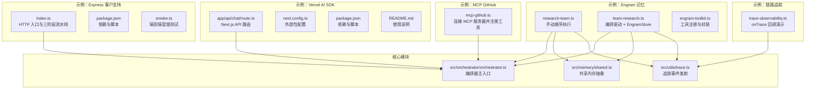
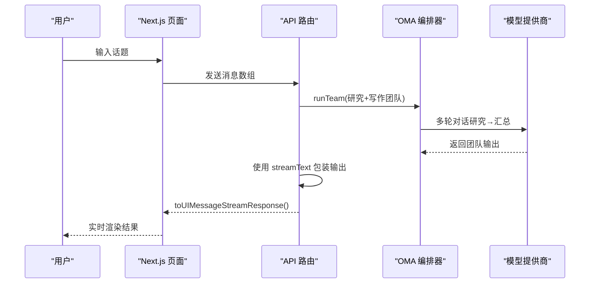
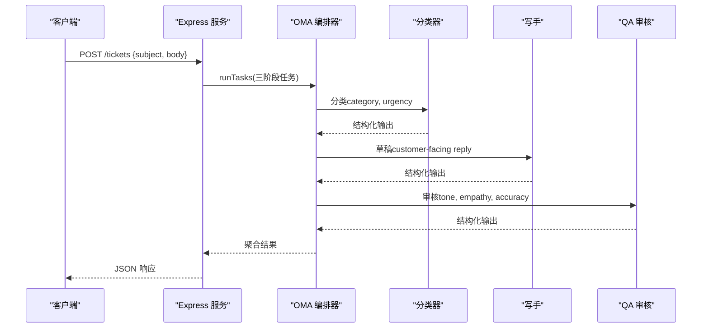
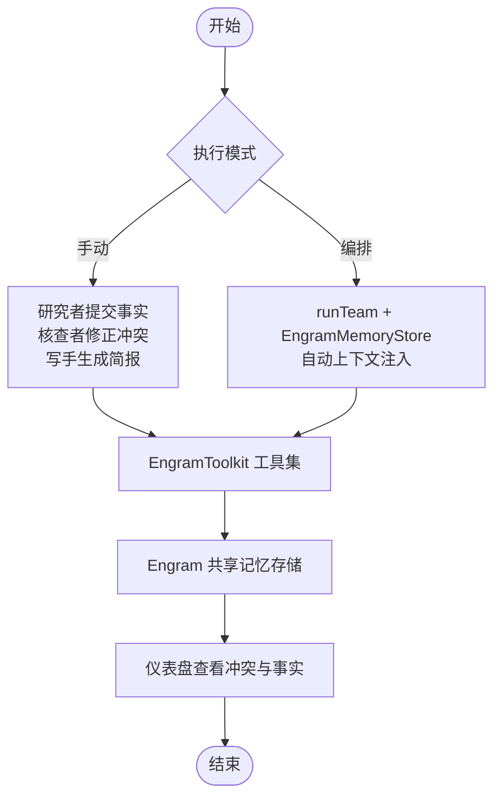
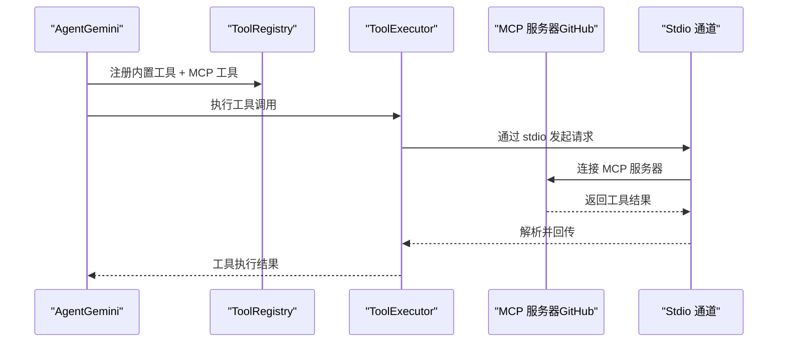
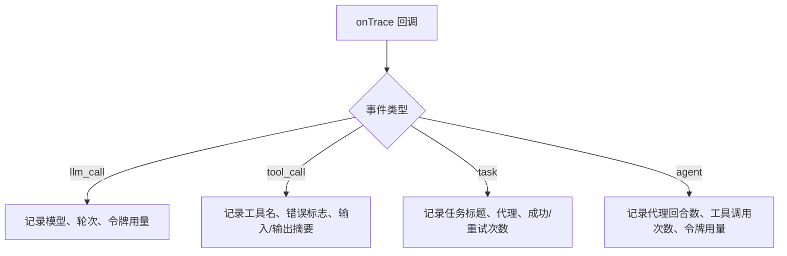
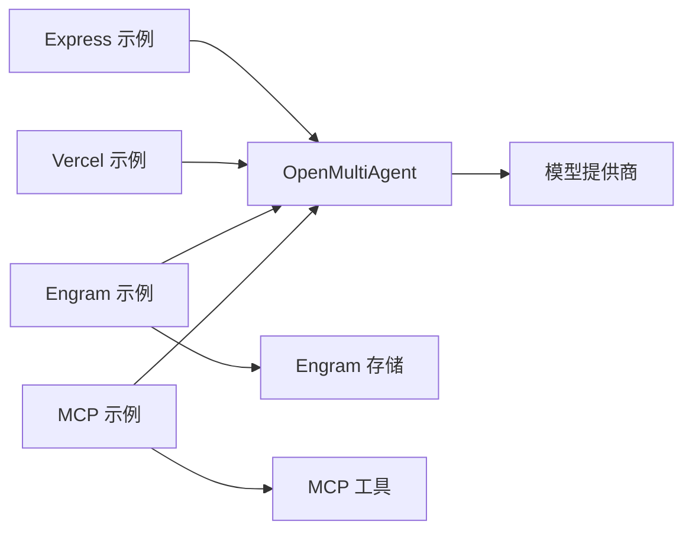

# 集成示例

<cite>
**本文引用的文件**
- [examples/integrations/express-customer-support/index.ts](file://examples/integrations/express-customer-support/index.ts)
- [examples/integrations/express-customer-support/package.json](file://examples/integrations/express-customer-support/package.json)
- [examples/integrations/express-customer-support/smoke.ts](file://examples/integrations/express-customer-support/smoke.ts)
- [examples/integrations/with-vercel-ai-sdk/app/api/chat/route.ts](file://examples/integrations/with-vercel-ai-sdk/app/api/chat/route.ts)
- [examples/integrations/with-vercel-ai-sdk/README.md](file://examples/integrations/with-vercel-ai-sdk/README.md)
- [examples/integrations/with-vercel-ai-sdk/next.config.ts](file://examples/integrations/with-vercel-ai-sdk/next.config.ts)
- [examples/integrations/with-vercel-ai-sdk/package.json](file://examples/integrations/with-vercel-ai-sdk/package.json)
- [examples/integrations/with-engram/research-team.ts](file://examples/integrations/with-engram/research-team.ts)
- [examples/integrations/with-engram/team-research.ts](file://examples/integrations/with-engram/team-research.ts)
- [examples/integrations/with-engram/engram-toolkit.ts](file://examples/integrations/with-engram/engram-toolkit.ts)
- [examples/integrations/mcp-github.ts](file://examples/integrations/mcp-github.ts)
- [examples/integrations/trace-observability.ts](file://examples/integrations/trace-observability.ts)
- [src/orchestrator/orchestrator.ts](file://src/orchestrator/orchestrator.ts)
- [src/memory/shared.ts](file://src/memory/shared.ts)
- [src/utils/trace.ts](file://src/utils/trace.ts)
</cite>

## 目录
1. [简介](#简介)
2. [项目结构](#项目结构)
3. [核心组件](#核心组件)
4. [架构总览](#架构总览)
5. [详细组件分析](#详细组件分析)
6. [依赖关系分析](#依赖关系分析)
7. [性能考量](#性能考量)
8. [故障排除指南](#故障排除指南)
9. [结论](#结论)
10. [附录](#附录)

## 简介
本文件面向希望在实际生产中落地 Open Multi-Agent（OMA）框架的工程师，提供与主流生态系统的集成示例与实操指南。内容覆盖以下五个方向：
- Vercel AI SDK 集成：用于 Web 应用的实时对话与流式输出
- Express 客户支持系统：企业级客服工单流水线
- Engram 记忆集成：知识管理与团队共享记忆
- MCP GitHub 集成：工具服务器连接与标准化工具注册
- 链路追踪集成：可观测性与性能监控

每个集成均包含：
- 架构说明与数据流图
- 配置步骤与环境变量
- 关键代码路径与实现要点
- 部署与运行指南
- 性能优化建议与安全注意事项
- 常见问题与排障清单

## 项目结构
本次文档聚焦 examples/integrations 下的五个示例，以及 src 中与之密切相关的核心模块（编排器、共享内存、追踪工具），帮助读者快速定位到可复用的集成模式。

图表来源
- [examples/integrations/express-customer-support/index.ts:121-229](file://examples/integrations/express-customer-support/index.ts#L121-L229)
- [examples/integrations/with-vercel-ai-sdk/app/api/chat/route.ts:51-91](file://examples/integrations/with-vercel-ai-sdk/app/api/chat/route.ts#L51-L91)
- [examples/integrations/with-engram/research-team.ts:169-190](file://examples/integrations/with-engram/research-team.ts#L169-L190)
- [examples/integrations/with-engram/team-research.ts:178-198](file://examples/integrations/with-engram/team-research.ts#L178-L198)
- [examples/integrations/mcp-github.ts:24-49](file://examples/integrations/mcp-github.ts#L24-L49)
- [examples/integrations/trace-observability.ts:90-99](file://examples/integrations/trace-observability.ts#L90-L99)
- [src/orchestrator/orchestrator.ts:1-200](file://src/orchestrator/orchestrator.ts#L1-L200)
- [src/memory/shared.ts:55-85](file://src/memory/shared.ts#L55-L85)
- [src/utils/trace.ts:12-35](file://src/utils/trace.ts#L12-L35)

章节来源
- [examples/integrations/express-customer-support/index.ts:1-238](file://examples/integrations/express-customer-support/index.ts#L1-L238)
- [examples/integrations/with-vercel-ai-sdk/app/api/chat/route.ts:1-92](file://examples/integrations/with-vercel-ai-sdk/app/api/chat/route.ts#L1-L92)
- [examples/integrations/with-engram/research-team.ts:1-226](file://examples/integrations/with-engram/research-team.ts#L1-L226)
- [examples/integrations/with-engram/team-research.ts:1-232](file://examples/integrations/with-engram/team-research.ts#L1-L232)
- [examples/integrations/mcp-github.ts:1-60](file://examples/integrations/mcp-github.ts#L1-L60)
- [examples/integrations/trace-observability.ts:1-144](file://examples/integrations/trace-observability.ts#L1-L144)
- [src/orchestrator/orchestrator.ts:1-200](file://src/orchestrator/orchestrator.ts#L1-L200)
- [src/memory/shared.ts:1-200](file://src/memory/shared.ts#L1-L200)
- [src/utils/trace.ts:1-35](file://src/utils/trace.ts#L1-L35)

## 核心组件
- 编排器（OpenMultiAgent）
  - 提供 createTeam、runTeam、runTasks 等核心 API，负责任务队列、调度、并发控制与结果聚合
  - 支持 onProgress、onTrace 等回调以实现可观测性与进度跟踪
- 共享内存（SharedMemory）
  - 为团队提供命名空间化的读写接口，支持 TTL 过期策略与摘要生成，便于注入上下文
- 追踪工具（emitTrace/generateRunId）
  - 统一的追踪事件发射器，保证回调异常不中断执行，提供 runId 用于跨组件关联

章节来源
- [src/orchestrator/orchestrator.ts:1-200](file://src/orchestrator/orchestrator.ts#L1-L200)
- [src/memory/shared.ts:55-200](file://src/memory/shared.ts#L55-L200)
- [src/utils/trace.ts:12-35](file://src/utils/trace.ts#L12-L35)

## 架构总览
下图展示五个集成的总体架构与数据流。各示例通过 OpenMultiAgent 的统一编排能力，串联 LLM、工具与外部系统，最终交付到前端或企业服务端。

```mermaid
graph TB
subgraph "Web 应用Vercel AI SDK"
UI["聊天 UINext.js 页面"]
API["Next.js API 路由"]
OMA1["OMA 编排器"]
LLM1["模型提供商如 Anthropic/OpenAI 兼容"]
UI --> API --> OMA1 --> LLM1
end
subgraph "企业应用Express 客户支持"
CUST["客户端"]
SVC["Express 服务"]
OMA2["OMA 编排器"]
LLM2["多模型流水线分类/草稿/审核"]
CUST --> SVC --> OMA2 --> LLM2
end
subgraph "知识管理Engram"
TEAM["研究团队研究员/事实核查/写手"]
OMA3["OMA 编排器"]
STORE["Engram 共享记忆存储"]
TEAM --> OMA3 --> STORE
end
subgraph "工具服务器MCP GitHub"
AG1["AgentGemini"]
REG["工具注册表"]
MCP["MCP 工具GitHub"]
AG1 --> REG --> MCP
end
subgraph "可观测性Trace"
OBS["onTrace 回调"]
TRC["追踪事件LLM/工具/任务/代理"]
OBS --> TRC
end
```

图表来源
- [examples/integrations/with-vercel-ai-sdk/app/api/chat/route.ts:51-91](file://examples/integrations/with-vercel-ai-sdk/app/api/chat/route.ts#L51-L91)
- [examples/integrations/express-customer-support/index.ts:132-229](file://examples/integrations/express-customer-support/index.ts#L132-L229)
- [examples/integrations/with-engram/team-research.ts:178-198](file://examples/integrations/with-engram/team-research.ts#L178-L198)
- [examples/integrations/mcp-github.ts:24-49](file://examples/integrations/mcp-github.ts#L24-L49)
- [examples/integrations/trace-observability.ts:90-99](file://examples/integrations/trace-observability.ts#L90-L99)

## 详细组件分析

### Vercel AI SDK 集成（Web 应用）
- 目标
  - 将 OMA 的研究团队编排结果通过 AI SDK 流式返回给浏览器，实现低延迟、可中断的对话体验
- 关键点
  - 使用 runTeam 创建团队并启用共享内存，使写手可读取研究者产出
  - 在 API 路由中调用 streamText，将团队输出作为系统提示传递给模型，再转为 UI 流响应
  - 通过 maxDuration 控制单次请求时长，避免长时间占用资源
- 环境变量
  - ANTHROPIC_API_KEY 或其他模型提供商密钥
  - 可选：自定义模型与 base URL（示例中使用 DeepSeek OpenAI 兼容接口）
- 部署与运行
  - 从仓库根目录安装依赖后，在示例目录安装并启动 Next.js 开发服务器
  - 访问本地端口，输入话题即可看到研究与写作过程

图表来源
- [examples/integrations/with-vercel-ai-sdk/app/api/chat/route.ts:51-91](file://examples/integrations/with-vercel-ai-sdk/app/api/chat/route.ts#L51-L91)
- [examples/integrations/with-vercel-ai-sdk/README.md:1-60](file://examples/integrations/with-vercel-ai-sdk/README.md#L1-L60)

章节来源
- [examples/integrations/with-vercel-ai-sdk/app/api/chat/route.ts:1-92](file://examples/integrations/with-vercel-ai-sdk/app/api/chat/route.ts#L1-L92)
- [examples/integrations/with-vercel-ai-sdk/README.md:1-60](file://examples/integrations/with-vercel-ai-sdk/README.md#L1-L60)
- [examples/integrations/with-vercel-ai-sdk/next.config.ts:1-8](file://examples/integrations/with-vercel-ai-sdk/next.config.ts#L1-L8)
- [examples/integrations/with-vercel-ai-sdk/package.json:1-26](file://examples/integrations/with-vercel-ai-sdk/package.json#L1-L26)

### Express 客户支持系统（企业应用）
- 目标
  - 提供一个三阶段客服工单处理流水线：分类 → 草稿 → 质量审核，统一返回结构化 JSON
- 关键点
  - 使用 OpenMultiAgent 的 runTasks 并行/串行组合，设置依赖关系与超时控制
  - 通过 AbortController 与 race 机制区分超时与失败
  - 使用 Zod 对请求体与响应进行严格校验
- 环境变量
  - CLASSIFIER_PROVIDER/DRAFTER_PROVIDER/QA_PROVIDER：默认 anthropic
  - CLASSIFIER_MODEL/DRAFTER_MODEL/QA_MODEL：默认模型名称
  - 各提供商对应的 API Key（如 ANTHROPIC_API_KEY、OPENAI_API_KEY 等）
  - PORT：默认 3000
- 部署与运行
  - 安装依赖后直接启动服务；提供 smoke.ts 用于端到端验证

图表来源
- [examples/integrations/express-customer-support/index.ts:145-229](file://examples/integrations/express-customer-support/index.ts#L145-L229)

章节来源
- [examples/integrations/express-customer-support/index.ts:1-238](file://examples/integrations/express-customer-support/index.ts#L1-L238)
- [examples/integrations/express-customer-support/package.json:1-21](file://examples/integrations/express-customer-support/package.json#L1-L21)
- [examples/integrations/express-customer-support/smoke.ts:1-28](file://examples/integrations/express-customer-support/smoke.ts#L1-L28)

### Engram 记忆集成（知识管理）
- 目标
  - 将 Engram 作为共享记忆后端，支撑研究、核查与写作的跨阶段知识沉淀与审计
- 两种模式
  - 手动顺序执行：研究者提交事实 → 核查者修正冲突 → 写手生成简报
  - 编排驱动：通过 runTeam + EngramMemoryStore 自动注入上下文，减少手工查询
- 关键点
  - EngramToolkit 注册四个工具：engram_commit、engram_query、engram_conflicts、engram_resolve
  - 支持自定义 baseUrl 与 inviteKey，便于对接本地或远程 Engram 服务
  - 编排模式下，共享内存自动传播任务结果，无需手工 engram_commit/engram_query
- 环境变量
  - AGENT_PROVIDER / AGENT_MODEL：选择 LLM 提供商与模型
  - ENGRAM_INVITE_KEY：Engram 工作区邀请密钥
  - ENGRAM 基础地址：默认 http://localhost:7474

图表来源
- [examples/integrations/with-engram/research-team.ts:169-190](file://examples/integrations/with-engram/research-team.ts#L169-L190)
- [examples/integrations/with-engram/team-research.ts:178-198](file://examples/integrations/with-engram/team-research.ts#L178-L198)
- [examples/integrations/with-engram/engram-toolkit.ts:58-60](file://examples/integrations/with-engram/engram-toolkit.ts#L58-L60)

章节来源
- [examples/integrations/with-engram/research-team.ts:1-226](file://examples/integrations/with-engram/research-team.ts#L1-L226)
- [examples/integrations/with-engram/team-research.ts:1-232](file://examples/integrations/with-engram/team-research.ts#L1-L232)
- [examples/integrations/with-engram/engram-toolkit.ts:1-194](file://examples/integrations/with-engram/engram-toolkit.ts#L1-L194)

### MCP GitHub 集成（工具服务器连接）
- 目标
  - 通过 MCP over stdio 连接 GitHub 工具服务器，将暴露的工具注册为 OMA 工具，供 Agent 调用
- 关键点
  - connectMCPTools 启动 @modelcontextprotocol/server-github 并返回可用工具列表
  - 使用 ToolRegistry 注册内置工具与 MCP 工具，构建 ToolExecutor
  - 示例 Agent 使用 Gemini 模型，系统提示中强调“使用 GitHub MCP 工具回答仓库问题”
- 环境变量
  - GITHUB_TOKEN：GitHub PAT
  - GEMINI_API_KEY：用于示例 Agent 的模型调用
- 部署与运行
  - 安装依赖后直接运行脚本，观察列出的 Issue 输出

图表来源
- [examples/integrations/mcp-github.ts:24-49](file://examples/integrations/mcp-github.ts#L24-L49)

章节来源
- [examples/integrations/mcp-github.ts:1-60](file://examples/integrations/mcp-github.ts#L1-L60)

### 链路追踪集成（监控系统）
- 目标
  - 通过 onTrace 回调收集 LLM 调用、工具执行、任务与代理级别的结构化事件，实现轻量可观测性
- 关键点
  - handleTrace 按事件类型打印耗时、令牌用量、错误与输入/输出摘要
  - 使用 generateRunId 为一次编排会话生成唯一标识，便于跨日志/面板关联
  - 事件包含 runId，可与下游 OpenTelemetry 或日志系统对接
- 环境变量
  - ANTHROPIC_API_KEY：示例中使用的模型提供商密钥
- 部署与运行
  - 直接运行示例脚本，观察终端输出的逐项追踪

图表来源
- [examples/integrations/trace-observability.ts:50-84](file://examples/integrations/trace-observability.ts#L50-L84)
- [src/utils/trace.ts:32-35](file://src/utils/trace.ts#L32-L35)

章节来源
- [examples/integrations/trace-observability.ts:1-144](file://examples/integrations/trace-observability.ts#L1-L144)
- [src/utils/trace.ts:1-35](file://src/utils/trace.ts#L1-L35)

## 依赖关系分析
- 组件耦合
  - 示例与核心编排器强耦合：Express 与 Vercel 示例均直接实例化 OpenMultiAgent 并调用 runTeam/runTasks
  - Engram 集成通过 EngramMemoryStore 与 EngramToolkit 与编排器解耦，既可手动也可自动注入上下文
  - MCP 集成通过 connectMCPTools 动态注册工具，对 Agent 透明
  - 追踪层通过 emitTrace 与 onTrace 与编排器弱耦合，不影响主流程
- 外部依赖
  - Vercel AI SDK：Next.js + ai 包，用于流式渲染
  - Express：中间件与错误处理
  - Engram：REST 接口与 inviteKey 认证
  - MCP：@modelcontextprotocol/sdk 与 stdio 通道

图表来源
- [examples/integrations/express-customer-support/index.ts:132-138](file://examples/integrations/express-customer-support/index.ts#L132-L138)
- [examples/integrations/with-vercel-ai-sdk/app/api/chat/route.ts:56-61](file://examples/integrations/with-vercel-ai-sdk/app/api/chat/route.ts#L56-L61)
- [examples/integrations/with-engram/team-research.ts:178-189](file://examples/integrations/with-engram/team-research.ts#L178-L189)
- [examples/integrations/mcp-github.ts:24-37](file://examples/integrations/mcp-github.ts#L24-L37)

章节来源
- [examples/integrations/express-customer-support/index.ts:1-238](file://examples/integrations/express-customer-support/index.ts#L1-L238)
- [examples/integrations/with-vercel-ai-sdk/app/api/chat/route.ts:1-92](file://examples/integrations/with-vercel-ai-sdk/app/api/chat/route.ts#L1-L92)
- [examples/integrations/with-engram/team-research.ts:1-232](file://examples/integrations/with-engram/team-research.ts#L1-L232)
- [examples/integrations/mcp-github.ts:1-60](file://examples/integrations/mcp-github.ts#L1-L60)

## 性能考量
- 并发与吞吐
  - 合理设置 maxConcurrency，避免同时触发过多 LLM 请求导致限流或延迟上升
  - 对于 CPU 密集型工具，优先使用本地工具或异步执行，减少阻塞
- 超时与中断
  - Express 示例已内置 60 秒超时与 AbortController，建议在生产中结合熔断与重试策略
  - Vercel 示例通过 maxDuration 控制单次请求生命周期，防止冷启动抖动
- 令牌与成本
  - 使用 SharedMemory 的 TTL 与命名空间，避免重复检索与冗余上下文
  - 在编排模式下利用共享内存自动注入，减少手工查询带来的额外调用
- 观测与采样
  - onTrace 输出仅作调试用途，生产中建议将事件转发至集中式日志/指标系统，按需采样

## 故障排除指南
- 环境变量缺失
  - Express：缺少对应提供商的 API Key 会导致启动检查失败并退出
  - Engram：缺少 ENGRAM_INVITE_KEY 或服务不可达将导致工具调用失败
  - MCP：缺少 GITHUB_TOKEN 将导致无法连接 GitHub MCP 服务器
  - 追踪：无 ANTHROPIC_API_KEY 不影响 onTrace 示例运行，但会影响 LLM 调用
- 错误处理
  - Express：对无效 JSON 与 400 错误进行专门处理；超时返回 504，失败返回 502
  - Vercel：确保 AI SDK 的 streamText 正确包裹团队输出，避免 UI 渲染异常
- 冒烟测试
  - Express 提供 smoke.ts，可在本地快速验证 /tickets 接口的输入/输出格式与结构化响应
- 日志与追踪
  - onTrace 输出包含 runId，可用于跨系统关联日志；若回调抛错，emitTrace 已做保护，不会中断执行

章节来源
- [examples/integrations/express-customer-support/index.ts:70-75](file://examples/integrations/express-customer-support/index.ts#L70-L75)
- [examples/integrations/express-customer-support/smoke.ts:1-28](file://examples/integrations/express-customer-support/smoke.ts#L1-L28)
- [examples/integrations/with-engram/research-team.ts:77-80](file://examples/integrations/with-engram/research-team.ts#L77-L80)
- [examples/integrations/mcp-github.ts:19-22](file://examples/integrations/mcp-github.ts#L19-L22)
- [examples/integrations/trace-observability.ts:16-18](file://examples/integrations/trace-observability.ts#L16-L18)

## 结论
以上五个集成展示了 OMA 在不同场景下的落地方式：Web 对话、企业客服、知识管理、工具扩展与可观测性。通过统一的编排器与共享内存抽象，开发者可以快速搭建从研究到写作、从分类到审核的多阶段流水线，并借助外部生态（AI SDK、Express、Engram、MCP、追踪系统）实现高可用与可维护的生产级应用。

## 附录
- 快速启动命令（示例）
  - Express 客户支持：安装依赖后运行服务，默认监听端口可通过环境变量配置
  - Vercel AI SDK：在示例目录安装依赖后，设置 API Key 并启动开发服务器
  - Engram：准备 Engram 服务与邀请密钥，运行研究脚本或编排脚本
  - MCP GitHub：准备 GitHub PAT，运行脚本以连接工具服务器并注册工具
  - 链路追踪：运行示例脚本，观察终端输出的结构化事件