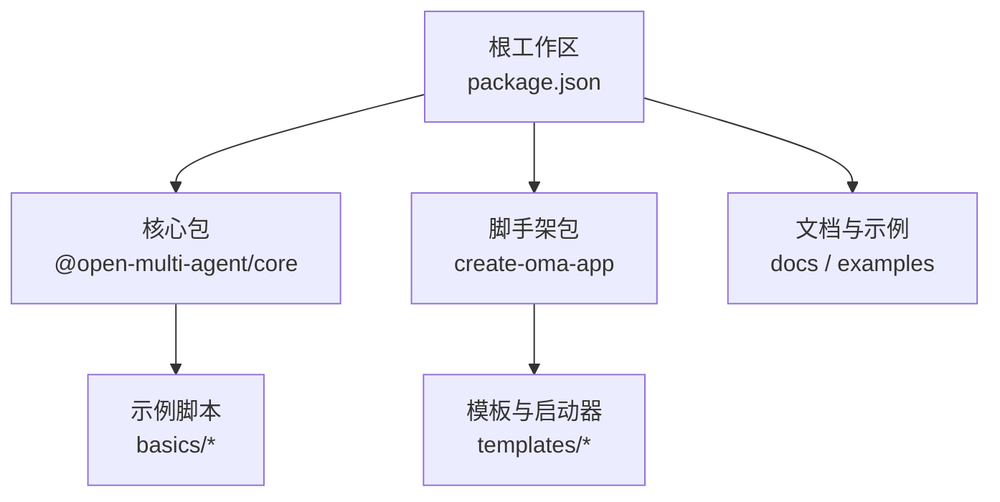
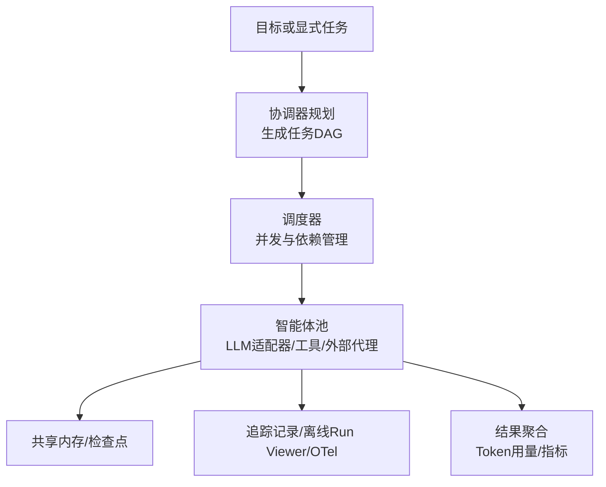
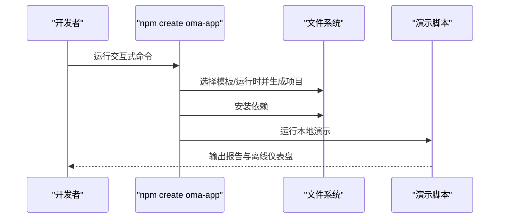
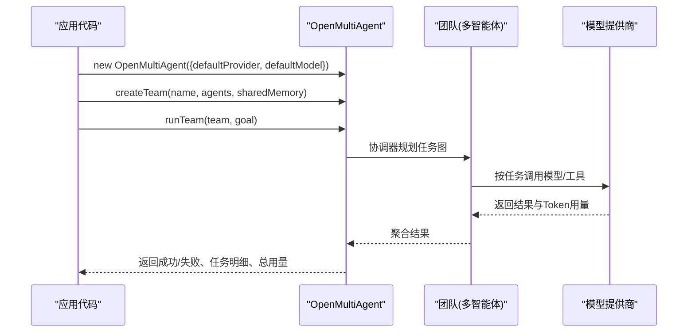
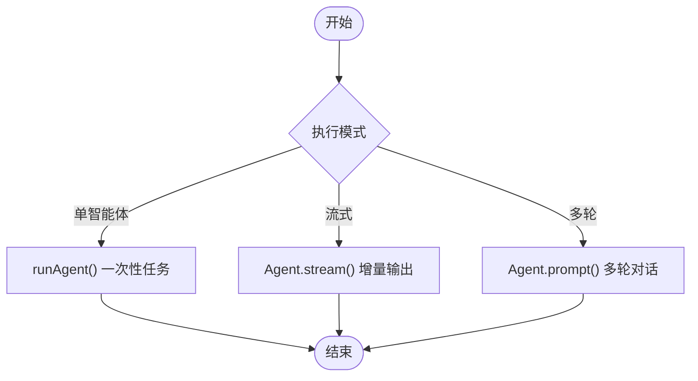
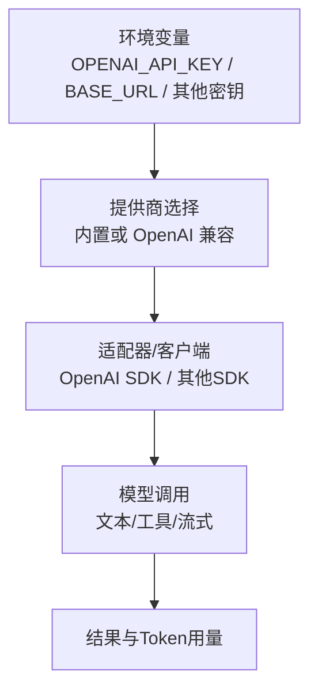
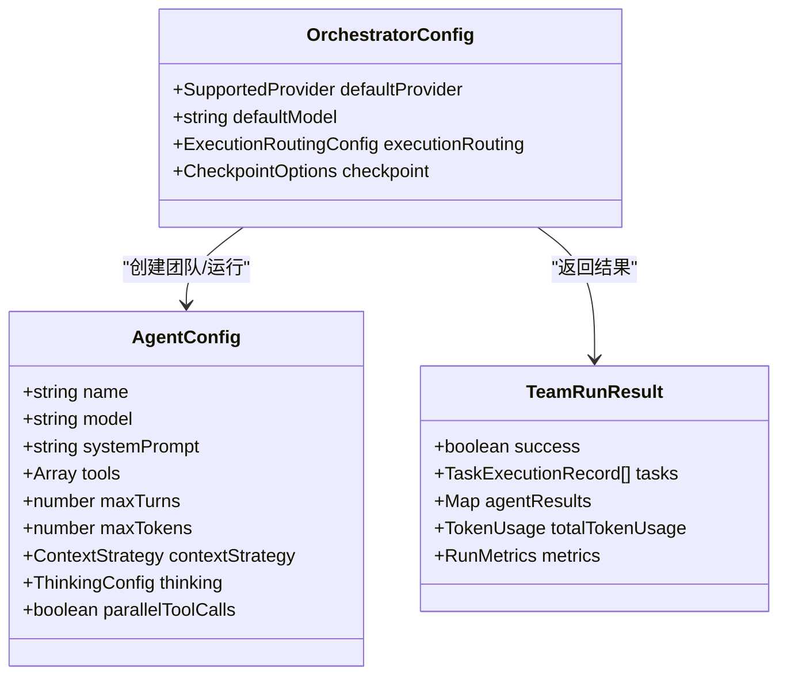
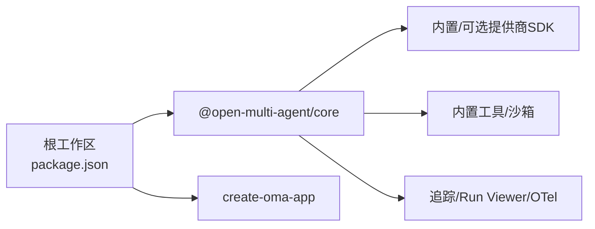

# 快速开始

<cite>
**本文引用的文件**
- [README.md](file://README.md)
- [package.json](file://package.json)
- [packages/core/README.md](file://packages/core/README.md)
- [packages/create-oma-app/README.md](file://packages/create-oma-app/README.md)
- [docs/providers.md](file://docs/providers.md)
- [packages/core/examples/basics/team-collaboration.ts](file://packages/core/examples/basics/team-collaboration.ts)
- [packages/core/examples/basics/single-agent.ts](file://packages/core/examples/basics/single-agent.ts)
- [packages/core/src/llm/openai.ts](file://packages/core/src/llm/openai.ts)
- [packages/core/src/types.ts](file://packages/core/src/types.ts)
</cite>

## 目录
1. [简介](#简介)
2. [项目结构](#项目结构)
3. [核心组件](#核心组件)
4. [架构总览](#架构总览)
5. [详细组件分析](#详细组件分析)
6. [依赖关系分析](#依赖关系分析)
7. [性能注意事项](#性能注意事项)
8. [故障排除指南](#故障排除指南)
9. [结论](#结论)
10. [附录](#附录)

## 简介
本指南帮助你从零开始使用 Open Multi-Agent（OMA）在 Node.js 环境中创建并运行第一个多智能体应用。你将了解：
- 环境要求与安装步骤
- 使用脚手架工具交互式创建项目
- 如何定义团队、智能体和任务，并运行协作
- 环境变量与模型提供商配置
- 无需外部 API 密钥的本地演示方式
- 常见问题与排错建议

## 项目结构
仓库采用 monorepo 组织，核心运行时位于 packages/core，脚手架工具位于 packages/create-oma-app，文档与示例分布在 docs 与 examples 中。根 package.json 声明工作区与 Node.js 版本要求。

**图示来源**
- [package.json:1-34](file://package.json#L1-L34)
- [packages/core/README.md:57-101](file://packages/core/README.md#L57-L101)
- [packages/create-oma-app/README.md:1-58](file://packages/create-oma-app/README.md#L1-L58)

**章节来源**
- [package.json:1-34](file://package.json#L1-L34)
- [README.md:48-97](file://README.md#L48-L97)

## 核心组件
- 编排运行时：OpenMultiAgent，负责将目标分解为任务图、调度执行、聚合结果与可观测性。
- 团队与智能体：通过 createTeam 定义角色与能力；runTeam/runAgent/runTasks 提供三种执行模式。
- 模型与提供商：内置多种提供商快捷方式，也支持 OpenAI 兼容端点与 AI SDK 桥接。
- 脚手架：npm create oma-app@latest 一键生成可运行的本地演示或真实模型项目。

**章节来源**
- [packages/core/README.md:57-101](file://packages/core/README.md#L57-L101)
- [packages/core/README.md:103-185](file://packages/core/README.md#L103-L185)
- [docs/providers.md:20-63](file://docs/providers.md#L20-L63)

## 架构总览
下图展示了从“目标”到“任务图”再到“执行与结果”的整体流程，以及共享内存、检查点与可观测性路径。

**图示来源**
- [packages/core/README.md:237-252](file://packages/core/README.md#L237-L252)

## 详细组件分析

### 使用脚手架创建第一个应用
- 环境要求：Node.js 20+（推荐 22/24）。
- 交互命令：npm create oma-app@latest my-oma
- 交互过程：选择启动器（如 PR Review Agent、Security Analysis Agent、Multi-agent DAG Demo）与运行时（云端/OpenAI 兼容或本地 Ollama），自动安装依赖并运行确定性本地演示。
- 本地演示特性：无需 API 密钥，不发起模型请求；使用脚本化模型响应驱动调度、聚合与离线仪表盘。
- 非交互参数：--no-install（仅生成文件）、--no-run（安装但不运行演示）。

**图示来源**
- [packages/create-oma-app/README.md:10-33](file://packages/create-oma-app/README.md#L10-L33)
- [packages/create-oma-app/README.md:34-53](file://packages/create-oma-app/README.md#L34-L53)

**章节来源**
- [packages/create-oma-app/README.md:1-58](file://packages/create-oma-app/README.md#L1-L58)
- [README.md:48-66](file://README.md#L48-L66)

### 创建团队、定义智能体并运行协作
- 初始化编排器：设置默认提供商与模型。
- 创建团队：定义多个智能体（如研究员、分析师），开启共享内存。
- 运行协作：传入目标，由协调器动态生成任务图并执行，最终汇总结果与 Token 用量。
- 参考示例：团队协作示例展示了三个角色协同完成一个编程任务，包含进度事件与结果输出。

**图示来源**
- [packages/core/README.md:76-99](file://packages/core/README.md#L76-L99)
- [packages/core/examples/basics/team-collaboration.ts:111-138](file://packages/core/examples/basics/team-collaboration.ts#L111-L138)

**章节来源**
- [packages/core/README.md:76-99](file://packages/core/README.md#L76-L99)
- [packages/core/examples/basics/team-collaboration.ts:1-178](file://packages/core/examples/basics/team-collaboration.ts#L1-L178)

### 单智能体与流式输出
- 单智能体：使用 runAgent 完成一次性任务，适合简单场景。
- 流式输出：通过 Agent.stream 获取增量文本与工具调用事件。
- 多轮对话：Agent.prompt 维护历史上下文，适合问答与辅导场景。

**图示来源**
- [packages/core/examples/basics/single-agent.ts:28-66](file://packages/core/examples/basics/single-agent.ts#L28-L66)
- [packages/core/examples/basics/single-agent.ts:80-138](file://packages/core/examples/basics/single-agent.ts#L80-L138)

**章节来源**
- [packages/core/examples/basics/single-agent.ts:1-141](file://packages/core/examples/basics/single-agent.ts#L1-L141)

### 环境变量与模型提供商配置
- 环境变量：
  - OPENAI_API_KEY：用于 OpenAI 提供商（或 OpenAI 兼容端点）。
  - 其他提供商对应密钥（如 ANTHROPIC_API_KEY、GEMINI_API_KEY 等）。
  - 自定义端点：OPENAI_BASE_URL 指向 OpenAI 兼容服务（如 Groq、DeepSeek、Ollama 等）。
- 提供商选择：
  - 内置快捷方式：Anthropic、OpenAI、Azure OpenAI、Copilot、Grok、DeepSeek、Doubao、Hunyuan、MiniMax、MiMo、Qiniu、Bedrock 等。
  - OpenAI 兼容：provider: 'openai' + baseURL 即可接入各类本地或第三方服务。
  - AI SDK 桥接：通过 AISdkAdapter 接入任意 @ai-sdk/* 提供商。
- 本地模型：
  - 使用 Ollama/vLLM/LM Studio/llama.cpp 等，需确保模型支持工具调用；必要时调整 topK/minP/frequencyPenalty 等采样参数。

**图示来源**
- [docs/providers.md:20-63](file://docs/providers.md#L20-L63)
- [packages/core/src/llm/openai.ts:97-101](file://packages/core/src/llm/openai.ts#L97-L101)
- [packages/core/README.md:273-286](file://packages/core/README.md#L273-L286)

**章节来源**
- [docs/providers.md:1-186](file://docs/providers.md#L1-L186)
- [packages/core/src/llm/openai.ts:1-109](file://packages/core/src/llm/openai.ts#L1-L109)
- [packages/core/README.md:273-316](file://packages/core/README.md#L273-L316)

### 类型与配置要点（摘要）
- 智能体配置：model、systemPrompt、tools、maxTurns、maxTokens、contextStrategy、thinking、parallelToolCalls 等。
- 执行路由与治理：executionRouter、governanceIntent、requiredRoles、requiredOrder 控制拓扑与验证。
- 预算与恢复：maxTokenBudget、checkpoint 持久化、restore 恢复中断运行。
- 结果对象：TeamRunResult 包含 success、tasks、agentResults、totalTokenUsage、metrics 等。

**图示来源**
- [packages/core/src/types.ts:933-1067](file://packages/core/src/types.ts#L933-L1067)
- [packages/core/src/types.ts:1692-1728](file://packages/core/src/types.ts#L1692-L1728)
- [packages/core/src/types.ts:1872-1923](file://packages/core/src/types.ts#L1872-L1923)

**章节来源**
- [packages/core/src/types.ts:933-1067](file://packages/core/src/types.ts#L933-L1067)
- [packages/core/src/types.ts:1692-1728](file://packages/core/src/types.ts#L1692-L1728)
- [packages/core/src/types.ts:1872-1923](file://packages/core/src/types.ts#L1872-L1923)

## 依赖关系分析
- 运行时依赖：Node.js >= 20（推荐 22/24）。
- 可选依赖：Gemini、Bedrock、OpenTelemetry 等按需加载。
- 工作区：根 package.json 管理子包构建与测试脚本。

**图示来源**
- [package.json:1-34](file://package.json#L1-L34)
- [packages/core/README.md:288-316](file://packages/core/README.md#L288-L316)

**章节来源**
- [package.json:1-34](file://package.json#L1-L34)
- [packages/core/README.md:288-316](file://packages/core/README.md#L288-L316)

## 性能注意事项
- 并发控制：可通过 maxConcurrency 限制并行度，便于调试与可读输出。
- 上下文策略：使用 contextStrategy 控制消息增长，避免上下文过大。
- 预算上限：设置 maxTokenBudget 与 estimateCost 控制成本与用量。
- 工具调用：合理启用 tools，注意工具输出的大小与安全性。
- 本地模型：对慢推理设置 timeoutMs，并根据模型特性调整采样参数。

[本节为通用指导，不直接分析具体文件]

## 故障排除指南
- 未设置 API 密钥：确保已设置 OPENAI_API_KEY 或其他提供商对应密钥。
- 本地模型无法工具调用：确认模型属于 Ollama Tools 类别并更新至最新版本；必要时设置 no_proxy=localhost。
- 代理干扰：若使用代理访问本地服务，请正确配置 no_proxy。
- 运行失败或超时：检查 maxTurns、timeoutMs、callTimeoutMs 与网络连通性。
- 计划不可用：使用 planOnly 查看生成的任务图，再决定是否执行。

**章节来源**
- [docs/providers.md:181-186](file://docs/providers.md#L181-L186)
- [packages/core/README.md:103-111](file://packages/core/README.md#L103-L111)

## 结论
通过本指南，你已掌握：
- 在 Node.js 20+ 环境下安装与运行 OMA
- 使用脚手架创建可本地演示的项目
- 定义团队与智能体，运行团队协作
- 配置环境变量与模型提供商
- 处理常见问题与性能调优

如需深入，可参考示例与文档中的更多模式与集成方案。

[本节为总结，不直接分析具体文件]

## 附录

### 快速命令清单
- 创建项目：npm create oma-app@latest my-oma
- 仅生成文件：添加 --no-install
- 仅安装不运行：添加 --no-run
- 运行演示：cd my-oma && npm run demo
- 真实模型运行：复制 .env.example 并填入密钥后运行开发脚本

**章节来源**
- [packages/create-oma-app/README.md:10-53](file://packages/create-oma-app/README.md#L10-L53)

### 示例参考路径
- 团队协作示例：packages/core/examples/basics/team-collaboration.ts
- 单智能体与流式示例：packages/core/examples/basics/single-agent.ts
- 提供商配置与本地模型：docs/providers.md

**章节来源**
- [packages/core/examples/basics/team-collaboration.ts:1-178](file://packages/core/examples/basics/team-collaboration.ts#L1-L178)
- [packages/core/examples/basics/single-agent.ts:1-141](file://packages/core/examples/basics/single-agent.ts#L1-L141)
- [docs/providers.md:1-186](file://docs/providers.md#L1-L186)