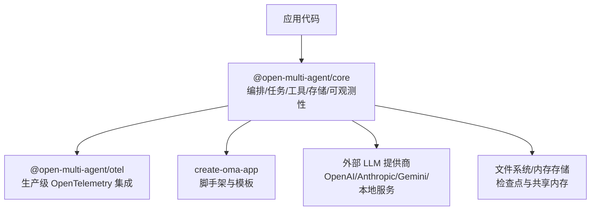
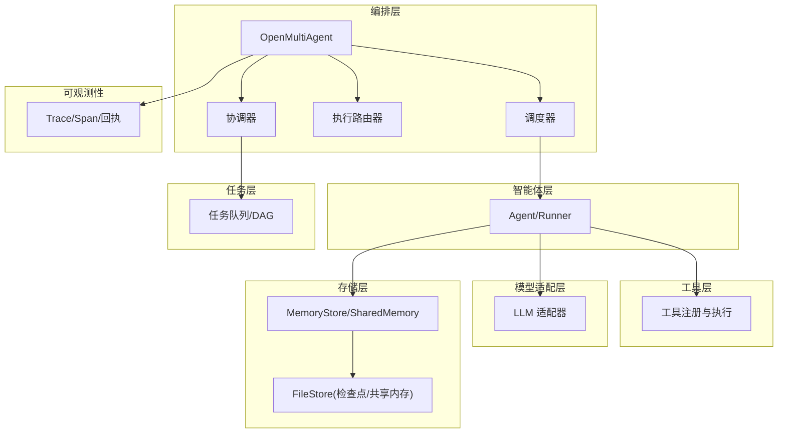
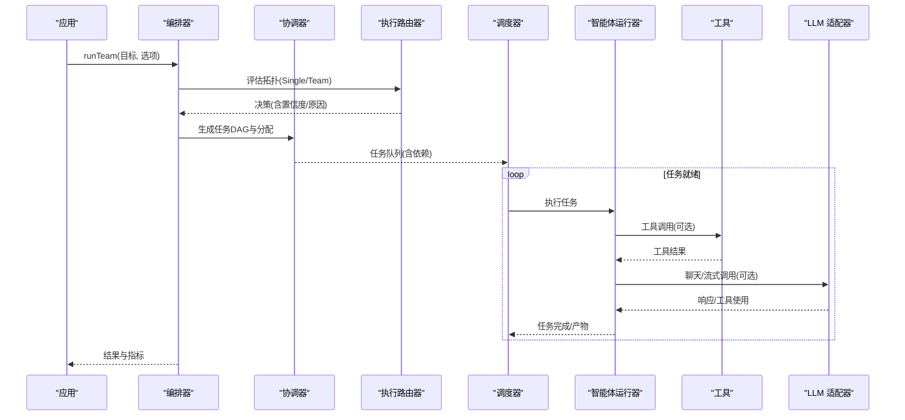
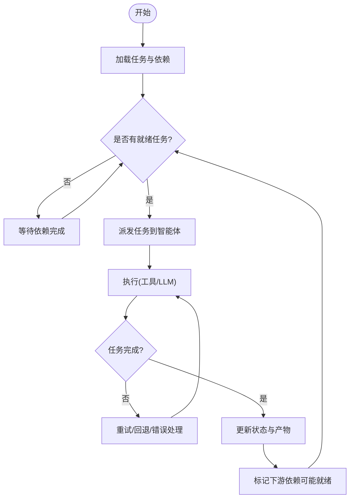
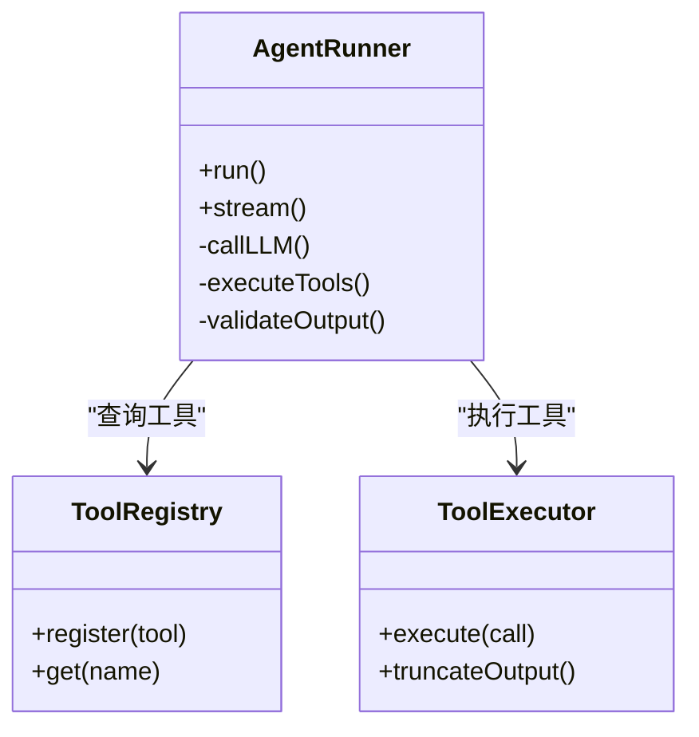
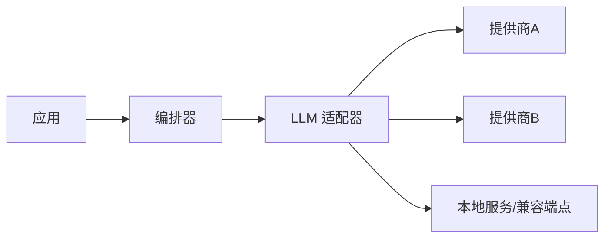
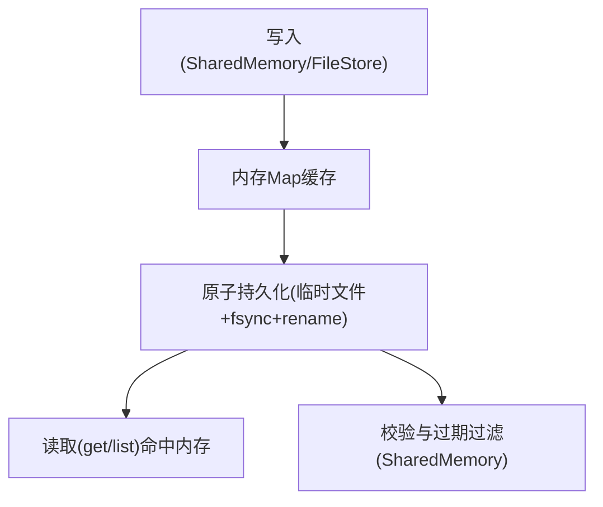
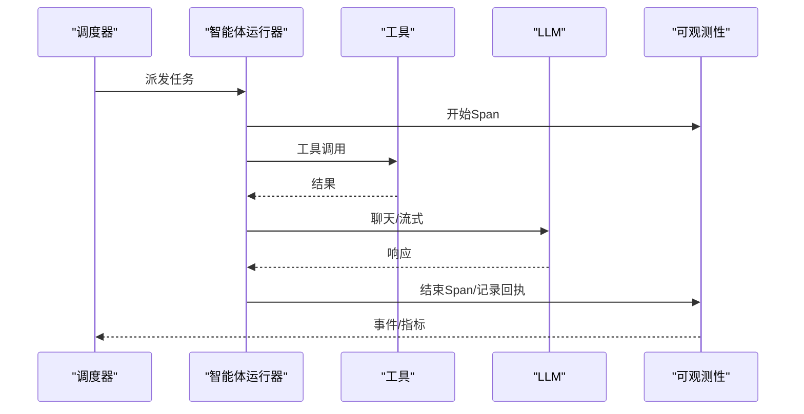
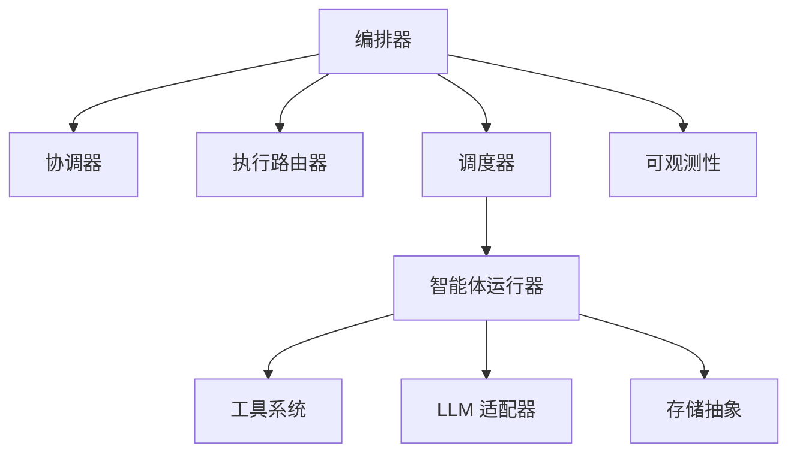

# 架构概览

<cite>
**本文引用的文件**
- [README.md](file://README.md)
- [package.json](file://package.json)
- [packages/core/README.md](file://packages/core/README.md)
- [packages/core/package.json](file://packages/core/package.json)
- [packages/core/src/index.ts](file://packages/core/src/index.ts)
- [packages/core/src/types.ts](file://packages/core/src/types.ts)
- [packages/core/src/memory/file-store.ts](file://packages/core/src/memory/file-store.ts)
- [packages/core/src/orchestrator/orchestrator.ts](file://packages/core/src/orchestrator/orchestrator.ts)
- [packages/core/src/orchestrator/scheduler.ts](file://packages/core/src/orchestrator/scheduler.ts)
- [packages/core/src/orchestrator/task-execution.ts](file://packages/core/src/orchestrator/task-execution.ts)
- [packages/core/src/orchestrator/execution-router.ts](file://packages/core/src/orchestrator/execution-router.ts)
- [packages/core/src/orchestrator/coordinator.ts](file://packages/core/src/orchestrator/coordinator.ts)
- [packages/core/src/agent/runner.ts](file://packages/core/src/agent/runner.ts)
- [packages/core/src/tool/framework.js](file://packages/core/src/tool/framework.js)
- [packages/core/src/llm/adapter.ts](file://packages/core/src/llm/adapter.ts)
- [packages/core/src/observability/index.ts](file://packages/core/src/observability/index.ts)
- [packages/core/src/team/messaging.ts](file://packages/core/src/team/messaging.ts)
- [packages/core/src/task/queue.ts](file://packages/core/src/task/queue.ts)
- [packages/core/src/task/task.ts](file://packages/core/src/task/task.ts)
- [packages/otel/README.md](file://packages/otel/README.md)
- [packages/create-oma-app/README.md](file://packages/create-oma-app/README.md)
</cite>

## 目录
1. [简介](#简介)
2. [项目结构](#项目结构)
3. [核心组件](#核心组件)
4. [架构总览](#架构总览)
5. [详细组件分析](#详细组件分析)
6. [依赖关系分析](#依赖关系分析)
7. [性能考量](#性能考量)
8. [故障排查指南](#故障排查指南)
9. [结论](#结论)
10. [附录](#附录)

## 简介
Open Multi-Agent（OMA）是一个面向 TypeScript 后端的智能体编排框架，强调“描述目标而非手工绘制图”。它通过协调器在运行时将目标动态分解为任务有向无环图（DAG），由确定性调度器在多智能体之间执行，并提供可观察、可审批、可恢复的执行记录与离线回放能力。框架采用分层设计：编排层负责目标到计划与执行的总体控制；智能体层封装单个智能体的运行循环；任务层管理 DAG、队列与依赖；工具层提供可扩展的工具注册与执行机制；模型适配层屏蔽不同提供商差异；存储抽象统一共享内存与检查点持久化；可观测性贯穿全链路。

## 项目结构
仓库采用 monorepo 组织，核心包位于 packages/core，配套生态包包括 @open-multi-agent/otel 与 create-oma-app。根 package.json 定义工作区与脚本，core 包暴露统一的公共 API 并导出编排、任务、工具、LLM 适配器、可观测性与存储等能力。

图表来源
- [packages/core/src/index.ts:57-276](file://packages/core/src/index.ts#L57-L276)
- [packages/core/package.json:19-61](file://packages/core/package.json#L19-L61)

章节来源
- [package.json:1-34](file://package.json#L1-L34)
- [packages/core/package.json:1-147](file://packages/core/package.json#L1-L147)
- [packages/core/src/index.ts:57-276](file://packages/core/src/index.ts#L57-L276)

## 核心组件
- 编排器（OpenMultiAgent）：入口对象，负责创建团队、选择执行拓扑、生成计划、调度执行、聚合结果与指标。
- 协调器（Coordinator）：根据目标动态生成任务 DAG、分配角色与依赖、产出结构化计划。
- 调度器（Scheduler）：事件驱动的任务执行引擎，按依赖就绪顺序推进任务，支持并行与策略选择。
- 执行路由器（ExecutionRouter）：决定 Single 或 Team 拓扑，并可结合混合语义路由进行决策。
- 智能体运行器（AgentRunner）：实现 Agent 的 LLM 调用循环、工具调用、结构化输出与重试。
- 工具系统（ToolRegistry/Executor）：插件化工具注册与执行，内置文件、bash、grep 等工具，支持自定义工具。
- 模型适配器（LLM Adapter）：统一 chat/stream 接口，屏蔽提供商差异，支持预算、超时、思考模式等。
- 存储抽象（MemoryStore/SharedMemory/FileStore）：键值存储抽象，支持内存与文件持久化，用于共享内存与检查点。
- 可观测性（Observability）：Span/Trace、执行回执、离线 Run Viewer、可选 OTel 导出。

章节来源
- [packages/core/src/index.ts:57-276](file://packages/core/src/index.ts#L57-L276)
- [packages/core/src/types.ts:1569-1780](file://packages/core/src/types.ts#L1569-L1780)
- [packages/core/src/types.ts:2806-2872](file://packages/core/src/types.ts#L2806-L2872)

## 架构总览
OMA 的分层架构清晰分离职责：
- 编排层：OpenMultiAgent 协调全局流程，组合协调器、路由器、调度器、智能体运行器、工具与存储。
- 智能体层：Agent/Runner 封装单次或流式推理，处理工具调用、结构化输出、重试与错误分类。
- 任务层：Task/Queue 维护 DAG、依赖、就绪集合与事件驱动推进。
- 工具层：defineTool + ToolRegistry + ToolExecutor 提供插件化扩展点。
- 模型适配层：createAdapter 统一 LLM 调用，支持多提供商与本地服务。
- 存储层：MemoryStore 抽象 SharedMemory 与 Checkpoint，FileStore 提供原子持久化。
- 可观测性：Span/Trace、执行回执、离线回放与可选 OTel 导出。

图表来源
- [packages/core/src/index.ts:57-276](file://packages/core/src/index.ts#L57-L276)
- [packages/core/src/orchestrator/orchestrator.ts](file://packages/core/src/orchestrator/orchestrator.ts)
- [packages/core/src/orchestrator/coordinator.ts](file://packages/core/src/orchestrator/coordinator.ts)
- [packages/core/src/orchestrator/scheduler.ts](file://packages/core/src/orchestrator/scheduler.ts)
- [packages/core/src/orchestrator/execution-router.ts](file://packages/core/src/orchestrator/execution-router.ts)
- [packages/core/src/agent/runner.ts](file://packages/core/src/agent/runner.ts)
- [packages/core/src/tool/framework.js](file://packages/core/src/tool/framework.js)
- [packages/core/src/llm/adapter.ts](file://packages/core/src/llm/adapter.ts)
- [packages/core/src/memory/file-store.ts](file://packages/core/src/memory/file-store.ts)
- [packages/core/src/observability/index.ts](file://packages/core/src/observability/index.ts)

## 详细组件分析

### 编排器与协调器
- 编排器作为统一入口，暴露 runAgent/runTeam/runTasks 等方法，内部组合协调器、路由器、调度器与智能体运行器。
- 协调器从目标生成任务 DAG，确定角色与依赖，产出可重放计划；支持治理意图与模式选择（single/team）。
- 执行路由器决定拓扑（Single/Team），可与混合语义路由配合，保留确定性优先的策略。

图表来源
- [packages/core/src/orchestrator/orchestrator.ts](file://packages/core/src/orchestrator/orchestrator.ts)
- [packages/core/src/orchestrator/coordinator.ts](file://packages/core/src/orchestrator/coordinator.ts)
- [packages/core/src/orchestrator/execution-router.ts](file://packages/core/src/orchestrator/execution-router.ts)
- [packages/core/src/orchestrator/scheduler.ts](file://packages/core/src/orchestrator/scheduler.ts)
- [packages/core/src/agent/runner.ts](file://packages/core/src/agent/runner.ts)
- [packages/core/src/tool/framework.js](file://packages/core/src/tool/framework.js)
- [packages/core/src/llm/adapter.ts](file://packages/core/src/llm/adapter.ts)

章节来源
- [packages/core/src/index.ts:57-110](file://packages/core/src/index.ts#L57-L110)
- [packages/core/src/types.ts:1569-1780](file://packages/core/src/types.ts#L1569-L1780)

### 调度器与任务队列（事件驱动）
- 任务执行是事件驱动的：下游任务在依赖满足时立即启动，不等待同批其他任务。
- 调度器维护就绪集合、依赖图与并发控制，支持多种调度策略与权重。
- 任务队列暴露事件以支持监控与回放。

图表来源
- [packages/core/src/orchestrator/scheduler.ts](file://packages/core/src/orchestrator/scheduler.ts)
- [packages/core/src/task/queue.ts](file://packages/core/src/task/queue.ts)
- [packages/core/src/task/task.ts](file://packages/core/src/task/task.ts)

章节来源
- [packages/core/src/index.ts:157-159](file://packages/core/src/index.ts#L157-L159)
- [packages/core/src/orchestrator/scheduler.ts](file://packages/core/src/orchestrator/scheduler.ts)
- [packages/core/src/task/queue.ts](file://packages/core/src/task/queue.ts)
- [packages/core/src/task/task.ts](file://packages/core/src/task/task.ts)

### 智能体运行器与工具系统（插件化）
- 智能体运行器实现 LLM 调用循环、工具调用、结构化输出校验、重试与错误分类。
- 工具系统通过 defineTool 注册，ToolRegistry 管理，ToolExecutor 执行；内置工具覆盖文件、bash、grep 等，支持自定义扩展。
- 工具调用可被审批门控与审计，确保默认拒绝的安全策略。

图表来源
- [packages/core/src/agent/runner.ts](file://packages/core/src/agent/runner.ts)
- [packages/core/src/tool/framework.js](file://packages/core/src/tool/framework.js)
- [packages/core/src/index.ts:165-180](file://packages/core/src/index.ts#L165-L180)

章节来源
- [packages/core/src/index.ts:136-180](file://packages/core/src/index.ts#L136-L180)

### 模型提供商适配器（扩展机制）
- createAdapter 提供统一的 chat/stream 接口，屏蔽提供商差异。
- 支持预算、超时、思考模式、额外请求体等配置，便于本地与云端模型混用。
- 通过 peerDependencies 兼容 AI SDK、MCP、ACP 等生态。

图表来源
- [packages/core/src/llm/adapter.ts](file://packages/core/src/llm/adapter.ts)
- [packages/core/package.json:103-131](file://packages/core/package.json#L103-L131)

章节来源
- [packages/core/src/index.ts:186-200](file://packages/core/src/index.ts#L186-L200)
- [packages/core/package.json:103-131](file://packages/core/package.json#L103-L131)

### 数据存储抽象与内存管理
- MemoryStore 抽象键值存储，支持 get/set/list/delete/clear，可选 CAS 与带 TTL 写入。
- FileStore 基于单 JSON 文件的原子持久化（写临时文件、fsync、rename），适合检查点与共享内存。
- SharedMemory 提供跨智能体共享上下文，支持 schema 校验与过期策略。

图表来源
- [packages/core/src/memory/file-store.ts:1-380](file://packages/core/src/memory/file-store.ts#L1-L380)
- [packages/core/src/types.ts:2806-2872](file://packages/core/src/types.ts#L2806-L2872)

章节来源
- [packages/core/src/memory/file-store.ts:1-380](file://packages/core/src/memory/file-store.ts#L1-L380)
- [packages/core/src/types.ts:2806-2872](file://packages/core/src/types.ts#L2806-L2872)

### 可观测性与异步处理
- 可观测性模块提供 Span/Trace、执行回执、离线 Run Viewer 与批量导出；支持敏感数据处理与诊断报告。
- 异步处理贯穿任务调度、工具执行与 LLM 调用，支持流式响应与重试。
- 可选 @open-multi-agent/otel 将 Trace 接入企业级监控系统。

图表来源
- [packages/core/src/observability/index.ts](file://packages/core/src/observability/index.ts)
- [packages/core/src/orchestrator/scheduler.ts](file://packages/core/src/orchestrator/scheduler.ts)
- [packages/core/src/agent/runner.ts](file://packages/core/src/agent/runner.ts)

章节来源
- [packages/core/src/index.ts:201-266](file://packages/core/src/index.ts#L201-L266)

### 生态系统包职责分工
- @open-multi-agent/core：编排运行时、工具、内存、检查点、可观测性、CLI 与离线 Run Viewer。
- @open-multi-agent/otel：可选的企业级 OpenTelemetry 集成，集中化监控。
- create-oma-app：脚手架与模板，提供无需 API Key 的本地演示与快速上手。

章节来源
- [README.md:138-144](file://README.md#L138-L144)
- [packages/core/README.md:49-111](file://packages/core/README.md#L49-L111)
- [packages/otel/README.md](file://packages/otel/README.md)
- [packages/create-oma-app/README.md](file://packages/create-oma-app/README.md)

## 依赖关系分析
- 编排器依赖协调器、路由器、调度器、智能体运行器、工具与存储抽象。
- 任务层与智能体层通过事件与消息解耦，降低耦合度。
- 可观测性作为横切关注点，贯穿各层。
- 模型适配器与提供商通过统一接口隔离变化。

图表来源
- [packages/core/src/index.ts:57-276](file://packages/core/src/index.ts#L57-L276)

章节来源
- [packages/core/src/index.ts:57-276](file://packages/core/src/index.ts#L57-L276)

## 性能考量
- 事件驱动的任务推进减少不必要的等待，提升吞吐。
- 并行执行独立任务，结合调度策略与权重优化资源利用。
- 工具输出截断与结构化输出校验降低上下文开销。
- 检查点与原子持久化保障恢复效率与一致性。
- 可观测性批量导出与采样降低监控开销。

[本节为通用指导，不直接分析具体文件]

## 故障排查指南
- 路由失败：检查执行路由器版本、决策结构与超时；查看路由降级码与原因。
- 任务失败：依据错误分类与重试策略定位问题；必要时启用审批门控与检查点恢复。
- 存储异常：确认 FileStore 路径权限与 fsync 行为；验证 CAS 与 TTL 语义。
- 模型调用超时：调整超时与预算；考虑本地模型或降级提供商。
- 可观测性缺失：确认 Trace 导出配置与 Sink 连接；使用离线 Run Viewer 回放。

章节来源
- [packages/core/src/errors.ts](file://packages/core/src/errors.ts)
- [packages/core/src/orchestrator/execution-router.ts](file://packages/core/src/orchestrator/execution-router.ts)
- [packages/core/src/memory/file-store.ts:1-380](file://packages/core/src/memory/file-store.ts#L1-L380)
- [packages/core/src/observability/index.ts](file://packages/core/src/observability/index.ts)

## 结论
OMA 通过清晰的层次化设计与插件化扩展点，实现了从目标到可执行计划的动态编排，并在可靠性、可观测性与安全性方面提供了生产级能力。协调器、调度器、执行路由器与智能体运行器协同工作，形成高效的事件驱动流水线；工具系统与模型适配器保证扩展性与兼容性；存储抽象与可观测性支撑了持久化与可追溯性。生态包进一步简化了部署与监控集成。

[本节为总结，不直接分析具体文件]

## 附录
- 快速开始与示例：参见 core 包的 README 与 examples。
- 提供商与工具配置：参考 providers 与 tool-configuration 文档。
- 可靠运行：参考 observability、checkpoint、durable approvals、adaptive recovery 等文档。

章节来源
- [packages/core/README.md:49-111](file://packages/core/README.md#L49-L111)
- [README.md:150-158](file://README.md#L150-L158)