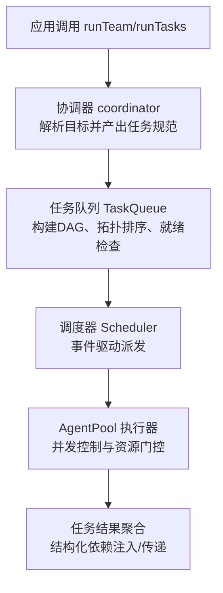
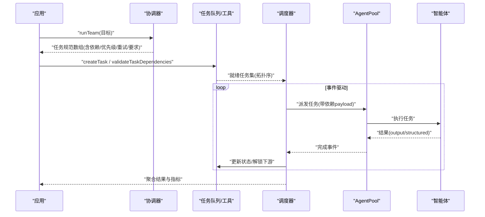
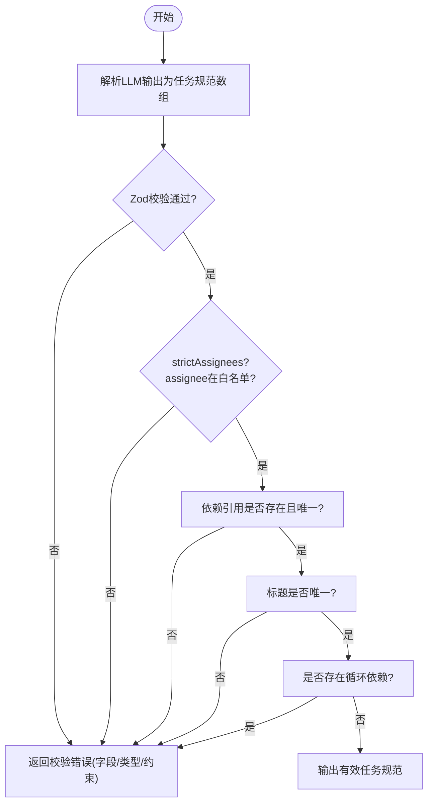
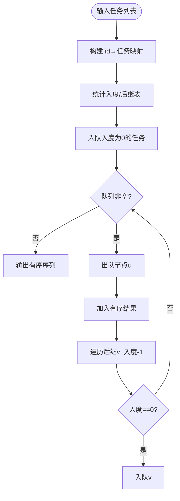
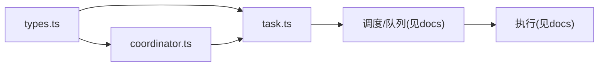

# 任务分解

<cite>
**本文引用的文件**
- [README.md](file://README.md)
- [packages/core/README.md](file://packages/core/README.md)
- [docs/task-scheduling.md](file://docs/task-scheduling.md)
- [packages/core/src/types.ts](file://packages/core/src/types.ts)
- [packages/core/src/orchestrator/coordinator.ts](file://packages/core/src/orchestrator/coordinator.ts)
- [packages/core/src/task/task.ts](file://packages/core/src/task/task.ts)
- [packages/core/tests/dependency-payload.test.ts](file://packages/core/tests/dependency-payload.test.ts)
</cite>

## 目录
1. [简介](#简介)
2. [项目结构](#项目结构)
3. [核心组件](#核心组件)
4. [架构总览](#架构总览)
5. [详细组件分析](#详细组件分析)
6. [依赖关系分析](#依赖关系分析)
7. [性能考量](#性能考量)
8. [故障排查指南](#故障排查指南)
9. [结论](#结论)
10. [附录：复杂任务分解示例与最佳实践](#附录复杂任务分解示例与最佳实践)

## 简介
本文件聚焦 Open Multi-Agent（OMA）的“任务分解”机制：协调器如何将一个高层目标自动拆解为可执行的子任务图，如何识别任务、分析依赖、智能分配执行者，以及如何在运行时构建、验证并调度任务。文档同时覆盖任务规范结构（标题、描述、依赖、内存作用域、重试配置、优先级、要求声明）、依赖图构建（拓扑排序、循环检测、冲突解决）、任务验证（依赖引用、名称唯一性、循环依赖），并提供具体代码路径以展示如何处理相互依赖、设置优先级和处理失败。

## 项目结构
- 编排核心位于 packages/core/src 下，其中 orchestrator 负责协调器、调度与执行路由；task 提供任务创建、就绪判断、拓扑排序与依赖校验；types.ts 定义所有类型契约；docs/task-scheduling.md 说明事件驱动的任务调度语义。
- 顶层 README 与 packages/core/README.md 提供运行模式概览与快速上手，强调“描述目标而非图”，由协调器在运行时生成任务图。

图表来源
- [packages/core/src/orchestrator/coordinator.ts:1-200](file://packages/core/src/orchestrator/coordinator.ts#L1-L200)
- [packages/core/src/task/task.ts:1-200](file://packages/core/src/task/task.ts#L1-L200)
- [docs/task-scheduling.md:1-203](file://docs/task-scheduling.md#L1-L203)

章节来源
- [README.md:46-97](file://README.md#L46-L97)
- [packages/core/README.md:49-111](file://packages/core/README.md#L49-L111)

## 核心组件
- 协调器（coordinator）：将目标解析为任务规范数组，包含标题、描述、依赖、内存作用域、重试、优先级、要求声明与可选验证配置；对 assignee 进行白名单校验、依赖引用校验、名称唯一性与循环依赖检测。
- 任务工具（task）：提供 createTask、isTaskReady、getTaskDependencyOrder、validateTaskDependencies 等纯函数，用于构建 DAG、计算就绪集合与拓扑序。
- 类型系统（types）：统一描述 RunTaskSpec、PlanTaskArtifact、Task、TaskRequirements、OrchestratorConfig 等，贯穿计划、调度与执行。
- 调度与执行（docs/task-scheduling.md）：事件驱动执行模型，ready set + in-flight map，完成即唤醒下游；支持多种分配策略与预算/审批门控。

章节来源
- [packages/core/src/orchestrator/coordinator.ts:85-186](file://packages/core/src/orchestrator/coordinator.ts#L85-L186)
- [packages/core/src/task/task.ts:23-182](file://packages/core/src/task/task.ts#L23-L182)
- [packages/core/src/types.ts:1387-1415](file://packages/core/src/types.ts#L1387-L1415)
- [docs/task-scheduling.md:1-25](file://docs/task-scheduling.md#L1-L25)

## 架构总览
下图展示了从目标到任务图的端到端流程：协调器产出任务规范，任务层构建并验证 DAG，调度器按事件驱动派发，执行器通过 AgentPool 并发执行，结果回传并注入依赖数据。

图表来源
- [packages/core/src/orchestrator/coordinator.ts:107-186](file://packages/core/src/orchestrator/coordinator.ts#L107-L186)
- [packages/core/src/task/task.ts:98-182](file://packages/core/src/task/task.ts#L98-L182)
- [docs/task-scheduling.md:8-25](file://docs/task-scheduling.md#L8-L25)

## 详细组件分析

### 协调器：目标到任务规范的转换与校验
- 输出契约：协调器使用 Zod schema 严格校验任务规范，确保字段合法、assignee 在白名单内、依赖引用存在且唯一、无重复标题、无循环依赖。
- 关键能力：
  - 标题与描述必填，依赖可为空数组。
  - 支持 memoryScope、maxRetries、retryDelayMs、retryBackoff、role、priority、requires 等扩展字段。
  - 支持 verify 钩子（refute/lens/quorum/maxRounds/onDissent），由上层提供 judges 后合并为完整选项。
  - strictAssignees 模式下拒绝未知 assignee。

图表来源
- [packages/core/src/orchestrator/coordinator.ts:85-186](file://packages/core/src/orchestrator/coordinator.ts#L85-L186)

章节来源
- [packages/core/src/orchestrator/coordinator.ts:85-186](file://packages/core/src/orchestrator/coordinator.ts#L85-L186)

### 任务规范结构
- 标题 title：任务标识，需唯一（协调器层面做大小写归一化去重）。
- 描述 description：人类可读的任务说明。
- 依赖 dependsOn：引用其他任务的标题（协调器阶段），或任务 ID（运行时队列阶段）。
- 内存作用域 memoryScope：dependencies（仅直接依赖结果）或 all（共享记忆摘要）。
- 依赖载荷 dependencyPayload：output（默认）、structured（仅结构化值）、both（两者）。
- 重试配置 maxRetries、retryDelayMs、retryBackoff：失败重试次数、延迟与退避。
- 角色 role 与优先级 priority：供模型路由与调度参考。
- 要求 requires：requiredTools、requiredCapabilities、requiredBackend、requiredProvider，作为硬约束在分配前过滤。
- 验证 verify：协调器生成的任务可携带部分 verify 配置，由上层补充 judges 形成完整选项。

章节来源
- [packages/core/src/types.ts:1387-1415](file://packages/core/src/types.ts#L1387-L1415)
- [packages/core/src/types.ts:1928-1941](file://packages/core/src/types.ts#L1928-L1941)
- [packages/core/src/types.ts:2052-2080](file://packages/core/src/types.ts#L2052-L2080)
- [packages/core/src/orchestrator/coordinator.ts:85-103](file://packages/core/src/orchestrator/coordinator.ts#L85-L103)

### 任务依赖图构建：拓扑排序、循环检测与冲突解决
- 拓扑排序：基于 Kahn 算法，先入度为 0 的任务优先，逐步释放后继节点。
- 就绪判定：任务处于 pending 且所有依赖已完成才可启动。
- 循环检测：协调器在 schema 中通过 DFS 检测环；任务层提供 validateTaskDependencies 用于生产路径前置校验。
- 冲突解决：
  - 依赖引用不存在的任务：协调器报告“未知依赖”。
  - 依赖引用歧义（多个同名任务）：报告“歧义依赖”。
  - 标题重复：报告“重复标题”。
  - 未知 assignee：strictAssignees 模式下拒绝。

图表来源
- [packages/core/src/task/task.ts:120-182](file://packages/core/src/task/task.ts#L120-L182)

章节来源
- [packages/core/src/task/task.ts:98-182](file://packages/core/src/task/task.ts#L98-L182)
- [packages/core/src/orchestrator/coordinator.ts:119-186](file://packages/core/src/orchestrator/coordinator.ts#L119-L186)

### 智能体分配与调度策略
- 分配前硬过滤：根据任务 requires 与最终工具授权、后端、提供者、能力标签筛选候选智能体。
- 策略：
  - round-robin：轮询。
  - least-busy：选择当前负载最低。
  - capability-match：基于能力匹配打分。
  - dependency-first：优先分配能解锁最多下游的任务。
  - composite：结合依赖重要性与当前负载的综合评分。
- 事件驱动执行：ready set 中的任务逐个派发，完成后立即唤醒下游，不等待同批无关任务。

章节来源
- [docs/task-scheduling.md:98-133](file://docs/task-scheduling.md#L98-L133)
- [packages/core/src/types.ts:2132-2180](file://packages/core/src/types.ts#L2132-L2180)

### 任务验证机制
- 依赖引用验证：协调器阶段校验 dependsOn 引用是否存在且唯一。
- 任务名称唯一性：标题去重校验，避免歧义。
- 循环依赖检测：DFS 检测环，防止死锁。
- 运行时依赖校验：任务层 validateTaskDependencies 用于生产路径前置校验。

章节来源
- [packages/core/src/orchestrator/coordinator.ts:119-186](file://packages/core/src/orchestrator/coordinator.ts#L119-L186)
- [packages/core/src/task/task.ts:188-200](file://packages/core/src/task/task.ts#L188-L200)

### 依赖载荷与结构化传递
- 默认注入 raw output；可通过 dependencyPayload 选择 structured（仅结构化 JSON）或 both（标注后的双份）。
- 若依赖未产出可序列化结构化值，消费者任务将以机器可读的错误码失败，不会静默降级为 raw。
- 测试覆盖了结构化依赖序列化失败与从检查点恢复结构化依赖数据的场景。

章节来源
- [docs/task-scheduling.md:27-64](file://docs/task-scheduling.md#L27-L64)
- [packages/core/tests/dependency-payload.test.ts:185-220](file://packages/core/tests/dependency-payload.test.ts#L185-L220)

## 依赖关系分析
- 协调器依赖任务工具进行规范校验与依赖图构建。
- 调度器依赖任务队列提供的就绪集合与拓扑序。
- 执行器通过 AgentPool 管理并发与资源门控。
- 类型系统贯穿各模块，保证计划、调度与执行的一致性。

图表来源
- [packages/core/src/types.ts:1387-1415](file://packages/core/src/types.ts#L1387-L1415)
- [packages/core/src/orchestrator/coordinator.ts:1-200](file://packages/core/src/orchestrator/coordinator.ts#L1-L200)
- [packages/core/src/task/task.ts:1-200](file://packages/core/src/task/task.ts#L1-L200)
- [docs/task-scheduling.md:1-203](file://docs/task-scheduling.md#L1-L203)

章节来源
- [packages/core/src/types.ts:1387-1415](file://packages/core/src/types.ts#L1387-L1415)
- [packages/core/src/orchestrator/coordinator.ts:1-200](file://packages/core/src/orchestrator/coordinator.ts#L1-L200)
- [packages/core/src/task/task.ts:1-200](file://packages/core/src/task/task.ts#L1-L200)
- [docs/task-scheduling.md:1-203](file://docs/task-scheduling.md#L1-L203)

## 性能考量
- 事件驱动执行减少不必要的等待，提升吞吐。
- 拓扑排序与就绪判定采用 O(n) 或近似线性复杂度，适合大规模 DAG。
- 结构化依赖限制 64 KiB，避免大对象阻塞。
- 调度策略可根据场景选择 dependency-first/composite 优化关键路径与负载均衡。

[本节为通用指导，无需特定文件引用]

## 故障排查指南
- 依赖引用错误：检查 dependsOn 是否指向已存在的任务标题（协调器阶段）或任务 ID（运行时）。
- 循环依赖：确认无环；必要时拆分任务或引入中间汇聚任务。
- 结构化依赖失败：确保上游任务产出可序列化的结构化值；否则下游将收到明确的序列化失败错误。
- 分配失败：检查 requires 与智能体的工具/能力/后端/提供者是否匹配；必要时调整策略或放宽/收紧要求。
- 预算/审批中断：遵循 drain-then-skip 语义，已在运行的任务会结算，剩余任务标记 skipped。

章节来源
- [packages/core/src/orchestrator/coordinator.ts:119-186](file://packages/core/src/orchestrator/coordinator.ts#L119-L186)
- [docs/task-scheduling.md:166-184](file://docs/task-scheduling.md#L166-L184)
- [packages/core/tests/dependency-payload.test.ts:185-220](file://packages/core/tests/dependency-payload.test.ts#L185-L220)

## 结论
OMA 的任务分解机制以协调器为核心，将高层目标转化为带有明确依赖、优先级、重试与要求的任务图；通过严格的 schema 校验与拓扑排序保障图的正确性；事件驱动的调度器高效推进执行，并在失败、预算与审批场景下保持可控与可恢复。配合结构化依赖与多策略分配，可在复杂多智能体协作中实现高可靠、可观测、可回放的工作流。

[本节为总结，无需特定文件引用]

## 附录：复杂任务分解示例与最佳实践
以下示例以“代码路径”形式给出，便于读者在仓库中定位对应用法与行为。

- 处理相互依赖的任务
  - 定义上游任务产出结构化数据，下游任务通过 dependencyPayload: 'structured' 消费，确保强类型传递。
  - 参考路径：[packages/core/tests/dependency-payload.test.ts:185-220](file://packages/core/tests/dependency-payload.test.ts#L185-L220)

- 设置适当的优先级
  - 为关键路径上的任务设置 higher/critical 优先级，配合 dependency-first 或 composite 策略加速关键分支。
  - 参考路径：[packages/core/src/types.ts:1387-1415](file://packages/core/src/types.ts#L1387-L1415)

- 处理失败与重试
  - 为易失败任务配置 maxRetries、retryDelayMs、retryBackoff；结合 onTaskDispatch 或 onApproval 实现细粒度控制。
  - 参考路径：[packages/core/src/types.ts:1387-1415](file://packages/core/src/types.ts#L1387-L1415)
  - 参考路径：[docs/task-scheduling.md:135-164](file://docs/task-scheduling.md#L135-L164)

- 要求声明与智能体匹配
  - 使用 requires 限定 requiredTools、requiredCapabilities、requiredBackend、requiredProvider，确保任务被正确分配。
  - 参考路径：[packages/core/src/types.ts:1367-1381](file://packages/core/src/types.ts#L1367-L1381)
  - 参考路径：[docs/task-scheduling.md:98-133](file://docs/task-scheduling.md#L98-L133)

- 规划先行与回放
  - 使用 planOnly 获取验证过的任务图，再通过 createPlanArtifact 与 runFromPlan 回放。
  - 参考路径：[packages/core/README.md:111-112](file://packages/core/README.md#L111-L112)

- 治理意图与确定性拓扑
  - 通过 governanceIntent 与 requiredRoles/requiredOrder 强制独立角色顺序执行，绕过协调器分解。
  - 参考路径：[packages/core/README.md:169-183](file://packages/core/README.md#L169-L183)