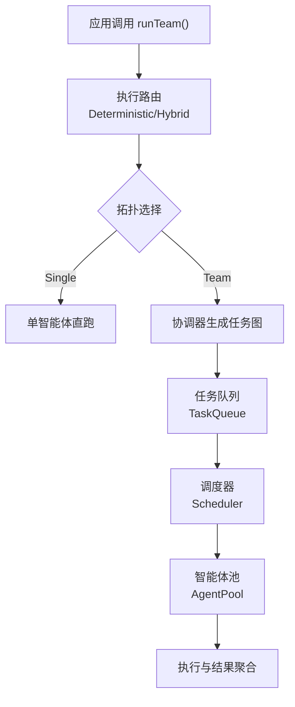
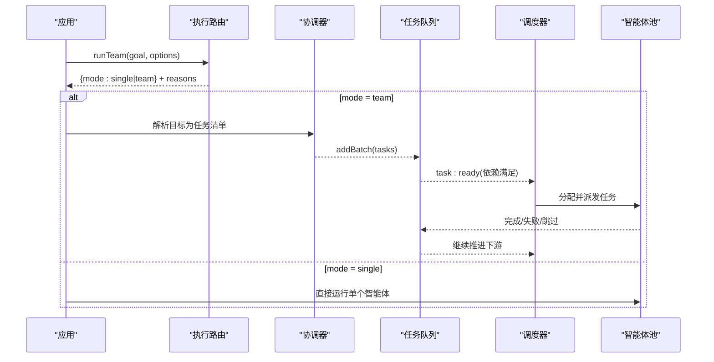
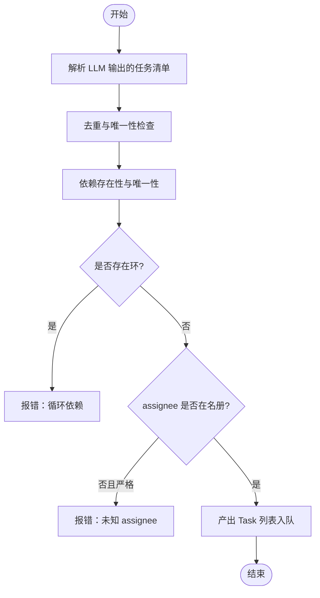
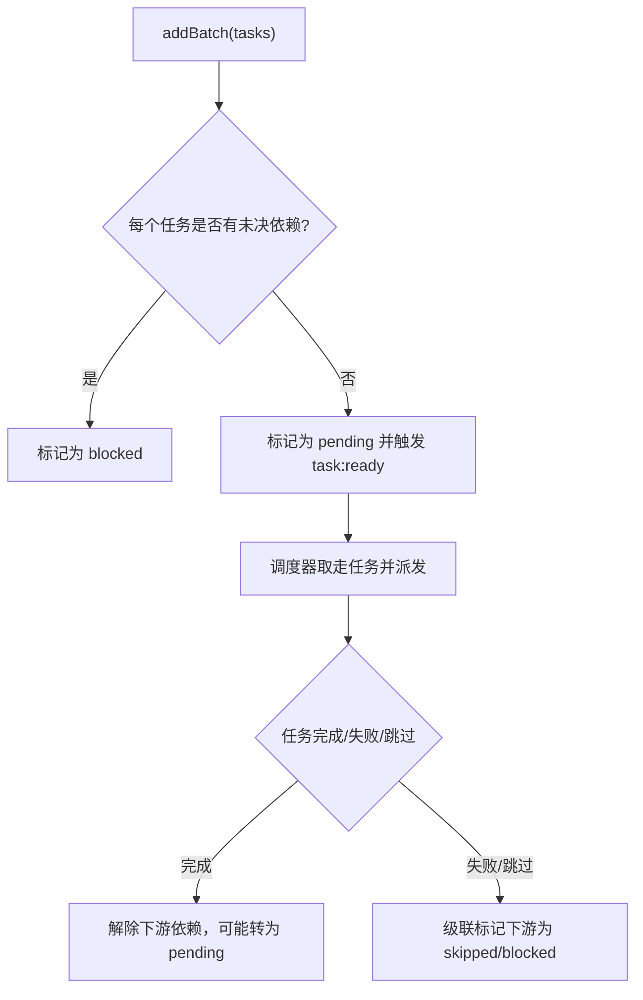
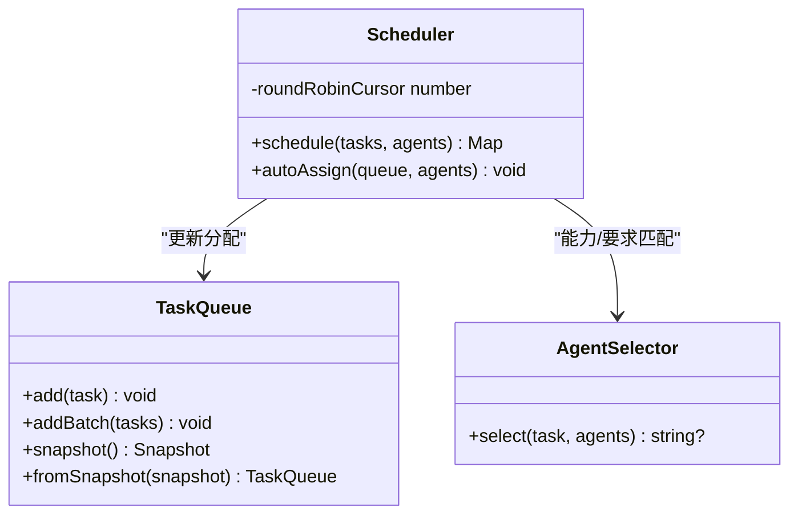
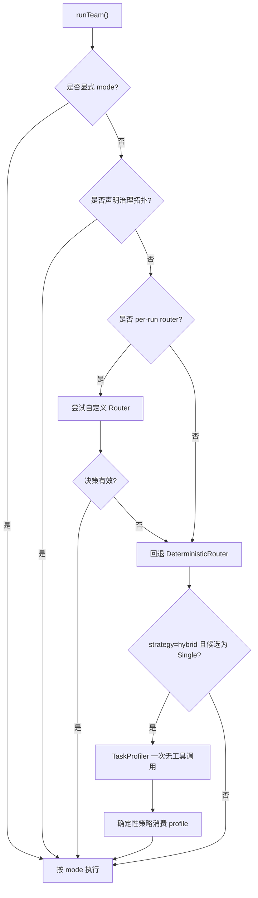
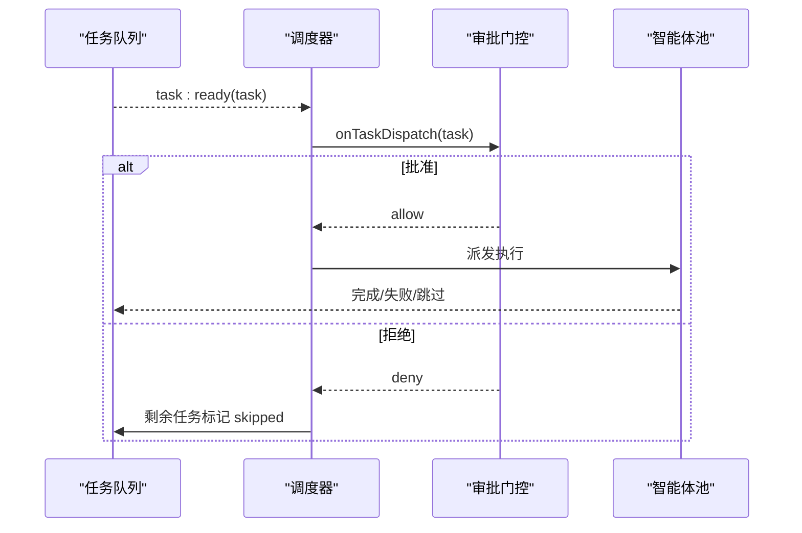

# 动态编排

<cite>
**本文引用的文件**
- [README.md](file://README.md)
- [packages/core/README.md](file://packages/core/README.md)
- [execution-routing.md](file://docs/execution-routing.md)
- [task-scheduling.md](file://docs/task-scheduling.md)
- [types.ts](file://packages/core/src/types.ts)
- [coordinator.ts](file://packages/core/src/orchestrator/coordinator.ts)
- [scheduler.ts](file://packages/core/src/orchestrator/scheduler.ts)
- [queue.ts](file://packages/core/src/task/queue.ts)
- [execution-router.ts](file://packages/core/src/orchestrator/execution-router.ts)
</cite>

## 目录
1. [简介](#简介)
2. [项目结构](#项目结构)
3. [核心组件](#核心组件)
4. [架构总览](#架构总览)
5. [详细组件分析](#详细组件分析)
6. [依赖关系分析](#依赖关系分析)
7. [性能考量](#性能考量)
8. [故障排查指南](#故障排查指南)
9. [结论](#结论)
10. [附录：配置与使用示例路径](#附录：配置与使用示例路径)

## 简介
本章节面向“动态编排”能力，说明 Open Multi-Agent（OMA）如何将一个高层目标在运行时解析为任务图（DAG），由协调器完成目标理解、依赖分析与智能体自动分配；由调度器保证确定性执行、并发控制与负载均衡；并通过执行路由策略决定拓扑选择、故障转移与性能优化。文档同时给出可落地的配置与自定义实现路径（以源码位置引用代替代码片段）。

## 项目结构
- 编排核心位于 packages/core/src 下，关键模块包括：
  - 协调器：负责将目标解析为任务规范并校验依赖、角色、工具等约束
  - 调度器：提供多种任务到智能体的分配策略
  - 任务队列：维护任务状态机、事件驱动推进与快照恢复
  - 执行路由：决定 Single/Team 拓扑，支持混合语义路由与回退策略
  - 类型定义：统一描述 Task、OrchestratorConfig、ExecutionRouter 等契约
- 文档层 docs 包含执行路由与任务调度的权威说明

图表来源
- [execution-router.ts:49-71](file://packages/core/src/orchestrator/execution-router.ts#L49-L71)
- [coordinator.ts:107-186](file://packages/core/src/orchestrator/coordinator.ts#L107-L186)
- [queue.ts:46-105](file://packages/core/src/task/queue.ts#L46-L105)
- [scheduler.ts:128-200](file://packages/core/src/orchestrator/scheduler.ts#L128-L200)

章节来源
- [README.md:46-97](file://README.md#L46-L97)
- [packages/core/README.md:49-111](file://packages/core/README.md#L49-L111)

## 核心组件
- 协调器（Coordinator）
  - 职责：构建结构化输出 Schema，解析 LLM 返回的任务清单，校验依赖环、重复标题、未知 assignee 等，产出可执行的 Task 集合
  - 关键点：严格模式拒绝不在团队名册的 assignee；依赖关系必须指向同批任务中的标题；支持可选验证钩子（verify）
- 调度器（Scheduler）
  - 职责：将待执行任务映射到可用智能体，支持 round-robin、least-busy、capability-match、dependency-first、composite 五种策略
  - 关键点：所有策略先硬过滤显式任务要求（requires），再排序或轮询；composite 结合依赖关键度、能力匹配与当前负载
- 任务队列（TaskQueue）
  - 职责：维护任务生命周期与依赖推进，事件驱动触发下游任务；支持快照与恢复、计划修订追加
  - 关键点：任务就绪即发 task:ready；失败/跳过级联传播；支持 onPlanReady/onTaskDispatch 审批门控
- 执行路由（Execution Router）
  - 职责：决定 Single 或 Team 拓扑；内置 DeterministicRouter 基于简单目标启发；Hybrid 模式在必要时进行无工具的一次性语义评估
  - 关键点：优先级顺序明确；失败策略可配置 fallback/fail；结果附带 routingDecision 与可选 semanticRoutingAssessment

章节来源
- [coordinator.ts:107-186](file://packages/core/src/orchestrator/coordinator.ts#L107-L186)
- [scheduler.ts:128-200](file://packages/core/src/orchestrator/scheduler.ts#L128-L200)
- [queue.ts:46-105](file://packages/core/src/task/queue.ts#L46-L105)
- [execution-router.ts:49-71](file://packages/core/src/orchestrator/execution-router.ts#L49-L71)
- [execution-routing.md:5-22](file://docs/execution-routing.md#L5-L22)
- [task-scheduling.md:1-26](file://docs/task-scheduling.md#L1-L26)

## 架构总览
下图展示从目标到任务图再到执行的关键流程：执行路由确定拓扑；若为 Team，协调器生成任务并注入到队列；调度器按策略分配智能体；队列事件驱动推进，直至全部完成或终止。

图表来源
- [execution-router.ts:49-71](file://packages/core/src/orchestrator/execution-router.ts#L49-L71)
- [coordinator.ts:107-186](file://packages/core/src/orchestrator/coordinator.ts#L107-L186)
- [queue.ts:46-105](file://packages/core/src/task/queue.ts#L46-L105)
- [scheduler.ts:128-200](file://packages/core/src/orchestrator/scheduler.ts#L128-L200)

## 详细组件分析

### 协调器：目标理解、依赖分析与智能体自动分配
- 目标理解
  - 通过结构化输出 Schema 约束任务字段（标题、描述、依赖、角色、优先级、重试、工具需求、验证选项等）
  - 严格校验：重复标题、未知依赖、循环依赖、未知 assignee（strictAssignees）
- 依赖关系分析
  - 基于标题建立索引，校验 dependsOn 的唯一性与可达性，检测环
- 智能体自动分配
  - 当未显式指定 assignee 时，交由调度器根据策略与 requires 硬过滤后分配
  - 支持 role/priority/metadata/requires 等元数据用于模型路由与筛选

图表来源
- [coordinator.ts:107-186](file://packages/core/src/orchestrator/coordinator.ts#L107-L186)

章节来源
- [coordinator.ts:107-186](file://packages/core/src/orchestrator/coordinator.ts#L107-L186)
- [types.ts:2052-2099](file://packages/core/src/types.ts#L2052-L2099)

### 任务图的动态生成：节点创建、边关系建立、执行顺序确定
- 节点创建
  - 协调器产出 ParsedTaskSpec，转换为 Task 对象，携带 id/title/description/dependsOn/role/priority/requires 等
- 边关系建立
  - dependsOn 以任务标题为键建立有向边；队列内部维护反向邻接表以便快速计算阻塞集
- 执行顺序确定
  - 队列初始将无依赖的任务置为 pending，随后 emit task:ready
  - 依赖完成后，下游任务从 blocked 转为 pending，再次 ready
  - 事件驱动：不等待同一就绪集中的无关任务，优先推进已就绪任务

图表来源
- [queue.ts:46-105](file://packages/core/src/task/queue.ts#L46-L105)
- [scheduler.ts:128-200](file://packages/core/src/orchestrator/scheduler.ts#L128-L200)

章节来源
- [queue.ts:46-105](file://packages/core/src/task/queue.ts#L46-L105)
- [task-scheduling.md:1-26](file://docs/task-scheduling.md#L1-L26)

### 调度器：确定性执行、并发控制与负载均衡
- 策略
  - round-robin：均匀分布
  - least-busy：选择活跃任务最少的智能体
  - capability-match：基于 requires 与能力/关键词匹配打分
  - dependency-first：优先选择能解锁最多下游的任务（关键路径）
  - composite：综合依赖关键度、能力匹配与当前负载
- 确定性
  - 除 round-robin 游标外，其余策略对给定 DAG 快照是确定性的
- 并发控制
  - AgentPool 信号量作为并发上限；调度器仅做分配，不引入第二套锁
- 负载均衡
  - composite 在调度时刻读取 in_progress 计数归一化后的负载，避免热点

图表来源
- [scheduler.ts:128-200](file://packages/core/src/orchestrator/scheduler.ts#L128-L200)
- [queue.ts:46-105](file://packages/core/src/task/queue.ts#L46-L105)

章节来源
- [scheduler.ts:128-200](file://packages/core/src/orchestrator/scheduler.ts#L128-L200)
- [task-scheduling.md:98-133](file://docs/task-scheduling.md#L98-L133)

### 执行路由策略：拓扑选择、故障转移与性能优化
- 拓扑选择优先级
  - 显式 mode > 治理拓扑/降级策略 > per-run router > 默认 DeterministicRouter > Hybrid 语义路由（仅在特定条件下）
- 故障转移
  - 自定义 Router 抛错/超时/非法决策时，默认回退到 DeterministicRouter；可配置 failurePolicy 为 fail 以中断
- 性能优化
  - Hybrid 仅在 deterministic 会选 Single 时进行一次无工具模型调用；Profiler 仅接收目标文本与最小摘要，不暴露敏感信息
  - 语言中性启发：长度估计、序列标记识别、CJK 权重等，保持低成本

图表来源
- [execution-routing.md:5-22](file://docs/execution-routing.md#L5-L22)
- [execution-routing.md:23-79](file://docs/execution-routing.md#L23-L79)
- [execution-routing.md:120-181](file://docs/execution-routing.md#L120-L181)
- [execution-router.ts:49-71](file://packages/core/src/orchestrator/execution-router.ts#L49-L71)

章节来源
- [execution-routing.md:5-22](file://docs/execution-routing.md#L5-L22)
- [execution-routing.md:23-79](file://docs/execution-routing.md#L23-L79)
- [execution-routing.md:120-181](file://docs/execution-routing.md#L120-L181)
- [execution-router.ts:49-71](file://packages/core/src/orchestrator/execution-router.ts#L49-L71)

### 事件驱动执行与审批门控
- 事件驱动
  - 任务就绪即触发 task:ready；完成立即唤醒下游；失败/跳过级联传播
- 审批门控
  - onPlanReady：协调器生成计划后、执行前一次性审批
  - onTaskDispatch：每个任务派发前审批；拒绝则停止新派发，已在运行的任务允许结算，剩余任务标记 skipped
  - 预算/中止/审批拒绝共享“排空-跳过”路径

图表来源
- [task-scheduling.md:135-178](file://docs/task-scheduling.md#L135-L178)
- [types.ts:2282-2335](file://packages/core/src/types.ts#L2282-L2335)

章节来源
- [task-scheduling.md:135-178](file://docs/task-scheduling.md#L135-L178)
- [types.ts:2282-2335](file://packages/core/src/types.ts#L2282-L2335)

## 依赖关系分析
- 低耦合高内聚
  - 协调器只负责计划生成与校验，不关心执行细节
  - 调度器专注分配策略，依赖 AgentSelector 做能力匹配
  - 任务队列独立管理状态机与事件，对外暴露稳定接口
- 外部依赖
  - 执行路由可与模型路由正交；Hybrid 模式下 Profiler 仅读目标文本与最小摘要
- 潜在风险
  - 循环依赖在协调器阶段被拦截
  - 未知 assignee 在严格模式下被拒绝
  - 自定义 Router 异常不会导致运行崩溃，默认回退

图表来源
- [coordinator.ts:107-186](file://packages/core/src/orchestrator/coordinator.ts#L107-L186)
- [scheduler.ts:128-200](file://packages/core/src/orchestrator/scheduler.ts#L128-L200)
- [execution-router.ts:49-71](file://packages/core/src/orchestrator/execution-router.ts#L49-L71)

章节来源
- [coordinator.ts:107-186](file://packages/core/src/orchestrator/coordinator.ts#L107-L186)
- [scheduler.ts:128-200](file://packages/core/src/orchestrator/scheduler.ts#L128-L200)
- [execution-router.ts:49-71](file://packages/core/src/orchestrator/execution-router.ts#L49-L71)

## 性能考量
- 执行路由
  - 默认 DeterministicRouter 无额外模型调用；Hybrid 仅在必要时做一次无工具调用，降低开销
- 调度策略
  - dependency-first 适合强依赖 DAG；composite 兼顾能力与负载，减少热点
- 事件驱动
  - 不等待无关任务，最大化并行度；失败/跳过级联避免无效等待
- 预算与检查点
  - 每 turn/任务边界检查预算；检查点在安全边界持久化，恢复时重放已提交结果

[本节为通用指导，不直接分析具体文件]

## 故障排查指南
- 常见错误
  - 循环依赖：协调器校验阶段抛出，需修正 dependsOn
  - 未知 assignee：strictAssignees=true 时拒绝，需修正或关闭严格模式
  - 路由失败：自定义 Router 抛错/超时/非法决策，默认回退 DeterministicRouter；failurePolicy=fail 时中断
- 诊断要点
  - 查看 TeamRunResult.routingDecision 与 semanticRoutingAssessment 定位拓扑选择原因
  - 观察任务状态与 dependsOn，确认依赖链是否正确
  - 使用 onPlanReady/onTaskDispatch 记录审批决策与拒绝原因
  - 借助检查点与离线 Run Viewer 回放任务 DAG 与跨度瀑布

章节来源
- [execution-routing.md:120-181](file://docs/execution-routing.md#L120-L181)
- [task-scheduling.md:166-184](file://docs/task-scheduling.md#L166-L184)
- [coordinator.ts:107-186](file://packages/core/src/orchestrator/coordinator.ts#L107-L186)

## 结论
Open Multi-Agent 的动态编排以“目标即计划”为核心：执行路由决定拓扑，协调器生成并校验任务图，任务队列事件驱动推进，调度器负责任务到智能体的分配与负载均衡。通过可插拔的执行路由、灵活的审批门控与稳健的回退机制，系统在保证可控性的同时实现了高度的自动化与可扩展性。

[本节为总结性内容，不直接分析具体文件]

## 附录：配置与使用示例路径
以下提供“如何配置和使用动态编排功能”的路径指引（以源码位置引用代替代码片段）：
- 基础用法与动态工作流入口
  - [packages/core/README.md:57-111](file://packages/core/README.md#L57-L111)
- 执行路由（Single/Team、Hybrid、自定义 Router）
  - [execution-routing.md:5-22](file://docs/execution-routing.md#L5-L22)
  - [execution-routing.md:23-79](file://docs/execution-routing.md#L23-L79)
  - [execution-routing.md:81-118](file://docs/execution-routing.md#L81-L118)
  - [execution-routing.md:120-181](file://docs/execution-routing.md#L120-L181)
  - [execution-router.ts:49-71](file://packages/core/src/orchestrator/execution-router.ts#L49-L71)
- 任务调度与分配策略
  - [task-scheduling.md:98-133](file://docs/task-scheduling.md#L98-L133)
  - [scheduler.ts:128-200](file://packages/core/src/orchestrator/scheduler.ts#L128-L200)
- 任务队列与事件驱动执行
  - [queue.ts:46-105](file://packages/core/src/task/queue.ts#L46-L105)
  - [task-scheduling.md:1-26](file://docs/task-scheduling.md#L1-L26)
- 审批门控（onPlanReady/onTaskDispatch）
  - [types.ts:2282-2335](file://packages/core/src/types.ts#L2282-L2335)
  - [task-scheduling.md:135-178](file://docs/task-scheduling.md#L135-L178)
- 协调器任务规范与校验
  - [coordinator.ts:107-186](file://packages/core/src/orchestrator/coordinator.ts#L107-L186)
- 任务与运行结果类型
  - [types.ts:2052-2099](file://packages/core/src/types.ts#L2052-L2099)
  - [types.ts:1872-1923](file://packages/core/src/types.ts#L1872-L1923)