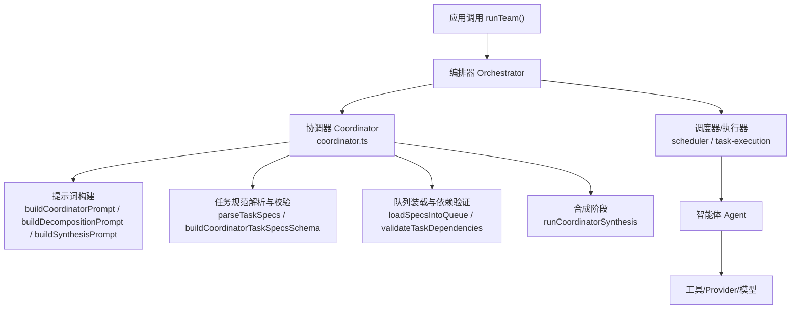
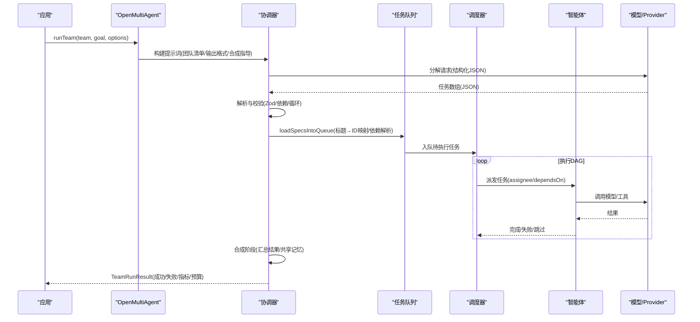
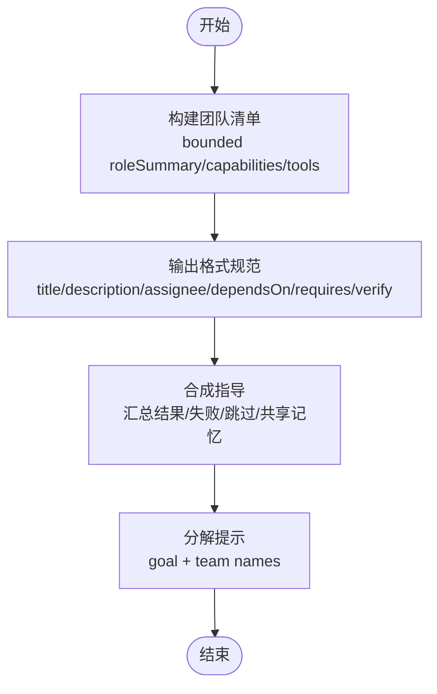
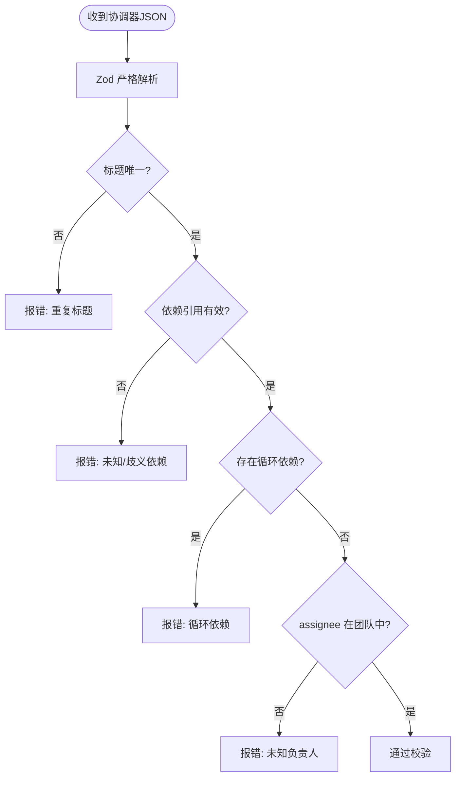
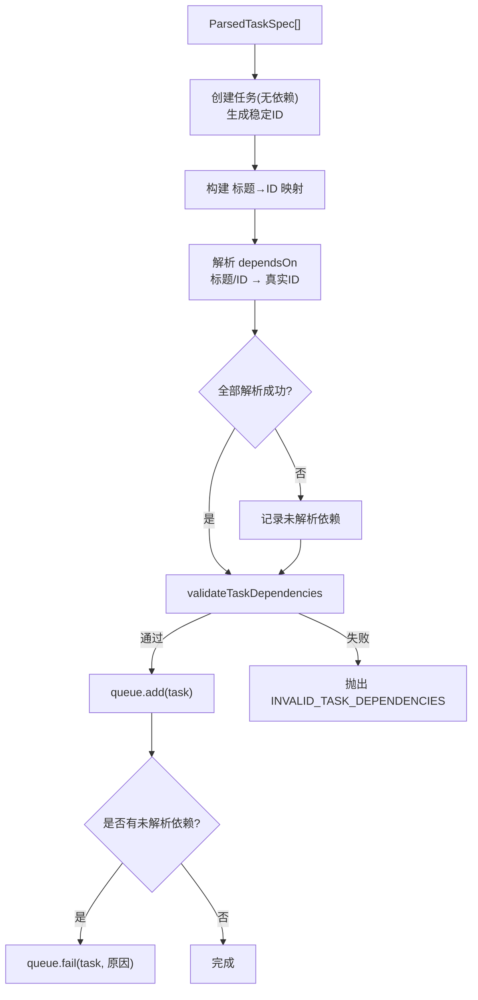
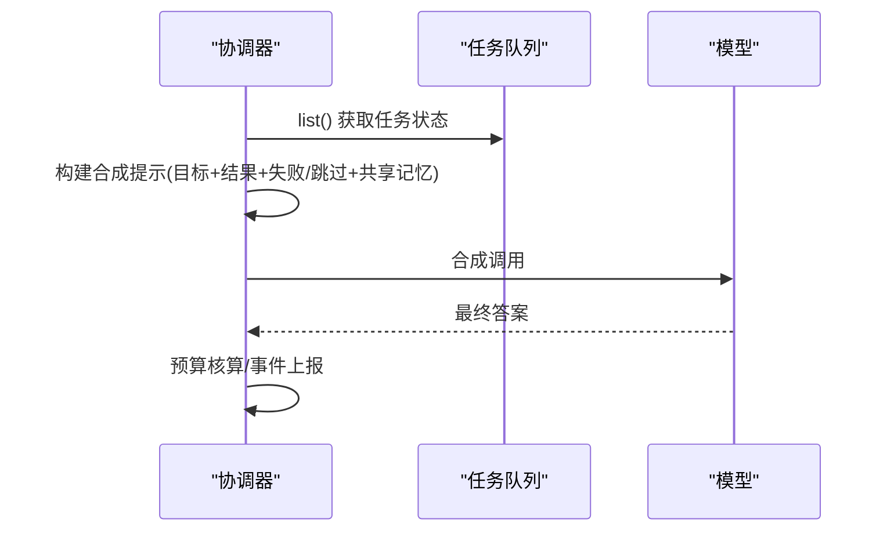
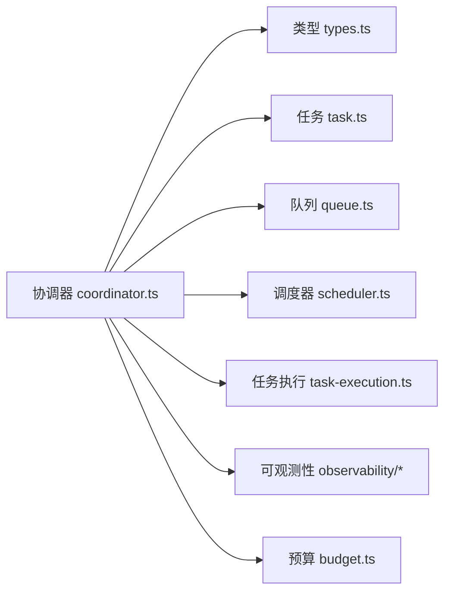

# 协调器系统

<cite>
**本文引用的文件**
- [packages/core/src/orchestrator/coordinator.ts](file://packages/core/src/orchestrator/coordinator.ts)
- [packages/core/src/types.ts](file://packages/core/src/types.ts)
- [packages/core/tests/coordinator-dependency-contract.test.ts](file://packages/core/tests/coordinator-dependency-contract.test.ts)
- [README_zh.md](file://README_zh.md)
</cite>

## 目录
1. [简介](#简介)
2. [项目结构](#项目结构)
3. [核心组件](#核心组件)
4. [架构总览](#架构总览)
5. [详细组件分析](#详细组件分析)
6. [依赖关系分析](#依赖关系分析)
7. [性能与预算控制](#性能与预算控制)
8. [故障排查指南](#故障排查指南)
9. [结论](#结论)
10. [附录：自定义示例与最佳实践](#附录自定义示例与最佳实践)

## 简介
协调器是 Open Multi-Agent（OMA）中“智能体团队”的领导者。它负责将高层目标在运行时分解为可执行的任务图（DAG），构建团队角色清单，生成结构化任务输出，验证任务依赖并检测循环依赖；在所有任务完成后，再综合各任务结果，产出面向原始目标的最终答案。协调器同时提供提示词构建机制、配置选项与校验策略，确保计划可控、可观测、可恢复。

## 项目结构
本仓库采用多包结构，协调器逻辑位于核心包的编排子系统内，类型定义集中在统一类型文件中，测试覆盖契约与行为约束。

图表来源
- [packages/core/src/orchestrator/coordinator.ts:365-486](file://packages/core/src/orchestrator/coordinator.ts#L365-L486)
- [packages/core/src/orchestrator/coordinator.ts:696-800](file://packages/core/src/orchestrator/coordinator.ts#L696-L800)
- [packages/core/src/orchestrator/coordinator.ts:546-642](file://packages/core/src/orchestrator/coordinator.ts#L546-L642)

章节来源
- [README_zh.md:46-96](file://README_zh.md#L46-L96)

## 核心组件
- 协调器提示词构建：系统提示、团队清单、输出格式、合成指导与分解提示。
- 任务规范解析与校验：Zod 严格模式 + 自定义规则，校验标题唯一性、依赖存在性与循环依赖。
- 任务装载与依赖解析：标题到 ID 映射、依赖解析、二次校验后入队。
- 合成阶段：汇总已完成/失败/跳过任务与共享记忆，生成最终答案。
- 配置与路由：协调器模型选择、工具预设、超时控制、预算限制、模型路由等。

章节来源
- [packages/core/src/orchestrator/coordinator.ts:301-486](file://packages/core/src/orchestrator/coordinator.ts#L301-L486)
- [packages/core/src/orchestrator/coordinator.ts:107-186](file://packages/core/src/orchestrator/coordinator.ts#L107-L186)
- [packages/core/src/orchestrator/coordinator.ts:696-800](file://packages/core/src/orchestrator/coordinator.ts#L696-L800)
- [packages/core/src/orchestrator/coordinator.ts:546-642](file://packages/core/src/orchestrator/coordinator.ts#L546-L642)
- [packages/core/src/types.ts:2603-2665](file://packages/core/src/types.ts#L2603-L2665)

## 架构总览
协调器在 runTeam 流程中的职责边界如下：
- 接收高层目标与团队配置。
- 构建提示词并驱动 LLM 输出结构化任务数组。
- 解析并校验任务规范（含依赖与循环）。
- 将任务注入队列，交由调度器执行。
- 所有任务完成后，运行合成阶段产出最终答案。
- 全程受预算、超时、重试、审批与可观测性钩子约束。

图表来源
- [packages/core/src/orchestrator/coordinator.ts:365-486](file://packages/core/src/orchestrator/coordinator.ts#L365-L486)
- [packages/core/src/orchestrator/coordinator.ts:696-800](file://packages/core/src/orchestrator/coordinator.ts#L696-L800)
- [packages/core/src/orchestrator/coordinator.ts:546-642](file://packages/core/src/orchestrator/coordinator.ts#L546-L642)
- [packages/core/src/types.ts:2603-2665](file://packages/core/src/types.ts#L2603-L2665)

## 详细组件分析

### 提示词构建机制
- 团队清单构建：从 AgentConfig 提取受限的角色摘要、能力标签与可用工具名，形成有界清单，避免泄露完整 systemPrompt。
- 输出格式规范：强制返回 JSON 数组，字段包括 title、description、assignee、dependsOn、requires，以及可选 verify。
- 合成指导：在任务完成后，将原始目标、任务结果、失败/跳过原因与共享记忆摘要一并输入，要求协调器给出面向目标的综合回答。
- 分解提示：将目标与团队成员名称注入，要求仅返回 JSON 数组。

图表来源
- [packages/core/src/orchestrator/coordinator.ts:337-363](file://packages/core/src/orchestrator/coordinator.ts#L337-L363)
- [packages/core/src/orchestrator/coordinator.ts:428-464](file://packages/core/src/orchestrator/coordinator.ts#L428-L464)
- [packages/core/src/orchestrator/coordinator.ts:466-486](file://packages/core/src/orchestrator/coordinator.ts#L466-L486)
- [packages/core/src/orchestrator/coordinator.ts:644-688](file://packages/core/src/orchestrator/coordinator.ts#L644-L688)

章节来源
- [packages/core/src/orchestrator/coordinator.ts:337-486](file://packages/core/src/orchestrator/coordinator.ts#L337-L486)
- [packages/core/src/orchestrator/coordinator.ts:644-688](file://packages/core/src/orchestrator/coordinator.ts#L644-L688)

### 任务规范解析与校验
- 使用 Zod 严格模式解析协调器输出的任务数组，限定字段类型与取值范围。
- 自定义校验：
  - 标题唯一性检查。
  - dependsOn 引用必须存在于任务标题集合中，且不能歧义。
  - 循环依赖检测（基于 DFS 访问栈）。
  - 当 strictAssignees 为真时，拒绝不在团队名单中的 assignee。
- 支持可选的 verify 字段，允许协调器为关键任务启用共识验证。

图表来源
- [packages/core/src/orchestrator/coordinator.ts:75-105](file://packages/core/src/orchestrator/coordinator.ts#L75-L105)
- [packages/core/src/orchestrator/coordinator.ts:107-186](file://packages/core/src/orchestrator/coordinator.ts#L107-L186)

章节来源
- [packages/core/src/orchestrator/coordinator.ts:75-186](file://packages/core/src/orchestrator/coordinator.ts#L75-L186)

### 任务装载与依赖解析
- 两阶段装载：
  1) 先创建任务以获取稳定 ID，建立“标题→ID”映射。
  2) 将 dependsOn 由标题或 ID 解析为真实 ID，保留未解析项以便后续失败标记。
- 依赖校验：调用依赖验证器，若无效则抛出包含错误码的错误。
- 入队与失败处理：校验通过后入队；若存在未解析依赖，标记该任务失败并附带原因。

图表来源
- [packages/core/src/orchestrator/coordinator.ts:696-800](file://packages/core/src/orchestrator/coordinator.ts#L696-L800)

章节来源
- [packages/core/src/orchestrator/coordinator.ts:696-800](file://packages/core/src/orchestrator/coordinator.ts#L696-L800)

### 合成阶段
- 收集已完成、失败、跳过的任务及其结果。
- 读取共享记忆摘要作为额外上下文。
- 构造合成提示，要求协调器基于原始目标与任务结果给出最终答案。
- 执行合成调用，更新累计 token 与成本，并在超预算时发出事件并标记失败。

图表来源
- [packages/core/src/orchestrator/coordinator.ts:546-642](file://packages/core/src/orchestrator/coordinator.ts#L546-L642)
- [packages/core/src/orchestrator/coordinator.ts:644-688](file://packages/core/src/orchestrator/coordinator.ts#L644-L688)

章节来源
- [packages/core/src/orchestrator/coordinator.ts:546-642](file://packages/core/src/orchestrator/coordinator.ts#L546-L642)
- [packages/core/src/orchestrator/coordinator.ts:644-688](file://packages/core/src/orchestrator/coordinator.ts#L644-L688)

### 配置选项与行为定制
- 模型选择与 Provider：
  - 协调器可继承默认 model/provider/baseURL/apiKey，也可通过 CoordinatorConfig 覆盖。
  - 支持 adapter 直接注入，忽略 provider/apiKey/baseURL。
- 工具预设与权限：
  - toolPreset 支持 readonly/readwrite/full 三种常见预设。
  - tools/disallowedTools 精确控制可用/禁用工具集。
  - onToolCall 可作为协调层门控。
- 超时与循环检测：
  - timeoutMs 控制整次协调器调用上限。
  - callTimeoutMs 控制单次模型调用上限。
  - loopDetection 用于检测卡死循环。
- 预算限制：
  - maxTokenBudget/maxCostBudget 配合 estimateCost 进行预算控制。
  - 超预算会触发 budget_exceeded 事件并标记失败。
- 模型路由：
  - 可通过 ModelRoutingPolicy 对分解与合成阶段进行确定性路由。
- 其他：
  - maxTurns/maxTokens/temperature/topP/topK/minP/frequencyPenalty/presencePenalty/extraBody 等采样参数。
  - cwd 控制文件系统工具的根目录，null 可禁用沙箱。

章节来源
- [packages/core/src/types.ts:2603-2665](file://packages/core/src/types.ts#L2603-L2665)
- [packages/core/src/orchestrator/coordinator.ts:493-536](file://packages/core/src/orchestrator/coordinator.ts#L493-L536)
- [packages/core/src/orchestrator/coordinator.ts:546-642](file://packages/core/src/orchestrator/coordinator.ts#L546-L642)

## 依赖关系分析
协调器与周边模块的耦合关系如下：
- 与类型系统强耦合：任务、团队、协调器配置、模型路由、预算、事件等类型集中定义。
- 与任务子系统协作：创建任务、依赖校验、队列装载。
- 与执行子系统协作：调度器与任务执行器负责 DAG 执行与结果回传。
- 与可观测性协作：trace、onProgress、budget 事件。

图表来源
- [packages/core/src/orchestrator/coordinator.ts:1-39](file://packages/core/src/orchestrator/coordinator.ts#L1-L39)
- [packages/core/src/types.ts:2000-2084](file://packages/core/src/types.ts#L2000-L2084)

章节来源
- [packages/core/src/orchestrator/coordinator.ts:1-39](file://packages/core/src/orchestrator/coordinator.ts#L1-L39)
- [packages/core/src/types.ts:2000-2084](file://packages/core/src/types.ts#L2000-L2084)

## 性能与预算控制
- 预算控制：
  - 在合成阶段前后均进行预算核算，超过 token 或成本预算即中止并上报。
  - 支持 estimateCost 自定义成本估算函数。
- 超时控制：
  - 协调器级 timeoutMs 与单次模型调用 callTimeoutMs 双重保护。
- 并发与负载：
  - 通过调度策略（如 dependency-first/composite）优化 DAG 执行效率。
- 提示词长度与工具数量限制：
  - 团队清单与工具列表有最大字符/条目限制，降低提示词膨胀风险。

章节来源
- [packages/core/src/orchestrator/coordinator.ts:546-642](file://packages/core/src/orchestrator/coordinator.ts#L546-L642)
- [packages/core/src/types.ts:2208-2231](file://packages/core/src/types.ts#L2208-L2231)
- [packages/core/src/types.ts:2132-2179](file://packages/core/src/types.ts#L2132-L2179)

## 故障排查指南
- 依赖解析失败：
  - 现象：任务被标记失败，原因是“未解析的依赖引用”。
  - 排查：确认 dependsOn 是否使用了正确的标题或 ID；是否存在重复标题导致歧义。
- 循环依赖：
  - 现象：加载任务时报错“循环依赖”。
  - 排查：检查任务间的依赖环，调整依赖方向或拆分任务。
- 未知负责人：
  - 现象：strictAssignees 开启时，assignee 不在团队名单会被拒绝。
  - 排查：修正 assignee 为团队中存在的 agent name。
- 预算超限：
  - 现象：合成阶段提前终止，结果标记 budgetExceeded。
  - 排查：调大预算或减少提示词/工具规模，或优化模型路由。
- 契约一致性：
  - 框架保证原样转发协调器声明的 dependsOn，不会静默丢弃或扩大依赖。

章节来源
- [packages/core/src/orchestrator/coordinator.ts:696-800](file://packages/core/src/orchestrator/coordinator.ts#L696-L800)
- [packages/core/tests/coordinator-dependency-contract.test.ts:71-155](file://packages/core/tests/coordinator-dependency-contract.test.ts#L71-L155)

## 结论
协调器是 OMA 动态编排的核心：它将模糊目标转化为明确、可执行、可验证的任务图，并通过严格的提示词构建、结构化输出与依赖校验，保障计划的可预测性与安全性。结合预算、超时、模型路由与可观测性，协调器能够在复杂环境中稳定工作，并为上层应用提供清晰的结果与审计线索。

## 附录：自定义示例与最佳实践
以下示例以“代码片段路径”形式给出，便于在仓库中定位实现位置，避免直接粘贴代码内容。

- 自定义协调器提示词
  - 覆盖系统提示与附加指令：[packages/core/src/types.ts:2612-2623](file://packages/core/src/types.ts#L2612-L2623)
  - 查看提示词拼接顺序与追加位置：[packages/core/src/orchestrator/coordinator.ts:382-412](file://packages/core/src/orchestrator/coordinator.ts#L382-L412)

- 调整任务分解策略
  - 通过 requires 指定硬需求（工具/能力/后端/Provider）：[packages/core/src/types.ts:1367-1372](file://packages/core/src/types.ts#L1367-L1372)
  - 解析协调器输出的 requires：[packages/core/src/orchestrator/coordinator.ts:265-299](file://packages/core/src/orchestrator/coordinator.ts#L265-L299)

- 优化性能配置
  - 设置协调器超时与单次调用超时：[packages/core/src/types.ts:2661-2664](file://packages/core/src/types.ts#L2661-L2664)
  - 启用循环检测：[packages/core/src/types.ts:1107-1110](file://packages/core/src/types.ts#L1107-L1110)
  - 配置预算限制与成本估算：[packages/core/src/types.ts:2208-2231](file://packages/core/src/types.ts#L2208-L2231)

- 控制工具权限
  - 使用 toolPreset 快速授权：[packages/core/src/types.ts:2647-2648](file://packages/core/src/types.ts#L2647-L2648)
  - 精确控制 tools/disallowedTools：[packages/core/src/types.ts:2649-2652](file://packages/core/src/types.ts#L2649-L2652)
  - 工具调用门控 onToolCall：[packages/core/src/types.ts:2653-2654](file://packages/core/src/types.ts#L2653-L2654)

- 验证依赖契约
  - 框架不静默丢弃或扩大 dependsOn 的契约保证（测试用例）：[packages/core/tests/coordinator-dependency-contract.test.ts:71-155](file://packages/core/tests/coordinator-dependency-contract.test.ts#L71-L155)

- 端到端参考
  - 快速开始与 runTeam 用法（中文文档）：[README_zh.md:60-96](file://README_zh.md#L60-L96)