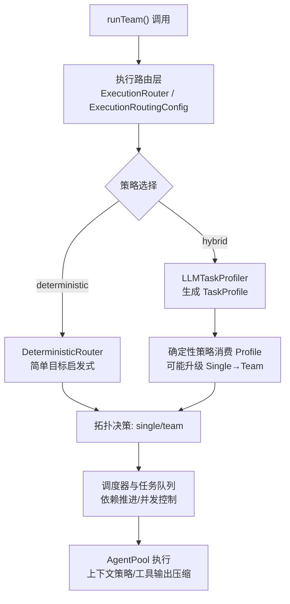
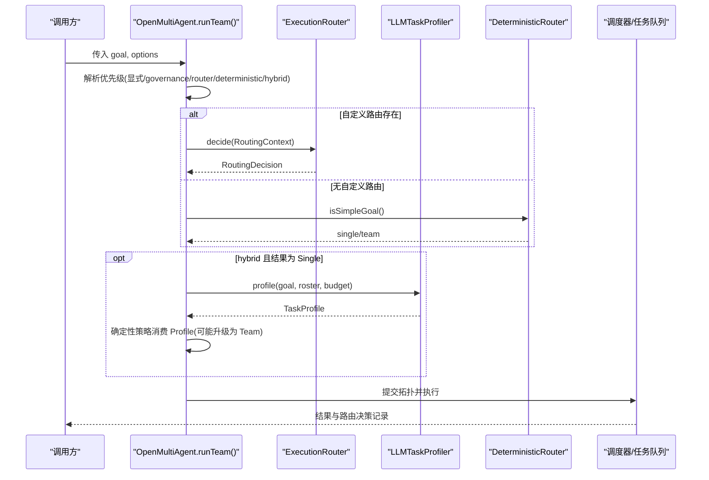
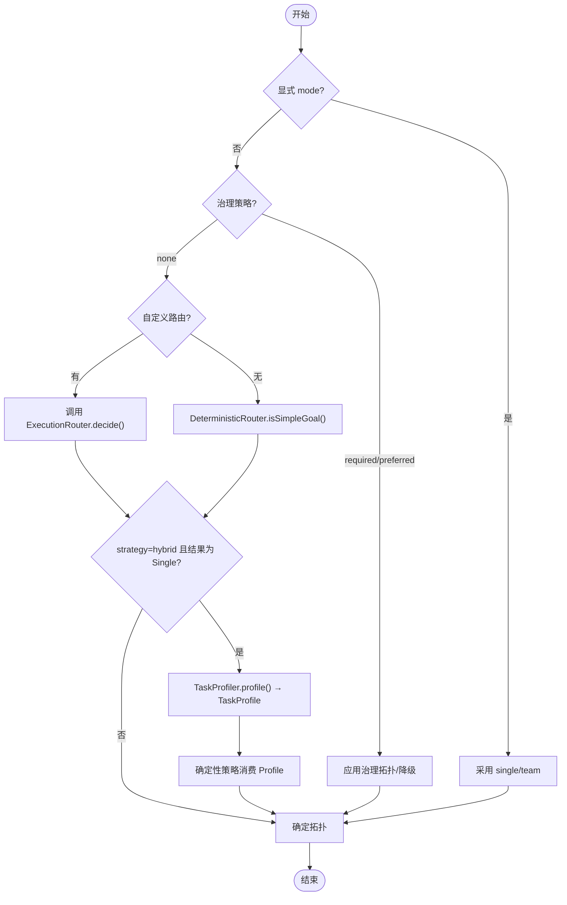
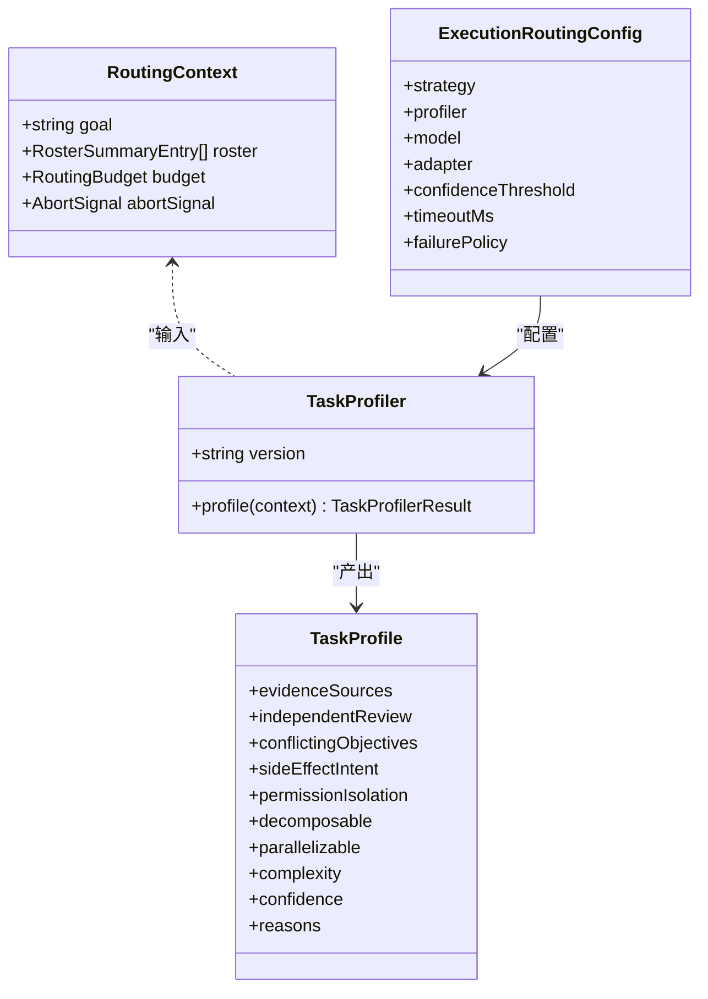
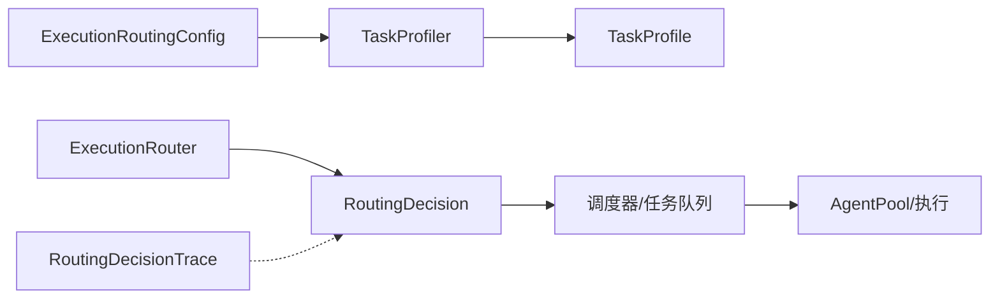

# 执行路由

<cite>
**本文引用的文件**
- [execution-routing.md](file://docs/execution-routing.md)
- [types.ts](file://packages/core/src/types.ts)
- [context-management.md](file://docs/context-management.md)
- [task-scheduling.md](file://docs/task-scheduling.md)
</cite>

## 目录
1. [简介](#简介)
2. [项目结构](#项目结构)
3. [核心组件](#核心组件)
4. [架构总览](#架构总览)
5. [详细组件分析](#详细组件分析)
6. [依赖关系分析](#依赖关系分析)
7. [性能考量](#性能考量)
8. [故障排查指南](#故障排查指南)
9. [结论](#结论)
10. [附录](#附录)

## 简介
本章节面向 Open Multi-Agent 的“执行路由”能力，系统阐述自动 runTeam() 调用如何选择执行拓扑（单代理 single 或团队 team），以及在不同策略下的决策流程、配置项与可观测性。文档覆盖：
- 执行拓扑选择机制：线性执行（single）、并行执行（team）与混合拓扑（hybrid）。
- 路由策略配置：确定性执行、负载均衡与故障转移。
- 执行上下文管理：状态跟踪、进度监控与资源隔离。
- 路由决策因素：任务依赖、资源可用性、性能指标与业务规则。
- 高级路由特性：条件路由、权重分配与动态调整。
- 代码级示例路径：如何配置不同执行策略、自定义路由逻辑、优化执行路径与处理异常。

## 项目结构
Open Multi-Agent 的执行路由由类型定义、文档说明与调度子系统共同构成：
- 类型与接口：在 core 包的 types.ts 中定义了路由上下文、决策、策略、评估与追踪事件等核心数据结构。
- 文档说明：docs/execution-routing.md 给出路由优先级、混合语义路由、内置确定性策略、治理边界与失败行为等规范。
- 调度与执行：docs/task-scheduling.md 描述事件驱动的任务队列、并发控制、依赖推进与中断/预算/检查点机制。
- 上下文管理：docs/context-management.md 提供长运行对话的上下文压缩策略与工具结果压缩，保障执行过程中的上下文预算与隔离。

图表来源
- [execution-routing.md:5-22](file://docs/execution-routing.md#L5-L22)
- [execution-routing.md:23-80](file://docs/execution-routing.md#L23-L80)
- [types.ts:1579-1670](file://packages/core/src/types.ts#L1579-L1670)
- [types.ts:1694-1728](file://packages/core/src/types.ts#L1694-L1728)
- [task-scheduling.md:1-26](file://docs/task-scheduling.md#L1-L26)

章节来源
- [execution-routing.md:5-22](file://docs/execution-routing.md#L5-L22)
- [types.ts:1579-1670](file://packages/core/src/types.ts#L1579-L1670)
- [task-scheduling.md:1-26](file://docs/task-scheduling.md#L1-L26)

## 核心组件
- 路由上下文与决策
  - RoutingContext：包含目标文本、精简角色摘要、剩余 token/成本上限与中止信号，供路由与剖析器使用。
  - RoutingDecision：返回 mode(single/team)、置信度、原因、路由器版本与可选的状态/回退码。
- 路由策略与配置
  - ExecutionRoutingStrategy：'deterministic' 或 'hybrid'。
  - ExecutionRoutingConfig：策略、剖析器、模型/适配器、置信度阈值、超时、失败策略。
- 语义剖析与评估
  - TaskProfiler/TaskProfile：从目标文本推断证据源、独立审查、冲突目标、副作用意图、权限隔离、可分解性、并行性、复杂度、置信度与理由。
  - SemanticRoutingAssessment：记录剖析版本、推荐、实际模式、结果与用量。
- 可观测性与追踪
  - ExecutionRoutingDecisionRecord/RoutingDecisionTrace：记录决策来源、模式、原因、版本、状态与语义评估。

章节来源
- [types.ts:1579-1670](file://packages/core/src/types.ts#L1579-L1670)
- [types.ts:1612-1692](file://packages/core/src/types.ts#L1612-L1692)
- [types.ts:1694-1728](file://packages/core/src/types.ts#L1694-L1728)
- [execution-routing.md:23-80](file://docs/execution-routing.md#L23-L80)

## 架构总览
执行路由在 runTeam() 时按固定优先级解析拓扑：
1) 显式 mode('single'|'team')；
2) 声明的治理拓扑或预算降级策略；
3) 每次调用或编排器的自定义 executionRouter；
4) 内置 DeterministicRouter；
5) 当 strategy='hybrid' 且默认/回退结果为 Single 时，启用语义 TaskProfiler 与确定性语义策略进行可能的升级。

图表来源
- [execution-routing.md:5-22](file://docs/execution-routing.md#L5-L22)
- [execution-routing.md:23-80](file://docs/execution-routing.md#L23-L80)
- [types.ts:1579-1670](file://packages/core/src/types.ts#L1579-L1670)
- [types.ts:1694-1728](file://packages/core/src/types.ts#L1694-L1728)

## 详细组件分析

### 执行拓扑选择与优先级
- 显式模式优先：mode='single' 走最佳代理直连路径；mode='team' 强制协调器生成团队计划。
- 治理策略优先：governanceIntent(required/preferred/none) 与 preferredUnderBudget 影响是否绕过简单目标短路。
- 自定义路由：per-run 或 orchestrator 级别的 executionRouter 决定 topology，但不得覆盖前两层。
- 内置确定性：isSimpleGoal() 启发式识别序列、协作、并行与多交付物信号，支持多语言标记与长度估计。
- 混合语义：仅当确定性结果为 Single 时，最多一次无工具 LLM 调用生成 TaskProfile，再由确定性策略决定是否升级为 Team。

图表来源
- [execution-routing.md:5-22](file://docs/execution-routing.md#L5-L22)
- [execution-routing.md:162-205](file://docs/execution-routing.md#L162-L205)
- [types.ts:1654-1670](file://packages/core/src/types.ts#L1654-L1670)

章节来源
- [execution-routing.md:5-22](file://docs/execution-routing.md#L5-L22)
- [execution-routing.md:162-205](file://docs/execution-routing.md#L162-L205)
- [types.ts:1654-1670](file://packages/core/src/types.ts#L1654-L1670)

### 混合语义路由与 TaskProfiler
- 输入：goal、精简 roster、剩余预算与中止信号。
- 输出：TaskProfile（证据源、独立审查、冲突目标、副作用意图、权限隔离、可分解性、并行性、复杂度、置信度与理由）。
- 适配器选择顺序：per-run adapter → orchestrator adapter → Coordinator adapter → 默认 provider/model。
- 费用与追踪：剖析调用计入 run 的 token/成本预算，并在 TeamRunResult.totalTokenUsage 中体现。
- 安全边界：不暴露 systemPrompt、凭据、工具实现与完整权限细节；无法调用工具。

图表来源
- [types.ts:1579-1670](file://packages/core/src/types.ts#L1579-L1670)
- [types.ts:1612-1649](file://packages/core/src/types.ts#L1612-L1649)
- [execution-routing.md:23-80](file://docs/execution-routing.md#L23-L80)

章节来源
- [execution-routing.md:23-80](file://docs/execution-routing.md#L23-L80)
- [types.ts:1579-1670](file://packages/core/src/types.ts#L1579-L1670)
- [types.ts:1612-1649](file://packages/core/src/types.ts#L1612-L1649)

### 内置确定性策略（DeterministicRouter）
- 基于 isSimpleGoal() 的轻量启发式，识别英文/中文/日文/韩文的序列与枚举标记，结合脚本感知的长度估计。
- 对非拉丁脚本保守处理，避免误判。
- 该策略保持低成本；混合路由可在高置信度下纠正误判。

章节来源
- [execution-routing.md:183-205](file://docs/execution-routing.md#L183-L205)

### 失败行为与回退
- failurePolicy='fallback'（默认）：自定义路由抛错/超时/无效决策时回退到 DeterministicRouter；剖析器失败也回退。
- failurePolicy='fail'：基础设施失败即终止，抛出对应错误并关闭追踪。
- 结果中的 routingDecision 提供 status、requestedRouterVersion、fallbackCode 等机器可读字段。

章节来源
- [execution-routing.md:120-155](file://docs/execution-routing.md#L120-L155)
- [types.ts:1588-1610](file://packages/core/src/types.ts#L1588-L1610)

### 执行上下文管理与资源隔离
- 上下文策略：sliding-window、summarize、compact、custom，用于控制长对话的上下文增长。
- 工具结果压缩：compressToolResults 将已消费的冗长工具输出替换为短标记，释放上下文空间。
- 推理块跨提供商保留：preserveReasoningAsText 将不可原生回显的推理块降级为文本，配合压缩策略保证稳定性。
- 这些机制在执行阶段与路由/调度协同工作，确保资源隔离与预算可控。

章节来源
- [context-management.md:1-114](file://docs/context-management.md#L1-L114)

### 调度与执行拓扑的关系
- 事件驱动执行：ready set 与 in-flight map 驱动任务推进；完成立即解除依赖阻塞。
- 并发与容量：AgentPool 作为并发权威；调度门限检查取消、预算、审批与池容量。
- 依赖与负载：dependency-first/composite 等策略根据下游关键性与当前负载排序；composite 通过 fit/load 权重平衡。
- 中断/预算/检查点：统一 drain-then-skip；检查点持久化安全边界，恢复时重放已提交工具结果。

章节来源
- [task-scheduling.md:1-26](file://docs/task-scheduling.md#L1-L26)
- [task-scheduling.md:98-134](file://docs/task-scheduling.md#L98-L134)
- [task-scheduling.md:166-184](file://docs/task-scheduling.md#L166-L184)

## 依赖关系分析
- 路由与调度解耦：执行路由仅决定 single/team 拓扑；模型路由在拓扑内部选择模型；调度器负责 DAG 执行与并发。
- 类型契约：RoutingContext、RoutingDecision、ExecutionRoutingConfig、TaskProfiler、SemanticRoutingAssessment 等接口形成稳定契约，便于扩展与替换。
- 可观测性：RoutingDecisionTrace 与 ExecutionRoutingDecisionRecord 贯穿路由决策全过程，便于审计与排障。

图表来源
- [types.ts:1579-1670](file://packages/core/src/types.ts#L1579-L1670)
- [types.ts:1694-1728](file://packages/core/src/types.ts#L1694-L1728)
- [execution-routing.md:5-22](file://docs/execution-routing.md#L5-L22)

章节来源
- [types.ts:1579-1670](file://packages/core/src/types.ts#L1579-L1670)
- [types.ts:1694-1728](file://packages/core/src/types.ts#L1694-L1728)
- [execution-routing.md:5-22](file://docs/execution-routing.md#L5-L22)

## 性能考量
- 确定性路由开销极低；混合路由仅在必要时进行一次无工具 LLM 调用，并通过 confidenceThreshold 控制升级门槛。
- 调度策略 composite 通过 fit/load 权重平衡匹配度与负载，减少热点与排队延迟。
- 上下文压缩与工具结果压缩降低长运行时的 token 消耗与延迟。
- 检查点与断点续跑避免重复执行已提交工具结果，提升恢复效率。

[本节为通用指导，无需特定文件引用]

## 故障排查指南
- 路由失败定位：查看 TeamRunResult.routingDecision 的 status、requestedRouterVersion、fallbackCode 与 reasons。
- 剖析器问题：若 semanticRoutingAssessment 存在 fallbackCode（如 profiler-error/profiler-timeout/invalid-profile/profiler-unavailable），检查 adapter/model 配置与超时设置。
- 调度瓶颈：观察任务依赖图与 AgentPool 并发；必要时调整 schedulingStrategy/schedulingWeights。
- 上下文溢出：启用 contextStrategy 与 compressToolResults，合理设置 maxTokens/maxTurns。
- 预算超支：在 onTaskDispatch/onApproval 中实施审批与节流；利用预算检查与 drain-then-skip 行为快速止损。

章节来源
- [execution-routing.md:120-155](file://docs/execution-routing.md#L120-L155)
- [types.ts:1588-1610](file://packages/core/src/types.ts#L1588-L1610)
- [types.ts:1675-1692](file://packages/core/src/types.ts#L1675-L1692)
- [task-scheduling.md:166-184](file://docs/task-scheduling.md#L166-L184)
- [context-management.md:1-114](file://docs/context-management.md#L1-L114)

## 结论
Open Multi-Agent 的执行路由以“确定性优先、混合增强”为核心思想：在低成本确定性策略基础上，按需引入语义剖析进行谨慎升级，既保证稳定性又兼顾复杂任务的并行与分解需求。通过清晰的优先级、可插拔的路由器与剖析器、完善的失败回退与可观测性，以及调度与上下文管理的协同，系统能够在多样化业务场景下提供可靠、高效且可审计的执行拓扑选择能力。

[本节为总结性内容，无需特定文件引用]

## 附录

### 配置与示例路径（不直接展示代码）
- 启用混合语义路由：参考 execution-routing.md 中关于 strategy='hybrid'、confidenceThreshold、failurePolicy 的配置段落。
- 自定义路由：参考 types.ts 中 ExecutionRouter 接口与 RoutingContext/RoutingDecision 的定义，实现 decide() 并注入 per-run 或 orchestrator 级别。
- 确定性策略：参考 execution-routing.md 中内置 isSimpleGoal() 的行为说明与多语言标记识别。
- 调度与权重：参考 task-scheduling.md 中 schedulingStrategy 与 schedulingWeights 的使用方式。
- 上下文压缩：参考 context-management.md 中 contextStrategy 与 compressToolResults 的配置。

章节来源
- [execution-routing.md:23-80](file://docs/execution-routing.md#L23-L80)
- [execution-routing.md:162-205](file://docs/execution-routing.md#L162-L205)
- [types.ts:1579-1670](file://packages/core/src/types.ts#L1579-L1670)
- [task-scheduling.md:98-134](file://docs/task-scheduling.md#L98-L134)
- [context-management.md:1-114](file://docs/context-management.md#L1-L114)