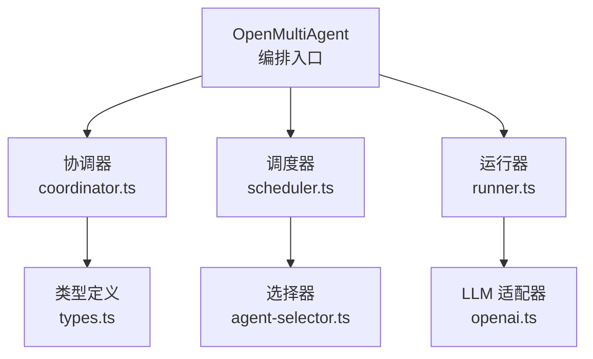
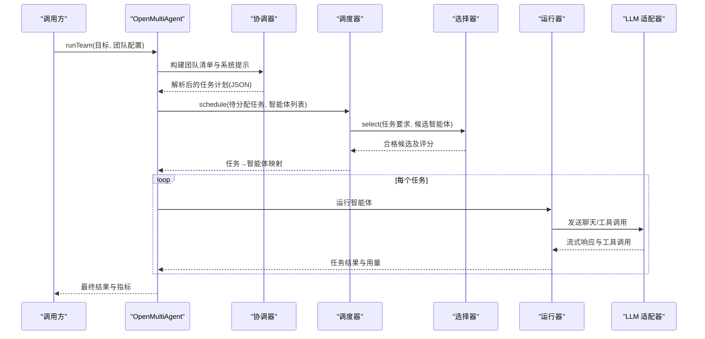
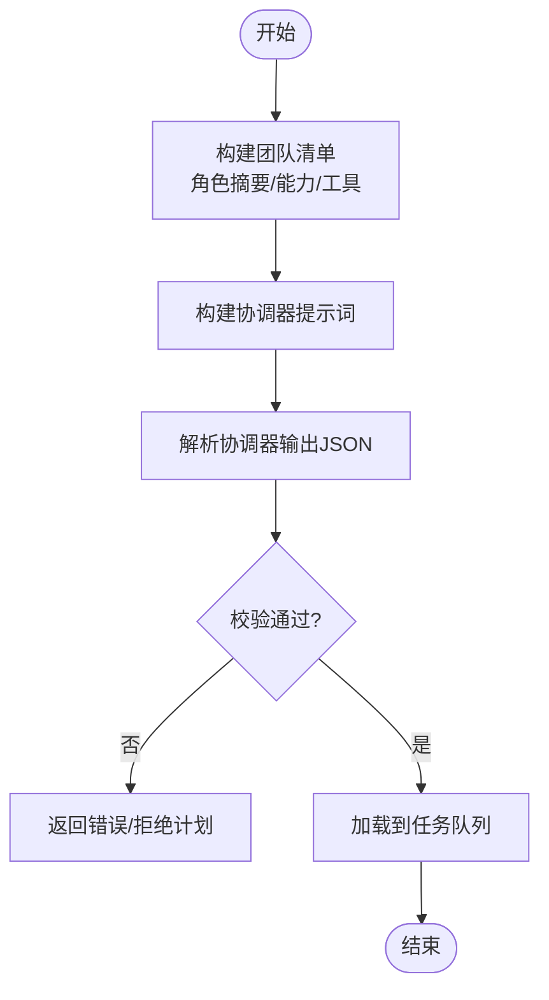
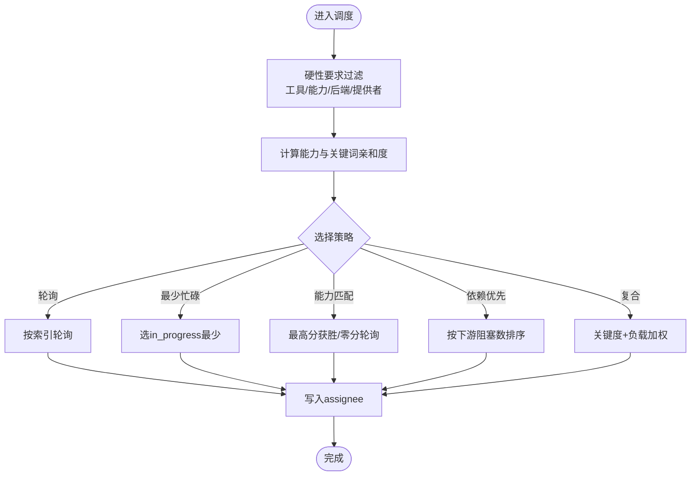
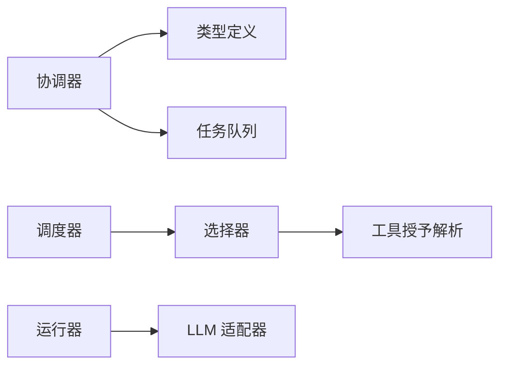

# 智能体分配

<cite>
**本文引用的文件**
- [orchestrator.ts](file://packages/core/src/orchestrator/orchestrator.ts)
- [scheduler.ts](file://packages/core/src/orchestrator/scheduler.ts)
- [agent-selector.ts](file://packages/core/src/orchestrator/agent-selector.ts)
- [coordinator.ts](file://packages/core/src/orchestrator/coordinator.ts)
- [types.ts](file://packages/core/src/types.ts)
- [runner.ts](file://packages/core/src/agent/runner.ts)
- [openai.ts](file://packages/core/src/llm/openai.ts)
</cite>

## 目录
1. [简介](#简介)
2. [项目结构](#项目结构)
3. [核心组件](#核心组件)
4. [架构总览](#架构总览)
5. [详细组件分析](#详细组件分析)
6. [依赖关系分析](#依赖关系分析)
7. [性能考虑](#性能考虑)
8. [故障排查指南](#故障排查指南)
9. [结论](#结论)
10. [附录：配置与示例路径](#附录：配置与示例路径)

## 简介
本文件系统性说明 Open Multi-Agent 的智能体自动分配机制。重点包括：协调器如何根据任务要求与智能体能力进行匹配；团队清单的构建过程（角色摘要、能力声明、工具列表）；分配决策算法（基于能力的优先匹配、工具需求满足、成本效益分析）；分配约束条件（严格分配模式、必需工具与后端要求）；以及分配验证机制（无效分配者检测与回退策略）。文末提供可操作的配置与自定义规则路径，便于在工程中落地。

## 项目结构
Open Multi-Agent 的核心编排位于 packages/core/src 下，与智能体分配直接相关的子系统如下：
- 协调器：负责目标分解、生成任务计划、构建团队清单并输出结构化任务。
- 调度器：将待执行任务映射到可用智能体，支持多种策略。
- 选择器：对任务硬性要求进行过滤，并对候选智能体打分排序。
- 类型定义：集中描述 OrchestratorConfig、AgentConfig、TaskRequirements、RosterSummaryEntry 等关键类型。
- 运行器：封装单智能体执行循环、工具调用与预算控制。
- LLM 适配器：将统一请求转换为具体模型调用（如 OpenAI），并处理工具调用流式结果。

图表来源
- [orchestrator.ts:1-120](file://packages/core/src/orchestrator/orchestrator.ts#L1-L120)
- [scheduler.ts:1-60](file://packages/core/src/orchestrator/scheduler.ts#L1-L60)
- [agent-selector.ts:1-40](file://packages/core/src/orchestrator/agent-selector.ts#L1-L40)
- [coordinator.ts:1-40](file://packages/core/src/orchestrator/coordinator.ts#L1-L40)
- [types.ts:2131-2236](file://packages/core/src/types.ts#L2131-L2236)
- [runner.ts:244-275](file://packages/core/src/agent/runner.ts#L244-L275)
- [openai.ts:223-264](file://packages/core/src/llm/openai.ts#L223-L264)

章节来源
- [orchestrator.ts:1-120](file://packages/core/src/orchestrator/orchestrator.ts#L1-L120)
- [types.ts:2131-2236](file://packages/core/src/types.ts#L2131-L2236)

## 核心组件
- 协调器（coordinator.ts）
  - 构建团队清单（包含角色摘要、能力标签、工具名称列表），限制长度与字段，避免泄露完整系统提示。
  - 解析协调器输出的任务 JSON，校验标题唯一性、依赖无环、引用有效性。
  - 将任务规范加载到队列，并解析可选的共识验证参数。
- 调度器（scheduler.ts）
  - 实现五种策略：轮询、最少忙碌、能力匹配、依赖优先、复合策略。
  - 所有策略均先硬过滤显式任务要求，再进行排序或选择。
  - 支持“按就绪任务”的单次分配与批量分配。
- 选择器（agent-selector.ts）
  - 基于已解析的工具授予、后端类型、提供者与显式能力标签进行硬性筛选。
  - 使用能力亲和度与关键词亲和度计算分数，稳定排序（分数相同按名称升序）。
  - 提供前置验证：未分配任务必须至少有一个合格候选；显式指定分配者的任务仅检查该智能体是否满足要求。
- 类型定义（types.ts）
  - OrchestratorConfig：调度策略、权重、严格分配模式、默认工具预设、成本估算函数、预算上限等。
  - TaskRequirements：必需工具、必需能力、必需后端、必需提供者。
  - RosterSummaryEntry：面向协调器的最小化团队摘要（不含系统提示）。
- 运行器（runner.ts）
  - 聚合消息、工具调用、令牌用量、循环检测、预算超界等运行期状态。
- LLM 适配器（openai.ts）
  - 将统一选项转为模型请求，处理并行工具调用、推理努力、流式累积与用量统计。

章节来源
- [coordinator.ts:107-186](file://packages/core/src/orchestrator/coordinator.ts#L107-L186)
- [scheduler.ts:18-63](file://packages/core/src/orchestrator/scheduler.ts#L18-L63)
- [agent-selector.ts:95-223](file://packages/core/src/orchestrator/agent-selector.ts#L95-L223)
- [types.ts:1360-1372](file://packages/core/src/types.ts#L1360-L1372)
- [types.ts:1551-1571](file://packages/core/src/types.ts#L1551-L1571)
- [types.ts:2131-2236](file://packages/core/src/types.ts#L2131-L2236)
- [runner.ts:244-275](file://packages/core/src/agent/runner.ts#L244-L275)
- [openai.ts:223-264](file://packages/core/src/llm/openai.ts#L223-L264)

## 架构总览
下图展示从目标到任务分配的端到端流程：协调器生成任务计划，调度器依据策略与硬性要求选择智能体，运行器驱动执行并汇总结果。

图表来源
- [orchestrator.ts:345-446](file://packages/core/src/orchestrator/orchestrator.ts#L345-L446)
- [coordinator.ts:336-380](file://packages/core/src/orchestrator/coordinator.ts#L336-L380)
- [scheduler.ts:191-214](file://packages/core/src/orchestrator/scheduler.ts#L191-L214)
- [agent-selector.ts:95-223](file://packages/core/src/orchestrator/agent-selector.ts#L95-L223)
- [runner.ts:244-275](file://packages/core/src/agent/runner.ts#L244-L275)
- [openai.ts:223-264](file://packages/core/src/llm/openai.ts#L223-L264)

## 详细组件分析

### 协调器与团队清单构建
- 团队清单构建
  - 为每个智能体生成受限的清单条目：名称、模型、角色摘要（来自 description 或 systemPrompt 首行，截断至固定长度）、能力标签（截断至最大数量）、工具名称列表（截断至最大数量）。
  - 不暴露完整系统提示，避免信息泄露。
- 输出格式与依赖指导
  - 明确任务 JSON 字段：title、description、assignee、dependsOn、requires、verify（可选）。
  - 指导协调器优先依据 roleSummary 与 capabilities 建立依赖，避免不必要的父任务。
- 任务规范解析与校验
  - 校验标题唯一性、依赖引用存在且唯一、无环。
  - 解析 requires 中的 requiredTools、requiredCapabilities、requiredBackend、requiredProvider。
  - 将任务加载到队列，并在依赖解析失败时标记失败。

图表来源
- [coordinator.ts:336-380](file://packages/core/src/orchestrator/coordinator.ts#L336-L380)
- [coordinator.ts:107-186](file://packages/core/src/orchestrator/coordinator.ts#L107-L186)
- [coordinator.ts:696-800](file://packages/core/src/orchestrator/coordinator.ts#L696-L800)

章节来源
- [coordinator.ts:336-380](file://packages/core/src/orchestrator/coordinator.ts#L336-L380)
- [coordinator.ts:107-186](file://packages/core/src/orchestrator/coordinator.ts#L107-L186)
- [coordinator.ts:696-800](file://packages/core/src/orchestrator/coordinator.ts#L696-L800)

### 分配决策算法
- 硬性要求过滤
  - 必需工具：基于已解析的工具授予集合判断。
  - 必需能力：基于 AgentConfig.capabilities。
  - 必需后端/提供者：基于 backend.kind 或 provider（外部后端/自定义适配器场景下 provider 可能为空）。
- 评分与排序
  - 能力亲和度：比较任务文本与智能体能力声明的关键词匹配。
  - 关键词亲和度：比较任务与智能体（名称+系统提示+模型）的关键词匹配。
  - 总分 = 能力亲和度 + 归一化的关键词亲和度；同分按名称升序。
- 策略实现
  - 轮询：按索引均匀分布。
  - 最少忙碌：选择当前 in_progress 最少的智能体。
  - 能力匹配：使用选择器评分，最高正分获胜；零分时使用轮询游标。
  - 依赖优先：按下游阻塞任务数降序，再轮询选择。
  - 复合：按依赖关键度排序，结合 fitWeight*score + loadWeight*(1-normalizedLoad)。

图表来源
- [scheduler.ts:191-214](file://packages/core/src/orchestrator/scheduler.ts#L191-L214)
- [scheduler.ts:305-317](file://packages/core/src/orchestrator/scheduler.ts#L305-L317)
- [scheduler.ts:326-363](file://packages/core/src/orchestrator/scheduler.ts#L326-L363)
- [scheduler.ts:374-413](file://packages/core/src/orchestrator/scheduler.ts#L374-L413)
- [scheduler.ts:423-450](file://packages/core/src/orchestrator/scheduler.ts#L423-L450)
- [scheduler.ts:463-508](file://packages/core/src/orchestrator/scheduler.ts#L463-L508)
- [agent-selector.ts:95-223](file://packages/core/src/orchestrator/agent-selector.ts#L95-L223)

章节来源
- [scheduler.ts:191-214](file://packages/core/src/orchestrator/scheduler.ts#L191-L214)
- [agent-selector.ts:95-223](file://packages/core/src/orchestrator/agent-selector.ts#L95-L223)

### 分配约束条件
- 严格分配模式
  - strictAssignees=true 时，协调器指定的 assignee 必须在团队名单中，否则拒绝计划。
- 必需工具与后端要求
  - 通过 TaskRequirements.requiredTools、requiredCapabilities、requiredBackend、requiredProvider 表达。
  - 选择器会基于已解析的工具授予、后端类型与提供者进行硬性过滤。
- 成本优化
  - 可通过 estimateCost 将增量令牌用量转换为成本单位，配合 maxCostBudget 进行成本上限控制。
  - 合成阶段也会检查预算并触发预算超界事件。

章节来源
- [types.ts:2131-2236](file://packages/core/src/types.ts#L2131-L2236)
- [types.ts:1360-1372](file://packages/core/src/types.ts#L1360-L1372)
- [coordinator.ts:546-642](file://packages/core/src/orchestrator/coordinator.ts#L546-L642)

### 分配验证机制与回退策略
- 无效分配者检测
  - findInvalidAssignees：识别协调器输出中不在团队名单的 assignee。
  - 严格模式下，Zod 校验会在计划阶段直接报错。
- 前置需求验证
  - validateTaskRequirements：对所有未完成任务进行硬性要求校验；显式指定分配者的任务仅检查该智能体是否满足要求。
- 回退策略
  - 能力匹配策略在零分时使用共享轮询游标作为回退。
  - 语义路由若失败，可按 failurePolicy 回退到确定性路由或抛出错误。
  - 调度器在没有任何候选时抛出 NO_ELIGIBLE_AGENT 错误，便于上层捕获并降级。

章节来源
- [coordinator.ts:188-203](file://packages/core/src/orchestrator/coordinator.ts#L188-L203)
- [coordinator.ts:107-186](file://packages/core/src/orchestrator/coordinator.ts#L107-L186)
- [agent-selector.ts:236-299](file://packages/core/src/orchestrator/agent-selector.ts#L236-L299)
- [scheduler.ts:546-557](file://packages/core/src/orchestrator/scheduler.ts#L546-L557)
- [orchestrator.ts:546-718](file://packages/core/src/orchestrator/orchestrator.ts#L546-L718)

### 工具可用性与权限
- 工具授予与预设
  - 内置工具默认拒绝，需通过 AgentConfig.tools、toolPreset 或 OrchestratorConfig.defaultToolPreset 授予。
  - 协调器清单中包含每个智能体的工具名称列表（截断），用于辅助分配。
- 每调用门控
  - onToolCall 在输入校验后、执行前运行，可允许、拒绝或挂起调用。
- 沙箱与路径
  - 文件系统工具受 cwd 沙箱限制；bash 不受同等边界限制。

章节来源
- [types.ts:2232-2252](file://packages/core/src/types.ts#L2232-L2252)
- [coordinator.ts:336-380](file://packages/core/src/orchestrator/coordinator.ts#L336-L380)
- [AGENTS.md:72-83](file://AGENTS.md#L72-L83)

### 成本与预算控制
- 令牌与成本预算
  - maxTokenBudget：累计令牌上限。
  - maxCostBudget：结合 estimateCost 的成本上限。
- 预算检查点
  - 在合成阶段与任务执行边界进行检查，超界时设置 budgetExceeded 并记录事件。

章节来源
- [types.ts:2192-2213](file://packages/core/src/types.ts#L2192-L2213)
- [coordinator.ts:546-642](file://packages/core/src/orchestrator/coordinator.ts#L546-L642)

## 依赖关系分析
- 组件耦合
  - 协调器依赖类型定义与任务队列，产出结构化任务。
  - 调度器依赖选择器与任务快照，输出分配映射。
  - 选择器依赖工具授予解析与关键词匹配，输出合格候选与理由。
  - 运行器依赖 LLM 适配器，聚合工具调用与用量。
- 外部依赖
  - LLM 适配器将统一请求映射到具体模型（如 OpenAI），处理工具调用与流式响应。

图表来源
- [coordinator.ts:107-186](file://packages/core/src/orchestrator/coordinator.ts#L107-L186)
- [scheduler.ts:191-214](file://packages/core/src/orchestrator/scheduler.ts#L191-L214)
- [agent-selector.ts:95-223](file://packages/core/src/orchestrator/agent-selector.ts#L95-L223)
- [openai.ts:223-264](file://packages/core/src/llm/openai.ts#L223-L264)

章节来源
- [orchestrator.ts:345-446](file://packages/core/src/orchestrator/orchestrator.ts#L345-L446)
- [scheduler.ts:191-214](file://packages/core/src/orchestrator/scheduler.ts#L191-L214)
- [agent-selector.ts:95-223](file://packages/core/src/orchestrator/agent-selector.ts#L95-L223)
- [openai.ts:223-264](file://packages/core/src/llm/openai.ts#L223-L264)

## 性能考虑
- 并发与负载均衡
  - 依赖优先策略优先释放关键路径，减少整体等待时间。
  - 最少忙碌与复合策略考虑当前负载，避免热点智能体。
- 工具调用开销
  - 并行工具调用可降低延迟，但需评估模型侧并发限制与成本。
- 预算与超时
  - 合理设置 maxTokenBudget/maxCostBudget 与 callTimeoutMs，防止长尾任务拖垮整体吞吐。

[本节为通用指导，无需特定文件来源]

## 故障排查指南
- 无法分配智能体
  - 检查 TaskRequirements 是否过于严格（必需工具/能力/后端/提供者）。
  - 确认工具授予是否正确（tools/toolPreset/defaultToolPreset）。
  - 查看选择器返回的原因列表，定位缺失项。
- 协调器计划被拒绝
  - 严格模式下，确认 assignee 存在于团队名单。
  - 检查 dependsOn 引用是否存在且唯一，避免循环依赖。
- 预算超界
  - 检查 estimateCost 实现与 maxCostBudget 设置。
  - 关注 agent_complete 事件中的 budgetExceeded 标志。
- 工具调用被拒绝
  - 检查 onToolCall 门控逻辑与 disallowedTools 黑名单。
  - 确认工具是否在授予列表中。

章节来源
- [agent-selector.ts:236-299](file://packages/core/src/orchestrator/agent-selector.ts#L236-L299)
- [coordinator.ts:107-186](file://packages/core/src/orchestrator/coordinator.ts#L107-L186)
- [coordinator.ts:546-642](file://packages/core/src/orchestrator/coordinator.ts#L546-L642)
- [types.ts:2232-2252](file://packages/core/src/types.ts#L2232-L2252)

## 结论
Open Multi-Agent 的分配机制以“硬性要求优先、能力匹配为辅、负载与关键度协同”为核心原则。协调器提供受限的团队清单与结构化任务，调度器在多种策略下做出可解释的分配决策，选择器确保工具、能力、后端与提供者的硬性约束得到满足。通过预算与成本估算，系统可在保证质量的同时控制资源消耗。严格分配模式与前置验证提升了可靠性，而回退策略与门控机制增强了鲁棒性。

[本节为总结，无需特定文件来源]

## 附录：配置与示例路径
- 配置智能体能力与工具
  - 在 AgentConfig 中声明 capabilities、model、tools/toolPreset/disallowedTools。
  - 在 OrchestratorConfig 中设置 defaultToolPreset、defaultModel、defaultProvider。
  - 参考路径：[types.ts:906-935](file://packages/core/src/types.ts#L906-L935)、[types.ts:2232-2252](file://packages/core/src/types.ts#L2232-L2252)
- 设置任务硬性要求
  - 在任务 requires 中声明 requiredTools、requiredCapabilities、requiredBackend、requiredProvider。
  - 参考路径：[types.ts:1360-1372](file://packages/core/src/types.ts#L1360-L1372)
- 选择调度策略与权重
  - 设置 schedulingStrategy 与 schedulingWeights（composite 策略适用）。
  - 参考路径：[types.ts:2131-2236](file://packages/core/src/types.ts#L2131-L2236)、[scheduler.ts:51-63](file://packages/core/src/orchestrator/scheduler.ts#L51-L63)
- 启用严格分配模式
  - 设置 strictAssignees=true 以拒绝未知 assignee。
  - 参考路径：[types.ts:2162-2169](file://packages/core/src/types.ts#L2162-L2169)
- 成本估算与预算
  - 实现 estimateCost，并设置 maxCostBudget；或在运行中设置 maxTokenBudget。
  - 参考路径：[types.ts:2192-2213](file://packages/core/src/types.ts#L2192-L2213)
- 自定义分配规则
  - 通过 AgentSelectorContext.resolveCandidate 对候选智能体进行运行时增强（如模型路由）。
  - 参考路径：[orchestrator.ts:468-491](file://packages/core/src/orchestrator/orchestrator.ts#L468-L491)
- 工具权限与安全
  - 使用 toolPreset/tools/disallowedTools 精细控制；必要时配置 onToolCall 门控。
  - 参考路径：[types.ts:2232-2252](file://packages/core/src/types.ts#L2232-L2252)、[AGENTS.md:72-83](file://AGENTS.md#L72-L83)