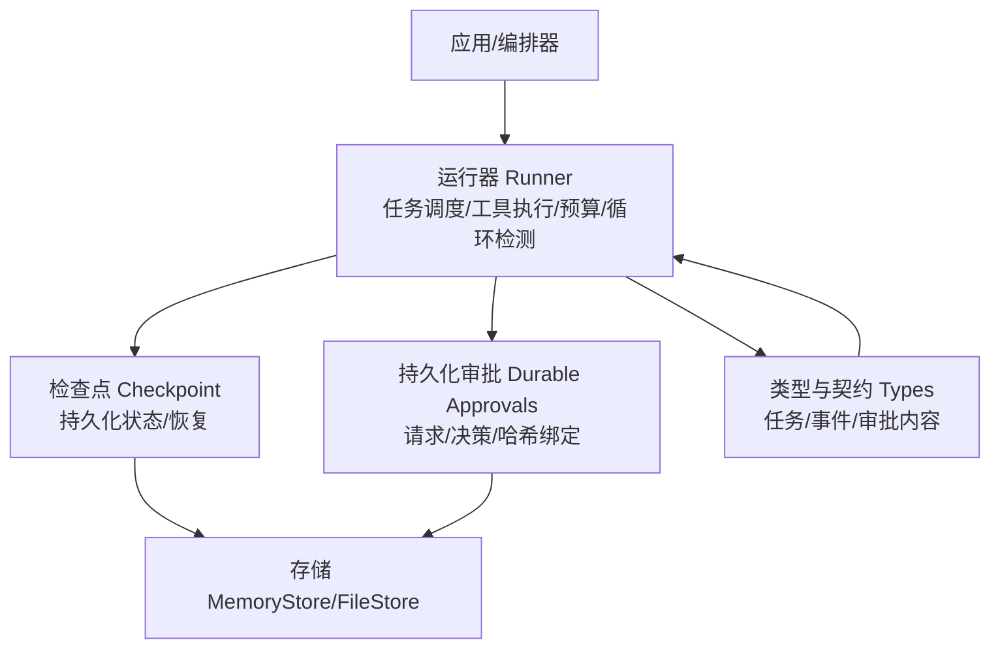
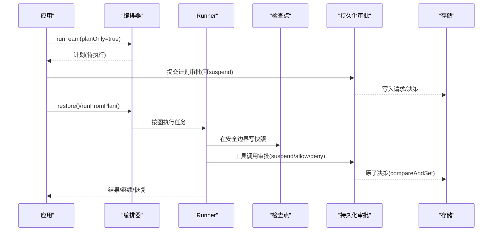
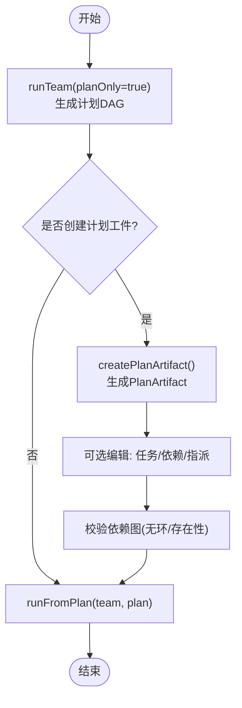
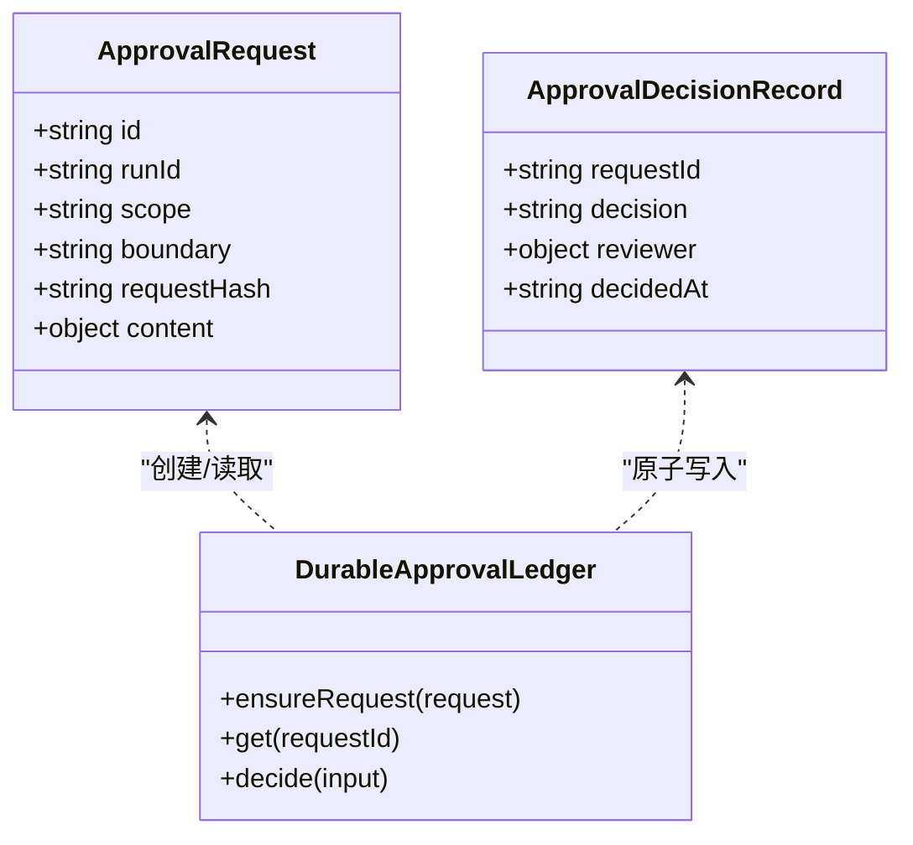
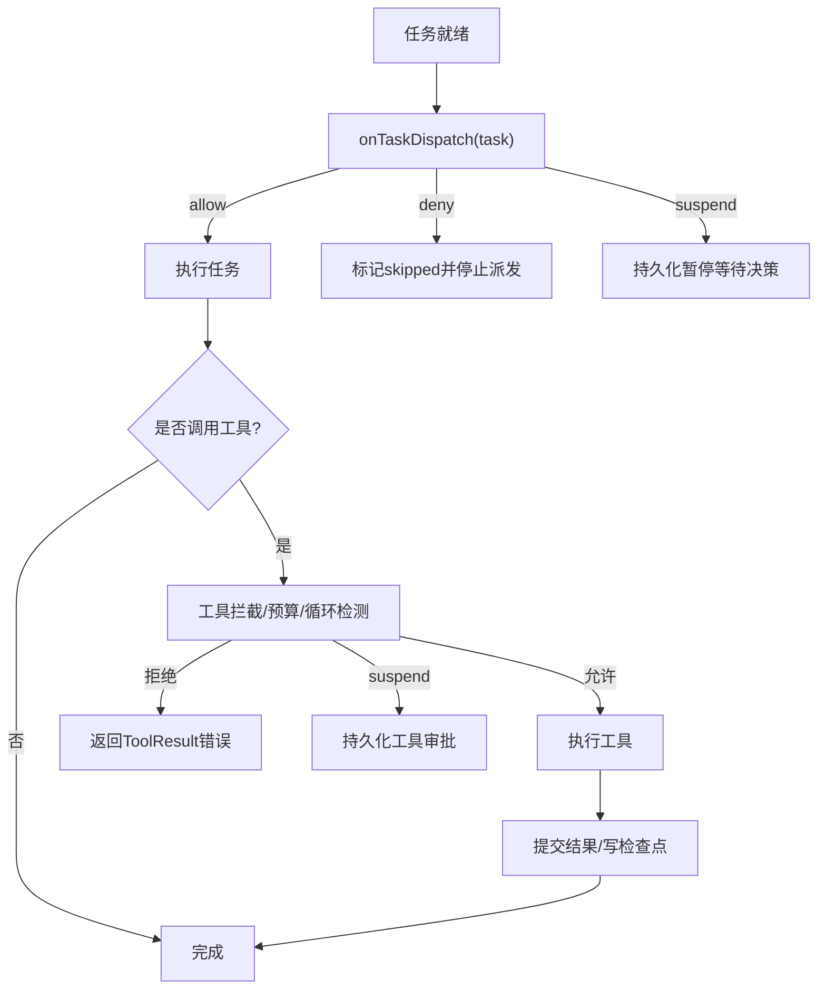
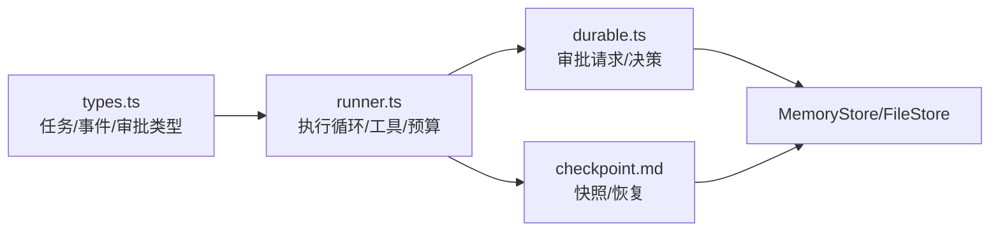

# 受控执行

<cite>
**本文引用的文件**
- [plan-replay.md](file://docs/plan-replay.md)
- [durable-approvals.md](file://docs/durable-approvals.md)
- [checkpoint.md](file://docs/checkpoint.md)
- [runner.ts](file://packages/core/src/agent/runner.ts)
- [types.ts](file://packages/core/src/types.ts)
- [durable.ts](file://packages/core/src/approval/durable.ts)
- [README.md](file://README.md)
</cite>

## 目录
1. [简介](#简介)
2. [项目结构](#项目结构)
3. [核心组件](#核心组件)
4. [架构总览](#架构总览)
5. [详细组件分析](#详细组件分析)
6. [依赖关系分析](#依赖关系分析)
7. [性能考量](#性能考量)
8. [故障排查指南](#故障排查指南)
9. [结论](#结论)
10. [附录：生产使用示例与配置要点](#附录生产使用示例与配置要点)

## 简介
本文件系统性阐述 Open Multi-Agent（OMA）的“受控执行”能力，覆盖以下关键主题：
- 计划预览、变更检测与风险评估
- 持久化暂停与多级审批、条件触发
- 冻结计划、版本管理与回放控制
- 任务级暂停、工具调用拦截与资源限制
- 在生产环境中实现安全智能体执行的实践建议

OMA 将动态编排与可审计、可恢复、可回放的执行路径结合，使多智能体系统从原型走向生产。

## 项目结构
围绕受控执行的核心由三类文档与代码组成：
- 文档层：计划回放、持久化审批、检查点与恢复
- 运行时层：Runner 负责 LLM 循环、工具执行、预算与循环检测
- 类型与审批层：统一的数据契约与原子化审批账本

图表来源
- [runner.ts:902-1069](file://packages/core/src/agent/runner.ts#L902-L1069)
- [checkpoint.md:1-10](file://docs/checkpoint.md#L1-L10)
- [durable-approvals.md:1-28](file://docs/durable-approvals.md#L1-L28)
- [types.ts:2282-2335](file://packages/core/src/types.ts#L2282-L2335)

章节来源
- [README.md:46-107](file://README.md#L46-L107)
- [checkpoint.md:1-10](file://docs/checkpoint.md#L1-L10)
- [durable-approvals.md:1-28](file://docs/durable-approvals.md#L1-L28)

## 核心组件
- 计划预览与回放：通过 planOnly 生成可冻结的计划工件，后续按图重放，不重复调用协调器。
- 持久化审批：在计划、轮次、任务派发、工具调用四个边界支持 suspend/allow/deny；以 requestHash 绑定审查内容，支持跨进程恢复。
- 检查点与恢复：在安全边界写入快照，崩溃或重启后可恢复；内置中间任务工具恢复与 token/turn 计数延续。
- 执行控制点：任务级暂停、工具调用拦截（默认拒绝+白名单）、资源限制（token/cost 预算、超时、循环检测）。

章节来源
- [plan-replay.md:7-63](file://docs/plan-replay.md#L7-L63)
- [durable-approvals.md:16-28](file://docs/durable-approvals.md#L16-L28)
- [checkpoint.md:11-107](file://docs/checkpoint.md#L11-L107)
- [runner.ts:902-1069](file://packages/core/src/agent/runner.ts#L902-L1069)
- [types.ts:2282-2335](file://packages/core/src/types.ts#L2282-L2335)

## 架构总览
下图展示一次带审批与检查点的典型执行流：协调器生成计划 → 计划审批 → 任务派发审批 → 工具调用审批 → 检查点持久化 → 恢复继续。

图表来源
- [plan-replay.md:7-63](file://docs/plan-replay.md#L7-L63)
- [durable-approvals.md:30-87](file://docs/durable-approvals.md#L30-L87)
- [checkpoint.md:74-107](file://docs/checkpoint.md#L74-L107)
- [durable.ts:414-579](file://packages/core/src/approval/durable.ts#L414-L579)
- [runner.ts:990-1069](file://packages/core/src/agent/runner.ts#L990-L1069)

## 详细组件分析

### 计划预览、变更检测与风险评估
- 计划预览：通过 planOnly 让协调器仅分解目标为任务 DAG，不执行任何任务，返回可审阅的计划。
- 冻结计划：将预览结果转为 PlanArtifact（纯 JSON），可 diff、提交版本、跨进程传递。
- 编辑与校验：可在回放前编辑任务指派、描述、依赖等；回放前会校验依赖图，避免环或不存在的 id。
- 回放控制：runFromPlan 复用 runTasks 的执行路径，按依赖顺序并行执行独立任务；不再生成协调器最终答案。
- 版本管理：PlanArtifact 含 version 字段，不支持的版本直接报错；只保存影响图与执行行为的字段。

图表来源
- [plan-replay.md:7-63](file://docs/plan-replay.md#L7-L63)
- [plan-replay.md:64-93](file://docs/plan-replay.md#L64-L93)

章节来源
- [plan-replay.md:7-63](file://docs/plan-replay.md#L7-L63)
- [plan-replay.md:64-93](file://docs/plan-replay.md#L64-L93)

### 持久化暂停与多级审批、条件触发
- 支持的边界：计划、任务轮次、任务派发、工具调用。每个边界都可返回 allow/deny/suspend。
- 精确内容绑定：每个请求有确定 ID 与 SHA-256 的 requestHash，绑定序列化后的审查内容；恢复时重新计算并比对，防止篡改。
- 原子决策：通过 compareAndSet 保证“先决者胜”，并发冲突返回明确错误码。
- 条件触发：应用可在 onPlanReady/onApproval/onTaskDispatch/onToolCall 中根据优先级、角色、工具名、输入模式等策略决定是否挂起。
- 恢复语义：拒绝计划/轮次/派发产生终止性拒绝；拒绝工具调用返回 ToolResult 错误；批准工具调用后记录结果再继续。

图表来源
- [durable.ts:147-196](file://packages/core/src/approval/durable.ts#L147-L196)
- [durable.ts:414-579](file://packages/core/src/approval/durable.ts#L414-L579)
- [durable-approvals.md:94-123](file://docs/durable-approvals.md#L94-L123)

章节来源
- [durable-approvals.md:16-28](file://docs/durable-approvals.md#L16-L28)
- [durable-approvals.md:30-87](file://docs/durable-approvals.md#L30-L87)
- [durable-approvals.md:94-123](file://docs/durable-approvals.md#L94-L123)
- [durable.ts:414-579](file://packages/core/src/approval/durable.ts#L414-L579)
- [types.ts:2282-2335](file://packages/core/src/types.ts#L2282-L2335)

### 计划重放：冻结计划、版本管理与回放控制
- 冻结：仅接受 plan-only 结果，确保任务图稳定且可重现。
- 版本：artifact.version 由框架维护；不支持版本直接抛错。
- 回放：runFromPlan 严格复用 runTasks 的执行路径，跳过协调器综合步骤，返回逐任务输出。
- 限制：不冻结模型输出；回放不会合成最终答案；简单目标的 planOnly 行为可能与正常 runTeam 不同。

章节来源
- [plan-replay.md:28-63](file://docs/plan-replay.md#L28-L63)
- [plan-replay.md:64-93](file://docs/plan-replay.md#L64-L93)

### 执行控制点：任务级暂停、工具调用拦截与资源限制
- 任务级暂停：onTaskDispatch 可在派发前对单个任务进行 allow/deny/suspend；拒绝则剩余任务标记为 skipped。
- 工具调用拦截：
  - 默认拒绝：未显式授予的工具不会被执行。
  - 白名单/预设：toolPreset、allowedTools、disallowedTools 组合决定可用工具集。
  - 回调拦截：onToolCall 可观察/阻断；结合持久化审批可实现跨进程审批。
- 资源限制：
  - Token/Cost 预算：orchestrator 与 per-call 均可设置上限，到达阈值触发预算超限事件。
  - 超时：callTimeoutMs 针对单次模型调用；abortSignal 用于整体取消。
  - 循环检测：自动检测重复工具调用/文本，支持 warn/inject/terminate 策略。
  - 工作目录沙箱：cwd 控制文件系统工具访问范围，null 表示禁用沙箱。

图表来源
- [runner.ts:902-1069](file://packages/core/src/agent/runner.ts#L902-L1069)
- [runner.ts:1364-1429](file://packages/core/src/agent/runner.ts#L1364-L1429)
- [types.ts:1092-1118](file://packages/core/src/types.ts#L1092-L1118)
- [types.ts:2236-2252](file://packages/core/src/types.ts#L2236-L2252)

章节来源
- [runner.ts:902-1069](file://packages/core/src/agent/runner.ts#L902-L1069)
- [runner.ts:1364-1429](file://packages/core/src/agent/runner.ts#L1364-L1429)
- [types.ts:1092-1118](file://packages/core/src/types.ts#L1092-L1118)
- [types.ts:2236-2252](file://packages/core/src/types.ts#L2236-L2252)

## 依赖关系分析
- Runner 依赖 Types 中的任务、事件、审批内容与配置；通过 MemoryStore 读写检查点与审批记录。
- 持久化审批模块提供原子决策与完整性校验，要求存储具备 compareAndSet。
- 计划回放与恢复依赖检查点快照与审批记录的一致性；恢复时会重建共享内存与任务队列。

图表来源
- [types.ts:2282-2335](file://packages/core/src/types.ts#L2282-L2335)
- [runner.ts:902-1069](file://packages/core/src/agent/runner.ts#L902-L1069)
- [durable.ts:414-579](file://packages/core/src/approval/durable.ts#L414-L579)
- [checkpoint.md:11-107](file://docs/checkpoint.md#L11-L107)

章节来源
- [types.ts:2282-2335](file://packages/core/src/types.ts#L2282-L2335)
- [runner.ts:902-1069](file://packages/core/src/agent/runner.ts#L902-L1069)
- [durable.ts:414-579](file://packages/core/src/approval/durable.ts#L414-L579)
- [checkpoint.md:11-107](file://docs/checkpoint.md#L11-L107)

## 性能考量
- 检查点写入频率：仅在安全边界与任务完成后写入；普通写入失败不影响运行，但“暂停”写入必须成功。
- 工具调用恢复：已提交的工具结果会被回放，未提交的结果保守重试；注意外部副作用幂等性。
- 预算与循环检测：在每轮/任务边界检查，避免无限增长；合理设置 callTimeoutMs 与 maxTokenBudget。
- 存储选择：FileStore 适合跨进程恢复；InMemoryStore 适合测试；生产建议使用具备 compareAndSet 的存储。

章节来源
- [checkpoint.md:154-160](file://docs/checkpoint.md#L154-L160)
- [checkpoint.md:206-249](file://docs/checkpoint.md#L206-L249)
- [runner.ts:1204-1267](file://packages/core/src/agent/runner.ts#L1204-L1267)

## 故障排查指南
- 审批冲突/过期：
  - APPROVAL_CONFLICT：并发决策或重复决策；需重试或更换流程。
  - APPROVAL_STALE_DECISION：请求内容变化导致哈希不一致；需重新审查。
- 存储能力不足：
  - APPROVAL_ATOMIC_STORE_REQUIRED：缺少 compareAndSet；需替换存储。
- 检查点写入失败：
  - checkpoint_save_failed：记录日志并继续；若频繁失败需检查存储健康。
- 工具调用被拒：
  - 未授予工具：检查 toolPreset/allowedTools/disallowedTools 配置。
  - 沙箱路径：确认 cwd 设置与路径合法性。

章节来源
- [durable.ts:23-40](file://packages/core/src/approval/durable.ts#L23-L40)
- [durable.ts:414-579](file://packages/core/src/approval/durable.ts#L414-L579)
- [checkpoint.md:162-170](file://docs/checkpoint.md#L162-L170)
- [runner.ts:1391-1403](file://packages/core/src/agent/runner.ts#L1391-L1403)

## 结论
OMA 的受控执行通过“计划预览—冻结—回放”和“持久化审批—检查点恢复”的组合，提供了生产级所需的可审计、可恢复、可回放的执行路径。配合任务级暂停、工具拦截与资源限制，能够在复杂多智能体场景中实现安全可控的运行。

## 附录：生产使用示例与配置要点
- 计划预览与回放
  - 使用 planOnly 获取计划，createPlanArtifact 冻结，runFromPlan 回放。
  - 适用场景：发布前评审、灰度验证、离线审计。
- 持久化审批
  - 在 onPlanReady/onTaskDispatch/onToolCall 中按需 suspend；使用 decideApproval 原子决策；restore 恢复执行。
  - 适用场景：敏感操作（支付、删除）、合规审计、跨部门审批。
- 检查点与恢复
  - 启用 checkpoint.store（推荐 FileStore），崩溃后 restore 继续；注意外部副作用幂等。
  - 适用场景：长任务、批处理、夜间作业。
- 执行控制
  - 默认拒绝工具，显式授权；设置 cwd 沙箱；配置 callTimeoutMs、maxTokenBudget、loopDetection。
  - 适用场景：受限环境、成本敏感、防卡死。

章节来源
- [plan-replay.md:7-63](file://docs/plan-replay.md#L7-L63)
- [durable-approvals.md:30-87](file://docs/durable-approvals.md#L30-L87)
- [checkpoint.md:11-107](file://docs/checkpoint.md#L11-L107)
- [runner.ts:902-1069](file://packages/core/src/agent/runner.ts#L902-L1069)
- [types.ts:1092-1118](file://packages/core/src/types.ts#L1092-L1118)
- [types.ts:2236-2252](file://packages/core/src/types.ts#L2236-L2252)