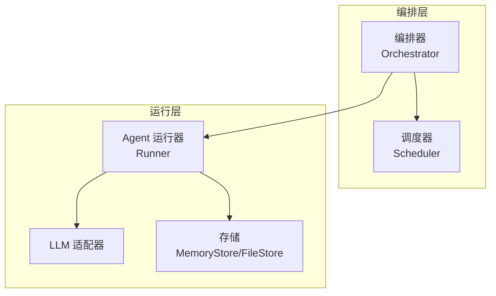
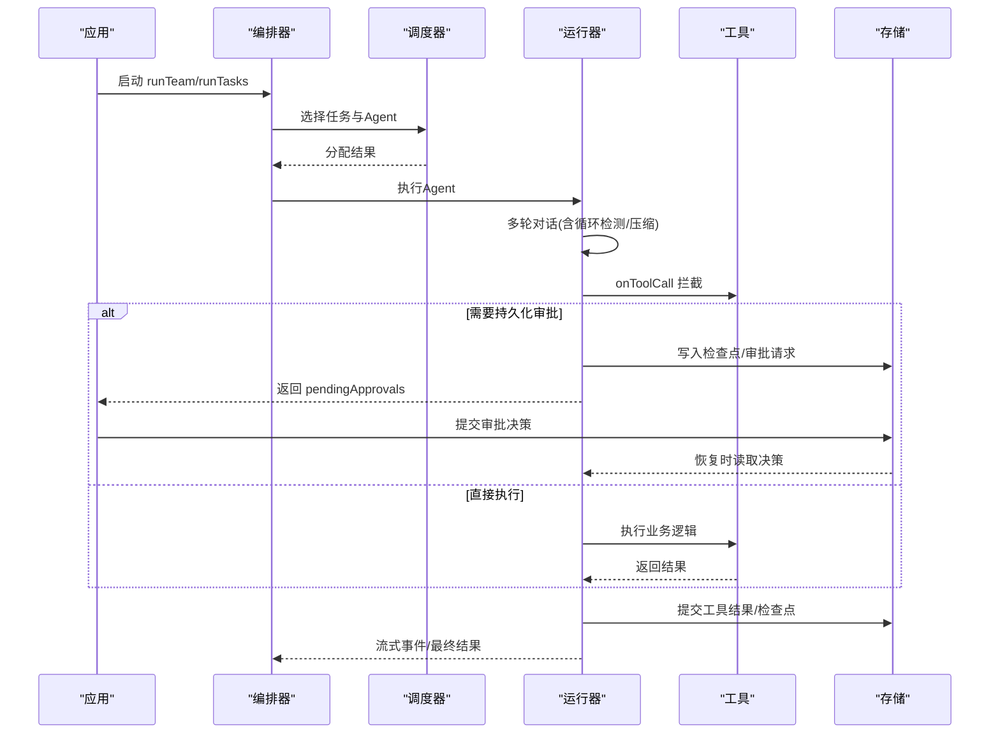
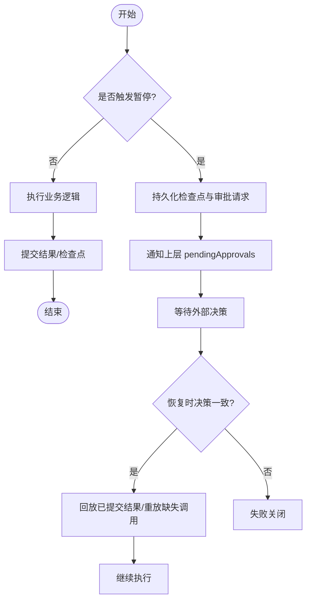
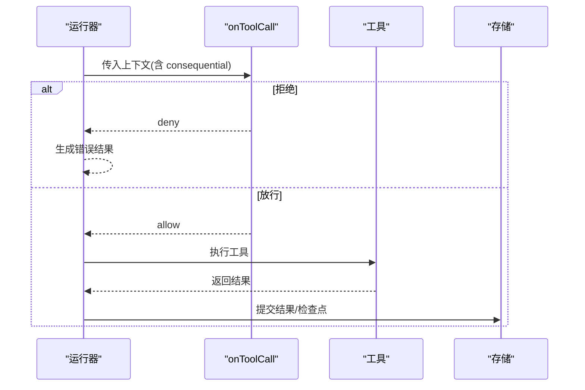
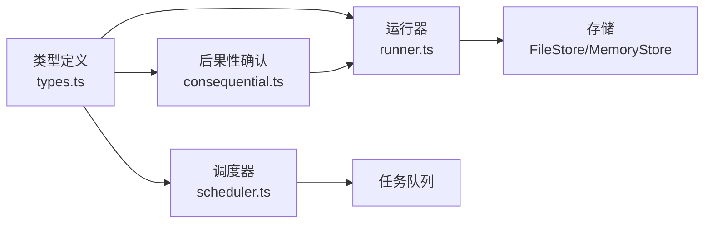

# 执行控制点

<cite>
**本文引用的文件**
- [runner.ts](file://packages/core/src/agent/runner.ts)
- [types.ts](file://packages/core/src/types.ts)
- [scheduler.ts](file://packages/core/src/orchestrator/scheduler.ts)
- [consequential.ts](file://packages/core/src/orchestrator/consequential.ts)
- [checkpoint.md](file://docs/checkpoint.md)
- [durable-approvals.md](file://docs/durable-approvals.md)
</cite>

## 目录
1. [简介](#简介)
2. [项目结构](#项目结构)
3. [核心组件](#核心组件)
4. [架构总览](#架构总览)
5. [详细组件分析](#详细组件分析)
6. [依赖关系分析](#依赖关系分析)
7. [性能与资源限制](#性能与资源限制)
8. [故障排查指南](#故障排查指南)
9. [结论](#结论)
10. [附录：配置示例与最佳实践](#附录配置示例与最佳实践)

## 简介
本文件系统性介绍 Open Multi-Agent（OMA）的执行控制点机制，覆盖任务级暂停、工具调用拦截、资源限制与并发控制，以及各类控制点的触发条件与执行顺序。文档同时提供可操作的配置组合建议，帮助实现精细化的执行控制与稳健的错误恢复策略。

## 项目结构
OMA 在执行路径上通过“编排器 + 调度器 + 运行器”的协作完成控制点落地：
- 编排层：负责任务分配、并发上限、审批门控（计划/轮次/派发）、结果合成等。
- 调度层：将待执行任务映射到可用 Agent，支持多种策略（依赖优先、能力匹配、负载均衡等）。
- 运行层：驱动单个 Agent 的多轮对话与工具调用，并在关键边界写入检查点、处理工具调用拦截与持久化审批。

图表来源
- [scheduler.ts:128-214](file://packages/core/src/orchestrator/scheduler.ts#L128-L214)
- [runner.ts:537-568](file://packages/core/src/agent/runner.ts#L537-L568)

章节来源
- [scheduler.ts:1-166](file://packages/core/src/orchestrator/scheduler.ts#L1-L166)
- [runner.ts:109-166](file://packages/core/src/agent/runner.ts#L109-L166)

## 核心组件
- 任务级暂停与持久化审批：在工具调用、任务派发、轮次边界等处，可通过返回 suspend 将执行挂起并持久化请求，等待外部决策后恢复。
- 工具调用拦截：onToolCall 回调可在每次工具调用前进行放行/拒绝/挂起；consequential 标志用于标记“后果性”操作，配合 requireConsequentialConfirmation 启用确认流程。
- 资源限制：支持整体超时、单次模型调用超时、最大轮次、Token 预算、循环检测、输出长度限制等。
- 并发控制：团队级 maxConcurrency 与调度策略共同决定并行度与任务分配。

章节来源
- [types.ts:1000-1200](file://packages/core/src/types.ts#L1000-L1200)
- [types.ts:2131-2180](file://packages/core/src/types.ts#L2131-L2180)
- [types.ts:2257-2284](file://packages/core/src/types.ts#L2257-L2284)
- [durable-approvals.md:16-28](file://docs/durable-approvals.md#L16-L28)

## 架构总览
下图展示了从任务派发、工具调用到检查点与恢复的关键路径。

图表来源
- [runner.ts:1020-1076](file://packages/core/src/agent/runner.ts#L1020-L1076)
- [runner.ts:1364-1546](file://packages/core/src/agent/runner.ts#L1364-L1546)
- [checkpoint.md:109-143](file://docs/checkpoint.md#L109-L143)
- [durable-approvals.md:30-78](file://docs/durable-approvals.md#L30-L78)

## 详细组件分析

### 任务级暂停与优先级处理
- 触发点
  - 工具调用：当工具返回包含“可挂起”的审批内容时，运行器会创建持久化审批请求，并在保存精确边界后上报给上层。
  - 任务派发：在任务即将执行前，可通过 onTaskDispatch 返回 suspend 以持久化该任务边界。
  - 轮次边界：legacy 模式下，onApproval 可在每轮结束后决定是否继续或挂起。
- 优先级与资源清理
  - 调度器支持按依赖关键路径优先（dependency-first），以及 composite 策略综合“能力匹配+负载”，确保高关键性任务优先获得执行机会。
  - 暂停时，运行器会在进入审批前持久化检查点，保证恢复时能回到精确边界；未提交的副作用不会重复执行。
- 恢复语义
  - 恢复时会比对请求内容与哈希，确保被批准的内容未被篡改；若不一致则失败关闭。
  - 已提交的结果会被回放，缺失结果的调用才会重新执行。

图表来源
- [runner.ts:1020-1076](file://packages/core/src/agent/runner.ts#L1020-L1076)
- [runner.ts:1426-1459](file://packages/core/src/agent/runner.ts#L1426-L1459)
- [durable-approvals.md:94-143](file://docs/durable-approvals.md#L94-L143)

章节来源
- [scheduler.ts:128-214](file://packages/core/src/orchestrator/scheduler.ts#L128-L214)
- [scheduler.ts:415-508](file://packages/core/src/orchestrator/scheduler.ts#L415-L508)
- [durable-approvals.md:16-28](file://docs/durable-approvals.md#L16-L28)
- [checkpoint.md:206-249](file://docs/checkpoint.md#L206-L249)

### 工具调用拦截与 consequential 标志
- onToolCall 回调
  - 每个工具调用都会先经过 onToolCall，允许放行、拒绝或挂起。
  - 对于 consequential 工具，若启用了 requireConsequentialConfirmation，且没有来自计划审批的继承授权，则会要求额外确认。
- 执行顺序
  - 工具解析与权限白名单校验 → onToolCall → 可选挂起与持久化审批 → 执行工具 → 提交结果与检查点。
- 错误与恢复
  - 拒绝的工具调用会返回错误型 ToolResult，不会真正执行外部副作用。
  - 挂起的工具调用在恢复时基于已批准的输入再次执行，避免重复副作用。

图表来源
- [runner.ts:1364-1546](file://packages/core/src/agent/runner.ts#L1364-L1546)
- [consequential.ts:42-76](file://packages/core/src/orchestrator/consequential.ts#L42-L76)
- [types.ts:2257-2284](file://packages/core/src/types.ts#L2257-L2284)

章节来源
- [consequential.ts:1-113](file://packages/core/src/orchestrator/consequential.ts#L1-L113)
- [runner.ts:1364-1546](file://packages/core/src/agent/runner.ts#L1364-L1546)
- [types.ts:2257-2284](file://packages/core/src/types.ts#L2257-L2284)

### 资源限制配置
- 超时控制
  - 整体运行超时：timeoutMs，超过后通过 AbortSignal 终止。
  - 单次模型调用超时：callTimeoutMs，为每次 adapter.chat() 注入独立超时信号，统一跨供应商行为。
- Token 与轮次限制
  - maxTurns：最大对话轮数。
  - maxTokens / maxTokenBudget：单轮与整跑 Token 上限。
- 循环检测
  - loopDetection：检测重复工具调用或文本输出，支持 warn/terminate 或自定义回调。
- 输出长度限制
  - maxToolOutputChars：截断过长的工具输出，保护上下文预算。
- 上下文压缩
  - compressToolResults / compressReasoningText：对已消费的工具结果或推理文本进行压缩，释放上下文空间。

章节来源
- [types.ts:1000-1200](file://packages/core/src/types.ts#L1000-L1200)
- [runner.ts:537-568](file://packages/core/src/agent/runner.ts#L537-L568)

### 并发控制与调度策略
- 并发上限
  - OrchestratorConfig.maxConcurrency 限制全局并发度。
- 调度策略
  - round-robin：均匀分配。
  - least-busy：优先分配给当前负载最低的 Agent。
  - capability-match：基于能力与关键词匹配评分。
  - dependency-first：优先执行能解锁更多下游任务的任务。
  - composite：结合关键路径、能力匹配与当前负载的综合打分。
- 任务派发门控
  - onTaskDispatch：在任务即将派发前进行放行/拒绝/挂起，与 legacy onApproval 互斥。

章节来源
- [types.ts:2131-2180](file://packages/core/src/types.ts#L2131-L2180)
- [scheduler.ts:128-214](file://packages/core/src/orchestrator/scheduler.ts#L128-L214)
- [scheduler.ts:260-268](file://packages/core/src/orchestrator/scheduler.ts#L260-L268)

### 控制点触发条件与执行顺序
- 计划审批（onPlanReady）：协调器产出计划后，决定是否执行或仅返回计划。
- 轮次审批（onApproval）：legacy 模式，每轮结束后决定是否继续下一轮。
- 任务派发（onTaskDispatch）：任务就绪且有 assignee 后立即派发前。
- 工具调用（onToolCall）：每次工具调用前。
- 执行顺序（典型路径）：
  1) 计划审批 → 2) 任务派发 → 3) 工具调用 → 4) 检查点提交/恢复。

章节来源
- [durable-approvals.md:16-28](file://docs/durable-approvals.md#L16-L28)
- [types.ts:2257-2284](file://packages/core/src/types.ts#L2257-L2284)

## 依赖关系分析
- 运行器依赖类型定义中的各种配置项（AgentConfig、OrchestratorConfig、LoopDetectionConfig 等）。
- 运行器通过存储接口写入检查点与审批记录，依赖 MemoryStore/FileStore 的原子性与一致性。
- 调度器依赖任务队列与 Agent 配置，依据策略计算分配。
- consequential 模块包装 onToolCall，在不改变原有 gate 的前提下增加后果性工具的确认逻辑。

图表来源
- [types.ts:1000-1200](file://packages/core/src/types.ts#L1000-L1200)
- [runner.ts:1020-1076](file://packages/core/src/agent/runner.ts#L1020-L1076)
- [scheduler.ts:128-214](file://packages/core/src/orchestrator/scheduler.ts#L128-L214)
- [consequential.ts:42-76](file://packages/core/src/orchestrator/consequential.ts#L42-L76)

章节来源
- [types.ts:1000-1200](file://packages/core/src/types.ts#L1000-L1200)
- [runner.ts:1020-1076](file://packages/core/src/agent/runner.ts#L1020-L1076)
- [scheduler.ts:128-214](file://packages/core/src/orchestrator/scheduler.ts#L128-L214)
- [consequential.ts:42-76](file://packages/core/src/orchestrator/consequential.ts#L42-L76)

## 性能与资源限制
- 使用 callTimeoutMs 统一各供应商的调用超时，避免个别 SDK 默认超时缺失导致长时间阻塞。
- 合理设置 maxTurns 与 maxTokenBudget，防止无限对话与 Token 超支。
- 开启 loopDetection 以避免陷入重复调用或输出死循环。
- 使用 compressToolResults 与 compressReasoningText 控制上下文膨胀，提升长对话稳定性。
- 通过调度策略与 maxConcurrency 平衡吞吐与延迟，避免过载。

[本节为通用指导，不直接分析具体文件]

## 故障排查指南
- 检查点写入失败
  - 普通检查点写入失败不影响运行，但会触发 onProgress 错误事件；恢复时会在下一个安全边界重试。
  - 挂起时的检查点写入是严格的，必须成功才能上报 pendingApprovals。
- 审批冲突与陈旧决策
  - 并发或重复决策会失败；恢复时会对请求内容与哈希进行校验，不一致则失败关闭。
- 工具调用异常
  - 工具执行抛错会转为错误型 ToolResult，不会中断整个循环；如需幂等，请使用 toolCallId 作为外部系统幂等键。
- 超时与取消
  - 区分 LLMCallTimeoutError 与 caller abortSignal 取消；根据错误类型采取不同恢复策略。

章节来源
- [checkpoint.md:154-160](file://docs/checkpoint.md#L154-L160)
- [checkpoint.md:206-249](file://docs/checkpoint.md#L206-L249)
- [durable-approvals.md:125-143](file://docs/durable-approvals.md#L125-L143)
- [runner.ts:537-568](file://packages/core/src/agent/runner.ts#L537-L568)

## 结论
OMA 的执行控制点通过“审批门控 + 检查点 + 调度策略 + 资源限制”的组合，提供了从任务到工具调用的精细化控制能力。借助持久化审批与恢复语义，可以在复杂业务中实现可靠的可中断、可恢复与可审计的执行流程。

[本节为总结，不直接分析具体文件]

## 附录：配置示例与最佳实践
以下为面向实际场景的配置组合建议（以路径引用代替代码片段）：

- 启用持久化审批与恢复
  - 参考：[checkpoint.md:11-36](file://docs/checkpoint.md#L11-L36)、[checkpoint.md:74-107](file://docs/checkpoint.md#L74-L107)
- 在工具调用处启用后果性确认
  - 参考：[types.ts:2257-2284](file://packages/core/src/types.ts#L2257-L2284)、[consequential.ts:42-76](file://packages/core/src/orchestrator/consequential.ts#L42-L76)
- 设置超时与 Token 预算
  - 参考：[types.ts:1000-1200](file://packages/core/src/types.ts#L1000-L1200)
- 配置调度策略与并发
  - 参考：[types.ts:2131-2180](file://packages/core/src/types.ts#L2131-L2180)、[scheduler.ts:128-214](file://packages/core/src/orchestrator/scheduler.ts#L128-L214)
- 工具幂等与恢复
  - 参考：[checkpoint.md:206-249](file://docs/checkpoint.md#L206-L249)

章节来源
- [checkpoint.md:11-36](file://docs/checkpoint.md#L11-L36)
- [checkpoint.md:74-107](file://docs/checkpoint.md#L74-L107)
- [checkpoint.md:206-249](file://docs/checkpoint.md#L206-L249)
- [types.ts:1000-1200](file://packages/core/src/types.ts#L1000-L1200)
- [types.ts:2131-2180](file://packages/core/src/types.ts#L2131-L2180)
- [scheduler.ts:128-214](file://packages/core/src/orchestrator/scheduler.ts#L128-L214)
- [consequential.ts:42-76](file://packages/core/src/orchestrator/consequential.ts#L42-L76)