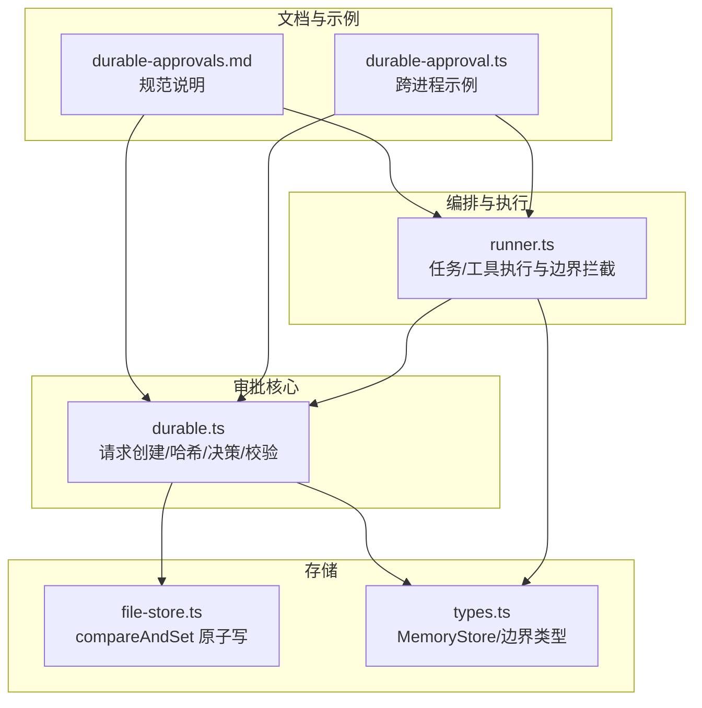
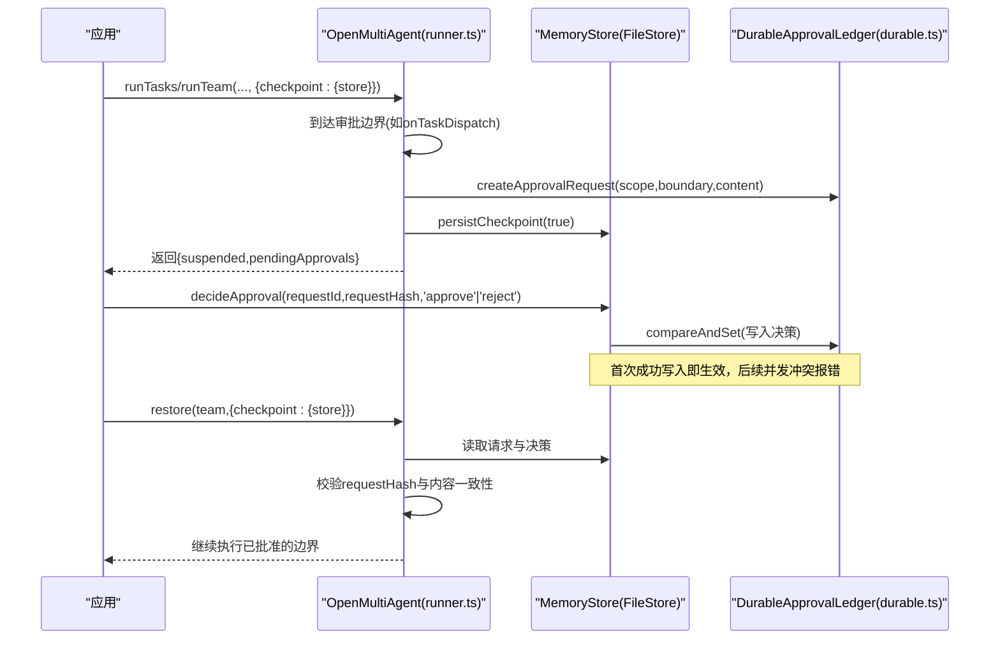
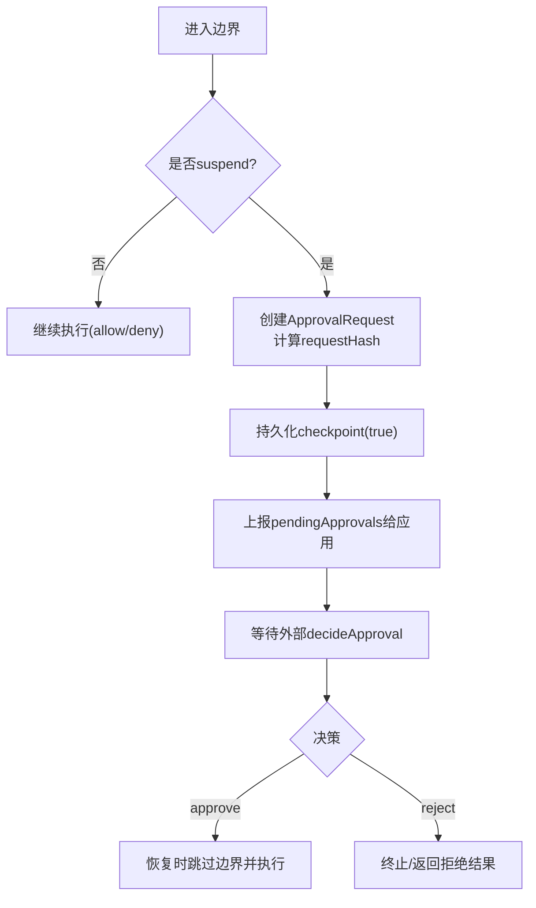
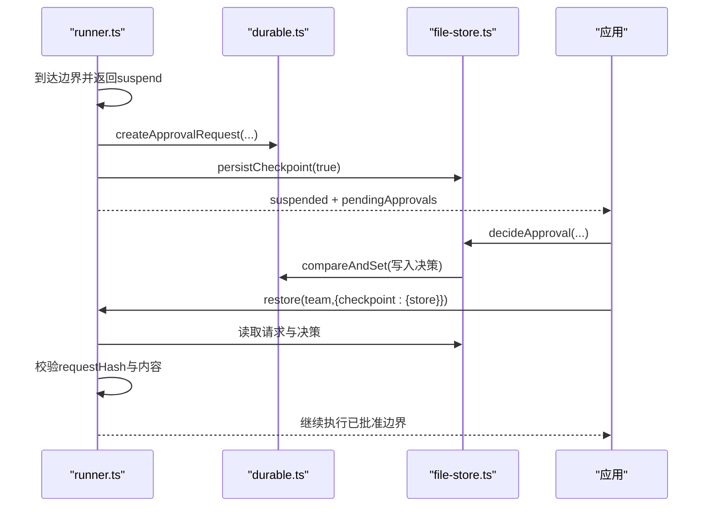
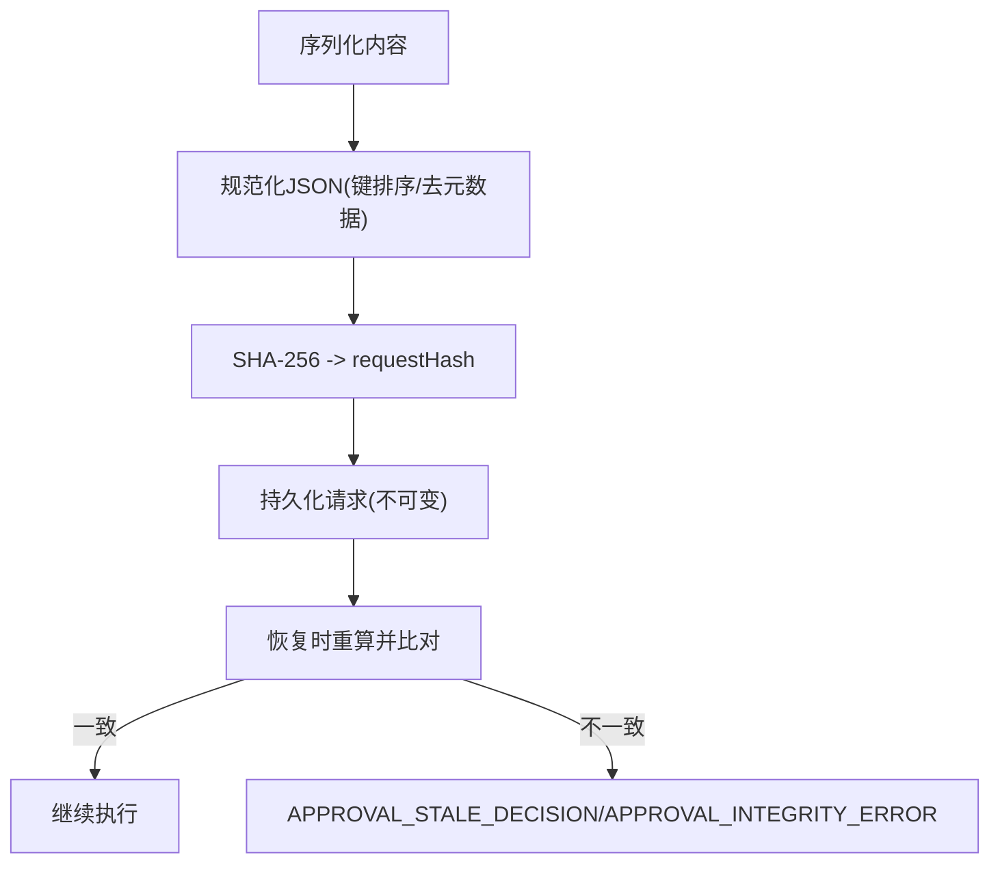
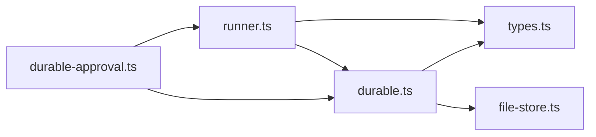

# 持久化审批

<cite>
**本文引用的文件**
- [durable-approvals.md](file://docs/durable-approvals.md)
- [durable.ts](file://packages/core/src/approval/durable.ts)
- [runner.ts](file://packages/core/src/agent/runner.ts)
- [types.ts](file://packages/core/src/types.ts)
- [file-store.ts](file://packages/core/src/memory/file-store.ts)
- [durable-approval.ts](file://packages/core/examples/patterns/durable-approval.ts)
</cite>

## 目录
1. [简介](#简介)
2. [项目结构](#项目结构)
3. [核心组件](#核心组件)
4. [架构总览](#架构总览)
5. [详细组件分析](#详细组件分析)
6. [依赖关系分析](#依赖关系分析)
7. [性能考虑](#性能考虑)
8. [故障排查指南](#故障排查指南)
9. [结论](#结论)
10. [附录：跨进程重启的完整示例与错误处理](#附录跨进程重启的完整示例与错误处理)

## 简介
本文件系统性介绍 Open Multi-Agent（OMA）的“持久化审批”机制。它允许在执行流程的关键边界暂停运行，将待审批请求与精确内容绑定并持久化；外部审阅者原子地做出批准或拒绝决策后，系统可在进程重启时恢复执行，确保已批准的边界仅执行一次且不可被篡改。文档覆盖支持的四个边界、暂停-决策-恢复流程、checkpoint 与 MemoryStore 要求、精确内容绑定与校验、拒绝与恢复语义，并提供完整的跨进程示例与错误处理策略。

## 项目结构
围绕持久化审批的核心由以下部分组成：
- 类型与边界定义：ApprovalScope、各边界的 ApprovalRequestContent、MemoryStore 接口等
- 持久化账本与哈希：创建请求、计算 requestHash、原子写入与读取决策
- 执行器集成：在 onPlanReady/onApproval/onTaskDispatch/onToolCall 处触发暂停、持久化 checkpoint、上报待审批
- 存储实现：FileStore 提供 compareAndSet 原子能力，配合 checkpoint 文件落盘
- 示例：无键可运行的跨进程审批流程演示

图表来源
- [runner.ts:1020-1070](file://packages/core/src/agent/runner.ts#L1020-L1070)
- [durable.ts:125-196](file://packages/core/src/approval/durable.ts#L125-L196)
- [file-store.ts:128-159](file://packages/core/src/memory/file-store.ts#L128-L159)
- [types.ts:2841-2872](file://packages/core/src/types.ts#L2841-L2872)
- [durable-approvals.md:16-28](file://docs/durable-approvals.md#L16-L28)
- [durable-approval.ts:54-105](file://packages/core/examples/patterns/durable-approval.ts#L54-L105)

章节来源
- [durable-approvals.md:16-28](file://docs/durable-approvals.md#L16-L28)
- [types.ts:2841-2872](file://packages/core/src/types.ts#L2841-L2872)

## 核心组件
- 审批边界与内容模型
  - 支持四类边界：plan、task_round、task_dispatch、tool_call
  - 每种边界对应精确的内容结构，用于生成稳定哈希并作为审阅展示与恢复校验的依据
- 持久化审批账本
  - 以 __oma_approval__/<requestId> 为键的主记录，包含不可变的请求与首次成功的决策
  - 使用 compareAndSet 保证“先入为主”的原子决策
- 执行器集成点
  - 在关键边界返回 suspend 时，持久化 checkpoint 并上报 pendingApprovals
  - 恢复时比对请求内容与历史决策，确保一致性
- 存储要求
  - 需要支持 compareAndSet 的 MemoryStore；FileStore 提供单进程内原子写；跨进程建议使用数据库级 CAS
- 精确内容绑定
  - requestHash 基于规范化 JSON（含 scope、boundary、content），对对象键排序，排除 reason/requestedAt 等元数据
  - 恢复时对原始输入再次验证并与审阅内容对比，防止变更继承旧审批

章节来源
- [types.ts:327-427](file://packages/core/src/types.ts#L327-L427)
- [durable.ts:125-196](file://packages/core/src/approval/durable.ts#L125-L196)
- [durable.ts:415-579](file://packages/core/src/approval/durable.ts#L415-L579)
- [file-store.ts:128-159](file://packages/core/src/memory/file-store.ts#L128-L159)
- [durable-approvals.md:94-123](file://docs/durable-approvals.md#L94-L123)

## 架构总览
下图展示了从执行到暂停、再到外部决策与恢复的端到端流程，以及各组件之间的交互。

图表来源
- [runner.ts:1020-1070](file://packages/core/src/agent/runner.ts#L1020-L1070)
- [durable.ts:125-196](file://packages/core/src/approval/durable.ts#L125-L196)
- [durable.ts:415-579](file://packages/core/src/approval/durable.ts#L415-L579)
- [file-store.ts:128-159](file://packages/core/src/memory/file-store.ts#L128-L159)

## 详细组件分析

### 支持的审批边界与行为
- onPlanReady
  - 审阅内容：协调器生成的计划快照与是否执行或仅返回计划
  - 恢复行为：按快照精确执行或返回计划
- onApproval
  - 审阅内容：本轮已完成任务与下一批待执行任务
  - 恢复行为：直接启动下一轮，不再重复调用该边界
- onTaskDispatch
  - 审阅内容：即将分发的单个任务快照
  - 恢复行为：分发该任务，不再重复调用该边界
- onToolCall
  - 审阅内容：工具名、模型输入、Zod 校验后的输入、代理/任务标识、工具调用ID、consequential 标志
  - 恢复行为：用持久化决策替代重新评估；批准则执行已校验的调用，拒绝则返回 ToolResult 不调用工具

图表来源
- [durable-approvals.md:16-28](file://docs/durable-approvals.md#L16-L28)
- [runner.ts:1020-1070](file://packages/core/src/agent/runner.ts#L1020-L1070)
- [durable.ts:125-196](file://packages/core/src/approval/durable.ts#L125-L196)

章节来源
- [durable-approvals.md:16-28](file://docs/durable-approvals.md#L16-L28)
- [types.ts:327-427](file://packages/core/src/types.ts#L327-L427)

### 暂停、决策与恢复流程
- 暂停
  - 在边界回调中返回 suspend，系统创建 ApprovalRequest，持久化 checkpoint，并通过 onApprovalPrepare/onApprovalRequest 通知应用
- 决策
  - 应用调用 decideApproval(store, {requestId, requestHash, decision, reviewer})，内部通过 compareAndSet 原子写入决策，首个成功写入者胜出
- 恢复
  - 新进程重建团队/后端配置，调用 restore(team, {checkpoint:{store}})，系统读取请求与决策，校验 requestHash 与内容一致性后继续执行

图表来源
- [runner.ts:1020-1070](file://packages/core/src/agent/runner.ts#L1020-L1070)
- [durable.ts:415-579](file://packages/core/src/approval/durable.ts#L415-L579)
- [file-store.ts:128-159](file://packages/core/src/memory/file-store.ts#L128-L159)

章节来源
- [durable-approvals.md:30-87](file://docs/durable-approvals.md#L30-L87)
- [durable.ts:415-579](file://packages/core/src/approval/durable.ts#L415-L579)

### 精确内容绑定与校验
- requestHash 计算
  - 基于规范化 JSON 的 SHA-256，包含 scope、boundary、content；对象键排序，忽略 reason/requestedAt 等元数据
- 内容约束
  - 仅支持 JSON 兼容类型（有限数字、字符串、布尔、null、数组、普通对象）；循环引用或非平凡原型会失败
- 恢复校验
  - 恢复时独立比较请求与 checkpoint 的计划/任务状态/待执行工具调用；同时比较 checkpoint 中的决策历史与主账本
  - 工具调用会在恢复时再次用当前 Zod 模式校验输入，并与审阅内容对比，防止输入或校验结果变化继承旧审批

图表来源
- [durable.ts:54-131](file://packages/core/src/approval/durable.ts#L54-L131)
- [durable.ts:304-355](file://packages/core/src/approval/durable.ts#L304-L355)
- [durable-approvals.md:94-123](file://docs/durable-approvals.md#L94-L123)

章节来源
- [durable.ts:54-131](file://packages/core/src/approval/durable.ts#L54-L131)
- [durable.ts:304-355](file://packages/core/src/approval/durable.ts#L304-L355)
- [durable-approvals.md:94-123](file://docs/durable-approvals.md#L94-L123)

### 拒绝与恢复语义
- 计划/轮次/任务分发拒绝
  - 产生顶层 rejected 结果，跳过剩余工作；终端拒绝在多次恢复中保持
- 工具调用拒绝
  - 返回与内联拒绝相同的 ToolResult；工具不被调用，模型可在下一轮调整
- 工具调用批准
  - 执行一次，并在任务中间 checkpoint 记录其返回结果；外部副作用幂等窗口仍适用
- 严格性
  - 使暂停可恢复的 checkpoint 写入是严格的；缺失 checkpoint、缺少 CAS、记录损坏或内容陈旧均“fail closed”，不执行受保护的任务或工具

章节来源
- [durable-approvals.md:125-147](file://docs/durable-approvals.md#L125-L147)

### MemoryStore 要求与实现
- 必需能力
  - compareAndSet：用于原子写入决策；未实现则 suspendable 审批 fail closed
- FileStore
  - 单进程内原子写（临时文件+fsync+rename）；跨进程审阅应在挂起写入者退出后进行，或使用数据库级 CAS
- InMemoryStore
  - 进程内 CAS，适合测试

章节来源
- [types.ts:2841-2872](file://packages/core/src/types.ts#L2841-L2872)
- [file-store.ts:128-159](file://packages/core/src/memory/file-store.ts#L128-L159)
- [durable-approvals.md:149-162](file://docs/durable-approvals.md#L149-L162)

## 依赖关系分析
- runner.ts 依赖 durable.ts 的请求创建与校验，依赖 types.ts 的边界类型与 MemoryStore 接口
- durable.ts 依赖 types.ts 的数据结构与校验规则，依赖 file-store.ts 的 compareAndSet 实现
- 示例 durable-approval.ts 串联 runner.ts 与 durable.ts，演示跨进程审批

图表来源
- [runner.ts:1020-1070](file://packages/core/src/agent/runner.ts#L1020-L1070)
- [durable.ts:125-196](file://packages/core/src/approval/durable.ts#L125-L196)
- [types.ts:2841-2872](file://packages/core/src/types.ts#L2841-L2872)
- [file-store.ts:128-159](file://packages/core/src/memory/file-store.ts#L128-L159)
- [durable-approval.ts:54-105](file://packages/core/examples/patterns/durable-approval.ts#L54-L105)

章节来源
- [runner.ts:1020-1070](file://packages/core/src/agent/runner.ts#L1020-L1070)
- [durable.ts:125-196](file://packages/core/src/approval/durable.ts#L125-L196)
- [types.ts:2841-2872](file://packages/core/src/types.ts#L2841-L2872)
- [file-store.ts:128-159](file://packages/core/src/memory/file-store.ts#L128-L159)
- [durable-approval.ts:54-105](file://packages/core/examples/patterns/durable-approval.ts#L54-L105)

## 性能考虑
- 审批决策写入路径短且原子，主要开销来自 checkpoint 持久化与 compareAndSet 的磁盘操作
- 建议将共享内存置于快速 InMemoryStore，而将 checkpoint 与审批主记录放在 FileStore 或数据库存储，以降低频繁 I/O
- 工具调用审批仅在 checkpointed LLM worker 内支持，避免在非受控路径引入额外开销

[本节为通用指导，无需特定文件来源]

## 故障排查指南
- 常见错误码与含义
  - APPROVAL_ATOMIC_STORE_REQUIRED：缺少 compareAndSet，无法进行可恢复审批
  - APPROVAL_CONFLICT：并发决策冲突或请求内容不一致
  - APPROVAL_NOT_FOUND：请求不存在
  - APPROVAL_STALE_DECISION：审阅后请求内容变化或决策陈旧
  - APPROVAL_INTEGRITY_ERROR：记录格式/字段校验失败
  - APPROVAL_VALIDATION_ERROR：内容非 JSON 兼容、循环引用、非法字段等
- 定位步骤
  - 检查 store 是否实现 compareAndSet
  - 确认传入的 requestHash 与审阅时一致
  - 检查请求内容是否为纯 JSON 兼容结构
  - 查看最终结果的 approvalDecisions 与 pendingApprovals 状态
  - 若工具调用审批失败，确认是否在 checkpointed 执行路径中

章节来源
- [durable.ts:23-40](file://packages/core/src/approval/durable.ts#L23-L40)
- [durable.ts:415-579](file://packages/core/src/approval/durable.ts#L415-L579)
- [runner.ts:1436-1458](file://packages/core/src/agent/runner.ts#L1436-L1458)

## 结论
持久化审批通过“精确内容绑定 + 原子决策 + 严格恢复校验”的组合，确保关键业务动作在人类或服务审阅后才执行，且在进程重启后仍可安全恢复。正确配置 checkpoint 与 MemoryStore、遵循边界语义与错误处理策略，是实现高可靠审批流的关键。

[本节为总结性内容，无需特定文件来源]

## 附录：跨进程重启的完整示例与错误处理
- 示例要点
  - 在 onTaskDispatch 中返回 suspend，触发持久化审批
  - 获取 suspended.pendingApprovals，调用 decideApproval 提交审阅决策
  - 新建 OpenMultiAgent 实例并调用 restore(team, {checkpoint:{store}}) 恢复执行
- 代码片段路径
  - 示例入口与审批调用：[durable-approval.ts:54-105](file://packages/core/examples/patterns/durable-approval.ts#L54-L105)
  - 决策函数与错误类型：[durable.ts:415-579](file://packages/core/src/approval/durable.ts#L415-L579)
  - 执行器集成与错误传播：[runner.ts:1436-1458](file://packages/core/src/agent/runner.ts#L1436-L1458)
- 错误处理策略
  - 捕获 DurableApprovalError，根据 code 区分重试、回滚或提示用户修正
  - 对 APPROVAL_STALE_DECISION，应重新审阅并提交新的 requestHash
  - 对 APPROVAL_CONFLICT，应避免并发决策或采用队列串行化
  - 对 APPROVAL_ATOMIC_STORE_REQUIRED，更换支持 compareAndSet 的存储

章节来源
- [durable-approval.ts:54-105](file://packages/core/examples/patterns/durable-approval.ts#L54-L105)
- [durable.ts:415-579](file://packages/core/src/approval/durable.ts#L415-L579)
- [runner.ts:1436-1458](file://packages/core/src/agent/runner.ts#L1436-L1458)