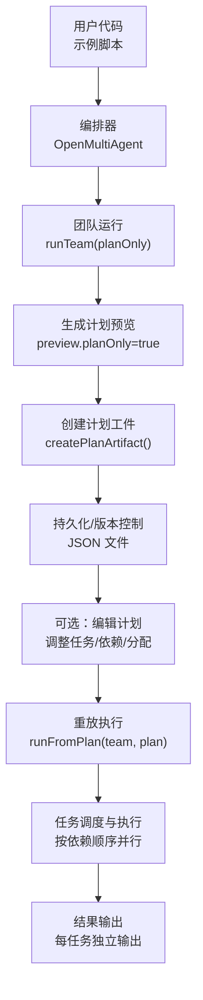
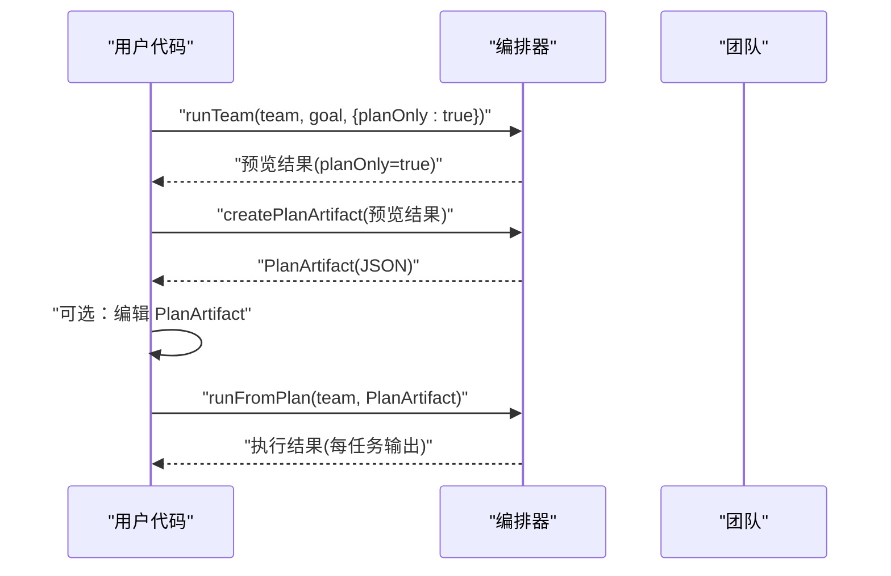
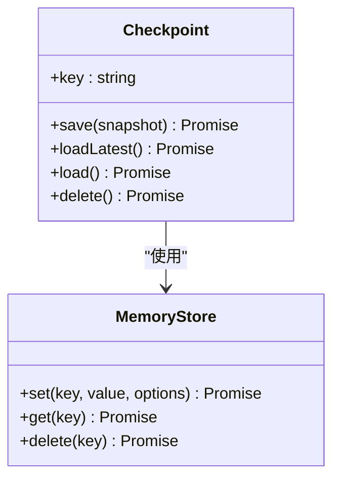

# 计划重放

<cite>
**本文引用的文件**
- [docs/plan-replay.md](file://docs/plan-replay.md)
- [packages/core/examples/patterns/plan-replay.ts](file://packages/core/examples/patterns/plan-replay.ts)
- [packages/core/src/memory/checkpoint.ts](file://packages/core/src/memory/checkpoint.ts)
</cite>

## 目录
1. [简介](#简介)
2. [项目结构](#项目结构)
3. [核心组件](#核心组件)
4. [架构总览](#架构总览)
5. [详细组件分析](#详细组件分析)
6. [依赖关系分析](#依赖关系分析)
7. [性能考量](#性能考量)
8. [故障排查指南](#故障排查指南)
9. [结论](#结论)
10. [附录](#附录)

## 简介
本章节面向 Open Multi-Agent 的“计划重放”能力，说明如何冻结并版本化任务图、如何在后续执行中精确重放同一计划、以及该能力在测试验证、性能分析与故障复现等场景中的价值。文档同时覆盖与检查点系统的集成方式，并提供从捕获计划、修改参数到重放执行的端到端示例路径。

## 项目结构
围绕计划重放的代码与文档主要分布在以下位置：
- 文档：docs/plan-replay.md，提供概念、API 使用要点与限制说明。
- 示例：packages/core/examples/patterns/plan-replay.ts，演示 planOnly → createPlanArtifact → runFromPlan 的完整流程。
- 检查点：packages/core/src/memory/checkpoint.ts，提供持久化的快照/恢复能力，可与 runFromPlan 结合实现断点续跑与可重复执行。

图表来源
- [packages/core/examples/patterns/plan-replay.ts:60-108](file://packages/core/examples/patterns/plan-replay.ts#L60-L108)
- [docs/plan-replay.md:7-63](file://docs/plan-replay.md#L7-L63)

章节来源
- [docs/plan-replay.md:1-96](file://docs/plan-replay.md#L1-L96)
- [packages/core/examples/patterns/plan-replay.ts:1-109](file://packages/core/examples/patterns/plan-replay.ts#L1-L109)

## 核心组件
- 计划预览与冻结
  - 通过 runTeam(planOnly: true) 仅让协调器分解目标为任务 DAG，不执行任何任务代理。
  - 使用 createPlanArtifact() 将预览结果转换为可序列化的 PlanArtifact（纯 JSON），便于 diff、提交与跨进程传递。
- 重放执行
  - 使用 runFromPlan(team, plan) 基于冻结的计划执行任务图，不调用协调器，严格复用任务 id、依赖关系与分配。
  - 支持 checkpoint 选项以启用持久化快照/恢复。
- 工件结构与版本
  - PlanArtifact 包含 version、goal、tasks 列表；每个 PlanTaskArtifact 描述任务 id、标题、描述、分配者、依赖、内存范围与重试策略等。
  - 工件带版本号，不支持的版本会抛出异常。

章节来源
- [docs/plan-replay.md:7-86](file://docs/plan-replay.md#L7-L86)
- [packages/core/examples/patterns/plan-replay.ts:60-108](file://packages/core/examples/patterns/plan-replay.ts#L60-L108)

## 架构总览
计划重放的整体流程如下：
- 第一步：计划预览。调用 runTeam(planOnly: true)，协调器进行目标分解，返回仅含计划的预览结果。
- 第二步：冻结计划。调用 createPlanArtifact() 生成 PlanArtifact，并持久化为 JSON。
- 第三步：可选编辑。对 PlanArtifact 进行人工或程序化修改（如改 assignee、重写 description、增删任务、调整 dependsOn）。
- 第四步：重放执行。调用 runFromPlan(team, plan) 严格按冻结的任务图执行，复用依赖顺序与并行度。
- 第五步：结果收集与分析。获取每任务的独立输出与指标，用于对比与评估。

图表来源
- [packages/core/examples/patterns/plan-replay.ts:60-108](file://packages/core/examples/patterns/plan-replay.ts#L60-L108)
- [docs/plan-replay.md:7-63](file://docs/plan-replay.md#L7-L63)

## 详细组件分析

### 计划预览与冻结
- 计划预览
  - 行为：仅协调器参与，任务状态均为 pending，无指标数据。
  - 注意：planOnly 会绕过“简单目标短路”，确保始终得到可审查的计划。
  - 门控：若配置 onPlanReady 且返回 false，预览将被拒绝（success=false，planOnly 未设置）。
- 冻结计划
  - 仅接受 plan-only 结果；已执行运行的任务记录不可作为重放契约。
  - 产物为纯 JSON，可被版本控制系统管理，便于差异比较与审计。

章节来源
- [docs/plan-replay.md:7-40](file://docs/plan-replay.md#L7-L40)

### 重放执行与校验
- 重放入口
  - runFromPlan(team, plan) 复用 runTasks 的执行路径：按依赖排序、独立任务并行。
  - 不调用协调器做最终综合，直接返回每任务的独立输出。
- 图校验
  - 执行前校验依赖图：引用不存在的任务 id 或引入环都会抛出异常，避免执行损坏的计划。
- 检查点集成
  - 支持 checkpoint 选项，允许在执行过程中保存/恢复状态，提升可重复性与容错性。

章节来源
- [docs/plan-replay.md:42-63](file://docs/plan-replay.md#L42-L63)
- [packages/core/src/memory/checkpoint.ts:45-97](file://packages/core/src/memory/checkpoint.ts#L45-L97)

### 工件结构与版本控制
- PlanArtifact
  - version：工件版本，受运行时保护，不支持版本将抛错。
  - goal：原始目标（可选）。
  - tasks：任务清单，每项包含 id/title/description/assignee/dependsOn/memoryScope/maxRetries/retryDelayMs/retryBackoff 等。
- 版本演进
  - 仅存储影响任务图与执行行为的字段，不包含历史运行结果、状态或指标。
  - 通过 version 字段保证向后兼容与升级安全。

章节来源
- [docs/plan-replay.md:64-86](file://docs/plan-replay.md#L64-L86)

### 检查点系统（快照与恢复）
- 关键能力
  - Checkpoint 类封装了快照的保存、加载、删除等操作，底层通过 MemoryStore 抽象存储后端（内存、Redis、SQLite 等）。
  - 支持多模式快照（runTeam/runTasks/runFromPlan），并维护队列与进行中任务的状态。
- 与重放的结合
  - runFromPlan 支持 checkpoint 选项，可在执行过程中持久化进度，失败后可恢复继续执行。
  - 快照包含任务完成结果、队列、进行中任务、工具调用与审批请求等，确保恢复时的一致性。

图表来源
- [packages/core/src/memory/checkpoint.ts:45-97](file://packages/core/src/memory/checkpoint.ts#L45-L97)

章节来源
- [packages/core/src/memory/checkpoint.ts:1-315](file://packages/core/src/memory/checkpoint.ts#L1-L315)

### 端到端示例：捕获、修改与重放
- 步骤概览
  - 使用 runTeam(planOnly: true) 生成计划预览。
  - 调用 createPlanArtifact() 生成 PlanArtifact 并写入磁盘。
  - 读取并编辑 PlanArtifact（例如更改 assignee、重写 description、调整 dependsOn）。
  - 调用 runFromPlan(team, plan) 重放执行，获得每任务的独立输出与指标。
- 参考路径
  - 示例脚本展示了完整的捕获、持久化、重放与结果汇总流程。

章节来源
- [packages/core/examples/patterns/plan-replay.ts:60-108](file://packages/core/examples/patterns/plan-replay.ts#L60-L108)

## 依赖关系分析
- 模块耦合
  - 示例脚本依赖编排器 API（runTeam/createPlanArtifact/runFromPlan）。
  - 检查点模块依赖 MemoryStore 抽象，解耦具体存储实现。
- 外部依赖
  - 计划重放本身不依赖 LLM 的最终答案，但任务执行仍会调用模型；因此重放保证的是“结构可重复”，而非“内容完全一致”。

图表来源
- [packages/core/examples/patterns/plan-replay.ts:60-108](file://packages/core/examples/patterns/plan-replay.ts#L60-L108)
- [packages/core/src/memory/checkpoint.ts:45-97](file://packages/core/src/memory/checkpoint.ts#L45-L97)

章节来源
- [packages/core/examples/patterns/plan-replay.ts:1-109](file://packages/core/examples/patterns/plan-replay.ts#L1-L109)
- [packages/core/src/memory/checkpoint.ts:1-315](file://packages/core/src/memory/checkpoint.ts#L1-L315)

## 性能考量
- 减少协调器开销
  - 通过 planOnly 一次性分解目标，后续重放不再重复调用协调器，降低额外 LLM 往返成本。
- 并行执行
  - 重放沿用依赖有序与独立任务并行的执行路径，充分利用并发能力。
- 可重复性
  - 冻结任务图确保每次重放的结构一致，便于基准测试与回归分析。

[本节为通用指导，无需特定文件来源]

## 故障排查指南
- 常见错误
  - 不支持的工件版本：当 PlanArtifact.version 不被当前运行时支持时，会抛出异常。
  - 无效依赖图：引用不存在的任务 id 或引入循环依赖，会在执行前校验阶段抛出异常。
  - 非 plan-only 结果：createPlanArtifact 不接受已执行运行的结果，必须使用 planOnly 预览。
- 定位建议
  - 检查 PlanArtifact 的 version 与 tasks 结构是否符合预期。
  - 确认 dependsOn 引用有效且无环。
  - 如需最终综合答案，请使用 runTeam 而非 runFromPlan。

章节来源
- [docs/plan-replay.md:40-93](file://docs/plan-replay.md#L40-L93)

## 结论
计划重放通过“冻结任务图 + 精确重放”的方式，实现了可审查、可版本化、可重复的多智能体执行。它与检查点系统结合，进一步提升了执行的可恢复性与可观测性。对于测试验证、性能分析与故障复现等场景，该能力提供了稳定可靠的基线。

[本节为总结性内容，无需特定文件来源]

## 附录
- 典型应用场景
  - 测试验证：固定计划后多次重放，验证不同输入或环境下的稳定性。
  - 性能分析：对比不同模型/提示词/重试策略下的任务耗时与资源消耗。
  - 故障复现：利用冻结计划与检查点快速复现问题现场，缩小定位范围。
- 最佳实践
  - 始终先以 planOnly 生成计划并审阅，再冻结与重放。
  - 将 PlanArtifact 纳入版本控制，配合变更评审。
  - 结合检查点实现长任务的可中断与恢复。

[本节为通用指导，无需特定文件来源]