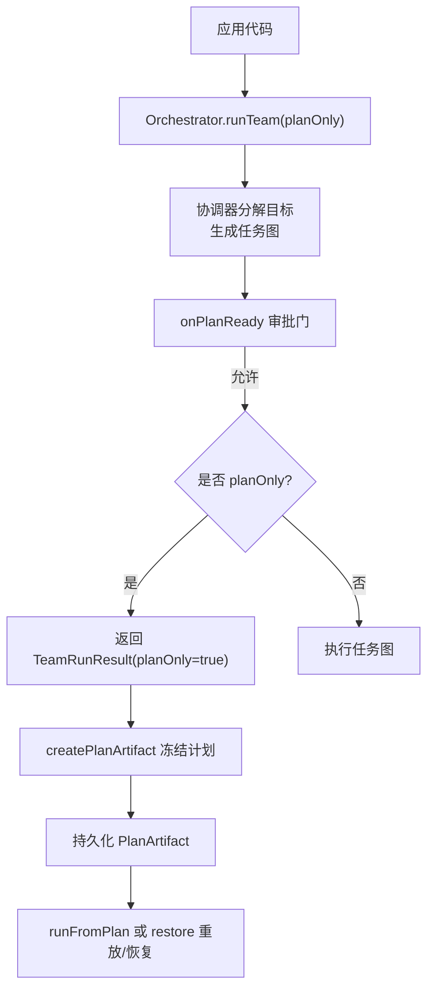
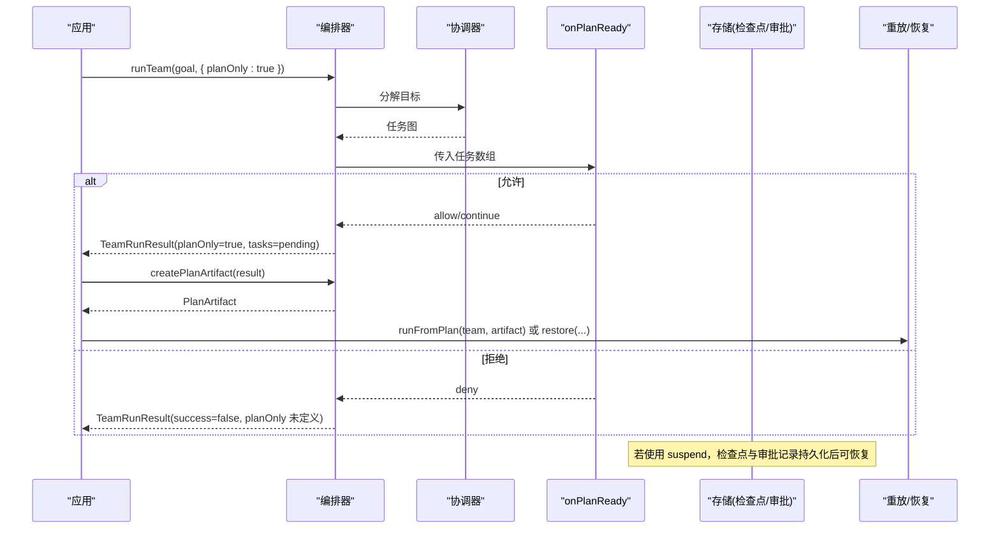
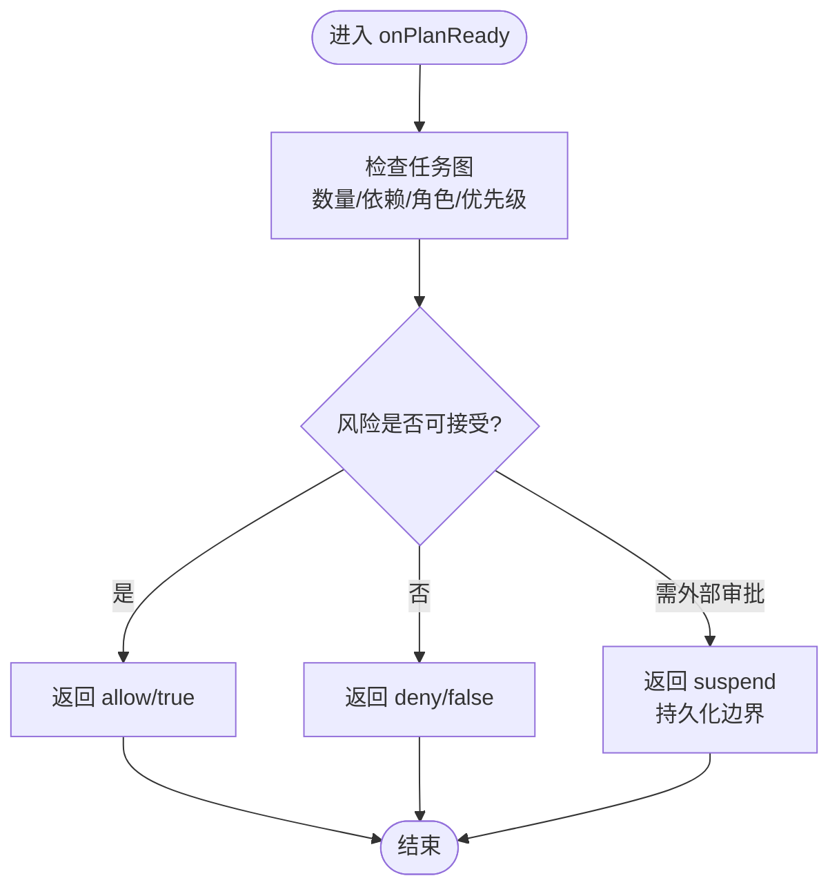
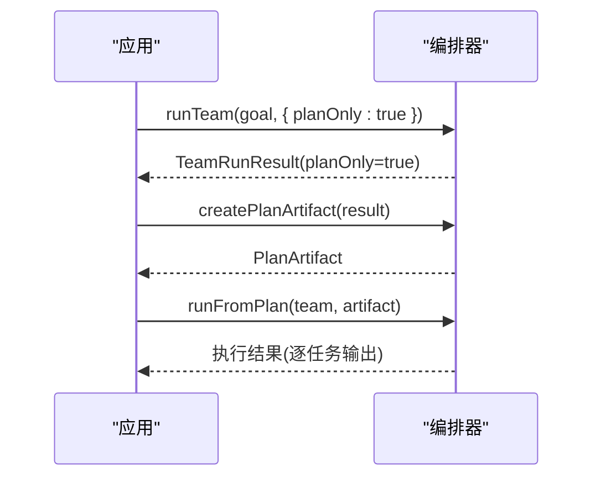
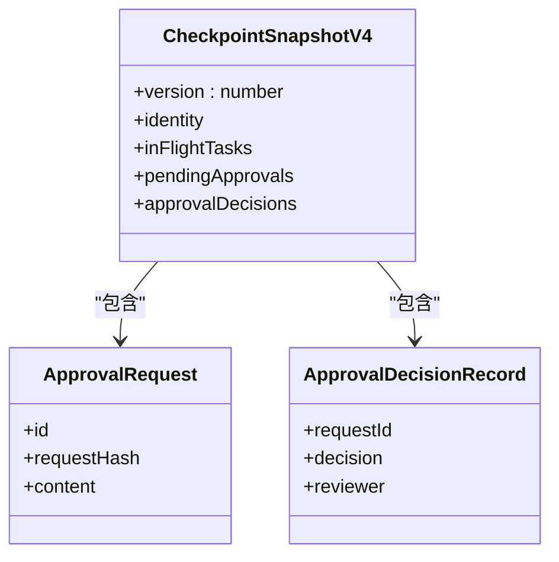
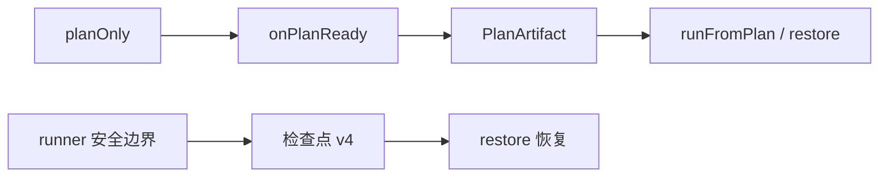

# 计划预览

<cite>
**本文引用的文件**
- [plan-replay.md](file://docs/plan-replay.md)
- [checkpoint.md](file://docs/checkpoint.md)
- [durable-approvals.md](file://docs/durable-approvals.md)
- [types.ts](file://packages/core/src/types.ts)
- [runner.ts](file://packages/core/src/agent/runner.ts)
</cite>

## 目录
1. [简介](#简介)
2. [项目结构](#项目结构)
3. [核心组件](#核心组件)
4. [架构总览](#架构总览)
5. [详细组件分析](#详细组件分析)
6. [依赖关系分析](#依赖关系分析)
7. [性能考量](#性能考量)
8. [故障排查指南](#故障排查指南)
9. [结论](#结论)
10. [附录](#附录)

## 简介
本章节面向生产环境中的“计划预览”能力，围绕以下目标展开：
- 解释 onPlanReady 回调机制：在协调器生成任务图后、执行前进行审批与风险评估。
- 说明如何配置 planOnly（预览模式）以仅查看执行计划而不实际运行任务。
- 介绍计划快照的创建与恢复：从 planOnly 结果冻结为可重放的 PlanArtifact，以及通过 restore 恢复带审批状态的检查点。
- 提供生产级安全审查流程的实践建议：包含审批决策、状态管理与可恢复性设计。

## 项目结构
Open Multi-Agent 的计划预览能力由文档与类型定义共同描述，并在运行时由编排器与检查点子系统支撑：
- 文档层：plan-replay.md 描述 planOnly、createPlanArtifact、runFromPlan 的工作流；checkpoint.md 描述检查点与恢复；durable-approvals.md 描述可恢复的审批门控。
- 类型层：types.ts 定义了 OrchestratorConfig.onPlanReady、TeamRunResult.planOnly、PlanArtifact、TaskSnapshot、CheckpointSnapshotV4 等关键类型。
- 运行层：runner.ts 在工具调用等边界触发持久化与审批请求，确保可恢复性与一致性。

图表来源
- [plan-replay.md:7-63](file://docs/plan-replay.md#L7-L63)
- [types.ts:1798-1813](file://packages/core/src/types.ts#L1798-L1813)
- [types.ts:2317-2335](file://packages/core/src/types.ts#L2317-L2335)
- [types.ts:2577-2586](file://packages/core/src/types.ts#L2577-L2586)

章节来源
- [plan-replay.md:7-63](file://docs/plan-replay.md#L7-L63)
- [types.ts:1798-1813](file://packages/core/src/types.ts#L1798-L1813)
- [types.ts:2317-2335](file://packages/core/src/types.ts#L2317-L2335)
- [types.ts:2577-2586](file://packages/core/src/types.ts#L2577-L2586)

## 核心组件
- 计划预览模式（planOnly）
  - 行为：仅运行协调器分解，不执行任务代理；返回的 TeamRunResult 中 planOnly 为 true，tasks 全部 pending，无指标。
  - 注意：会绕过“简单目标短路”，始终得到真实计划；若 onPlanReady 拒绝，则 success=false 且 planOnly 未定义。
- 计划审批门（onPlanReady）
  - 时机：协调器分解完成后、执行开始前。
  - 决策：allow/continue、deny/abort、suspend（持久化精确边界以便后续恢复）。
  - 影响：拒绝时终止执行；允许后根据 planOnly 决定返回计划或继续执行。
- 计划快照（PlanArtifact）
  - 来源：对 planOnly 结果调用 createPlanArtifact 冻结为可序列化数据。
  - 用途：diff、版本控制、跨进程传递；支持 runFromPlan 直接重放，无需再次调用协调器。
- 检查点与恢复（Checkpoint & Restore）
  - 保存：在安全边界写入 CheckpointSnapshot（含任务队列、共享内存、进行中任务状态、审批延续状态）。
  - 恢复：restore 加载最新检查点，重建队列与内存，跳过已完成任务；对 runTeam 恢复还会尝试重新合成最终答案。
  - 审批延续：pendingApprovals 与 approvalDecisions 在 v4 检查点中携带，保证跨重启一致。

章节来源
- [plan-replay.md:7-63](file://docs/plan-replay.md#L7-L63)
- [checkpoint.md:109-153](file://docs/checkpoint.md#L109-L153)
- [types.ts:1798-1813](file://packages/core/src/types.ts#L1798-L1813)
- [types.ts:2317-2335](file://packages/core/src/types.ts#L2317-L2335)
- [types.ts:2577-2586](file://packages/core/src/types.ts#L2577-L2586)

## 架构总览
下图展示了从“计划预览”到“审批门”再到“计划快照/恢复”的整体交互。

图表来源
- [plan-replay.md:7-63](file://docs/plan-replay.md#L7-L63)
- [types.ts:1798-1813](file://packages/core/src/types.ts#L1798-L1813)
- [types.ts:2317-2335](file://packages/core/src/types.ts#L2317-L2335)
- [checkpoint.md:109-153](file://docs/checkpoint.md#L109-L153)

## 详细组件分析

### 计划预览与 onPlanReady 审批门
- 计划预览（planOnly）
  - 仅运行协调器分解，返回只读计划；所有任务处于 pending，无指标。
  - 绕过简单目标短路，确保总是得到真实计划。
  - 若 onPlanReady 拒绝，则结果为失败且 planOnly 未定义。
- onPlanReady 回调
  - 接收完整任务数组，用于风险评估与审批。
  - 决策：
    - allow/true：继续执行或按 planOnly 返回计划。
    - deny/false：中止执行。
    - suspend：将当前边界持久化，等待外部审批后再恢复。
- 变更检测与风险评估
  - 建议在回调中对任务数量、依赖关系、角色分配、优先级等进行校验。
  - 结合 verify 配置（如存在）评估是否需要共识验证。
  - 对于高风险任务，可强制要求人工审批或引入额外验证步骤。

图表来源
- [types.ts:2317-2335](file://packages/core/src/types.ts#L2317-L2335)
- [types.ts:1798-1813](file://packages/core/src/types.ts#L1798-L1813)

章节来源
- [plan-replay.md:7-27](file://docs/plan-replay.md#L7-L27)
- [types.ts:1798-1813](file://packages/core/src/types.ts#L1798-L1813)
- [types.ts:2317-2335](file://packages/core/src/types.ts#L2317-L2335)

### 计划快照：创建与重放
- 创建快照
  - 对 planOnly 结果调用 createPlanArtifact，生成可序列化的 PlanArtifact。
  - 该快照仅包含计划结构与执行相关字段，不包含运行结果与指标。
- 编辑与验证
  - 可对快照进行编辑（如调整 assignee、dependsOn），runFromPlan 会在执行前校验依赖图。
- 重放
  - runFromPlan 直接使用快照中的任务 id、依赖与角色，不调用协调器。
  - 与 runTasks 相同的执行路径，支持 checkpoint 选项以实现可恢复执行。

图表来源
- [plan-replay.md:28-63](file://docs/plan-replay.md#L28-L63)
- [types.ts:1925-1951](file://packages/core/src/types.ts#L1925-L1951)

章节来源
- [plan-replay.md:28-63](file://docs/plan-replay.md#L28-L63)
- [types.ts:1925-1951](file://packages/core/src/types.ts#L1925-L1951)

### 检查点与恢复：协调器任务快照与调用者请求类型
- 检查点内容
  - 执行身份、任务队列状态、共享内存、已完成任务结果、进行中任务状态、审批延续状态。
  - v4 检查点包含 pendingApprovals 与 approvalDecisions，确保审批边界可恢复。
- 恢复行为
  - restore 加载最新检查点，重建队列与内存，跳过已完成任务。
  - 对 runTeam 恢复，若提供协调器配置，会尝试重新合成最终答案；否则返回逐任务输出。
  - 若无检查点，则退化为正常执行。
- 调用者请求类型
  - 审批请求与决策记录在独立主记录中，与检查点配合实现跨重启一致性。
  - 恢复时会比对请求内容与已消费决策历史，不一致则失败。

图表来源
- [types.ts:2577-2586](file://packages/core/src/types.ts#L2577-L2586)
- [checkpoint.md:109-153](file://docs/checkpoint.md#L109-L153)

章节来源
- [checkpoint.md:109-153](file://docs/checkpoint.md#L109-L153)
- [types.ts:2577-2586](file://packages/core/src/types.ts#L2577-L2586)

### 生产环境的安全审查流程（示例路径）
以下为在生产环境中实现安全计划审查的流程建议（以路径引用代替具体代码）：
- 启用 planOnly 并配置 onPlanReady 进行风险评估与审批。
- 如需跨进程审批，使用 suspend 并将审批请求持久化，随后通过外部系统完成决策。
- 使用 FileStore 作为检查点存储，确保崩溃恢复能力。
- 对敏感数据使用 RedactingStore 包裹检查点存储，避免泄露。
- 恢复时使用 restore，并传入原协调器配置以尝试重新合成最终答案。

参考路径
- [plan-replay.md:7-63](file://docs/plan-replay.md#L7-L63)
- [checkpoint.md:49-99](file://docs/checkpoint.md#L49-L99)
- [checkpoint.md:172-204](file://docs/checkpoint.md#L172-L204)
- [durable-approvals.md:30-88](file://docs/durable-approvals.md#L30-L88)
- [types.ts:2317-2335](file://packages/core/src/types.ts#L2317-L2335)
- [types.ts:2577-2586](file://packages/core/src/types.ts#L2577-L2586)

## 依赖关系分析
- 计划预览依赖协调器分解与 onPlanReady 审批门。
- 计划快照依赖 planOnly 结果与 createPlanArtifact。
- 恢复依赖检查点 v4 的审批延续状态与主记录的一致性校验。
- 工具调用等边界的持久化与审批请求由 runner 在安全边界触发，确保可恢复性。

图表来源
- [runner.ts:1020-1043](file://packages/core/src/agent/runner.ts#L1020-L1043)
- [types.ts:2577-2586](file://packages/core/src/types.ts#L2577-L2586)
- [plan-replay.md:28-63](file://docs/plan-replay.md#L28-L63)

章节来源
- [runner.ts:1020-1043](file://packages/core/src/agent/runner.ts#L1020-L1043)
- [types.ts:2577-2586](file://packages/core/src/types.ts#L2577-L2586)
- [plan-replay.md:28-63](file://docs/plan-replay.md#L28-L63)

## 性能考量
- planOnly 仅运行协调器分解，避免任务代理执行，显著降低 LLM 调用成本。
- 冻结计划后重放可复用同一任务图，减少重复分解开销。
- 检查点写入在安全边界进行，属于最佳努力；审批暂停时的持久化是严格写入，确保可恢复性。
- 使用 FileStore 作为检查点存储可减少频繁 I/O；共享内存与检查点分离可降低写放大。

[本节为通用指导，不直接分析具体文件]

## 故障排查指南
- 审批冲突与陈旧决策
  - 当请求哈希与检查点内容不一致时，恢复会失败，防止继承旧审批。
  - 工具调用恢复会重新校验输入与 Schema，确保与审阅内容一致。
- 检查点写入失败
  - 普通检查点写入失败不会中断运行，但会通过进度事件上报；审批暂停的持久化失败会导致关闭式错误。
- 恢复策略
  - 若无检查点，restore 回退为正常执行；若协调器合成失败，返回逐任务输出并上报事件。

章节来源
- [durable-approvals.md:94-147](file://docs/durable-approvals.md#L94-L147)
- [checkpoint.md:154-170](file://docs/checkpoint.md#L154-L170)
- [checkpoint.md:74-99](file://docs/checkpoint.md#L74-L99)

## 结论
Open Multi-Agent 的计划预览能力通过 planOnly 与 onPlanReady 提供了强大的前置审批与风险评估机制，结合 PlanArtifact 的冻结与重放、以及 v4 检查点的可恢复审批，能够在生产环境中构建安全、可控、可审计的执行流程。推荐在关键路径上启用 planOnly 与 durable approvals，并使用 FileStore 与必要的脱敏存储保障可靠性与隐私。

[本节为总结，不直接分析具体文件]

## 附录
- 快速实践清单
  - 在 runTeam 中设置 planOnly: true，获取计划。
  - 配置 onPlanReady 进行风险评估与审批；必要时使用 suspend。
  - 使用 createPlanArtifact 冻结计划并持久化。
  - 使用 runFromPlan 或 restore 重放/恢复执行。
  - 使用 FileStore 与 RedactingStore 保障耐久性与隐私。
- 参考路径
  - [plan-replay.md:7-63](file://docs/plan-replay.md#L7-L63)
  - [checkpoint.md:49-99](file://docs/checkpoint.md#L49-L99)
  - [durable-approvals.md:30-88](file://docs/durable-approvals.md#L30-L88)
  - [types.ts:1798-1813](file://packages/core/src/types.ts#L1798-L1813)
  - [types.ts:2317-2335](file://packages/core/src/types.ts#L2317-L2335)
  - [types.ts:2577-2586](file://packages/core/src/types.ts#L2577-L2586)