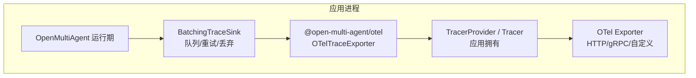
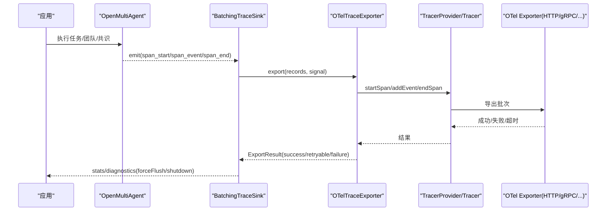
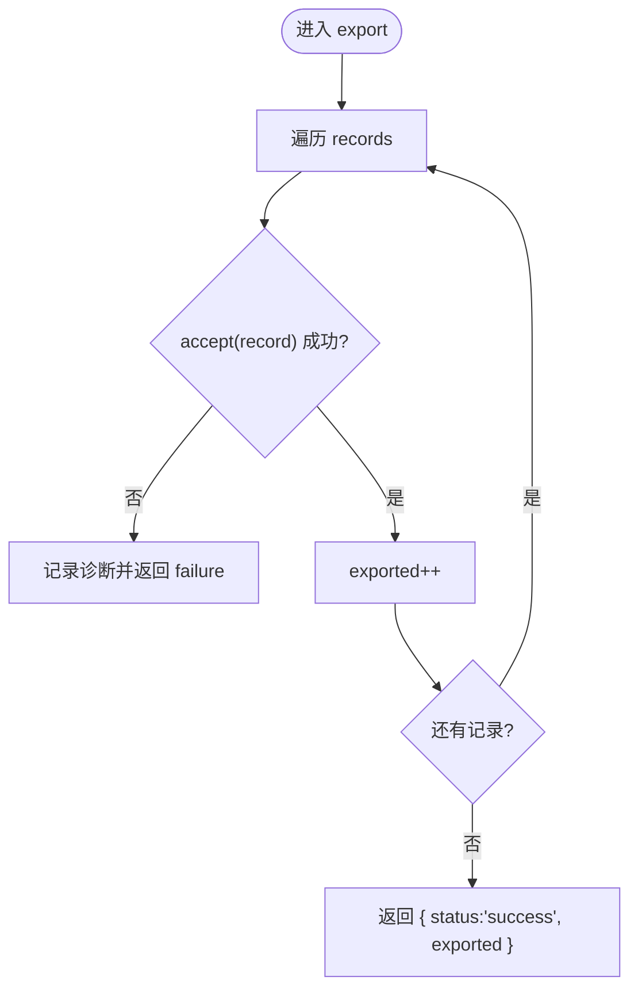
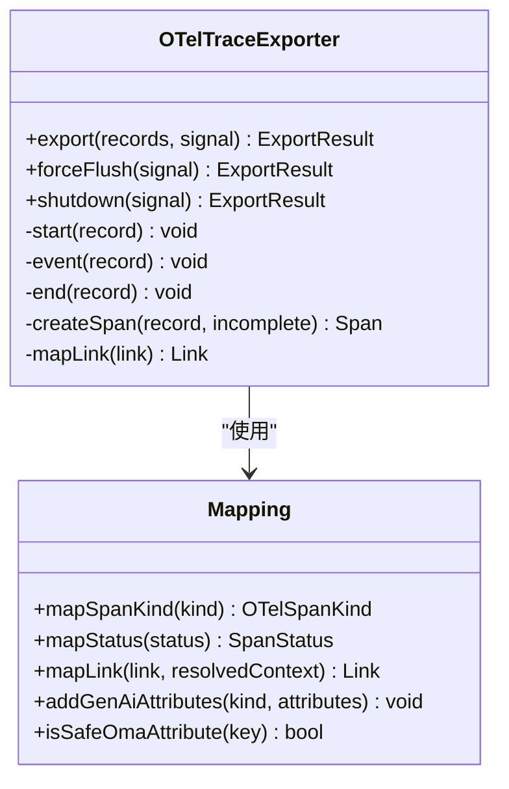
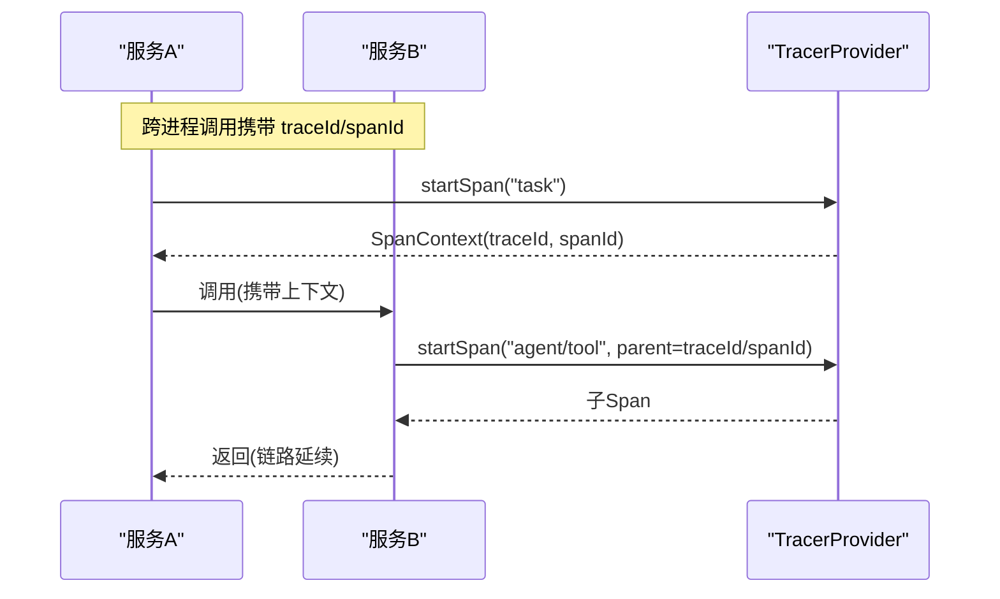
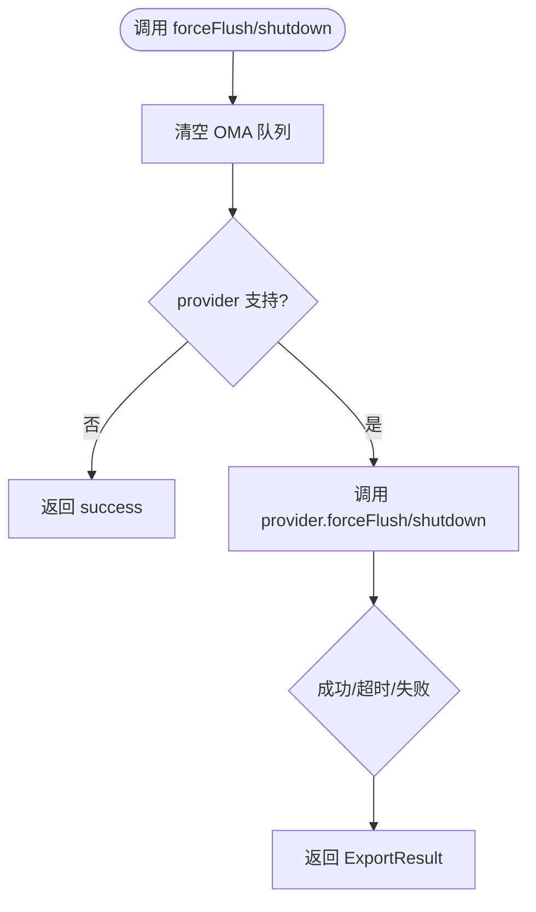
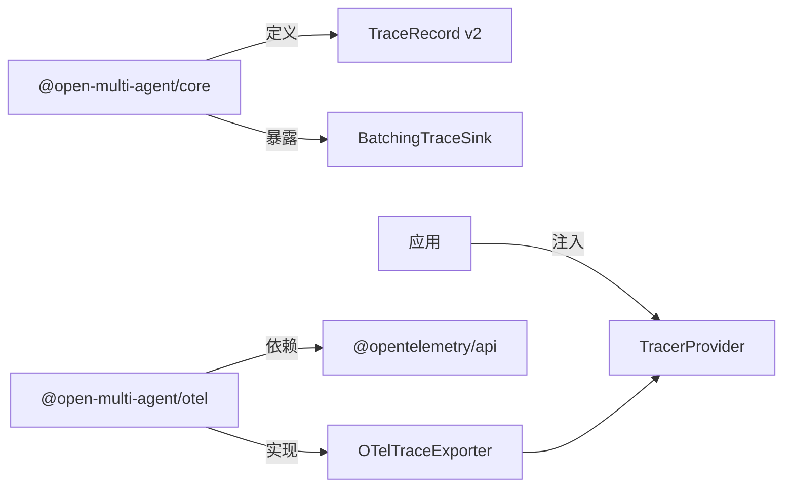
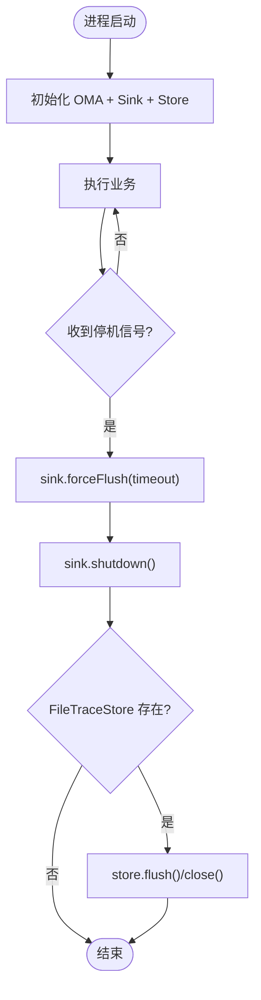

# OpenTelemetry 集成

<cite>
**本文引用的文件**
- [observability.md](file://docs/observability.md)
- [observability-migration.md](file://docs/observability-migration.md)
- [observability-performance.md](file://docs/observability-performance.md)
- [packages/otel/README.md](file://packages/otel/README.md)
- [packages/otel/src/index.ts](file://packages/otel/src/index.ts)
- [packages/otel/src/exporter.ts](file://packages/otel/src/exporter.ts)
- [packages/otel/src/mapping.ts](file://packages/otel/src/mapping.ts)
- [packages/otel/package.json](file://packages/otel/package.json)
- [packages/core/src/observability/records.ts](file://packages/core/src/observability/records.ts)
</cite>

## 目录
1. [简介](#简介)
2. [项目结构](#项目结构)
3. [核心组件](#核心组件)
4. [架构总览](#架构总览)
5. [详细组件分析](#详细组件分析)
6. [依赖关系分析](#依赖关系分析)
7. [性能与生产部署](#性能与生产部署)
8. [故障排查指南](#故障排查指南)
9. [结论](#结论)
10. [附录](#附录)

## 简介
本文件系统性说明 Open Multi-Agent（OMA）与 OpenTelemetry（OTel）的集成方案，覆盖以下主题：
- OMA 观测数据模型与导出管线（TraceRecord v2、Sink/Exporter、Batching 队列）
- OTel 适配器如何把 OMA 记录映射为 Span、事件和 Link
- 分布式追踪实现：跨服务追踪、上下文传播、链路关联
- 采样策略配置建议（概率、规则、自适应）
- 遥测数据导出传输协议（HTTP、gRPC 等）
- 生产环境部署要点：性能优化、内存管理、生命周期与故障排查

## 项目结构
OMA 将观测能力拆分为“核心包”和“可选 OTel 适配器包”，二者职责清晰、可独立演进：
- @open-multi-agent/core：定义 TraceRecord v2、Sink/Exporter 抽象、批处理队列、本地存储（InMemory/File），以及运行时埋点生成
- @open-multi-agent/otel：仅做适配层，不持有全局 TracerProvider，由应用负责构建并注入 provider/tracer

图示来源
- [packages/otel/src/exporter.ts:139-189](file://packages/otel/src/exporter.ts#L139-L189)
- [packages/otel/src/index.ts:12-16](file://packages/otel/src/index.ts#L12-L16)
- [observability.md:185-223](file://docs/observability.md#L185-L223)

章节来源
- [observability.md:185-223](file://docs/observability.md#L185-L223)
- [packages/otel/README.md:1-39](file://packages/otel/README.md#L1-L39)
- [packages/otel/src/index.ts:1-26](file://packages/otel/src/index.ts#L1-L26)

## 核心组件
- TraceRecord v2：运行时产生的稳定结构化记录（span_start/span_event/span_end），包含 runId、traceId、spanId、links、status、attributes 等
- Sink/Exporter：同步热路径 Sink 接收记录；异步 Exporter 负责批量投递
- BatchingTraceSink：带容量上限、退避重试、丢弃策略的批处理队列
- OTelTraceExporter：将 TraceRecord 转换为 OTel Span/Event/Link，交由应用提供的 TracerProvider 导出
- Mapping：安全属性白名单、状态/Kind/Link 映射、GenAI 兼容字段补充

章节来源
- [packages/core/src/observability/records.ts:8-56](file://packages/core/src/observability/records.ts#L8-L56)
- [observability.md:151-179](file://docs/observability.md#L151-L179)
- [observability.md:185-223](file://docs/observability.md#L185-L223)
- [packages/otel/src/mapping.ts:23-33](file://packages/otel/src/mapping.ts#L23-L33)
- [packages/otel/src/mapping.ts:34-103](file://packages/otel/src/mapping.ts#L34-L103)
- [packages/otel/src/mapping.ts:154-195](file://packages/otel/src/mapping.ts#L154-L195)
- [packages/otel/src/mapping.ts:197-222](file://packages/otel/src/mapping.ts#L197-L222)

## 架构总览
下图展示从 OMA 运行期到 OTel 后端的全链路：

图示来源
- [packages/otel/src/exporter.ts:176-189](file://packages/otel/src/exporter.ts#L176-L189)
- [packages/otel/src/exporter.ts:220-322](file://packages/otel/src/exporter.ts#L220-L322)
- [observability.md:527-570](file://docs/observability.md#L527-L570)

## 详细组件分析

### TraceRecord v2 与 Sink/Exporter 契约
- Record 类型：span_start、span_event、span_end，含 schemaVersion=2、recordId、sequence、runId、attempt、traceId、spanId、parentSpanId、kind、name、attributes、links、status、error 等
- Sink：同步 emit，绝不阻塞业务执行
- Exporter：异步 export，返回 delivered prefix，支持 success/retryable/failure

图示来源
- [packages/otel/src/exporter.ts:176-189](file://packages/otel/src/exporter.ts#L176-L189)
- [packages/core/src/observability/records.ts:8-56](file://packages/core/src/observability/records.ts#L8-L56)

章节来源
- [packages/core/src/observability/records.ts:8-56](file://packages/core/src/observability/records.ts#L8-L56)
- [observability.md:151-179](file://docs/observability.md#L151-L179)
- [observability.md:185-223](file://docs/observability.md#L185-L223)

### OTel 适配器：Span/事件/链接映射
- Span 创建：根据 kind 映射 CLIENT/INTERNAL，根 span 使用 ROOT_CONTEXT 避免被应用当前上下文污染
- 事件：first_chunk 计算 TTFT，其他事件以 oma.* 前缀命名
- 链接：优先解析同进程已观测到的 SpanContext；否则构造远程 link（TraceFlags.NONE, isRemote=true）
- 状态：error/timeout/budget_exhausted 映射为 ERROR，其余保持 UNSET，同时保留 oma.status
- 隐私：仅允许低敏感 oma.* 白名单，过滤 prompt/completion/content/message/argument/result/reasoning/thinking/payload 等

图示来源
- [packages/otel/src/exporter.ts:139-189](file://packages/otel/src/exporter.ts#L139-L189)
- [packages/otel/src/exporter.ts:220-322](file://packages/otel/src/exporter.ts#L220-L322)
- [packages/otel/src/mapping.ts:154-195](file://packages/otel/src/mapping.ts#L154-L195)
- [packages/otel/src/mapping.ts:197-222](file://packages/otel/src/mapping.ts#L197-L222)

章节来源
- [packages/otel/src/exporter.ts:139-189](file://packages/otel/src/exporter.ts#L139-L189)
- [packages/otel/src/exporter.ts:220-322](file://packages/otel/src/exporter.ts#L220-L322)
- [packages/otel/src/mapping.ts:34-103](file://packages/otel/src/mapping.ts#L34-L103)
- [packages/otel/src/mapping.ts:154-195](file://packages/otel/src/mapping.ts#L154-L195)
- [packages/otel/src/mapping.ts:197-222](file://packages/otel/src/mapping.ts#L197-L222)

### 分布式追踪：跨服务、上下文传播与链路关联
- 跨服务追踪：通过 OTel 标准 SpanContext 在 HTTP/gRPC 等协议间传播 traceId/spanId/flags
- 上下文传播：适配器在创建子 span 时基于 parentSpanId 查找已观测到的 SpanContext；根 span 强制使用 ROOT_CONTEXT，避免被应用当前上下文污染
- 链路关联：DAG/委托/合成消费/恢复续接通过 Link 表达；同进程可直接解析为 SDK SpanContext，跨进程则以远程 link 形式保留 OMA 目标 ID

图示来源
- [packages/otel/src/exporter.ts:303-322](file://packages/otel/src/exporter.ts#L303-L322)
- [packages/otel/src/mapping.ts:177-195](file://packages/otel/src/mapping.ts#L177-L195)

章节来源
- [packages/otel/src/exporter.ts:303-322](file://packages/otel/src/exporter.ts#L303-L322)
- [packages/otel/src/mapping.ts:177-195](file://packages/otel/src/mapping.ts#L177-L195)

### 采样策略配置（概率、规则、自适应）
- 概率采样：在应用侧配置 TracerProvider 的概率采样器（例如恒定为 100% 或按流量比例采样）
- 规则采样：结合资源属性（如 environment、release、tenantId）与采样决策，对关键租户/环境提高采样率
- 自适应采样：依据错误率、延迟分位、吞吐等指标动态调整采样率（需配合后端/SDK 能力）
- 注意：@open-multi-agent/otel 不持有全局 Provider，也不内置采样器；采样策略由应用自行配置 TracerProvider

章节来源
- [packages/otel/README.md:17-39](file://packages/otel/README.md#L17-L39)
- [packages/otel/src/exporter.ts:55-76](file://packages/otel/src/exporter.ts#L55-L76)

### 遥测数据导出：传输协议与生命周期
- 传输协议：应用选择 OTLP（HTTP/gRPC）或其他 Exporter；适配器仅对接 OTel API，不引入 OTLP 依赖
- 生命周期：
  - forceFlush：先清空 OMA 队列，再委派 provider.forceFlush（若存在）
  - shutdown：默认不关闭 provider；仅在明确声明 ownership 时关闭
  - 超时与失败：统一映射为 ExportResult，不影响业务结果

图示来源
- [packages/otel/src/exporter.ts:191-206](file://packages/otel/src/exporter.ts#L191-L206)
- [packages/otel/src/exporter.ts:393-421](file://packages/otel/src/exporter.ts#L393-L421)
- [observability.md:527-570](file://docs/observability.md#L527-L570)

章节来源
- [packages/otel/src/exporter.ts:191-206](file://packages/otel/src/exporter.ts#L191-L206)
- [packages/otel/src/exporter.ts:393-421](file://packages/otel/src/exporter.ts#L393-L421)
- [observability.md:527-570](file://docs/observability.md#L527-L570)

## 依赖关系分析
- 耦合与内聚：
  - core 提供稳定的 TraceRecord v2 与 Sink/Exporter 接口，隔离具体导出实现
  - otel 包仅依赖 @opentelemetry/api，不持有全局状态，内聚于适配映射
- 外部依赖：
  - 应用负责安装并配置 OTel SDK/Exporter（HTTP/gRPC/自定义）
  - 版本约束：core ^1.11.0，otel ^0.1.x，peerDependencies 要求 @opentelemetry/api ^1.9.0

图示来源
- [packages/otel/package.json:54-66](file://packages/otel/package.json#L54-L66)
- [packages/otel/src/index.ts:12-16](file://packages/otel/src/index.ts#L12-L16)
- [packages/core/src/observability/records.ts:8-56](file://packages/core/src/observability/records.ts#L8-L56)

章节来源
- [packages/otel/package.json:54-66](file://packages/otel/package.json#L54-L66)
- [packages/otel/src/index.ts:12-16](file://packages/otel/src/index.ts#L12-L16)

## 性能与生产部署
- 队列与背压：
  - 默认队列大小、字节上限、单条记录上限、批大小、调度间隔、导出超时、重试次数与指数退避均有明确上限
  - 满队时按优先级丢弃：stream_chunk > other events > span_start > span_end
- 生命周期与优雅停机：
  - Serverless：每次调用后短超时 flush，不关闭共享 sink/provider
  - CLI：run → flush → store.flush（如有）→ sink.shutdown → store.close
  - 长服务：停止接受新请求 → flush → shutdown → store.close → provider.shutdown
- 内存与持久化：
  - InMemoryTraceStore：测试/本地调试用，非生产数据库
  - FileTraceStore：单进程追加日志，fsync 边界在 flush/close；支持 compact
- 性能基线：
  - 无 sink 开销、批处理入队、OTel 转换/处理器 p95 预算有明确基准与 CI 门限

图示来源
- [observability.md:527-570](file://docs/observability.md#L527-L570)
- [observability.md:572-600](file://docs/observability.md#L572-L600)
- [observability.md:255-383](file://docs/observability.md#L255-L383)
- [observability-performance.md:8-20](file://docs/observability-performance.md#L8-L20)

章节来源
- [observability.md:527-600](file://docs/observability.md#L527-L600)
- [observability.md:255-383](file://docs/observability.md#L255-L383)
- [observability-performance.md:8-20](file://docs/observability-performance.md#L8-L20)

## 故障排查指南
- 常见诊断码：
  - span_start_failed / span_event_failed / span_end_failed：OTel tracer 拒绝记录
  - duplicate_span_start / duplicate_span_end：重复记录被忽略
  - orphan_event：事件到达时无对应 open span
  - incomplete_span：缺少 span_end 或提前关闭
  - force_flush_timeout / shutdown_timeout：provider 操作超时
  - shutdown_skipped / shutdown_failed：未关闭或关闭失败
- 定位步骤：
  - 检查 onDiagnostic 回调输出与 getStats 统计（dropped/failed/lastError）
  - 确认 provider 是否实现了 forceFlush/shutdown，且超时合理
  - 校验 Link 目标是否在相同进程已被观测（resolved=false 表示跨进程）
  - 核对隐私白名单导致属性被过滤（prompt/completion 等不会导出）

章节来源
- [packages/otel/src/exporter.ts:31-48](file://packages/otel/src/exporter.ts#L31-L48)
- [packages/otel/src/exporter.ts:113-133](file://packages/otel/src/exporter.ts#L113-L133)
- [packages/otel/src/exporter.ts:220-322](file://packages/otel/src/exporter.ts#L220-L322)
- [packages/otel/src/exporter.ts:393-421](file://packages/otel/src/exporter.ts#L393-L421)
- [packages/otel/src/mapping.ts:34-103](file://packages/otel/src/mapping.ts#L34-L103)

## 结论
- OMA 通过 TraceRecord v2 与 Sink/Exporter 抽象解耦了运行时与导出实现
- @open-multi-agent/otel 仅做轻量适配，不持有全局状态，确保应用完全掌控 TracerProvider、采样与导出
- 分布式追踪通过标准 SpanContext 与 Link 实现跨服务关联；TTFT、token/cost、错误等关键指标以稳定属性暴露
- 生产部署应重视队列背压、优雅停机、磁盘 fsync 边界与诊断监控；采样与传输协议由应用按需选型

## 附录
- 迁移路径：从 onTrace 逐步升级到 v2 sinks、BatchingTraceSink、TraceStore/OTel，最终接管生命周期
- 参考示例：仓库内提供了 in-memory/file-trace-store、otel-provider、CLI/serverless 生命周期示例

章节来源
- [observability-migration.md:24-155](file://docs/observability-migration.md#L24-L155)
- [packages/otel/README.md:65-77](file://packages/otel/README.md#L65-L77)