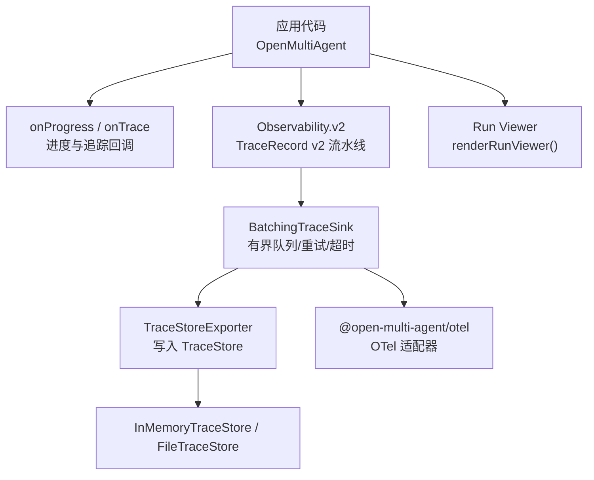
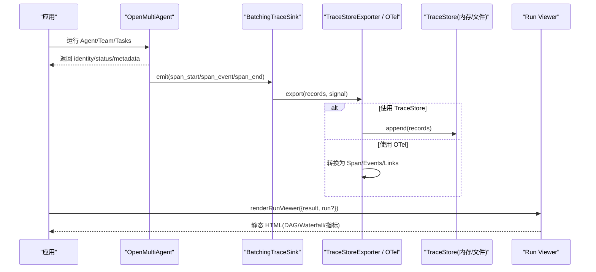
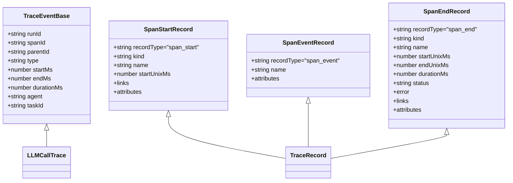
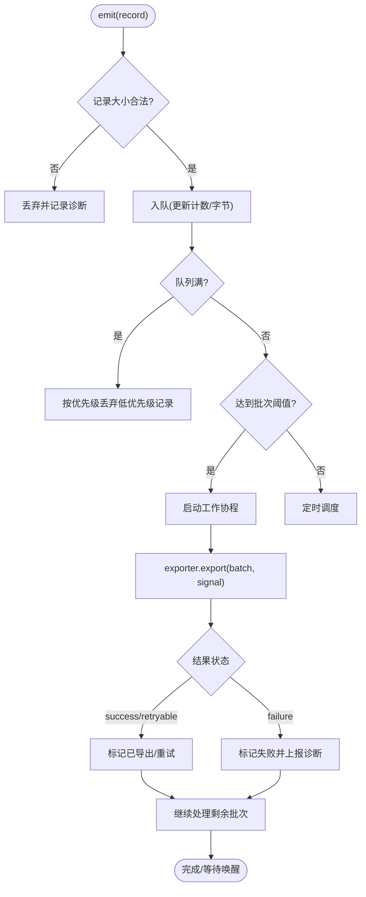
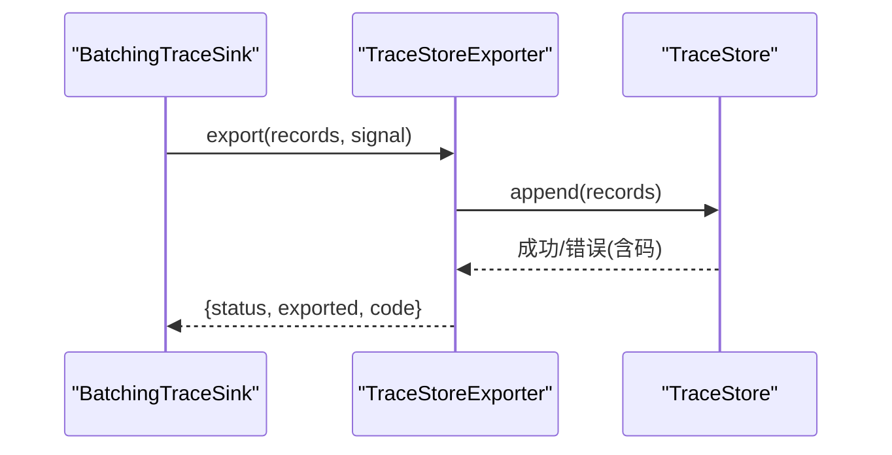
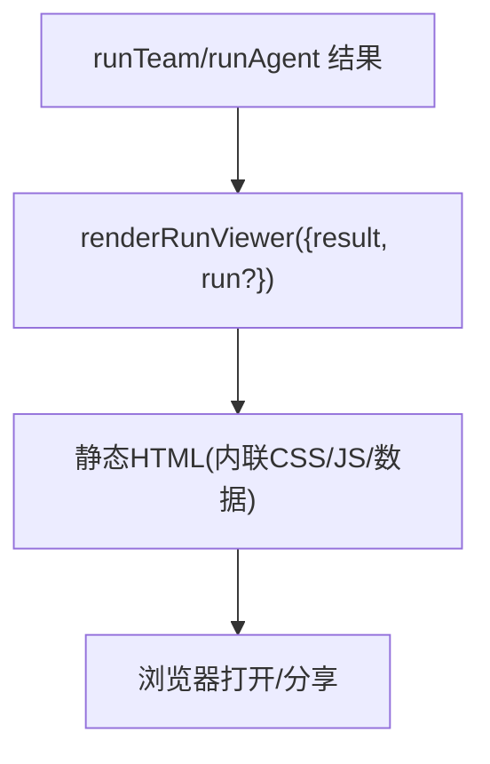
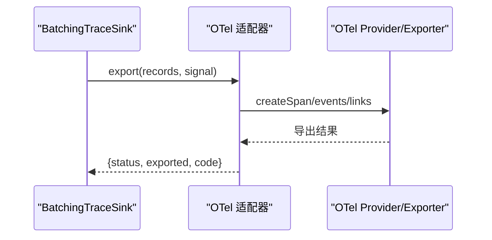
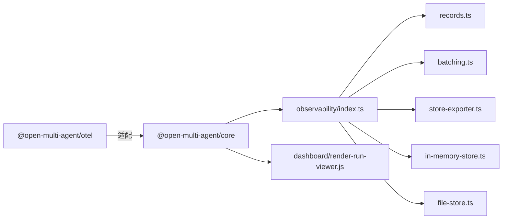

# 可观测性

<cite>
**本文引用的文件**
- [observability.md](file://docs/observability.md)
- [observability-performance.md](file://docs/observability-performance.md)
- [observability-migration.md](file://docs/observability-migration.md)
- [otel README](file://packages/otel/README.md)
- [records.ts](file://packages/core/src/observability/records.ts)
- [batching.ts](file://packages/core/src/observability/batching.ts)
- [store-exporter.ts](file://packages/core/src/observability/store-exporter.ts)
- [index.ts（核心导出）](file://packages/core/src/index.ts)
- [types.ts（TraceEvent）](file://packages/core/src/types.ts)
- [runner.ts（LLM 追踪）](file://packages/core/src/agent/runner.ts)
</cite>

## 目录
1. [简介](#简介)
2. [项目结构](#项目结构)
3. [核心组件](#核心组件)
4. [架构总览](#架构总览)
5. [详细组件分析](#详细组件分析)
6. [依赖关系分析](#依赖关系分析)
7. [性能考量](#性能考量)
8. [故障排查指南](#故障排查指南)
9. [结论](#结论)
10. [附录](#附录)

## 简介
本文件系统性介绍 Open Multi-Agent 的可观测性功能，覆盖执行追踪、离线查看器、指标与告警、OpenTelemetry 集成以及监控最佳实践。目标是帮助开发者构建可维护、可调试、可演进的智能体应用。

## 项目结构
Open Multi-Agent 的可观测性由“运行时事件 + 结构化追踪 + 离线查看”三层组成：
- 轻量级进度事件：用于日志、终端输出或实时 UI。
- 结构化追踪跨度：以 v2 TraceRecord 为核心，支持批处理、存储与 OTel 适配。
- 离线 Run Viewer：基于单次运行的任务 DAG 与 Waterfall 可视化，便于事后分析与调试。

图表来源
- [observability.md:1-11](file://docs/observability.md#L1-L11)
- [observability.md:185-223](file://docs/observability.md#L185-L223)
- [observability.md:224-287](file://docs/observability.md#L224-L287)
- [otel README:1-34](file://packages/otel/README.md#L1-L34)

章节来源
- [observability.md:1-11](file://docs/observability.md#L1-L11)

## 核心组件
- TraceEvent（v1 兼容）：轻量级事件，包含 spanId、parentId、起止时间、token 等，向后兼容现有 onTrace 集成。
- TraceRecord v2：结构化追踪记录，包含 span_start/span_event/span_end，具备 runId、attempt、traceId、spanId、links、attributes、status 等稳定字段。
- Sink/Exporter：同步热路径的 TraceSink 与异步批处理的 TraceExporter；默认提供 BatchingTraceSink。
- TraceStore：介质无关的持久化与查询契约；内置 InMemoryTraceStore 与 Node-only FileTraceStore。
- Run Viewer：单运行静态 HTML 视图，支持 DAG/Waterfall、过滤、搜索与路由决策摘要。
- OTel 适配器：将 TraceRecord 批次映射为 OTel Span/Events/Links，不接管全局 Provider。

章节来源
- [types.ts:2665-2705](file://packages/core/src/types.ts#L2665-L2705)
- [records.ts:1-77](file://packages/core/src/observability/records.ts#L1-L77)
- [observability.md:151-184](file://docs/observability.md#L151-L184)
- [observability.md:185-223](file://docs/observability.md#L185-L223)
- [observability.md:224-287](file://docs/observability.md#L224-L287)
- [observability.md:670-731](file://docs/observability.md#L670-L731)
- [otel README:1-34](file://packages/otel/README.md#L1-L34)

## 架构总览
下图展示从执行到可视化的端到端数据流：应用调用编排器产生身份与状态，运行时生成 v2 TraceRecord，经 Sink 批处理与可选存储/OTel 导出，最终通过 Run Viewer 进行离线分析。

图表来源
- [observability.md:12-41](file://docs/observability.md#L12-L41)
- [observability.md:185-223](file://docs/observability.md#L185-L223)
- [observability.md:224-287](file://docs/observability.md#L224-L287)
- [observability.md:670-731](file://docs/observability.md#L670-L731)
- [otel README:79-123](file://packages/otel/README.md#L79-L123)

## 详细组件分析

### 执行追踪：TraceEvent 与 TraceRecord v2
- TraceEvent（v1）：向后兼容的事件集合，涵盖 LLM、工具、任务、Agent、计划就绪、流式、共识与路由决策等类型，携带 spanId、parentId、起止时间与 token 统计。
- TraceRecord v2：以 schemaVersion=2 的稳定结构表达 span_start、span_event、span_end，包含 runId、attempt、traceId、spanId、parentSpanId、links、attributes、status 等，支持幂等 recordId 与严格递增 sequence。
- 运行时注入：Agent 的 LLM 调用会同时产出 v1 事件与 v2 跨度属性（如模型、提供者、阶段、轮次、任务 ID），并记录 TTFT 等关键时序信息。

图表来源
- [types.ts:2665-2705](file://packages/core/src/types.ts#L2665-L2705)
- [records.ts:1-77](file://packages/core/src/observability/records.ts#L1-L77)
- [runner.ts:597-635](file://packages/core/src/agent/runner.ts#L597-L635)

章节来源
- [types.ts:2665-2705](file://packages/core/src/types.ts#L2665-L2705)
- [records.ts:1-77](file://packages/core/src/observability/records.ts#L1-L77)
- [runner.ts:597-635](file://packages/core/src/agent/runner.ts#L597-L635)

### 追踪数据收集与批处理
- BatchingTraceSink：零依赖、有界队列的异步传输层，提供入队、批导出、重试、退避、超时、丢弃策略与诊断统计。
- 优先级与丢弃：当队列容量不足时，按优先级保留（span_end > span_start > 其他事件 > stream_chunk），避免业务执行阻塞。
- 生命周期：forceFlush 捕获水位线并委托 exporter.forceFlush；shutdown 原子停止接收、flush 并关闭 exporter。

图表来源
- [batching.ts:14-41](file://packages/core/src/observability/batching.ts#L14-L41)
- [batching.ts:75-80](file://packages/core/src/observability/batching.ts#L75-L80)
- [batching.ts:210-242](file://packages/core/src/observability/batching.ts#L210-L242)
- [batching.ts:244-288](file://packages/core/src/observability/batching.ts#L244-L288)
- [batching.ts:351-399](file://packages/core/src/observability/batching.ts#L351-L399)

章节来源
- [batching.ts:14-41](file://packages/core/src/observability/batching.ts#L14-L41)
- [batching.ts:210-242](file://packages/core/src/observability/batching.ts#L210-L242)
- [batching.ts:244-288](file://packages/core/src/observability/batching.ts#L244-L288)
- [batching.ts:351-399](file://packages/core/src/observability/batching.ts#L351-L399)

### 存储与查询：TraceStore
- TraceStoreExporter：将批次安全地写入 TraceStore，利用 store 的 recordId 去重保证幂等。
- InMemoryTraceStore：适用于测试与本地检查，无持久化。
- FileTraceStore：Node-only 参考实现，追加型 NDJSON 信封，支持 flush/fsync、压缩、删除与保留策略；打开时重建索引，异常恢复健壮。

图表来源
- [store-exporter.ts:1-28](file://packages/core/src/observability/store-exporter.ts#L1-L28)
- [observability.md:224-287](file://docs/observability.md#L224-L287)

章节来源
- [store-exporter.ts:1-28](file://packages/core/src/observability/store-exporter.ts#L1-L28)
- [observability.md:224-287](file://docs/observability.md#L224-L287)

### 离线查看器：Run Viewer
- renderRunViewer：接受 TeamRunResult 与/或 StoredRun，生成自包含静态 HTML，无网络请求与远程资源。
- 能力：DAG 与 Waterfall 联动、搜索与过滤、路由决策摘要、令牌与成本事实、安全脱敏字段。
- CLI：oma run/dashboard 命令支持运行时捕获与历史导出。

图表来源
- [observability.md:670-731](file://docs/observability.md#L670-L731)
- [index.ts:111-130](file://packages/core/src/index.ts#L111-L130)

章节来源
- [observability.md:670-731](file://docs/observability.md#L670-L731)
- [index.ts:111-130](file://packages/core/src/index.ts#L111-L130)

### 指标收集与告警
- 性能指标：通过 sink.getStats() 获取 accepted/exported/retried/failed/dropped/queued 等计数与最后错误码；flush/shutdown 返回累计统计。
- 业务指标：可从 TraceRecord attributes 中聚合 token/cost、模型/提供者、任务/代理维度指标（需结合下游系统）。
- 告警建议：对 dropped、failed、lastError 设置告警；对 flush/shutdown 超时与 exporter 拒绝进行告警；避免将遥测失败转为业务失败。

章节来源
- [batching.ts:282-288](file://packages/core/src/observability/batching.ts#L282-L288)
- [observability.md:572-600](file://docs/observability.md#L572-L600)
- [observability-migration.md:166-178](file://docs/observability-migration.md#L166-L178)

### OpenTelemetry 集成
- 适配器：createOtelTraceSink 将 TraceRecord 批次映射为 OTel Span/Events/Links，不读取/替换全局 Provider。
- 配置：传入应用拥有的 tracer/tracerProvider 与 metadata；可选择 shutdownOnShutdown 控制 Provider 生命周期。
- 映射：run/agent/task/llm/tool/consensus/checkpoint 等成为 Span；retry/verdict/stream 成为事件；DAG/restore/synthesis 成为 Links；保留 OMA 稳定属性与状态。
- 隐私：默认不导出 prompt/completion/工具参数/结果/凭据/推理内容；仅转发低敏感度 oma.* 白名单。

图表来源
- [otel README:17-77](file://packages/otel/README.md#L17-L77)
- [otel README:79-123](file://packages/otel/README.md#L79-L123)
- [otel README:125-145](file://packages/otel/README.md#L125-L145)

章节来源
- [otel README:17-77](file://packages/otel/README.md#L17-L77)
- [otel README:79-123](file://packages/otel/README.md#L79-L123)
- [otel README:125-145](file://packages/otel/README.md#L125-L145)

## 依赖关系分析
- 核心包导出：仪表盘渲染函数与类型定义，供上层应用直接消费。
- 可观测性子模块：records、batching、store-exporter、in-memory-store、file-store 等构成完整链路。
- OTel 包独立：不与 core 耦合，避免引入 OTLP 依赖与全局 Provider 污染。

图表来源
- [index.ts:111-130](file://packages/core/src/index.ts#L111-L130)
- [observability/index.ts:1-68](file://packages/core/src/observability/index.ts#L1-L68)
- [otel README:1-34](file://packages/otel/README.md#L1-L34)

章节来源
- [index.ts:111-130](file://packages/core/src/index.ts#L111-L130)
- [observability/index.ts:1-68](file://packages/core/src/observability/index.ts#L1-L68)

## 性能考量
- 预算与基线：文档记录了 no-sink 回归、遗留回调分发、批处理入队、OTel 转换等 p95 预算与 CI 门限。
- 矩阵基准：覆盖 InMemory/FileTraceStore 追加、fsync、reopen、查询、压缩；OTel 转换与内存处理器；不同规模元数据信封与流式事件。
- 存储解读：append 为写完成，flush/close 为 fsync 边界；reopen 包含扫描与索引重建；压缩为同目录临时文件+原子重命名。

章节来源
- [observability-performance.md:8-20](file://docs/observability-performance.md#L8-L20)
- [observability-performance.md:22-62](file://docs/observability-performance.md#L22-L62)
- [observability-performance.md:64-118](file://docs/observability-performance.md#L64-L118)
- [observability-performance.md:129-141](file://docs/observability-performance.md#L129-L141)

## 故障排查指南
- 常见诊断码：EXPORT_TIMEOUT、EXPORT_REJECTED、STORE_UNSUPPORTED_SCHEMA_VERSION、STORE_VALIDATION_FAILED、SHUTDOWN_TIMEOUT、SHUTDOWN_FAILED 等。
- 定位步骤：
  - 检查 sink.getStats() 的 dropped/failed/lastError 与 queued 指标。
  - 确认 forceFlush/shutdown 是否超时或被拒绝。
  - 校验 TraceStore 版本与 schema 兼容性。
  - 对 OTel 适配器，确认 provider 已正确创建且未被全局覆盖。
- 降级与回滚：保持 onTrace 与 v2 并行迁移阶段，逐步切换至 BatchingTraceSink、TraceStore/OTel，并在生产前演练拒绝/挂起/部分交付场景。

章节来源
- [batching.ts:351-399](file://packages/core/src/observability/batching.ts#L351-L399)
- [store-exporter.ts:9-25](file://packages/core/src/observability/store-exporter.ts#L9-L25)
- [observability-migration.md:157-178](file://docs/observability-migration.md#L157-L178)

## 结论
Open Multi-Agent 的可观测性以稳定的 TraceRecord v2 为中心，提供高性能、有界、可恢复的数据采集与导出通道，并通过 Run Viewer 与 OTel 适配器打通离线分析与分布式追踪。遵循本文的最佳实践与性能基线，可在不影响业务结果的前提下，获得高质量的可观测性与可维护性。

## 附录
- 迁移路径：从 onTrace 到 v2 的分阶段迁移指南，包括桥接、批处理、存储/OTel 选择与生命周期管理。
- 隐私边界：默认不采集提示词、补全、工具参数/结果与推理内容；敏感字段在 v2 管线中被过滤。
- 推荐实践：
  - 始终为 sink/store/provider 配置显式生命周期与超时。
  - 对 dropped/failed/lastError 建立告警，但不将其转化为业务失败。
  - 在生产环境优先使用 FileTraceStore 并定期 compact；对 OTel 使用应用自有 Provider。
  - 使用 Run Viewer 进行事后复盘，并结合 ExecutionReceipt 验证实际拓扑。

章节来源
- [observability-migration.md:1-33](file://docs/observability-migration.md#L1-L33)
- [observability.md:743-768](file://docs/observability.md#L743-L768)