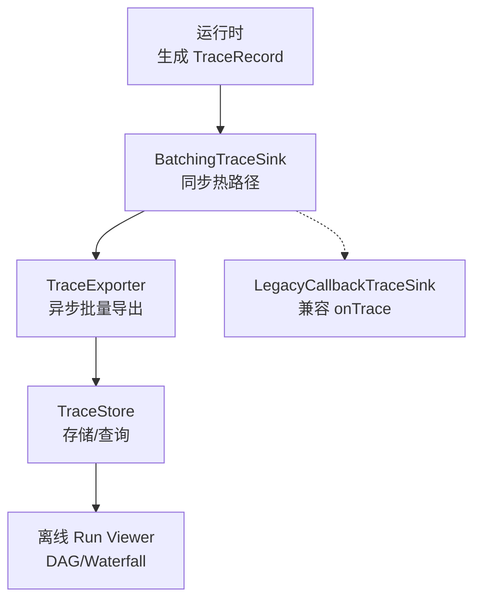
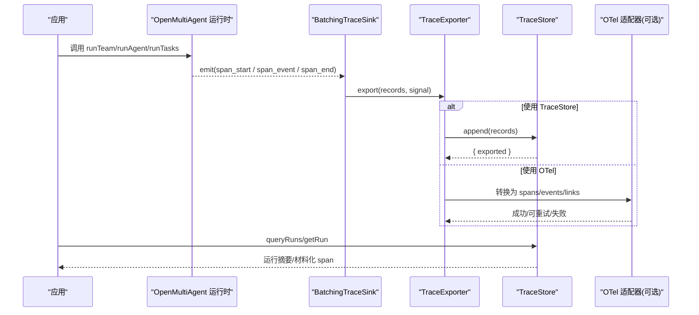
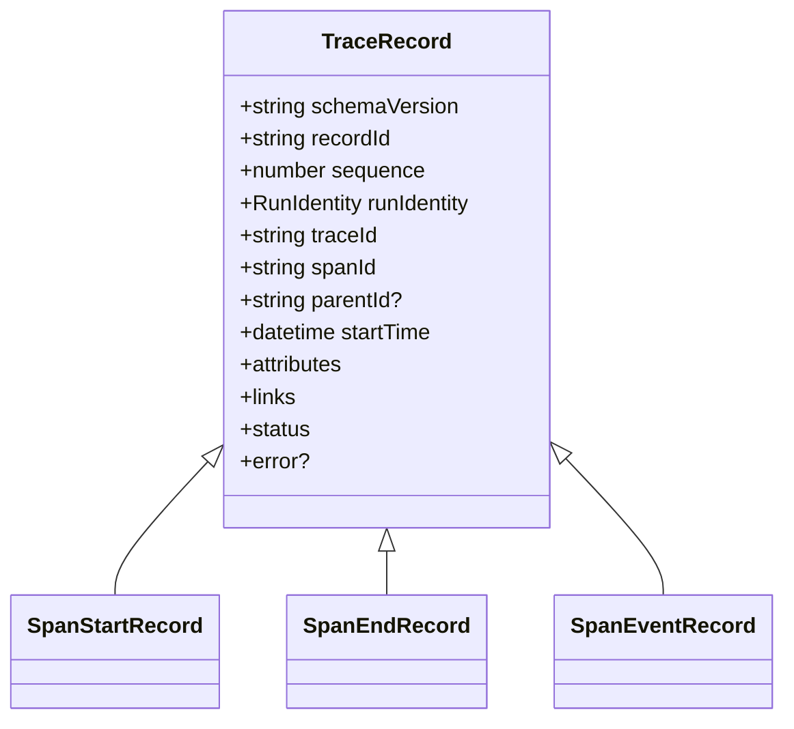
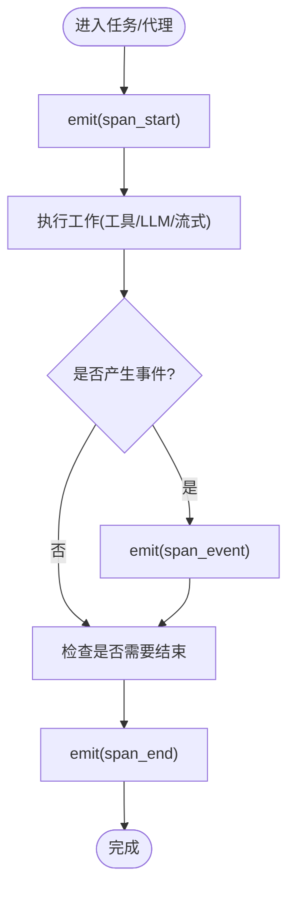
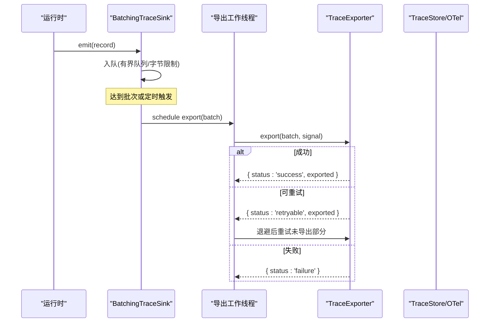
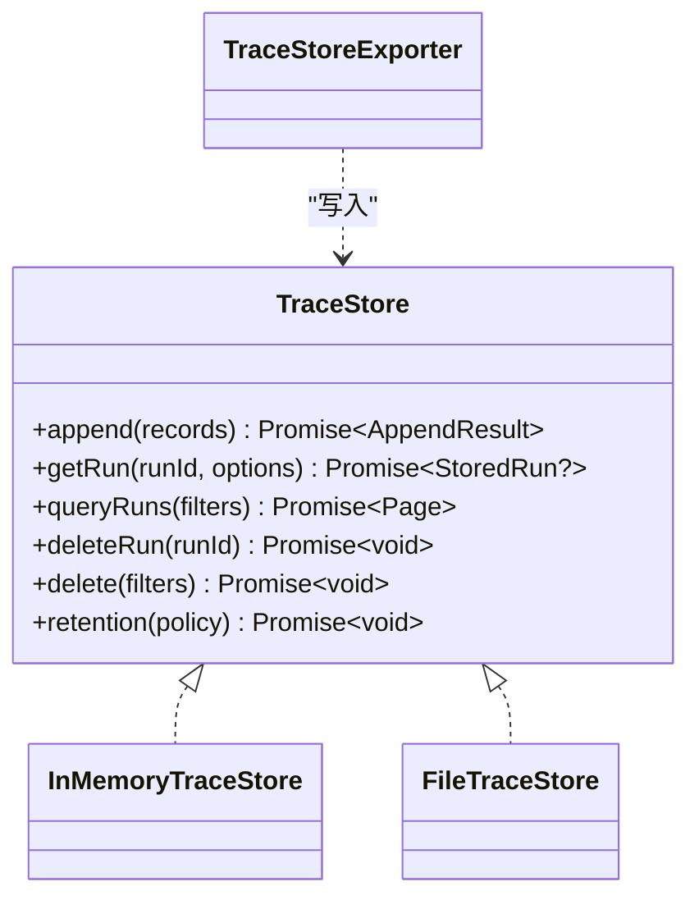
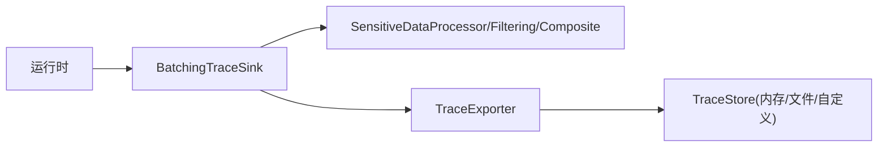

# 执行追踪

<cite>
**本文引用的文件**
- [observability.md](file://docs/observability.md)
- [types.ts](file://packages/core/src/types.ts)
- [trace.ts](file://packages/core/src/utils/trace.ts)
- [batching.ts](file://packages/core/src/observability/batching.ts)
- [composite.ts](file://packages/core/src/observability/composite.ts)
- [in-memory-store.ts](file://packages/core/src/observability/in-memory-store.ts)
- [store-exporter.ts](file://packages/core/src/observability/store-exporter.ts)
- [legacy-callback.ts](file://packages/core/src/observability/legacy-callback.ts)
- [materialize.ts](file://packages/core/src/observability/materialize.ts)
- [records.ts](file://packages/core/src/observability/records.ts)
- [runtime.ts](file://packages/core/src/observability/runtime.ts)
- [sink.ts](file://packages/core/src/observability/sink.ts)
- [status.ts](file://packages/core/src/observability/status.ts)
- [store.ts](file://packages/core/src/observability/store.ts)
- [processors.ts](file://packages/core/src/observability/processors.ts)
</cite>

## 目录
1. [简介](#简介)
2. [项目结构](#项目结构)
3. [核心组件](#核心组件)
4. [架构总览](#架构总览)
5. [详细组件分析](#详细组件分析)
6. [依赖关系分析](#依赖关系分析)
7. [性能考量](#性能考量)
8. [故障排查指南](#故障排查指南)
9. [结论](#结论)
10. [附录](#附录)

## 简介
本章节面向希望理解与使用 Open Multi-Agent 执行追踪能力的开发者。文档围绕以下目标展开：
- 解释 TraceEvent 类型系统与 v2 TraceRecord 体系，包括 SpanStartRecord、SpanEndRecord、TraceRecord 等核心数据结构及其关系。
- 说明追踪数据的收集机制：追踪起点与终点记录、事件记录、性能指标（如 TTFT、token/cost）的采集方式。
- 介绍追踪导出器 TraceExporter 的实现与使用：批量处理、过滤处理、敏感数据处理。
- 详细说明追踪存储与查询接口：InMemoryTraceStore 的使用与自定义存储实现。
- 提供追踪配置最佳实践与性能优化建议。

## 项目结构
Open Multi-Agent 的可观测性能力由“运行时”、“导出器/接收器”、“存储”三部分组成，并通过统一的 TraceRecord v2 契约解耦：
- 运行时负责在关键执行点生成并发送 TraceRecord（span_start/span_event/span_end）。
- BatchingTraceSink 作为热路径上的同步出口，将记录异步批量化交给 TraceExporter。
- TraceStore 是存储介质无关的持久化与查询契约；InMemoryTraceStore 为参考实现，FileTraceStore 为本地文件参考实现。
- LegacyCallbackTraceSink 用于兼容旧的 onTrace 回调。

图表来源
- [runtime.ts:1-200](file://packages/core/src/observability/runtime.ts#L1-L200)
- [batching.ts:1-200](file://packages/core/src/observability/batching.ts#L1-L200)
- [store-exporter.ts:1-200](file://packages/core/src/observability/store-exporter.ts#L1-L200)
- [in-memory-store.ts:1-200](file://packages/core/src/observability/in-memory-store.ts#L1-L200)
- [legacy-callback.ts:1-200](file://packages/core/src/observability/legacy-callback.ts#L1-L200)

章节来源
- [observability.md:151-229](file://docs/observability.md#L151-L229)
- [observability.md:224-446](file://docs/observability.md#L224-L446)

## 核心组件
- TraceRecord v2 数据模型：以 span_start、span_event、span_end 描述一个 span 的生命周期，包含 schemaVersion、recordId、sequence、run identity、W3C trace/span id、时间戳、状态、安全属性与链接。
- TraceEvent 类型系统：v2 内部使用 TraceRecord；对外仍兼容 TraceEvent 联合类型，LegacyCallbackTraceSink 会将 v2 记录映射回旧事件对象。
- 运行身份与元数据：RunIdentity（runId、attempt、traceId、rootSpanId、links）、RunStatus、StructuredTraceError、TraceAttributeValue 等。
- 导出器与接收器：TraceSink（同步 emit）、TraceExporter（异步 export）、BatchingTraceSink（队列/重试/丢弃策略）、CompositeSink（组合多个 sink）、FilteringSink（过滤）、SensitiveDataProcessor（敏感数据处理）。
- 存储与查询：TraceStore 契约、InMemoryTraceStore 参考实现、FileTraceStore 本地文件实现、TraceStoreExporter 桥接导出到存储。

章节来源
- [types.ts:231-321](file://packages/core/src/types.ts#L231-L321)
- [observability.md:151-229](file://docs/observability.md#L151-L229)
- [observability.md:224-446](file://docs/observability.md#L224-L446)

## 架构总览
下图展示了从运行时产生追踪记录到最终可查询/可视化的完整链路，以及可选的 OTel 适配路径。

图表来源
- [runtime.ts:1-200](file://packages/core/src/observability/runtime.ts#L1-L200)
- [batching.ts:1-200](file://packages/core/src/observability/batching.ts#L1-L200)
- [store-exporter.ts:1-200](file://packages/core/src/observability/store-exporter.ts#L1-L200)
- [in-memory-store.ts:1-200](file://packages/core/src/observability/in-memory-store.ts#L1-L200)

## 详细组件分析

### TraceRecord v2 与 TraceEvent 类型系统
- TraceRecord 以 span_start 开始、零或多个 span_event、恰好一个 span_end 组成，具备幂等的关闭语义（首个 span_end 生效）。
- 层级关系通过 parent 包含生命周期，通过 links 表达非树关系（depends_on、consumed、delegated_from、continued_from）。
- v2 默认不采集 prompt/completion/tool 参数/结果等敏感内容；结构化凭证字段会被移除；链式推理内容不被捕获。
- 对外的 TraceEvent 联合类型保持向后兼容，LegacyCallbackTraceSink 将 v2 记录映射回旧事件。

图表来源
- [records.ts:1-200](file://packages/core/src/observability/records.ts#L1-L200)
- [observability.md:151-184](file://docs/observability.md#L151-L184)

章节来源
- [observability.md:151-184](file://docs/observability.md#L151-L184)
- [observability.md:616-668](file://docs/observability.md#L616-L668)

### 追踪数据收集机制
- 起点与终点：每个 span 必须产出 span_start 与 span_end；span_end 自包含，即使丢失 start/event 仍可还原。
- 事件记录：stream_chunk、retry、verdict、first_chunk 等作为 span_event 上报，避免引入额外子 span 的开销。
- 性能指标：TTFT 仅在真正流式路径中记录；聚合 chat 路径不会用总延迟替代 TTFT。LLM span 贡献 token/cost 统计，避免重复计数。
- 路由决策：每次 runTeam 拓扑选择会生成 routing_decision 事件与 kind=routing 的 span，附带模式、原因、置信度、routerVersion 等。

图表来源
- [runtime.ts:1-200](file://packages/core/src/observability/runtime.ts#L1-L200)
- [observability.md:151-184](file://docs/observability.md#L151-L184)
- [observability.md:616-668](file://docs/observability.md#L616-L668)

章节来源
- [observability.md:151-184](file://docs/observability.md#L151-L184)
- [observability.md:616-668](file://docs/observability.md#L616-L668)

### 追踪导出器（TraceExporter）与批量处理
- TraceSink 是同步热路径接口，emit(record): void 绝不 await。
- TraceExporter 是异步批量交付接口，export(records, signal) 返回已交付前缀数量及状态（success/retryable/failure）。
- BatchingTraceSink 提供有界队列、批次大小、调度延迟、导出超时、重试与退避策略；容量不足时按优先级丢弃（stream_chunk > other events > span_start > span_end），超大记录直接拒绝。
- CompositeSink 允许组合多个 sink；FilteringSink 支持基于条件的过滤；SensitiveDataProcessor 包装 sink 进行敏感数据脱敏。

图表来源
- [batching.ts:1-200](file://packages/core/src/observability/batching.ts#L1-L200)
- [sink.ts:1-200](file://packages/core/src/observability/sink.ts#L1-L200)
- [store-exporter.ts:1-200](file://packages/core/src/observability/store-exporter.ts#L1-L200)

章节来源
- [observability.md:185-223](file://docs/observability.md#L185-L223)
- [observability.md:572-600](file://docs/observability.md#L572-L600)

### 敏感数据处理
- 默认不采集 prompt/completion/tool 参数/结果；结构化凭证字段会被移除；链式推理内容不被捕获。
- SensitiveDataProcessor 包裹 sink，仅转发显式的低敏感度 allowlist；contentCapture 为保留扩展点，当前版本禁用。
- 旧版 onTrace 保留其已有的脱敏工具 I/O 字段，隐私面较宽。

章节来源
- [observability.md:743-768](file://docs/observability.md#L743-L768)
- [processors.ts:1-200](file://packages/core/src/observability/processors.ts#L1-L200)

### 追踪存储与查询（TraceStore）
- TraceStore 是存储介质无关的契约；InMemoryTraceStore 为内存参考实现，无持久化，适合测试与本地调试。
- FileTraceStore 为 Node-only 参考实现，采用追加 NDJSON 文件格式，具备恢复、压缩、删除与保留策略。
- TraceStoreExporter 将 TraceRecord 批量写入 TraceStore；queryRuns/getRun 支持分页、排序、过滤器与游标。
- 删除与保留：deleteRun/delete(query) 幂等；retention 支持 maxAgeMs、maxRuns、终端状态范围。

图表来源
- [store.ts:1-200](file://packages/core/src/observability/store.ts#L1-L200)
- [in-memory-store.ts:1-200](file://packages/core/src/observability/in-memory-store.ts#L1-L200)
- [store-exporter.ts:1-200](file://packages/core/src/observability/store-exporter.ts#L1-L200)

章节来源
- [observability.md:224-446](file://docs/observability.md#L224-L446)

### 运行身份、状态与错误
- RunIdentity：runId（逻辑运行标识）、attempt（尝试次数）、traceId/rootSpanId（W3C 兼容）、links（延续/依赖/消费/委派）。
- RunStatus：标准化结果码（ok/error/cancelled/timeout/budget_exhausted/rejected/skipped/suspended）。
- StructuredTraceError：JSON-safe 的结构化错误信息，便于追踪与诊断。

章节来源
- [types.ts:231-321](file://packages/core/src/types.ts#L231-L321)
- [observability.md:12-79](file://docs/observability.md#L12-L79)

### 遗留回调兼容（onTrace）
- LegacyCallbackTraceSink 将 v2 TraceRecord 映射回旧 TraceEvent 联合类型，保证 onTrace 行为不变。
- 回调异常与异步拒绝被隔离，不会导致业务执行失败。

章节来源
- [legacy-callback.ts:1-200](file://packages/core/src/observability/legacy-callback.ts#L1-L200)
- [observability.md:616-668](file://docs/observability.md#L616-L668)

### 运行查看器与材料化
- renderRunViewer 接受 TeamRunResult 与/或 StoredRun，生成静态 HTML，展示 DAG 与 Waterfall、时序、token/cost、安全详情。
- materialize 将 TraceRecord 按 sequence 排序、构建父子与链接关系，生成 StoredRun 供查看器使用。

章节来源
- [materialize.ts:1-200](file://packages/core/src/observability/materialize.ts#L1-L200)
- [observability.md:670-742](file://docs/observability.md#L670-L742)

## 依赖关系分析
- 运行时依赖 sink/exporter 抽象，不耦合具体存储或网络实现。
- BatchingTraceSink 依赖 TraceExporter 与可选的 Filtering/Composite/SensitiveDataProcessor。
- TraceStoreExporter 依赖 TraceStore 契约，使存储实现可替换。
- InMemoryTraceStore/FileTraceStore 实现同一契约，便于测试与生产切换。

图表来源
- [batching.ts:1-200](file://packages/core/src/observability/batching.ts#L1-L200)
- [sink.ts:1-200](file://packages/core/src/observability/sink.ts#L1-L200)
- [store-exporter.ts:1-200](file://packages/core/src/observability/store-exporter.ts#L1-L200)
- [in-memory-store.ts:1-200](file://packages/core/src/observability/in-memory-store.ts#L1-L200)

章节来源
- [observability.md:185-229](file://docs/observability.md#L185-L229)
- [observability.md:224-446](file://docs/observability.md#L224-L446)

## 性能考量
- 批量与队列：默认队列记录数 2048、字节 16MiB、单记录上限 256KiB、批次 512、调度延迟 5s、导出超时 30s、重试 3 次、指数退避最大 30s。
- 丢弃优先级：stream_chunk > 其他事件 > span_start > span_end；超大记录直接拒绝。
- 只读与幂等：span_end 幂等；append 原子性；查询游标实例绑定，避免重复/遗漏。
- 资源释放：Completed OTel Span 立即释放；根 span 关闭清理注册表，防止无限增长。
- 磁盘与 fsync：FileTraceStore 的 flush/close 明确 fsync 边界；compact 原子重命名保障一致性。

章节来源
- [observability.md:572-600](file://docs/observability.md#L572-L600)
- [observability.md:447-525](file://docs/observability.md#L447-L525)
- [observability.md:297-383](file://docs/observability.md#L297-L383)

## 故障排查指南
- 导出失败与丢数据：检查 exporter 返回状态（success/retryable/failure）与 getStats() 中的 dropped/failed 计数；必要时增大队列/批次或调整超时。
- 存储不可用：FileTraceStore 打开失败会抛出结构化错误；确保路径权限、磁盘空间与格式兼容；使用 compact 修复碎片。
- 回调异常隔离：onTrace 回调抛错或被拒绝不会影响业务执行；可通过 diagnostics 或 onDiagnostic 观察。
- 查询不一致：游标绑定过滤器与顺序，删除操作会使游标失效；重新发起查询即可。

章节来源
- [observability.md:572-600](file://docs/observability.md#L572-L600)
- [observability.md:297-383](file://docs/observability.md#L297-L383)
- [observability.md:413-446](file://docs/observability.md#L413-L446)

## 结论
Open Multi-Agent 的执行追踪以 TraceRecord v2 为核心，通过同步热路径 sink 与异步批量 exporter 解耦运行时与存储/网络；配合 TraceStore 契约与参考实现，既满足本地调试与测试，也支持生产级持久化与查询。默认隐私保护与敏感数据处理降低了泄露风险；结合离线 Run Viewer 与可选 OTel 适配，形成完整的可观测闭环。合理配置批量、过滤与存储策略，可在高吞吐场景下获得稳定且低开销的追踪体验。

## 附录
- 快速上手示例：参见 observability 文档中的 sinks/exporter/store 配置片段与 CLI 命令。
- 迁移路径：从 onTrace 迁移到 observability.sinks 的分阶段指南见 observability-migration.md。
- 最佳实践：
  - 使用 BatchingTraceSink 承载高吞吐，按需调整队列/批次/超时。
  - 使用 FilteringSink 仅保留必要维度，降低存储压力。
  - 使用 SensitiveDataProcessor 确保不输出敏感内容。
  - 生产环境优先使用 TraceStore 或 OTel 适配器，并在进程退出前 forceFlush/shutdown。
  - 使用 InMemoryTraceStore 做单元测试与本地验证。