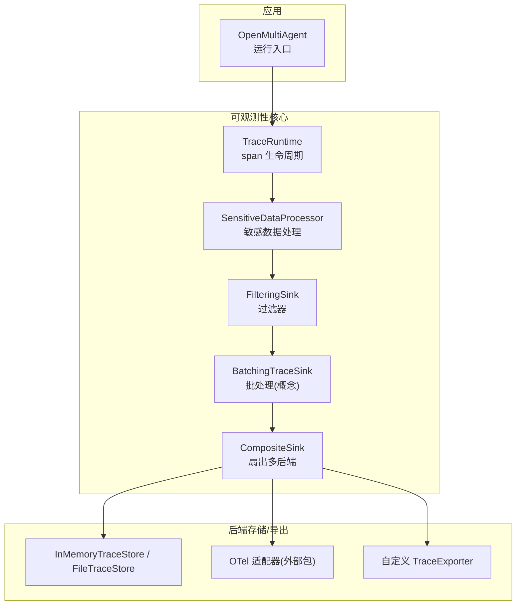
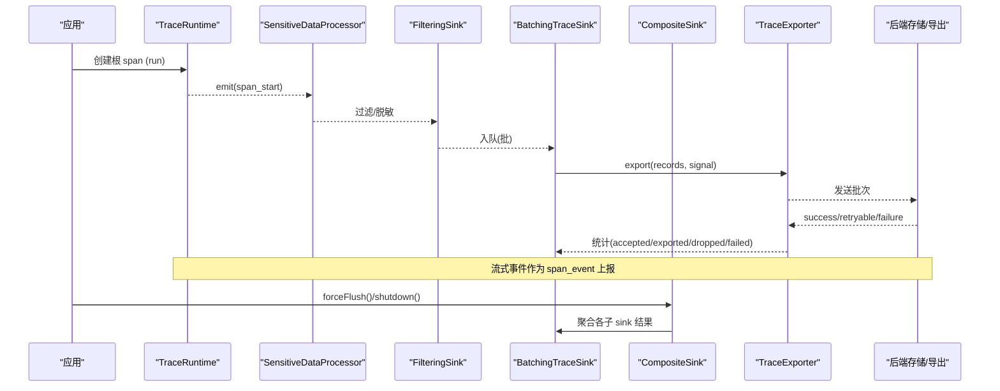
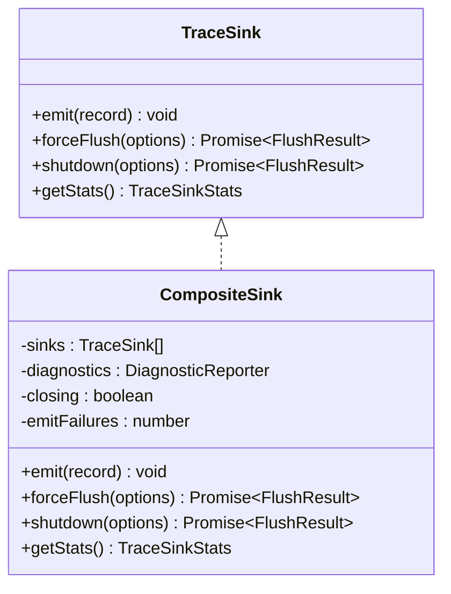
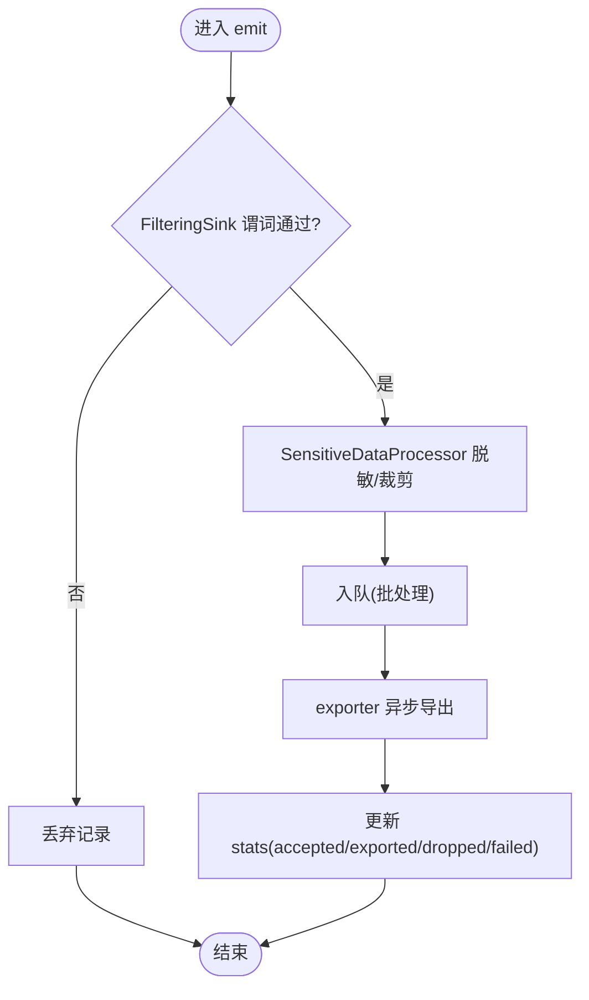
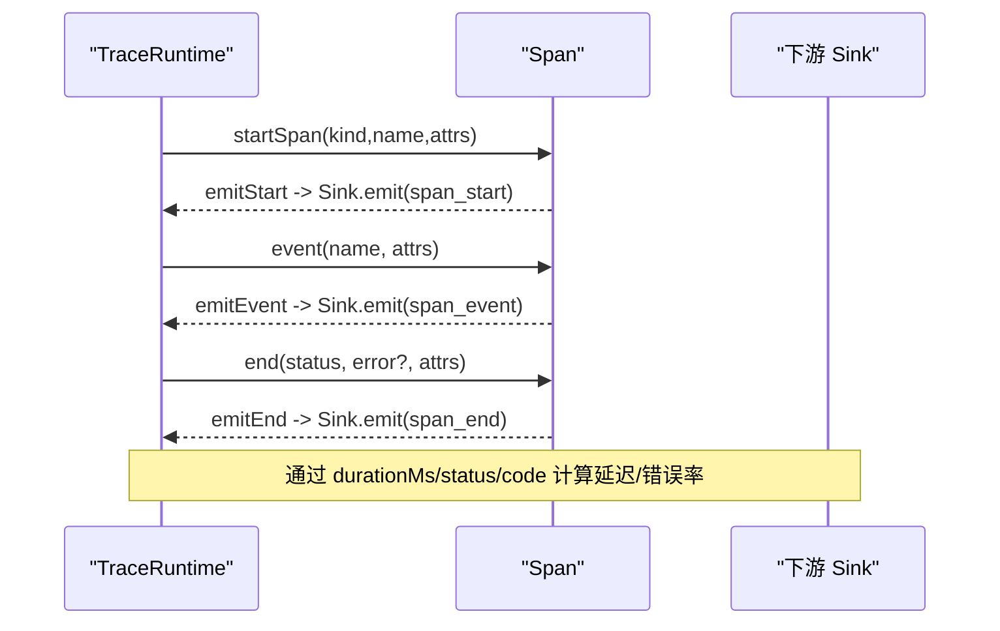

# 指标收集

<cite>
**本文引用的文件**
- [sink.ts](file://packages/core/src/observability/sink.ts)
- [composite.ts](file://packages/core/src/observability/composite.ts)
- [processors.ts](file://packages/core/src/observability/processors.ts)
- [runtime.ts](file://packages/core/src/observability/runtime.ts)
- [observability.md](file://docs/observability.md)
- [observability-performance.md](file://docs/observability-performance.md)
- [types.ts](file://packages/core/src/types.ts)
- [runner.ts](file://packages/core/src/agent/runner.ts)
</cite>

## 目录
1. [简介](#简介)
2. [项目结构](#项目结构)
3. [核心组件](#核心组件)
4. [架构总览](#架构总览)
5. [详细组件分析](#详细组件分析)
6. [依赖关系分析](#依赖关系分析)
7. [性能考量](#性能考量)
8. [故障排查指南](#故障排查指南)
9. [结论](#结论)
10. [附录](#附录)

## 简介
本章节面向 Open Multi-Agent（OMA）的指标与可观测性能力，聚焦“指标收集”主题：如何采集延迟、吞吐、错误率等关键性能指标；如何自定义业务指标（成本、资源使用、任务状态）；如何使用复合接收器将数据同时输出到多个后端；如何配置过滤器与处理器实现敏感数据过滤、采样与批处理优化；以及如何设置告警与进行性能调优。文档基于仓库中的可观测性子系统与类型定义，提供从架构到落地的完整说明。

## 项目结构
OMA 的可观测性子系统位于 core 包的 observability 目录，围绕 TraceRecord v2 规范构建，提供 sink/exporter 抽象、批处理、过滤与脱敏、以及运行时 span 生命周期管理。顶层通过 ObservabilityConfig 注入 sinks，并在执行路径中产生结构化追踪记录。

图表来源
- [runtime.ts:80-127](file://packages/core/src/observability/runtime.ts#L80-L127)
- [processors.ts:15-33](file://packages/core/src/observability/processors.ts#L15-L33)
- [processors.ts:65-131](file://packages/core/src/observability/processors.ts#L65-L131)
- [composite.ts:43-99](file://packages/core/src/observability/composite.ts#L43-L99)
- [observability.md:185-222](file://docs/observability.md#L185-L222)

章节来源
- [observability.md:151-222](file://docs/observability.md#L151-L222)
- [runtime.ts:80-127](file://packages/core/src/observability/runtime.ts#L80-L127)

## 核心组件
- TraceSink/TraceExporter：热路径同步 emit 与异步批量导出的接口契约，支撑高吞吐、低开销的指标采集。
- CompositeSink：扇出式复合接收器，支持向多个 sink 同时写入，任一子 sink 失败不影响其他子 sink。
- FilteringSink：同步过滤器，按谓词丢弃不需要的遥测记录，避免对业务逻辑产生影响。
- SensitiveDataProcessor：结构化隐私边界，默认不捕获 prompt/completion/tool 内容，支持属性白名单、密钥字段移除、错误消息脱敏与截断。
- TraceRuntime：span 生命周期管理，生成 schemaVersion=2 的 TraceRecord，并桥接 legacy onTrace 回调。
- ObservabilityConfig：集中配置 sinks、资源信息、捕获策略与诊断回调。

章节来源
- [sink.ts:27-108](file://packages/core/src/observability/sink.ts#L27-L108)
- [composite.ts:43-99](file://packages/core/src/observability/composite.ts#L43-L99)
- [processors.ts:15-33](file://packages/core/src/observability/processors.ts#L15-L33)
- [processors.ts:65-131](file://packages/core/src/observability/processors.ts#L65-L131)
- [runtime.ts:80-127](file://packages/core/src/observability/runtime.ts#L80-L127)
- [observability.md:185-222](file://docs/observability.md#L185-L222)

## 架构总览
下图展示一次运行的指标采集流程：运行时创建根 span，逐层产生开始/事件/结束记录；记录经敏感数据处理、可选过滤后进入批处理队列；由 exporter 异步导出至一个或多个后端；最终通过 flush/shutdown 保证幂等与一致性。

图表来源
- [runtime.ts:129-180](file://packages/core/src/observability/runtime.ts#L129-L180)
- [processors.ts:65-131](file://packages/core/src/observability/processors.ts#L65-L131)
- [observability.md:185-222](file://docs/observability.md#L185-L222)
- [composite.ts:72-104](file://packages/core/src/observability/composite.ts#L72-L104)

## 详细组件分析

### 复合接收器 CompositeSink
- 作用：将同一份 TraceRecord 广播到多个 sink，任一子 sink 抛错或超时不会中断对其他子 sink 的写入。
- 行为要点：
  - emit 遍历所有子 sink，捕获异常并上报诊断。
  - forceFlush/shutdown 并行调用子操作，合并结果为 ok/partial/error/timeout。
  - getStats 汇总各子 sink 的 accepted/exported/retried/failed/queued 等指标。
- 适用场景：同时写入本地文件、内存索引、远程 OTLP 等，提高可观测性覆盖度与容错性。

图表来源
- [sink.ts:76-108](file://packages/core/src/observability/sink.ts#L76-L108)
- [composite.ts:43-99](file://packages/core/src/observability/composite.ts#L43-L99)

章节来源
- [composite.ts:43-99](file://packages/core/src/observability/composite.ts#L43-L99)
- [sink.ts:76-108](file://packages/core/src/observability/sink.ts#L76-L108)

### 过滤器与处理器：敏感数据过滤、采样与批处理
- FilteringSink：以谓词函数决定是否放行某条 TraceRecord，适合按 span kind/name/attributes 做采样或白名单过滤。
- SensitiveDataProcessor：
  - 默认不捕获 prompt/completion/toolInput/toolOutput。
  - 自动移除包含授权/密钥等字段的属性键。
  - 支持 errorMessage 仅保留 code 或脱敏文本。
  - 支持 stream_chunk 事件的首条或全部捕获策略。
  - 支持 maxContentChars 限制字符串长度。
- 批处理（BatchingTraceSink，概念）：将高频 emit 聚合成批次，降低 I/O 与序列化开销；默认队列容量、字节上限、单记录大小、导出超时与重试策略均受控，保障系统稳定。

图表来源
- [processors.ts:15-33](file://packages/core/src/observability/processors.ts#L15-L33)
- [processors.ts:65-131](file://packages/core/src/observability/processors.ts#L65-L131)
- [observability.md:572-600](file://docs/observability.md#L572-L600)

章节来源
- [processors.ts:15-33](file://packages/core/src/observability/processors.ts#L15-L33)
- [processors.ts:65-131](file://packages/core/src/observability/processors.ts#L65-L131)
- [observability.md:572-600](file://docs/observability.md#L572-L600)

### 运行时与指标产出：延迟、吞吐、错误率
- 延迟：span 的开始/结束时间差即为单次操作的耗时；stream_chunk 事件可用于首字节时延（TTFT）相关分析。
- 吞吐：单位时间内 accepted/exported 的记录数；可通过 stats 与 exporter 返回的 exported 计数评估。
- 错误率：status.code 为 error/timeout/budget_exhausted 等的比例；结合 stats.failed 与诊断码统计。
- 指标来源：
  - TraceRecord 的 schemaVersion=2 记录包含 runId/attempt/traceId/spanId/links/status/attributes。
  - TraceRuntime 负责生成 span_start/span_event/span_end 并附带时序与状态。
  - 运行结果包含 RunMetrics（如 totalDurationMs、errorCount、failureCount、completedCount、min/max/avgTaskDurationMs）。

图表来源
- [runtime.ts:114-180](file://packages/core/src/observability/runtime.ts#L114-L180)
- [types.ts:1854-1870](file://packages/core/src/types.ts#L1854-L1870)

章节来源
- [runtime.ts:114-180](file://packages/core/src/observability/runtime.ts#L114-L180)
- [types.ts:1854-1870](file://packages/core/src/types.ts#L1854-L1870)

### 业务指标自定义：成本、资源使用、任务状态
- 成本跟踪：
  - 通过 OrchestratorConfig.estimateCost 将 TokenUsage 映射为成本单位；RunTasksOptions.maxCostBudget 可在每次调用层面设置成本上限。
  - 在 span attributes 中附加 cost、budget_remaining 等业务维度，便于查询与可视化。
- 资源使用：
  - 在 LLM 调用前后记录 token 用量、模型名、provider、并发工具调用开关等属性；结合 stats 与 exporter 的 accepted/exported 估算吞吐。
- 任务状态监控：
  - 利用 Task/Agent/Run 级别的 span 与 status.code 区分成功、超时、预算耗尽、拒绝等状态；结合 ExecutionReceipt 与路由决策记录，形成端到端视图。
- 参考位置：
  - estimateCost 与 maxCostBudget 定义于类型接口。
  - RunMetrics 提供运行级聚合指标。
  - 可观测性文档说明如何通过 metadata 与 attributes 附加业务维度。

章节来源
- [types.ts:2208-2231](file://packages/core/src/types.ts#L2208-L2231)
- [types.ts:1514-1538](file://packages/core/src/types.ts#L1514-L1538)
- [types.ts:1854-1870](file://packages/core/src/types.ts#L1854-L1870)
- [observability.md:43-78](file://docs/observability.md#L43-L78)

### 告警配置建议
- 基于 sink 诊断：
  - 使用 DiagnosticReporter 的 onDiagnostic 回调，订阅 sink_emit_failed、queue_full、record_too_large、export_failed、export_timeout、flush_timeout、shutdown_failed、emit_after_shutdown 等诊断码。
  - 建议对 queue_full 与 record_too_large 触发告警，提示调整 batch size、maxContentChars 或队列容量。
- 基于 stats：
  - 监控 dropped/failed 比率与 queuedRecords/queuedBytes 水位，当接近阈值时扩容或降采样。
- 基于运行结果：
  - 关注 status.code 为 error/timeout/budget_exhausted 的比例；结合 RunMetrics.errorCount/failureCount 设定阈值。

章节来源
- [sink.ts:48-74](file://packages/core/src/observability/sink.ts#L48-L74)
- [observability.md:572-600](file://docs/observability.md#L572-L600)

### 性能调优指南
- 批处理参数：
  - 合理设置 batch records、scheduled delay、export timeout、retries/backoff，平衡延迟与吞吐。
  - 控制单记录大小与队列字节上限，避免 OOM 或磁盘压力。
- 内容捕获策略：
  - 默认关闭 prompt/completion/tool 内容捕获；仅在必要时开启并限制 maxContentChars。
  - 对 stream_chunk 采用 first 策略减少高频事件带来的压力。
- 存储与导出：
  - 使用 InMemoryTraceStore 用于测试与短进程；生产环境可用 FileTraceStore 或 OTel 适配器。
  - 定期 flush/close/compact，确保文件一致性与体积可控。
- 基准与回归：
  - 参考性能基线文档，关注 p95 延迟与整体回归阈值，避免引入数量级退化。

章节来源
- [observability.md:527-600](file://docs/observability.md#L527-L600)
- [observability.md:224-384](file://docs/observability.md#L224-L384)
- [observability-performance.md:8-20](file://docs/observability-performance.md#L8-L20)
- [observability-performance.md:64-118](file://docs/observability-performance.md#L64-L118)

## 依赖关系分析
- TraceRuntime 依赖 TraceSink 抽象，内部组合 LegacyCallbackTraceSink（兼容旧版 onTrace）与用户提供的 sink，并通过 CompositeSink 统一扇出。
- SensitiveDataProcessor 与 FilteringSink 作为装饰器链，包裹下游 sink，实现隐私与过滤。
- 批处理与导出由 TraceExporter 实现，被 BatchingTraceSink 调度；CompositeSink 将多个 sink 的结果聚合。
- 类型定义提供运行级指标与配置项，贯穿 orchestrator/agent/runner 的执行路径。

图表来源
- [runtime.ts:80-127](file://packages/core/src/observability/runtime.ts#L80-L127)
- [composite.ts:43-99](file://packages/core/src/observability/composite.ts#L43-L99)
- [processors.ts:15-33](file://packages/core/src/observability/processors.ts#L15-L33)
- [observability.md:185-222](file://docs/observability.md#L185-L222)

章节来源
- [runtime.ts:80-127](file://packages/core/src/observability/runtime.ts#L80-L127)
- [composite.ts:43-99](file://packages/core/src/observability/composite.ts#L43-L99)
- [processors.ts:15-33](file://packages/core/src/observability/processors.ts#L15-L33)
- [observability.md:185-222](file://docs/observability.md#L185-L222)

## 性能考量
- 热路径要求：emit 必须同步且非阻塞；I/O 与网络请求应在 exporter 中进行。
- 队列与丢弃策略：当队列满或超限时，优先丢弃 stream_chunk，其次普通事件，再是 span_start，最后才是自包含的 span_end。
- 诊断与降级：任何 sink/exporter 失败仅影响可观测性统计，不影响业务执行；通过诊断回调与 stats 暴露问题。
- 基准目标：无 sink 路径的额外开销应低于阈值；批处理入队与 OTel 转换需满足 p95 延迟预算。

章节来源
- [observability.md:185-222](file://docs/observability.md#L185-L222)
- [observability.md:572-600](file://docs/observability.md#L572-L600)
- [observability-performance.md:8-20](file://docs/observability-performance.md#L8-L20)

## 故障排查指南
- 常见问题定位：
  - sink_emit_failed：子 sink 抛出异常，检查其实现与资源可用性。
  - queue_full：队列已满，考虑增大队列容量或降低采样率。
  - record_too_large：单记录过大，调整 maxContentChars 或拆分记录。
  - export_failed/export_timeout：导出失败或超时，检查网络与后端健康。
  - flush_timeout/shutdown_failed：生命周期操作超时，增加 timeoutMs 或优化 exporter。
  - emit_after_shutdown：在 shutdown 后仍尝试 emit，需确保调用顺序正确。
- 排查步骤：
  - 启用 onDiagnostic 回调，收集诊断码与计数。
  - 读取 sink.getStats()，关注 dropped/failed/queued 指标。
  - 检查 flush/shutdown 返回值与状态码，确认幂等与一致性。
  - 对于文件存储，确认 flush/close/compact 的顺序与时机。

章节来源
- [sink.ts:48-74](file://packages/core/src/observability/sink.ts#L48-L74)
- [composite.ts:101-155](file://packages/core/src/observability/composite.ts#L101-L155)
- [observability.md:527-600](file://docs/observability.md#L527-L600)

## 结论
OMA 的可观测性子系统以 TraceRecord v2 为核心，提供高性能、可扩展、安全的指标采集链路。通过 CompositeSink 可同时输出到多个后端；借助 FilteringSink 与 SensitiveDataProcessor 实现灵活的数据过滤与隐私保护；结合批处理与导出器，达成延迟、吞吐、错误率的准确度量。配合运行级指标与业务自定义维度，开发者可以构建高效、可靠的监控系统，并通过诊断与性能基线持续优化。

## 附录
- 关键配置项速查：
  - ObservabilityConfig.sinks：注入一个或多个 sink。
  - ObservabilityConfig.capture：控制内容捕获策略。
  - DiagnosticOptions.onDiagnostic：订阅诊断事件。
  - RunTasksOptions.maxTokenBudget/maxCostBudget：每调用预算上限。
  - OrchestratorConfig.estimateCost：成本估算函数。
- 常用实践：
  - 生产环境建议：启用批处理、设置合理的队列与导出超时、定期 flush/close/compact。
  - 安全合规：默认关闭内容捕获，必要时开启并限制长度；对敏感字段进行白名单与脱敏。
  - 监控告警：基于 stats 与诊断码建立阈值告警，关注 dropped/failed/queue 水位。

章节来源
- [sink.ts:69-108](file://packages/core/src/observability/sink.ts#L69-L108)
- [types.ts:2208-2231](file://packages/core/src/types.ts#L2208-L2231)
- [observability.md:527-600](file://docs/observability.md#L527-L600)