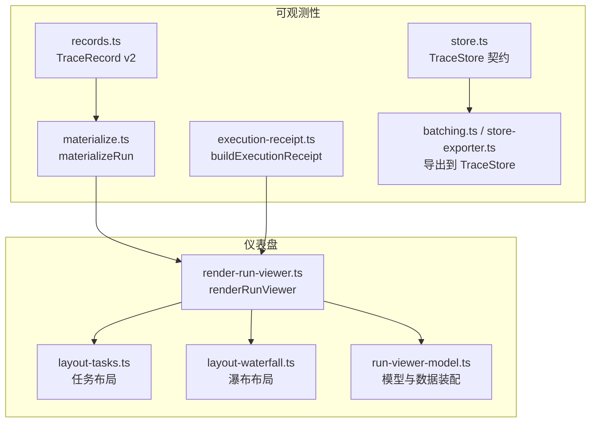
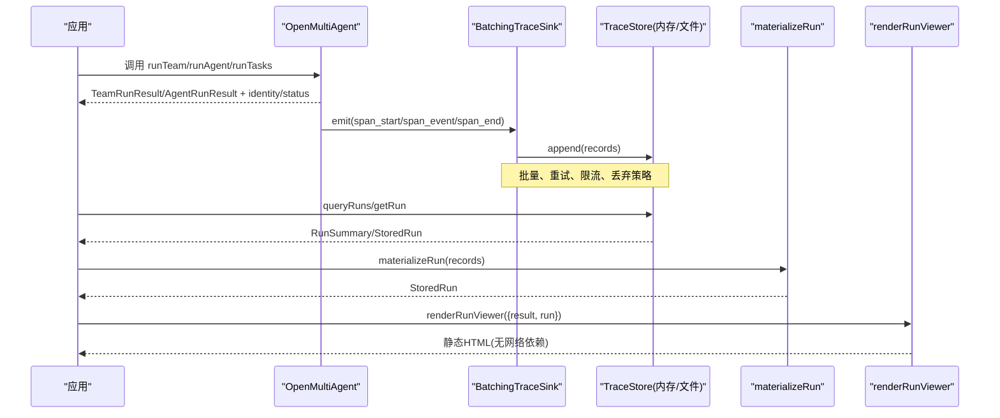
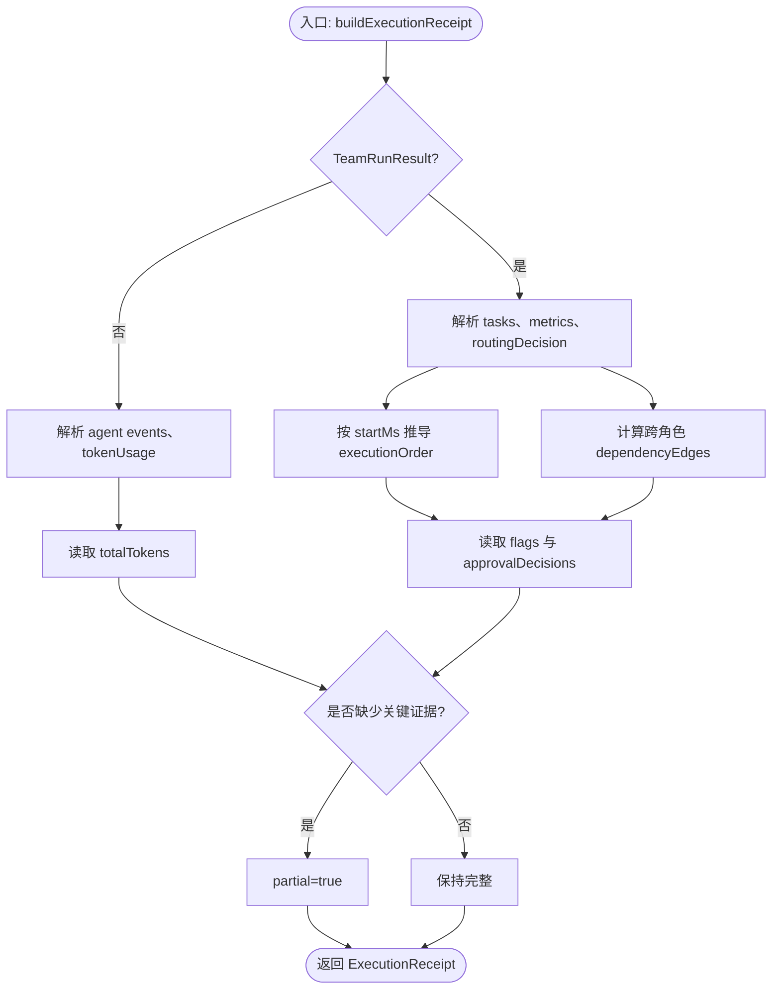
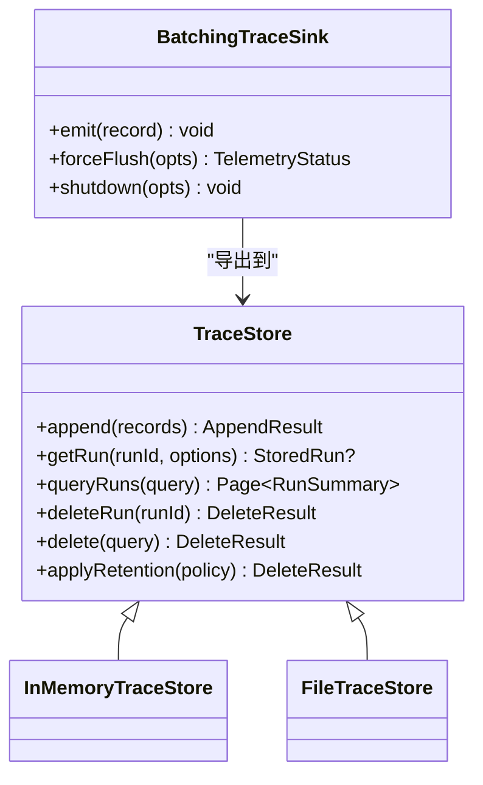
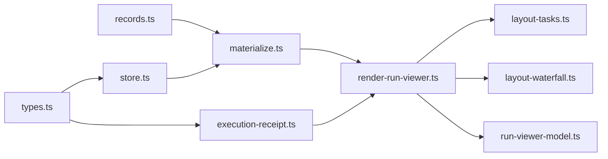

# 离线查看器

<cite>
**本文引用的文件**
- [README.md](file://README.md)
- [observability.md](file://docs/observability.md)
- [materialize.ts](file://packages/core/src/observability/materialize.ts)
- [store.ts](file://packages/core/src/observability/store.ts)
- [execution-receipt.ts](file://packages/core/src/observability/execution-receipt.ts)
- [records.ts](file://packages/core/src/observability/records.ts)
- [render-run-viewer.ts](file://packages/core/src/dashboard/render-run-viewer.ts)
- [layout-tasks.ts](file://packages/core/src/dashboard/layout-tasks.ts)
- [layout-waterfall.ts](file://packages/core/src/dashboard/layout-waterfall.ts)
- [run-viewer-model.ts](file://packages/core/src/dashboard/run-viewer-model.ts)
- [types.ts](file://packages/core/src/types.ts)
</cite>

## 目录
1. [简介](#简介)
2. [项目结构](#项目结构)
3. [核心组件](#核心组件)
4. [架构总览](#架构总览)
5. [详细组件分析](#详细组件分析)
6. [依赖关系分析](#依赖关系分析)
7. [性能考虑](#性能考虑)
8. [故障排查指南](#故障排查指南)
9. [结论](#结论)
10. [附录](#附录)

## 简介
本章节面向“离线查看器”能力，聚焦以下目标：
- Run Viewer 的使用方法：如何生成与执行查看器、可视化界面操作与数据浏览。
- 材料化运行（materializeRun）的概念与使用场景：将追踪记录转换为可分析的 StoredRun。
- 执行收据（ExecutionReceipt）的结构与作用：依赖关系图、成本摘要、令牌使用统计等。
- 存储导出器的使用：数据导出格式、查询接口与性能考虑。
- 调试技巧与常见问题解决方案。

Open Multi-Agent 提供三层可观测性：实时进度事件、结构化追踪跨度，以及一个单运行的离线 DAG/Waterfall 查看器。该查看器是静态 HTML，不加载远程脚本或遥测，适合事后复盘与分享。

**章节来源**
- [README.md:140-144](file://README.md#L140-L144)
- [observability.md:1-10](file://docs/observability.md#L1-L10)

## 项目结构
离线查看器相关代码主要分布在 observability 与 dashboard 两个子模块：
- observability：负责追踪记录 schema、批处理导出、存储抽象、材料化、执行收据构建。
- dashboard：负责将结果与材料化数据渲染为静态 HTML 的 DAG 与 Waterfall 视图。

**图示来源**
- [records.ts:1-56](file://packages/core/src/observability/records.ts#L1-L56)
- [store.ts:1-158](file://packages/core/src/observability/store.ts#L1-L158)
- [materialize.ts:71-241](file://packages/core/src/observability/materialize.ts#L71-L241)
- [execution-receipt.ts:25-56](file://packages/core/src/observability/execution-receipt.ts#L25-L56)
- [render-run-viewer.ts:1-200](file://packages/core/src/dashboard/render-run-viewer.ts#L1-L200)
- [layout-tasks.ts:1-200](file://packages/core/src/dashboard/layout-tasks.ts#L1-L200)
- [layout-waterfall.ts:1-200](file://packages/core/src/dashboard/layout-waterfall.ts#L1-L200)
- [run-viewer-model.ts:1-200](file://packages/core/src/dashboard/run-viewer-model.ts#L1-L200)

**章节来源**
- [observability.md:151-179](file://docs/observability.md#L151-L179)
- [observability.md:224-295](file://docs/observability.md#L224-L295)
- [observability.md:670-731](file://docs/observability.md#L670-L731)

## 核心组件
- 追踪记录与 schema v2：定义 span_start/span_event/span_end 的稳定结构，包含 runId、traceId、spanId、时间戳、状态、属性与链接。
- TraceStore 契约：append/query/delete/retention 的介质无关接口；InMemoryTraceStore 与 FileTraceStore 实现本地与持久化存储。
- 材料化运行 materializeRun：将 TraceRecord 流排序、聚合为 StoredRun，汇总 token/cost、agents/models/providers、尝试次数与完成度。
- 执行收据 buildExecutionReceipt：从 TeamRunResult/AgentRunResult 与可选 trace 推导实际拓扑、依赖边、独立审查、令牌与时长，并标记 partial。
- 离线查看器 renderRunViewer：接受 result 与/或 StoredRun，输出无网络依赖的静态 HTML，支持 DAG 与 Waterfall 联动、过滤与搜索。

**章节来源**
- [records.ts:1-56](file://packages/core/src/observability/records.ts#L1-L56)
- [store.ts:148-158](file://packages/core/src/observability/store.ts#L148-L158)
- [materialize.ts:71-241](file://packages/core/src/observability/materialize.ts#L71-L241)
- [execution-receipt.ts:25-56](file://packages/core/src/observability/execution-receipt.ts#L25-L56)
- [observability.md:670-731](file://docs/observability.md#L670-L731)

## 架构总览
下图展示从运行产出到离线查看器的完整链路：运行时产生 TraceRecord 与结果对象，通过导出器写入 TraceStore；随后材料化为 StoredRun，并与结果一起输入查看器渲染为静态 HTML。

**图示来源**
- [observability.md:185-222](file://docs/observability.md#L185-L222)
- [observability.md:224-295](file://docs/observability.md#L224-L295)
- [observability.md:527-600](file://docs/observability.md#L527-L600)
- [observability.md:670-731](file://docs/observability.md#L670-L731)
- [materialize.ts:71-241](file://packages/core/src/observability/materialize.ts#L71-L241)

## 详细组件分析

### Run Viewer 使用方法
- 仅结果模式：传入 TeamRunResult，可查看任务图与缺失追踪提示。
- 仅追踪模式：从 TraceStore 获取 StoredRun，按尝试分组展示 Waterfall。
- 组合模式：同时传入 result 与 run，以结果图为权威，关联更丰富的追踪证据。
- CLI 命令：oma run --dashboard 捕获当前运行并渲染；oma dashboard --trace-store ... --run-id ... --output run.html 导出历史运行。

界面能力包括：
- DAG 与 Waterfall 视图同步选择、搜索与过滤（按 kind/status/agent/task）。
- 显示状态、完整性、身份、持续时间、尝试次数、令牌、成本、代理、模型与提供者。
- 路由信息摘要（若存在）：模式、来源、原因与实际 ExecutionReceipt 证据。
- 生成的 HTML 无远程资源、不嵌入敏感内容，适合离线分享与归档。

**章节来源**
- [observability.md:670-731](file://docs/observability.md#L670-L731)
- [render-run-viewer.ts:1-200](file://packages/core/src/dashboard/render-run-viewer.ts#L1-L200)
- [layout-tasks.ts:1-200](file://packages/core/src/dashboard/layout-tasks.ts#L1-L200)
- [layout-waterfall.ts:1-200](file://packages/core/src/dashboard/layout-waterfall.ts#L1-L200)
- [run-viewer-model.ts:1-200](file://packages/core/src/dashboard/run-viewer-model.ts#L1-L200)

### 材料化运行 materializeRun
- 输入：TraceRecord[]（可能乱序），可选 includeRecords。
- 过程：
  - 按 traceId、sequence、recordId 排序。
  - 聚合每个 span 的 start/end/events，合并 attributes 与 links。
  - 统计 agents、tasks、models、providers、token 与 cost。
  - 按 traceId 分组计算每次尝试的开始/结束/状态/是否不完整。
  - 提取根 span 的 per-run metadata（oma.meta.*）。
- 输出：StoredRun（RunSummary + spans + records 可选）。

复杂度与性能要点：
- 排序 O(N log N)，N 为记录数。
- 聚合阶段线性扫描 Map。
- 适合在进程内对单次 run 的材料化；大批量建议分页查询后分批材料化。

**章节来源**
- [materialize.ts:71-241](file://packages/core/src/observability/materialize.ts#L71-L241)
- [store.ts:107-146](file://packages/core/src/observability/store.ts#L107-L146)

### 执行收据 ExecutionReceipt
- 作用：从运行结果与可选 trace 推导“实际执行了什么”，用于治理与审计。
- 关键字段：
  - mode：single/multi-agent。
  - rolesExecuted/workerInstancesExecuted/taskRolesExecuted：角色与实例。
  - executionOrder：基于开始时间的执行顺序。
  - dependencyEdges：跨角色的依赖边。
  - independentRolesCount/independentReviewOccurred：独立审查判定。
  - totalTokens/durationMs：令牌与时长。
  - flags/approvalDecisions：运行时标志与审批事实。
  - partial：当缺少必要证据时为 true。
- 构建规则：
  - 不读取模型回答文本，避免主观判断。
  - 对 TeamRunResult 与 AgentRunResult 分别构建。
  - 结合 routingDecision 字段建立 receiptId/routingDecisionId/routingDecisionSpanId 的关联。

**图示来源**
- [execution-receipt.ts:25-56](file://packages/core/src/observability/execution-receipt.ts#L25-L56)
- [execution-receipt.ts:184-261](file://packages/core/src/observability/execution-receipt.ts#L184-L261)
- [execution-receipt.ts:263-384](file://packages/core/src/observability/execution-receipt.ts#L263-L384)
- [execution-receipt.ts:386-403](file://packages/core/src/observability/execution-receipt.ts#L386-L403)

**章节来源**
- [observability.md:84-143](file://docs/observability.md#L84-L143)
- [execution-receipt.ts:25-56](file://packages/core/src/observability/execution-receipt.ts#L25-L56)
- [execution-receipt.ts:184-261](file://packages/core/src/observability/execution-receipt.ts#L184-L261)
- [execution-receipt.ts:263-384](file://packages/core/src/observability/execution-receipt.ts#L263-L384)
- [execution-receipt.ts:386-403](file://packages/core/src/observability/execution-receipt.ts#L386-L403)

### 存储导出器与 TraceStore
- 导出路径：
  - 内存：InMemoryTraceStore 用于测试与本地快速检查。
  - 文件：FileTraceStore 打开 .ndjson 日志，重建索引，支持 flush/close/compact。
- 写入与恢复：
  - append 原子批次，idempotent by recordId。
  - 文件采用 envelope 版本化，commit 后才可见；崩溃恢复只重放已提交批次。
- 查询与分页：
  - queryRuns 支持 runId、时间范围、status、agent、taskId、model、provider 过滤。
  - 稳定排序 (startedAt, runId)，默认降序；cursor 为不透明且绑定过滤器。
- 删除与保留：
  - deleteRun/delete 幂等；applyRetention 支持 maxAgeMs/maxRuns/statuses。
- 生命周期：
  - BatchingTraceSink 管理队列、重试、丢弃策略；forceFlush/shutdown 控制交付边界。

**图示来源**
- [store.ts:148-158](file://packages/core/src/observability/store.ts#L148-L158)
- [observability.md:224-295](file://docs/observability.md#L224-L295)
- [observability.md:527-600](file://docs/observability.md#L527-L600)

**章节来源**
- [observability.md:185-222](file://docs/observability.md#L185-L222)
- [observability.md:224-295](file://docs/observability.md#L224-L295)
- [observability.md:413-445](file://docs/observability.md#L413-L445)
- [observability.md:527-600](file://docs/observability.md#L527-L600)

### 可视化界面操作与数据浏览
- 视图切换：DAG 与 Waterfall 通过 task ID 同步高亮。
- 过滤与搜索：按 kind/status/agent/task 过滤，保留祖先上下文。
- 路由摘要：若存在路由数据，顶部显示所选模式、来源、原因及 ExecutionReceipt 证据。
- 安全与隐私：不嵌入 prompt/completion/tool 参数/结果/消息/推理内容；安全字段再次脱敏。

**章节来源**
- [observability.md:670-731](file://docs/observability.md#L670-L731)
- [render-run-viewer.ts:1-200](file://packages/core/src/dashboard/render-run-viewer.ts#L1-L200)

## 依赖关系分析
- 类型与事件：
  - types.ts 定义了 TeamRunResult、TaskExecutionRecord、TokenUsage、TraceEvent 等基础类型。
  - records.ts 定义 TraceRecord v2 的 span_start/span_event/span_end。
- 材料化与存储：
  - materialize.ts 依赖 records.ts 与 store.ts 的类型，产出 StoredRun。
  - store.ts 定义 TraceStore 契约与错误码、诊断、查询条件。
- 执行收据：
  - execution-receipt.ts 依赖 types.ts 中的 TeamRunResult/AgentRunResult/TraceEvent。
- 仪表盘：
  - render-run-viewer.ts 消费 result 与 StoredRun，调用 layout-* 与 run-viewer-model 组装 UI 数据。

**图示来源**
- [types.ts:1872-1923](file://packages/core/src/types.ts#L1872-L1923)
- [records.ts:1-56](file://packages/core/src/observability/records.ts#L1-L56)
- [store.ts:1-158](file://packages/core/src/observability/store.ts#L1-L158)
- [materialize.ts:1-241](file://packages/core/src/observability/materialize.ts#L1-L241)
- [execution-receipt.ts:1-403](file://packages/core/src/observability/execution-receipt.ts#L1-L403)
- [render-run-viewer.ts:1-200](file://packages/core/src/dashboard/render-run-viewer.ts#L1-L200)
- [layout-tasks.ts:1-200](file://packages/core/src/dashboard/layout-tasks.ts#L1-L200)
- [layout-waterfall.ts:1-200](file://packages/core/src/dashboard/layout-waterfall.ts#L1-L200)
- [run-viewer-model.ts:1-200](file://packages/core/src/dashboard/run-viewer-model.ts#L1-L200)

**章节来源**
- [types.ts:1872-1923](file://packages/core/src/types.ts#L1872-L1923)
- [records.ts:1-56](file://packages/core/src/observability/records.ts#L1-L56)
- [store.ts:1-158](file://packages/core/src/observability/store.ts#L1-L158)
- [materialize.ts:1-241](file://packages/core/src/observability/materialize.ts#L1-L241)
- [execution-receipt.ts:1-403](file://packages/core/src/observability/execution-receipt.ts#L1-L403)
- [render-run-viewer.ts:1-200](file://packages/core/src/dashboard/render-run-viewer.ts#L1-L200)

## 性能考虑
- 追踪导出：
  - BatchingTraceSink 默认队列大小、字节上限、批大小、延迟、超时、重试与退避均有界，避免阻塞业务执行。
  - 容量不足时按优先级丢弃：stream_chunk > 其他事件 > span_start > span_end。
  - 超大记录在接纳前拒绝。
- 存储写入：
  - FileTraceStore 追加式 NDJSON，commit 后才可见；flush/fsync 保证崩溃恢复边界。
  - compact 原子替换，重复压缩确定性强。
- 查询与材料化：
  - queryRuns 默认页大小 50，最大 500；cursor 绑定过滤器，避免重复与遗漏。
  - materializeRun 排序 O(N log N)，适合单次 run；大规模建议分页+分批。
- 查看器：
  - 静态 HTML，无网络依赖，适合离线分享；大数据集建议在服务端裁剪后再渲染。

**章节来源**
- [observability.md:527-600](file://docs/observability.md#L527-L600)
- [observability.md:297-383](file://docs/observability.md#L297-L383)
- [observability.md:413-445](file://docs/observability.md#L413-L445)
- [materialize.ts:71-241](file://packages/core/src/observability/materialize.ts#L71-L241)

## 故障排查指南
- 查看器显示“部分数据缺失”：
  - 检查是否存在完整的 span_end；若无，incomplete 为 true。
  - 确认 materializeRun 接收到的 records 是否齐全。
- 执行收据 partial=true：
  - 常见于缺少 worker role/startMs、totalTokens 或 durationMs。
  - 确保 onTrace/onProgress 正确配置，或 TraceStore 已 flush。
- 追踪未落地：
  - 确认 sink.forceFlush/shutdown 已调用；CLI 场景需先 flush 再关闭 store。
  - FileTraceStore 需要显式 flush() 与 close()。
- 查询不到运行：
  - 检查 queryRuns 的 startedAfter/startedBefore 是否为 ISO 时间；注意 inclusive/exclusive。
  - cursor 失效时需重新发起查询。
- 文件损坏或无法打开：
  - FileTraceStore 遇到不支持的 schema/version 会失败；检查文件格式与版本头。
  - 崩溃恢复只会重放已提交批次；截断行会被诊断并回滚到上一个 commit 边界。

**章节来源**
- [observability.md:297-383](file://docs/observability.md#L297-L383)
- [observability.md:527-600](file://docs/observability.md#L527-L600)
- [observability.md:413-445](file://docs/observability.md#L413-L445)
- [execution-receipt.ts:184-261](file://packages/core/src/observability/execution-receipt.ts#L184-L261)
- [execution-receipt.ts:263-384](file://packages/core/src/observability/execution-receipt.ts#L263-L384)

## 结论
离线查看器通过“结果 + 材料化追踪”的组合，提供了无需网络的单运行复盘能力。配合 ExecutionReceipt 的客观拓扑证据与 TraceStore 的可查询存储，团队可以在开发、测试与生产环境中高效定位问题、评估成本与合规性。推荐在生产中持久化 TeamRunResult.tasks、totalTokenUsage、identity/status 与 TraceRecord v2，并在必要时导出静态 HTML 作为可分享的复盘产物。

## 附录
- 常用命令参考：
  - 捕获并渲染当前运行：oma run --goal "..." --team team.json --dashboard
  - 导出历史运行：oma dashboard --trace-store ./.oma/traces.ndjson --run-id <runId> --output run.html
- 最佳实践：
  - 在短生命周期 CLI 中，先 forceFlush，再 flush store，最后 shutdown/close。
  - 长服务中，优雅停机时先停止接受新请求，再 flush 与 shutdown。
  - 对大体积追踪，优先分页查询并按 runId 分批材料化，避免一次性加载过多数据。

**章节来源**
- [observability.md:670-731](file://docs/observability.md#L670-L731)
- [observability.md:527-600](file://docs/observability.md#L527-L600)