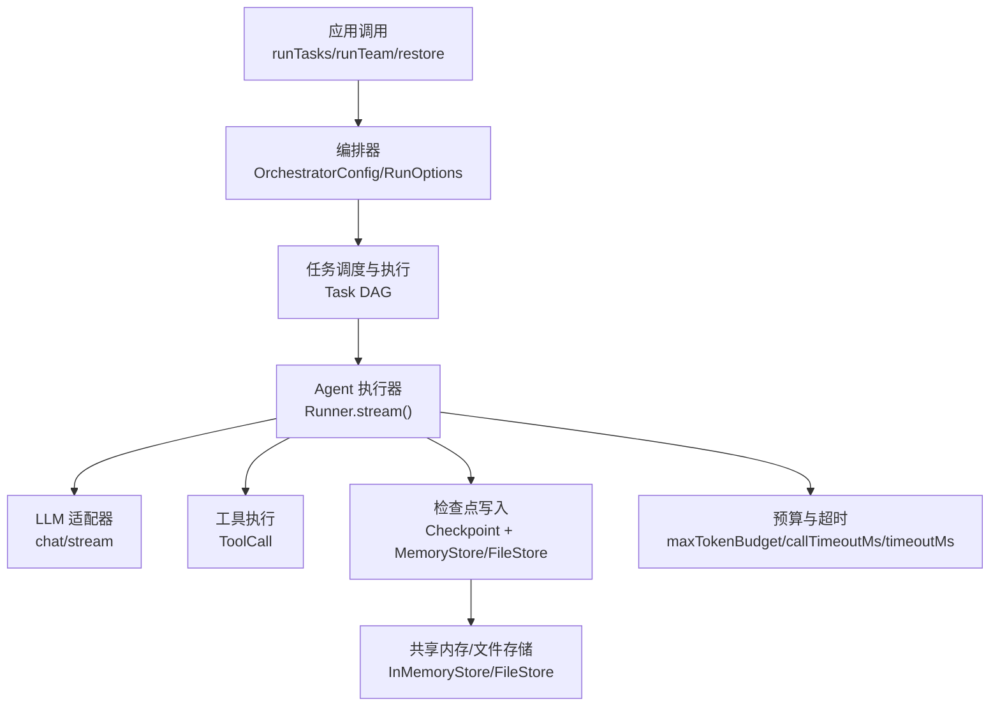
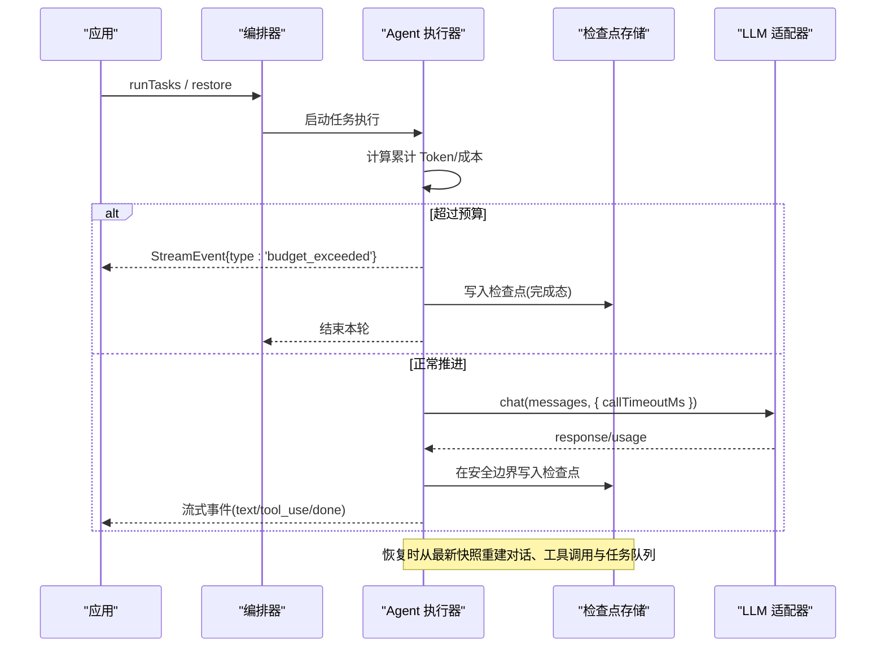
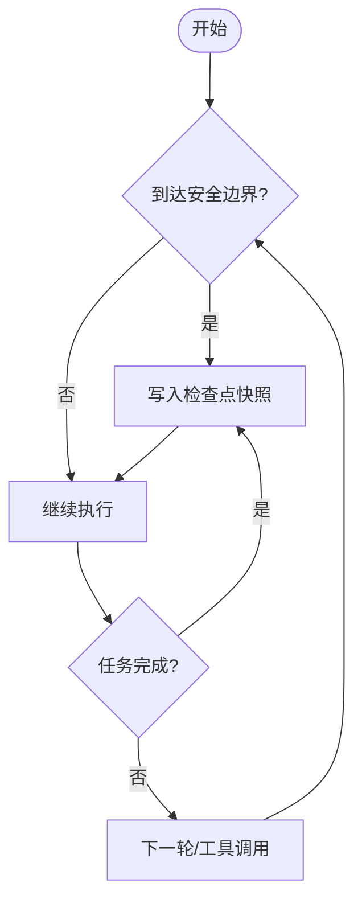
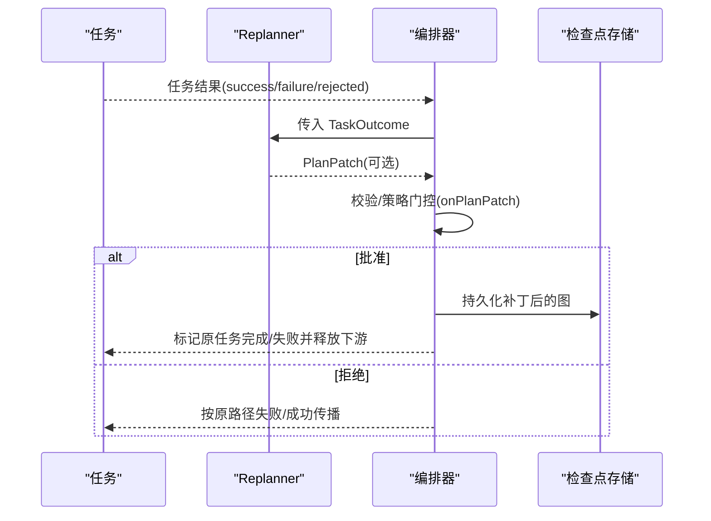
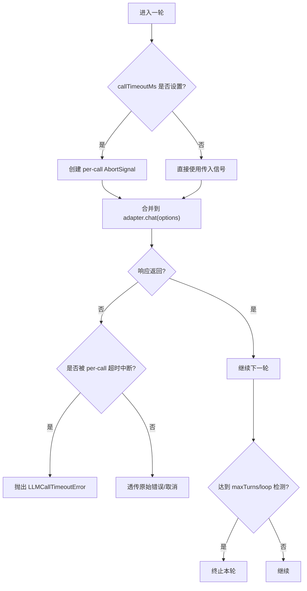
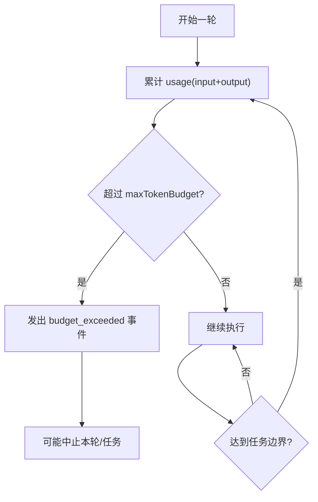
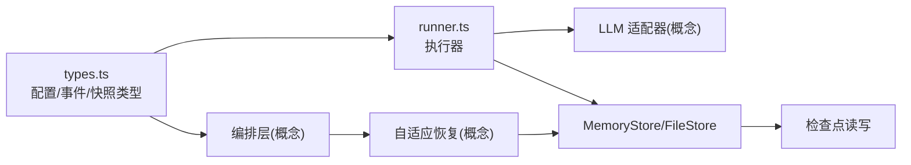

# 可靠性保障

<cite>
**本文引用的文件**
- [packages/core/src/types.ts](file://packages/core/src/types.ts)
- [packages/core/src/agent/runner.ts](file://packages/core/src/agent/runner.ts)
- [packages/core/src/memory/file-store.ts](file://packages/core/src/memory/file-store.ts)
- [docs/checkpoint.md](file://docs/checkpoint.md)
- [docs/adaptive-recovery.md](file://docs/adaptive-recovery.md)
</cite>

## 目录
1. [简介](#简介)
2. [项目结构](#项目结构)
3. [核心组件](#核心组件)
4. [架构总览](#架构总览)
5. [详细组件分析](#详细组件分析)
6. [依赖关系分析](#依赖关系分析)
7. [性能考量](#性能考量)
8. [故障排查指南](#故障排查指南)
9. [结论](#结论)
10. [附录：配置与最佳实践](#附录配置与最佳实践)

## 简介
本章节面向生产环境，系统性阐述 Open Multi-Agent（OMA）的可靠性保障机制，覆盖以下关键能力：
- 检查点系统：自动检查点创建、状态快照与恢复
- 自适应恢复：失败检测、重试策略与降级处理
- 超时控制：请求级与运行级超时、长时间运行保护与资源清理
- 预算限制：Token 预算、成本监控与资源配额管理
- 生产最佳实践：结合上述能力的配置建议与排障要点

## 项目结构
与可靠性相关的核心实现集中在 core 包中，并通过文档进行使用说明：
- 类型与配置定义：types.ts
- 执行器与流式循环：agent/runner.ts
- 持久化存储：memory/file-store.ts
- 文档：checkpoint.md、adaptive-recovery.md

图表来源
- [packages/core/src/types.ts:2131-2200](file://packages/core/src/types.ts#L2131-L2200)
- [packages/core/src/agent/runner.ts:561-582](file://packages/core/src/agent/runner.ts#L561-L582)
- [packages/core/src/memory/file-store.ts:1-54](file://packages/core/src/memory/file-store.ts#L1-L54)

章节来源
- [packages/core/src/types.ts:2131-2200](file://packages/core/src/types.ts#L2131-L2200)
- [packages/core/src/agent/runner.ts:561-582](file://packages/core/src/agent/runner.ts#L561-L582)
- [packages/core/src/memory/file-store.ts:1-54](file://packages/core/src/memory/file-store.ts#L1-L54)
- [docs/checkpoint.md:1-100](file://docs/checkpoint.md#L1-L100)
- [docs/adaptive-recovery.md:1-80](file://docs/adaptive-recovery.md#L1-L80)

## 核心组件
- 检查点与恢复：通过 CheckpointOptions、CheckpointSnapshotV4 等类型与 FileStore 提供“安全边界”落盘与进程重启恢复能力。
- 自适应恢复：Replanner/PlanPatch 在任务结果屏障处提出可修复计划变更，支持追加、重定向、跳过等原子操作。
- 超时控制：callTimeoutMs 为单次 LLM 调用设置统一超时；timeoutMs 为整个 Agent 运行设置上限；配合 AbortSignal 组合生效。
- 预算限制：maxTokenBudget（及可选 maxCostBudget）在轮次/任务边界进行累计统计并触发预算事件或中止。
- 错误与事件：通过 OrchestratorEvent、StreamEvent 暴露 budget_exceeded、task_retry、error 等信号，便于上层治理。

章节来源
- [packages/core/src/types.ts:2349-2362](file://packages/core/src/types.ts#L2349-L2362)
- [packages/core/src/types.ts:2577-2586](file://packages/core/src/types.ts#L2577-L2586)
- [packages/core/src/types.ts:2111-2129](file://packages/core/src/types.ts#L2111-L2129)
- [packages/core/src/agent/runner.ts:561-582](file://packages/core/src/agent/runner.ts#L561-L582)
- [packages/core/src/agent/runner.ts:1204-1215](file://packages/core/src/agent/runner.ts#L1204-L1215)
- [docs/checkpoint.md:109-160](file://docs/checkpoint.md#L109-L160)
- [docs/adaptive-recovery.md:1-80](file://docs/adaptive-recovery.md#L1-L80)

## 架构总览
下图展示了从编排到执行、再到检查点与预算/超时的整体数据与控制流。

图表来源
- [packages/core/src/agent/runner.ts:561-582](file://packages/core/src/agent/runner.ts#L561-L582)
- [packages/core/src/agent/runner.ts:1204-1215](file://packages/core/src/agent/runner.ts#L1204-L1215)
- [packages/core/src/memory/file-store.ts:1-54](file://packages/core/src/memory/file-store.ts#L1-L54)
- [docs/checkpoint.md:109-160](file://docs/checkpoint.md#L109-L160)

## 详细组件分析

### 检查点系统：自动创建、状态快照与恢复
- 自动创建时机：在“安全的执行边界”和每个成功完成任务后写入最新快照，包含执行身份、任务队列、共享内存、已完成任务结果、进行中 runner 状态、审批延续状态等。
- 存储后端：默认复用团队共享内存存储；也可指定独立 FileStore 实现跨进程重启持久化。写路径采用临时文件+fsync+rename 的原子更新，避免半写状态。
- 恢复流程：restore() 加载最新快照，重建任务队列与共享内存，跳过已完成任务，必要时重新合成协调器输出；若无可恢复状态则回退为全新运行。
- 兼容性与版本：支持 v1-v4 快照读取；v4 新增审批延续状态；新写入使用 v4。
- 机密信息脱敏：可通过 RedactingStore 对落盘数据进行脱敏（注意：不可用于需要严格一致性的审批场景）。

图表来源
- [docs/checkpoint.md:109-160](file://docs/checkpoint.md#L109-L160)
- [packages/core/src/memory/file-store.ts:1-54](file://packages/core/src/memory/file-store.ts#L1-L54)

章节来源
- [docs/checkpoint.md:1-108](file://docs/checkpoint.md#L1-L108)
- [docs/checkpoint.md:109-160](file://docs/checkpoint.md#L109-L160)
- [docs/checkpoint.md:172-204](file://docs/checkpoint.md#L172-L204)
- [docs/checkpoint.md:206-249](file://docs/checkpoint.md#L206-L249)
- [packages/core/src/memory/file-store.ts:1-54](file://packages/core/src/memory/file-store.ts#L1-L54)
- [packages/core/src/types.ts:2349-2362](file://packages/core/src/types.ts#L2349-L2362)
- [packages/core/src/types.ts:2577-2586](file://packages/core/src/types.ts#L2577-L2586)

### 自适应恢复：失败检测、重试策略与降级处理
- 模式开关：recovery.mode 设为 'repairable' 启用。
- 工作流：任务产出结果后，Replanner 基于 TaskOutcome 提议 PlanPatch（追加任务、重定向待执行任务、跳过待执行任务），经 onPlanPatch 策略门控后原子应用，并在启用检查点时持久化后再发布新就绪工作。
- 限制与边界：仅对未执行部分进行修订；已执行的外部副作用不回滚；不接受 runFromPlan 的修复模式；与旧版 onApproval 不兼容。
- 恢复语义：接受的重修保存在队列快照中；restore 会重置中断任务但保留历史修订记录；同一触发任务与结果的重复修订不会重复追加。

图表来源
- [docs/adaptive-recovery.md:1-80](file://docs/adaptive-recovery.md#L1-L80)
- [docs/adaptive-recovery.md:82-132](file://docs/adaptive-recovery.md#L82-L132)

章节来源
- [docs/adaptive-recovery.md:1-80](file://docs/adaptive-recovery.md#L1-L80)
- [docs/adaptive-recovery.md:82-132](file://docs/adaptive-recovery.md#L82-L132)
- [packages/core/src/types.ts:1445-1475](file://packages/core/src/types.ts#L1445-L1475)

### 超时控制：请求超时、长时运行保护与资源清理
- 请求级超时：callTimeoutMs 为每次 LLM 调用注入独立的 AbortSignal.timeout，并与外层 abortSignal 合并，先触发者胜出；超时抛出专用异常以便区分取消与超时。
- 运行级超时：timeoutMs 为整个 Agent 运行设置墙钟上限，由上层 AbortSignal 驱动。
- 长时运行保护：结合 loopDetection、maxTurns、上下文压缩策略，防止无限循环与上下文膨胀。
- 资源清理：在每轮开始前检查 abortSignal，确保及时退出；工具调用未完成时保持可恢复状态，以便后续恢复只重放缺失调用。

图表来源
- [packages/core/src/agent/runner.ts:561-582](file://packages/core/src/agent/runner.ts#L561-L582)
- [packages/core/src/types.ts:1085-1105](file://packages/core/src/types.ts#L1085-L1105)
- [packages/core/src/agent/runner.ts:1140-1149](file://packages/core/src/agent/runner.ts#L1140-L1149)

章节来源
- [packages/core/src/agent/runner.ts:561-582](file://packages/core/src/agent/runner.ts#L561-L582)
- [packages/core/src/types.ts:1085-1105](file://packages/core/src/types.ts#L1085-L1105)
- [packages/core/src/agent/runner.ts:1140-1149](file://packages/core/src/agent/runner.ts#L1140-L1149)

### 预算限制：Token 预算、成本监控与资源配额
- Token 预算：maxTokenBudget 在轮次/任务边界累计 input/output tokens，超出时发出 budget_exceeded 事件并可中止执行。
- 成本预算：maxCostBudget 需配合 estimateCost 使用，在相同边界进行检查，允许最多一次模型调用的超额。
- 事件与标志：通过 OrchestratorEvent 的 budget_exceeded 以及 RunFlag 中的 review-skipped-due-to-budget 等标识，供上层审计与降级。
- 作用域：可在 OrchestratorConfig 或 RunTasksOptions 设置，取更严格的值生效。

图表来源
- [packages/core/src/agent/runner.ts:1204-1215](file://packages/core/src/agent/runner.ts#L1204-L1215)
- [packages/core/src/types.ts:2192-2200](file://packages/core/src/types.ts#L2192-L2200)
- [packages/core/src/types.ts:2111-2129](file://packages/core/src/types.ts#L2111-L2129)

章节来源
- [packages/core/src/agent/runner.ts:1204-1215](file://packages/core/src/agent/runner.ts#L1204-L1215)
- [packages/core/src/types.ts:2192-2200](file://packages/core/src/types.ts#L2192-L2200)
- [packages/core/src/types.ts:2111-2129](file://packages/core/src/types.ts#L2111-L2129)

### 重试与降级：任务级重试与自适应修复
- 任务级重试：Task.maxRetries、retryDelayMs、retryBackoff 控制失败重试次数、初始延迟与指数退避倍数。
- 自适应修复：当启用 repairable 模式时，失败或被共识拒绝的任务可触发 Replanner 生成 PlanPatch，以“追加/重定向/跳过”的方式降级或替换后续工作，避免整条链路失败。
- 降级策略建议：将高风险外部工具调用置于可替换分支；对网络抖动类错误优先重试，对业务拒绝类错误直接走修复分支。

章节来源
- [packages/core/src/types.ts:2082-2098](file://packages/core/src/types.ts#L2082-L2098)
- [docs/adaptive-recovery.md:1-80](file://docs/adaptive-recovery.md#L1-L80)
- [docs/adaptive-recovery.md:82-132](file://docs/adaptive-recovery.md#L82-L132)

## 依赖关系分析
- 执行器依赖 LLM 适配器进行推理，依赖 MemoryStore/FileStore 进行持久化，依赖 types 中的配置接口进行约束。
- 检查点与恢复强依赖 MemoryStore 的一致性；FileStore 提供单进程内原子写，适合本地持久化。
- 自适应恢复依赖任务结果与队列快照的版本兼容性，确保恢复后能正确重放。

图表来源
- [packages/core/src/types.ts:2131-2200](file://packages/core/src/types.ts#L2131-L2200)
- [packages/core/src/agent/runner.ts:561-582](file://packages/core/src/agent/runner.ts#L561-L582)
- [packages/core/src/memory/file-store.ts:1-54](file://packages/core/src/memory/file-store.ts#L1-L54)

章节来源
- [packages/core/src/types.ts:2131-2200](file://packages/core/src/types.ts#L2131-L2200)
- [packages/core/src/agent/runner.ts:561-582](file://packages/core/src/agent/runner.ts#L561-L582)
- [packages/core/src/memory/file-store.ts:1-54](file://packages/core/src/memory/file-store.ts#L1-L54)

## 性能考量
- 检查点频率：仅在安全边界与任务完成后落盘，避免频繁 IO；将共享内存留在内存存储，单独 FileStore 作为检查点后端可减少写入放大。
- 上下文压缩：开启 compressToolResults/contextStrategy 可降低长对话的 token 消耗与延迟。
- 超时与预算：合理设置 callTimeoutMs 与 maxTokenBudget，避免慢调用拖垮整体吞吐；预算事件可用于快速降级或熔断。
- 并发与限流：通过 OrchestratorConfig.maxConcurrency 控制并行度，避免资源争用。

[本节为通用指导，不直接分析具体文件]

## 故障排查指南
- 检查点写入失败：
  - 现象：onProgress 出现 checkpoint_save_failed 错误，但运行继续。
  - 处理：确认存储可用性与磁盘空间；必要时降级为内存存储或更换后端。
- 恢复后行为异常：
  - 现象：恢复后缺少某些中间结果或审批状态不一致。
  - 处理：确认使用了正确的 store 与 runId/key；检查 v1/v2/v3/v4 兼容性与审批记录是否完整。
- 预算超限：
  - 现象：收到 budget_exceeded 事件，任务提前结束。
  - 处理：调整 maxTokenBudget/maxCostBudget；优化提示词与工具输出长度；考虑上下文压缩。
- 请求超时：
  - 现象：抛出 LLMCallTimeoutError。
  - 处理：增大 callTimeoutMs；检查网络与供应商服务；区分取消与超时。
- 自适应修复未生效：
  - 现象：失败任务未触发修复。
  - 处理：确认 recovery.mode='repairable'；检查 Replanner 逻辑与 onPlanPatch 策略；查看 plan_revision 事件。

章节来源
- [docs/checkpoint.md:154-170](file://docs/checkpoint.md#L154-L170)
- [docs/checkpoint.md:172-204](file://docs/checkpoint.md#L172-L204)
- [packages/core/src/agent/runner.ts:561-582](file://packages/core/src/agent/runner.ts#L561-L582)
- [packages/core/src/agent/runner.ts:1204-1215](file://packages/core/src/agent/runner.ts#L1204-L1215)
- [docs/adaptive-recovery.md:100-132](file://docs/adaptive-recovery.md#L100-L132)

## 结论
Open Multi-Agent 通过“检查点 + 自适应恢复 + 超时 + 预算”的组合，构建了面向生产的多智能体可靠性基线。建议在复杂或长时任务中启用检查点与自适应修复，配合合理的超时与预算策略，以获得更高的稳定性与可观测性。

[本节为总结性内容，不直接分析具体文件]

## 附录：配置与最佳实践
- 启用检查点
  - 使用 checkpoint: true 或 CheckpointOptions.store 指定 FileStore，确保跨进程恢复。
  - 对敏感数据使用 RedactingStore 包裹存储，注意审批场景不要脱敏。
- 配置自适应恢复
  - 设置 recovery.mode='repairable'，实现 Replanner 与 onPlanPatch 策略，限制 maxPlanRevisions 与 maxAddedTasks。
- 设置超时
  - 为每个 LLM 调用设置 callTimeoutMs，为整个运行设置 timeoutMs，并结合 AbortSignal 统一管理取消。
- 预算与配额
  - 设置 OrchestratorConfig.maxTokenBudget 与可选 maxCostBudget（需 estimateCost），在任务/轮次边界进行累计与拦截。
- 重试与降级
  - 为易错任务设置 maxRetries、retryDelayMs、retryBackoff；对业务拒绝类错误直接走修复分支而非重试。
- 可观测性
  - 订阅 OrchestratorEvent 的 budget_exceeded、task_retry、plan_revision、error 等事件，结合 trace 事件定位问题。

章节来源
- [docs/checkpoint.md:11-73](file://docs/checkpoint.md#L11-L73)
- [docs/checkpoint.md:154-170](file://docs/checkpoint.md#L154-L170)
- [docs/checkpoint.md:172-204](file://docs/checkpoint.md#L172-L204)
- [docs/adaptive-recovery.md:23-80](file://docs/adaptive-recovery.md#L23-L80)
- [packages/core/src/types.ts:2192-2200](file://packages/core/src/types.ts#L2192-L2200)
- [packages/core/src/types.ts:2111-2129](file://packages/core/src/types.ts#L2111-L2129)
- [packages/core/src/agent/runner.ts:561-582](file://packages/core/src/agent/runner.ts#L561-L582)