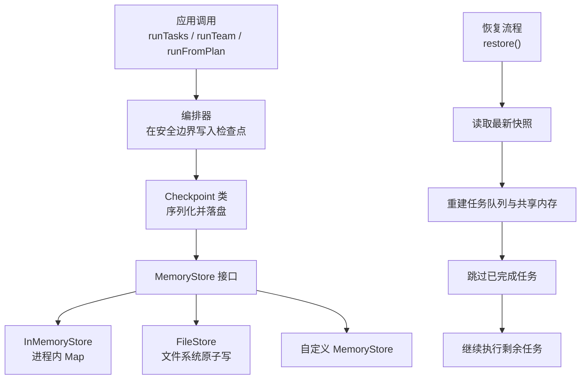
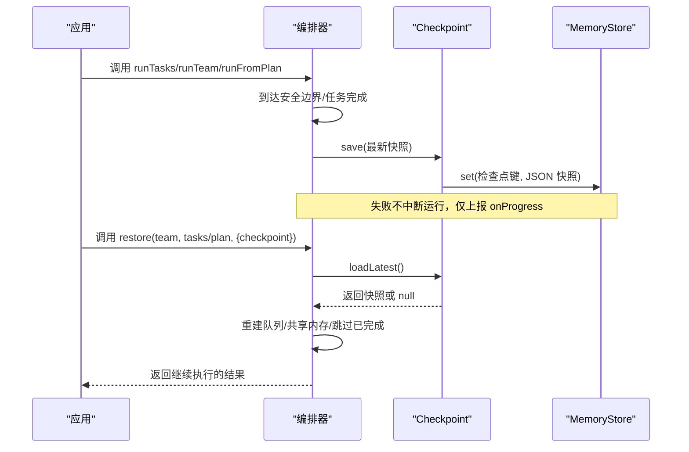
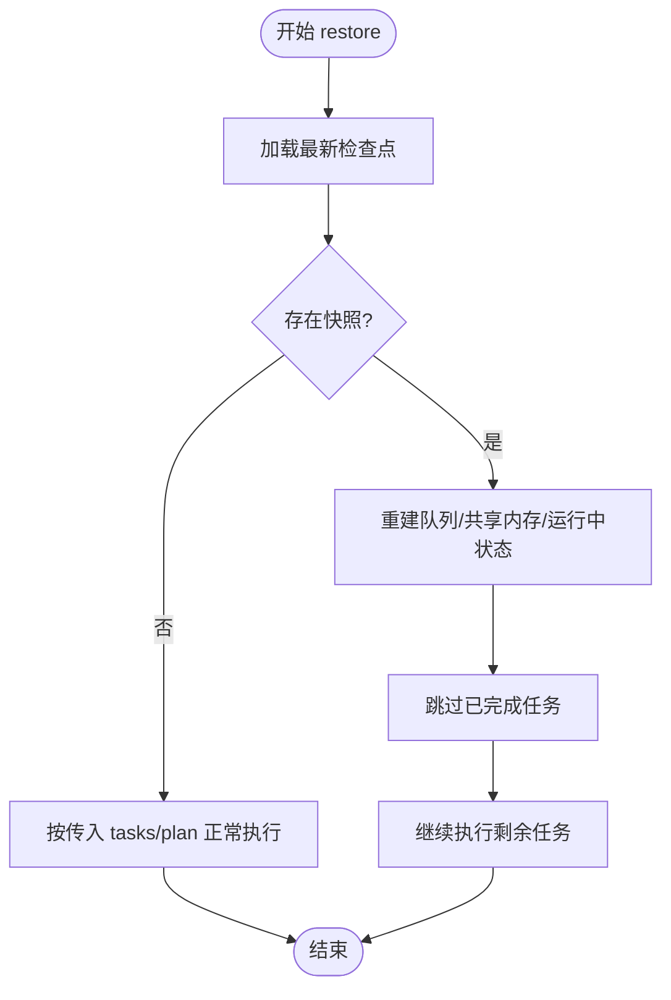
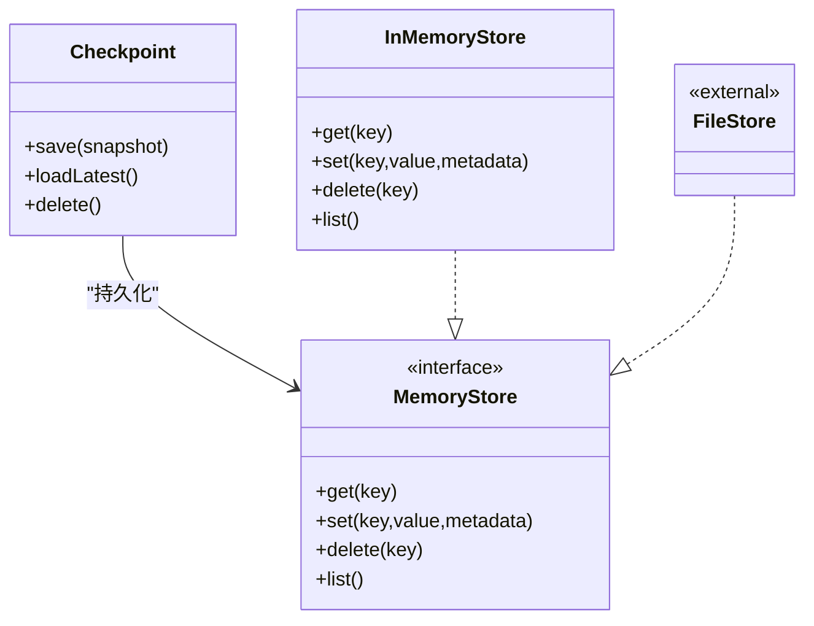

# 检查点系统

<cite>
**本文引用的文件**
- [checkpoint.md](file://docs/checkpoint.md)
- [checkpoint.ts](file://packages/core/src/memory/checkpoint.ts)
- [store.ts](file://packages/core/src/memory/store.ts)
- [checkpoint.test.ts](file://packages/core/tests/checkpoint.test.ts)
</cite>

## 目录
1. [简介](#简介)
2. [项目结构](#项目结构)
3. [核心组件](#核心组件)
4. [架构总览](#架构总览)
5. [详细组件分析](#详细组件分析)
6. [依赖分析](#依赖分析)
7. [性能考虑](#性能考虑)
8. [故障排查指南](#故障排查指南)
9. [结论](#结论)
10. [附录](#附录)

## 简介
本章节介绍 Open Multi-Agent 的检查点系统，覆盖以下内容：
- 检查点的创建机制与触发时机（安全边界、任务完成时）
- 手动检查点操作
- 检查点数据结构（执行身份、任务队列状态、共享内存、已完成任务结果、运行中状态等）
- 存储后端（InMemoryStore、FileStore 及自定义实现）
- 恢复流程（restore() 的使用、状态重建与任务跳过）
- 配置选项与最佳实践，确保长时间运行的工作流可靠恢复

## 项目结构
检查点能力由文档与核心代码共同定义：
- 文档层：docs/checkpoint.md 提供启用方式、配置项、持久化方案、恢复语义与限制说明。
- 实现层：packages/core/src/memory/checkpoint.ts 提供 Checkpoint 类、键命名规范与快照校验；packages/core/src/memory/store.ts 提供 InMemoryStore 默认内存存储；测试用例 packages/core/tests/checkpoint.test.ts 验证快照/恢复行为。

图表来源
- [checkpoint.md:11-107](file://docs/checkpoint.md#L11-L107)
- [checkpoint.ts:25-102](file://packages/core/src/memory/checkpoint.ts#L25-L102)
- [store.ts:31-167](file://packages/core/src/memory/store.ts#L31-L167)

章节来源
- [checkpoint.md:1-107](file://docs/checkpoint.md#L1-L107)
- [checkpoint.ts:25-102](file://packages/core/src/memory/checkpoint.ts#L25-L102)
- [store.ts:31-167](file://packages/core/src/memory/store.ts#L31-L167)

## 核心组件
- Checkpoint 类：负责检查点的保存、加载、删除与键生成，内置严格的快照格式校验，支持多版本兼容。
- MemoryStore 接口：抽象的持久化后端，统一 get/set/delete/list 等操作，便于替换为 Redis、SQLite 或文件系统实现。
- InMemoryStore：基于进程内 Map 的默认实现，适合测试与单进程场景。
- FileStore：文档中提供的零依赖文件系统实现，通过“临时文件 + fsync + rename”保证原子性，适合作为检查点持久化后端。
- 恢复流程：restore() 从最新检查点重建任务队列与共享内存，跳过已完成任务，并在必要时重新合成协调结果。

章节来源
- [checkpoint.ts:45-102](file://packages/core/src/memory/checkpoint.ts#L45-L102)
- [store.ts:31-167](file://packages/core/src/memory/store.ts#L31-L167)
- [checkpoint.md:11-107](file://docs/checkpoint.md#L11-L107)

## 架构总览
检查点系统在编排路径（runTeam、runTasks、runFromPlan、restore）上工作，以 MemoryStore 为唯一持久化抽象。关键要点：
- 触发时机：在“安全边界”（如模型对话轮次、工具调用提交点）与“每个任务完成后”写入最新快照。
- 数据范围：包含执行身份、任务队列分区、共享内存快照（当检查点存储与团队共享存储不同时会嵌入）、已完成任务结果、运行中的 LLM 工作区状态、审批延续状态、任务移交/溯源元数据。
- 存储键空间：使用保留命名空间 __oma_checkpoint__/...，避免与共享内存冲突。
- 恢复策略：无检查点则正常执行；有检查点则重建状态、跳过已完成任务、继续执行未完成部分。

图表来源
- [checkpoint.md:11-107](file://docs/checkpoint.md#L11-L107)
- [checkpoint.ts:57-102](file://packages/core/src/memory/checkpoint.ts#L57-L102)

## 详细组件分析

### 检查点创建与触发
- 自动触发：
  - 在编排器的“安全边界”（例如模型对话轮次结束、工具调用提交点）写入快照。
  - 在每个任务成功完成后写入快照。
- 手动触发：
  - 通过 Checkpoint.save() 直接保存当前快照，适用于需要显式落盘的场合。
- 失败处理：
  - 普通写入失败不会中断运行，通过 onProgress 事件上报 checkpoint_save_failed。
  - 可挂起的审批门控在精确边界必须成功写入，否则关闭失败。

章节来源
- [checkpoint.md:28-33](file://docs/checkpoint.md#L28-L33)
- [checkpoint.md:154-160](file://docs/checkpoint.md#L154-L160)
- [checkpoint.ts:57-74](file://packages/core/src/memory/checkpoint.ts#L57-L74)

### 检查点数据结构
- 执行身份（v4）：runId、attempt、lastTraceId、lastRootSpanId。恢复时保留逻辑 runId，递增 attempt，生成新的 trace/root ID，并返回 continued_from 链接。
- 任务队列状态：pending/in-progress/completed/failed/blocked/skipped 各分区。
- 共享内存：总是记录 turn 计数；当检查点存储与团队共享存储不同时，嵌入完整条目快照；相同存储时直接复用，避免重复写入。
- 已完成任务结果：taskId、assignee、原始 result、JSON 安全的 AgentRunResult（结构化字段、归一化状态/错误、token 用量、工具调用、消息）。非 JSON 可序列化的 caller-added 结果会被省略。
- 运行中状态：活跃内置 LLM 工作区的对话、消息、已完成轮次、token 用量、工具调用记录、下一恢复阶段、待处理工具调用；工具结果按模型发放的 call ID 独立提交。
- 审批延续状态：待处理审批请求与已消费决策，主记录位于 __oma_approval__/<requestId>，恢复时与检查点交叉校验。
- 任务移交/溯源：dependencyPayload、logical role、validated metadata 随队列快照保留。

章节来源
- [checkpoint.md:109-143](file://docs/checkpoint.md#L109-L143)
- [checkpoint.ts:104-202](file://packages/core/src/memory/checkpoint.ts#L104-L202)

### 存储后端
- InMemoryStore：进程内 Map，适合测试与单进程；不提供跨进程持久化。
- FileStore：文档中提供的文件系统实现，原子写（临时文件 → fsync → rename），适合检查点持久化；同一时间仅一个进程持有，并发写串行化。
- 自定义 MemoryStore：任何满足接口的后端均可接入（Redis、SQLite 等）。
- 密钥空间：检查点使用保留前缀 __oma_checkpoint__/...，审批使用 __oma_approval__/...，共享内存快照/恢复会跳过这些保留键。

章节来源
- [checkpoint.md:49-73](file://docs/checkpoint.md#L49-L73)
- [checkpoint.md:143-144](file://docs/checkpoint.md#L143-L144)
- [store.ts:31-167](file://packages/core/src/memory/store.ts#L31-L167)

### 恢复流程
- 入口：orchestrator.restore(team, tasks/plan, { checkpoint })。
- 行为：
  - 加载最新快照；若无则回退到正常执行。
  - 重建任务队列与共享内存，跳过已完成任务。
  - 对内置 LLM 工作区，恢复已完成轮次、token 用量、工具调用状态后继续。
  - runTeam 恢复会重新运行协调器综合，得到与首次运行一致的最终答案（需传入相同的协调器配置）。
  - 若综合不可用或失败，返回原始任务输出并触发 synthesis_failed 事件。
- 任务跳过：基于队列分区与已完成结果重建，避免重复执行。

图表来源
- [checkpoint.md:74-107](file://docs/checkpoint.md#L74-L107)

章节来源
- [checkpoint.md:74-107](file://docs/checkpoint.md#L74-L107)

### 配置选项与最佳实践
- 启用方式：
  - 每次调用传入 checkpoint 选项，或通过 OrchestratorConfig.checkpoint 设置全局默认。
  - checkpoint: true 为简写，复用团队的 shared-memory store（若有），否则使用编排器实例级私有内存存储。
- 关键选项：
  - enabled：是否启用（可单次禁用）。
  - store：检查点持久化后端（默认复用团队共享存储）。
  - runId/key：用于区分不同运行实例的键；当团队无共享存储时必须提供 distinct key，避免并发覆盖。
- 推荐实践：
  - 将 FileStore 作为检查点存储，保持共享内存为快速 InMemoryStore，减少频繁 I/O。
  - 如需跨进程持久化共享内存本身，可将共享存储也设为 FileStore，但注意每次写入都会重写整个文件。
  - 使用 RedactingStore 包裹检查点存储（以及共享存储）以脱敏敏感信息；注意恢复后值为掩码。
  - 对于可挂起工具，使用 toolCallId 作为幂等键，避免外部副作用重复执行。
  - 关注 onProgress 中的 checkpoint_save_failed 事件，监控持久化失败。

章节来源
- [checkpoint.md:11-48](file://docs/checkpoint.md#L11-L48)
- [checkpoint.md:49-73](file://docs/checkpoint.md#L49-L73)
- [checkpoint.md:172-199](file://docs/checkpoint.md#L172-L199)
- [checkpoint.md:206-249](file://docs/checkpoint.md#L206-L249)

## 依赖分析
- Checkpoint 类依赖 MemoryStore 接口进行持久化，并通过严格校验保证快照一致性。
- InMemoryStore 提供默认内存实现；FileStore 提供文件系统实现（文档描述其原子性与并发约束）。
- 恢复流程依赖队列快照与共享内存快照，结合已完成任务结果重建运行时状态。

图表来源
- [checkpoint.ts:45-102](file://packages/core/src/memory/checkpoint.ts#L45-L102)
- [store.ts:31-167](file://packages/core/src/memory/store.ts#L31-L167)

章节来源
- [checkpoint.ts:45-102](file://packages/core/src/memory/checkpoint.ts#L45-L102)
- [store.ts:31-167](file://packages/core/src/memory/store.ts#L31-L167)

## 性能考虑
- 写入频率：仅在安全边界与任务完成后写入，避免高频 I/O。
- 存储分离：建议将检查点存储与共享内存存储分离，减少共享内存热路径的持久化开销。
- 原子性：FileStore 通过原子写避免半写状态；跨进程并发写串行化，符合恢复顺序语义。
- 脱敏成本：RedactingStore 在写入时进行值脱敏，可能带来额外 CPU 开销，按需启用。

[本节为通用指导，无需具体文件引用]

## 故障排查指南
- 常见现象与定位：
  - 检查点写入失败：查看 onProgress 中的 error 事件，data.kind 为 checkpoint_save_failed，确认后端可用性与网络/磁盘状态。
  - 恢复未生效：确认 store 中是否存在 __oma_checkpoint__/... 键；检查 runId/key 是否正确；确认团队是否有共享存储且键空间未被污染。
  - 审批门控失败：可挂起工具必须在精确边界成功保存，否则关闭失败；检查审批主记录与检查点的一致性。
- 诊断步骤：
  - 列出 store 中所有键，过滤出检查点与审批相关键，确认键空间隔离。
  - 使用 Checkpoint.loadLatest() 读取最新快照，验证版本、mode、createdAt、completedTaskResults 等关键字段。
  - 对比队列快照与共享内存快照，确认任务分区与已完成结果一致。

章节来源
- [checkpoint.md:154-160](file://docs/checkpoint.md#L154-L160)
- [checkpoint.md:143-144](file://docs/checkpoint.md#L143-L144)
- [checkpoint.ts:76-102](file://packages/core/src/memory/checkpoint.ts#L76-L102)

## 结论
Open Multi-Agent 的检查点系统通过统一的 MemoryStore 抽象，提供了轻量、可扩展的持久化能力。它在安全边界与任务完成后自动落盘，支持灵活恢复与任务跳过，配合 FileStore 与 RedactingStore 可满足生产环境的可靠性与安全需求。遵循文档中的配置与最佳实践，可确保长时间运行的工作流在崩溃或重启后稳定恢复。

[本节为总结，无需具体文件引用]

## 附录
- 示例参考：
  - 启用检查点与恢复：见 docs/checkpoint.md 中的示例片段路径。
  - 单元测试验证：packages/core/tests/checkpoint.test.ts 覆盖了队列快照、共享内存快照、检查点持久化与恢复等场景。

章节来源
- [checkpoint.md:11-107](file://docs/checkpoint.md#L11-L107)
- [checkpoint.test.ts:129-193](file://packages/core/tests/checkpoint.test.ts#L129-L193)