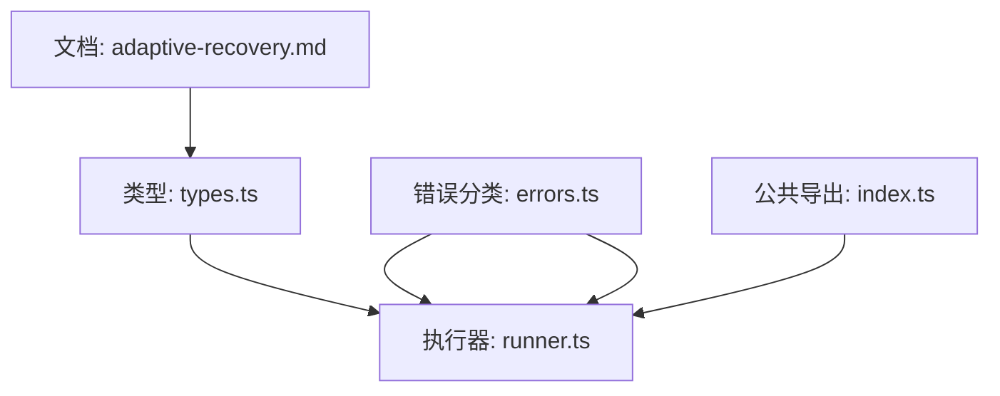
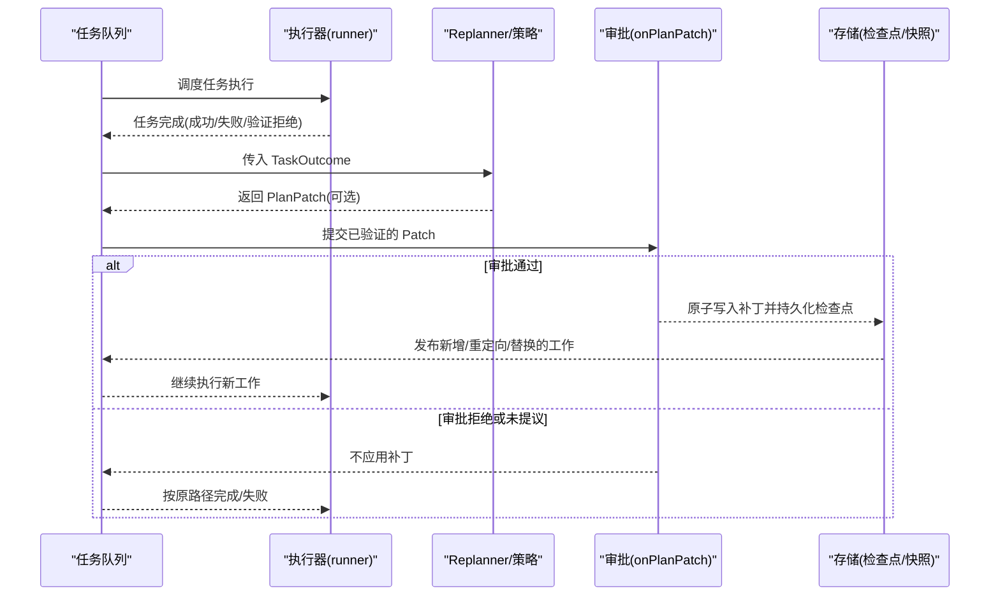
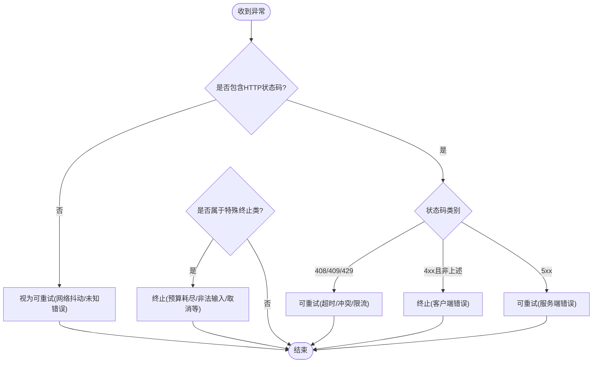
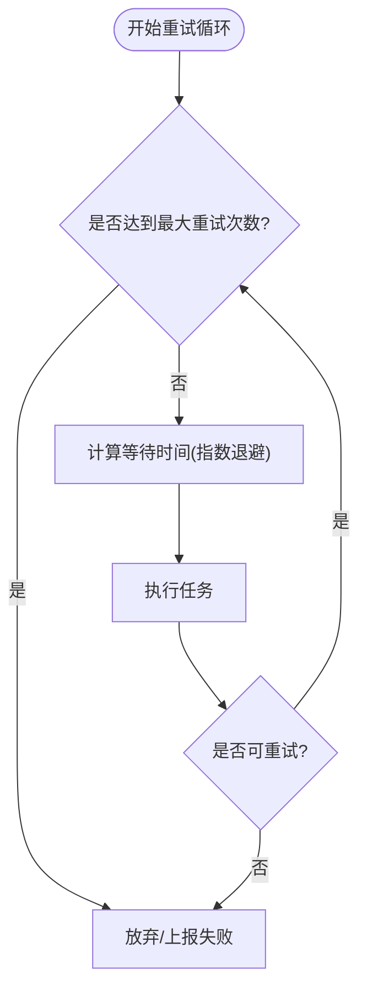
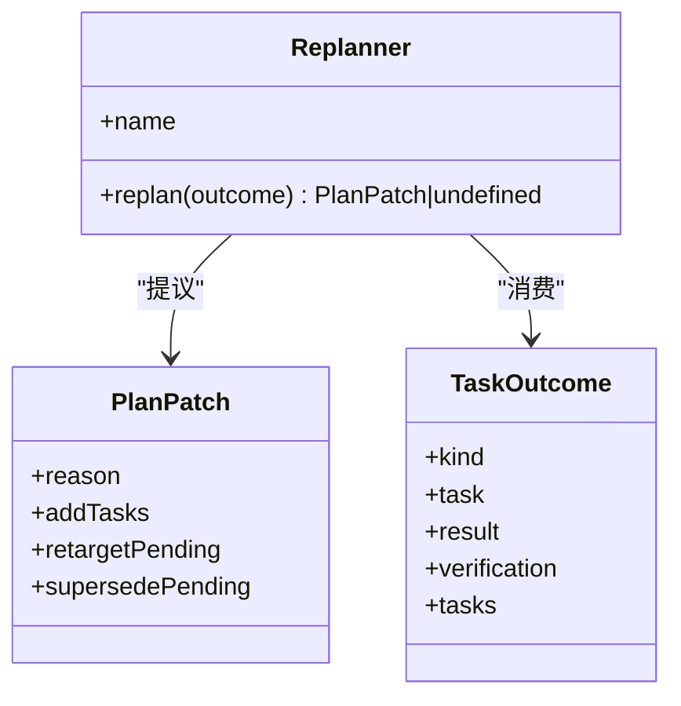
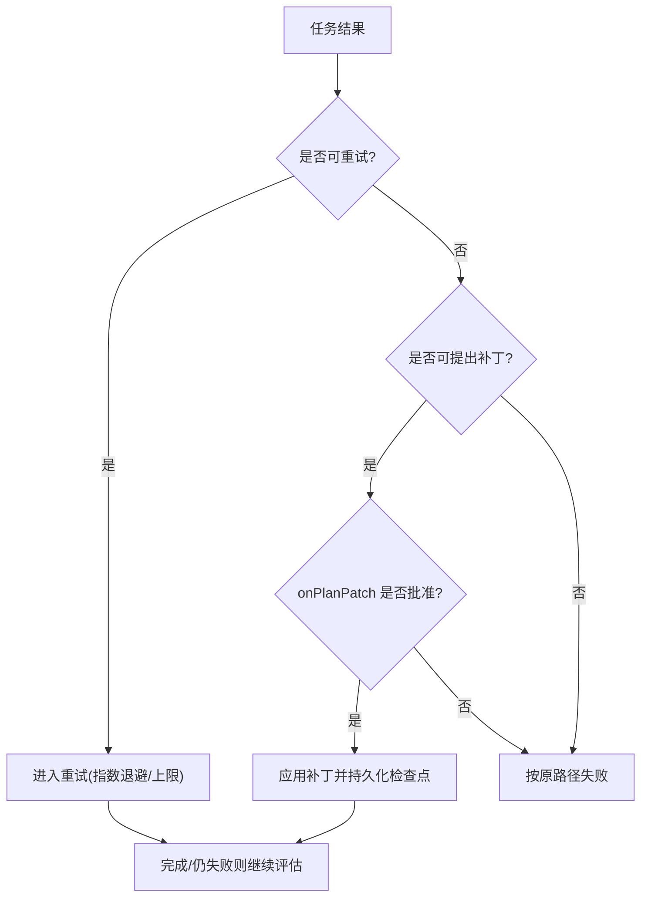
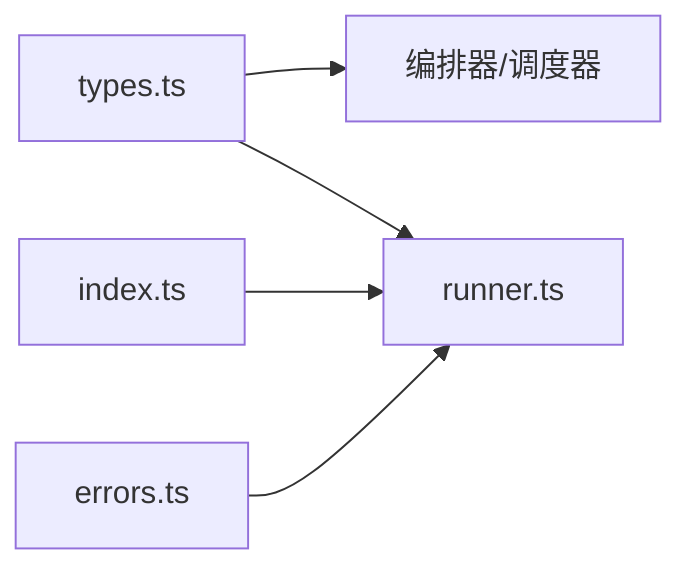

# 自适应恢复

<cite>
**本文引用的文件**
- [adaptive-recovery.md](file://docs/adaptive-recovery.md)
- [types.ts](file://packages/core/src/types.ts)
- [errors.ts](file://packages/core/src/errors.ts)
- [runner.ts](file://packages/core/src/agent/runner.ts)
- [index.ts](file://packages/core/src/index.ts)
</cite>

## 目录
1. [简介](#简介)
2. [项目结构](#项目结构)
3. [核心组件](#核心组件)
4. [架构总览](#架构总览)
5. [详细组件分析](#详细组件分析)
6. [依赖关系分析](#依赖关系分析)
7. [性能考量](#性能考量)
8. [故障排查指南](#故障排查指南)
9. [结论](#结论)
10. [附录](#附录)

## 简介
本章节面向需要构建健壮 AI 应用的开发者，系统介绍 Open Multi-Agent（OMA）的“自适应恢复”能力。它通过任务结果屏障在运行时对计划进行“仅追加式”修复：当某个任务成功、失败或被共识验证拒绝时，可提议新增或替换后续工作，并在策略与审批通过后原子化应用补丁，从而在不破坏历史的前提下提升整体成功率。同时，框架内置了重试与超时等基础恢复能力，配合检查点机制实现中断恢复与幂等执行。

## 项目结构
- 文档层：docs/adaptive-recovery.md 提供自适应恢复的概念、配置与边界说明。
- 类型与接口层：packages/core/src/types.ts 定义 Replanner、RecoveryOptions、PlanPatch、TaskOutcome、PlanRevision 等关键类型，以及任务级别的 maxRetries/retryDelayMs/retryBackoff 等重试配置。
- 错误分类与可重试判断：packages/core/src/errors.ts 提供 isRetryableError 等工具，统一识别网络错误、超时、服务不可用等异常的可重试性。
- 执行器与流式处理：packages/core/src/agent/runner.ts 负责 LLM 调用、工具执行、检查点持久化、取消与超时的分类上报。
- 公共导出：packages/core/src/index.ts 暴露 executeWithRetry、computeRetryDelay 等重试相关能力。

图表来源
- [adaptive-recovery.md:1-132](file://docs/adaptive-recovery.md#L1-L132)
- [types.ts:1441-1513](file://packages/core/src/types.ts#L1441-L1513)
- [errors.ts:208-239](file://packages/core/src/errors.ts#L208-L239)
- [runner.ts:634-648](file://packages/core/src/agent/runner.ts#L634-L648)
- [index.ts:57-62](file://packages/core/src/index.ts#L57-L62)

章节来源
- [adaptive-recovery.md:1-132](file://docs/adaptive-recovery.md#L1-L132)
- [types.ts:1441-1513](file://packages/core/src/types.ts#L1441-L1513)
- [errors.ts:208-239](file://packages/core/src/errors.ts#L208-L239)
- [runner.ts:634-648](file://packages/core/src/agent/runner.ts#L634-L648)
- [index.ts:57-62](file://packages/core/src/index.ts#L57-L62)

## 核心组件
- 自适应恢复（Adaptive Recovery）
  - 以“任务结果屏障”为触发点，允许在任务成功/失败/被共识拒绝后提出 PlanPatch（仅追加），经校验与审批后原子应用并持久化检查点，再发布新就绪工作。
  - 支持 retargetPending（重定向待执行）、supersedePending（跳过并替换）、addTasks（追加任务）。
- 重试与退避（Retry & Backoff）
  - 任务级配置：maxRetries、retryDelayMs、retryBackoff。
  - 可重试判定：isRetryableError 将网络抖动、请求超时（408）、冲突（409）、限流（429）及 5xx 视为可重试；预算耗尽、非法输入、用户取消等为终止错误。
- 降级与替代路径（Fallback/Replacement）
  - 通过 Replanner 在失败或验证拒绝时提议备用任务（如备用模型/备用数据源/简化任务），由 onPlanPatch 策略决定是否批准。
- 检查点与恢复（Checkpoint & Restore）
  - 接受修订后保存快照，崩溃恢复时保留历史修订记录，避免重复追加相同触发与结果。

章节来源
- [adaptive-recovery.md:1-132](file://docs/adaptive-recovery.md#L1-L132)
- [types.ts:1441-1513](file://packages/core/src/types.ts#L1441-L1513)
- [types.ts:2082-2099](file://packages/core/src/types.ts#L2082-L2099)
- [errors.ts:208-239](file://packages/core/src/errors.ts#L208-L239)
- [runner.ts:1046-1069](file://packages/core/src/agent/runner.ts#L1046-L1069)

## 架构总览
下图展示从任务完成到自适应恢复的关键交互：任务产出结果 → 触发 Replanner/onTaskOutcome → 生成 PlanPatch → 校验与 onPlanPatch 审批 → 原子应用补丁并持久化检查点 → 发布新工作 → 原任务最终完成或失败。

图表来源
- [adaptive-recovery.md:7-21](file://docs/adaptive-recovery.md#L7-L21)
- [types.ts:1441-1513](file://packages/core/src/types.ts#L1441-L1513)
- [runner.ts:634-648](file://packages/core/src/agent/runner.ts#L634-L648)

## 详细组件分析

### 失败检测算法
- 超时与取消
  - 执行器在 LLM 调用中捕获超时与取消信号，分别归类为 timeout 与 cancelled，并上报状态与错误信息。
- 可重试判定
  - 使用 isRetryableError 统一判断：网络抖动、408/409/429、5xx 视为可重试；预算耗尽、非法消息、不支持的工具调用、用户取消等视为终止错误。
- 服务不可用与协议错误
  - 未携带状态码的错误默认视为可重试；若存在 HTTP 状态码，则依据 4xx/5xx 规则区分。

图表来源
- [errors.ts:208-239](file://packages/core/src/errors.ts#L208-L239)
- [runner.ts:634-648](file://packages/core/src/agent/runner.ts#L634-L648)

章节来源
- [errors.ts:208-239](file://packages/core/src/errors.ts#L208-L239)
- [runner.ts:634-648](file://packages/core/src/agent/runner.ts#L634-L648)

### 重试策略配置
- 任务级重试参数
  - maxRetries：最大重试次数（默认 0，即不重试）。
  - retryDelayMs：首次重试前的基础延迟（毫秒）。
  - retryBackoff：指数退避乘数（默认 2）。
- 重试条件
  - 由 isRetryableError 决定；结合上层调度器/编排器的重试循环（executeWithRetry/computeRetryDelay）实现指数退避与上限控制。
- 建议
  - 对网络抖动/限流场景开启重试；对预算耗尽、非法输入、用户取消等终止错误不应重试。

图表来源
- [types.ts:2082-2089](file://packages/core/src/types.ts#L2082-L2089)
- [errors.ts:208-239](file://packages/core/src/errors.ts#L208-L239)
- [index.ts:57-62](file://packages/core/src/index.ts#L57-L62)

章节来源
- [types.ts:2082-2089](file://packages/core/src/types.ts#L2082-L2089)
- [errors.ts:208-239](file://packages/core/src/errors.ts#L208-L239)
- [index.ts:57-62](file://packages/core/src/index.ts#L57-L62)

### 降级处理机制
- 备用模型/数据源
  - 通过 Replanner.replan 根据 TaskOutcome 选择备用路径（例如切换到备用搜索源或备用模型），并以 addTasks 追加新任务。
- 简化任务执行
  - 在主任务失败时，可追加一个更轻量或容错的替代任务，确保下游仍能获得部分结果。
- 部分结果返回
  - 即使主分支失败，也可通过替换/重定向让下游消费已有中间结果，提高整体可用性。

图表来源
- [types.ts:1441-1513](file://packages/core/src/types.ts#L1441-L1513)
- [adaptive-recovery.md:23-80](file://docs/adaptive-recovery.md#L23-L80)

章节来源
- [adaptive-recovery.md:23-99](file://docs/adaptive-recovery.md#L23-L99)
- [types.ts:1441-1513](file://packages/core/src/types.ts#L1441-L1513)

### 恢复决策逻辑
- 何时重试
  - 当错误被判定为可重试（网络抖动、超时、限流、服务端错误）且未达到最大重试次数时，进入重试循环。
- 何时降级
  - 当任务失败或被共识验证拒绝，且 Replanner 能提出有效的 PlanPatch（至少包含一个替换任务），并通过 onPlanPatch 审批，则进入降级/替换路径。
- 何时放弃
  - 当错误为终止类（预算耗尽、非法输入、用户取消、不支持的工具调用等），或超过最大重试次数，或无法提出有效补丁时，放弃该任务并按原路径失败。

图表来源
- [errors.ts:208-239](file://packages/core/src/errors.ts#L208-L239)
- [adaptive-recovery.md:7-21](file://docs/adaptive-recovery.md#L7-L21)
- [types.ts:1441-1513](file://packages/core/src/types.ts#L1441-L1513)

章节来源
- [errors.ts:208-239](file://packages/core/src/errors.ts#L208-L239)
- [adaptive-recovery.md:7-21](file://docs/adaptive-recovery.md#L7-L21)
- [types.ts:1441-1513](file://packages/core/src/types.ts#L1441-L1513)

### 检查点与恢复
- 接受修订后保存快照，崩溃恢复时保留历史修订记录，避免重复追加相同触发与结果。
- 历史任务保持真实：修复后的失败仍标记为 failed，但带有 recoveredByRevision；被替换的分支标记为 skipped，并带有 supersededByRevision。

章节来源
- [adaptive-recovery.md:100-119](file://docs/adaptive-recovery.md#L100-L119)
- [types.ts:1445-1456](file://packages/core/src/types.ts#L1445-L1456)
- [runner.ts:1046-1069](file://packages/core/src/agent/runner.ts#L1046-L1069)

## 依赖关系分析
- 类型依赖：Replanner、RecoveryOptions、PlanPatch、TaskOutcome、PlanRevision 等集中在 types.ts，作为恢复策略与编排器的契约。
- 错误分类：errors.ts 提供统一的错误分类与可重试判断，供执行器与上层重试逻辑复用。
- 执行器：runner.ts 负责 LLM 调用、工具执行、检查点持久化，并将超时/取消等事件分类上报。
- 公共 API：index.ts 暴露 executeWithRetry、computeRetryDelay，便于上层实现重试与退避。

图表来源
- [types.ts:1441-1513](file://packages/core/src/types.ts#L1441-L1513)
- [errors.ts:208-239](file://packages/core/src/errors.ts#L208-L239)
- [runner.ts:634-648](file://packages/core/src/agent/runner.ts#L634-L648)
- [index.ts:57-62](file://packages/core/src/index.ts#L57-L62)

章节来源
- [types.ts:1441-1513](file://packages/core/src/types.ts#L1441-L1513)
- [errors.ts:208-239](file://packages/core/src/errors.ts#L208-L239)
- [runner.ts:634-648](file://packages/core/src/agent/runner.ts#L634-L648)
- [index.ts:57-62](file://packages/core/src/index.ts#L57-L62)

## 性能考量
- 重试成本：指数退避可有效降低瞬时拥塞，但需设置合理的 maxRetries 与 retryBackoff，避免雪崩。
- 降级开销：补充任务会增加整体 DAG 规模，应限制 maxAddedTasks 与 maxPlanRevisions，防止图膨胀。
- 检查点频率：在执行器中对关键阶段（如工具调用前、结果提交前）持久化检查点，平衡可靠性与 I/O 开销。
- 观测与限流：利用进度事件与追踪指标监控重试与恢复频率，结合速率限制与熔断策略保护后端服务。

[本节为通用指导，不直接分析具体文件]

## 故障排查指南
- 常见错误与定位
  - 超时：检查 LLM 调用超时与每调用超时配置，确认上游服务响应时间与重试策略。
  - 限流/冲突：关注 429/409 等状态码，调整重试间隔与并发度。
  - 预算耗尽：核对 token/cost 预算与任务复杂度，必要时拆分任务或启用降级。
  - 非法输入/工具不支持：校验消息结构与工具注册，避免无效重试。
- 调试技巧
  - 启用检查点与运行回放，观察任务 DAG 与 span 瀑布图，定位失败点与恢复路径。
  - 订阅 orchestrator 事件（如 task_retry、task_complete），统计重试次数与耗时分布。
  - 在 Replanner 中打印 reason 与 addedTasks，确认降级策略是否符合预期。

章节来源
- [errors.ts:208-239](file://packages/core/src/errors.ts#L208-L239)
- [adaptive-recovery.md:100-132](file://docs/adaptive-recovery.md#L100-L132)
- [runner.ts:634-648](file://packages/core/src/agent/runner.ts#L634-L648)

## 结论
Open Multi-Agent 的自适应恢复以“任务结果屏障 + 仅追加式补丁”为核心，结合可重试判定、指数退避、检查点与审批门控，形成一套兼顾弹性与可控性的恢复体系。开发者可通过 Replanner 与 RecoveryOptions 灵活定制降级与恢复策略，借助观测与回放快速定位问题，构建高可用的多智能体应用。

[本节为总结性内容，不直接分析具体文件]

## 附录
- 配置要点速查
  - 启用自适应恢复：设置 recovery.mode 为 repairable，并提供 Replanner 或 onTaskOutcome。
  - 限制修复规模：设置 maxPlanRevisions 与 maxAddedTasks，防止图无限增长。
  - 审批门控：实现 onPlanPatch 以纳入业务策略审批。
  - 任务重试：配置 maxRetries、retryDelayMs、retryBackoff，并结合 isRetryableError 控制重试范围。
- 参考路径
  - 自适应恢复文档：docs/adaptive-recovery.md
  - 类型定义：packages/core/src/types.ts
  - 错误分类：packages/core/src/errors.ts
  - 执行器与检查点：packages/core/src/agent/runner.ts
  - 重试能力导出：packages/core/src/index.ts

[本节为参考资料索引，不直接分析具体文件]