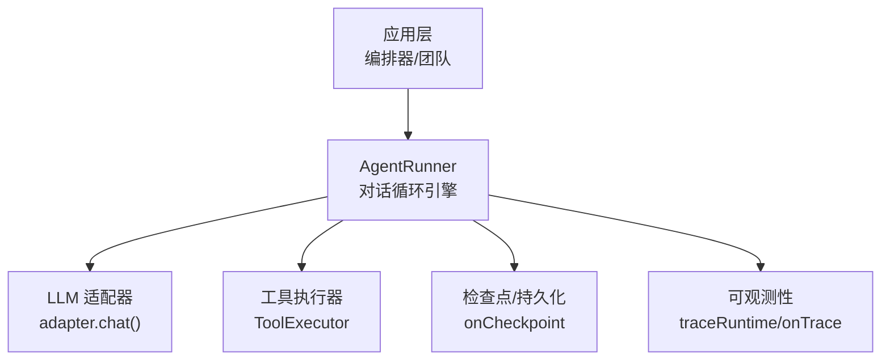
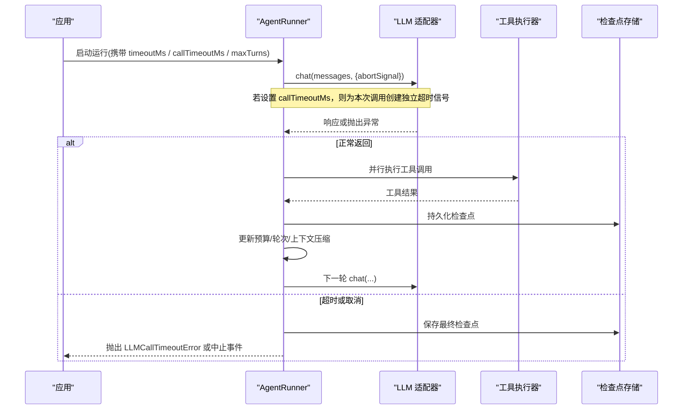
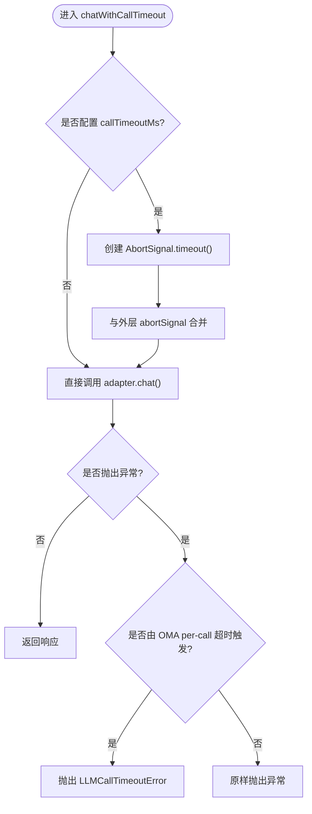
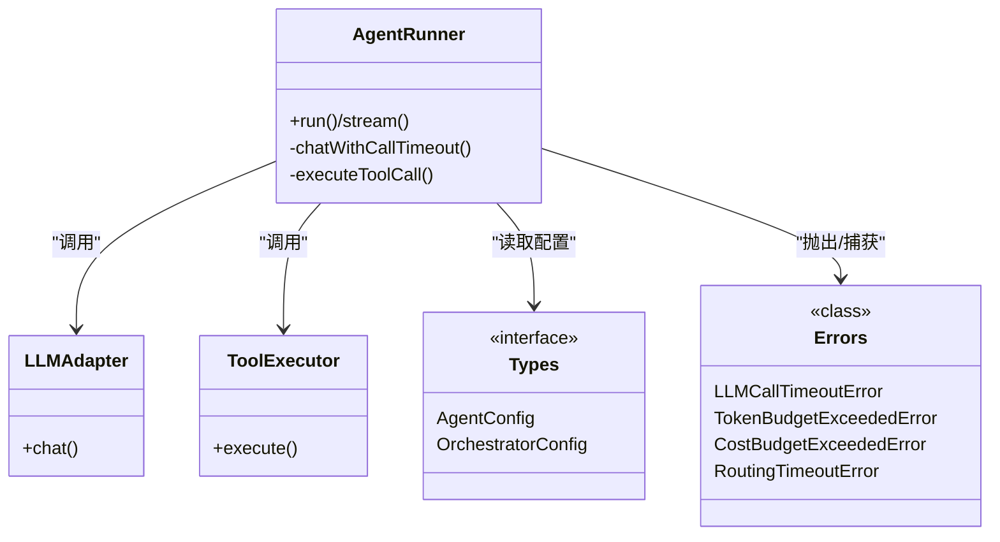

# 超时控制

<cite>
**本文引用的文件**
- [runner.ts](file://packages/core/src/agent/runner.ts)
- [types.ts](file://packages/core/src/types.ts)
- [errors.ts](file://packages/core/src/errors.ts)
</cite>

## 目录
1. [简介](#简介)
2. [项目结构](#项目结构)
3. [核心组件](#核心组件)
4. [架构总览](#架构总览)
5. [详细组件分析](#详细组件分析)
6. [依赖关系分析](#依赖关系分析)
7. [性能考虑](#性能考虑)
8. [故障排查指南](#故障排查指南)
9. [结论](#结论)
10. [附录：配置示例与调优建议](#附录：配置示例与调优建议)

## 简介
本章节聚焦 Open Multi-Agent（OMA）在长时间运行中的“超时控制”机制，覆盖以下方面：
- 请求级超时：LLM API 调用超时、工具执行超时、HTTP 请求超时的统一约束。
- 长时间运行保护：任务执行时间限制、对话轮次限制、内存/上下文增长控制。
- 资源清理：超时后的连接关闭、中间状态释放、文件清理策略。
- 处理策略：优雅降级、部分结果返回、错误报告与可观测性。
- 配置与调优：提供可操作的配置要点与性能优化建议，确保系统在长时间运行中稳定可靠。

## 项目结构
与超时控制直接相关的代码集中在核心包的核心运行时：
- AgentRunner：驱动智能体对话循环，封装 LLM 调用、工具执行、检查点持久化、预算与循环检测。
- 类型定义：AgentConfig/OrchestratorConfig 等暴露了超时、轮次、预算、压缩等关键开关。
- 错误体系：定义了 LLM 调用超时、路由超时、预算超限等结构化错误，便于上层区分与重试。

图表来源
- [runner.ts:472-993](file://packages/core/src/agent/runner.ts#L472-L993)
- [runner.ts:875-1326](file://packages/core/src/agent/runner.ts#L875-L1326)

章节来源
- [runner.ts:472-993](file://packages/core/src/agent/runner.ts#L472-L993)
- [runner.ts:875-1326](file://packages/core/src/agent/runner.ts#L875-L1326)

## 核心组件
- 每调用超时（per-call timeout）：为每次 adapter.chat() 注入独立的 AbortSignal.timeout()，与整体运行的 abortSignal 组合，先触发者生效；若由 OMA 的 per-call 超时触发，则抛出 LLMCallTimeoutError，区别于调用方主动取消。
- 整跑超时（whole-run timeout）：通过 AgentConfig.timeoutMs 设置整个 agent 运行的最大墙钟时间，使用 AbortSignal.timeout() 贯穿运行生命周期。
- 轮次上限（maxTurns）：防止无限循环，配合循环检测在达到上限前尽早退出。
- 预算控制（token/cost budget）：累计 token 或成本超过阈值时，停止继续调用并上报预算超限事件。
- 上下文压缩：对已消费的工具结果和推理文本进行压缩，避免上下文膨胀导致后续调用变慢或失败。
- 工具输出长度限制：全局或按工具限制 maxOutputChars，避免超大输出拖垮系统。

章节来源
- [types.ts:1085-1117](file://packages/core/src/types.ts#L1085-L1117)
- [runner.ts:544-582](file://packages/core/src/agent/runner.ts#L544-L582)
- [runner.ts:875-1326](file://packages/core/src/agent/runner.ts#L875-L1326)

## 架构总览
下图展示一次带超时的 LLM 调用流程，以及它与整跑超时、工具执行、检查点的交互。

图表来源
- [runner.ts:544-582](file://packages/core/src/agent/runner.ts#L544-L582)
- [runner.ts:875-1326](file://packages/core/src/agent/runner.ts#L875-L1326)

## 详细组件分析

### LLM 调用超时（per-call timeout）
- 实现要点：
  - 每次调用 adapter.chat() 前，若配置了 callTimeoutMs，则创建新的 AbortSignal.timeout() 并与外层 abortSignal 合并。
  - 仅当 OMA 的 per-call 超时触发且非调用方主动取消时，才转换为 LLMCallTimeoutError，便于上层区分“服务卡死”与“主动中断”。
  - 该机制对所有由 runner 发起的模型调用生效，包括主循环与摘要压缩场景。
- 复杂度与影响：
  - 每个调用额外创建一个 AbortSignal，开销极低。
  - 将不同供应商 SDK 的默认超时行为统一为可预期、可观测的边界。

图表来源
- [runner.ts:544-582](file://packages/core/src/agent/runner.ts#L544-L582)
- [errors.ts:56-81](file://packages/core/src/errors.ts#L56-L81)

章节来源
- [runner.ts:544-582](file://packages/core/src/agent/runner.ts#L544-L582)
- [errors.ts:56-81](file://packages/core/src/errors.ts#L56-L81)

### 整跑超时（whole-run timeout）
- 作用范围：整个 agent 运行的最大墙钟时间，通过 AgentConfig.timeoutMs 设置。
- 行为：在运行期间持续监听 abortSignal，一旦触发即中止后续 LLM 调用与工具执行，并保存检查点以便恢复或清理。
- 适用场景：本地模型推理不可预测、外部依赖不稳定、需要强 SLA 的生产环境。

章节来源
- [types.ts:1085-1089](file://packages/core/src/types.ts#L1085-L1089)
- [runner.ts:875-1326](file://packages/core/src/agent/runner.ts#L875-L1326)

### 对话轮次限制与循环检测
- 轮次上限：maxTurns 限制一轮对话的最大轮数，防止无界循环。
- 循环检测：可选的 loopDetection 会跟踪重复的工具调用与文本输出，在达到 maxTurns 之前提前发现“卡住”的模式，并可注入警告或终止。
- 效果：降低无效重试与资源浪费，提升长时间运行的稳定性。

章节来源
- [types.ts:1107-1110](file://packages/core/src/types.ts#L1107-L1110)
- [runner.ts:1220-1234](file://packages/core/src/agent/runner.ts#L1220-L1234)

### 预算控制（Token/Cost）
- Token 预算：累计输入+输出 token 超过 maxTokenBudget 时，停止继续调用并上报 budget_exceeded 事件。
- 成本预算：类似地，超出成本预算时也会中止并上报。
- 优势：避免“越用越贵”的失控，保障生产环境的成本可控。

章节来源
- [runner.ts:1204-1215](file://packages/core/src/agent/runner.ts#L1204-L1215)
- [errors.ts:24-54](file://packages/core/src/errors.ts#L24-L54)

### 工具执行超时与 HTTP 请求超时
- 工具执行超时：当前代码库未提供统一的“工具执行超时”配置项。工具调用由 ToolExecutor 执行，建议在工具实现内部加入超时控制（例如网络请求、子进程、文件系统操作），或在网关/代理层施加超时。
- HTTP 请求超时：LLM 适配器的底层 HTTP 请求受 per-call timeout 保护（通过 AbortSignal.timeout()）。对于自定义工具的内部 HTTP 调用，需自行设置超时或使用具备超时能力的客户端。
- 建议：
  - 对外部 I/O 密集的工具，务必在工具内部设置合理的超时与重试退避。
  - 对长耗时工具，结合 onToolCall/onToolResult 回调与检查点，实现可恢复的执行。

章节来源
- [runner.ts:1364-1395](file://packages/core/src/agent/runner.ts#L1364-L1395)

### 资源清理机制
- 检查点持久化：在关键阶段（如工具执行前、完成后、完成态）写入检查点，确保超时或崩溃后可恢复或安全终止。
- 连接关闭：通过 AbortSignal 中止正在进行的 LLM 调用，促使底层 HTTP 连接尽快释放。
- 文件清理：内置文件系统工具受 cwd 沙箱限制；若工具产生临时文件，应在工具内部实现清理逻辑（成功/失败路径均清理）。
- 上下文压缩：对已消费的工具结果与推理文本进行压缩，减少内存占用与后续调用延迟。

章节来源
- [runner.ts:1046-1069](file://packages/core/src/agent/runner.ts#L1046-L1069)
- [runner.ts:1317-1320](file://packages/core/src/agent/runner.ts#L1317-L1320)
- [types.ts:1118-1185](file://packages/core/src/types.ts#L1118-L1185)

### 超时处理策略
- 优雅降级：
  - 检测到循环或预算超限时，停止进一步调用，返回已有结果或提示。
  - 对工具结果进行压缩，保留关键信息，避免上下文爆炸。
- 部分结果返回：
  - 工具并行执行时，单个工具超时不影响其他工具结果；可在检查点中记录已完成的部分。
- 错误报告：
  - 明确区分 LLM 调用超时、路由超时、预算超限、取消等不同错误类型，便于上层告警与重试策略。
  - isRetryableError 将 LLMCallTimeoutError/RoutingTimeoutError 视为可重试，其他如预算超限、非法消息等为不可重试。

章节来源
- [errors.ts:208-238](file://packages/core/src/errors.ts#L208-L238)
- [runner.ts:1204-1215](file://packages/core/src/agent/runner.ts#L1204-L1215)

## 依赖关系分析
- AgentRunner 依赖：
  - LLMAdapter：负责与具体模型提供商通信，受 per-call timeout 保护。
  - ToolExecutor：执行工具调用，应自带超时与资源管理。
  - 检查点存储：用于持久化运行状态，支持恢复与回滚。
  - 可观测性：traceRuntime/onTrace 用于追踪与指标采集。
- 类型与错误：
  - AgentConfig/OrchestratorConfig 暴露超时、轮次、预算、压缩等配置。
  - errors.ts 提供结构化错误分类与重试判定。

图表来源
- [runner.ts:472-993](file://packages/core/src/agent/runner.ts#L472-L993)
- [types.ts:1085-1117](file://packages/core/src/types.ts#L1085-L1117)
- [errors.ts:24-94](file://packages/core/src/errors.ts#L24-L94)

章节来源
- [runner.ts:472-993](file://packages/core/src/agent/runner.ts#L472-L993)
- [types.ts:1085-1117](file://packages/core/src/types.ts#L1085-L1117)
- [errors.ts:24-94](file://packages/core/src/errors.ts#L24-L94)

## 性能考虑
- 合理设置 per-call timeout：过短会导致频繁超时重试，过长可能拖慢整体响应。建议根据模型与网络状况基准测试后设定。
- 整跑 timeout 与 maxTurns 协同：整跑超时作为兜底，maxTurns 控制对话深度，二者共同避免长时间挂起。
- 预算控制：开启 token/cost 预算，防止“越用越多”，同时结合上下文压缩降低后续调用成本。
- 工具超时与重试：对 I/O 密集型工具设置超时与指数退避重试，避免雪崩。
- 监控与可观测性：利用 traceRuntime/onTrace 收集延迟、错误率、预算使用情况，指导调优。

## 故障排查指南
- 现象：某次 LLM 调用频繁超时
  - 检查 callTimeoutMs 是否过小；查看 LLMCallTimeoutError 的 timeoutMs 与 agent 名称。
  - 确认网络与模型端是否出现抖动；必要时增大 per-call timeout 或增加重试。
- 现象：运行长时间后被中断
  - 检查 timeoutMs 是否过短；查看是否在预算超限时被中止。
  - 检查是否存在循环模式，启用 loopDetection 并观察注入的警告。
- 现象：工具执行缓慢或卡死
  - 在工具内部添加超时与日志；结合 onToolCall/onToolResult 定位瓶颈。
  - 对网络/文件/子进程等外部依赖设置超时与清理。
- 现象：上下文过大导致响应变慢
  - 启用 compressToolResults/compressReasoningText，调整阈值以减少上下文体积。

章节来源
- [errors.ts:56-94](file://packages/core/src/errors.ts#L56-L94)
- [runner.ts:1204-1215](file://packages/core/src/agent/runner.ts#L1204-L1215)
- [types.ts:1118-1185](file://packages/core/src/types.ts#L1118-L1185)

## 结论
Open Multi-Agent 通过“每调用超时 + 整跑超时 + 轮次上限 + 预算控制 + 上下文压缩”的组合拳，构建了面向长时间运行的健壮超时控制体系。其设计将不同供应商 SDK 的默认行为统一到可观测、可配置的边界内，并通过检查点与错误分类支持优雅降级与部分结果返回。在生产环境中，建议结合业务 SLA 与模型特性，精细调参并完善监控告警，以确保系统稳定、可控、可恢复。

## 附录：配置示例与调优建议
以下为常见配置要点（以字段名与说明为主，不展示代码片段）：
- 整跑超时
  - 字段：timeoutMs
  - 说明：整个 agent 运行的最大墙钟时间，适用于本地模型或外部依赖不稳的场景。
- 每调用超时
  - 字段：callTimeoutMs
  - 说明：单次 adapter.chat() 的超时，独立于整跑超时，优先触发者生效；超时抛出 LLMCallTimeoutError。
- 对话轮次限制
  - 字段：maxTurns
  - 说明：限制对话轮数，防止无界循环；建议与循环检测配合使用。
- 预算控制
  - 字段：maxTokenBudget（及成本预算相关配置）
  - 说明：累计 token 或成本超过阈值时中止并上报预算超限事件。
- 上下文压缩
  - 字段：compressToolResults、compressReasoningText
  - 说明：对已消费的工具结果与推理文本进行压缩，减少上下文膨胀。
- 工具输出长度限制
  - 字段：maxToolOutputChars（全局或按工具）
  - 说明：限制工具输出大小，避免拖慢系统。
- 循环检测
  - 字段：loopDetection
  - 说明：跟踪重复的工具调用与文本输出，提前发现卡住模式。

调优建议
- 基准测试：在不同模型与网络条件下测量 per-call 与整跑超时，找到平衡点。
- 分层超时：为工具内部 I/O 设置更细粒度的超时，避免单一慢工具拖累整体。
- 预算与压缩：开启预算与上下文压缩，控制成本与延迟。
- 监控告警：基于 traceRuntime/onTrace 与错误类型建立告警规则，快速定位问题。
- 恢复与回滚：利用检查点实现中断恢复，确保超时或崩溃后能安全重启。

章节来源
- [types.ts:1085-1185](file://packages/core/src/types.ts#L1085-L1185)
- [runner.ts:544-582](file://packages/core/src/agent/runner.ts#L544-L582)
- [runner.ts:1204-1215](file://packages/core/src/agent/runner.ts#L1204-L1215)