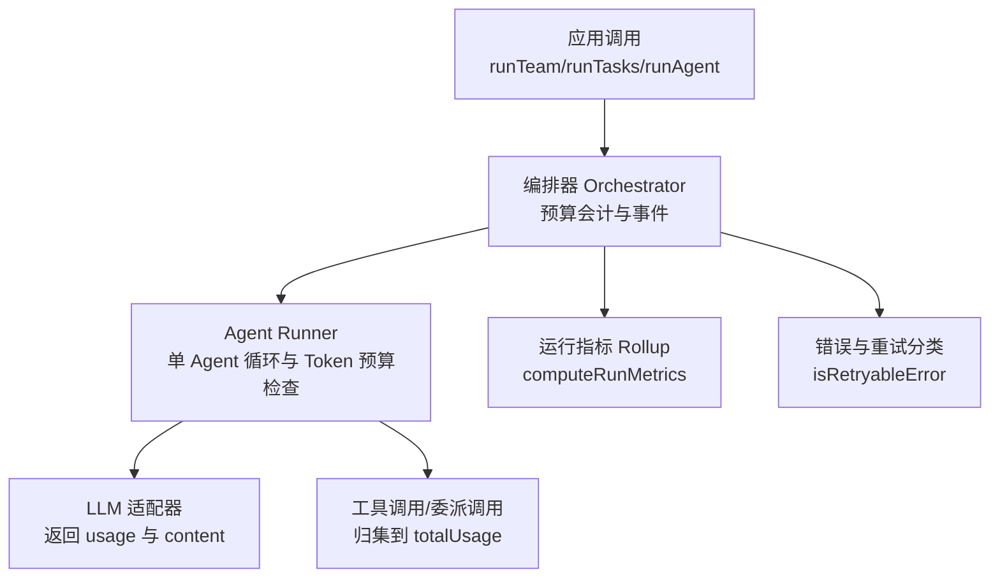
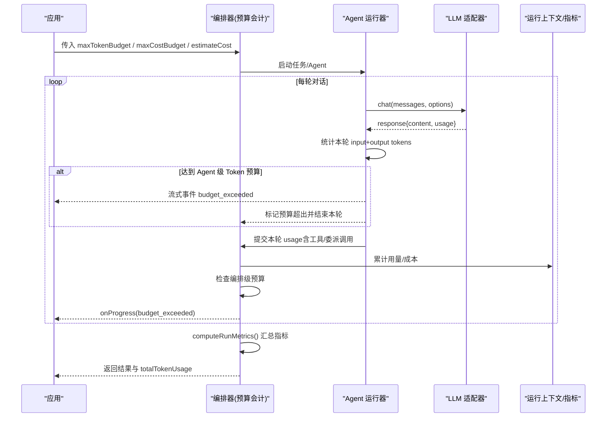
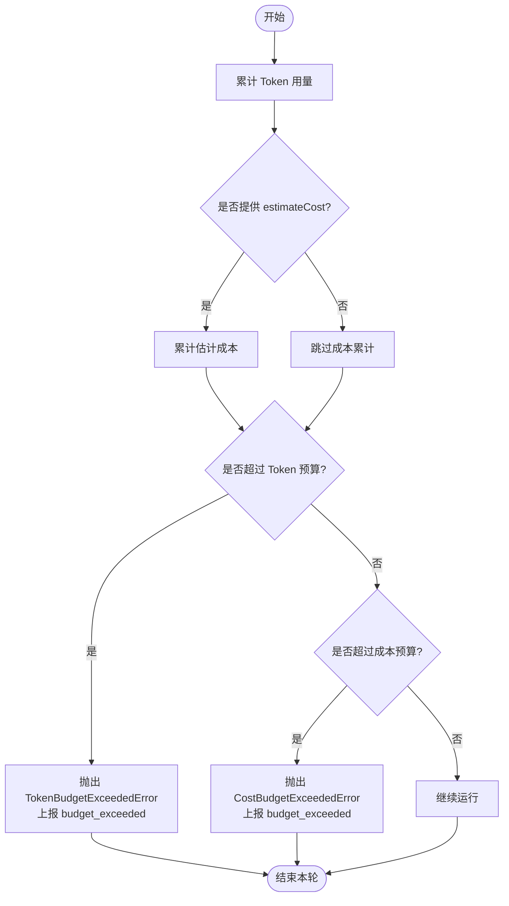
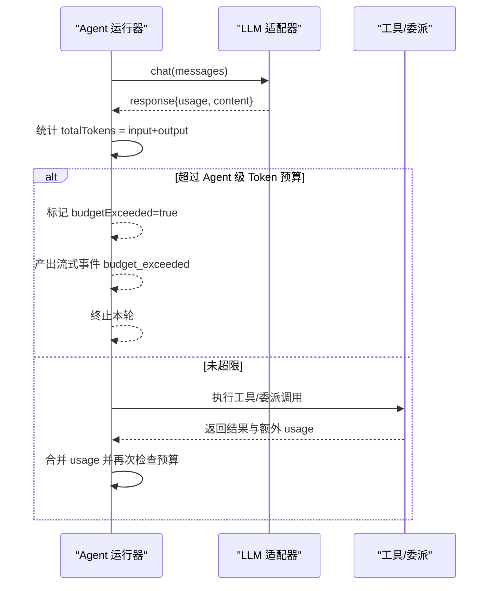
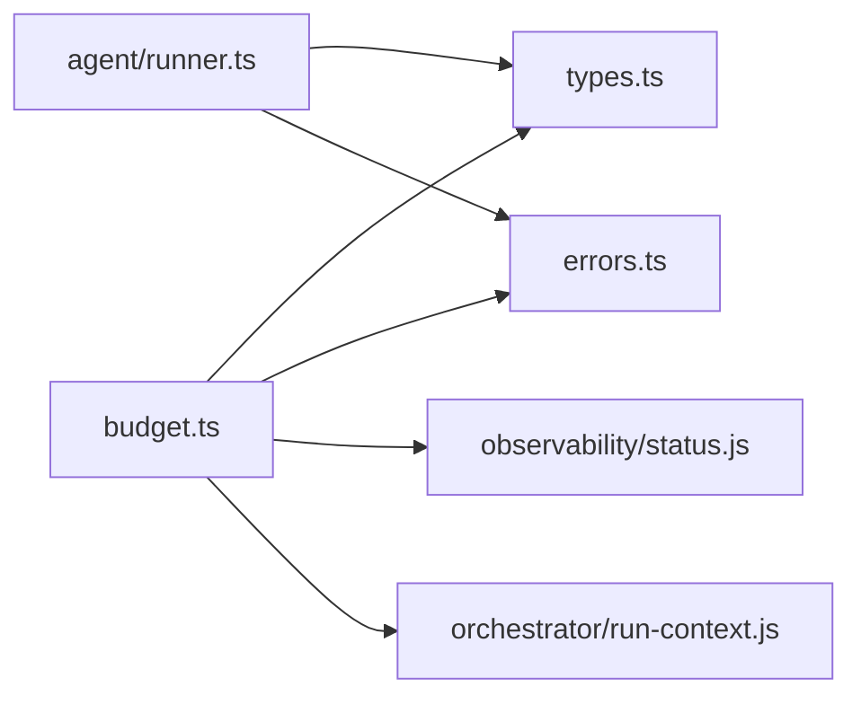

# 预算限制

<cite>
**本文引用的文件**
- [packages/core/src/orchestrator/budget.ts](file://packages/core/src/orchestrator/budget.ts)
- [packages/core/src/agent/runner.ts](file://packages/core/src/agent/runner.ts)
- [packages/core/src/types.ts](file://packages/core/src/types.ts)
- [packages/core/src/errors.ts](file://packages/core/src/errors.ts)
- [README_zh.md](file://README_zh.md)
</cite>

## 目录
1. [简介](#简介)
2. [项目结构](#项目结构)
3. [核心组件](#核心组件)
4. [架构总览](#架构总览)
5. [详细组件分析](#详细组件分析)
6. [依赖关系分析](#依赖关系分析)
7. [性能与成本考量](#性能与成本考量)
8. [故障排查指南](#故障排查指南)
9. [结论](#结论)
10. [附录：最佳实践清单](#附录最佳实践清单)

## 简介
本章节面向希望在 Open Multi-Agent（OMA）中实现“可控成本”的开发者，系统说明预算限制机制。内容涵盖：
- Token 预算管理：单任务/单 Agent 的 Token 上限、团队/编排级总配额、运行期监控与告警。
- 成本计算方式：基于增量 Token 使用量与应用侧定价策略的成本估算；工具调用与委派调用的用量归集；存储与上下文压缩对输入增长的间接影响。
- 资源配额管理：并发任务数、超时控制、以及通过审批门控实现的“软限流”。
- 预算超出的处理策略：优雅停止、部分结果返回、降级执行与可恢复检查点。
- 预算监控与优化：事件上报、指标汇总、上下文压缩、重试与路由等实践建议。

## 项目结构
与预算限制直接相关的代码集中在 core 包的 orchestrator、agent runner、类型定义与错误模块：
- 编排层预算会计与事件：orchestrator/budget.ts
- 单 Agent 运行器中的 Token 预算检查与流式事件：agent/runner.ts
- 配置与数据模型（Agent/Orchestrator/Run 选项、TokenUsage、事件等）：types.ts
- 预算相关错误与重试分类：errors.ts
- 文档入口与概览：README_zh.md

图表来源
- [packages/core/src/orchestrator/budget.ts:22-77](file://packages/core/src/orchestrator/budget.ts#L22-L77)
- [packages/core/src/agent/runner.ts:1175-1234](file://packages/core/src/agent/runner.ts#L1175-L1234)
- [packages/core/src/types.ts:2111-2129](file://packages/core/src/types.ts#L2111-L2129)
- [packages/core/src/errors.ts:221-238](file://packages/core/src/errors.ts#L221-L238)

章节来源
- [README_zh.md:98-107](file://README_zh.md#L98-L107)

## 核心组件
- 预算会计与事件
  - 累计用量与成本：按每次 LLM 结果增量累加，支持 Token 预算与自定义成本预算双通道。
  - 预算超限：在 turn/task 边界触发，抛出对应错误并上报 budget_exceeded 事件。
  - 运行指标汇总：统计总 Token、重试次数、失败/错误计数、耗时分布等。
- 单 Agent 运行器
  - 每轮对话后统计 input/output tokens，若超过 Agent 级 maxTokenBudget，立即标记预算超出并产出流式事件。
  - 工具调用与委派调用产生的额外用量会合并计入当前轮次，并在必要时再次检查预算。
- 类型与配置
  - AgentConfig.maxTokenBudget：单 Agent 运行 Token 上限。
  - OrchestratorConfig.maxTokenBudget / maxCostBudget：编排级 Token/成本上限。
  - RunTasksOptions.maxTokenBudget / maxCostBudget：单次运行覆盖值（取较小者）。
  - OrchestratorEvent.budget_exceeded：统一的事件类型用于上层监控。
- 错误与重试
  - TokenBudgetExceededError / CostBudgetExceededError：明确的预算超限错误。
  - isRetryableError：将预算超限视为不可重试的终态错误。

章节来源
- [packages/core/src/orchestrator/budget.ts:118-168](file://packages/core/src/orchestrator/budget.ts#L118-L168)
- [packages/core/src/orchestrator/budget.ts:170-215](file://packages/core/src/orchestrator/budget.ts#L170-L215)
- [packages/core/src/agent/runner.ts:1204-1215](file://packages/core/src/agent/runner.ts#L1204-L1215)
- [packages/core/src/agent/runner.ts:1119-1137](file://packages/core/src/agent/runner.ts#L1119-L1137)
- [packages/core/src/types.ts:1010-1013](file://packages/core/src/types.ts#L1010-L1013)
- [packages/core/src/types.ts:1517-1528](file://packages/core/src/types.ts#L1517-L1528)
- [packages/core/src/types.ts:2192-2213](file://packages/core/src/types.ts#L2192-L2213)
- [packages/core/src/types.ts:2111-2129](file://packages/core/src/types.ts#L2111-L2129)
- [packages/core/src/errors.ts:25-54](file://packages/core/src/errors.ts#L25-L54)
- [packages/core/src/errors.ts:221-238](file://packages/core/src/errors.ts#L221-L238)

## 架构总览
下图展示一次 runTeam 或 runTasks 运行中，预算如何从“配置→执行→计量→告警→汇总”闭环工作。

图表来源
- [packages/core/src/orchestrator/budget.ts:22-77](file://packages/core/src/orchestrator/budget.ts#L22-L77)
- [packages/core/src/orchestrator/budget.ts:118-168](file://packages/core/src/orchestrator/budget.ts#L118-L168)
- [packages/core/src/orchestrator/budget.ts:170-215](file://packages/core/src/orchestrator/budget.ts#L170-L215)
- [packages/core/src/agent/runner.ts:1175-1234](file://packages/core/src/agent/runner.ts#L1175-L1234)
- [packages/core/src/types.ts:2111-2129](file://packages/core/src/types.ts#L2111-L2129)

## 详细组件分析

### 组件A：编排器预算会计（Token 与成本）
- 功能要点
  - 增量累加：每次 LLM 结果携带 TokenUsage，按 currentUsage + usage 更新累计。
  - 成本估算：若提供 estimateCost，则按增量 usage 计算成本并累加。
  - 预算检查：分别检查 Token 与成本是否超过各自上限，任一超限即返回对应错误。
  - 事件上报：首次超限时设置 budgetExceededTriggered，并通过 onProgress 上报 budget_exceeded。
  - 指标汇总：computeRunMetrics 聚合所有任务的 tokenUsage、重试、错误/失败计数与耗时。
- 复杂度
  - 每次调用 O(1) 累加与比较；汇总为 O(N) 遍历任务记录。
- 优化机会
  - 合理设置 estimateCost，避免昂贵估算；仅在关键路径启用成本预算。
  - 结合上下文压缩降低 input_tokens 增长。

图表来源
- [packages/core/src/orchestrator/budget.ts:118-168](file://packages/core/src/orchestrator/budget.ts#L118-L168)
- [packages/core/src/orchestrator/budget.ts:170-215](file://packages/core/src/orchestrator/budget.ts#L170-L215)

章节来源
- [packages/core/src/orchestrator/budget.ts:22-77](file://packages/core/src/orchestrator/budget.ts#L22-L77)
- [packages/core/src/orchestrator/budget.ts:118-168](file://packages/core/src/orchestrator/budget.ts#L118-L168)
- [packages/core/src/orchestrator/budget.ts:170-215](file://packages/core/src/orchestrator/budget.ts#L170-L215)

### 组件B：单 Agent 运行器（Token 预算与流式事件）
- 功能要点
  - 每轮对话后统计 input/output tokens，若超过 Agent 级 maxTokenBudget，立即产出 budget_exceeded 流式事件并终止后续流程。
  - 工具调用与委派调用产生的额外用量会在本轮内合并，随后再次检查预算。
  - 结果对象包含 budgetExceeded 标志，便于上层判断是否因预算提前结束。
- 错误与重试
  - 预算超限错误被归类为不可重试错误，避免无意义重试放大成本。
- 性能考虑
  - 预算检查位于 tool_result 追加之后，确保消息历史完整，避免后续 API 报错。

图表来源
- [packages/core/src/agent/runner.ts:1175-1234](file://packages/core/src/agent/runner.ts#L1175-L1234)
- [packages/core/src/agent/runner.ts:1119-1137](file://packages/core/src/agent/runner.ts#L1119-L1137)
- [packages/core/src/errors.ts:221-238](file://packages/core/src/errors.ts#L221-L238)

章节来源
- [packages/core/src/agent/runner.ts:1204-1215](file://packages/core/src/agent/runner.ts#L1204-L1215)
- [packages/core/src/agent/runner.ts:1119-1137](file://packages/core/src/agent/runner.ts#L1119-L1137)
- [packages/core/src/errors.ts:221-238](file://packages/core/src/errors.ts#L221-L238)

### 组件C：配置与数据模型（预算相关字段）
- AgentConfig
  - maxTokenBudget：单 Agent 运行的累计 Token 上限。
  - contextStrategy：上下文压缩策略，减少长期对话的 input_tokens 增长。
- OrchestratorConfig
  - maxTokenBudget：编排级累计 Token 上限。
  - maxCostBudget：编排级累计成本上限（需配合 estimateCost）。
  - estimateCost：将增量 usage 转换为应用自定义成本单位。
  - onProgress：接收 budget_exceeded 等事件。
- RunTasksOptions
  - maxTokenBudget / maxCostBudget：单次运行覆盖值，与编排级配置取较小者生效。
- TaskOutcome
  - tokenBudgetRemaining / costBudgetRemaining：在恢复/修复策略中可见剩余预算。

章节来源
- [packages/core/src/types.ts:1010-1013](file://packages/core/src/types.ts#L1010-L1013)
- [packages/core/src/types.ts:1517-1528](file://packages/core/src/types.ts#L1517-L1528)
- [packages/core/src/types.ts:2192-2213](file://packages/core/src/types.ts#L2192-L2213)
- [packages/core/src/types.ts:1466-1475](file://packages/core/src/types.ts#L1466-L1475)

### 组件D：错误与重试分类
- 预算超限错误
  - TokenBudgetExceededError：Token 预算超限。
  - CostBudgetExceededError：成本预算超限。
- 重试策略
  - isRetryableError 将预算超限视为不可重试错误，避免放大成本。
  - 其他如网络抖动、速率限制（429）、请求超时（408）等被视为可重试。

章节来源
- [packages/core/src/errors.ts:25-54](file://packages/core/src/errors.ts#L25-L54)
- [packages/core/src/errors.ts:221-238](file://packages/core/src/errors.ts#L221-L238)

## 依赖关系分析
- Orchestrator 预算模块依赖：
  - types.ts：TokenUsage、OrchestratorConfig、OrchestratorEvent、TaskExecutionRecord 等。
  - errors.ts：预算超限错误类与重试分类。
  - observability/status.js：将预算超限错误分类为运行状态。
  - run-context.js：累计用量与成本的上下文操作。
- Agent Runner 依赖：
  - types.ts：AgentConfig、StreamEvent、TokenUsage 等。
  - errors.ts：预算超限错误与重试分类。
- 耦合与内聚
  - 预算会计与事件集中在 orchestrator/budget.ts，内聚度高。
  - Agent Runner 仅负责单 Agent 的 Token 预算检查与流式事件，职责清晰。
  - 类型定义集中，便于跨模块复用。

图表来源
- [packages/core/src/orchestrator/budget.ts:1-21](file://packages/core/src/orchestrator/budget.ts#L1-L21)
- [packages/core/src/agent/runner.ts:1175-1234](file://packages/core/src/agent/runner.ts#L1175-L1234)

章节来源
- [packages/core/src/orchestrator/budget.ts:1-21](file://packages/core/src/orchestrator/budget.ts#L1-L21)
- [packages/core/src/agent/runner.ts:1175-1234](file://packages/core/src/agent/runner.ts#L1175-L1234)

## 性能与成本考量
- Token 成本控制
  - 使用 AgentConfig.contextStrategy 进行上下文压缩，降低 input_tokens 增长。
  - 合理设置 Agent 级与编排级 maxTokenBudget，优先在短路径上拦截。
- 成本估算
  - 提供 estimateCost 以将不同模型的增量 usage 映射为统一成本单位，便于跨模型预算。
  - 注意 estimateCost 的性能开销，避免在高频路径做复杂计算。
- 工具与委派调用
  - 工具调用与委派调用产生的额外用量会合并计入本轮，需关注其对预算的影响。
- 并发与超时
  - TeamConfig.maxConcurrency 控制并发任务数，避免资源争用导致延迟与成本上升。
  - AgentConfig.timeoutMs 与 callTimeoutMs 防止长时间占用资源。
- 重试与节流
  - 预算超限不可重试；网络/速率限制等可重试错误应配合退避策略。
  - 通过审批门控（onPlanReady/onTaskDispatch）实现“软限流”，在关键节点暂停新任务派发。

[本节为通用指导，不直接分析具体文件]

## 故障排查指南
- 现象：运行提前结束且出现 budget_exceeded 事件
  - 检查 Agent 级与编排级 maxTokenBudget 是否过小。
  - 查看 estimateCost 是否正确实现，避免成本预算误触发。
  - 确认工具/委派调用是否产生大量额外 usage。
- 现象：频繁重试导致成本飙升
  - 确认 isRetryableError 分类是否符合预期；预算超限不应重试。
  - 对 429/408/409 等可重试错误设置合理的退避与上限。
- 现象：长对话导致 input_tokens 爆炸
  - 启用 contextStrategy 压缩旧轮次，保留最近若干轮。
  - 调整 compressToolResults/compressReasoningText 阈值，减少无用信息。
- 现象：成本预算不稳定
  - 校验 estimateCost 返回值是否为有限非负数；异常值会被拒绝。
  - 将成本预算与 Token 预算同时开启时，注意两者可能在不同边界触发。

章节来源
- [packages/core/src/orchestrator/budget.ts:104-116](file://packages/core/src/orchestrator/budget.ts#L104-L116)
- [packages/core/src/errors.ts:221-238](file://packages/core/src/errors.ts#L221-L238)
- [packages/core/src/types.ts:1165-1185](file://packages/core/src/types.ts#L1165-L1185)

## 结论
Open Multi-Agent 提供了从单 Agent 到编排层的完整预算限制能力：
- Token 预算：在 Agent 与编排层双重保障，结合上下文压缩与工具用量归集，有效控制输入输出规模。
- 成本预算：通过 estimateCost 将多模型用量统一为成本单位，实现跨模型的成本治理。
- 监控与告警：统一的 budget_exceeded 事件与运行指标汇总，便于观测与审计。
- 资源配额：并发、超时与审批门控共同构成“硬限+软限”的资源治理体系。
- 优雅退出：预算超限时立即停止后续调用，保留已完成的中间结果，并通过检查点支持恢复。

[本节为总结性内容，不直接分析具体文件]

## 附录：最佳实践清单
- 预算配置
  - 为每个 Agent 设置合理的 maxTokenBudget；为编排层设置更严格的 maxTokenBudget/maxCostBudget。
  - 在 runTeam/runTasks 中使用 per-call 覆盖值，针对高成本场景收紧预算。
- 成本估算
  - 实现 estimateCost，对不同模型/Provider 的 usage 映射为统一成本单位。
  - 对 estimateCost 的结果做合法性校验（有限、非负），避免异常值破坏预算。
- 上下文与工具
  - 启用 contextStrategy 压缩旧轮次；根据业务调整 minChars 阈值。
  - 对工具结果与推理文本启用压缩，避免无用信息膨胀。
- 监控与告警
  - 订阅 onProgress 的 budget_exceeded 事件，及时告警与记录。
  - 使用 computeRunMetrics 汇总指标，纳入看板与报表。
- 资源与重试
  - 设置 TeamConfig.maxConcurrency 控制并发；为 Agent 设置 timeoutMs/callTimeoutMs。
  - 对可重试错误设置退避；预算超限与非法输入等终态错误不重试。
- 恢复与降级
  - 启用 checkpoint，以便预算超限时可恢复并继续执行剩余任务。
  - 在预算紧张时切换到更便宜的模型或简化提示词，实现降级执行。

[本节为通用指导，不直接分析具体文件]