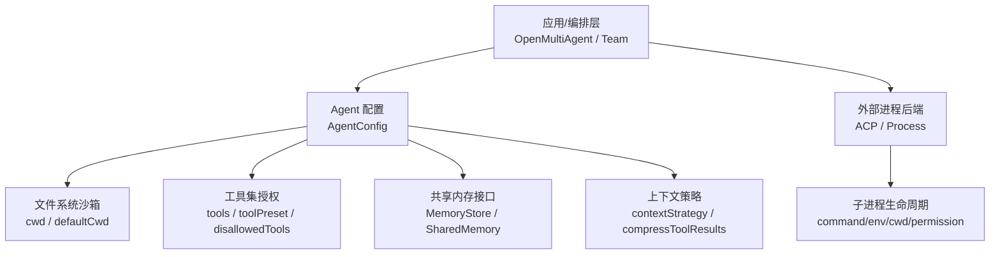
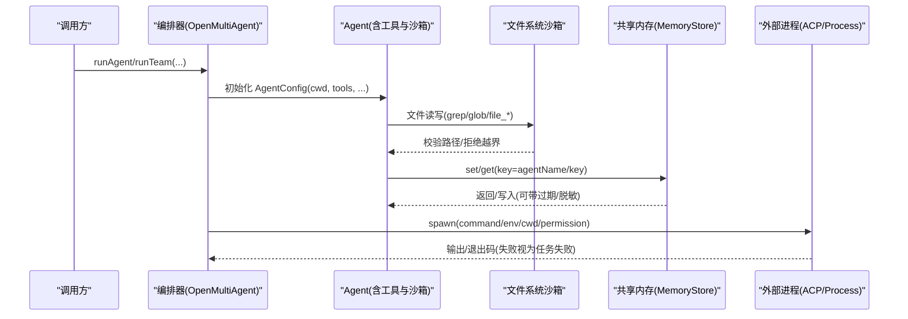
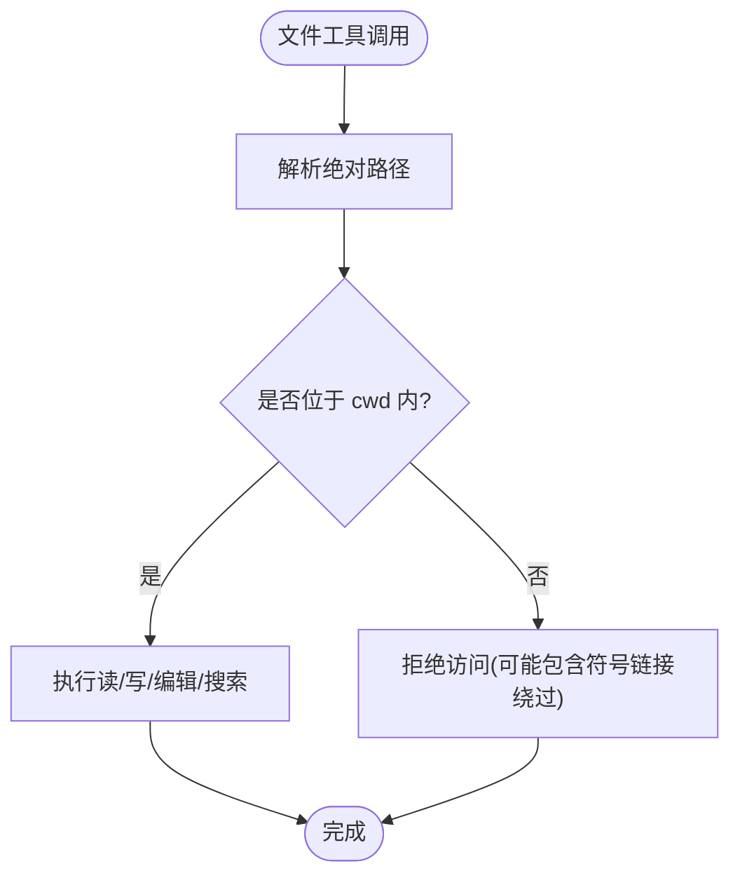
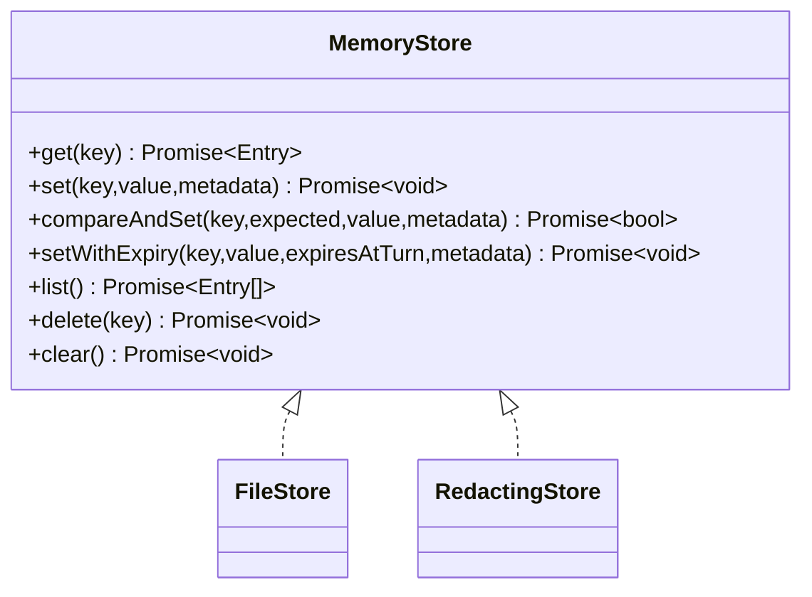
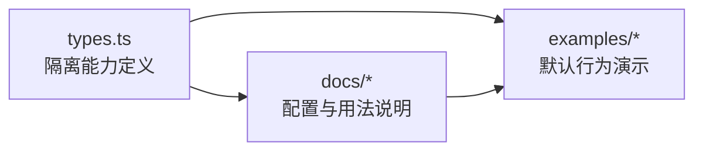

# 上下文隔离

<cite>
**本文引用的文件**
- [packages/core/src/types.ts](file://packages/core/src/types.ts)
- [docs/context-management.md](file://docs/context-management.md)
- [docs/shared-memory.md](file://docs/shared-memory.md)
- [packages/core/examples/basics/single-agent.ts](file://packages/core/examples/basics/single-agent.ts)
- [packages/core/examples/basics/team-collaboration.ts](file://packages/core/examples/basics/team-collaboration.ts)
</cite>

## 目录
1. [简介](#简介)
2. [项目结构](#项目结构)
3. [核心组件](#核心组件)
4. [架构总览](#架构总览)
5. [详细组件分析](#详细组件分析)
6. [依赖关系分析](#依赖关系分析)
7. [性能考虑](#性能考虑)
8. [故障排查指南](#故障排查指南)
9. [结论](#结论)
10. [附录](#附录)

## 简介
本文件聚焦 Open Multi-Agent（OMA）的“上下文隔离”能力，围绕以下目标展开：
- 内存隔离策略：智能体间数据隔离、共享内存的安全访问与泄漏防护。
- 网络访问控制：出站请求限制、域名白名单与代理配置（基于现有类型与能力的边界说明）。
- 文件系统权限：工作目录沙箱、路径解析验证与符号链接防护。
- 进程隔离机制：子进程管理、资源限制与崩溃恢复（针对 ACP/Process 后端）。
- 隔离配置指南与性能优化建议：确保不同智能体与任务之间的完全隔离运行。

## 项目结构
与上下文隔离直接相关的代码与文档集中在 core 包类型定义与示例中，以及共享内存与上下文管理的文档：
- 类型与配置：packages/core/src/types.ts
- 上下文压缩与工具输出裁剪：docs/context-management.md
- 共享内存与持久化：docs/shared-memory.md
- 示例：packages/core/examples/basics/*.ts（展示默认沙箱行为与团队共享内存）

图表来源
- [packages/core/src/types.ts:544-557](file://packages/core/src/types.ts#L544-L557)
- [packages/core/src/types.ts:965-984](file://packages/core/src/types.ts#L965-L984)
- [packages/core/src/types.ts:825-851](file://packages/core/src/types.ts#L825-L851)
- [packages/core/src/types.ts:856-877](file://packages/core/src/types.ts#L856-L877)
- [docs/shared-memory.md:1-47](file://docs/shared-memory.md#L1-L47)

章节来源
- [packages/core/src/types.ts:544-557](file://packages/core/src/types.ts#L544-L557)
- [packages/core/src/types.ts:965-984](file://packages/core/src/types.ts#L965-L984)
- [packages/core/src/types.ts:825-851](file://packages/core/src/types.ts#L825-L851)
- [packages/core/src/types.ts:856-877](file://packages/core/src/types.ts#L856-L877)
- [docs/shared-memory.md:1-47](file://docs/shared-memory.md#L1-L47)

## 核心组件
- 文件系统沙箱与工作目录
  - AgentConfig.cwd 控制内置文件系统工具的根目录；未设置时回退到 .agent-workspace 子目录，自动创建并启用沙箱。
  - OrchestratorConfig.defaultCwd 提供全局默认沙箱根目录，可设置为 process.cwd() 扩大范围或 null 关闭。
- 工具授权与最小权限
  - tools/disallowedTools/toolPreset 实现按智能体的细粒度工具白名单/黑名单控制。
- 共享内存与跨智能体数据
  - MemoryStore 抽象键值存储；SharedMemory 在团队内以 <agentName>/<key> 命名空间隔离写入。
  - RedactingStore 对写入库的值进行敏感信息脱敏，避免持久化泄露。
- 上下文管理与压缩
  - contextStrategy 支持滑动窗口、摘要、紧凑等策略；compressToolResults 压缩已消费的工具结果，减少上下文膨胀。
- 外部进程后端（ACP/Process）
  - 通过 command/env/cwd/permission 启动独立子进程，配合工作目录与权限策略实现进程级隔离。

章节来源
- [packages/core/src/types.ts:544-557](file://packages/core/src/types.ts#L544-L557)
- [packages/core/src/types.ts:965-984](file://packages/core/src/types.ts#L965-L984)
- [packages/core/src/types.ts:2233-2252](file://packages/core/src/types.ts#L2233-L2252)
- [docs/shared-memory.md:1-47](file://docs/shared-memory.md#L1-L47)
- [docs/context-management.md:1-114](file://docs/context-management.md#L1-L114)

## 架构总览
下图展示了 OMA 在“上下文隔离”上的关键交互：编排层为每个 Agent 注入沙箱与工具权限，团队内部通过共享内存协作，外部任务可通过进程后端隔离执行。

图表来源
- [packages/core/src/types.ts:544-557](file://packages/core/src/types.ts#L544-L557)
- [packages/core/src/types.ts:965-984](file://packages/core/src/types.ts#L965-L984)
- [packages/core/src/types.ts:825-851](file://packages/core/src/types.ts#L825-L851)
- [packages/core/src/types.ts:856-877](file://packages/core/src/types.ts#L856-L877)
- [docs/shared-memory.md:1-47](file://docs/shared-memory.md#L1-L47)

## 详细组件分析

### 文件系统权限与工作目录沙箱
- 工作目录沙箱
  - AgentConfig.cwd 指定内置文件系统工具的工作根目录；要求绝对路径，拒绝解析后超出该目录的路径（包括符号链接）。
  - 未设置时默认使用 .agent-workspace 子目录作为沙箱根，首次写入时自动创建。
  - OrchestratorConfig.defaultCwd 可统一设置默认沙箱根，支持扩大至 process.cwd() 或关闭沙箱（null）。
- 路径解析与符号链接防护
  - 内置工具在执行前会进行路径规范化与安全检查，阻止逃逸出沙箱目录。
- 示例中的默认行为
  - 示例将输出写入 .agent-workspace 下的子目录，演示在不关闭沙箱的情况下安全运行。

图表来源
- [packages/core/src/types.ts:544-557](file://packages/core/src/types.ts#L544-L557)
- [packages/core/src/types.ts:2233-2252](file://packages/core/src/types.ts#L2233-L2252)
- [packages/core/examples/basics/single-agent.ts:18-22](file://packages/core/examples/basics/single-agent.ts#L18-L22)

章节来源
- [packages/core/src/types.ts:544-557](file://packages/core/src/types.ts#L544-L557)
- [packages/core/src/types.ts:2233-2252](file://packages/core/src/types.ts#L2233-L2252)
- [packages/core/examples/basics/single-agent.ts:18-22](file://packages/core/examples/basics/single-agent.ts#L18-L22)

### 工具授权与最小权限
- 工具白名单/黑名单
  - AgentConfig.tools 指定允许的工具集合；disallowedTools 显式禁止某些工具。
  - toolPreset 提供常见预设（如只读、读写、完整），便于快速配置。
- 默认策略
  - 未声明任何工具授予时，默认拒绝所有内置工具；可通过 OrchestratorConfig.defaultToolPreset 放宽（谨慎用于不受信环境）。
- 自定义工具
  - customTools 可注册额外工具，但仍受 disallowedTools 约束。

章节来源
- [packages/core/src/types.ts:965-984](file://packages/core/src/types.ts#L965-L984)
- [packages/core/src/types.ts:2233-2252](file://packages/core/src/types.ts#L2233-L2252)

### 共享内存与安全访问
- 命名空间隔离
  - 团队共享内存以 <agentName>/<key> 形式写入，天然实现智能体间的键空间隔离。
- 存储后端
  - MemoryStore 抽象支持内存、文件、Redis、Postgres 等；FileStore 为无依赖的文件系统实现。
  - sharedMemoryStore 优先级高于布尔开关 sharedMemory。
- 敏感信息保护
  - RedactingStore 在写入时对凭据与自定义模式进行脱敏，防止持久化泄露；也影响检查点写入。
- 过期与一致性
  - MemoryStore 可选 setWithExpiry 支持按“轮次”过期；compareAndSet 用于原子性决策（如审批）。

图表来源
- [docs/shared-memory.md:1-47](file://docs/shared-memory.md#L1-L47)
- [packages/core/src/types.ts:2806-2872](file://packages/core/src/types.ts#L2806-L2872)

章节来源
- [docs/shared-memory.md:1-47](file://docs/shared-memory.md#L1-L47)
- [packages/core/src/types.ts:2806-2872](file://packages/core/src/types.ts#L2806-L2872)

### 上下文压缩与工具输出裁剪
- 上下文策略
  - sliding-window：保留最近 N 轮对话，丢弃更早内容。
  - summarize：将旧轮次交给摘要模型压缩。
  - compact：规则化压缩大文本块与工具结果，保留近期轮次。
  - custom：自定义压缩函数。
- 工具结果压缩
  - compressToolResults 将已消费的工具结果替换为短标记，降低上下文占用。
- 工具输出长度限制
  - maxToolOutputChars 限制单次工具输出的原始长度，超长将被截断。

章节来源
- [docs/context-management.md:1-114](file://docs/context-management.md#L1-L114)

### 进程隔离机制（ACP/Process 后端）
- 子进程管理
  - ACP 后端：以本地子进程方式运行外部 CLI（如 Gemini/Claude Code），由 OMA 驱动其循环、收集输出与用量。
  - Process 后端：每运行一次启动新进程，通过 stdin/参数传递提示，非零退出视为任务失败。
- 资源与环境隔离
  - env：为子进程注入环境变量。
  - cwd：限定子进程工作目录（注意：ACP 子进程直接访问该目录，不同于 OMA 的文件工具沙箱）。
  - permission：ACP 的权限策略控制对外部资源的访问（如 auto-approve/reject/回调）。
- 崩溃恢复
  - 非零退出即失败；结合 Orchestrator 的重试/恢复策略（见下节）可实现容错。

章节来源
- [packages/core/src/types.ts:825-851](file://packages/core/src/types.ts#L825-L851)
- [packages/core/src/types.ts:856-877](file://packages/core/src/types.ts#L856-L877)

### 网络访问控制（当前能力与边界）
- 当前可见能力
  - 未发现框架内建的全局“出站请求限制/域名白名单/代理配置”字段。网络访问通常由 LLM 适配器或外部进程自行处理。
- 推荐实践
  - 对于 ACP/Process 后端：通过受限的 env/cwd/permission 与外部进程自身的安全策略限制网络访问。
  - 对于 LLM 调用：使用 provider/baseURL/apiKey 指向可信端点；必要时在网络层（防火墙/代理）实施出站控制。
- 注意
  - 若需强一致的网络隔离，建议在部署层（容器/主机网络策略）实现，而非仅依赖应用配置。

章节来源
- [packages/core/src/types.ts:958-963](file://packages/core/src/types.ts#L958-L963)
- [packages/core/src/types.ts:825-851](file://packages/core/src/types.ts#L825-L851)
- [packages/core/src/types.ts:856-877](file://packages/core/src/types.ts#L856-L877)

## 依赖关系分析
- 类型集中定义：所有隔离相关的能力（沙箱、工具授权、共享内存、进程后端）均以 types.ts 暴露，供上层编排与示例使用。
- 示例验证默认行为：single-agent 与 team-collaboration 展示了默认沙箱路径与团队共享内存开启方式。
- 文档补充语义：shared-memory.md 与 context-management.md 提供了更完整的配置与最佳实践说明。

图表来源
- [packages/core/src/types.ts:544-557](file://packages/core/src/types.ts#L544-L557)
- [packages/core/src/types.ts:965-984](file://packages/core/src/types.ts#L965-L984)
- [packages/core/src/types.ts:825-851](file://packages/core/src/types.ts#L825-L851)
- [packages/core/src/types.ts:856-877](file://packages/core/src/types.ts#L856-L877)
- [docs/shared-memory.md:1-47](file://docs/shared-memory.md#L1-L47)
- [docs/context-management.md:1-114](file://docs/context-management.md#L1-L114)
- [packages/core/examples/basics/single-agent.ts:18-22](file://packages/core/examples/basics/single-agent.ts#L18-L22)
- [packages/core/examples/basics/team-collaboration.ts:24-27](file://packages/core/examples/basics/team-collaboration.ts#L24-L27)

章节来源
- [packages/core/src/types.ts:544-557](file://packages/core/src/types.ts#L544-L557)
- [packages/core/src/types.ts:965-984](file://packages/core/src/types.ts#L965-L984)
- [packages/core/src/types.ts:825-851](file://packages/core/src/types.ts#L825-L851)
- [packages/core/src/types.ts:856-877](file://packages/core/src/types.ts#L856-L877)
- [docs/shared-memory.md:1-47](file://docs/shared-memory.md#L1-L47)
- [docs/context-management.md:1-114](file://docs/context-management.md#L1-L114)
- [packages/core/examples/basics/single-agent.ts:18-22](file://packages/core/examples/basics/single-agent.ts#L18-L22)
- [packages/core/examples/basics/team-collaboration.ts:24-27](file://packages/core/examples/basics/team-collaboration.ts#L24-L27)

## 性能考虑
- 上下文压缩
  - 使用 sliding-window/summarize/compact 控制上下文增长；compressToolResults 减少历史膨胀。
- 工具输出裁剪
  - 设置 maxToolOutputChars 避免单次工具输出过大导致上下文爆炸。
- 并发与预算
  - 通过 Orchestrator 的 maxConcurrency、maxTokenBudget/maxCostBudget 控制整体资源消耗。
- 共享内存
  - 使用 TTL（setWithExpiry）与按需读取，避免长期驻留造成内存压力。
- 进程后端
  - 合理设置子进程超时与重试策略，避免长尾阻塞。

[本节为通用指导，不直接分析具体文件]

## 故障排查指南
- 文件访问被拒
  - 检查 AgentConfig.cwd 与 OrchestratorConfig.defaultCwd 是否正确；确认路径解析后仍在沙箱内。
- 共享内存未生效
  - 确认团队启用了 sharedMemory 或传入了 sharedMemoryStore；键名遵循 <agentName>/<key> 命名空间。
- 敏感信息泄露风险
  - 使用 RedactingStore 包裹底层存储，确保写入库的值经过脱敏。
- 上下文溢出
  - 调整 contextStrategy 与 compressToolResults；必要时降低 maxToolOutputChars。
- 外部进程异常
  - 检查 command/env/cwd/permission；非零退出会被视为失败，结合重试/恢复策略处理。

章节来源
- [packages/core/src/types.ts:544-557](file://packages/core/src/types.ts#L544-L557)
- [packages/core/src/types.ts:2233-2252](file://packages/core/src/types.ts#L2233-L2252)
- [docs/shared-memory.md:1-47](file://docs/shared-memory.md#L1-L47)
- [docs/context-management.md:1-114](file://docs/context-management.md#L1-L114)
- [packages/core/src/types.ts:825-851](file://packages/core/src/types.ts#L825-L851)
- [packages/core/src/types.ts:856-877](file://packages/core/src/types.ts#L856-L877)

## 结论
Open Multi-Agent 通过“工作目录沙箱 + 工具最小权限 + 共享内存命名空间 + 上下文压缩 + 进程后端隔离”的组合，实现了多智能体与任务的上下文隔离。生产环境中建议：
- 始终启用文件系统沙箱，明确限定 cwd/defaultCwd。
- 使用工具白名单与预设，遵循最小权限原则。
- 对共享内存采用命名空间与脱敏存储，必要时设置 TTL。
- 根据任务规模选择合适上下文策略与输出裁剪。
- 对不可信的外部任务使用 ACP/Process 后端，并结合部署层网络与资源限制。

[本节为总结性内容，不直接分析具体文件]

## 附录

### 隔离配置清单（建议）
- 文件系统
  - 设置 AgentConfig.cwd 或 OrchestratorConfig.defaultCwd 为受限目录。
  - 仅在必要时扩大或关闭沙箱。
- 工具授权
  - 使用 tools/disallowedTools 精确授权；优先使用 toolPreset 快速配置。
- 共享内存
  - 团队启用 sharedMemory 或传入 sharedMemoryStore；使用 RedactingStore 包裹。
- 上下文
  - 配置 contextStrategy 与 compressToolResults；设置 maxToolOutputChars。
- 进程后端
  - 为 ACP/Process 设置受限 env/cwd/permission；监控非零退出。
- 网络
  - 通过 provider/baseURL/apiKey 指向可信端点；在网络层实施出站控制。

章节来源
- [packages/core/src/types.ts:544-557](file://packages/core/src/types.ts#L544-L557)
- [packages/core/src/types.ts:965-984](file://packages/core/src/types.ts#L965-L984)
- [packages/core/src/types.ts:2233-2252](file://packages/core/src/types.ts#L2233-L2252)
- [docs/shared-memory.md:1-47](file://docs/shared-memory.md#L1-L47)
- [docs/context-management.md:1-114](file://docs/context-management.md#L1-L114)
- [packages/core/src/types.ts:825-851](file://packages/core/src/types.ts#L825-L851)
- [packages/core/src/types.ts:856-877](file://packages/core/src/types.ts#L856-L877)