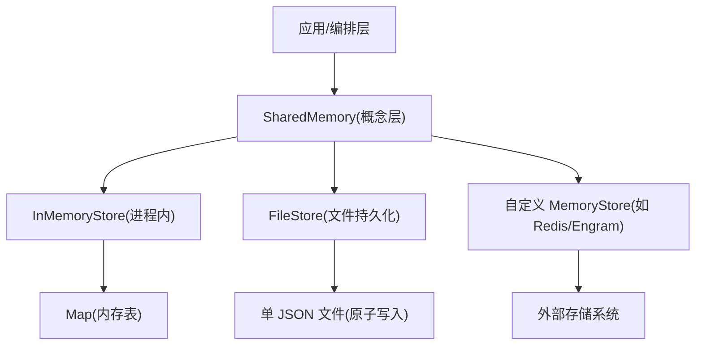
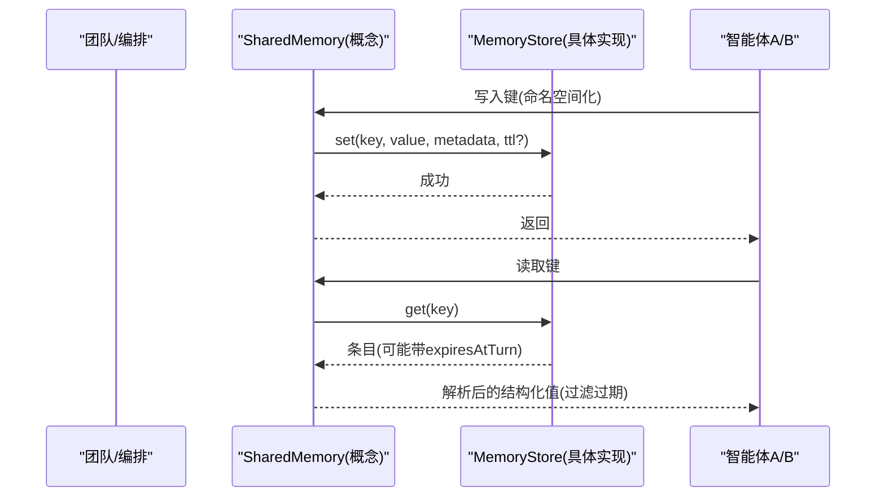
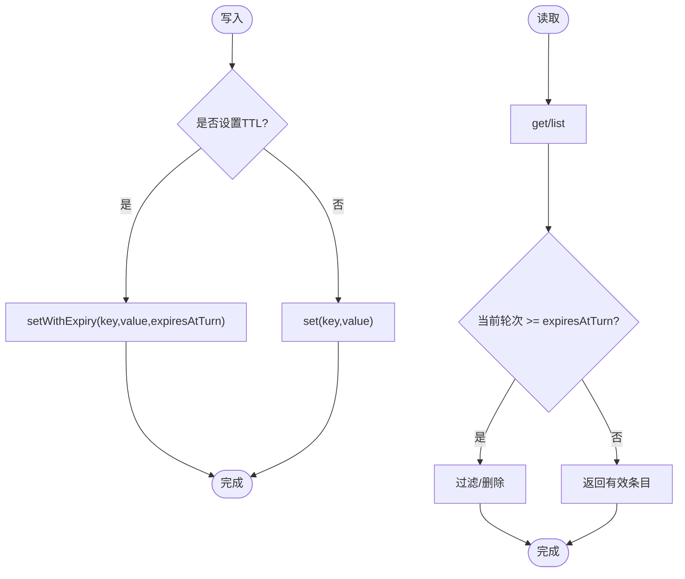
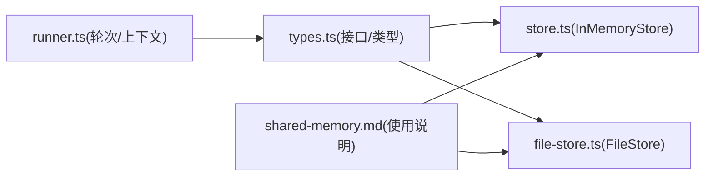

# 内存隔离机制

<cite>
**本文引用的文件**
- [shared-memory.md](file://docs/shared-memory.md)
- [types.ts](file://packages/core/src/types.ts)
- [store.ts](file://packages/core/src/memory/store.ts)
- [file-store.ts](file://packages/core/src/memory/file-store.ts)
- [runner.ts](file://packages/core/src/agent/runner.ts)
- [engram-store.ts](file://packages/core/examples/integrations/with-engram/engram-store.ts)
</cite>

## 目录
1. [简介](#简介)
2. [项目结构](#项目结构)
3. [核心组件](#核心组件)
4. [架构总览](#架构总览)
5. [详细组件分析](#详细组件分析)
6. [依赖关系分析](#依赖关系分析)
7. [性能考虑](#性能考虑)
8. [故障排查指南](#故障排查指南)
9. [结论](#结论)
10. [附录](#附录)

## 简介
本文件系统性阐述 Open Multi-Agent 的内存隔离与共享内存机制，覆盖命名空间隔离、键名空间管理、访问控制、安全读写模式（含元数据校验与序列化保护）、内存泄漏防护（循环引用检测、JSON 可序列化验证、内存使用监控）、TTL（生存时间）机制（基于轮次的过期策略与自动清理），以及内存配置优化与性能调优建议，确保不同智能体间的完全内存隔离。

## 项目结构
Open Multi-Agent 在 core 包中提供统一的内存抽象与实现：
- 类型与契约：定义共享内存值类型、条目结构、存储接口等
- 内存存储：提供进程内内存存储与持久化文件存储两种实现
- 文档与示例：说明共享内存启用方式、持久化与敏感信息脱敏、跨进程后端集成示例

图表来源
- [types.ts:2806-2872](file://packages/core/src/types.ts#L2806-L2872)
- [store.ts:31-167](file://packages/core/src/memory/store.ts#L31-L167)
- [file-store.ts:80-381](file://packages/core/src/memory/file-store.ts#L80-L381)
- [engram-store.ts:1-40](file://packages/core/examples/integrations/with-engram/engram-store.ts#L1-L40)

章节来源
- [shared-memory.md:1-47](file://docs/shared-memory.md#L1-L47)
- [types.ts:2806-2872](file://packages/core/src/types.ts#L2806-L2872)
- [store.ts:31-167](file://packages/core/src/memory/store.ts#L31-L167)
- [file-store.ts:80-381](file://packages/core/src/memory/file-store.ts#L80-L381)
- [engram-store.ts:1-40](file://packages/core/examples/integrations/with-engram/engram-store.ts#L1-L40)

## 核心组件
- 共享内存值与条目
  - SharedMemoryValue：限定为字符串、数字、布尔、null、只读数组与只读对象，避免复杂引用导致序列化问题
  - MemoryEntry：包含 key、value（底层存储为字符串）、metadata、createdAt 与可选 expiresAtTurn
  - SharedMemoryEntry：对外暴露解析后的结构化 value
- 存储接口
  - MemoryStore：统一 get/set/list/delete/clear；可选 compareAndSet 用于原子更新；可选 setWithExpiry 用于 TTL
- 存储实现
  - InMemoryStore：进程内 Map 实现，支持 search、size、has 等扩展能力
  - FileStore：单 JSON 文件持久化，原子写入（临时文件 + fsync + rename），保证崩溃一致性
- 外部后端
  - 通过实现 MemoryStore 接入 Redis、SQLite、Engram 等

章节来源
- [types.ts:2806-2872](file://packages/core/src/types.ts#L2806-L2872)
- [store.ts:31-167](file://packages/core/src/memory/store.ts#L31-L167)
- [file-store.ts:80-381](file://packages/core/src/memory/file-store.ts#L80-L381)
- [engram-store.ts:1-40](file://packages/core/examples/integrations/with-engram/engram-store.ts#L1-L40)

## 架构总览
共享内存由上层编排层启用并注入到团队运行中，所有智能体通过统一的 MemoryStore 进行键值存取。键名以“智能体名/键”形式命名空间化，确保跨智能体的数据隔离。TTL 通过 expiresAtTurn 字段配合 SharedMemory 的轮次计数器实现过期判定。

图表来源
- [shared-memory.md:1-47](file://docs/shared-memory.md#L1-L47)
- [types.ts:2806-2872](file://packages/core/src/types.ts#L2806-L2872)
- [store.ts:31-167](file://packages/core/src/memory/store.ts#L31-L167)
- [file-store.ts:80-381](file://packages/core/src/memory/file-store.ts#L80-L381)

## 详细组件分析

### 命名空间隔离策略与键名空间管理
- 键名空间
  - 所有键在进入存储前被规范化为“智能体名/键”，从而天然实现智能体间的数据隔离
  - 列表与查询操作均作用于该命名空间，避免跨智能体污染
- 访问控制
  - 通过命名空间前缀限制每个智能体仅能访问自身键空间
  - 结合 schema 校验（SharedMemoryWriteOptions.schema）对写入值进行强类型约束，防止非法数据结构进入共享内存
- 序列化保护
  - 底层存储仅接受字符串值，结构化数据需由调用方序列化；SharedMemory 对外暴露结构化值，内部完成序列化和反序列化
  - 文件存储将 createdAt 等时间戳序列化为 ISO 字符串，并在加载时恢复，保证跨重启一致性

章节来源
- [shared-memory.md:1-47](file://docs/shared-memory.md#L1-L47)
- [types.ts:2806-2872](file://packages/core/src/types.ts#L2806-L2872)
- [file-store.ts:220-303](file://packages/core/src/memory/file-store.ts#L220-L303)

### 共享内存的安全访问模式
- 读写权限控制
  - 写路径：通过 set/setWithExpiry 写入，支持可选的 compareAndSet 做原子更新（适用于并发场景下的决策落盘）
  - 读路径：get/list 返回条目，读取侧负责按当前轮次过滤 expiresAtTurn
- 元数据验证
  - FileStore 在加载时对 metadata 进行严格校验（必须为普通对象），非对象将被拒绝，避免脏数据污染
- 序列化保护
  - InMemoryStore 与 FileStore 均保持 value 为字符串；结构化值在 SharedMemory 层进行序列化/反序列化
  - FileStore 使用原子写入（临时文件 + fsync + rename）确保崩溃一致性

章节来源
- [types.ts:2806-2872](file://packages/core/src/types.ts#L2806-L2872)
- [store.ts:31-167](file://packages/core/src/memory/store.ts#L31-L167)
- [file-store.ts:108-182](file://packages/core/src/memory/file-store.ts#L108-L182)
- [file-store.ts:220-303](file://packages/core/src/memory/file-store.ts#L220-L303)

### 内存泄漏防护机制
- 循环引用检测
  - SharedMemoryValue 限定为不可变结构与基础类型，避免循环引用导致的序列化失败或无限递归
- JSON 可序列化验证
  - FileStore 在加载时对状态文件进行版本与结构校验，遇到损坏或不兼容格式会抛出错误，阻止静默丢弃数据
- 内存使用监控
  - InMemoryStore 暴露 size 属性便于监控条目数量
  - 可通过 list() 获取快照并结合业务指标统计内存占用趋势

章节来源
- [types.ts:2806-2872](file://packages/core/src/types.ts#L2806-L2872)
- [store.ts:157-167](file://packages/core/src/memory/store.ts#L157-L167)
- [file-store.ts:220-303](file://packages/core/src/memory/file-store.ts#L220-L303)

### TTL（生存时间）机制
- 基于轮次的过期策略
  - 写入时可设置 expiresAtTurn（当前轮次 + TTL 轮数），SharedMemory 在读取时根据当前轮次判断是否过期
  - 若后端未实现 setWithExpiry，则不强制 TTL，但条目仍可保留 expiresAtTurn 字段供上层过滤
- 自动清理与资源回收
  - 读取侧按需过滤过期条目；如需物理删除，可在业务层遍历 list() 后 delete 过期键
  - FileStore 支持 setWithExpiry，持久化 expiresAtTurn 字段，以便重启后仍可按轮次判断

图表来源
- [types.ts:2824-2872](file://packages/core/src/types.ts#L2824-L2872)
- [store.ts:82-104](file://packages/core/src/memory/store.ts#L82-L104)
- [file-store.ts:161-182](file://packages/core/src/memory/file-store.ts#L161-L182)

章节来源
- [types.ts:2824-2872](file://packages/core/src/types.ts#L2824-L2872)
- [store.ts:82-104](file://packages/core/src/memory/store.ts#L82-L104)
- [file-store.ts:161-182](file://packages/core/src/memory/file-store.ts#L161-L182)

### 持久化与跨进程后端
- 文件持久化
  - FileStore 将全部条目保存在单个 JSON 文件中，采用原子写入保障崩溃一致性；适合 checkpoint 与轻量共享内存
- 跨进程后端
  - 通过实现 MemoryStore 接入 Redis、Engram 等，满足多进程或多实例共享需求
  - Engram 示例展示了如何封装 REST API 作为 MemoryStore 后端

章节来源
- [file-store.ts:1-45](file://packages/core/src/memory/file-store.ts#L1-L45)
- [file-store.ts:80-381](file://packages/core/src/memory/file-store.ts#L80-L381)
- [engram-store.ts:1-40](file://packages/core/examples/integrations/with-engram/engram-store.ts#L1-L40)

## 依赖关系分析
- 类型与实现解耦
  - types.ts 定义 MemoryStore 接口与共享内存相关类型
  - store.ts 与 file-store.ts 分别提供进程内与文件持久化实现
  - shared-memory.md 描述启用方式与最佳实践
- 运行时上下文
  - runner.ts 中的轮次推进与上下文压缩为 TTL 过滤提供“当前轮次”依据

图表来源
- [types.ts:2806-2872](file://packages/core/src/types.ts#L2806-L2872)
- [store.ts:31-167](file://packages/core/src/memory/store.ts#L31-L167)
- [file-store.ts:80-381](file://packages/core/src/memory/file-store.ts#L80-L381)
- [shared-memory.md:1-47](file://docs/shared-memory.md#L1-L47)
- [runner.ts:492-542](file://packages/core/src/agent/runner.ts#L492-L542)

章节来源
- [types.ts:2806-2872](file://packages/core/src/types.ts#L2806-L2872)
- [store.ts:31-167](file://packages/core/src/memory/store.ts#L31-L167)
- [file-store.ts:80-381](file://packages/core/src/memory/file-store.ts#L80-L381)
- [shared-memory.md:1-47](file://docs/shared-memory.md#L1-L47)
- [runner.ts:492-542](file://packages/core/src/agent/runner.ts#L492-L542)

## 性能考虑
- 选择合适存储
  - 高频写入且无需持久化：优先 InMemoryStore
  - 需要持久化与崩溃恢复：使用 FileStore；注意每次写入都会重写整个文件，适合 checkpoint 而非极高吞吐共享内存
- 减少 I/O 放大
  - 将共享内存置于 InMemoryStore，checkpoint 单独使用 FileStore，避免每次共享内存写入都触发全量持久化
- 批量与合并
  - 合理合并写入，降低频繁小写带来的开销
- 监控与限流
  - 使用 InMemoryStore.size 监控条目规模；结合业务阈值进行限流或清理
- 序列化成本
  - 避免过大结构化值；必要时分片或外存化大对象，仅保存引用

[本节为通用指导，不直接分析具体文件]

## 故障排查指南
- 状态文件损坏
  - FileStore 启动时会校验 JSON 格式与版本，若损坏将抛出错误；需检查并修复或删除状态文件
- 元数据异常
  - FileStore 要求 metadata 为普通对象；非对象会被拒绝，需修正写入逻辑
- TTL 未生效
  - 若后端未实现 setWithExpiry，TTL 仅作为元数据存在，读取侧需自行过滤；确认后端能力与上层过滤逻辑
- 并发冲突
  - 使用 compareAndSet 进行原子更新；未实现的后端将无法保证跨进程原子性

章节来源
- [file-store.ts:220-303](file://packages/core/src/memory/file-store.ts#L220-L303)
- [types.ts:2842-2872](file://packages/core/src/types.ts#L2842-L2872)

## 结论
Open Multi-Agent 通过统一的 MemoryStore 抽象与严格的类型约束，实现了智能体间的内存隔离与安全共享。命名空间化的键管理、可选的 TTL 机制、原子写入与元数据校验共同保障了数据的正确性与一致性。结合合适的存储选型与性能调优策略，可在不同场景下获得稳定高效的共享内存体验。

[本节为总结性内容，不直接分析具体文件]

## 附录
- 启用共享内存
  - 在团队配置中启用 sharedMemory，或使用 sharedMemoryStore 指定后端
- 敏感信息脱敏
  - 使用 RedactingStore 包装持久化存储，在写入时脱敏凭证与自定义模式
- 跨进程后端
  - 参考 Engram 示例实现 MemoryStore，适配 REST API

章节来源
- [shared-memory.md:1-47](file://docs/shared-memory.md#L1-L47)
- [engram-store.ts:1-40](file://packages/core/examples/integrations/with-engram/engram-store.ts#L1-L40)