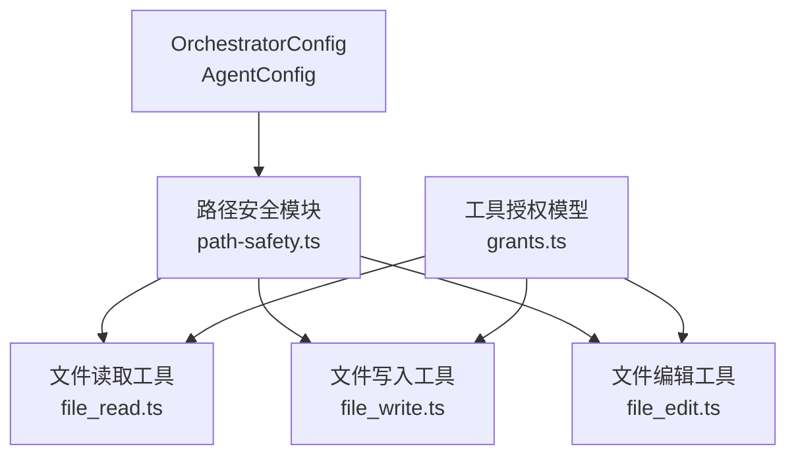
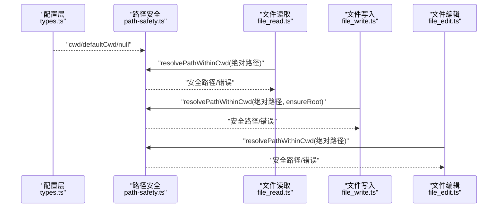
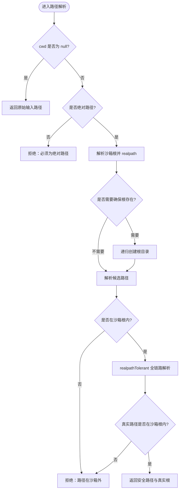
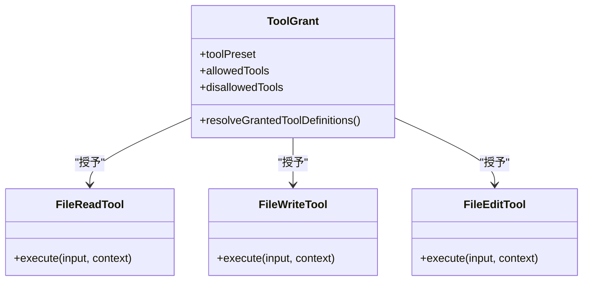
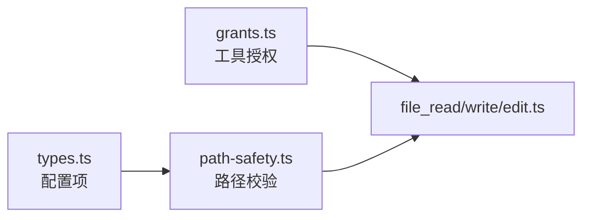

# 文件系统权限

<cite>
**本文引用的文件**
- [packages/core/src/tool/built-in/path-safety.ts](file://packages/core/src/tool/built-in/path-safety.ts)
- [packages/core/src/tool/built-in/file-read.ts](file://packages/core/src/tool/built-in/file-read.ts)
- [packages/core/src/tool/built-in/file-write.ts](file://packages/core/src/tool/built-in/file-write.ts)
- [packages/core/src/tool/built-in/file-edit.ts](file://packages/core/src/tool/built-in/file-edit.ts)
- [packages/core/src/tool/grants.ts](file://packages/core/src/tool/grants.ts)
- [packages/core/src/types.ts](file://packages/core/src/types.ts)
</cite>

## 目录
1. [简介](#简介)
2. [项目结构](#项目结构)
3. [核心组件](#核心组件)
4. [架构总览](#架构总览)
5. [详细组件分析](#详细组件分析)
6. [依赖关系分析](#依赖关系分析)
7. [性能考量](#性能考量)
8. [故障排查指南](#故障排查指南)
9. [结论](#结论)
10. [附录](#附录)

## 简介
本文件面向 Open Multi-Agent 的文件系统权限控制机制，聚焦工作目录沙箱化、路径解析与校验、读写执行权限模型、以及文件类型限制策略。通过内置工具（file_read、file_write、file_edit）与统一的路径安全模块，系统在默认情况下将文件操作限制在隔离的工作目录下，拒绝越界访问，并对符号链接进行严格检测，从而降低任意路径读取/写入带来的安全风险。

## 项目结构
Open Multi-Agent 的核心能力位于 packages/core 中。与文件系统权限相关的关键代码集中在 tool/built-in 下的路径安全与文件工具实现，并通过统一的授权模型（grants）对可用工具进行最小化授予。

图表来源
- [packages/core/src/tool/built-in/path-safety.ts:1-125](file://packages/core/src/tool/built-in/path-safety.ts#L1-L125)
- [packages/core/src/tool/built-in/file-read.ts:1-112](file://packages/core/src/tool/built-in/file-read.ts#L1-L112)
- [packages/core/src/tool/built-in/file-write.ts:1-89](file://packages/core/src/tool/built-in/file-write.ts#L1-L89)
- [packages/core/src/tool/built-in/file-edit.ts:1-162](file://packages/core/src/tool/built-in/file-edit.ts#L1-L162)
- [packages/core/src/tool/grants.ts:1-90](file://packages/core/src/tool/grants.ts#L1-L90)

章节来源
- [packages/core/src/tool/built-in/path-safety.ts:1-125](file://packages/core/src/tool/built-in/path-safety.ts#L1-L125)
- [packages/core/src/tool/grants.ts:1-90](file://packages/core/src/tool/grants.ts#L1-L90)
- [packages/core/src/types.ts:544-557](file://packages/core/src/types.ts#L544-L557)
- [packages/core/src/types.ts:2236-2252](file://packages/core/src/types.ts#L2236-L2252)

## 核心组件
- 工作目录沙箱根：默认使用进程当前工作目录下的 .agent-workspace 子目录作为沙箱根；可通过 OrchestratorConfig.defaultCwd 或 AgentConfig.cwd 调整；设置为 null 可全局禁用沙箱。
- 路径解析验证：所有内置文件工具要求绝对路径；非绝对路径直接拒绝；解析后确保目标在沙箱根内；对符号链接进行全链路解析并再次校验。
- 权限模型：通过工具预设（readonly/readwrite/full）和允许/禁止列表组合，实现最小权限原则；bash 等高风险工具仅在 full 预设下可用。
- 文件操作：读、写、编辑三类工具均经过统一路径安全检查；写操作自动创建父目录；编辑工具提供唯一匹配保护，避免误替换。

章节来源
- [packages/core/src/tool/built-in/path-safety.ts:1-125](file://packages/core/src/tool/built-in/path-safety.ts#L1-L125)
- [packages/core/src/tool/built-in/file-read.ts:1-112](file://packages/core/src/tool/built-in/file-read.ts#L1-L112)
- [packages/core/src/tool/built-in/file-write.ts:1-89](file://packages/core/src/tool/built-in/file-write.ts#L1-L89)
- [packages/core/src/tool/built-in/file-edit.ts:1-162](file://packages/core/src/tool/built-in/file-edit.ts#L1-L162)
- [packages/core/src/tool/grants.ts:1-90](file://packages/core/src/tool/grants.ts#L1-L90)
- [packages/core/src/types.ts:544-557](file://packages/core/src/types.ts#L544-L557)
- [packages/core/src/types.ts:2236-2252](file://packages/core/src/types.ts#L2236-L2252)

## 架构总览
下图展示了从配置到工具执行的完整调用链：配置决定沙箱根与工作目录；路径安全模块负责规范化与校验；各文件工具在执行前调用该模块，确保仅对受控路径进行操作。

图表来源
- [packages/core/src/types.ts:544-557](file://packages/core/src/types.ts#L544-L557)
- [packages/core/src/types.ts:2236-2252](file://packages/core/src/types.ts#L2236-L2252)
- [packages/core/src/tool/built-in/path-safety.ts:30-97](file://packages/core/src/tool/built-in/path-safety.ts#L30-L97)
- [packages/core/src/tool/built-in/file-read.ts:47-51](file://packages/core/src/tool/built-in/file-read.ts#L47-L51)
- [packages/core/src/tool/built-in/file-write.ts:37-41](file://packages/core/src/tool/built-in/file-write.ts#L37-L41)
- [packages/core/src/tool/built-in/file-edit.ts:50-54](file://packages/core/src/tool/built-in/file-edit.ts#L50-L54)

## 详细组件分析

### 工作目录沙箱化
- 根目录限制：默认沙箱根为 <process.cwd()>/ .agent-workspace；可通过 defaultCwd/cwd 调整；设置为 null 表示禁用沙箱。
- 路径遍历防护：所有路径必须为绝对路径；相对路径直接拒绝；解析后通过相对路径判断是否仍在沙箱根内。
- 符号链接检测：对候选路径进行全链路 realpath 解析，再校验是否在真实沙箱根内，防止通过符号链接逃逸。

图表来源
- [packages/core/src/tool/built-in/path-safety.ts:30-97](file://packages/core/src/tool/built-in/path-safety.ts#L30-L97)
- [packages/core/src/tool/built-in/path-safety.ts:99-124](file://packages/core/src/tool/built-in/path-safety.ts#L99-L124)

章节来源
- [packages/core/src/tool/built-in/path-safety.ts:1-125](file://packages/core/src/tool/built-in/path-safety.ts#L1-L125)
- [packages/core/src/types.ts:544-557](file://packages/core/src/types.ts#L544-L557)
- [packages/core/src/types.ts:2236-2252](file://packages/core/src/types.ts#L2236-L2252)

### 文件操作权限模型
- 读、写、执行分离：
  - 读：file_read 仅读取文件内容，支持按行偏移与限制读取大文件。
  - 写：file_write 创建或覆盖文件，自动创建父目录，标记为“后果性”操作。
  - 编辑：file_edit 精确字符串替换，默认要求唯一匹配，避免误改。
- 最小权限原则：
  - 通过工具预设 readonly/readwrite/full 控制可用工具集合。
  - 结合 allowedTools/disallowedTools 进一步收敛权限。
  - bash 等高风险工具仅在 full 预设下可用。

图表来源
- [packages/core/src/tool/grants.ts:10-15](file://packages/core/src/tool/grants.ts#L10-L15)
- [packages/core/src/tool/grants.ts:35-89](file://packages/core/src/tool/grants.ts#L35-L89)
- [packages/core/src/tool/built-in/file-read.ts:17-45](file://packages/core/src/tool/built-in/file-read.ts#L17-L45)
- [packages/core/src/tool/built-in/file-write.ts:18-35](file://packages/core/src/tool/built-in/file-write.ts#L18-L35)
- [packages/core/src/tool/built-in/file-edit.ts:18-48](file://packages/core/src/tool/built-in/file-edit.ts#L18-L48)

章节来源
- [packages/core/src/tool/grants.ts:1-90](file://packages/core/src/tool/grants.ts#L1-L90)
- [packages/core/src/tool/built-in/file-read.ts:1-112](file://packages/core/src/tool/built-in/file-read.ts#L1-L112)
- [packages/core/src/tool/built-in/file-write.ts:1-89](file://packages/core/src/tool/built-in/file-write.ts#L1-L89)
- [packages/core/src/tool/built-in/file-edit.ts:1-162](file://packages/core/src/tool/built-in/file-edit.ts#L1-L162)

### 路径解析验证
- 相对路径规范化：内置工具强制要求绝对路径；相对路径将被拒绝。
- 绝对路径拒绝：当 cwd 为 null 时，不限制路径；否则任何不在沙箱根内的绝对路径都会被拒绝。
- 特殊字符过滤：未显式实现白名单过滤；但通过 realpath 全链路解析与边界检查，有效阻断通过 .. 或符号链接的越界访问。

章节来源
- [packages/core/src/tool/built-in/path-safety.ts:30-97](file://packages/core/src/tool/built-in/path-safety.ts#L30-L97)
- [packages/core/src/tool/built-in/path-safety.ts:99-124](file://packages/core/src/tool/built-in/path-safety.ts#L99-L124)

### 文件类型限制
- 可执行文件阻止：当前实现未对扩展名或 MIME 类型做白名单/黑名单；风险由沙箱根限制与权限模型共同缓解。
- 脚本文件过滤：同上，未做显式过滤；建议通过最小权限与沙箱根限制降低风险。
- 二进制文件处理：读取工具以 UTF-8 解码文本；二进制文件可能产生乱码或异常，建议在应用层增加类型校验与大小限制。

说明：如需更严格的类型限制，可在工具层增加扩展名/MIME 校验与大小上限，并结合沙箱根与权限模型形成纵深防御。

章节来源
- [packages/core/src/tool/built-in/file-read.ts:47-109](file://packages/core/src/tool/built-in/file-read.ts#L47-L109)
- [packages/core/src/tool/built-in/file-write.ts:37-85](file://packages/core/src/tool/built-in/file-write.ts#L37-L85)
- [packages/core/src/tool/built-in/file-edit.ts:50-117](file://packages/core/src/tool/built-in/file-edit.ts#L50-L117)

## 依赖关系分析
- 配置依赖：OrchestratorConfig.defaultCwd 与 AgentConfig.cwd 决定沙箱行为；null 表示禁用沙箱。
- 工具依赖：file_read/file_write/file_edit 均依赖 path-safety 进行路径校验。
- 授权依赖：grants 通过预设与允许/禁止列表组合，决定哪些工具可被调用。

图表来源
- [packages/core/src/types.ts:544-557](file://packages/core/src/types.ts#L544-L557)
- [packages/core/src/types.ts:2236-2252](file://packages/core/src/types.ts#L2236-L2252)
- [packages/core/src/tool/built-in/path-safety.ts:30-97](file://packages/core/src/tool/built-in/path-safety.ts#L30-L97)
- [packages/core/src/tool/grants.ts:10-15](file://packages/core/src/tool/grants.ts#L10-L15)
- [packages/core/src/tool/grants.ts:35-89](file://packages/core/src/tool/grants.ts#L35-L89)

章节来源
- [packages/core/src/types.ts:544-557](file://packages/core/src/types.ts#L544-L557)
- [packages/core/src/types.ts:2236-2252](file://packages/core/src/types.ts#L2236-L2252)
- [packages/core/src/tool/built-in/path-safety.ts:30-97](file://packages/core/src/tool/built-in/path-safety.ts#L30-L97)
- [packages/core/src/tool/grants.ts:10-15](file://packages/core/src/tool/grants.ts#L10-L15)
- [packages/core/src/tool/grants.ts:35-89](file://packages/core/src/tool/grants.ts#L35-L89)

## 性能考量
- 路径解析开销：每次文件操作都会进行 realpath 解析与边界检查；对于高频小文件操作，建议复用上下文与减少不必要的 I/O。
- 大文件读取：file_read 支持 offset/limit 分块读取，避免一次性加载整个文件到内存。
- 目录创建：file_write 会递归创建父目录；批量写入时可合并目录创建以减少系统调用。

[本节为通用指导，不直接分析具体文件]

## 故障排查指南
- 路径必须是绝对路径：若传入相对路径，工具将直接拒绝；请改为绝对路径。
- 路径在沙箱外：若目标路径经解析后不在沙箱根内，会被拒绝；可通过调整 defaultCwd/cwd 扩大范围，或将其置于沙箱根下。
- 符号链接逃逸：即使路径在逻辑上位于沙箱根，若通过符号链接指向外部，也会被拒绝；请确保符号链接目标在沙箱根内。
- 读取失败：文件不存在或无权限时会返回错误信息；检查路径与权限设置。
- 编辑失败：若 old_string 出现多次且未启用 replace_all，将报错；请提供更具体的匹配串或启用 replace_all。

章节来源
- [packages/core/src/tool/built-in/path-safety.ts:30-97](file://packages/core/src/tool/built-in/path-safety.ts#L30-L97)
- [packages/core/src/tool/built-in/path-safety.ts:99-124](file://packages/core/src/tool/built-in/path-safety.ts#L99-L124)
- [packages/core/src/tool/built-in/file-read.ts:47-109](file://packages/core/src/tool/built-in/file-read.ts#L47-L109)
- [packages/core/src/tool/built-in/file-write.ts:37-85](file://packages/core/src/tool/built-in/file-write.ts#L37-L85)
- [packages/core/src/tool/built-in/file-edit.ts:50-117](file://packages/core/src/tool/built-in/file-edit.ts#L50-L117)

## 结论
Open Multi-Agent 通过统一的路径安全模块与工具授权模型，实现了默认安全的文件系统访问控制：工作目录沙箱化、绝对路径强制、符号链接全链路解析与边界校验、以及基于预设的最小权限授予。生产环境中建议保持默认沙箱根，谨慎调整 defaultCwd/cwd，并结合工具预设与允许/禁止列表严格控制可用能力，以降低任意路径访问与误操作风险。

[本节为总结性内容，不直接分析具体文件]

## 附录
- 安全配置建议
  - 保持默认沙箱根 .agent-workspace，避免将 agent 暴露到项目根目录。
  - 使用 readonly/readwrite 预设，仅在必要时启用 full。
  - 明确设置 allowedTools/disallowedTools，避免过度授权。
  - 对敏感环境不要将 cwd 设为 null。
- 常见问题解决方案
  - 相对路径错误：改为绝对路径。
  - 路径越界：将目标放入沙箱根或调整 cwd。
  - 符号链接问题：确保链接目标在沙箱根内。
  - 大文件读取：使用 offset/limit 分块读取。
  - 编辑冲突：提供更精确的 old_string 或启用 replace_all。

[本节为通用指导，不直接分析具体文件]