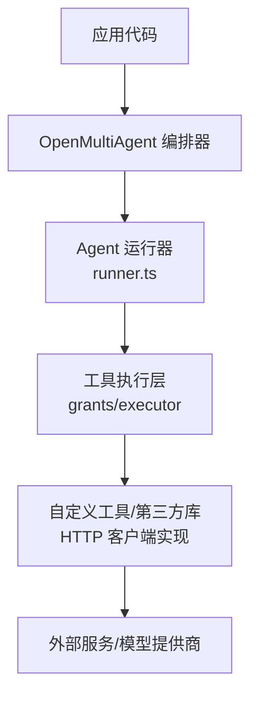
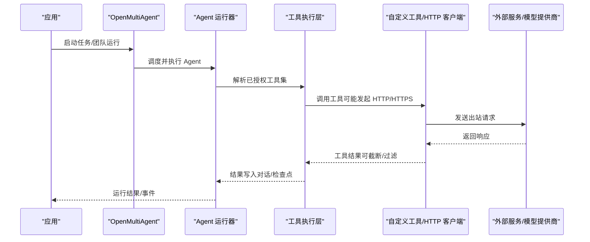
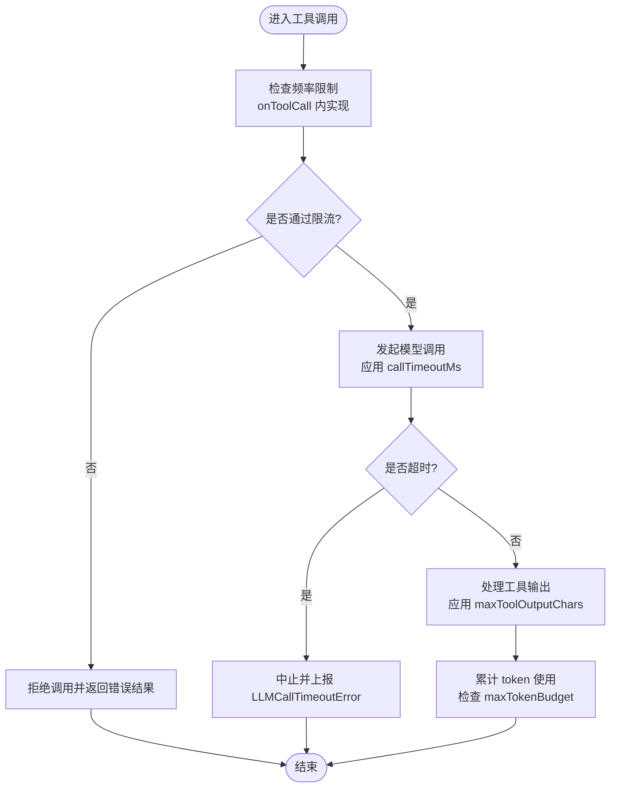

# 网络访问控制

<cite>
**本文引用的文件**
- [README.md](file://README.md)
- [package.json](file://package.json)
- [packages/core/README.md](file://packages/core/README.md)
- [docs/tool-configuration.md](file://docs/tool-configuration.md)
- [packages/core/src/types.ts](file://packages/core/src/types.ts)
- [packages/core/src/agent/runner.ts](file://packages/core/src/agent/runner.ts)
</cite>

## 目录
1. [简介](#简介)
2. [项目结构](#项目结构)
3. [核心组件](#核心组件)
4. [架构总览](#架构总览)
5. [详细组件分析](#详细组件分析)
6. [依赖关系分析](#依赖关系分析)
7. [性能考量](#性能考量)
8. [故障排查指南](#故障排查指南)
9. [结论](#结论)
10. [附录](#附录)

## 简介
本文件聚焦 Open Multi-Agent（OMA）在网络访问控制方面的能力与限制，围绕出站请求限制、域名白名单、代理配置、以及“网络请求沙箱化”等主题进行说明。需要明确的是：在当前仓库中，OMA 并未内置统一的 HTTP/HTTPS 出站拦截器、域名白名单或全局代理开关；其“网络相关”的安全边界主要通过工具层（如自定义工具）、调用链路与超时/预算控制来实现。因此，本文在解释现有机制的同时，也给出基于仓库能力的最佳实践建议与常见问题的排查路径。

## 项目结构
- 根仓库为 monorepo，核心功能位于 packages/core。
- 文档集中在 docs 与 packages/core/README.md，工具与安全策略在 docs/tool-configuration.md 中有详细说明。
- 类型定义与执行流程关键逻辑位于 packages/core/src/types.ts 与 packages/core/src/agent/runner.ts。

图表来源
- [packages/core/src/agent/runner.ts:902-931](file://packages/core/src/agent/runner.ts#L902-L931)
- [packages/core/src/types.ts:958-984](file://packages/core/src/types.ts#L958-L984)

章节来源
- [README.md:46-108](file://README.md#L46-L108)
- [packages/core/README.md:49-167](file://packages/core/README.md#L49-L167)
- [package.json:1-34](file://package.json#L1-L34)

## 核心组件
- 工具授权与默认拒绝：内置工具默认不可用，需显式授予；这为“出站请求”的入口提供了强约束点。
- 每调用门控 onToolCall：可在具体工具调用前进行参数级审查、限流、鉴权与审计。
- 工作目录沙箱：文件系统工具受 cwd 限制，但 bash 不受沙箱限制，需谨慎授予。
- 运行时超时与预算：callTimeoutMs、maxTokenBudget 等可限制单次调用与整体运行的资源消耗。
- 结果输出控制：工具输出可截断、压缩与脱敏，减少敏感信息泄露面。

章节来源
- [docs/tool-configuration.md:214-237](file://docs/tool-configuration.md#L214-L237)
- [docs/tool-configuration.md:326-362](file://docs/tool-configuration.md#L326-L362)
- [docs/tool-configuration.md:391-441](file://docs/tool-configuration.md#L391-L441)
- [packages/core/src/types.ts:1092-1105](file://packages/core/src/types.ts#L1092-L1105)
- [packages/core/src/types.ts:1112-1117](file://packages/core/src/types.ts#L1112-L1117)
- [packages/core/src/types.ts:2243-2252](file://packages/core/src/types.ts#L2243-L2252)

## 架构总览
下图展示了 OMA 从编排到工具执行的链路，以及“网络访问”可能发生的落点：所有出站请求通常由“自定义工具”或“第三方库”发起，因此安全策略应优先在工具层与调用层实施。

图表来源
- [packages/core/src/agent/runner.ts:902-931](file://packages/core/src/agent/runner.ts#L902-L931)
- [packages/core/src/types.ts:958-984](file://packages/core/src/types.ts#L958-L984)

## 详细组件分析

### 出站请求限制策略（HTTP/HTTPS 协议过滤、频率控制、超时管理）
- 协议过滤：当前仓库未提供全局 HTTP/HTTPS 出站拦截器。若需协议级限制（例如仅允许 HTTPS），应在自定义工具内部实现或使用宿主环境/进程级策略（容器、防火墙、eBPF）。
- 频率控制：可通过 onToolCall 钩子在工具调用前做速率限制（例如令牌桶/滑动窗口），并结合 runId/taskId 做细粒度限流。
- 超时管理：
  - 单模型调用超时：callTimeoutMs 为每次模型调用设置统一超时，避免某供应商 SDK 不一致导致的挂起。
  - 整体运行预算：maxTokenBudget 用于限制累计 token 使用，防止无限增长。
  - 工具输出长度：maxToolOutputChars 可限制工具输出大小，降低上下文膨胀风险。

图表来源
- [packages/core/src/types.ts:1092-1105](file://packages/core/src/types.ts#L1092-L1105)
- [packages/core/src/types.ts:1112-1117](file://packages/core/src/types.ts#L1112-L1117)
- [docs/tool-configuration.md:326-362](file://docs/tool-configuration.md#L326-L362)

章节来源
- [packages/core/src/types.ts:1092-1105](file://packages/core/src/types.ts#L1092-L1105)
- [packages/core/src/types.ts:1112-1117](file://packages/core/src/types.ts#L1112-L1117)
- [docs/tool-configuration.md:326-362](file://docs/tool-configuration.md#L326-L362)

### 域名白名单机制（允许域名配置、黑名单过滤、动态域名解析安全）
- 当前仓库未提供内置的域名白名单/黑名单或 DNS 解析安全模块。
- 推荐做法：
  - 在自定义工具中维护域名白名单/黑名单，并在发起 HTTP(S) 请求前校验目标域名。
  - 对动态解析场景，建议在工具层缓存解析结果并校验 IP 段，或在宿主环境使用 eBPF/iptables 限制出站连接。
  - 结合 onToolCall 记录并审计所有出站请求，便于事后追溯。

章节来源
- [docs/tool-configuration.md:214-237](file://docs/tool-configuration.md#L214-L237)
- [docs/tool-configuration.md:326-362](file://docs/tool-configuration.md#L326-L362)

### 代理配置支持（HTTP 代理设置、认证代理支持、代理故障转移）
- 当前仓库未提供统一的代理配置入口。
- 推荐做法：
  - 在自定义工具中使用支持代理的 HTTP 客户端（如 Node.js 的代理中间件），集中配置代理地址、认证信息与故障转移策略。
  - 将代理配置作为工具输入或环境变量注入，避免硬编码。
  - 在 onToolCall 中记录代理选择与重试次数，便于观测与排障。

章节来源
- [docs/tool-configuration.md:326-362](file://docs/tool-configuration.md#L326-L362)

### 网络请求沙箱化（请求头注入、响应内容过滤、敏感信息保护）
- 请求头注入：在自定义工具中统一注入必要请求头（如用户代理、追踪 ID），并移除敏感头（如内部鉴权头）。
- 响应内容过滤：对响应体进行最小化裁剪，仅保留业务必需字段；对图片/文件等富媒体进行尺寸与类型校验。
- 敏感信息保护：
  - 工具输出可使用 maxToolOutputChars 截断，避免长文本泄露。
  - credentials 字段在追踪与仪表盘中自动脱敏，避免密钥外泄。
  - 谨慎传递签名 URL、查询令牌等敏感引用给模型提供商。

章节来源
- [docs/tool-configuration.md:507-648](file://docs/tool-configuration.md#L507-L648)
- [docs/tool-configuration.md:469-505](file://docs/tool-configuration.md#L469-L505)

### 工具授权与工作目录沙箱（与网络访问的关系）
- 工具默认拒绝：内置工具需显式授予，避免意外触发网络请求。
- 工作目录沙箱：文件系统工具受 cwd 限制，但 bash 不受沙箱限制，存在逃逸风险。
- 建议：
  - 仅授予必要的工具集合，避免授予 bash。
  - 如需网络访问，尽量通过自定义工具封装，并在工具内实现白名单、限流、超时与输出过滤。

章节来源
- [docs/tool-configuration.md:214-237](file://docs/tool-configuration.md#L214-L237)
- [docs/tool-configuration.md:391-441](file://docs/tool-configuration.md#L391-L441)

## 依赖关系分析
- 编排器（OpenMultiAgent）负责调度与生命周期管理。
- Agent 运行器（runner.ts）构建工具可用集，并对调用进行门控与检查点持久化。
- 工具执行层（grants/executor）负责实际执行，网络请求通常在此处发生。
- 类型定义（types.ts）提供超时、预算、工具门控等关键配置项。

图表来源
- [packages/core/src/types.ts:958-984](file://packages/core/src/types.ts#L958-L984)
- [packages/core/src/agent/runner.ts:902-931](file://packages/core/src/agent/runner.ts#L902-L931)

章节来源
- [packages/core/src/types.ts:958-984](file://packages/core/src/types.ts#L958-L984)
- [packages/core/src/agent/runner.ts:902-931](file://packages/core/src/agent/runner.ts#L902-L931)

## 性能考量
- 合理设置 callTimeoutMs，避免慢供应商导致整体阻塞。
- 使用 maxTokenBudget 控制整体成本与上下文规模。
- 对工具输出进行截断与压缩，减少后续轮次的输入膨胀。
- 在 onToolCall 中实现轻量级限流，避免突发流量压垮下游服务。

[本节为通用指导，不直接分析具体文件]

## 故障排查指南
- 模型调用超时：检查 callTimeoutMs 是否过小；确认供应商 SDK 行为与网络状况。
- 工具输出过大：调整 maxToolOutputChars，或在上游工具中进行裁剪。
- 工具被拒绝：确认工具是否已授予；检查 onToolCall 的门控逻辑与 deny 原因。
- 工作目录越界：文件系统工具路径必须落在 cwd 内；bash 不受沙箱限制，需额外防护。
- 敏感信息泄露：检查工具输出与 credentials 使用；确保追踪数据已脱敏。

章节来源
- [packages/core/src/types.ts:1092-1105](file://packages/core/src/types.ts#L1092-L1105)
- [packages/core/src/types.ts:1112-1117](file://packages/core/src/types.ts#L1112-L1117)
- [docs/tool-configuration.md:391-441](file://docs/tool-configuration.md#L391-L441)
- [docs/tool-configuration.md:469-505](file://docs/tool-configuration.md#L469-L505)

## 结论
- OMA 当前未提供全局的 HTTP/HTTPS 出站拦截器、域名白名单或统一代理配置。
- 网络访问控制的最佳落地点在“工具层”与“调用门控”：通过自定义工具与 onToolCall 实现协议/域名/频率/超时/输出过滤等策略。
- 配合 cwd 沙箱、工具输出控制与 credentials 脱敏，可显著降低敏感信息泄露面。
- 在生产环境中，建议结合宿主环境（容器、防火墙、eBPF）与工具层策略，形成纵深防御。

[本节为总结性内容，不直接分析具体文件]

## 附录
- 快速开始与生产清单请参考核心包 README。
- 工具配置与安全策略详见 tool-configuration 文档。
- 类型与执行流程参考 types.ts 与 runner.ts。

章节来源
- [packages/core/README.md:49-167](file://packages/core/README.md#L49-L167)
- [docs/tool-configuration.md:214-237](file://docs/tool-configuration.md#L214-L237)
- [packages/core/src/types.ts:958-984](file://packages/core/src/types.ts#L958-L984)
- [packages/core/src/agent/runner.ts:902-931](file://packages/core/src/agent/runner.ts#L902-L931)