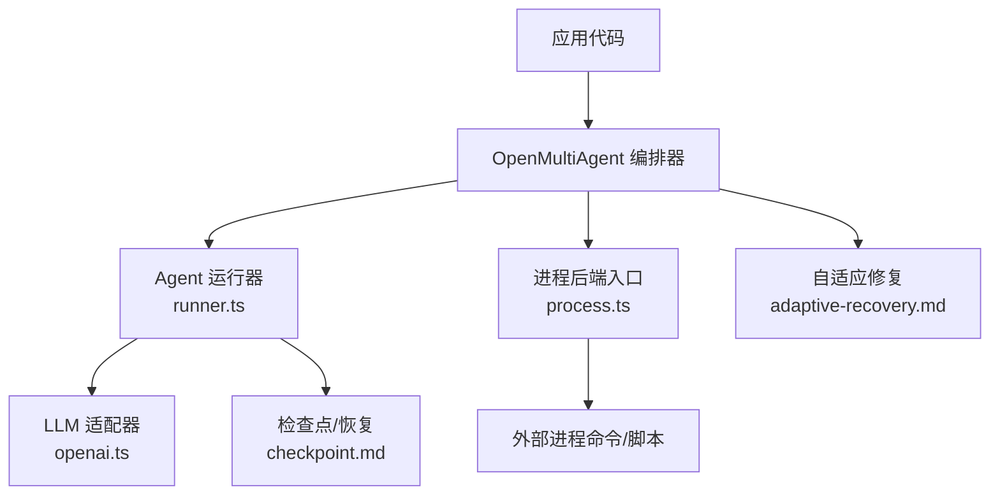
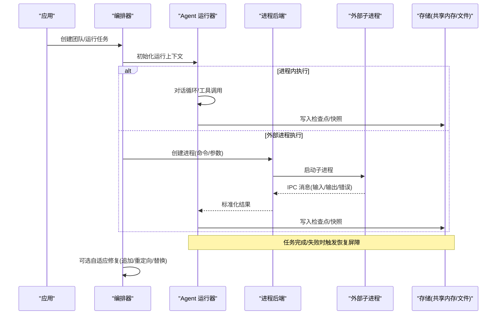
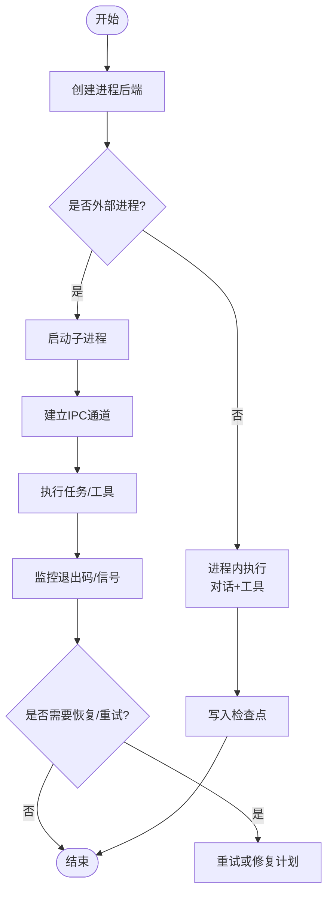
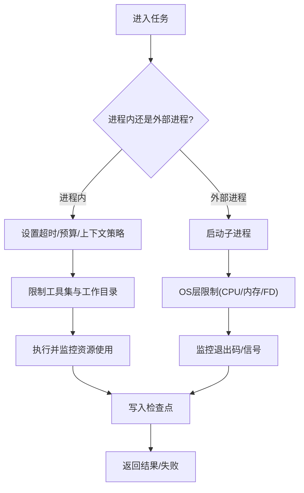
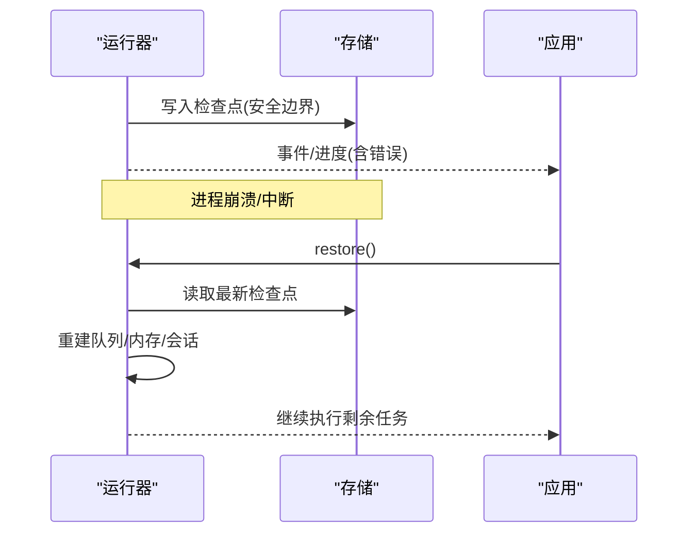
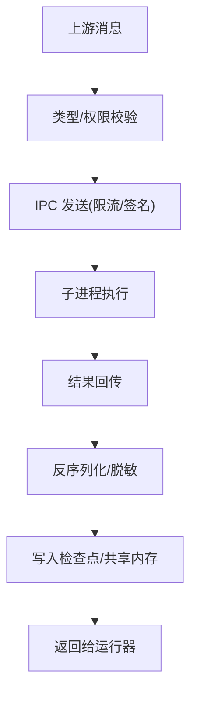
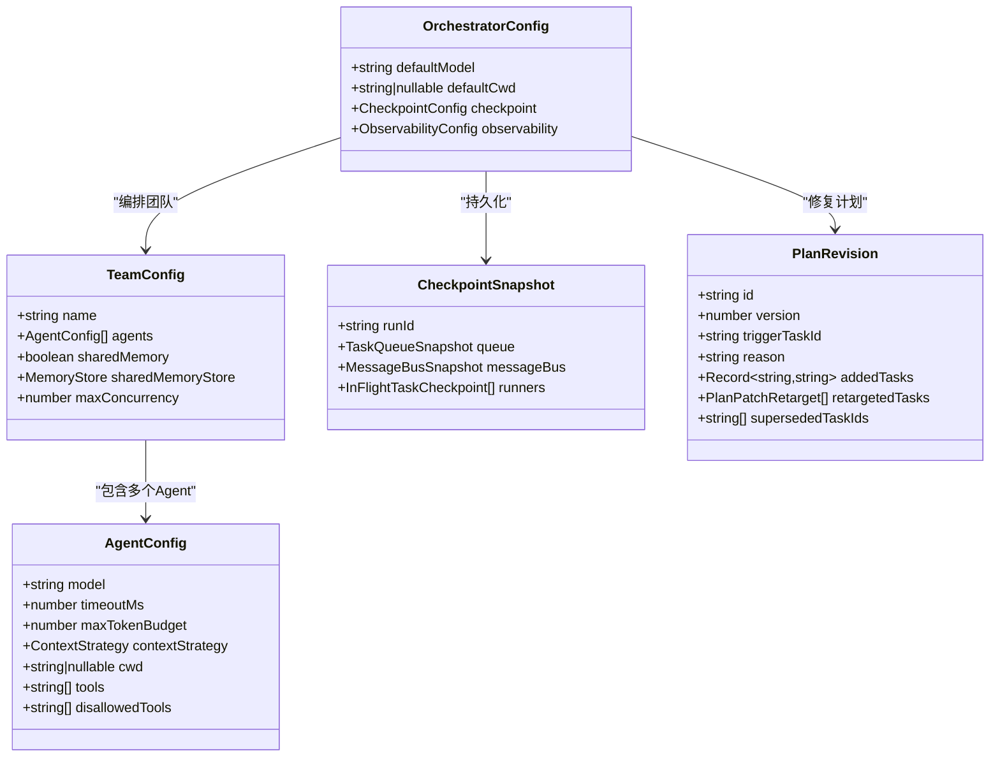
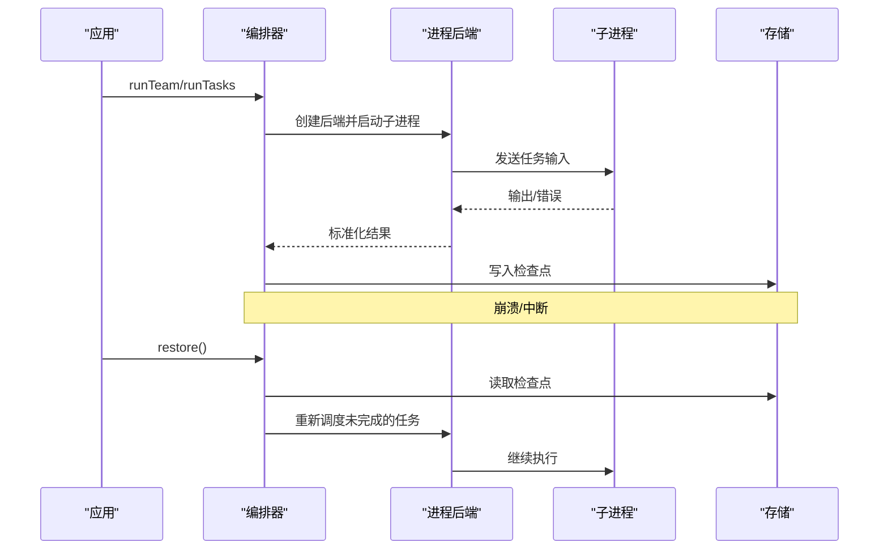
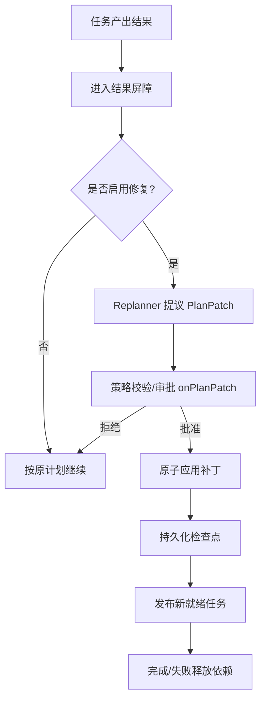
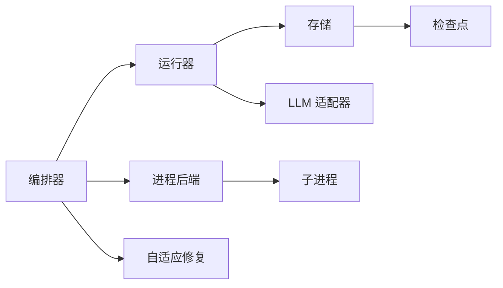

# 进程隔离机制

<cite>
**本文引用的文件**
- [README.md](file://README.md)
- [package.json](file://package.json)
- [process.ts](file://packages/core/src/process.ts)
- [types.ts](file://packages/core/src/types.ts)
- [runner.ts](file://packages/core/src/agent/runner.ts)
- [openai.ts](file://packages/core/src/llm/openai.ts)
- [adaptive-recovery.md](file://docs/adaptive-recovery.md)
- [checkpoint.md](file://docs/checkpoint.md)
</cite>

## 目录
1. [简介](#简介)
2. [项目结构](#项目结构)
3. [核心组件](#核心组件)
4. [架构总览](#架构总览)
5. [详细组件分析](#详细组件分析)
6. [依赖关系分析](#依赖关系分析)
7. [性能考量](#性能考量)
8. [故障诊断指南](#故障诊断指南)
9. [结论](#结论)
10. [附录](#附录)

## 简介
本文件聚焦 Open Multi-Agent（OMA）在“进程隔离”方面的设计与实现，围绕以下目标展开：
- 子进程管理策略：进程创建、生命周期管理与资源隔离。
- 资源限制机制：CPU 使用限制、内存占用控制、文件描述符限制。
- 崩溃恢复机制：异常捕获、状态保存与自动重启。
- 进程间通信安全：消息传递验证、IPC 通道保护、数据序列化。
- 配置优化建议与故障诊断方法，确保多智能体环境稳定运行。

OMA 提供两类执行路径：
- 进程内执行：默认在 Node.js 进程内运行 LLM 调用与工具链，具备细粒度的超时、预算、上下文压缩等控制能力。
- 外部进程执行：通过“进程后端”将任意本地进程作为 OMA 的 Agent 后端，实现进程级隔离与更强的资源边界。

## 项目结构
- 根仓库为 monorepo，核心功能位于 packages/core。
- 进程隔离相关入口集中在 packages/core/src/process.ts，它导出进程后端类型与工厂函数，供上层编排器按 Agent 配置加载并启动外部进程。
- 运行时类型定义集中在 types.ts，涵盖 Agent、Team、Orchestrator、Checkpoint、Recovery 等关键概念。
- 内置 LLM 运行器 runner.ts 负责对话轮次、工具调用、检查点与恢复。
- 文档 docs/ 下的 checkpoint.md 与 adaptive-recovery.md 描述了持久化与自适应修复流程。

图表来源
- [process.ts:1-23](file://packages/core/src/process.ts#L1-L23)
- [runner.ts:875-1048](file://packages/core/src/agent/runner.ts#L875-L1048)
- [openai.ts:223-264](file://packages/core/src/llm/openai.ts#L223-L264)
- [checkpoint.md:1-290](file://docs/checkpoint.md#L1-L290)
- [adaptive-recovery.md:1-132](file://docs/adaptive-recovery.md#L1-L132)

章节来源
- [README.md:140-157](file://README.md#L140-L157)
- [package.json:1-34](file://package.json#L1-L34)

## 核心组件
- 进程后端（Process Backend）：通过 process.ts 暴露 createProcessBackend 与 ProcessBackendOptions，允许将任意本地进程作为 Agent 后端，实现进程级隔离。
- Agent 运行器（Runner）：runner.ts 实现对话循环、工具调用、检查点写入、恢复与流式事件输出。
- 类型系统（Types）：types.ts 定义了 AgentConfig、TeamConfig、OrchestratorConfig、CheckpointSnapshot、PlanRevision 等，贯穿隔离、沙箱、恢复与修复。
- 检查点与恢复（Checkpoint & Resume）：checkpoint.md 详述了快照格式、原子写入、恢复语义与 mid-task 工具恢复。
- 自适应修复（Adaptive Recovery）：adaptive-recovery.md 描述了任务结果屏障上的可修复计划修订，保证下游任务不会在替代方案确定前启动。

章节来源
- [process.ts:1-23](file://packages/core/src/process.ts#L1-L23)
- [runner.ts:875-1048](file://packages/core/src/agent/runner.ts#L875-L1048)
- [types.ts:544-557](file://packages/core/src/types.ts#L544-L557)
- [types.ts:1084-1092](file://packages/core/src/types.ts#L1084-L1092)
- [types.ts:1295-1310](file://packages/core/src/types.ts#L1295-L1310)
- [types.ts:2417-2447](file://packages/core/src/types.ts#L2417-L2447)
- [checkpoint.md:1-290](file://docs/checkpoint.md#L1-L290)
- [adaptive-recovery.md:1-132](file://docs/adaptive-recovery.md#L1-L132)

## 架构总览
下图展示了 OMA 在进程隔离与恢复方面的整体交互：编排器根据 Agent 配置选择进程内或外部进程执行；运行器负责对话与工具调用的边界检查点；检查点与自适应修复共同保障中断后的可恢复性。

图表来源
- [process.ts:1-23](file://packages/core/src/process.ts#L1-L23)
- [runner.ts:875-1048](file://packages/core/src/agent/runner.ts#L875-L1048)
- [checkpoint.md:109-153](file://docs/checkpoint.md#L109-L153)
- [adaptive-recovery.md:7-21](file://docs/adaptive-recovery.md#L7-L21)

## 详细组件分析

### 子进程管理策略（创建、生命周期、资源隔离）
- 进程创建
  - 通过 process.ts 导出的 createProcessBackend 构造后端，Agent 配置中的 backend 字段可指定外部进程命令与参数。
  - 编排器在调度到该 Agent 时，由后端负责拉起子进程，并将任务输入以结构化消息形式传递给子进程。
- 生命周期管理
  - 子进程的生命周期由后端封装：启动、心跳/健康检查、正常退出、异常退出的统一处理。
  - 当子进程异常退出时，运行器可将该任务标记为失败，并根据恢复策略决定是否重试或修复计划。
- 资源隔离
  - 进程级隔离天然隔离了文件系统、网络、环境变量等；可通过操作系统层面的 cgroups/ulimit 进一步约束 CPU、内存、FD。
  - 对于进程内执行，OMA 提供了工作目录沙箱（cwd）、工具白名单/预设、超时与预算等软隔离手段。

图表来源
- [process.ts:1-23](file://packages/core/src/process.ts#L1-L23)
- [checkpoint.md:109-153](file://docs/checkpoint.md#L109-L153)

章节来源
- [process.ts:1-23](file://packages/core/src/process.ts#L1-L23)
- [types.ts:2236-2252](file://packages/core/src/types.ts#L2236-L2252)

### 资源限制机制（CPU、内存、文件描述符）
- 进程内执行
  - 超时控制：AgentConfig.timeoutMs 与 callTimeoutMs 分别限制整个运行与单次模型调用。
  - 预算控制：maxTokenBudget、maxTokens、maxTurns 等限制 token 与轮次增长。
  - 上下文压缩：contextStrategy 与 compressToolResults 控制输入膨胀，避免上下文超限。
  - 工作目录沙箱：cwd/defaultCwd 限制文件系统工具访问范围，拒绝越界路径。
- 外部进程执行
  - 建议在操作系统层使用 ulimit/cgroups 限制 CPU、内存、文件描述符数量。
  - 结合进程健康检查与超时，防止子进程长期占用资源。
- 工具与权限
  - toolPreset/tools/disallowedTools 控制可用工具集，降低风险面。
  - credentials 与 secrets 作用域限定，避免泄露。

图表来源
- [types.ts:1084-1092](file://packages/core/src/types.ts#L1084-L1092)
- [types.ts:1007-1043](file://packages/core/src/types.ts#L1007-L1043)
- [types.ts:2236-2252](file://packages/core/src/types.ts#L2236-L2252)

章节来源
- [types.ts:1007-1043](file://packages/core/src/types.ts#L1007-L1043)
- [types.ts:1084-1092](file://packages/core/src/types.ts#L1084-L1092)
- [types.ts:2236-2252](file://packages/core/src/types.ts#L2236-L2252)

### 崩溃恢复机制（异常捕获、状态保存、自动重启）
- 异常捕获
  - 运行器在对话与工具调用边界进行 try/catch，分类失败原因，记录 span 与事件。
  - 外部进程异常退出时，后端上报错误，运行器将其视为任务失败。
- 状态保存
  - 检查点在安全边界（如工具调用提交后、任务完成后）写入，包含任务队列、共享内存、进行中 runner 状态、审批延续状态等。
  - FileStore 采用原子写（临时文件 + fsync + rename），避免半写状态。
- 自动重启与恢复
  - restore() 从最新检查点重建任务队列与共享内存，跳过已完成任务，继续未完成任务。
  - 自适应修复在任务结果屏障上提出 PlanPatch，经策略校验与审批后，原子应用补丁并持久化。

图表来源
- [runner.ts:875-1048](file://packages/core/src/agent/runner.ts#L875-L1048)
- [checkpoint.md:109-153](file://docs/checkpoint.md#L109-L153)
- [checkpoint.md:154-161](file://docs/checkpoint.md#L154-L161)
- [checkpoint.md:206-249](file://docs/checkpoint.md#L206-L249)
- [adaptive-recovery.md:7-21](file://docs/adaptive-recovery.md#L7-L21)

章节来源
- [runner.ts:875-1048](file://packages/core/src/agent/runner.ts#L875-L1048)
- [checkpoint.md:109-153](file://docs/checkpoint.md#L109-L153)
- [checkpoint.md:154-161](file://docs/checkpoint.md#L154-L161)
- [checkpoint.md:206-249](file://docs/checkpoint.md#L206-L249)
- [adaptive-recovery.md:7-21](file://docs/adaptive-recovery.md#L7-L21)

### 进程间通信安全（消息验证、IPC 保护、序列化）
- 消息传递验证
  - 外部进程通过后端与运行器通信，消息需经过类型校验与白名单过滤，避免注入与越权。
  - 工具调用前后均有审批门控（durable approvals），必要时暂停并等待人工决策。
- IPC 通道保护
  - 建议使用标准输入/输出或受控管道，限制带宽与消息大小；对异常退出进行快速检测。
  - 进程健康检查与超时，避免僵尸进程。
- 数据序列化
  - 检查点与共享内存使用 JSON 序列化；敏感信息可通过 RedactingStore 脱敏。
  - 图片/二进制等大对象通过 URL 引用或分块传输，避免上下文爆炸。

图表来源
- [checkpoint.md:172-204](file://docs/checkpoint.md#L172-L204)
- [runner.ts:1020-1048](file://packages/core/src/agent/runner.ts#L1020-L1048)

章节来源
- [checkpoint.md:172-204](file://docs/checkpoint.md#L172-L204)
- [runner.ts:1020-1048](file://packages/core/src/agent/runner.ts#L1020-L1048)

### 类图：关键类型与关系

图表来源
- [types.ts:1007-1043](file://packages/core/src/types.ts#L1007-L1043)
- [types.ts:1084-1092](file://packages/core/src/types.ts#L1084-L1092)
- [types.ts:1295-1310](file://packages/core/src/types.ts#L1295-L1310)
- [types.ts:2417-2447](file://packages/core/src/types.ts#L2417-L2447)
- [types.ts:1445-1456](file://packages/core/src/types.ts#L1445-L1456)

章节来源
- [types.ts:1007-1043](file://packages/core/src/types.ts#L1007-L1043)
- [types.ts:1084-1092](file://packages/core/src/types.ts#L1084-L1092)
- [types.ts:1295-1310](file://packages/core/src/types.ts#L1295-L1310)
- [types.ts:2417-2447](file://packages/core/src/types.ts#L2417-L2447)
- [types.ts:1445-1456](file://packages/core/src/types.ts#L1445-L1456)

### API/服务流程：外部进程执行与恢复

图表来源
- [process.ts:1-23](file://packages/core/src/process.ts#L1-L23)
- [checkpoint.md:74-107](file://docs/checkpoint.md#L74-L107)
- [checkpoint.md:109-153](file://docs/checkpoint.md#L109-L153)

章节来源
- [process.ts:1-23](file://packages/core/src/process.ts#L1-L23)
- [checkpoint.md:74-107](file://docs/checkpoint.md#L74-L107)
- [checkpoint.md:109-153](file://docs/checkpoint.md#L109-L153)

### 复杂逻辑：自适应修复流程

图表来源
- [adaptive-recovery.md:7-21](file://docs/adaptive-recovery.md#L7-L21)
- [adaptive-recovery.md:82-99](file://docs/adaptive-recovery.md#L82-L99)
- [adaptive-recovery.md:100-132](file://docs/adaptive-recovery.md#L100-L132)

章节来源
- [adaptive-recovery.md:7-21](file://docs/adaptive-recovery.md#L7-L21)
- [adaptive-recovery.md:82-99](file://docs/adaptive-recovery.md#L82-L99)
- [adaptive-recovery.md:100-132](file://docs/adaptive-recovery.md#L100-L132)

## 依赖关系分析
- 编排器依赖 Agent 运行器与进程后端；运行器依赖存储（共享内存/文件）与 LLM 适配器。
- 进程后端与外部子进程通过 IPC 通信，需保证消息类型与权限校验。
- 检查点与自适应修复强耦合：修复需在检查点之后生效，确保一致性。

图表来源
- [process.ts:1-23](file://packages/core/src/process.ts#L1-L23)
- [runner.ts:875-1048](file://packages/core/src/agent/runner.ts#L875-L1048)
- [openai.ts:223-264](file://packages/core/src/llm/openai.ts#L223-L264)
- [checkpoint.md:109-153](file://docs/checkpoint.md#L109-L153)
- [adaptive-recovery.md:7-21](file://docs/adaptive-recovery.md#L7-L21)

章节来源
- [process.ts:1-23](file://packages/core/src/process.ts#L1-L23)
- [runner.ts:875-1048](file://packages/core/src/agent/runner.ts#L875-L1048)
- [openai.ts:223-264](file://packages/core/src/llm/openai.ts#L223-L264)
- [checkpoint.md:109-153](file://docs/checkpoint.md#L109-L153)
- [adaptive-recovery.md:7-21](file://docs/adaptive-recovery.md#L7-L21)

## 性能考量
- 进程内执行
  - 合理设置 timeoutMs 与 callTimeoutMs，避免长尾请求拖垮整体吞吐。
  - 使用 contextStrategy 与 compressToolResults 控制上下文膨胀，减少 token 成本与延迟。
  - 利用并行工具调用（parallel_tool_calls）提升吞吐，但需评估模型与后端支持。
- 外部进程执行
  - 控制并发度（maxConcurrency）与批大小，避免过多子进程导致上下文切换开销。
  - 使用轻量 IPC 协议，减少序列化/反序列化成本。
  - 结合 OS 层资源限制，防止单进程独占资源。
- 检查点与恢复
  - 检查点写入频率应权衡一致性与 I/O 开销；仅在安全边界写入。
  - 使用 FileStore 的原子写特性，避免部分写入导致的恢复失败。

[本节为通用指导，不直接分析具体文件]

## 故障诊断指南
- 常见错误定位
  - 检查点写入失败：关注 onProgress 中的 checkpoint_save_failed 事件，确认存储可用性与权限。
  - 子进程异常退出：查看后端日志与退出码，判断是否为超时、内存不足或权限问题。
  - 工具调用失败：核对工具白名单、工作目录沙箱与输入校验。
- 恢复与重试
  - 使用 restore() 从最新检查点继续；若检查点损坏，尝试降级到任务边界恢复。
  - 启用自适应修复，针对失败任务追加替代任务或重定向执行者。
- 观测与审计
  - 通过 Observability v2 记录 span 与事件，追踪调用链与资源使用。
  - 对敏感数据进行脱敏（RedactingStore），避免泄露。

章节来源
- [checkpoint.md:154-161](file://docs/checkpoint.md#L154-L161)
- [checkpoint.md:172-204](file://docs/checkpoint.md#L172-L204)
- [adaptive-recovery.md:100-132](file://docs/adaptive-recovery.md#L100-L132)

## 结论
OMA 通过“进程内精细控制 + 外部进程强隔离”的双轨模式，结合检查点与自适应修复，构建了稳健的多智能体执行环境。生产部署建议：
- 对高风险任务使用外部进程后端，并在 OS 层施加 CPU/内存/FD 限制。
- 启用检查点与自适应修复，确保中断后可恢复、失败可自愈。
- 严格配置工具白名单与工作目录沙箱，最小化攻击面。
- 结合观测与审计，持续优化性能与稳定性。

[本节为总结，不直接分析具体文件]

## 附录
- 快速参考
  - 进程后端入口：packages/core/src/process.ts
  - 运行器与恢复：packages/core/src/agent/runner.ts
  - 类型定义：packages/core/src/types.ts
  - 检查点与恢复：docs/checkpoint.md
  - 自适应修复：docs/adaptive-recovery.md

[本节为索引，不直接分析具体文件]