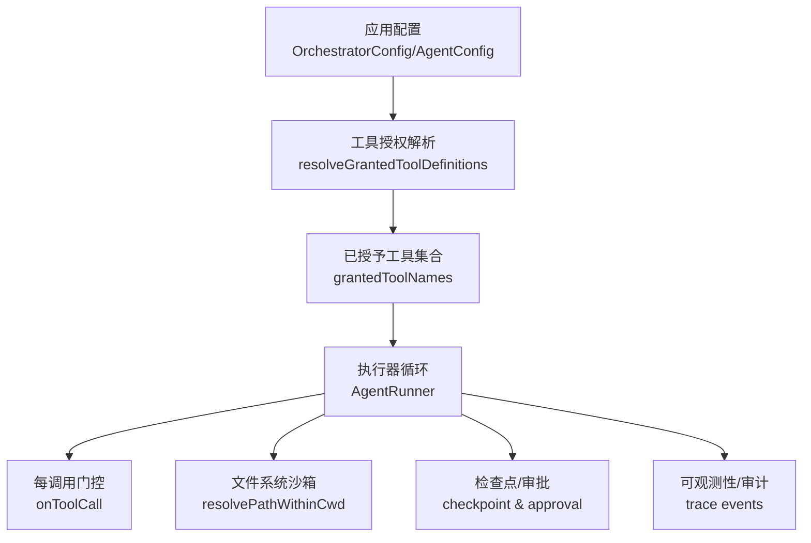
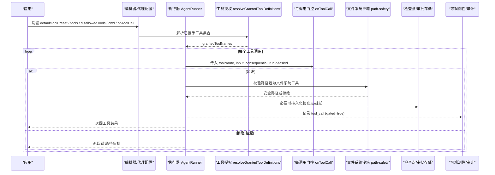
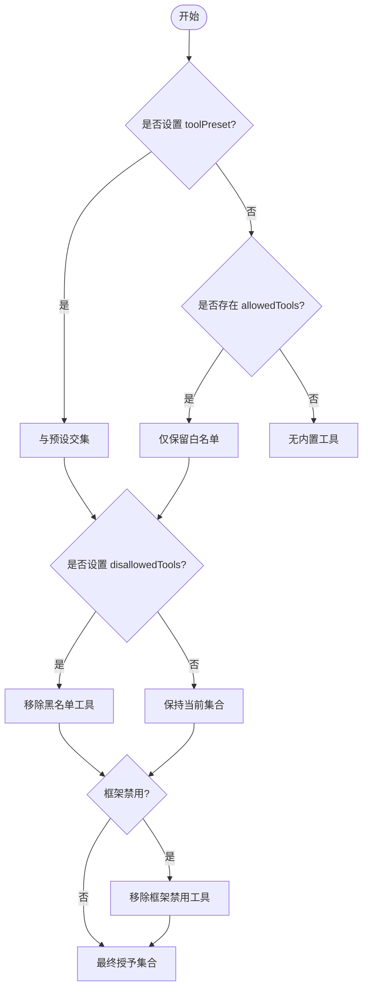
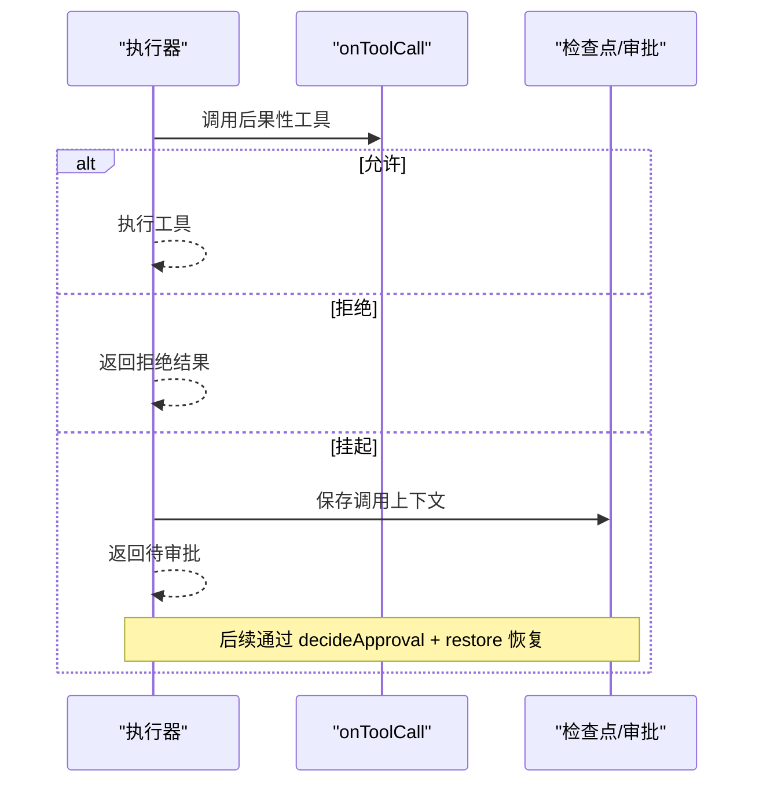
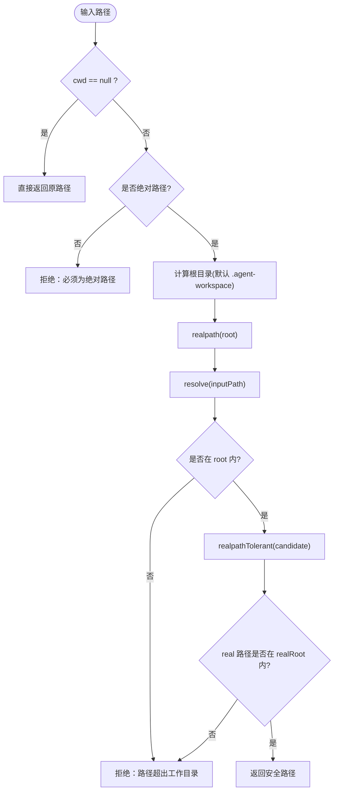
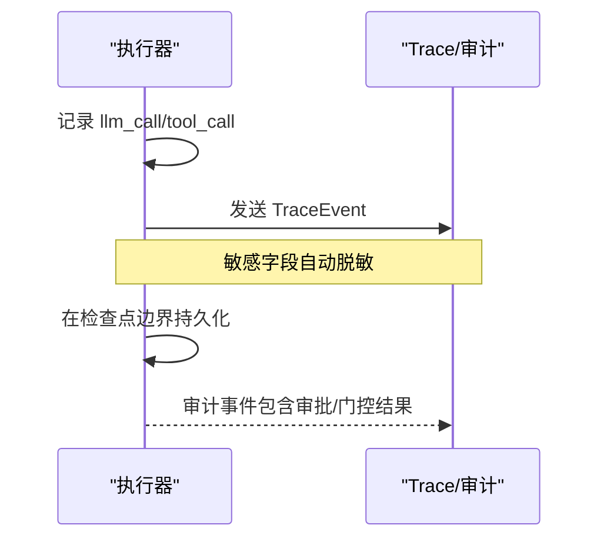
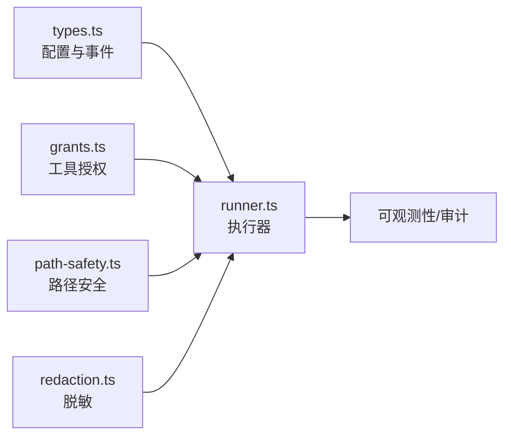

# 安全性和隐私保护

<cite>
**本文引用的文件**
- [README.md](file://README.md)
- [SECURITY.md](file://.github/SECURITY.md)
- [tool-configuration.md](file://docs/tool-configuration.md)
- [types.ts](file://packages/core/src/types.ts)
- [runner.ts](file://packages/core/src/agent/runner.ts)
- [grants.ts](file://packages/core/src/tool/grants.ts)
- [path-safety.ts](file://packages/core/src/tool/built-in/path-safety.ts)
- [redaction.ts](file://packages/core/src/utils/redaction.ts)
</cite>

## 目录
1. [简介](#简介)
2. [项目结构](#项目结构)
3. [核心组件](#核心组件)
4. [架构总览](#架构总览)
5. [详细组件分析](#详细组件分析)
6. [依赖关系分析](#依赖关系分析)
7. [性能与安全权衡](#性能与安全权衡)
8. [故障排查指南](#故障排查指南)
9. [结论](#结论)
10. [附录：安全配置清单与最佳实践](#附录：安全配置清单与最佳实践)

## 简介
本章节概述 Open Multi-Agent（OMA）在安全性与隐私保护方面的设计目标与能力边界。OMA 将“默认拒绝”的安全模型贯穿工具权限、调用审批、沙箱隔离与可观测性，确保智能体在可控、可审计、可恢复的环境中运行。同时提供数据脱敏、传输与存储的隐私控制建议，以及上下文隔离（内存、网络、文件系统）的实践指导。

## 项目结构
与安全和隐私相关的代码主要分布在以下位置：
- 工具权限与白名单/黑名单解析：packages/core/src/tool/grants.ts
- 文件系统沙箱路径校验：packages/core/src/tool/built-in/path-safety.ts
- 执行器与审批/检查点：packages/core/src/agent/runner.ts
- 类型与全局配置（含默认工作目录、工具预设、观察性配置等）：packages/core/src/types.ts
- 敏感信息脱敏工具：packages/core/src/utils/redaction.ts
- 用户文档（工具配置、默认拒绝、后果性工具确认等）：docs/tool-configuration.md
- 项目级安全策略说明：.github/SECURITY.md

**图表来源**
- [grants.ts:33-89](file://packages/core/src/tool/grants.ts#L33-L89)
- [runner.ts:140-161](file://packages/core/src/agent/runner.ts#L140-L161)
- [runner.ts:902-931](file://packages/core/src/agent/runner.ts#L902-L931)
- [path-safety.ts:30-97](file://packages/core/src/tool/built-in/path-safety.ts#L30-L97)
- [types.ts:2257-2274](file://packages/core/src/types.ts#L2257-L2274)

**章节来源**
- [tool-configuration.md:214-238](file://docs/tool-configuration.md#L214-L238)
- [grants.ts:33-89](file://packages/core/src/tool/grants.ts#L33-L89)
- [runner.ts:140-161](file://packages/core/src/agent/runner.ts#L140-L161)
- [path-safety.ts:30-97](file://packages/core/src/tool/built-in/path-safety.ts#L30-L97)
- [types.ts:2257-2274](file://packages/core/src/types.ts#L2257-L2274)

## 核心组件
- 默认拒绝的工具权限控制
  - 内置工具（bash、file_read/file_write/file_edit/grep/glob）默认不授予；必须通过 tools 或 toolPreset 显式授权。
  - 支持 preset（readonly/readwrite/full）、白名单 allowedTools、黑名单 disallowedTools 的组合过滤。
  - 框架级禁用列表 AGENT_FRAMEWORK_DISALLOWED 预留扩展。
- 后果性工具与审批
  - 标记 consequential 的工具（如 bash、file_write、file_edit）在未声明治理拓扑时可通过 requireConsequentialConfirmation 强制人工确认。
  - onToolCall 作为每调用门控，支持 allow/deny/suspend，并与检查点/持久化审批组合。
- 文件系统沙箱
  - 内置文件系统工具受 cwd 限制，仅允许绝对路径且必须在根目录下（含符号链接解析）。
  - 默认工作目录为进程当前目录下的 .agent-workspace，首次写入自动创建；可全局或按代理覆盖；null 表示关闭沙箱。
- 可观测性与审计
  - 每次 LLM 调用、工具调用、任务阶段均产生 trace 事件；工具门控会记录 gated/gateAction 等信息。
  - credentials 字段在追踪中自动脱敏；评估/回放数据可按策略处理。
- 隐私与数据流
  - 工具输出会进入对话并发送到模型提供商；需审慎授权读取类工具。
  - 富媒体结果（图片/文件）在适配器映射时有明确支持范围与拒绝策略；引用 URL 视为向提供商披露。
  - 本地存储（检查点、评估存储）可结合脱敏存储包装以保护敏感内容。

**章节来源**
- [tool-configuration.md:214-238](file://docs/tool-configuration.md#L214-L238)
- [tool-configuration.md:251-289](file://docs/tool-configuration.md#L251-L289)
- [tool-configuration.md:140-213](file://docs/tool-configuration.md#L140-L213)
- [tool-configuration.md:391-441](file://docs/tool-configuration.md#L391-L441)
- [tool-configuration.md:507-648](file://docs/tool-configuration.md#L507-L648)
- [runner.ts:597-635](file://packages/core/src/agent/runner.ts#L597-L635)
- [types.ts:2257-2274](file://packages/core/src/types.ts#L2257-L2274)

## 架构总览
下图展示从配置到执行的完整安全链路：配置决定可用工具集，执行器在每步调用前进行名称授权与参数门控，文件系统操作经沙箱校验，关键步骤落盘检查点并可挂起等待审批，所有关键动作产生可观测事件用于审计。

**图表来源**
- [grants.ts:33-89](file://packages/core/src/tool/grants.ts#L33-L89)
- [runner.ts:140-161](file://packages/core/src/agent/runner.ts#L140-L161)
- [runner.ts:902-931](file://packages/core/src/agent/runner.ts#L902-L931)
- [path-safety.ts:30-97](file://packages/core/src/tool/built-in/path-safety.ts#L30-L97)
- [types.ts:2257-2274](file://packages/core/src/types.ts#L2257-L2274)

## 详细组件分析

### 工具权限模型与白名单机制
- 默认拒绝：未声明 tools 或 toolPreset 的代理无法使用任何内置工具。
- 预设与白/黑名单：preset → allowedTools → disallowedTools 的顺序叠加过滤；冲突时会发出警告。
- 框架级禁用：AGENT_FRAMEWORK_DISALLOWED 预留未来内置工具的强制禁用能力。
- 自定义/运行时工具：注册即授予，但仍受 disallowedTools 约束。

**图表来源**
- [grants.ts:33-89](file://packages/core/src/tool/grants.ts#L33-L89)

**章节来源**
- [grants.ts:33-89](file://packages/core/src/tool/grants.ts#L33-L89)
- [tool-configuration.md:251-289](file://docs/tool-configuration.md#L251-L289)

### 后果性工具与审批流程
- 后果性工具：bash、file_write、file_edit 等被标记为 consequential。
- 未声明治理拓扑时的自动标记：若最终授予包含后果性工具，结果携带标志位提示缺乏独立审查。
- 可选确认：requireConsequentialConfirmation 开启后，对后果性调用强制走 onToolCall 审批；支持 suspend 持久化决策并在恢复后继续。
- 动态团队运行的审批继承：runTeam 的 onPlanReady 可在计划阶段提供审批。

**图表来源**
- [tool-configuration.md:140-213](file://docs/tool-configuration.md#L140-L213)
- [runner.ts:902-931](file://packages/core/src/agent/runner.ts#L902-L931)
- [types.ts:2257-2274](file://packages/core/src/types.ts#L2257-L2274)

**章节来源**
- [tool-configuration.md:140-213](file://docs/tool-configuration.md#L140-L213)
- [runner.ts:902-931](file://packages/core/src/agent/runner.ts#L902-L931)

### 文件系统沙箱与路径安全
- 默认工作目录：.agent-workspace，首次写入自动创建；可全局或按代理覆盖；null 关闭沙箱。
- 路径校验：仅接受绝对路径；解析符号链接后仍须位于根目录内；TOCTOU 风险通过 realpath 缓解。
- 读/写差异：读取类工具遇到缺失根目录直接报错；写入工具在 ensureRoot 下自动创建根目录。
- bash 不受沙箱限制：一旦授予 shell，应通过进程级隔离（容器/VM/seccomp）保障安全。

**图表来源**
- [path-safety.ts:30-97](file://packages/core/src/tool/built-in/path-safety.ts#L30-L97)

**章节来源**
- [tool-configuration.md:391-441](file://docs/tool-configuration.md#L391-L441)
- [path-safety.ts:30-97](file://packages/core/src/tool/built-in/path-safety.ts#L30-L97)

### 可观测性与审计
- 事件类型：llm_call、tool_call、task、agent、plan_ready、consensus、routing_decision 等。
- 工具门控审计：tool_call 事件携带 gated、gateAction、gateReason（脱敏）等字段。
- 检查点与恢复：在关键边界持久化状态，支持中断恢复与幂等重放。
- 敏感信息脱敏：credentials 等敏感字段在追踪中自动脱敏；评估/回放数据可按策略处理。

**图表来源**
- [runner.ts:597-635](file://packages/core/src/agent/runner.ts#L597-L635)
- [types.ts:2665-2705](file://packages/core/src/types.ts#L2665-L2705)
- [redaction.ts](file://packages/core/src/utils/redaction.ts)

**章节来源**
- [runner.ts:597-635](file://packages/core/src/agent/runner.ts#L597-L635)
- [types.ts:2665-2705](file://packages/core/src/types.ts#L2665-L2705)

### 隐私保护措施
- 数据脱敏
  - credentials 在追踪中自动脱敏；评估/回放数据可按策略处理。
  - 富媒体结果中的 URL 引用视为向模型提供商披露，需谨慎使用。
- 传输加密
  - 与模型提供商通信遵循各适配器的安全约定；建议使用 HTTPS 端点与最小必要凭据。
- 本地存储安全
  - 检查点与评估存储可能包含敏感内容；可使用脱敏存储包装（RedactingStore）以降低泄露风险。
  - 评估存储具备完整性与恢复机制（如不完整批次丢弃、尾部行恢复）。

**章节来源**
- [tool-configuration.md:507-648](file://docs/tool-configuration.md#L507-L648)
- [types.ts:2536-2562](file://packages/core/src/types.ts#L2536-L2562)

### 上下文隔离
- 内存隔离
  - 共享内存（SharedMemory）支持 TTL/过期与写入校验；不同实现（内存/Redis/SQLite）由 MemoryStore 抽象。
  - 代理间凭据隔离：credentials 按代理作用域传递，不会合并或继承到其他代理。
- 网络访问控制
  - 工具输出会进入对话并发送至模型提供商；避免在工具输出中暴露敏感信息。
  - MCP/外部服务调用应限制环境变量与网络可达范围。
- 文件系统权限
  - 通过 cwd 沙箱限制路径访问；bash 不受沙箱限制，需进程级隔离。

**章节来源**
- [types.ts:2806-2872](file://packages/core/src/types.ts#L2806-L2872)
- [tool-configuration.md:469-505](file://docs/tool-configuration.md#L469-L505)
- [tool-configuration.md:391-441](file://docs/tool-configuration.md#L391-L441)

## 依赖关系分析
- 执行器依赖工具授权解析，确保“可见即不可用”，只有已授予工具才会进入执行路径。
- 文件系统工具依赖路径安全模块，保证读写均在受限工作目录内。
- 可观测性贯穿执行全流程，便于审计与问题定位。
- 配置项（defaultToolPreset、defaultCwd、onToolCall、requireConsequentialConfirmation）集中定义于类型层，影响授权与执行行为。

**图表来源**
- [types.ts:2257-2274](file://packages/core/src/types.ts#L2257-L2274)
- [grants.ts:33-89](file://packages/core/src/tool/grants.ts#L33-L89)
- [runner.ts:140-161](file://packages/core/src/agent/runner.ts#L140-L161)
- [path-safety.ts:30-97](file://packages/core/src/tool/built-in/path-safety.ts#L30-L97)
- [redaction.ts](file://packages/core/src/utils/redaction.ts)

**章节来源**
- [grants.ts:33-89](file://packages/core/src/tool/grants.ts#L33-L89)
- [runner.ts:140-161](file://packages/core/src/agent/runner.ts#L140-L161)
- [path-safety.ts:30-97](file://packages/core/src/tool/built-in/path-safety.ts#L30-L97)
- [types.ts:2257-2274](file://packages/core/src/types.ts#L2257-L2274)

## 性能与安全权衡
- 工具输出压缩：compressToolResults 可减少长输出的令牌消耗，但需注意压缩后的可读性与审计需求。
- 富媒体结果：inline base64 自包含但增大请求体；URL 引用减小体积但需考虑提供商可达性与隐私披露。
- 沙箱开销：路径解析与 realpath 带来额外系统调用；合理设置 cwd 可减少不必要 I/O。
- 审批延迟：suspend 模式引入外部决策环节，提升安全性但增加端到端时延。

[本节为通用指导，不直接分析具体文件]

## 故障排查指南
- 工具未被执行
  - 检查是否已授予对应工具（tools/toolPreset），以及是否被黑名单或框架禁用排除。
  - 查看 onToolCall 是否返回 deny/suspend；确认是否有审批通道。
- 文件系统访问失败
  - 确认路径为绝对路径且在 cwd 根目录内；检查符号链接是否导致越界。
  - 读取类工具遇到缺失根目录会报错；写入类工具会自动创建根目录。
- 审计与日志
  - 检查 tool_call 事件是否携带 gated/gateAction；核对 gateReason（已脱敏）。
  - 检查检查点是否成功持久化；恢复后确认工具调用是否幂等重放。
- 敏感信息泄露
  - 确认 credentials 未在明文日志中出现；评估/回放存储是否使用脱敏包装。

**章节来源**
- [tool-configuration.md:214-238](file://docs/tool-configuration.md#L214-L238)
- [tool-configuration.md:391-441](file://docs/tool-configuration.md#L391-L441)
- [runner.ts:597-635](file://packages/core/src/agent/runner.ts#L597-L635)
- [path-safety.ts:30-97](file://packages/core/src/tool/built-in/path-safety.ts#L30-L97)

## 结论
OMA 通过“默认拒绝”的工具权限、严格的文件系统沙箱、细粒度的每调用门控与审批、以及完善的可观测性与脱敏机制，构建了面向生产的多智能体安全基线。配合进程级隔离与最小权限原则，可在复杂环境中可靠地运行智能体应用。

[本节为总结性内容，不直接分析具体文件]

## 附录：安全配置清单与最佳实践
- 工具权限
  - 始终显式声明 tools 或 toolPreset；避免遗漏导致默认拒绝引发业务异常。
  - 谨慎授予 bash；优先使用只读/读写文件系统工具并启用沙箱。
  - 使用 disallowedTools 屏蔽高风险命令或工具。
- 审批与治理
  - 对后果性工具启用 requireConsequentialConfirmation；结合 onToolCall 实现人机协同。
  - 在 runTeam 中声明 requiredRoles/requiredOrder，确保独立审查路径。
- 沙箱与路径
  - 使用默认 .agent-workspace 或最小必要的工作目录；避免将 process.cwd() 作为根目录。
  - 禁止通过符号链接逃逸；必要时在进程层面做容器化隔离。
- 可观测性与合规
  - 启用并收集 trace 事件；对敏感字段使用脱敏存储。
  - 定期回放与审计工具调用，验证审批链路与合规要求。
- 隐私与数据流
  - 工具输出会被发送到模型提供商；避免在输出中包含敏感信息。
  - 富媒体结果优先使用受控 URL；谨慎使用 inline base64。
- 漏洞报告
  - 发现安全问题请按安全策略邮件报告，避免公开 Issue。

**章节来源**
- [tool-configuration.md:140-213](file://docs/tool-configuration.md#L140-L213)
- [tool-configuration.md:214-238](file://docs/tool-configuration.md#L214-L238)
- [tool-configuration.md:391-441](file://docs/tool-configuration.md#L391-L441)
- [SECURITY.md:1-18](file://.github/SECURITY.md#L1-L18)
- [README.md:107-108](file://README.md#L107-L108)