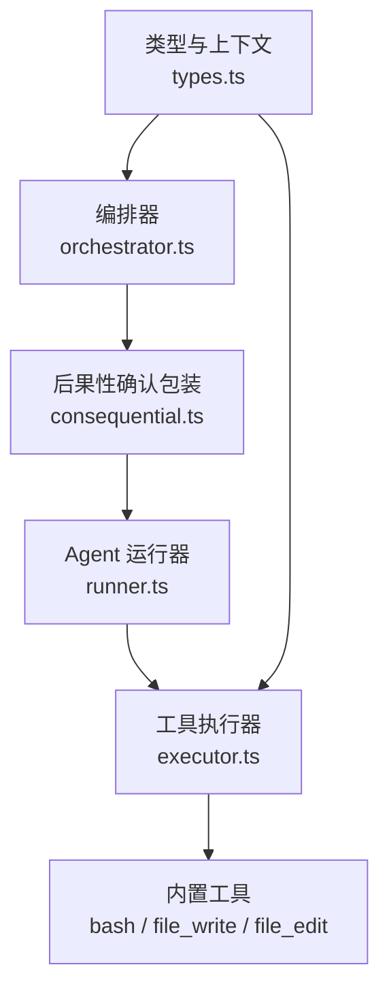
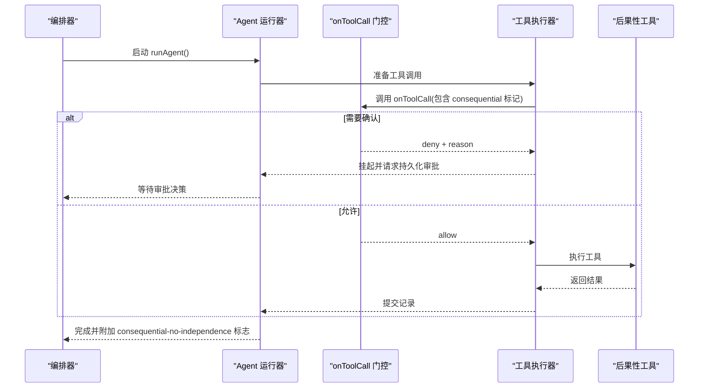
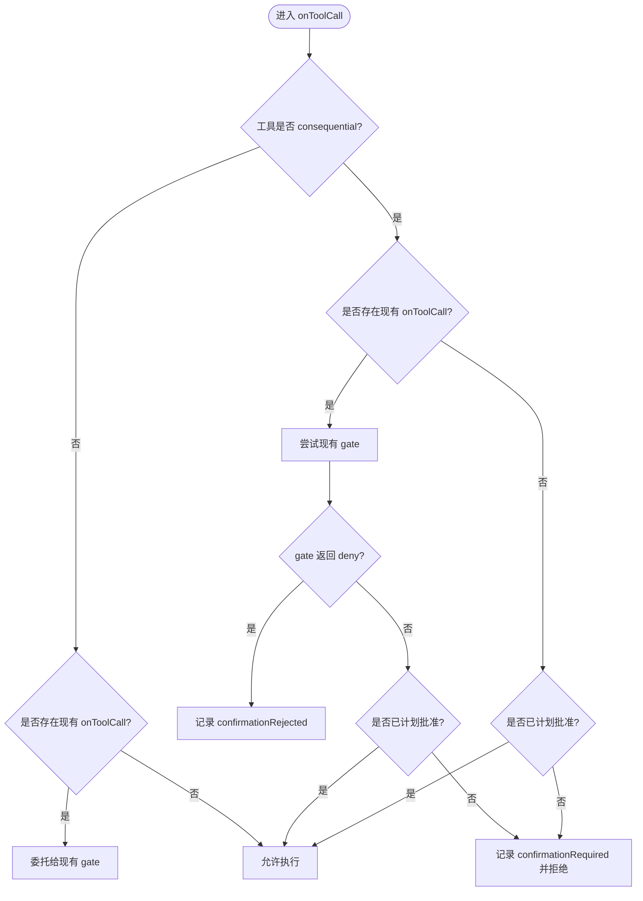
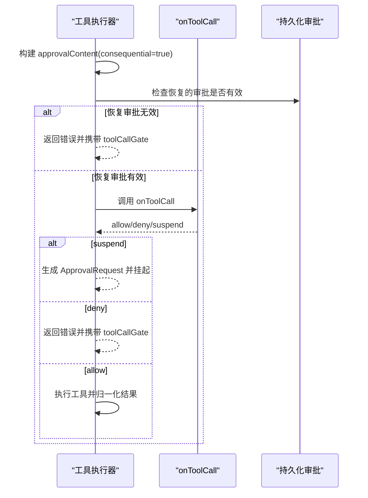
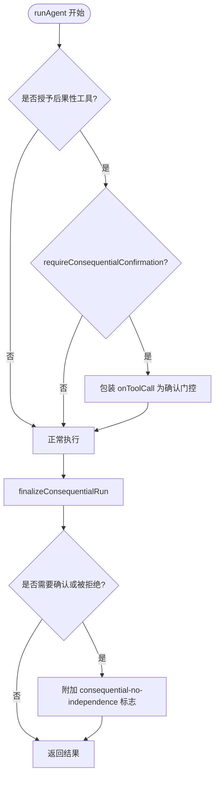
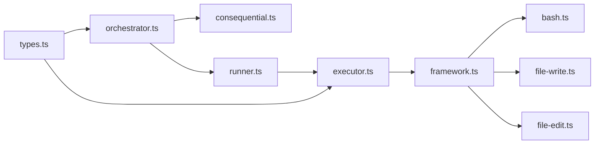

# 后果性工具安全

<cite>
**本文引用的文件**
- [packages/core/src/orchestrator/consequential.ts](file://packages/core/src/orchestrator/consequential.ts)
- [packages/core/src/orchestrator/orchestrator.ts](file://packages/core/src/orchestrator/orchestrator.ts)
- [packages/core/src/tool/executor.ts](file://packages/core/src/tool/executor.ts)
- [packages/core/src/tool/framework.ts](file://packages/core/src/tool/framework.ts)
- [packages/core/src/tool/built-in/bash.ts](file://packages/core/src/tool/built-in/bash.ts)
- [packages/core/src/tool/built-in/file-write.ts](file://packages/core/src/tool/built-in/file-write.ts)
- [packages/core/src/tool/built-in/file-edit.ts](file://packages/core/src/tool/built-in/file-edit.ts)
- [packages/core/src/types.ts](file://packages/core/src/types.ts)
- [packages/core/src/agent/runner.ts](file://packages/core/src/agent/runner.ts)
</cite>

## 目录
1. [简介](#简介)
2. [项目结构](#项目结构)
3. [核心组件](#核心组件)
4. [架构总览](#架构总览)
5. [详细组件分析](#详细组件分析)
6. [依赖关系分析](#依赖关系分析)
7. [性能与可靠性考量](#性能与可靠性考量)
8. [故障排查指南](#故障排查指南)
9. [结论](#结论)
10. [附录：风险评估示例与 Shell 风险分类器使用](#附录：风险评估示例与-shell-风险分类器使用)

## 简介
本文件系统性说明 Open Multi-Agent（OMA）中“后果性工具”的安全机制。后果性工具是指会产生真实副作用的工具，例如 bash、file_write、file_edit。它们会修改系统状态或执行外部命令，因此需要更严格的运行时检查与确认流程。

本文将解释：
- 什么是后果性工具以及 consequences 标记如何影响运行时的安全检查流程
- consequential-no-independence 标志的含义与检测机制
- 在未声明治理意图的运行中如何触发确认流程
- requireConsequentialConfirmation 配置选项与 onToolCall 钩子的组合使用方式
- 如何进行风险评估并识别高风险工具调用（含 shell 风险分类器的使用方法）

## 项目结构
与后果性工具安全相关的代码主要分布在以下模块：
- 编排层：orchestrator 负责在运行前判定是否授予了后果性工具，并在需要时包装 onToolCall 以启用确认门控
- 工具执行层：tool executor 负责在每次工具调用前进行门控、校验、持久化审批与结果归一化
- 工具定义层：built-in 工具通过 defineTool 声明 consequential 元数据，使框架能识别其风险等级
- 类型与上下文：types 提供 AgentConfig、RunOptions、ToolUseContext 等关键类型，贯穿整个流程

图表来源
- [packages/core/src/orchestrator/orchestrator.ts:800-912](file://packages/core/src/orchestrator/orchestrator.ts#L800-L912)
- [packages/core/src/orchestrator/consequential.ts:1-113](file://packages/core/src/orchestrator/consequential.ts#L1-L113)
- [packages/core/src/agent/runner.ts:990-1069](file://packages/core/src/agent/runner.ts#L990-L1069)
- [packages/core/src/tool/executor.ts:200-338](file://packages/core/src/tool/executor.ts#L200-L338)
- [packages/core/src/types.ts:544-572](file://packages/core/src/types.ts#L544-L572)

章节来源
- [packages/core/src/orchestrator/orchestrator.ts:800-912](file://packages/core/src/orchestrator/orchestrator.ts#L800-L912)
- [packages/core/src/orchestrator/consequential.ts:1-113](file://packages/core/src/orchestrator/consequential.ts#L1-L113)
- [packages/core/src/agent/runner.ts:990-1069](file://packages/core/src/agent/runner.ts#L990-L1069)
- [packages/core/src/tool/executor.ts:200-338](file://packages/core/src/tool/executor.ts#L200-L338)
- [packages/core/src/types.ts:544-572](file://packages/core/src/types.ts#L544-L572)

## 核心组件
- 后果性工具定义：内置工具通过 defineTool 声明 consequential 为 true，使框架将其识别为高后果性工具
- 后果性确认包装：withConsequentialConfirmation 将现有 onToolCall 包装为确认门控；当工具被标记为 consequential 且未获得计划批准时，返回拒绝并要求确认
- 工具执行器：在每次调用前构建审批内容、调用 onToolCall、处理 allow/deny/suspend，并将 consequential 信息注入到审批内容中
- 编排器：在 runAgent 中检测是否授予了后果性工具，若配置 requireConsequentialConfirmation 则自动包装确认门控，并在结束时附加 consequential-no-independence 标志
- 类型与上下文：ToolUseContext 提供 cwd、runId、taskId、toolCallId 等上下文，用于沙箱路径解析与幂等键

章节来源
- [packages/core/src/tool/framework.ts:78-104](file://packages/core/src/tool/framework.ts#L78-L104)
- [packages/core/src/tool/built-in/bash.ts:37-79](file://packages/core/src/tool/built-in/bash.ts#L37-L79)
- [packages/core/src/tool/built-in/file-write.ts:18-87](file://packages/core/src/tool/built-in/file-write.ts#L18-L87)
- [packages/core/src/tool/built-in/file-edit.ts:18-118](file://packages/core/src/tool/built-in/file-edit.ts#L18-L118)
- [packages/core/src/orchestrator/consequential.ts:18-76](file://packages/core/src/orchestrator/consequential.ts#L18-L76)
- [packages/core/src/tool/executor.ts:200-338](file://packages/core/src/tool/executor.ts#L200-L338)
- [packages/core/src/orchestrator/orchestrator.ts:800-912](file://packages/core/src/orchestrator/orchestrator.ts#L800-L912)
- [packages/core/src/types.ts:544-572](file://packages/core/src/types.ts#L544-L572)

## 架构总览
下图展示了从编排器到工具执行的完整安全流，包括后果性工具的确认门控与持久化审批：

图表来源
- [packages/core/src/orchestrator/orchestrator.ts:800-912](file://packages/core/src/orchestrator/orchestrator.ts#L800-L912)
- [packages/core/src/orchestrator/consequential.ts:42-76](file://packages/core/src/orchestrator/consequential.ts#L42-L76)
- [packages/core/src/tool/executor.ts:200-338](file://packages/core/src/tool/executor.ts#L200-L338)
- [packages/core/src/agent/runner.ts:990-1069](file://packages/core/src/agent/runner.ts#L990-L1069)

## 详细组件分析

### 后果性工具的定义与标记
- 内置工具通过 defineTool 声明 consequential: true，使框架在运行时可识别其为高后果性工具
- 该标记仅作为元数据输入，不暴露 prompt 或参数文本给确认逻辑，确保决策基于工具类别而非具体参数

章节来源
- [packages/core/src/tool/framework.ts:78-104](file://packages/core/src/tool/framework.ts#L78-L104)
- [packages/core/src/tool/built-in/bash.ts:37-79](file://packages/core/src/tool/built-in/bash.ts#L37-L79)
- [packages/core/src/tool/built-in/file-write.ts:18-87](file://packages/core/src/tool/built-in/file-write.ts#L18-L87)
- [packages/core/src/tool/built-in/file-edit.ts:18-118](file://packages/core/src/tool/built-in/file-edit.ts#L18-L118)

### 后果性确认包装 withConsequentialConfirmation
- 当工具被标记为 consequential 且未获得计划批准时，包装后的 onToolCall 返回 deny，并设置 confirmationRequired
- 如果已存在自定义 onToolCall，异常或显式 deny 会记录 confirmationRejected，以便最终结果标记拒绝原因
- 若已通过 onPlanReady 继承批准，则直接允许执行

图表来源
- [packages/core/src/orchestrator/consequential.ts:42-76](file://packages/core/src/orchestrator/consequential.ts#L42-L76)

章节来源
- [packages/core/src/orchestrator/consequential.ts:18-76](file://packages/core/src/orchestrator/consequential.ts#L18-L76)

### 工具执行器中的后果性处理
- 执行器在调用 onToolCall 之前构建 approvalContent，并注入 consequential 标记
- 支持恢复的持久化审批：若恢复的审批内容与当前不一致，则拒绝执行
- 对 allow/deny/suspend 三种决策分别处理，suspend 会生成待审批请求并挂起执行

图表来源
- [packages/core/src/tool/executor.ts:200-338](file://packages/core/src/tool/executor.ts#L200-L338)

章节来源
- [packages/core/src/tool/executor.ts:200-338](file://packages/core/src/tool/executor.ts#L200-L338)

### 编排器中的后果性确认与标志
- 在 runAgent 中检测是否授予了后果性工具；若配置 requireConsequentialConfirmation，则自动包装确认门控
- 运行结束后，finalizeConsequentialRun 根据确认状态附加 consequential-no-independence 标志，并设置 success/status/confirmationRequired

图表来源
- [packages/core/src/orchestrator/orchestrator.ts:800-912](file://packages/core/src/orchestrator/orchestrator.ts#L800-L912)
- [packages/core/src/orchestrator/consequential.ts:80-113](file://packages/core/src/orchestrator/consequential.ts#L80-L113)

章节来源
- [packages/core/src/orchestrator/orchestrator.ts:800-912](file://packages/core/src/orchestrator/orchestrator.ts#L800-L912)
- [packages/core/src/orchestrator/consequential.ts:80-113](file://packages/core/src/orchestrator/consequential.ts#L80-L113)

### 内置后果性工具的安全特性
- bash：以非交互式 shell 执行命令，限制环境变量白名单，支持超时与中止信号，输出经敏感信息脱敏
- file_write：强制绝对路径并通过 cwd 沙箱解析，自动创建父目录，报告创建或更新行为
- file_edit：精确字符串替换，默认要求唯一匹配以避免误改，支持 replace_all 覆盖

章节来源
- [packages/core/src/tool/built-in/bash.ts:37-241](file://packages/core/src/tool/built-in/bash.ts#L37-L241)
- [packages/core/src/tool/built-in/file-write.ts:18-87](file://packages/core/src/tool/built-in/file-write.ts#L18-L87)
- [packages/core/src/tool/built-in/file-edit.ts:18-118](file://packages/core/src/tool/built-in/file-edit.ts#L18-L118)

## 依赖关系分析
- orchestrator 依赖 consequential 模块来检测与包装确认门控
- runner 在工具执行阶段协调 checkpoint、approval 与结果提交
- executor 依赖 types 提供的上下文与工具定义，并调用 onToolCall 门控
- built-in 工具通过 framework 的 defineTool 注册 consequential 元数据

图表来源
- [packages/core/src/orchestrator/orchestrator.ts:800-912](file://packages/core/src/orchestrator/orchestrator.ts#L800-L912)
- [packages/core/src/orchestrator/consequential.ts:1-113](file://packages/core/src/orchestrator/consequential.ts#L1-L113)
- [packages/core/src/agent/runner.ts:990-1069](file://packages/core/src/agent/runner.ts#L990-L1069)
- [packages/core/src/tool/executor.ts:200-338](file://packages/core/src/tool/executor.ts#L200-L338)
- [packages/core/src/tool/framework.ts:78-104](file://packages/core/src/tool/framework.ts#L78-L104)
- [packages/core/src/types.ts:544-572](file://packages/core/src/types.ts#L544-L572)

章节来源
- [packages/core/src/orchestrator/orchestrator.ts:800-912](file://packages/core/src/orchestrator/orchestrator.ts#L800-L912)
- [packages/core/src/orchestrator/consequential.ts:1-113](file://packages/core/src/orchestrator/consequential.ts#L1-L113)
- [packages/core/src/agent/runner.ts:990-1069](file://packages/core/src/agent/runner.ts#L990-L1069)
- [packages/core/src/tool/executor.ts:200-338](file://packages/core/src/tool/executor.ts#L200-L338)
- [packages/core/src/tool/framework.ts:78-104](file://packages/core/src/tool/framework.ts#L78-L104)
- [packages/core/src/types.ts:544-572](file://packages/core/src/types.ts#L544-L572)

## 性能与可靠性考量
- 工具输出压缩：当模型返回大量工具结果时，运行器会在合适时机进行上下文压缩以减少内存与令牌消耗
- 循环检测：运行器注入警告文本以避免重复响应导致的死循环
- 检查点与恢复：在执行工具前持久化检查点，确保中断后可恢复；挂起的审批请求也会持久化以保证一致性
- 预算控制：token 与成本预算超限会终止运行并标记状态

章节来源
- [packages/core/src/agent/runner.ts:1294-1326](file://packages/core/src/agent/runner.ts#L1294-L1326)
- [packages/core/src/agent/runner.ts:990-1069](file://packages/core/src/agent/runner.ts#L990-L1069)

## 故障排查指南
- 工具被拒绝：检查 onToolCall 是否返回 deny，并查看 reason；若因后果性确认导致，需补充 plan 批准或用户确认
- 持久化审批失效：若恢复的审批内容与当前不一致，执行器会报错；请确保边界与内容一致
- 工具执行异常：查看工具返回的 isError 与 data；对于 bash，注意退出码与输出中的错误信息
- 沙箱路径问题：file_* 工具要求绝对路径且在 cwd 沙箱内；如路径解析失败，调整 cwd 或路径

章节来源
- [packages/core/src/tool/executor.ts:200-338](file://packages/core/src/tool/executor.ts#L200-L338)
- [packages/core/src/tool/built-in/file-write.ts:18-87](file://packages/core/src/tool/built-in/file-write.ts#L18-L87)
- [packages/core/src/tool/built-in/file-edit.ts:18-118](file://packages/core/src/tool/built-in/file-edit.ts#L18-L118)
- [packages/core/src/tool/built-in/bash.ts:37-241](file://packages/core/src/tool/built-in/bash.ts#L37-L241)

## 结论
后果性工具安全通过“工具元数据标记 + 运行时门控 + 持久化审批 + 运行标志”形成闭环：
- 工具定义层面声明 consequential，使框架识别高风险能力
- 编排层在需要时自动包装确认门控，结合 requireConsequentialConfirmation 与 onToolCall
- 执行层在每次调用前进行校验与审批，支持恢复与挂起
- 运行结束附加 consequential-no-independence 标志，便于上层策略判断

这种设计在保证灵活性的同时，提供了明确的安全边界与可审计的执行轨迹。

## 附录：风险评估示例与 Shell 风险分类器使用
- 风险评估要点
  - 工具类别：bash、file_write、file_edit 属于高后果性工具
  - 参数语义：命令内容、写入路径、替换字符串可能带来高风险
  - 上下文：cwd 沙箱、runId/taskId/toolCallId 可用于追踪与幂等
  - 审批路径：plan 批准、用户确认、onToolCall 自定义策略

- Shell 风险分类器使用方法
  - 在 onToolCall 中读取 context.consequential 与 input.command
  - 根据命令关键字（如 rm、chmod、curl、wget、eval、source）与目标路径特征进行分类
  - 对高风险命令返回 deny 或 suspend，并附带 reason
  - 对低风险命令返回 allow，但可记录审计信息

- 示例流程（概念性）
  - 接收工具调用 -> 判断是否为 consequential -> 提取 command -> 规则分类 -> 决策 allow/deny/suspend -> 执行或挂起 -> 记录审计

[本节为概念性指导，不直接分析具体文件]