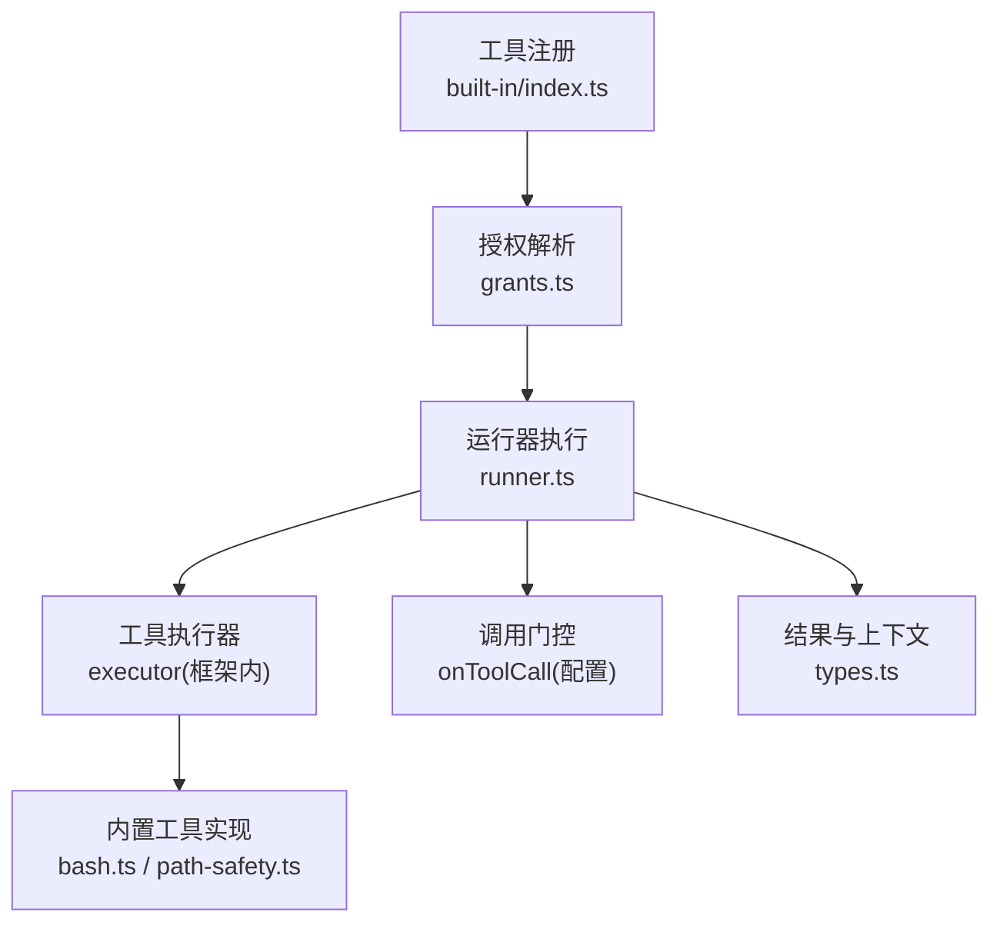
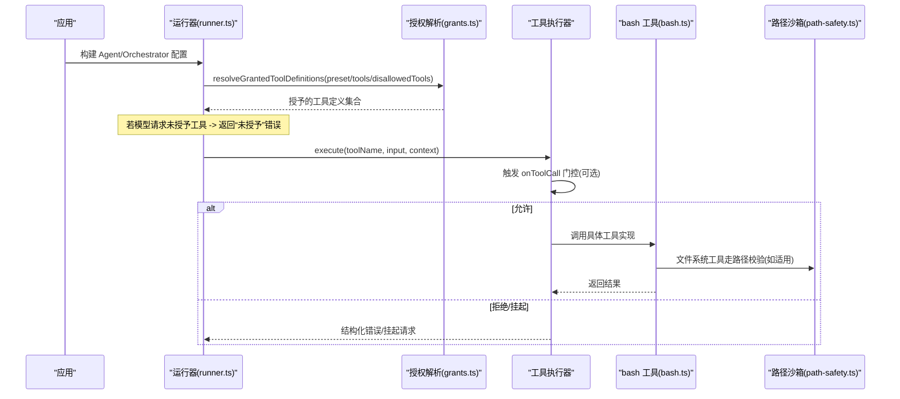
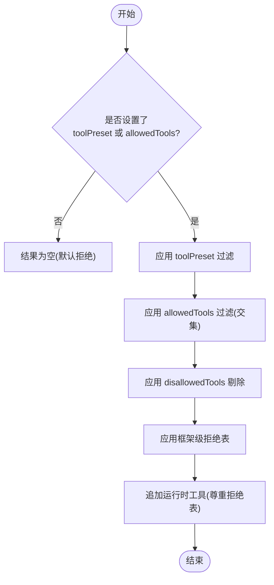
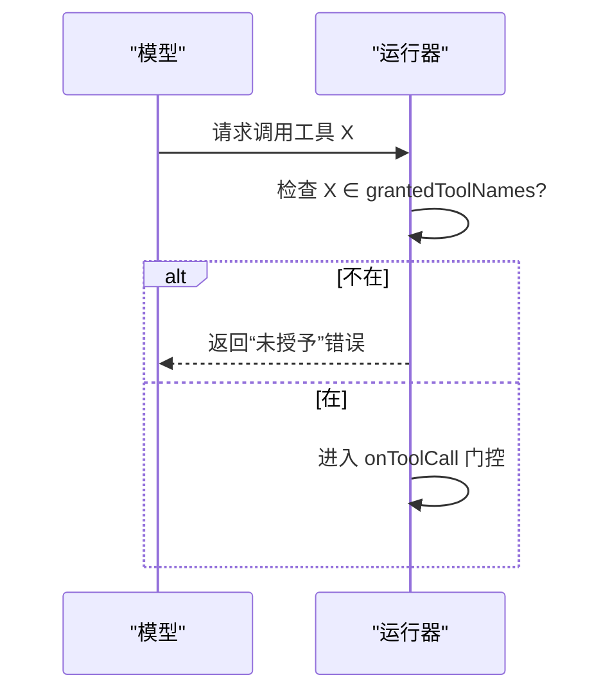
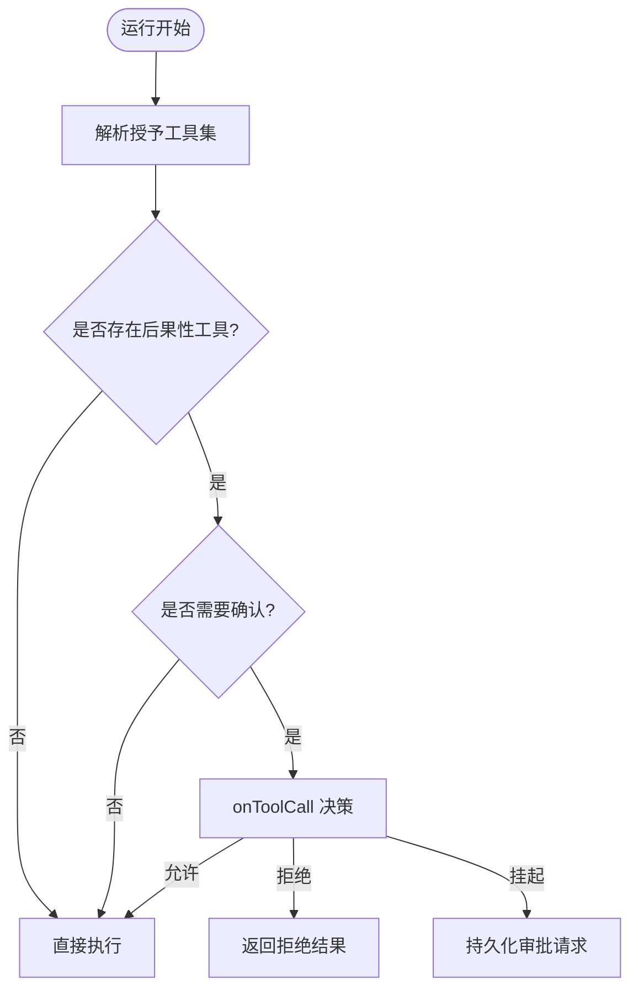
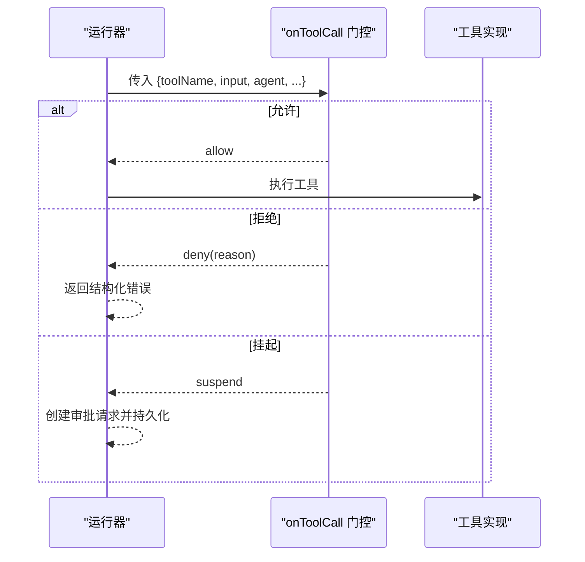
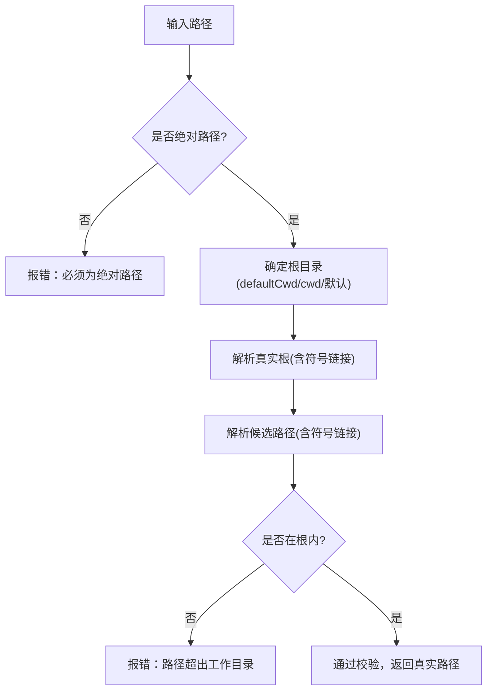
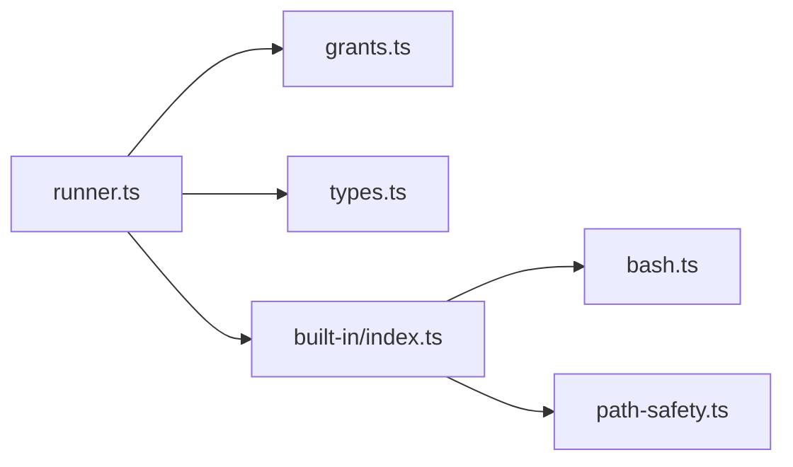

# 工具权限控制

<cite>
**本文引用的文件**
- [packages/core/src/tool/grants.ts](file://packages/core/src/tool/grants.ts)
- [packages/core/src/agent/runner.ts](file://packages/core/src/agent/runner.ts)
- [packages/core/src/types.ts](file://packages/core/src/types.ts)
- [packages/core/src/tool/built-in/index.ts](file://packages/core/src/tool/built-in/index.ts)
- [packages/core/src/tool/built-in/bash.ts](file://packages/core/src/tool/built-in/bash.ts)
- [packages/core/src/tool/built-in/path-safety.ts](file://packages/core/src/tool/built-in/path-safety.ts)
- [docs/tool-configuration.md](file://docs/tool-configuration.md)
</cite>

## 目录
1. [简介](#简介)
2. [项目结构](#项目结构)
3. [核心组件](#核心组件)
4. [架构总览](#架构总览)
5. [详细组件分析](#详细组件分析)
6. [依赖关系分析](#依赖关系分析)
7. [性能与安全考量](#性能与安全考量)
8. [故障排查指南](#故障排查指南)
9. [结论](#结论)
10. [附录：配置示例与最佳实践](#附录：配置示例与最佳实践)

## 简介
本文件系统性介绍 Open Multi-Agent 的工具权限控制机制，围绕“默认拒绝”的安全模型展开，涵盖内置工具的白名单机制、预设配置（toolPreset）、允许列表（tools）与拒绝列表（disallowedTools）的解析顺序与作用域；解释后果性工具（consequential tools）的概念、标记方式与安全影响；说明如何通过 onToolCall 钩子进行细粒度调用级拦截与确认；并给出文件系统沙箱、bash 风险分类与最小权限原则的实践建议。目标是确保智能体仅能访问完成任务所必需的最小工具集，降低误用与越权风险。

## 项目结构
Open Multi-Agent 将工具权限控制拆分为多个层次：
- 工具注册与声明：内置工具集合与自定义/MCP 工具注册入口
- 授权解析：基于 preset/allowlist/denylist 的最终授予集合计算
- 执行期门控：onToolCall 钩子在每次调用前进行策略判断
- 安全边界：文件系统路径沙箱、bash 进程隔离与环境白名单
- 配置与文档：Orchestrator/Agent 配置项与用户文档

图表来源
- [packages/core/src/tool/built-in/index.ts:1-75](file://packages/core/src/tool/built-in/index.ts#L1-L75)
- [packages/core/src/tool/grants.ts:1-90](file://packages/core/src/tool/grants.ts#L1-L90)
- [packages/core/src/agent/runner.ts:902-912](file://packages/core/src/agent/runner.ts#L902-L912)
- [packages/core/src/tool/built-in/bash.ts:1-80](file://packages/core/src/tool/built-in/bash.ts#L1-L80)
- [packages/core/src/tool/built-in/path-safety.ts:1-125](file://packages/core/src/tool/built-in/path-safety.ts#L1-L125)
- [packages/core/src/types.ts:544-570](file://packages/core/src/types.ts#L544-L570)

章节来源
- [packages/core/src/tool/built-in/index.ts:1-75](file://packages/core/src/tool/built-in/index.ts#L1-L75)
- [packages/core/src/tool/grants.ts:1-90](file://packages/core/src/tool/grants.ts#L1-L90)
- [packages/core/src/agent/runner.ts:902-912](file://packages/core/src/agent/runner.ts#L902-L912)
- [packages/core/src/tool/built-in/bash.ts:1-80](file://packages/core/src/tool/built-in/bash.ts#L1-L80)
- [packages/core/src/tool/built-in/path-safety.ts:1-125](file://packages/core/src/tool/built-in/path-safety.ts#L1-L125)
- [packages/core/src/types.ts:544-570](file://packages/core/src/types.ts#L544-L570)

## 核心组件
- 工具预设与白名单
  - 预设：readonly/readwrite/full，分别对应不同能力集合
  - 允许列表：tools（或 allowedTools），用于精确限定可使用的工具名
  - 拒绝列表：disallowedTools，从已授予集中剔除不需要的工具
- 默认拒绝
  - 未显式授予任何内置工具时，智能体获得零个内置工具
  - 即使模型发出对未授予工具的调用，也会返回“未授予”错误
- 后果性工具
  - 通过 ToolDefinition.consequential 标记具有真实副作用的工具
  - bash、file_write、file_edit 等内置工具被标记为后果性
- 调用级门控
  - onToolCall 在输入校验后、工具执行前运行，支持 allow/deny/suspend
  - 可与持久化审批结合，支持跨恢复点决策
- 文件系统沙箱
  - 内置文件系统工具受工作目录限制，路径必须绝对且位于根目录下
  - bash 不受沙箱限制，需配合 disallowedTools 或 onToolCall 管控
- 配置项
  - OrchestratorConfig.defaultToolPreset/defaultCwd/onToolCall/requireConsequentialConfirmation
  - AgentConfig.toolPreset/tools/disallowedTools/cwd/credentials/onToolCall

章节来源
- [packages/core/src/tool/grants.ts:10-26](file://packages/core/src/tool/grants.ts#L10-L26)
- [packages/core/src/agent/runner.ts:1391-1403](file://packages/core/src/agent/runner.ts#L1391-L1403)
- [packages/core/src/tool/built-in/bash.ts:37-45](file://packages/core/src/tool/built-in/bash.ts#L37-L45)
- [packages/core/src/tool/built-in/path-safety.ts:30-97](file://packages/core/src/tool/built-in/path-safety.ts#L30-L97)
- [packages/core/src/types.ts:2236-2274](file://packages/core/src/types.ts#L2236-L2274)
- [docs/tool-configuration.md:214-290](file://docs/tool-configuration.md#L214-L290)

## 架构总览
下图展示从“工具可用”到“实际执行”的关键路径，以及权限过滤与门控点。

图表来源
- [packages/core/src/agent/runner.ts:902-912](file://packages/core/src/agent/runner.ts#L902-L912)
- [packages/core/src/agent/runner.ts:1364-1434](file://packages/core/src/agent/runner.ts#L1364-L1434)
- [packages/core/src/tool/grants.ts:35-89](file://packages/core/src/tool/grants.ts#L35-L89)
- [packages/core/src/tool/built-in/bash.ts:62-78](file://packages/core/src/tool/built-in/bash.ts#L62-L78)
- [packages/core/src/tool/built-in/path-safety.ts:30-97](file://packages/core/src/tool/built-in/path-safety.ts#L30-L97)

## 详细组件分析

### 授权解析：preset → allowlist → denylist
- 解析流程
  - 若无正向授予（未设置 toolPreset 且未设置 allowedTools），则内置工具集为空（默认拒绝）
  - 先按 toolPreset 筛选，再与 tools（allowedTools）取交集，最后剔除 disallowedTools
  - 框架级拒绝表（AGENT_FRAMEWORK_DISALLOWED）作为最终护栏
- 冲突告警
  - 同时设置 toolPreset 与 allowedTools 会输出警告，表示最终为交集
  - 同时出现在允许与拒绝列表的工具会被提示矛盾
- 运行时工具
  - 运行时注入的工具不参与 preset/allowlist 过滤，但仍尊重 disallowedTools

图表来源
- [packages/core/src/tool/grants.ts:35-89](file://packages/core/src/tool/grants.ts#L35-L89)

章节来源
- [packages/core/src/tool/grants.ts:10-26](file://packages/core/src/tool/grants.ts#L10-L26)
- [packages/core/src/tool/grants.ts:35-89](file://packages/core/src/tool/grants.ts#L35-L89)

### 默认拒绝与“未授予”保护
- 行为
  - 未显式授予任何内置工具时，智能体无法调用任何内置工具
  - 即使模型因混淆或提示注入请求了未授予工具，运行器也会返回“未授予”的结构化错误，不会执行
- 设计要点
  - 授予集合由 resolveTools() 生成，作为唯一可信来源
  - 执行阶段再次检查 block.name 是否在 grantedToolNames 中

图表来源
- [packages/core/src/agent/runner.ts:902-912](file://packages/core/src/agent/runner.ts#L902-L912)
- [packages/core/src/agent/runner.ts:1391-1403](file://packages/core/src/agent/runner.ts#L1391-L1403)

章节来源
- [packages/core/src/agent/runner.ts:1391-1403](file://packages/core/src/agent/runner.ts#L1391-L1403)

### 后果性工具与确认机制
- 概念
  - consequential 工具指会产生真实副作用的工具，如修改系统状态、写入文件、执行命令
  - 内置的 bash、file_write、file_edit 被标记为后果性
- 自动标记与标志位
  - 在未声明治理拓扑的 runAgent()/runTeam() 上，若最终授予包含任一后果性工具，结果会携带机器可读标志位，表明存在无独立审查的后果能力
- 确认开关
  - requireConsequentialConfirmation: true 可在未声明治理拓扑的场景下，对后果性调用启用确认流程
  - 可通过 onToolCall 实现人机确认、外部审批或基于规则的拒绝
  - 若既无审批路径也无 onToolCall 决策，工具不会执行，结果携带 confirmationRequired 标志

图表来源
- [docs/tool-configuration.md:140-213](file://docs/tool-configuration.md#L140-L213)
- [packages/core/src/types.ts:2266-2274](file://packages/core/src/types.ts#L2266-L2274)

章节来源
- [docs/tool-configuration.md:140-213](file://docs/tool-configuration.md#L140-L213)
- [packages/core/src/types.ts:2266-2274](file://packages/core/src/types.ts#L2266-L2274)

### 调用级门控：onToolCall
- 作用范围
  - 在 Zod 输入校验之后、工具实现之前执行
  - 针对具体一次调用（含参数）做决策，适合对危险命令进行细粒度拦截
- 决策类型
  - allow：继续执行
  - deny：返回结构化错误结果，模型可据此调整后续行为
  - suspend：挂起调用，结合持久化审批在恢复后继续
- 关键语义
  - 仅在工具已被授予的前提下才会到达门控
  - 可覆盖 orchestrator 级别默认策略，agent 级别 onToolCall 优先级更高
  - 观察性：trace 事件携带 gated/gateAction/gateReason（脱敏）

图表来源
- [docs/tool-configuration.md:326-363](file://docs/tool-configuration.md#L326-L363)
- [packages/core/src/agent/runner.ts:1364-1434](file://packages/core/src/agent/runner.ts#L1364-L1434)

章节来源
- [docs/tool-configuration.md:326-363](file://docs/tool-configuration.md#L326-L363)
- [packages/core/src/agent/runner.ts:1364-1434](file://packages/core/src/agent/runner.ts#L1364-L1434)

### 文件系统沙箱与工作目录
- 规则
  - 内置文件系统工具（file_read/file_write/file_edit/grep/glob）要求绝对路径，且必须解析到工作目录根下
  - 符号链接会在检查前完全解析，防止逃逸
  - 默认根为 <cwd>/.agent-workspace，首次写时自动创建
- 配置
  - defaultCwd：Orchestrator 级默认根
  - cwd：Agent 级覆盖；设为 null 禁用沙箱
- 注意
  - bash 不受此沙箱约束；如需路径级隔离，应禁用 bash 并使用文件系统工具

图表来源
- [packages/core/src/tool/built-in/path-safety.ts:30-97](file://packages/core/src/tool/built-in/path-safety.ts#L30-L97)
- [packages/core/src/tool/built-in/path-safety.ts:99-125](file://packages/core/src/tool/built-in/path-safety.ts#L99-L125)

章节来源
- [packages/core/src/tool/built-in/path-safety.ts:30-97](file://packages/core/src/tool/built-in/path-safety.ts#L30-L97)
- [packages/core/src/tool/built-in/path-safety.ts:99-125](file://packages/core/src/tool/built-in/path-safety.ts#L99-L125)

### bash 工具的风险与防护
- 风险
  - 非沙箱环境，可执行任意 shell 命令
  - 环境变量采用白名单过滤，避免泄露敏感信息
  - 超时与中止信号会终止进程树，避免僵尸进程
- 防护建议
  - 使用 disallowedTools: ['bash'] 或不在 tools 中授予
  - 使用 onToolCall 进行命令级审查（可结合风险分类器）
  - 对高风险命令直接拒绝，对中等风险命令引入人工确认

章节来源
- [packages/core/src/tool/built-in/bash.ts:18-31](file://packages/core/src/tool/built-in/bash.ts#L18-L31)
- [packages/core/src/tool/built-in/bash.ts:62-78](file://packages/core/src/tool/built-in/bash.ts#L62-L78)
- [docs/tool-configuration.md:364-390](file://docs/tool-configuration.md#L364-L390)

## 依赖关系分析
- 模块耦合
  - runner.ts 依赖 grants.ts 完成授予集合解析，并在执行期严格校验
  - built-in/index.ts 提供统一注册入口，便于编排工具集
  - path-safety.ts 为文件系统工具提供路径安全校验
  - types.ts 定义 Orchestrator/Agent 配置项与上下文字段
- 外部依赖
  - 工具实现可能依赖 Node.js 标准库（如 child_process、fs/promises）
  - MCP 工具通过 stdio 连接外部服务，需关注进程隔离与环境变量

图表来源
- [packages/core/src/agent/runner.ts:56-61](file://packages/core/src/agent/runner.ts#L56-L61)
- [packages/core/src/tool/built-in/index.ts:8-18](file://packages/core/src/tool/built-in/index.ts#L8-L18)

章节来源
- [packages/core/src/agent/runner.ts:56-61](file://packages/core/src/agent/runner.ts#L56-L61)
- [packages/core/src/tool/built-in/index.ts:8-18](file://packages/core/src/tool/built-in/index.ts#L8-L18)

## 性能与安全考量
- 性能
  - 授予解析在运行开始时一次性完成，减少重复计算
  - onToolCall 在每次调用时执行，应避免昂贵逻辑；必要时缓存策略
  - 文件系统路径校验涉及 realpath，尽量复用根目录解析结果
- 安全
  - 坚持最小权限：仅授予完成任务所需的最小工具集
  - 对后果性工具启用确认机制，尤其是未声明治理拓扑的自动化场景
  - 谨慎放宽文件系统沙箱；优先使用只读预设或精确 allowlist
  - 对 bash 保持默认拒绝，确有必要时结合 onToolCall 与风险分类器

[本节为通用指导，无需特定文件引用]

## 故障排查指南
- 现象：模型调用了未授予工具
  - 原因：未在 tools/toolPreset 中授予，或未设置 defaultToolPreset
  - 处理：在 AgentConfig 中添加允许列表或预设；或在 Orchestrator 设置 defaultToolPreset
  - 参考路径
    - [packages/core/src/agent/runner.ts:1391-1403](file://packages/core/src/agent/runner.ts#L1391-L1403)
- 现象：文件系统工具报“路径超出工作目录”
  - 原因：路径未解析到默认或配置的根目录下
  - 处理：检查 cwd/defaultCwd 配置；确保使用绝对路径；必要时扩大沙箱或禁用沙箱
  - 参考路径
    - [packages/core/src/tool/built-in/path-safety.ts:30-97](file://packages/core/src/tool/built-in/path-safety.ts#L30-L97)
- 现象：bash 命令被拒绝或挂起
  - 原因：onToolCall 策略拒绝或需要确认
  - 处理：完善 onToolCall 决策逻辑；结合风险分类器；必要时启用持久化审批
  - 参考路径
    - [docs/tool-configuration.md:326-390](file://docs/tool-configuration.md#L326-L390)
- 现象：后果性工具未执行且提示需要确认
  - 原因：未配置 requireConsequentialConfirmation 或 onToolCall 未返回决策
  - 处理：开启确认开关并提供审批路径；或调整策略允许/拒绝
  - 参考路径
    - [packages/core/src/types.ts:2266-2274](file://packages/core/src/types.ts#L2266-L2274)

章节来源
- [packages/core/src/agent/runner.ts:1391-1403](file://packages/core/src/agent/runner.ts#L1391-L1403)
- [packages/core/src/tool/built-in/path-safety.ts:30-97](file://packages/core/src/tool/built-in/path-safety.ts#L30-L97)
- [docs/tool-configuration.md:326-390](file://docs/tool-configuration.md#L326-L390)
- [packages/core/src/types.ts:2266-2274](file://packages/core/src/types.ts#L2266-L2274)

## 结论
Open Multi-Agent 通过“默认拒绝 + 预设/允许/拒绝列表 + 调用级门控 + 文件系统沙箱”的多层机制，实现了精细而稳健的工具权限控制。建议在工程中遵循最小权限原则：
- 明确声明每个 Agent 的工具集，优先使用预设与 allowlist
- 对后果性工具启用确认机制，并结合 onToolCall 进行命令级审查
- 谨慎放宽文件系统沙箱，优先使用只读能力
- 对 bash 保持默认拒绝，确有需要时结合风险分类器与人工确认

[本节为总结性内容，无需特定文件引用]

## 附录：配置示例与最佳实践
- 最小权限示例
  - 仅读取：使用 readonly 预设，不包含 bash
  - 读写编辑：使用 readwrite 预设，排除 bash
  - 完整执行：使用 full 预设，但通过 disallowedTools 移除 bash
- 组合过滤
  - 以 preset 为基础，再用 tools 精确缩小范围，最后用 disallowedTools 剔除不必要能力
- 后果性工具确认
  - 在未声明治理拓扑的场景，开启 requireConsequentialConfirmation，并通过 onToolCall 实现人机确认或规则拒绝
- 文件系统沙箱
  - 默认使用 .agent-workspace；如需访问项目目录，可将 defaultCwd 设置为 process.cwd()；如需完全放开，设置为 null（不推荐）
- 参考路径
  - [docs/tool-configuration.md:214-290](file://docs/tool-configuration.md#L214-L290)
  - [docs/tool-configuration.md:391-441](file://docs/tool-configuration.md#L391-L441)
  - [packages/core/src/tool/grants.ts:10-26](file://packages/core/src/tool/grants.ts#L10-L26)
  - [packages/core/src/types.ts:2236-2274](file://packages/core/src/types.ts#L2236-L2274)

章节来源
- [docs/tool-configuration.md:214-290](file://docs/tool-configuration.md#L214-L290)
- [docs/tool-configuration.md:391-441](file://docs/tool-configuration.md#L391-L441)
- [packages/core/src/tool/grants.ts:10-26](file://packages/core/src/tool/grants.ts#L10-L26)
- [packages/core/src/types.ts:2236-2274](file://packages/core/src/types.ts#L2236-L2274)