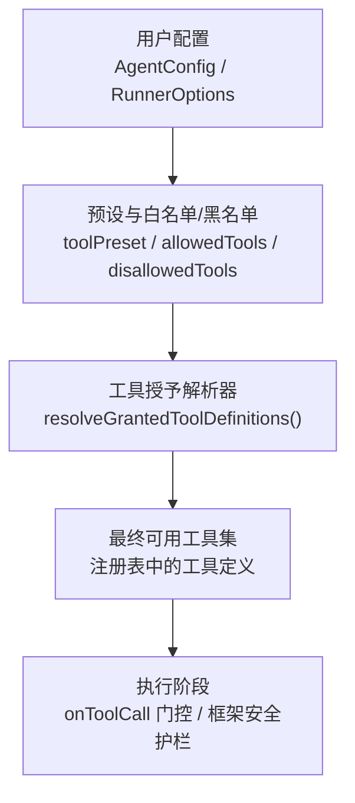
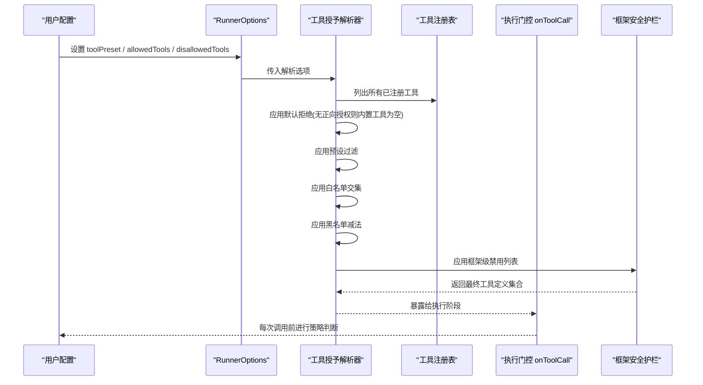
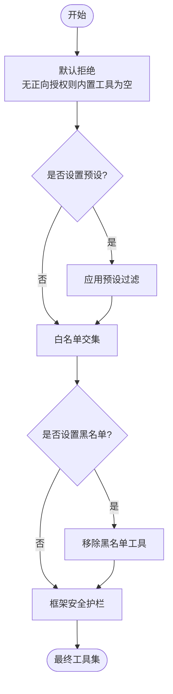
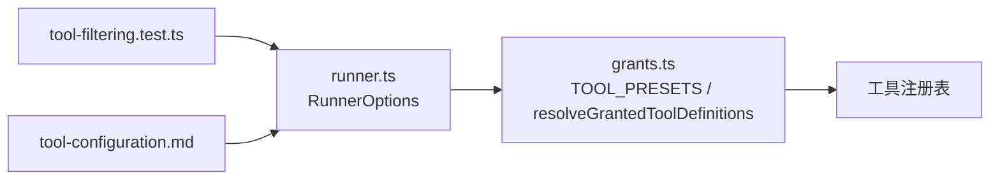

# 工具预设配置

<cite>
**本文引用的文件**
- [docs/tool-configuration.md](file://docs/tool-configuration.md)
- [packages/core/src/tool/grants.ts](file://packages/core/src/tool/grants.ts)
- [packages/core/src/agent/runner.ts](file://packages/core/src/agent/runner.ts)
- [packages/core/tests/tool-filtering.test.ts](file://packages/core/tests/tool-filtering.test.ts)
</cite>

## 目录
1. [简介](#简介)
2. [项目结构](#项目结构)
3. [核心组件](#核心组件)
4. [架构总览](#架构总览)
5. [详细组件分析](#详细组件分析)
6. [依赖关系分析](#依赖关系分析)
7. [性能考量](#性能考量)
8. [故障排查指南](#故障排查指南)
9. [结论](#结论)
10. [附录：实战示例与角色模板](#附录实战示例与角色模板)

## 简介
本章节系统介绍 Open Multi-Agent 的工具预设系统，包括三种内置预设（只读、读写、完整）的工具集合；如何使用 toolPreset 快速配置智能体的工具权限；预设与 allowlist/denylist 的组合方式；以及完整的解析顺序 default-deny → preset → allowlist → denylist → framework safety rails。文末提供基于预设创建不同权限级别智能体角色的实践模板。

## 项目结构
与工具预设相关的核心实现集中在 core 包中：
- 预设定义与解析逻辑位于 tool/grants.ts
- 运行期选项与类型声明位于 agent/runner.ts
- 行为验证与用例覆盖位于 tests/tool-filtering.test.ts
- 面向用户的文档说明位于 docs/tool-configuration.md

图表来源
- [packages/core/src/tool/grants.ts:10-89](file://packages/core/src/tool/grants.ts#L10-L89)
- [packages/core/src/agent/runner.ts:138-147](file://packages/core/src/agent/runner.ts#L138-L147)

章节来源
- [docs/tool-configuration.md:214-289](file://docs/tool-configuration.md#L214-L289)
- [packages/core/src/tool/grants.ts:10-89](file://packages/core/src/tool/grants.ts#L10-L89)
- [packages/core/src/agent/runner.ts:138-147](file://packages/core/src/agent/runner.ts#L138-L147)

## 核心组件
- 预设常量 TOOL_PRESETS：集中定义 readonly、readwrite、full 三类内置工具集合
- 解析函数 resolveGrantedToolDefinitions：按默认拒绝 → 预设 → 白名单 → 黑名单 → 框架安全护栏的顺序计算最终可调用工具
- 运行期选项 RunnerOptions：暴露 toolPreset、allowedTools、disallowedTools 等字段以驱动解析
- 测试用例 tool-filtering.test.ts：验证预设、白名单、黑名单及组合行为的正确性

章节来源
- [packages/core/src/tool/grants.ts:10-89](file://packages/core/src/tool/grants.ts#L10-L89)
- [packages/core/src/agent/runner.ts:138-147](file://packages/core/src/agent/runner.ts#L138-L147)
- [packages/core/tests/tool-filtering.test.ts:97-108](file://packages/core/tests/tool-filtering.test.ts#L97-L108)

## 架构总览
下图展示从配置到最终工具集的解析流程，以及运行时门控与安全护栏的介入点。

图表来源
- [packages/core/src/tool/grants.ts:33-89](file://packages/core/src/tool/grants.ts#L33-L89)
- [packages/core/src/agent/runner.ts:138-147](file://packages/core/src/agent/runner.ts#L138-L147)

## 详细组件分析

### 内置预设与工具集合
- 只读（readonly）：包含文件读取、文本搜索与路径匹配类能力，适合“只读分析器”
- 读写（readwrite）：在只读基础上增加文件写入与编辑能力，适合“代码编辑器”
- 完整（full）：在读写基础上开放 shell 执行能力，适合“完全执行器”

这些集合由预设常量集中维护，确保一致性与可维护性。

章节来源
- [packages/core/src/tool/grants.ts:10-15](file://packages/core/src/tool/grants.ts#L10-L15)
- [packages/core/tests/tool-filtering.test.ts:97-108](file://packages/core/tests/tool-filtering.test.ts#L97-L108)

### 解析顺序（Resolution Order）
解析顺序严格遵循：
1) 默认拒绝（default-deny）：未显式授予任何内置工具时，内置工具集合为空
2) 预设（preset）：若设置 toolPreset，则以预设为起点
3) 白名单（allowlist）：与预设结果取交集
4) 黑名单（denylist）：从当前集合中移除指定工具
5) 框架安全护栏（framework safety rails）：应用框架级禁用列表

注意：自定义/运行时工具不受“默认拒绝”限制（注册即授予），但仍受黑名单约束。

图表来源
- [packages/core/src/tool/grants.ts:33-89](file://packages/core/src/tool/grants.ts#L33-L89)
- [docs/tool-configuration.md:214-289](file://docs/tool-configuration.md#L214-L289)

章节来源
- [packages/core/src/tool/grants.ts:33-89](file://packages/core/src/tool/grants.ts#L33-L89)
- [docs/tool-configuration.md:214-289](file://docs/tool-configuration.md#L214-L289)

### 预设与 allowlist/denylist 的组合使用
- 预设作为“基线”，白名单用于进一步收紧范围（交集），黑名单用于剔除敏感或危险能力（减法）
- 当同时设置预设与白名单时，会输出警告提示，但最终仍按交集生效
- 黑名单对自定义/运行时工具同样有效

章节来源
- [packages/core/src/tool/grants.ts:41-57](file://packages/core/src/tool/grants.ts#L41-L57)
- [packages/core/tests/tool-filtering.test.ts:263-295](file://packages/core/tests/tool-filtering.test.ts#L263-L295)

### 运行时门控与框架安全护栏
- 名称级授权（预设/白名单/黑名单）决定“哪些工具可达”
- 每次调用前的 onToolCall 门控决定“本次调用是否允许”，可基于参数做细粒度决策
- 框架安全护栏（AGENT_FRAMEWORK_DISALLOWED）用于保留未来扩展空间，当前为空

章节来源
- [docs/tool-configuration.md:326-363](file://docs/tool-configuration.md#L326-L363)
- [packages/core/src/tool/grants.ts:17-20](file://packages/core/src/tool/grants.ts#L17-L20)

## 依赖关系分析
- runner.ts 通过导入 grants.ts 的 TOOL_PRESETS 与 resolveGrantedToolDefinitions，将配置转化为最终工具集
- 测试文件验证了预设、白名单、黑名单及其组合的正确性
- 文档提供了用户侧的使用说明与最佳实践

图表来源
- [packages/core/src/agent/runner.ts:56-60](file://packages/core/src/agent/runner.ts#L56-L60)
- [packages/core/src/tool/grants.ts:10-89](file://packages/core/src/tool/grants.ts#L10-L89)
- [packages/core/tests/tool-filtering.test.ts:1-10](file://packages/core/tests/tool-filtering.test.ts#L1-L10)

章节来源
- [packages/core/src/agent/runner.ts:56-60](file://packages/core/src/agent/runner.ts#L56-L60)
- [packages/core/src/tool/grants.ts:10-89](file://packages/core/src/tool/grants.ts#L10-L89)
- [packages/core/tests/tool-filtering.test.ts:1-10](file://packages/core/tests/tool-filtering.test.ts#L1-L10)

## 性能考量
- 预设与白/黑名单均为集合操作，时间复杂度与工具数量线性相关，开销极低
- 建议避免过度细分导致配置复杂化；优先使用预设作为基线，再用白/黑名单微调
- 谨慎授予 bash 等高风险工具，减少不必要的副作用与审计成本

[本节为通用指导，不直接分析具体文件]

## 故障排查指南
- 同时设置 toolPreset 与 allowedTools：会输出警告，最终以交集为准
- 工具同时出现在白名单与黑名单：会输出冲突警告，需修正配置
- 仅设置黑名单但未设置预设或白名单：不会授予任何内置工具（默认拒绝）
- 模型调用了未授予的工具：执行器会返回“未授予”错误，而非执行

章节来源
- [packages/core/src/tool/grants.ts:41-57](file://packages/core/src/tool/grants.ts#L41-L57)
- [packages/core/tests/tool-filtering.test.ts:336-386](file://packages/core/tests/tool-filtering.test.ts#L336-L386)
- [docs/tool-configuration.md:214-238](file://docs/tool-configuration.md#L214-L238)

## 结论
Open Multi-Agent 的工具预设系统通过“默认拒绝 + 预设基线 + 白/黑名单精细控制 + 框架安全护栏”的分层机制，既保证了安全性，又提供了灵活易用的权限配置方式。借助 toolPreset，可以快速构建只读分析器、代码编辑器、完全执行器等不同权限级别的智能体角色，并通过 onToolCall 门控实现更细粒度的调用审批。

[本节为总结性内容，不直接分析具体文件]

## 附录：实战示例与角色模板
以下示例展示如何基于预设创建不同权限级别的智能体角色。为避免泄露实现细节，此处仅提供配置思路与对应源码位置参考。

- 只读分析器（readonly）
  - 目标：仅能读取文件、搜索文本、列举路径
  - 配置要点：设置 toolPreset 为 readonly
  - 参考路径：[docs/tool-configuration.md:251-273](file://docs/tool-configuration.md#L251-L273)

- 代码编辑器（readwrite）
  - 目标：在只读基础上支持写入与编辑文件
  - 配置要点：设置 toolPreset 为 readwrite；如需进一步收紧，可叠加 allowedTools/disallowedTools
  - 参考路径：[docs/tool-configuration.md:251-289](file://docs/tool-configuration.md#L251-L289)

- 完全执行器（full）
  - 目标：在读写基础上开放 shell 执行能力
  - 配置要点：设置 toolPreset 为 full；结合 onToolCall 门控对高风险命令进行审批
  - 参考路径：[docs/tool-configuration.md:251-289](file://docs/tool-configuration.md#L251-L289)

- 组合示例（预设 + 白名单 + 黑名单）
  - 目标：以 readwrite 为基线，仅保留部分能力并剔除敏感工具
  - 配置要点：toolPreset 设为 readwrite；allowedTools 指定保留项；disallowedTools 剔除危险项
  - 参考路径：[docs/tool-configuration.md:275-289](file://docs/tool-configuration.md#L275-L289)

- 默认预设（defaultToolPreset）
  - 目标：为未显式配置 tools/toolPreset 的智能体提供统一默认权限
  - 配置要点：在编排器层面设置 defaultToolPreset，便于全局治理
  - 参考路径：[docs/tool-configuration.md:239-249](file://docs/tool-configuration.md#L239-L249)

- 解析顺序与行为验证
  - 目标：确认默认拒绝、预设、白/黑名单与框架护栏的生效顺序
  - 参考路径：[packages/core/tests/tool-filtering.test.ts:111-295](file://packages/core/tests/tool-filtering.test.ts#L111-L295)

章节来源
- [docs/tool-configuration.md:239-289](file://docs/tool-configuration.md#L239-L289)
- [packages/core/tests/tool-filtering.test.ts:111-295](file://packages/core/tests/tool-filtering.test.ts#L111-L295)