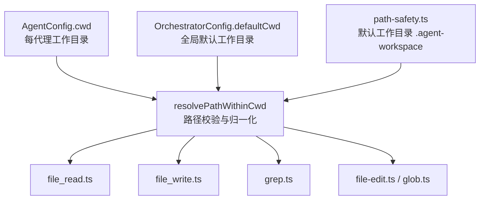
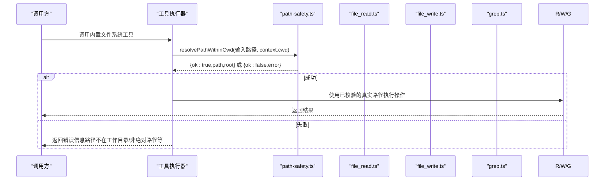
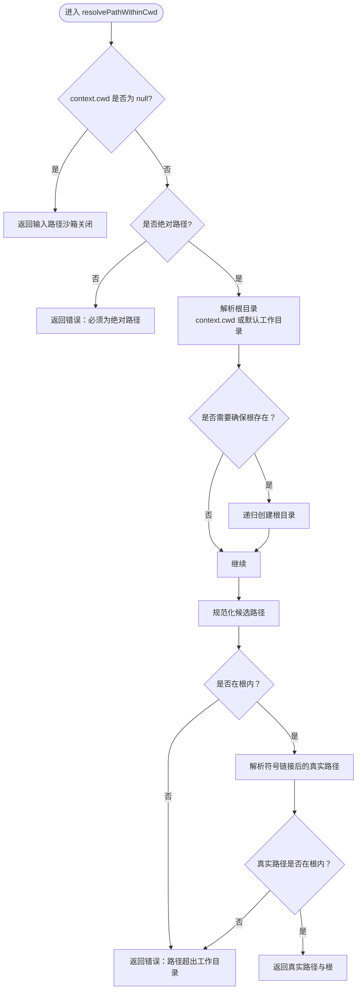
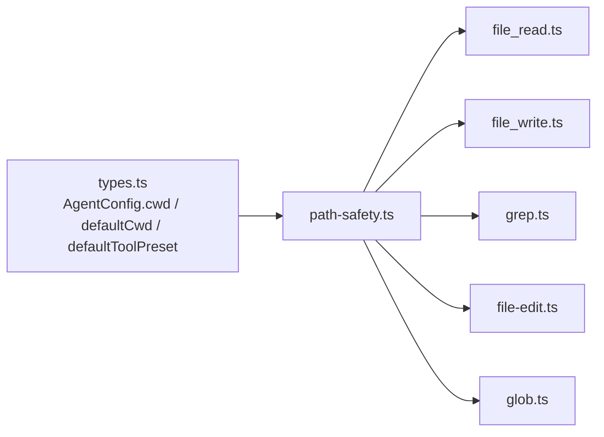

# 文件系统沙箱

<cite>
**本文引用的文件**
- [packages/core/src/tool/built-in/path-safety.ts](file://packages/core/src/tool/built-in/path-safety.ts)
- [packages/core/src/tool/built-in/file-read.ts](file://packages/core/src/tool/built-in/file-read.ts)
- [packages/core/src/tool/built-in/file-write.ts](file://packages/core/src/tool/built-in/file-write.ts)
- [packages/core/src/tool/built-in/grep.ts](file://packages/core/src/tool/built-in/grep.ts)
- [packages/core/src/types.ts](file://packages/core/src/types.ts)
</cite>

## 目录
1. [简介](#简介)
2. [项目结构](#项目结构)
3. [核心组件](#核心组件)
4. [架构总览](#架构总览)
5. [详细组件分析](#详细组件分析)
6. [依赖关系分析](#依赖关系分析)
7. [性能考量](#性能考量)
8. [故障排查指南](#故障排查指南)
9. [结论](#结论)
10. [附录：配置示例与策略选择](#附录配置示例与策略选择)

## 简介
本文件详细说明 Open Multi-Agent 的文件系统沙箱机制，覆盖内置文件系统工具（file_read、file_write、file_edit、grep、glob）的工作目录限制、路径验证与符号链接处理；解释三种典型沙箱配置（默认子目录、宽泛工作目录、无限制）；阐明 defaultCwd 与 AgentConfig.cwd 的优先级与解析顺序；说明自动创建机制与权限控制；强调 bash 工具不受沙箱保护的安全风险，并给出在需要严格路径隔离时禁用 bash 的实践建议。

## 项目结构
与文件系统沙箱直接相关的实现集中在 core 包的内置工具中：
- 路径安全与默认工作目录：path-safety.ts
- 读/写/编辑与搜索类工具：file-read.ts、file-write.ts、grep.ts（以及同目录下的 file-edit.ts、glob.ts、fs-walk.ts）
- 配置类型与优先级：types.ts（AgentConfig.cwd、OrchestratorConfig.defaultCwd、defaultToolPreset 等）

图表来源
- [packages/core/src/tool/built-in/path-safety.ts:1-125](file://packages/core/src/tool/built-in/path-safety.ts#L1-L125)
- [packages/core/src/tool/built-in/file-read.ts:1-112](file://packages/core/src/tool/built-in/file-read.ts#L1-L112)
- [packages/core/src/tool/built-in/file-write.ts:1-89](file://packages/core/src/tool/built-in/file-write.ts#L1-L89)
- [packages/core/src/tool/built-in/grep.ts:1-292](file://packages/core/src/tool/built-in/grep.ts#L1-L292)
- [packages/core/src/types.ts:544-557](file://packages/core/src/types.ts#L544-L557)
- [packages/core/src/types.ts:2244-2252](file://packages/core/src/types.ts#L2244-L2252)

章节来源
- [packages/core/src/tool/built-in/path-safety.ts:1-125](file://packages/core/src/tool/built-in/path-safety.ts#L1-L125)
- [packages/core/src/types.ts:544-557](file://packages/core/src/types.ts#L544-L557)
- [packages/core/src/types.ts:2244-2252](file://packages/core/src/types.ts#L2244-L2252)

## 核心组件
- 路径安全模块 path-safety.ts
  - 提供默认工作目录名与计算函数，确保默认沙箱为进程当前工作目录下的 .agent-workspace 子目录。
  - 提供 resolvePathWithinCwd，负责：
    - 当 context.cwd 为 null 时，关闭沙箱，原样返回输入路径。
    - 强制要求绝对路径，拒绝相对路径。
    - 解析根目录（优先使用 context.cwd，否则回退到默认工作目录），必要时递归创建根目录（仅写入场景）。
    - 将候选路径与真实路径均限制在根目录下，防止通过 .. 或符号链接逃逸。
    - 对不存在的路径，解析最长存在前缀再拼接后缀，以支持新建文件。
- 内置文件系统工具
  - file_read.ts：读取文件内容并按行号输出，支持 offset/limit 分页。
  - file_write.ts：创建或覆盖文件，自动创建父目录，报告创建/更新状态。
  - grep.ts：优先使用 ripgrep 进行正则搜索，回退到 Node.js 递归实现；结果限制条数。
  - file-edit.ts、glob.ts：同样基于 path-safety.ts 的路径校验，遵循相同沙箱规则。

章节来源
- [packages/core/src/tool/built-in/path-safety.ts:1-125](file://packages/core/src/tool/built-in/path-safety.ts#L1-L125)
- [packages/core/src/tool/built-in/file-read.ts:1-112](file://packages/core/src/tool/built-in/file-read.ts#L1-L112)
- [packages/core/src/tool/built-in/file-write.ts:1-89](file://packages/core/src/tool/built-in/file-write.ts#L1-L89)
- [packages/core/src/tool/built-in/grep.ts:1-292](file://packages/core/src/tool/built-in/grep.ts#L1-L292)

## 架构总览
下图展示从配置到工具执行的完整调用链，突出沙箱路径校验的关键节点。

图表来源
- [packages/core/src/tool/built-in/path-safety.ts:30-97](file://packages/core/src/tool/built-in/path-safety.ts#L30-L97)
- [packages/core/src/tool/built-in/file-read.ts:47-51](file://packages/core/src/tool/built-in/file-read.ts#L47-L51)
- [packages/core/src/tool/built-in/file-write.ts:37-41](file://packages/core/src/tool/built-in/file-write.ts#L37-L41)
- [packages/core/src/tool/built-in/grep.ts:69-74](file://packages/core/src/tool/built-in/grep.ts#L69-L74)

## 详细组件分析

### 路径安全与默认工作目录（path-safety.ts）
- 默认工作目录
  - 默认名称为 .agent-workspace，位于进程当前工作目录下，避免新配置的代理默认访问用户项目源码、.env 或 .git。
  - 可通过 OrchestratorConfig.defaultCwd 或 AgentConfig.cwd 覆盖。
- 路径校验流程
  - 若 context.cwd 为 null，则关闭沙箱，允许任意路径。
  - 必须为绝对路径，否则立即报错。
  - 解析根目录：优先 context.cwd，否则默认工作目录；必要时递归创建（写入场景）。
  - 校验候选路径是否在根内，并对不存在路径做“最长存在前缀”解析。
  - 通过 realpath 解析符号链接，确保最终路径仍在根内，防止 TOCTOU 漏洞。
- 错误提示
  - 明确告知路径超出工作目录，并提供如何放宽或关闭沙箱的指引。

图表来源
- [packages/core/src/tool/built-in/path-safety.ts:30-97](file://packages/core/src/tool/built-in/path-safety.ts#L30-L97)
- [packages/core/src/tool/built-in/path-safety.ts:99-123](file://packages/core/src/tool/built-in/path-safety.ts#L99-L123)

章节来源
- [packages/core/src/tool/built-in/path-safety.ts:1-125](file://packages/core/src/tool/built-in/path-safety.ts#L1-L125)

### 读工具（file_read.ts）
- 功能要点
  - 读取文件并以“行号\t内容”形式返回，支持 offset/limit 分段读取大文件。
  - 所有路径先经 resolvePathWithinCwd 校验。
- 沙箱行为
  - 只读操作不会自动创建默认工作目录；若根目录不存在会返回错误。
  - 路径必须在沙箱根内，且符号链接目标也需在根内。

章节来源
- [packages/core/src/tool/built-in/file-read.ts:1-112](file://packages/core/src/tool/built-in/file-read.ts#L1-L112)
- [packages/core/src/tool/built-in/path-safety.ts:30-97](file://packages/core/src/tool/built-in/path-safety.ts#L30-L97)

### 写工具（file_write.ts）
- 功能要点
  - 创建或覆盖文件，自动创建父目录；报告创建/更新及字节/行数统计。
  - 所有路径先经 resolvePathWithinCwd 校验，并开启 ensureRoot 以自动创建默认工作目录。
- 沙箱行为
  - 首次写入会自动创建 .agent-workspace（如未存在）。
  - 路径与符号链接目标均需落在沙箱根内。

章节来源
- [packages/core/src/tool/built-in/file-write.ts:1-89](file://packages/core/src/tool/built-in/file-write.ts#L1-L89)
- [packages/core/src/tool/built-in/path-safety.ts:30-97](file://packages/core/src/tool/built-in/path-safety.ts#L30-L97)

### 搜索工具（grep.ts）
- 功能要点
  - 优先使用 ripgrep 提升性能，回退到 Node.js 递归实现。
  - 支持 glob 过滤、最大结果数限制、按行号输出匹配。
  - 搜索起点可指定文件或目录；默认使用工具工作目录或上下文 cwd。
- 沙箱行为
  - 搜索路径需经 resolvePathWithinCwd 校验，确保不越界。
  - 使用 ripgrep 时，以沙箱根作为子进程的 cwd，进一步降低越权风险。

章节来源
- [packages/core/src/tool/built-in/grep.ts:1-292](file://packages/core/src/tool/built-in/grep.ts#L1-L292)
- [packages/core/src/tool/built-in/path-safety.ts:30-97](file://packages/core/src/tool/built-in/path-safety.ts#L30-L97)

### 其他内置文件系统工具（file-edit.ts、glob.ts）
- 与上述工具一致，均通过 path-safety.ts 进行路径校验，遵循相同的沙箱规则与工作目录限制。

章节来源
- [packages/core/src/tool/built-in/path-safety.ts:1-125](file://packages/core/src/tool/built-in/path-safety.ts#L1-L125)

## 依赖关系分析
- 工具层依赖
  - file_read.ts、file_write.ts、grep.ts、file-edit.ts、glob.ts 均依赖 path-safety.ts 提供的路径校验能力。
- 配置层依赖
  - AgentConfig.cwd 决定单个代理的沙箱根。
  - OrchestratorConfig.defaultCwd 为未设置 AgentConfig.cwd 时的全局默认值。
  - defaultToolPreset 可用于一次性授予全部内置工具（包括不受沙箱保护的 bash），需谨慎使用。

图表来源
- [packages/core/src/types.ts:544-557](file://packages/core/src/types.ts#L544-L557)
- [packages/core/src/types.ts:2244-2252](file://packages/core/src/types.ts#L2244-L2252)
- [packages/core/src/tool/built-in/path-safety.ts:1-125](file://packages/core/src/tool/built-in/path-safety.ts#L1-L125)

章节来源
- [packages/core/src/types.ts:544-557](file://packages/core/src/types.ts#L544-L557)
- [packages/core/src/types.ts:2244-2252](file://packages/core/src/types.ts#L2244-L2252)
- [packages/core/src/tool/built-in/path-safety.ts:1-125](file://packages/core/src/tool/built-in/path-safety.ts#L1-L125)

## 性能考量
- grep 工具优先使用 ripgrep，显著提升大规模代码库搜索性能；不可用时回退到 Node.js 实现。
- 搜索限制 maxResults 避免响应过大。
- 读写操作仅在必要时创建目录（写入时），减少不必要的 I/O。
- 符号链接解析在最外层完成，避免后续多次重复解析。

[本节为通用性能讨论，无需特定文件引用]

## 故障排查指南
- 常见错误与原因
  - 路径不是绝对路径：内置文件系统工具要求绝对路径。
  - 路径超出工作目录：通过 .. 或符号链接逃逸将被拒绝。
  - 默认工作目录不存在：只读工具在未启用 ensureRoot 时会报错；写入工具会自动创建。
- 定位方法
  - 检查 AgentConfig.cwd 与 OrchestratorConfig.defaultCwd 的设置。
  - 确认工具调用传入的是绝对路径。
  - 查看错误消息中的“工作目录”提示，据此调整沙箱范围或关闭沙箱。
- 恢复步骤
  - 如需访问项目根目录，可将 defaultCwd 设置为 process.cwd()。
  - 如需完全放开，可将 AgentConfig.cwd 设置为 null（谨慎评估安全风险）。

章节来源
- [packages/core/src/tool/built-in/path-safety.ts:30-97](file://packages/core/src/tool/built-in/path-safety.ts#L30-L97)
- [packages/core/src/tool/built-in/path-safety.ts:99-123](file://packages/core/src/tool/built-in/path-safety.ts#L99-L123)

## 结论
Open Multi-Agent 的文件系统沙箱通过统一的路径校验模块，为内置文件系统工具提供一致的安全边界。默认情况下，代理被限制在 .agent-workspace 子目录内，既便于隔离又易于扩展。通过合理配置 defaultCwd 与 AgentConfig.cwd，可在安全性与便利性之间取得平衡。务必注意 bash 工具不受沙箱保护，严格路径隔离时应禁用该工具。

[本节为总结性内容，无需特定文件引用]

## 附录：配置示例与策略选择

### 三种典型沙箱配置
- 默认配置（推荐）
  - 不设置 AgentConfig.cwd，也不设置 OrchestratorConfig.defaultCwd。
  - 效果：沙箱根为 <process.cwd()>/.agent-workspace，首次写入时自动创建。
  - 适用：大多数场景，最小权限原则，避免误改项目源码或敏感文件。
- 宽泛配置
  - 设置 OrchestratorConfig.defaultCwd 为 process.cwd()。
  - 效果：沙箱根为整个工作目录，仍受绝对路径与符号链接校验保护。
  - 适用：需要在项目范围内自由读写，但仍希望保持一定隔离。
- 无限制配置
  - 设置 AgentConfig.cwd 为 null。
  - 效果：关闭沙箱，工具接受任意路径。
  - 适用：可信环境或调试用途；生产环境慎用。

章节来源
- [packages/core/src/types.ts:544-557](file://packages/core/src/types.ts#L544-L557)
- [packages/core/src/types.ts:2244-2252](file://packages/core/src/types.ts#L2244-L2252)
- [packages/core/src/tool/built-in/path-safety.ts:1-24](file://packages/core/src/tool/built-in/path-safety.ts#L1-L24)

### 配置优先级与解析顺序
- 优先级
  - AgentConfig.cwd 优先于 OrchestratorConfig.defaultCwd。
  - 若两者均未设置，则回退到默认工作目录 .agent-workspace。
- 解析顺序
  - 工具调用时，首先读取 context.cwd（来自 AgentConfig.cwd）。
  - 若为空，则使用 OrchestratorConfig.defaultCwd。
  - 若仍为空，则使用默认工作目录。
  - 若 context.cwd 显式为 null，则关闭沙箱。

章节来源
- [packages/core/src/types.ts:544-557](file://packages/core/src/types.ts#L544-L557)
- [packages/core/src/types.ts:2244-2252](file://packages/core/src/types.ts#L2244-L2252)
- [packages/core/src/tool/built-in/path-safety.ts:30-50](file://packages/core/src/tool/built-in/path-safety.ts#L30-L50)

### 自动创建机制与权限控制
- 自动创建
  - 写入工具在首次写入时会自动创建默认工作目录（.agent-workspace）。
  - 只读工具不会自动创建，缺失时将返回错误。
- 权限控制
  - 所有内置文件系统工具均要求绝对路径。
  - 路径与符号链接目标均须位于沙箱根内。
  - 通过 defaultToolPreset 可一键授予全部内置工具（包括不受沙箱保护的 bash），请谨慎使用。

章节来源
- [packages/core/src/tool/built-in/path-safety.ts:50-77](file://packages/core/src/tool/built-in/path-safety.ts#L50-L77)
- [packages/core/src/types.ts:2233-2252](file://packages/core/src/types.ts#L2233-L2252)

### 重要安全警告：bash 工具不受沙箱保护
- 风险说明
  - 内置 bash 工具不受文件系统沙箱保护，可直接访问宿主文件系统。
  - 若使用 defaultToolPreset 为 'full'，将一次性授予所有内置工具（包含 bash）。
- 建议做法
  - 在需要严格路径隔离的场景，显式禁用 bash 工具，仅授予必要的文件系统工具。
  - 避免在生产环境中对不受信任的代理授予 bash。
  - 若确需执行命令，请在受限容器或独立进程中运行，并配合严格的资源与网络限制。

章节来源
- [packages/core/src/types.ts:2233-2252](file://packages/core/src/types.ts#L2233-L2252)

### 实际配置示例（概念性描述）
- 示例一：默认隔离
  - 不设置任何 cwd 相关字段，让系统使用 .agent-workspace 作为沙箱根。
  - 适合：日常开发任务，最小权限原则。
- 示例二：项目级沙箱
  - 设置 OrchestratorConfig.defaultCwd 为 process.cwd()。
  - 适合：需要在整个项目中读写，但仍希望保留路径校验。
- 示例三：临时调试
  - 设置 AgentConfig.cwd 为 null，关闭沙箱。
  - 适合：本地调试或可信环境；不建议用于生产。

[本节为概念性示例，不直接引用具体代码片段]