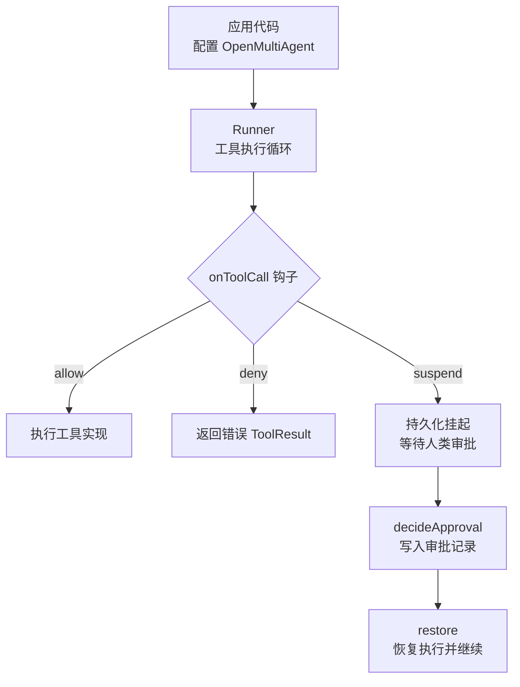
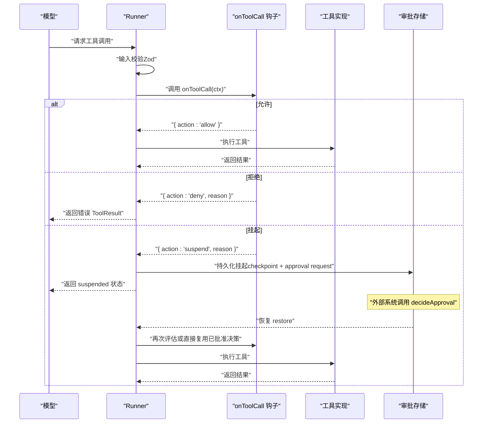
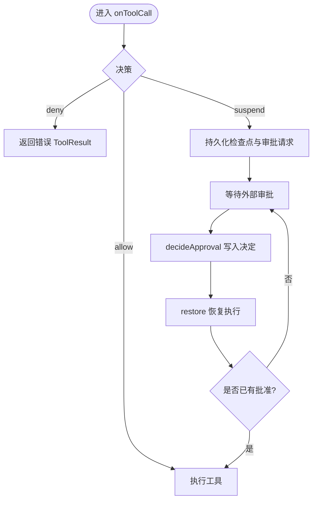
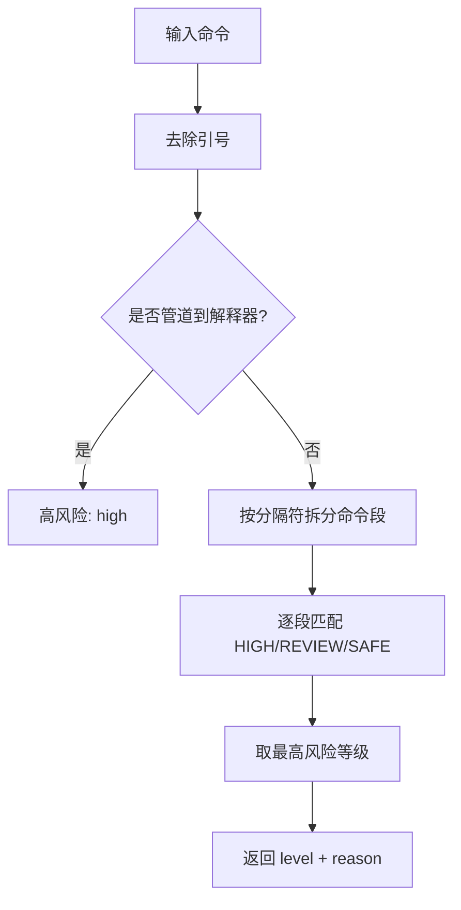
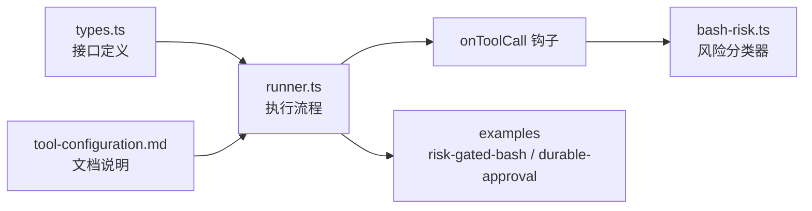

# 每调用门控机制

<cite>
**本文引用的文件**
- [types.ts](file://packages/core/src/types.ts)
- [runner.ts](file://packages/core/src/agent/runner.ts)
- [tool-configuration.md](file://docs/tool-configuration.md)
- [risk-gated-bash.ts](file://packages/core/examples/patterns/risk-gated-bash.ts)
- [durable-approval.ts](file://packages/core/examples/patterns/durable-approval.ts)
- [bash-risk.ts](file://packages/core/src/tool/classifiers/bash-risk.ts)
</cite>

## 目录
1. [简介](#简介)
2. [项目结构](#项目结构)
3. [核心组件](#核心组件)
4. [架构总览](#架构总览)
5. [详细组件分析](#详细组件分析)
6. [依赖关系分析](#依赖关系分析)
7. [性能考量](#性能考量)
8. [故障排查指南](#故障排查指南)
9. [结论](#结论)
10. [附录：配置示例与最佳实践](#附录：配置示例与最佳实践)

## 简介
本章节面向“每调用门控（per-call gating）”机制，聚焦 Open Multi-Agent 在工具执行流程中的细粒度控制能力。其核心是 onToolCall 钩子：它在输入校验之后、工具实现之前被调用，允许基于工具名称、参数和上下文做出 allow、deny 或 suspend 的决策；配合可持久化的挂起（suspend）与恢复（restore），支持跨进程的人类审批流程。文档同时介绍内置的 shell 风险分类器 classifyBashCommand，以及 safe、review、high 三类风险判断标准，并提供完整的配置示例，帮助实现细粒度的工具调用控制策略。

## 项目结构
围绕 per-call gating 的关键代码与文档分布如下：
- 类型与接口定义：ToolCallContext、ToolCallDecision、ToolCallGate 等位于核心类型文件中。
- 执行流程集成：Runner 在执行工具前调用 onToolCall，并在需要时生成挂起的提交记录。
- 文档说明：工具配置文档对 onToolCall 的位置、语义、与默认拒绝策略的关系进行了详细说明。
- 示例：风险门控 bash 示例演示了 classifyBashCommand 的使用；耐久审批示例演示了 suspend/decideApproval/restore 的完整闭环。
- 分类器：shell 命令风险分类器以可选子路径导出，提供 safe/review/high 三级启发式判断。

图表来源
- [runner.ts:1484-1528](file://packages/core/src/agent/runner.ts#L1484-L1528)
- [tool-configuration.md:326-360](file://docs/tool-configuration.md#L326-L360)

章节来源
- [types.ts:605-618](file://packages/core/src/types.ts#L605-L618)
- [runner.ts:1484-1528](file://packages/core/src/agent/runner.ts#L1484-L1528)
- [tool-configuration.md:326-360](file://docs/tool-configuration.md#L326-L360)

## 核心组件
- ToolCallContext：传递给 onToolCall 的上下文，包含工具名、已校验的参数、代理名、是否具后果性（consequential）、运行 ID、任务 ID、稳定的模型发放调用 ID 等。
- ToolCallDecision：onToolCall 的决策结果，包括 allow、deny（可带原因）、suspend（可带原因）。
- ToolCallGate：onToolCall 的类型签名，接受 ToolCallContext 并返回决策。
- ToolCallGateMetadata：当门控运行时附加到工具结果上的元数据，包含 action 与 reason。
- 工具执行流：Runner 在工具执行前调用 onToolCall；若返回 deny，则构造错误 ToolResult；若返回 suspend，则创建挂起提交并持久化检查点，等待外部审批后恢复。

章节来源
- [types.ts:605-618](file://packages/core/src/types.ts#L605-L618)
- [types.ts:655-674](file://packages/core/src/types.ts#L655-L674)
- [runner.ts:1484-1528](file://packages/core/src/agent/runner.ts#L1484-L1528)

## 架构总览
下图展示了从模型请求工具调用到最终执行或挂起的完整流程，重点标注 onToolCall 的位置与决策分支。

图表来源
- [runner.ts:1484-1528](file://packages/core/src/agent/runner.ts#L1484-L1528)
- [tool-configuration.md:326-360](file://docs/tool-configuration.md#L326-L360)
- [durable-approval.ts:54-105](file://packages/core/examples/patterns/durable-approval.ts#L54-L105)

## 详细组件分析

### onToolCall 钩子在工具执行流程中的位置
- 位置：在 Zod 输入验证之后、工具实现 execute 之前。
- 作用：针对具体的一次调用进行策略判断，而非仅按工具名做静态授权。
- 行为：
  - allow：继续执行工具。
  - deny：不抛出异常，而是返回一个结构化的错误 ToolResult，模型可据此调整后续行为。
  - suspend：将本次调用持久化，返回 suspended 状态，等待外部审批后再恢复执行。

章节来源
- [tool-configuration.md:326-360](file://docs/tool-configuration.md#L326-L360)
- [runner.ts:1484-1528](file://packages/core/src/agent/runner.ts#L1484-L1528)

### ToolCallContext 与 ToolCallDecision 接口
- ToolCallContext：
  - 包含工具名、已校验后的输入参数、代理名、是否具后果性、运行/任务 ID、稳定的模型发放调用 ID、工作目录、元数据等。
  - 可用于读取 agent 的凭据、会话信息、任务信息等上下文。
- ToolCallDecision：
  - allow：允许执行。
  - deny：拒绝执行，可附带原因字符串。
  - suspend：挂起执行，可附带原因字符串，用于跨进程的人类审批。

章节来源
- [types.ts:605-618](file://packages/core/src/types.ts#L605-L618)
- [types.ts:544-603](file://packages/core/src/types.ts#L544-L603)

### 基于工具名称、参数与上下文的决策
- 工具名称：可按工具名快速分流（例如仅对 bash 启用复杂规则）。
- 参数：使用已校验的 input 字段进行规则匹配（如 command 内容、路径、目标等）。
- 上下文：结合 consequential 标记、runId/taskId/toolCallId、credentials、cwd 等，实现更精细的策略。
- 典型模式：
  - 白名单/黑名单：对特定工具名直接 allow/deny。
  - 参数正则：对命令关键字、路径范围、权限变更等进行匹配。
  - 风险分级：结合 classifyBashCommand 输出，safe 放行、review 转人工、high 拒绝。

章节来源
- [tool-configuration.md:326-360](file://docs/tool-configuration.md#L326-L360)
- [risk-gated-bash.ts:39-56](file://packages/core/examples/patterns/risk-gated-bash.ts#L39-L56)

### 挂起（suspend）的持久化与跨进程审批
- 触发条件：onToolCall 返回 { action: 'suspend' }。
- 持久化：Runner 会保存检查点并生成待审批请求（包含工具名、输入、原因等），以便进程重启后仍可恢复。
- 审批流程：
  - 外部系统通过 decideApproval 写入审批决定（approve/deny）。
  - 使用 restore 恢复执行，框架会复用已批准的决策，避免重复审批。
- 适用场景：生产发布、敏感操作、合规审计等需要人类确认的流程。

图表来源
- [durable-approval.ts:54-105](file://packages/core/examples/patterns/durable-approval.ts#L54-L105)
- [runner.ts:1484-1528](file://packages/core/src/agent/runner.ts#L1484-L1528)

章节来源
- [durable-approval.ts:54-105](file://packages/core/examples/patterns/durable-approval.ts#L54-L105)
- [tool-configuration.md:326-360](file://docs/tool-configuration.md#L326-L360)

### Shell 风险分类器（classifyBashCommand）
- 目的：为 bash 工具提供轻量级风险评分，辅助 onToolCall 策略。
- 风险级别：
  - safe：只读检查类命令（如 ls、cat、pwd、grep/rg 带路径、git status/log/diff/show 等）。
  - review：上下文密集或模糊的命令（如递归列出、未限定范围的 find/grep、tree、du、未知命令等）。
  - high：破坏性或敏感操作（如 rm、sudo、curl ... | bash、dd、mkfs、chmod 777/-R、git push --force、npm publish、向系统路径写数据等）。
- 处理逻辑：
  - 先去除引号包裹的内容，再按 shell 分隔符拆分命令段（&&、||、;、|、换行），并对一层命令替换体也进行拆分。
  - 对每个片段匹配 HIGH/REVIEW/SAFE 模式表，取最高风险等级作为整体结果。
  - 特殊检测：管道直连解释器（如 curl ... | bash）直接判定为 high。
- 注意：该分类器是启发式规则，不是安全边界；可通过扩展模式表或替换实现来定制策略。

图表来源
- [bash-risk.ts:107-191](file://packages/core/src/tool/classifiers/bash-risk.ts#L107-L191)

章节来源
- [bash-risk.ts:1-191](file://packages/core/src/tool/classifiers/bash-risk.ts#L1-L191)
- [tool-configuration.md:364-390](file://docs/tool-configuration.md#L364-L390)

### 完整配置示例与策略组合
以下示例展示如何在不同层级组合策略：
- 编排器级默认门控：适用于团队内所有未单独配置的代理。
- 代理级覆盖：AgentConfig.onToolCall 可覆盖编排器默认策略。
- 工具授权层：默认拒绝（default-deny）+ 显式授予 tools/toolPreset，再叠加 onToolCall 进行调用级控制。
- 后果性工具确认：开启 requireConsequentialConfirmation 后，对具后果性的工具调用强制走确认路径。

参考路径：
- 编排器级默认门控与风险分级示例：[risk-gated-bash.ts:39-79](file://packages/core/examples/patterns/risk-gated-bash.ts#L39-L79)
- 耐久审批示例（suspend/decideApproval/restore）：[durable-approval.ts:54-105](file://packages/core/examples/patterns/durable-approval.ts#L54-L105)
- 工具配置与默认拒绝策略说明：[tool-configuration.md:214-238](file://docs/tool-configuration.md#L214-L238)
- 后果性工具确认开关与 onToolCall 集成：[tool-configuration.md:184-213](file://docs/tool-configuration.md#L184-L213)

章节来源
- [risk-gated-bash.ts:39-79](file://packages/core/examples/patterns/risk-gated-bash.ts#L39-L79)
- [durable-approval.ts:54-105](file://packages/core/examples/patterns/durable-approval.ts#L54-L105)
- [tool-configuration.md:184-238](file://docs/tool-configuration.md#L184-L238)

## 依赖关系分析
- Runner 依赖 onToolCall 钩子进行调用级控制，并在需要时生成挂起提交与检查点。
- 类型定义集中管理 ToolCallContext、ToolCallDecision、ToolCallGate 等接口，保证各模块间契约一致。
- 分类器以可选子路径导出，避免默认加载开销，仅在导入时使用。
- 示例代码展示了如何组合授权层与门控层，形成“名称授权 + 调用级策略”的双重控制。

图表来源
- [types.ts:605-618](file://packages/core/src/types.ts#L605-L618)
- [runner.ts:1484-1528](file://packages/core/src/agent/runner.ts#L1484-L1528)
- [bash-risk.ts:1-191](file://packages/core/src/tool/classifiers/bash-risk.ts#L1-L191)
- [tool-configuration.md:326-390](file://docs/tool-configuration.md#L326-L390)

章节来源
- [types.ts:605-618](file://packages/core/src/types.ts#L605-L618)
- [runner.ts:1484-1528](file://packages/core/src/agent/runner.ts#L1484-L1528)
- [bash-risk.ts:1-191](file://packages/core/src/tool/classifiers/bash-risk.ts#L1-L191)
- [tool-configuration.md:326-390](file://docs/tool-configuration.md#L326-L390)

## 性能考量
- 分类器为轻量级正则匹配，开销低；但应避免在高频路径中进行昂贵计算。
- onToolCall 应在必要时才引入异步 I/O（如 UI 交互、网络请求），否则可能阻塞执行流。
- 合理使用 suspend：仅在确实需要人类审批时挂起，避免频繁中断导致吞吐下降。
- 观察指标：gateAction、gated 等观测字段有助于统计门控命中率与拒绝率，指导策略调优。

## 故障排查指南
- 现象：工具调用被拒绝但未看到明确原因。
  - 排查：检查 onToolCall 中 deny 分支的 reason 字段，确保传递可读原因。
- 现象：挂起后无法恢复。
  - 排查：确认使用了具备持久化能力的 store（如 InMemoryStore 或数据库-backed Store），并通过 decideApproval 写入正确的 requestId/requestHash。
- 现象：恢复后重复审批。
  - 排查：确保 restore 能复用已批准的决策；检查审批存储是否共享且未被清理。
- 现象：高风险命令误判为安全。
  - 排查：审查 classifyBashCommand 的模式表，补充缺失的高风险模式；必要时自定义分类器。

章节来源
- [tool-configuration.md:326-360](file://docs/tool-configuration.md#L326-L360)
- [durable-approval.ts:54-105](file://packages/core/examples/patterns/durable-approval.ts#L54-L105)
- [bash-risk.ts:55-103](file://packages/core/src/tool/classifiers/bash-risk.ts#L55-L103)

## 结论
Open Multi-Agent 的 per-call gating 机制通过 onToolCall 钩子在工具执行的关键节点提供了细粒度的控制能力。结合 ToolCallContext 与 ToolCallDecision，开发者可以依据工具名、参数与上下文灵活制定 allow/deny/suspend 策略；借助 classifyBashCommand 的风险分类，能快速实现 shell 命令的安全分级。配合耐久审批（suspend/decideApproval/restore），可在生产环境中构建可靠的人类审批流程。建议将“名称授权 + 调用级策略 + 风险分类 + 耐久审批”组合使用，以实现既安全又可控的工具调用治理。

## 附录：配置示例与最佳实践
- 基础配置：
  - 在编排器层面设置 onToolCall，作为团队默认策略。
  - 在代理层面覆盖 onToolCall，实现更严格的专用策略。
- 风险分级：
  - 对 bash 工具使用 classifyBashCommand，safe 放行、review 转人工、high 拒绝。
- 耐久审批：
  - 在关键路径返回 suspend，使用 decideApproval 写入审批，再通过 restore 恢复执行。
- 最佳实践：
  - 始终提供清晰的 reason，便于审计与调试。
  - 避免在 onToolCall 中执行耗时操作；必要时采用异步审批。
  - 定期审查与更新风险模式表，应对新出现的威胁面。
  - 结合默认拒绝策略与显式授权，最小化攻击面。

章节来源
- [tool-configuration.md:184-238](file://docs/tool-configuration.md#L184-L238)
- [tool-configuration.md:326-390](file://docs/tool-configuration.md#L326-L390)
- [risk-gated-bash.ts:39-79](file://packages/core/examples/patterns/risk-gated-bash.ts#L39-L79)
- [durable-approval.ts:54-105](file://packages/core/examples/patterns/durable-approval.ts#L54-L105)