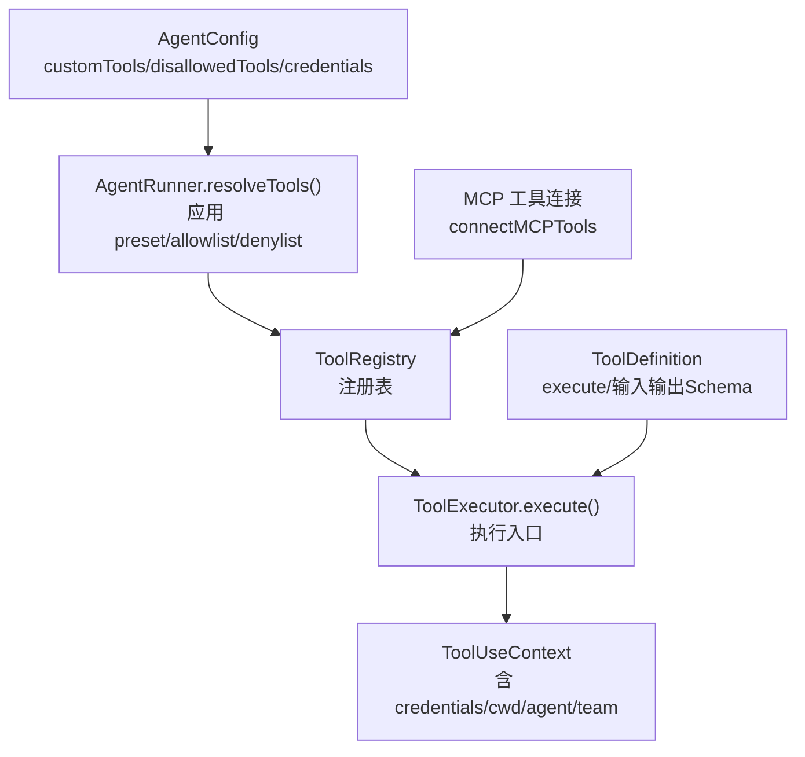
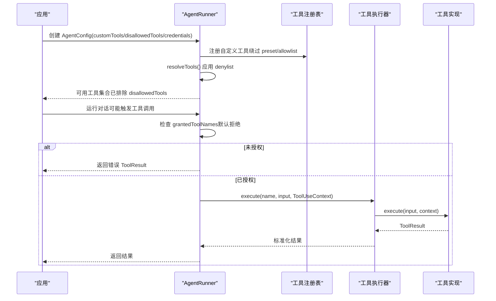
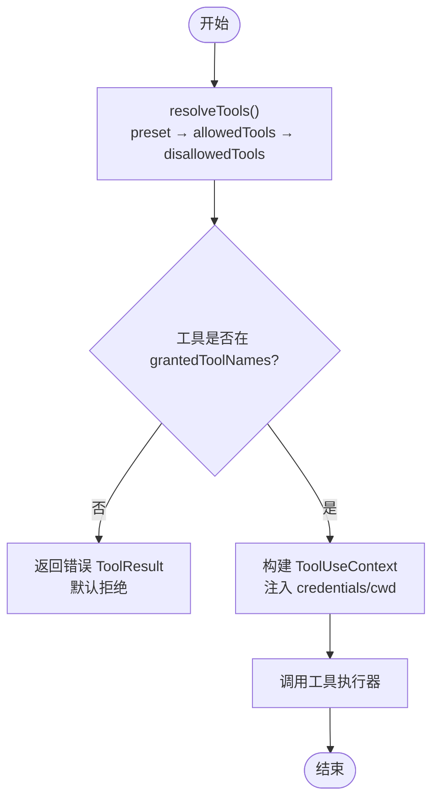
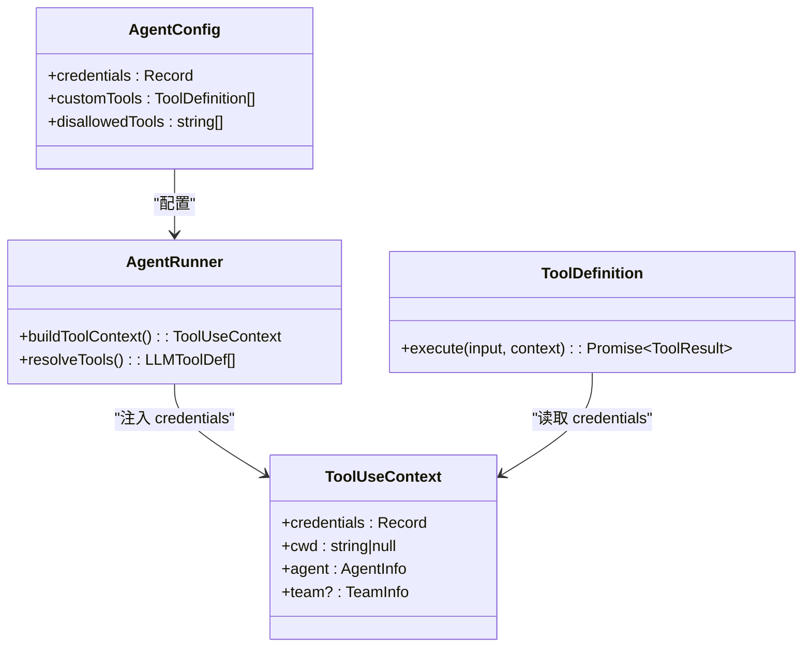
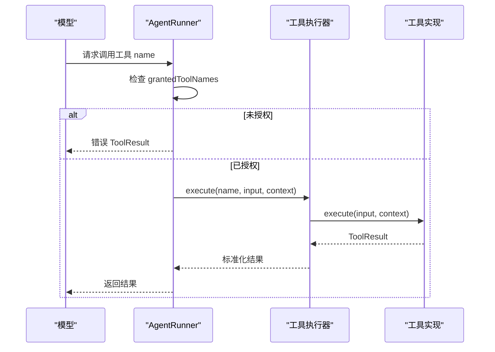
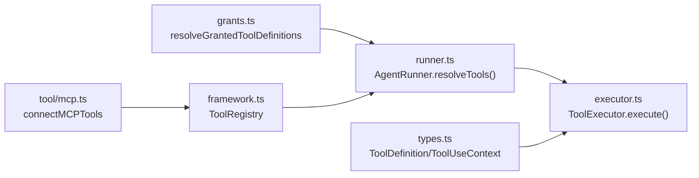

# 自定义工具安全

<cite>
**本文引用的文件**
- [types.ts](file://packages/core/src/types.ts)
- [runner.ts](file://packages/core/src/agent/runner.ts)
- [grants.ts](file://packages/core/src/tool/grants.ts)
- [framework.ts](file://packages/core/src/tool/framework.ts)
- [executor.ts](file://packages/core/src/tool/executor.ts)
- [mcp.ts](file://packages/core/src/tool/mcp.ts)
- [mcp.ts（导出）](file://packages/core/src/mcp.ts)
</cite>

## 目录
1. [简介](#简介)
2. [项目结构](#项目结构)
3. [核心组件](#核心组件)
4. [架构总览](#架构总览)
5. [详细组件分析](#详细组件分析)
6. [依赖关系分析](#依赖关系分析)
7. [性能与安全注意事项](#性能与安全注意事项)
8. [故障排查指南](#故障排查指南)
9. [结论](#结论)
10. [附录](#附录)

## 简介
本文聚焦 Open Multi-Agent（OMA）中“自定义工具”的安全机制，围绕以下关键点展开：
- 通过 AgentConfig.customTools 或 agent.addTool() 注册的工具的权限行为：注册即授权，绕过预设与允许列表过滤，但仍受 disallowedTools 限制。
- 工具凭证管理：AgentConfig.credentials 的作用、ToolUseContext.credentials 的读取方式，以及“每个智能体仅能访问自己的凭证”的隔离保证。
- 安全的自定义工具开发实践：最小权限原则、敏感信息封装、输出截断与结果校验。
- MCP 工具集成的安全考虑与最佳实践。

## 项目结构
与自定义工具安全直接相关的代码集中在 core 包的 agent、tool 与 types 模块：
- types.ts：定义 AgentConfig、ToolDefinition、ToolUseContext、LLMToolDef 等关键类型，明确 customTools、disallowedTools、credentials 等字段的语义与约束。
- runner.ts：AgentRunner 负责工具解析、执行与上下文构建，包含默认拒绝策略、工具白名单/黑名单处理、凭证注入等。
- tool/grants.ts：工具授予逻辑（preset → allowlist → denylist → 框架安全），决定最终可执行工具集合。
- tool/framework.ts：工具注册表与工具定义转换。
- tool/executor.ts：工具执行器，统一入口，承载 per-call gate 与结果处理。
- tool/mcp.ts 与 mcp.ts（导出）：MCP 工具连接与集成入口。

图表来源
- [types.ts:965-1000](file://packages/core/src/types.ts#L965-L1000)
- [runner.ts:817-827](file://packages/core/src/agent/runner.ts#L817-L827)
- [runner.ts:1796-1810](file://packages/core/src/agent/runner.ts#L1796-L1810)
- [mcp.ts（导出）:1-6](file://packages/core/src/mcp.ts#L1-L6)

章节来源
- [types.ts:965-1000](file://packages/core/src/types.ts#L965-L1000)
- [runner.ts:817-827](file://packages/core/src/agent/runner.ts#L817-L827)
- [runner.ts:1796-1810](file://packages/core/src/agent/runner.ts#L1796-L1810)
- [mcp.ts（导出）:1-6](file://packages/core/src/mcp.ts#L1-L6)

## 核心组件
- 工具定义与上下文
  - ToolDefinition：描述工具名称、描述、输入/输出 Schema、是否具副作用（consequential）、最大输出长度等，并提供 execute(input, context)。
  - ToolUseContext：每次工具调用时注入的上下文，包含 agent、team、abortSignal、cwd、runId/taskId/toolCallId，以及 per-agent 的 credentials。
- 智能体配置
  - AgentConfig.customTools：自定义工具定义数组，注册后绕过 tools 与 toolPreset 过滤，但可被 disallowedTools 阻止。
  - AgentConfig.disallowedTools：显式禁止的工具名集合，对自定义工具同样生效。
  - AgentConfig.credentials：按智能体隔离的密钥字典，通过 ToolUseContext.credentials 暴露给工具代码。
- 运行期执行
  - AgentRunner.resolveTools()：基于 preset → allowedTools → disallowedTools → 框架安全，计算最终可用工具集合。
  - AgentRunner.executeToolCall()：在模型请求工具时进行“默认拒绝”检查，未授权则返回错误结果；授权后构造 ToolUseContext 并调用执行器。
  - AgentRunner.buildToolContext()：组装 ToolUseContext，将本智能体的 credentials 注入到上下文中。

章节来源
- [types.ts:511-603](file://packages/core/src/types.ts#L511-L603)
- [types.ts:704-734](file://packages/core/src/types.ts#L704-L734)
- [types.ts:965-1000](file://packages/core/src/types.ts#L965-L1000)
- [runner.ts:817-827](file://packages/core/src/agent/runner.ts#L817-L827)
- [runner.ts:1364-1429](file://packages/core/src/agent/runner.ts#L1364-L1429)
- [runner.ts:1796-1810](file://packages/core/src/agent/runner.ts#L1796-L1810)

## 架构总览
下图展示了从配置到执行的完整链路，突出“注册即授权”和“默认拒绝”的关键点。

图表来源
- [runner.ts:817-827](file://packages/core/src/agent/runner.ts#L817-L827)
- [runner.ts:1364-1429](file://packages/core/src/agent/runner.ts#L1364-L1429)
- [types.ts:965-1000](file://packages/core/src/types.ts#L965-L1000)

## 详细组件分析

### 自定义工具的权限行为：注册即授权，仍受黑名单限制
- 自定义工具通过 AgentConfig.customTools 或 agent.addTool() 注册后，会绕过 tools（允许列表）与 toolPreset 过滤，即“注册即授权”。
- 但 disallowedTools 仍然有效：resolveTools() 会将黑名单应用于最终授予集合，从而阻止危险工具的执行。
- 运行时再次校验：即使模型发出对未授权工具的调用，AgentRunner 也会以“默认拒绝”策略返回错误结果，不会静默执行。

图表来源
- [runner.ts:817-827](file://packages/core/src/agent/runner.ts#L817-L827)
- [runner.ts:1364-1429](file://packages/core/src/agent/runner.ts#L1364-L1429)
- [runner.ts:1796-1810](file://packages/core/src/agent/runner.ts#L1796-L1810)

章节来源
- [types.ts:965-978](file://packages/core/src/types.ts#L965-L978)
- [runner.ts:817-827](file://packages/core/src/agent/runner.ts#L817-L827)
- [runner.ts:1364-1429](file://packages/core/src/agent/runner.ts#L1364-L1429)

### 工具凭证管理与隔离
- 凭证来源：AgentConfig.credentials 为每个智能体提供独立的密钥字典。
- 凭证注入：AgentRunner.buildToolContext() 将当前智能体的 credentials 注入到 ToolUseContext.credentials。
- 读取方式：工具实现通过 context.credentials 读取所需密钥，避免闭包捕获全局或模块级秘密。
- 隔离保证：不同智能体的 credentials 不合并、不继承自协调者；每个智能体仅持有自身配置的凭证集合。
- 注意：该机制是“作用域便利”，并非沙箱边界；工具代码仍在进程内运行，仍可访问 process.env。因此需配合最小权限与输出脱敏。

图表来源
- [types.ts:511-603](file://packages/core/src/types.ts#L511-L603)
- [types.ts:965-1000](file://packages/core/src/types.ts#L965-L1000)
- [runner.ts:1796-1810](file://packages/core/src/agent/runner.ts#L1796-L1810)

章节来源
- [types.ts:511-603](file://packages/core/src/types.ts#L511-L603)
- [types.ts:965-1000](file://packages/core/src/types.ts#L965-L1000)
- [runner.ts:1796-1810](file://packages/core/src/agent/runner.ts#L1796-L1810)

### 工具执行流程与默认拒绝
- 模型可能请求任意工具名，AgentRunner 在执行前使用 grantedToolNames 做“默认拒绝”检查。
- 若未授权，返回错误 ToolResult 而非抛出异常，便于上层统一处理。
- 若已授权，构造 ToolUseContext（包含 agent、team、cwd、credentials 等）并调用执行器。

图表来源
- [runner.ts:1364-1429](file://packages/core/src/agent/runner.ts#L1364-L1429)

章节来源
- [runner.ts:1364-1429](file://packages/core/src/agent/runner.ts#L1364-L1429)

### MCP 工具集成的安全考虑
- MCP 工具通过 connectMCPTools 接入，其 JSON Schema 由服务端提供，可直接作为 LLMToolDef.inputSchema。
- 安全要点：
  - 将 MCP 工具视为“外部能力”，遵循最小权限原则：仅在必要时启用，并通过 disallowedTools 屏蔽高风险操作。
  - 结合 onToolCall 实现每调用门控，依据上下文（如 agentName、consequential、input 字段）动态放行或拒绝。
  - 对输出进行截断与脱敏，避免泄露敏感信息。
  - 谨慎设置 cwd 与 credentials，确保工具仅能访问必要资源与密钥。

章节来源
- [types.ts:704-734](file://packages/core/src/types.ts#L704-L734)
- [mcp.ts（导出）:1-6](file://packages/core/src/mcp.ts#L1-L6)

## 依赖关系分析
- AgentRunner 依赖工具授予逻辑（grants）与工具注册表（framework），并在执行阶段委托给工具执行器（executor）。
- ToolDefinition 通过 ToolUseContext 获取运行期上下文，包括凭证与工作目录。
- MCP 工具通过 connectMCPTools 转换为框架可识别的工具定义，进入同一执行路径。

图表来源
- [runner.ts:817-827](file://packages/core/src/agent/runner.ts#L817-L827)
- [types.ts:704-734](file://packages/core/src/types.ts#L704-L734)
- [mcp.ts（导出）:1-6](file://packages/core/src/mcp.ts#L1-L6)

章节来源
- [runner.ts:817-827](file://packages/core/src/agent/runner.ts#L817-L827)
- [types.ts:704-734](file://packages/core/src/types.ts#L704-L734)
- [mcp.ts（导出）:1-6](file://packages/core/src/mcp.ts#L1-L6)

## 性能与安全注意事项
- 默认拒绝：所有工具调用均经过 grantedToolNames 校验，防止越权执行。
- 输出控制：可通过 ToolDefinition.maxOutputChars 与 AgentConfig.maxToolOutputChars 限制工具输出大小，降低上下文膨胀与敏感信息泄露风险。
- 工作目录沙箱：内置文件系统工具受 cwd 限制，路径必须绝对且位于指定目录内；可通过 null 禁用（不推荐）。
- 凭证最小化：仅向需要该密钥的智能体授予对应 credentials，避免共享全局密钥。
- 可观测性：工具结果与凭证键会被自动脱敏，减少日志与追踪中的敏感信息泄露。

[本节为通用指导，无需特定文件引用]

## 故障排查指南
- 现象：模型请求了某个工具但未被执行，返回错误提示。
  - 原因：该工具不在 grantedToolNames 中（未被授予或被 disallowedTools 阻止）。
  - 处理：检查 AgentConfig.tools、toolPreset、disallowedTools，确认是否需要显式授予或移除黑名单。
- 现象：工具无法访问预期密钥。
  - 原因：ToolUseContext.credentials 未注入或键名不匹配。
  - 处理：确认 AgentConfig.credentials 是否正确设置，并确保工具通过 context.credentials 读取。
- 现象：文件读写失败或路径被拒绝。
  - 原因：cwd 沙箱限制导致路径不在允许范围内。
  - 处理：调整 AgentConfig.cwd 或使用相对路径（需符合沙箱规则）。

章节来源
- [runner.ts:1364-1429](file://packages/core/src/agent/runner.ts#L1364-L1429)
- [runner.ts:1796-1810](file://packages/core/src/agent/runner.ts#L1796-L1810)
- [types.ts:965-1000](file://packages/core/src/types.ts#L965-L1000)

## 结论
- 自定义工具通过 customTools 或 agent.addTool() 注册后即具备执行能力，绕过预设与允许列表过滤，但仍受 disallowedTools 限制。
- 运行时采用“默认拒绝”策略，确保未授权工具不会被执行。
- 凭证通过 AgentConfig.credentials 注入 ToolUseContext.credentials，实现按智能体隔离的最小权限访问。
- 建议结合 onToolCall 门控、输出截断、工作目录沙箱与凭证最小化，构建更安全的自定义工具生态。
- MCP 工具集成应遵循相同的安全原则，谨慎授予权限并强化门控与脱敏。

[本节为总结，无需特定文件引用]

## 附录
- 关键类型与字段参考
  - ToolDefinition：name、description、inputSchema、consequential、outputSchema、maxOutputChars、execute。
  - ToolUseContext：agent、team、abortSignal、cwd、runId、taskId、toolCallId、credentials。
  - AgentConfig：customTools、tools、disallowedTools、onToolCall、toolPreset、credentials、cwd、maxToolOutputChars。
- 建议实践
  - 为每个智能体配置最小化的 credentials。
  - 对高风险工具启用 onToolCall 门控，结合 consequential 标记进行审批。
  - 为工具设置合理的 maxOutputChars，避免大输出泄露或上下文爆炸。
  - 使用 cwd 沙箱限制文件系统访问范围。

章节来源
- [types.ts:511-603](file://packages/core/src/types.ts#L511-L603)
- [types.ts:704-734](file://packages/core/src/types.ts#L704-L734)
- [types.ts:965-1000](file://packages/core/src/types.ts#L965-L1000)