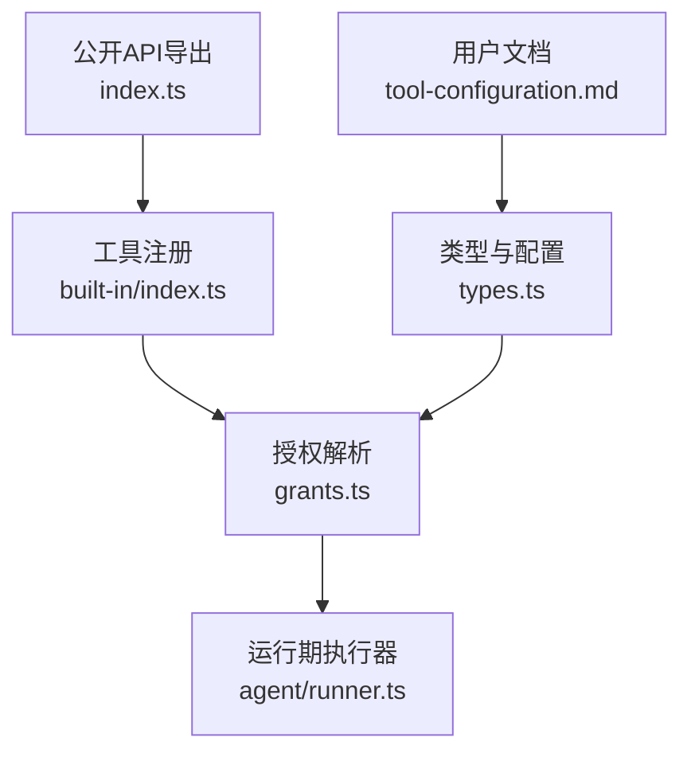
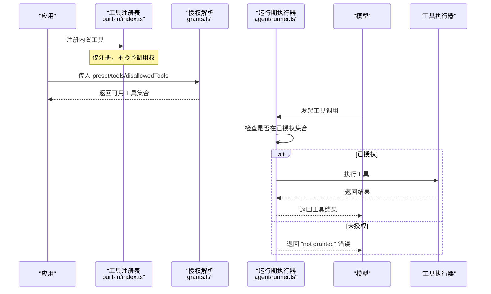
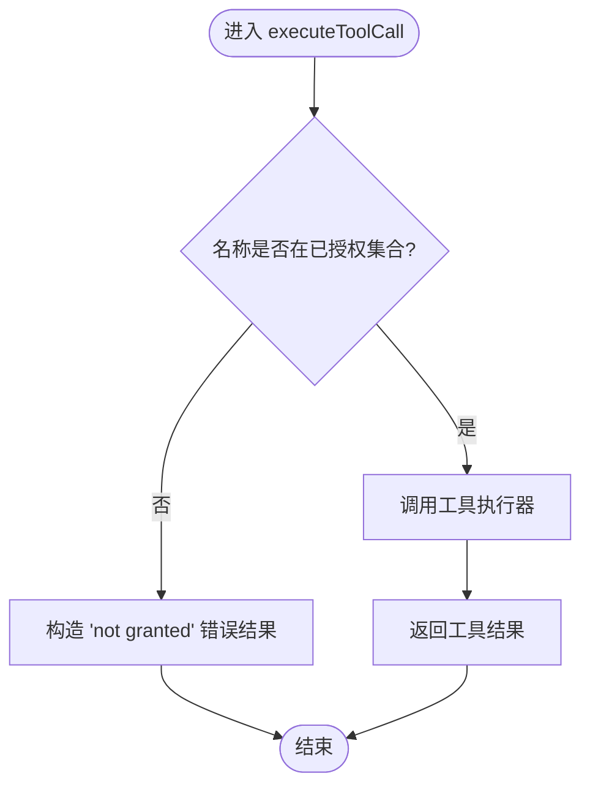
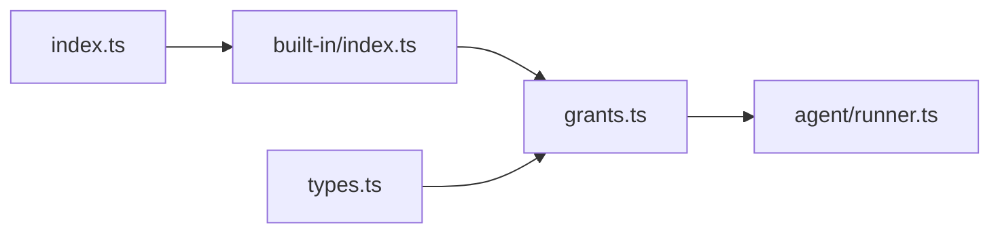

# 默认拒绝安全模型

<cite>
**本文引用的文件**
- [packages/core/src/tool/built-in/index.ts](file://packages/core/src/tool/built-in/index.ts)
- [packages/core/src/tool/grants.ts](file://packages/core/src/tool/grants.ts)
- [packages/core/src/agent/runner.ts](file://packages/core/src/agent/runner.ts)
- [packages/core/src/types.ts](file://packages/core/src/types.ts)
- [packages/core/src/index.ts](file://packages/core/src/index.ts)
- [docs/tool-configuration.md](file://docs/tool-configuration.md)
</cite>

## 目录
1. [简介](#简介)
2. [项目结构](#项目结构)
3. [核心组件](#核心组件)
4. [架构总览](#架构总览)
5. [详细组件分析](#详细组件分析)
6. [依赖关系分析](#依赖关系分析)
7. [性能与安全特性](#性能与安全特性)
8. [故障排查指南](#故障排查指南)
9. [结论](#结论)
10. [附录：最小权限配置示例](#附录最小权限配置示例)

## 简介
本文件系统性说明 Open Multi-Agent 的“默认拒绝”安全模型：内置工具（如 bash、文件系统工具）在未显式授权时一律不可用；当智能体未配置 tools 或 toolPreset 时，解析为零个可用内置工具；registerBuiltInTools() 仅将工具注册到注册表使其“可被授权”，并不直接授予任何智能体调用权；当模型请求了已注册但未授权的内置工具时，执行层会返回明确的“not granted”错误。文档同时给出基于最小权限原则的配置建议与角色化授权示例。

## 项目结构
围绕默认拒绝模型的关键代码分布在以下位置：
- 工具注册与集合：内置工具的集中注册与导出
- 授权解析：预设、白名单、黑名单的合并与过滤
- 执行器：运行时对模型的工具调用进行最终授权检查并返回错误
- 类型与配置：AgentConfig、OrchestratorConfig 中关于 tools、toolPreset、defaultToolPreset、cwd 等字段
- 公开 API：对外暴露 registerBuiltInTools 等能力
- 用户文档：工具配置的权威说明与最佳实践

图表来源
- [packages/core/src/tool/built-in/index.ts:1-75](file://packages/core/src/tool/built-in/index.ts#L1-L75)
- [packages/core/src/tool/grants.ts:1-90](file://packages/core/src/tool/grants.ts#L1-L90)
- [packages/core/src/agent/runner.ts:900-920](file://packages/core/src/agent/runner.ts#L900-L920)
- [packages/core/src/types.ts:965-986](file://packages/core/src/types.ts#L965-L986)
- [packages/core/src/index.ts:165-180](file://packages/core/src/index.ts#L165-L180)
- [docs/tool-configuration.md:214-250](file://docs/tool-configuration.md#L214-L250)

章节来源
- [packages/core/src/tool/built-in/index.ts:1-75](file://packages/core/src/tool/built-in/index.ts#L1-L75)
- [packages/core/src/tool/grants.ts:1-90](file://packages/core/src/tool/grants.ts#L1-L90)
- [packages/core/src/agent/runner.ts:900-920](file://packages/core/src/agent/runner.ts#L900-L920)
- [packages/core/src/types.ts:965-986](file://packages/core/src/types.ts#L965-L986)
- [packages/core/src/index.ts:165-180](file://packages/core/src/index.ts#L165-L180)
- [docs/tool-configuration.md:214-250](file://docs/tool-configuration.md#L214-L250)

## 核心组件
- 内置工具注册表：提供统一入口将内置工具注册到 ToolRegistry，使它们“可被发现、可被授权”。
- 授权解析器：根据 preset、tools、disallowedTools 计算最终可用的工具集合，遵循“默认拒绝”策略。
- 运行期执行器：在每次工具调用前再次校验是否属于“已授权集合”，否则返回“not granted”错误。
- 配置类型：定义 AgentConfig 与 OrchestratorConfig 中的工具相关字段，包括 defaultToolPreset、cwd 等。
- 公开 API：对外暴露 registerBuiltInTools 等能力，便于应用初始化阶段注册工具。

章节来源
- [packages/core/src/tool/built-in/index.ts:18-75](file://packages/core/src/tool/built-in/index.ts#L18-L75)
- [packages/core/src/tool/grants.ts:10-90](file://packages/core/src/tool/grants.ts#L10-L90)
- [packages/core/src/agent/runner.ts:900-920](file://packages/core/src/agent/runner.ts#L900-L920)
- [packages/core/src/types.ts:965-986](file://packages/core/src/types.ts#L965-L986)
- [packages/core/src/index.ts:165-180](file://packages/core/src/index.ts#L165-L180)

## 架构总览
下图展示了从“工具注册”到“授权解析”再到“运行期执行”的完整链路，以及“默认拒绝”如何生效。

图表来源
- [packages/core/src/tool/built-in/index.ts:64-75](file://packages/core/src/tool/built-in/index.ts#L64-L75)
- [packages/core/src/tool/grants.ts:33-90](file://packages/core/src/tool/grants.ts#L33-L90)
- [packages/core/src/agent/runner.ts:900-920](file://packages/core/src/agent/runner.ts#L900-L920)

## 详细组件分析

### 为什么内置工具默认拒绝
- 设计目标：防止意外授予高权限能力（如任意 shell 执行、任意路径读写）。
- 规则：若未显式通过 tools 或 toolPreset 授予，则内置工具可用集合为空。
- 影响范围：runAgent、runTeam/runTasks、简单目标短路路径、独立 Agent 均一致生效。
- 补充：即使模型因混淆或提示注入请求了已注册但未授权的内置工具，也不会静默执行，而是返回明确错误。

章节来源
- [docs/tool-configuration.md:214-238](file://docs/tool-configuration.md#L214-L238)
- [packages/core/src/agent/runner.ts:900-920](file://packages/core/src/agent/runner.ts#L900-L920)

### 未配置 tools 或 toolPreset 时如何解析为零个内置工具
- 解析逻辑：当既没有 preset 也没有 allowedTools 时，初始可用集合为空；后续再叠加 denylist 等过滤，结果仍为空。
- 这意味着：不声明任何工具访问即零权限，符合“默认拒绝”。

章节来源
- [packages/core/src/tool/grants.ts:59-67](file://packages/core/src/tool/grants.ts#L59-L67)

### registerBuiltInTools() 的作用边界
- 作用：将内置工具注册到 ToolRegistry，使其“可被发现、可被授权”。
- 非授权：注册不等于授予调用权；仍需通过 tools / toolPreset 或框架默认预设来授予。
- 可选扩展：可按选项包含 delegate_to_agent 工具。

章节来源
- [packages/core/src/tool/built-in/index.ts:18-75](file://packages/core/src/tool/built-in/index.ts#L18-L75)
- [packages/core/src/index.ts:165-180](file://packages/core/src/index.ts#L165-L180)

### 模型调用未授权已注册工具时的安全机制
- 运行时守卫：执行器维护“已授权工具名集合”，所有调用先查该集合。
- 未授权处理：返回结构化错误结果，消息中包含“not granted”语义，不会抛出异常中断流程，便于上层观测与恢复。
- 审计与恢复：支持持久化审批与检查点恢复，确保幂等与可追踪。

图表来源
- [packages/core/src/agent/runner.ts:1364-1429](file://packages/core/src/agent/runner.ts#L1364-L1429)

章节来源
- [packages/core/src/agent/runner.ts:1364-1429](file://packages/core/src/agent/runner.ts#L1364-L1429)

### 预设与过滤顺序（最小权限落地）
- 顺序：默认拒绝 → 预设 → 白名单 → 黑名单 → 框架安全护栏。
- 预设含义：
  - readonly：只读文件与搜索
  - readwrite：读写文件与搜索
  - full：包含 bash（注意：bash 不受沙箱限制）
- 自定义工具：通过 customTools 或 agent.addTool() 注册的工具绕过 grant 过滤，但仍受 disallowedTools 约束。

章节来源
- [docs/tool-configuration.md:251-290](file://docs/tool-configuration.md#L251-L290)
- [packages/core/src/tool/grants.ts:10-15](file://packages/core/src/tool/grants.ts#L10-L15)

### 工作目录与沙箱（配合默认拒绝）
- 文件系统工具：要求绝对路径且必须在 cwd 内解析（含符号链接），防止越权访问。
- 默认行为：未设置时回退到进程工作目录下的 .agent-workspace 子目录。
- 关闭沙箱：显式设置为 null 将禁用路径限制（谨慎使用）。
- 注意：bash 不在沙箱范围内，一旦授予即拥有宿主任意 shell 能力。

章节来源
- [docs/tool-configuration.md:391-441](file://docs/tool-configuration.md#L391-L441)
- [packages/core/src/types.ts:547-557](file://packages/core/src/types.ts#L547-L557)

## 依赖关系分析
- 工具注册模块依赖 ToolRegistry，提供统一注册接口。
- 授权解析模块依赖注册表与预设常量，输出最终可用工具集。
- 运行期执行器依赖授权解析结果，并在调用前做二次校验。
- 类型模块为各层提供一致的配置与上下文契约。
- 公开 API 将关键能力导出给应用侧使用。

图表来源
- [packages/core/src/tool/built-in/index.ts:1-75](file://packages/core/src/tool/built-in/index.ts#L1-L75)
- [packages/core/src/tool/grants.ts:1-90](file://packages/core/src/tool/grants.ts#L1-L90)
- [packages/core/src/agent/runner.ts:900-920](file://packages/core/src/agent/runner.ts#L900-L920)
- [packages/core/src/types.ts:965-986](file://packages/core/src/types.ts#L965-L986)
- [packages/core/src/index.ts:165-180](file://packages/core/src/index.ts#L165-L180)

章节来源
- [packages/core/src/tool/built-in/index.ts:1-75](file://packages/core/src/tool/built-in/index.ts#L1-L75)
- [packages/core/src/tool/grants.ts:1-90](file://packages/core/src/tool/grants.ts#L1-L90)
- [packages/core/src/agent/runner.ts:900-920](file://packages/core/src/agent/runner.ts#L900-L920)
- [packages/core/src/types.ts:965-986](file://packages/core/src/types.ts#L965-L986)
- [packages/core/src/index.ts:165-180](file://packages/core/src/index.ts#L165-L180)

## 性能与安全特性
- 性能
  - 授权解析在任务启动前一次性完成，避免重复计算。
  - 运行期校验为 O(1) 集合查找，开销极低。
- 安全
  - 默认拒绝 + 运行时守卫双重保障，防止误授权与提示注入导致的越权。
  - 文件系统工具路径沙箱降低横向移动风险。
  - 敏感信息（credentials）在追踪中自动脱敏。
  - 可组合 onToolCall 门控，实现细粒度审批与风险评估。

[本节为通用指导，不直接分析具体文件]

## 故障排查指南
- 现象：模型调用返回“not granted”
  - 原因：该工具未被授予（未出现在 preset/tools 中，或被 disallowedTools 排除）。
  - 解决：为对应 Agent 添加必要的 tools 或 toolPreset；必要时调整 defaultToolPreset。
- 现象：文件系统工具报路径越界
  - 原因：cwd 限制导致路径不在允许的工作目录下。
  - 解决：调整 AgentConfig.cwd 或 OrchestratorConfig.defaultCwd；如需完全放开请谨慎评估风险。
- 现象：bash 权限过大
  - 原因：bash 不受沙箱限制，授予即拥有宿主任意命令执行能力。
  - 解决：仅在必要角色授予，并结合 onToolCall 门控与风险评估；或使用只读预设替代。

章节来源
- [packages/core/src/agent/runner.ts:1364-1429](file://packages/core/src/agent/runner.ts#L1364-L1429)
- [docs/tool-configuration.md:391-441](file://docs/tool-configuration.md#L391-L441)
- [docs/tool-configuration.md:214-250](file://docs/tool-configuration.md#L214-L250)

## 结论
Open Multi-Agent 以“默认拒绝”为核心安全基线：内置工具必须显式授权才可用；未配置 tools 或 toolPreset 的 Agent 获得零权限；registerBuiltInTools() 仅负责注册而非授权；运行期对未授权调用返回清晰的“not granted”错误。结合预设、白/黑名单、工作目录沙箱与 per-call 门控，可在不同角色间实现最小权限的安全治理。

[本节为总结性内容，不直接分析具体文件]

## 附录：最小权限配置示例
以下为按角色分配工具访问的最小权限思路（概念性示例，具体字段与值请参考下方引用）：
- 研究者（只读）：仅授予读取与搜索能力，避免写入与执行。
- 编辑者（读写）：授予文件读写与搜索，但不授予 shell。
- 执行者（全量）：仅在可信环境授予 bash 与全部文件系统能力，并配合沙箱与工作目录限制。
- 协调者/共识节点：内部专用，通常不暴露危险工具，按需授予。

参考字段与约定：
- AgentConfig.tools：显式白名单
- AgentConfig.toolPreset：readonly / readwrite / full
- OrchestratorConfig.defaultToolPreset：为无显式配置的 Agent 提供兜底预设
- AgentConfig.cwd / OrchestratorConfig.defaultCwd：文件系统工具沙箱根目录
- AgentConfig.disallowedTools：黑名单，用于进一步收紧权限

章节来源
- [docs/tool-configuration.md:214-250](file://docs/tool-configuration.md#L214-L250)
- [docs/tool-configuration.md:251-290](file://docs/tool-configuration.md#L251-L290)
- [docs/tool-configuration.md:391-441](file://docs/tool-configuration.md#L391-L441)
- [packages/core/src/types.ts:965-986](file://packages/core/src/types.ts#L965-L986)
- [packages/core/src/types.ts:2236-2252](file://packages/core/src/types.ts#L2236-L2252)