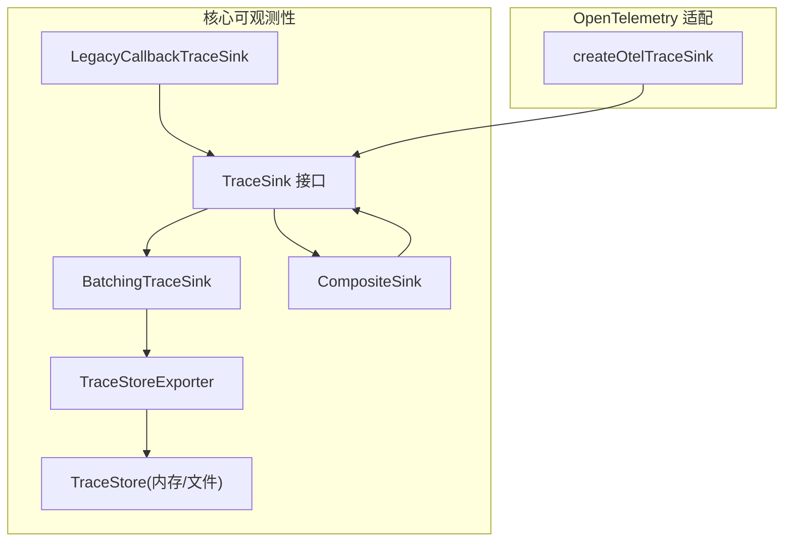
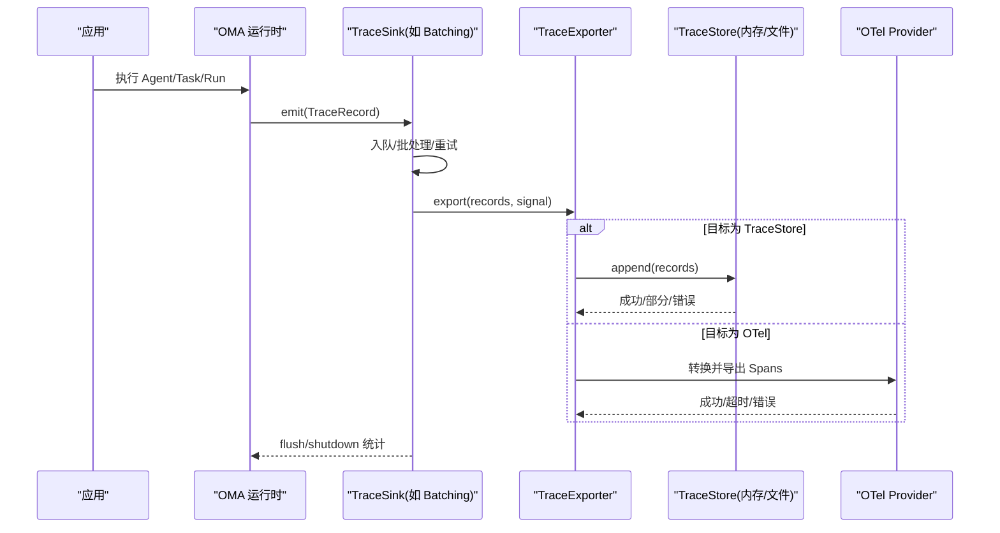
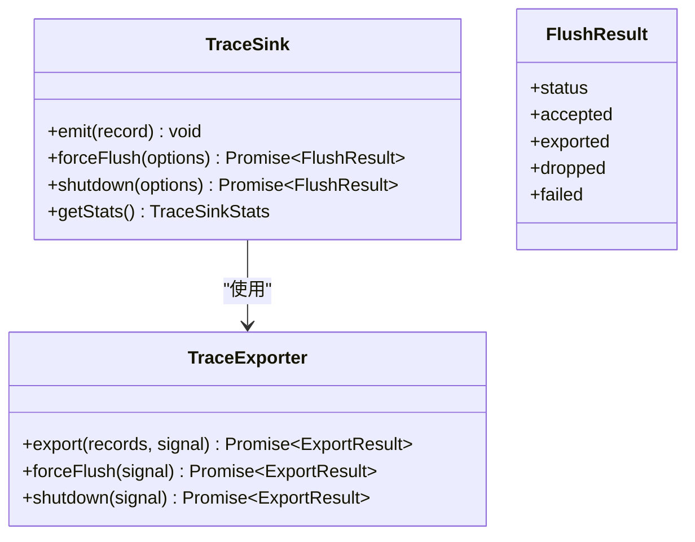
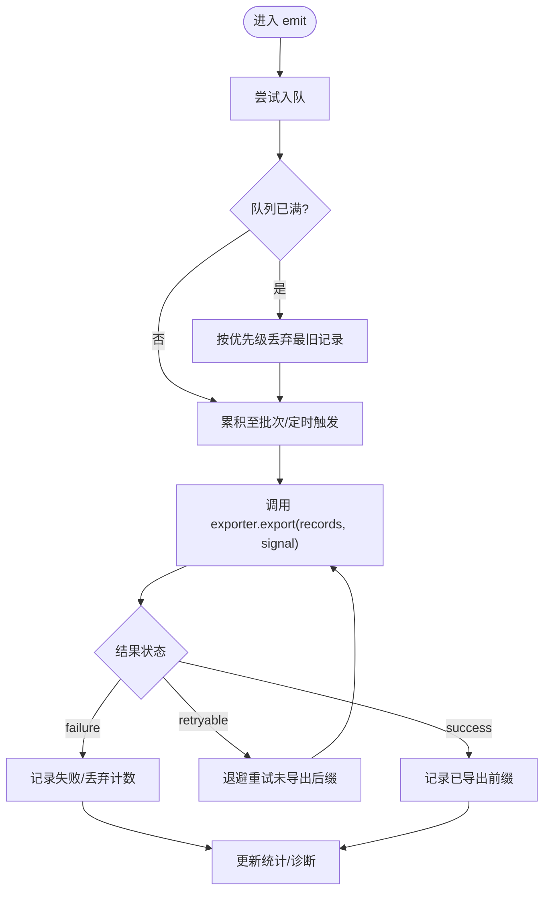
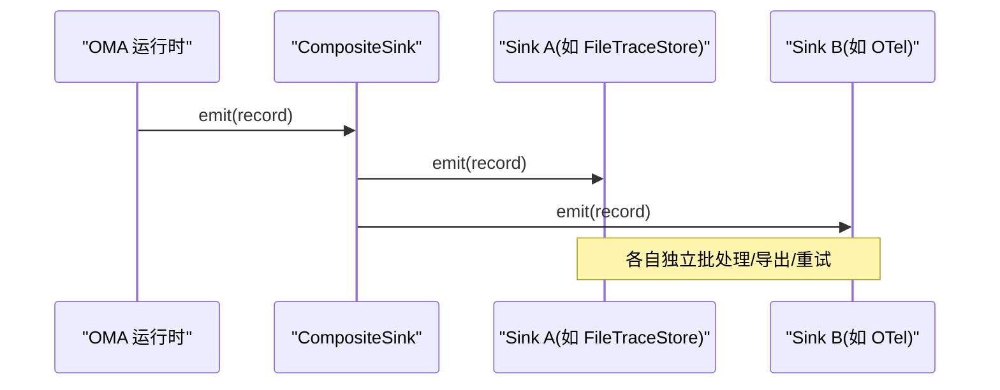
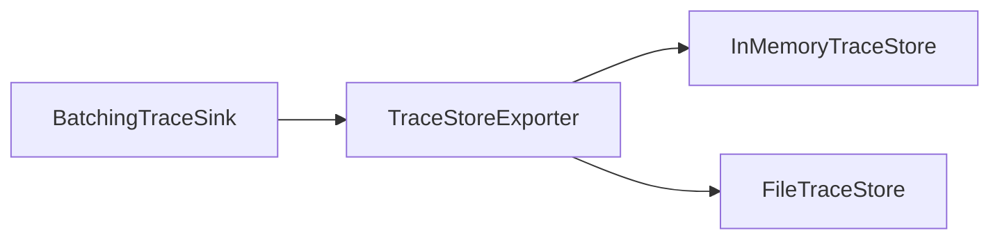
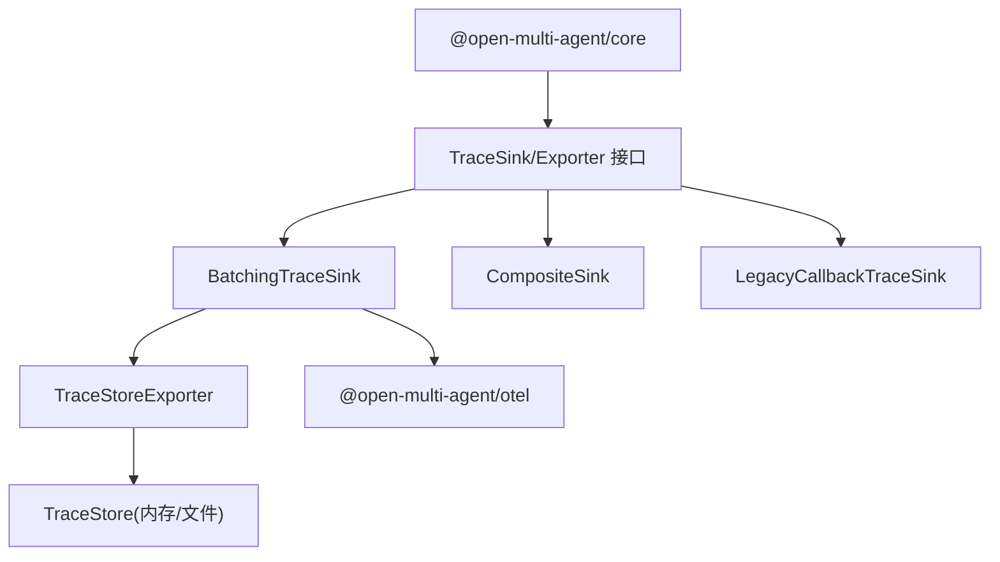

# 可观测性集成

<cite>
**本文引用的文件**
- [observability.md](file://docs/observability.md)
- [observability-performance.md](file://docs/observability-performance.md)
- [otel README.md](file://packages/otel/README.md)
- [sink.ts](file://packages/core/src/observability/sink.ts)
- [batching.ts](file://packages/core/src/observability/batching.ts)
- [composite.ts](file://packages/core/src/observability/composite.ts)
- [in-memory-store.ts](file://packages/core/src/observability/in-memory-store.ts)
- [file-store.ts](file://packages/core/src/observability/file-store.ts)
- [store-exporter.ts](file://packages/core/src/observability/store-exporter.ts)
- [legacy-callback.ts](file://packages/core/src/observability/legacy-callback.ts)
- [runtime.ts](file://packages/core/src/observability/runtime.ts)
- [index.ts](file://packages/core/src/observability/index.ts)
</cite>

## 目录
1. [简介](#简介)
2. [项目结构](#项目结构)
3. [核心组件](#核心组件)
4. [架构总览](#架构总览)
5. [详细组件分析](#详细组件分析)
6. [依赖关系分析](#依赖关系分析)
7. [性能考量](#性能考量)
8. [故障排查指南](#故障排查指南)
9. [结论](#结论)
10. [附录：与主流平台集成示例](#附录：与主流平台集成示例)

## 简介
本章节概述 Open Multi-Agent（OMA）的可观测性能力，包括三层遥测：实时进度事件、结构化追踪跨度，以及离线单任务 DAG/Waterfall 查看器。文档聚焦 TraceSink 接口及其多种实现（内存存储、文件导出、远程传输），批处理机制 BatchingTraceSink 的配置与优化，复合接收器 CompositeSink 的多后端并发发送，指标收集、追踪采样与性能监控配置，以及与 Jaeger、Prometheus、ELK Stack 等平台的集成方式。同时提供调试工具与故障排查建议，帮助开发者分析和优化工具调用性能。

## 项目结构
OMA 的可观测性子系统位于 core 包的 observability 目录，并通过独立包 @open-multi-agent/otel 适配 OpenTelemetry。关键文件职责如下：
- sink.ts：定义 TraceSink、TraceExporter、FlushResult、ExportResult、诊断与捕获策略等核心接口与类型。
- batching.ts：实现 BatchingTraceSink，负责队列、批量、重试、超时与丢弃策略。
- composite.ts：实现 CompositeSink，将同一记录广播到多个 Sink。
- in-memory-store.ts / file-store.ts：TraceStore 的内存与文件参考实现。
- store-exporter.ts：将 TraceStore 暴露为 TraceExporter，供 BatchingTraceSink 使用。
- legacy-callback.ts：兼容旧版 onTrace 回调的 Sink。
- runtime.ts：运行时注入与生命周期管理（flush/shutdown）。
- index.ts：对外统一导出。

图表来源
- [sink.ts:76-108](file://packages/core/src/observability/sink.ts#L76-L108)
- [batching.ts](file://packages/core/src/observability/batching.ts)
- [composite.ts](file://packages/core/src/observability/composite.ts)
- [in-memory-store.ts](file://packages/core/src/observability/in-memory-store.ts)
- [file-store.ts](file://packages/core/src/observability/file-store.ts)
- [store-exporter.ts](file://packages/core/src/observability/store-exporter.ts)
- [otel README.md:17-63](file://packages/otel/README.md#L17-L63)

章节来源
- [observability.md:185-222](file://docs/observability.md#L185-L222)
- [observability.md:224-295](file://docs/observability.md#L224-L295)
- [otel README.md:17-63](file://packages/otel/README.md#L17-L63)

## 核心组件
- TraceSink：同步热路径契约，emit(record) 必须快速返回且不被业务执行等待；支持 forceFlush 与 shutdown 生命周期控制。
- TraceExporter：异步批量交付契约，export(records, signal) 返回 ExportResult，指示成功、可重试或失败，并给出已导出前缀长度。
- BatchingTraceSink：基于 TraceExporter 的批处理 Sink，内置队列容量、批量大小、调度延迟、导出超时、重试与退避、丢弃优先级等。
- CompositeSink：将同一 TraceRecord 广播到多个 Sink，便于同时写入本地存储与远端系统。
- TraceStore + TraceStoreExporter：以 TraceStore 为持久化抽象，InMemoryTraceStore 用于测试与本地调试，FileTraceStore 用于单进程持久化；通过 TraceStoreExporter 接入批处理链路。
- LegacyCallbackTraceSink：兼容旧版 onTrace 回调，保持向后兼容。
- @open-multi-agent/otel：将 OBS-2 TraceRecord 转换为 OTel Span，交由应用自管的 TracerProvider 导出。

章节来源
- [sink.ts:15-31](file://packages/core/src/observability/sink.ts#L15-L31)
- [sink.ts:76-108](file://packages/core/src/observability/sink.ts#L76-L108)
- [observability.md:185-222](file://docs/observability.md#L185-L222)
- [observability.md:224-295](file://docs/observability.md#L224-L295)
- [otel README.md:17-63](file://packages/otel/README.md#L17-L63)

## 架构总览
下图展示从运行期产生 TraceRecord，经 Sink 批处理与导出，最终进入不同后端的整体流程。

图表来源
- [sink.ts:15-31](file://packages/core/src/observability/sink.ts#L15-L31)
- [sink.ts:76-108](file://packages/core/src/observability/sink.ts#L76-L108)
- [store-exporter.ts](file://packages/core/src/observability/store-exporter.ts)
- [otel README.md:17-63](file://packages/otel/README.md#L17-L63)

## 详细组件分析

### TraceSink 接口与生命周期
- emit：同步非阻塞，绝不被业务逻辑 await。
- forceFlush：捕获“接受水位线”，承诺在此之前的记录已导出或明确标记失败/丢弃；结果包含 accepted/exported/dropped/failed 计数。
- shutdown：原子停止接受、刷新截止点、关闭导出器；幂等；之后 emit 被拒绝并诊断。
- getStats：可选，返回接受、导出、重试、失败、丢弃、队列记录数/字节数、最近错误码等。

图表来源
- [sink.ts:15-31](file://packages/core/src/observability/sink.ts#L15-L31)
- [sink.ts:76-108](file://packages/core/src/observability/sink.ts#L76-L108)

章节来源
- [observability.md:527-543](file://docs/observability.md#L527-L543)
- [sink.ts:76-108](file://packages/core/src/observability/sink.ts#L76-L108)

### 批处理机制 BatchingTraceSink
- 队列与容量：默认限制队列记录数、队列字节数、单条最大记录大小，防止无界增长。
- 批处理参数：批量大小、调度延迟、导出超时、重试次数、指数退避（含抖动与上限）。
- 丢弃策略：当需要空间时，按优先级丢弃 stream_chunk > 其他事件 > span_start > 自包含 span_end。
- 重试边界：仅对 retryable 结果、被拒绝的导出 promise 与导出超时进行重试；重试在传输工作线程中完成，不阻塞业务执行。
- 诊断与统计：内置诊断限流输出，避免递归；可通过 onDiagnostic 自定义处理。

图表来源
- [observability.md:572-599](file://docs/observability.md#L572-L599)
- [sink.ts:15-31](file://packages/core/src/observability/sink.ts#L15-L31)

章节来源
- [observability.md:572-599](file://docs/observability.md#L572-L599)

### 复合接收器 CompositeSink
- 功能：将同一条 TraceRecord 广播到多个 Sink，例如同时写入本地 FileTraceStore 与远程 OTel 导出器。
- 适用场景：多后端归档、灰度切换、A/B 对比、合规审计与生产导出并存。
- 注意事项：各 Sink 独立生命周期，需分别管理 flush/shutdown；任一 Sink 失败不影响其他 Sink 的导出。

图表来源
- [composite.ts](file://packages/core/src/observability/composite.ts)
- [observability.md:220-222](file://docs/observability.md#L220-L222)

章节来源
- [observability.md:220-222](file://docs/observability.md#L220-L222)

### 存储与导出：InMemoryTraceStore 与 FileTraceStore
- InMemoryTraceStore：无外部依赖，适合单元测试、本地检查与短生命周期进程；返回内部记录的副本而非可变引用。
- FileTraceStore：Node 专属单进程参考实现，采用追加式 NDJSON 信封格式，具备恢复、删除、保留策略、压缩与 fsync 语义；打开时扫描日志重建索引，序列化读写。
- TraceStoreExporter：将 TraceStore 暴露为 TraceExporter，使 BatchingTraceSink 可将记录持久化到上述两种存储。

图表来源
- [observability.md:224-295](file://docs/observability.md#L224-L295)
- [store-exporter.ts](file://packages/core/src/observability/store-exporter.ts)
- [in-memory-store.ts](file://packages/core/src/observability/in-memory-store.ts)
- [file-store.ts](file://packages/core/src/observability/file-store.ts)

章节来源
- [observability.md:224-295](file://docs/observability.md#L224-L295)

### 兼容旧版 onTrace：LegacyCallbackTraceSink
- 作用：将 v2 记录映射回旧版 TraceEvent 对象，保持 onTrace 回调的向后兼容。
- 迁移建议：逐步将传输代码迁移到 observability.sinks 路径，可使用 LegacyCallbackTraceSink 作为过渡。

章节来源
- [observability.md:616-666](file://docs/observability.md#L616-L666)

### OpenTelemetry 适配器 createOtelTraceSink
- 职责：将 OBS-2 TraceRecord 转换为 OTel Span，由应用提供的 TracerProvider 负责实际导出。
- 所有权：绝不读取/注册/替换全局 provider；应用拥有 provider 生命周期。
- 映射：run/coordinator/task/agent/LLM/tool/consensus/checkpoint 等成为 Span；retry/verdict/stream 成为事件；DAG/restore/consumed 成为链接。
- 隐私：默认不导出提示、补全、工具参数/结果、凭据、推理内容；仅转发低敏感度的 oma.* 白名单字段。

章节来源
- [observability.md:459-525](file://docs/observability.md#L459-L525)
- [otel README.md:17-63](file://packages/otel/README.md#L17-L63)
- [otel README.md:79-135](file://packages/otel/README.md#L79-L135)

## 依赖关系分析
- 松耦合：TraceSink/TraceExporter 为稳定契约，具体实现可替换（内存/文件/OTel/自定义）。
- 组合优先：CompositeSink 允许将多个 Sink 组合，满足多后端需求。
- 运行时解耦：运行时只依赖接口，不关心具体导出目标；失败被隔离在可观测性统计与诊断中，不影响业务结果。
- 外部依赖：@open-multi-agent/otel 为可选包，core 安装不包含 OTel 运行时依赖。

图表来源
- [sink.ts:76-108](file://packages/core/src/observability/sink.ts#L76-L108)
- [otel README.md:1-15](file://packages/otel/README.md#L1-L15)

章节来源
- [observability.md:459-463](file://docs/observability.md#L459-L463)

## 性能考量
- 预算与基线：文档记录了无 sink、legacy 回调、批处理入队、OTel 转换等路径的微基准与 CI 门限，确保回归可控。
- 批处理默认值：队列记录/字节上限、单条记录上限、批量大小、调度延迟、导出超时、重试次数与退避策略均经过权衡，兼顾吞吐与延迟。
- 存储性能：InMemoryTraceStore 与 FileTraceStore 的 append/fsync/reopen/query/compaction 均有基准数据，便于评估不同规模下的表现。
- 内容捕获边界：默认仅元数据，避免高基数标签与敏感数据带来的开销。

章节来源
- [observability-performance.md:8-20](file://docs/observability-performance.md#L8-L20)
- [observability-performance.md:64-118](file://docs/observability-performance.md#L64-L118)
- [observability.md:572-599](file://docs/observability.md#L572-L599)

## 故障排查指南
- 诊断通道：内置诊断限流输出，避免递归；可通过 onDiagnostic 自定义处理；诊断消息不含 TraceRecord 或原始异常。
- 常见错误码：sink_emit_failed、queue_full、record_too_large、export_failed、export_timeout、flush_timeout、shutdown_failed、emit_after_shutdown。
- 队列压力：当队列满时会按优先级丢弃记录；结合 getStats 与诊断信息定位瓶颈（批量大小、调度间隔、导出超时、重试策略）。
- 存储问题：FileTraceStore 打开失败会抛出结构化错误；崩溃恢复仅重放已提交批次；fsync/close 是持久化边界。
- OTel 适配：provider 拒绝或超时转化为导出结果与诊断，不影响业务；确认应用正确传入 tracer/tracerProvider，并按需设置 shutdownOnShutdown。

章节来源
- [observability.md:572-599](file://docs/observability.md#L572-L599)
- [observability.md:297-375](file://docs/observability.md#L297-L375)
- [otel README.md:40-77](file://packages/otel/README.md#L40-L77)

## 结论
OMA 的可观测性体系以 TraceSink/Exporter 为核心契约，通过 BatchingTraceSink 提供高性能批处理与可靠的重试/丢弃策略，借助 CompositeSink 灵活组合多后端，并以 TraceStore 抽象屏蔽存储差异。配合 @open-multi-agent/otel 可无缝对接 OpenTelemetry 生态。默认隐私边界与性能预算确保在生产环境安全、可控地启用可观测性。

## 附录：与主流平台集成示例
- Jaeger：通过 @open-multi-agent/otel 将 TraceRecord 转为 OTel Span，由应用配置的 OTLP 或 Jaeger 导出器上报；无需额外 SDK 导入到 core。
- Prometheus：适配器不导出指标，避免高基数标签；可在应用层采集必要指标（如导出耗时、丢弃计数）并暴露给 Prometheus。
- ELK Stack：将 OTel 数据经 OTLP 或 Filebeat/Logstash 转存至 Elasticsearch，利用 Kibana 可视化追踪与聚合分析。
- 本地调试：使用 InMemoryTraceStore 或 FileTraceStore 保存 trace，再结合 Run Viewer 生成静态 HTML 进行离线分析。

章节来源
- [observability.md:459-525](file://docs/observability.md#L459-L525)
- [observability.md:670-741](file://docs/observability.md#L670-L741)
- [otel README.md:1-15](file://packages/otel/README.md#L1-L15)